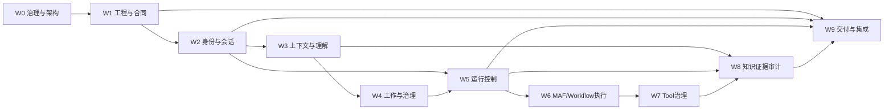

# Chat 项目计划

## 1. 计划目标

以[完整目标架构](./docs/overall-architecture-proposal.md)为边界，按依赖顺序交付一个独立运行、持续运营的 Chat 产品：从会话连续、上下文与意图，到工作推进、受控执行、运行恢复、知识证据、可靠交付和外部集成，最终形成完整用户闭环。

阶段只决定交付顺序和阶段验收，不能重新定义产品范围。任何阶段的 Schema、API 或代码都必须能演进到目标模块、合同和状态所有权，禁止为了短期交付建立另一套临时事实模型。

## 2. 计划原则

1. 先审核完整场景、目标架构和模块合同，再做领域详细设计。
2. 先建立权威产品事实，再让 Runtime、活动流、Worker 和外部集成消费这些事实。
3. 每个能力依次经过：研究证据 -> 方案审核 -> 详细设计 -> 实现 -> 故障验证 -> 用户场景验收。
4. MAF API 与行为先查安装版、源码和测试；产品架构不能由 MAF 类型反推。
5. Product Session、MAF Session/Checkpoint、AG-UI Thread、Product Run 和 Run Attempt 始终分开。
6. 每个阶段明确“已兑现保证”和“仍未兑现保证”，不把局部测试外推为完整恢复能力。
7. 真实模型、真实浏览器、进程故障、重复请求和外部副作用验证不能被 Mock 成功路径替代。

## 3. 目标工作流拆分

这 10 条工作流覆盖目标架构，项目经理可在阶段内进一步拆 Epic、Story 和验证任务。

| 工作流 | 主要模块/组件 | 主要交付物 | 前置依赖 | 验收结果 |
|---|---|---|---|---|
| W0 产品治理与架构 | 全局 | 产品定义、经验约束、目标架构、ADR、术语和ID合同 | 无 | 4类读者能用文档继续决策、排期和开发 |
| W1 工程与合同基础 | Bootstrap、Interfaces、测试基础 | 可运行前后端、配置、OpenAPI/AG-UI合同、错误分类、CI/本地验证 | W0技术路线 | 真实MAF回合和合同测试稳定 |
| W2 身份与产品会话 | Identity与Channel Binding、Conversation、Product Store | Principal/Scope、Session、Interaction、Message Tree、生命周期和查询 | W0、W1 | 输入先持久化，历史可重开，越权被拒绝 |
| W3 上下文与理解 | Context、Memory、Collaboration | ContextPackage、唯一历史装配器、受控Memory、多Intent、澄清和用户修正 | W2 | 用户可见并修正系统理解和上下文 |
| W4 工作与执行治理 | Collaboration、Interaction协调器 | Work/Plan/Action、Draft、Approval、执行门和版本失效 | W2、W3 | 用户批准的内容与实际执行严格一致 |
| W5 产品运行控制 | Run管理、Runtime Store、AG-UI协调 | Product Run/Attempt、Job、Event Cursor、Cancel/Retry/Resume、Finalization Gate | W2、W4 | 无假成功；刷新和断线能回到权威状态 |
| W6 MAF/Workflow执行 | MAF Adapter、Worker、Scheduler/Reconciler | Agent/History、Workflow/Checkpoint、Lease、Worker接管和HITL映射 | W5 | 失联可判断，从验证过的安全点恢复 |
| W7 Tool副作用治理 | Tool执行 | Tool Catalog、Approval桥接、Ledger、幂等、结果未知和对账 | W4、W5、W6 | 不盲目重做外部副作用，有处置证据 |
| W8 知识、证据与审计 | Memory、Evidence、Run Trace、Artifact/Index | Memory候选、Evidence、Provenance、Trace、失效传播和运营视图 | W2、W3、W5、W7 | 结果可验证，来源失效能正确降级 |
| W9 交付与外部集成 | Delivery、Identity与Channel Binding、具体Channel Adapter、Channel Adapter Host、Interaction Ingress | Outbox、Delivery/Receipt、Binding、平台/Bridge合同版本、跨入口连续性 | W1、W2、W5、W8 | 平台不直连核心；送达可追踪，多入口不双写、不越权 |

### 3.1 工作流依赖

## 4. 当前状态总览

| 交付阶段 | 目标 | 当前状态 |
|---|---|---|
| 0. 产品定义与治理 | 固定独立产品身份、6个问题、完整闭环和协作规则 | `产品身份已纠正；经验约束已补充` |
| 1. 工程与真实链路 | 建立独立前后端、MAF、AG-UI、调试和验证基线 | `真实模型门通过；2项收尾` |
| 2. 目标架构与合同基线 | 审核目标拓扑、模块、状态、合同、恢复矩阵 | `重写完成，待用户审核` |
| 3. 产品事实与完成历史 | 身份、Session、Message、Run/Attempt和历史恢复 | `Phase 1文本底座完成；完整身份、Retry和树操作继续` |
| 4. 上下文、意图、工作与执行门 | Context、Intent、Work、Draft、Approval | `未开始` |
| 5. 持久执行与活动流 | Job/Event、Worker、Lease、重连和Reconciler | `未开始` |
| 6. Tool、Workflow与HITL恢复 | Tool Ledger、对账、Checkpoint和持久Interrupt | `3个纵向种子完成；通用恢复能力未开始` |
| 7. 知识、证据、交付与运营 | Memory、Evidence、Provenance、Outbox、Trace和告警 | `未开始` |
| 8. 外部入口连续性 | 通过具体Channel Adapter接入终端平台，并通过Bridge Adapter与OPC-OS Chat对等集成 | `未开始` |

## 5. 阶段 0：产品定义与治理

目标：让所有后续设计以同一个独立 Chat 产品身份、完整场景和经验约束为前提。

任务：

- [x] 固定要解决的 6 个问题和 6 个核心目标。
- [x] 固定完整产品闭环和核心对象。
- [x] 确认后端 MAF、前后端 AG-UI、React 自研 UI 技术路线。
- [x] 建立`AGENTS.md`、`PROJECT_CONTEXT.md`、`PROJECT_PLAN.md`、`PROJECT_STATE.md`和`README.md`。
- [x] 纠正产品身份：Chat 是独立完整产品，OPC-OS Chat 是外部集成关系。
- [x] 新增`PROJECT_LESSONS.md`，记录10个反例，并把参考可追溯性、入口拓扑、完整Payload可编辑性、对象可理解性和操作可走通性加入回复检查。
- [ ] 用户审核本轮纠正是否准确进入稳定项目文档。

完成门：项目定义无需依赖 OPC-OS 也能完整描述用户、价值、责任和产品边界；所有项目回复前强制读取经验文档。

## 6. 阶段 1：工程与真实链路

目标：建立不依赖旧`opc-os/chat`运行环境的独立工程和可重复验证入口。

已完成：

- [x] 初始化私有 Git 仓库、Python 3.12/uv、React 19/TypeScript/Vite。
- [x] 建立 FastAPI、MAF Agent 和 AG-UI HTTP/SSE 端点。
- [x] 建立无密钥 Bootstrap Agent，以及支持按数组扩展Provider/模型的私有后端JSON配置路径。
- [x] 建立 Tailwind CSS、Radix UI、Lucide React和局部页面状态基础。
- [x] 建立后端测试、前端类型检查/构建和一键验证脚本。
- [x] 完成浏览器真实回合、窄屏检查和真实模型 AG-UI 回合。
- [x] 完成逐次模型调用审批纵向切片：服务端Provider/模型目录与联动选择、固定Key/类型化Value可读编辑、同源Provider JSON、完整请求编辑、版本/Hash失效、二次审批、精确发送、审批协议消息隔离、放弃恢复输入和真实Provider回合。
- [x] 建立 VS Code 前后端/全栈调试与定向端口、进程清理。

剩余：

- [x] 建立Provider超时、发送后取消和结果未知恢复合同测试；真实双Provider成功路径已验证，故障路径不做可能产生未知计费的真实外部重放。
- [ ] 固定旧项目“复用、重写、仅参考”的文件级清单。

完成门：空数据环境可重复启动，成功和关键失败路径均有真实链路证据；不迁移旧数据库、历史或密钥。

## 7. 阶段 2：目标架构与合同基线

目标：在任何正式领域 Schema 和模块实现之前，冻结能承载完整场景的架构边界。

任务：

- [x] 完成 MAF、pi、nanobot、QwenPaw 和 LibreChat 的限定源码研究与知识同步；QwenPaw专项覆盖Web/Channel/Queue/统一请求入口拓扑。
- [x] 完成 Session 9 个能力域、74 项能力和 R0-R6 恢复分级。
- [x] 完成 Session Phase 0-8 的任务与依赖路线。
- [x] 重写[总体架构研究](./docs/overall-architecture-research.md)，公开错误修订、研究过程、证据、参考覆盖和项目推导。
- [x] 重写[总体架构候选](./docs/overall-architecture-proposal.md)，按pi、nanobot、QwenPaw和LibreChat真实结构推导Web/Channel Adapter、Interaction Ingress、10个产品与应用模块、合同、状态、失败恢复和8个场景。
- [x] 新增并补全[架构新手导读](./docs/architecture-beginner-guide.md)：按前端View、协议DTO、内部Envelope、产品领域对象和MAF运行对象5层展开；从“发送/批准”两个用户动作串起数据库、Session、Tool、Provider请求、响应解析、产品提交和React渲染；同时对照当前代码链与目标链。
- [ ] 用户审核目标架构的8项决定。
- [ ] 审核模块公开合同、ID链、错误分类、并发/幂等原则和四个提交门。
- [ ] 建立 MAF/AG-UI 安装版合同测试设计和依赖升级门。
- [ ] 把 Session R0-R6 验收矩阵映射到 Conversation、Context、Collaboration、Run、Tool执行、Delivery 与 MAF Runtime 组件。
- [ ] 为每个模块建立详细设计任务、负责人边界和验收清单；不冻结字段实现。

完成门：架构师能继续出数据、接口、部署和安全方案；项目经理能排 W2-W9；开发能知道模块和合同；产品负责人批准场景覆盖和设计原因。

## 8. 阶段 3：产品事实与完成历史

目标：建立所有后续能力共同依赖的服务端权威事实，并支持已完成和失败回合的恢复。

主要方案任务：

- [x] 审核并实现Conversation与Run管理的Phase 1聚合、状态机和Application Service；完整Identity/Channel Binding仍待后续阶段。
- [x] 建立固定本地Scope、Product Session、Interaction和树兼容Message字段；真实Principal/Binding与分支操作尚未启用。
- [x] 建立Product Run、Run Attempt和稳定错误分类；不与Runtime Job合并。
- [x] 建立输入接纳门和产品成功终态门。
- [x] 建立Product Store迁移、短事务、CAS并发和启动恢复基础；备份、保留和容量策略仍待治理阶段。
- [x] 实现REST Session/Message/Run查询和AG-UI实时投影对齐。
- [x] 服务端唯一历史装配；防止Product History、Provider History和客户端消息重复。
- [ ] 实现创建、列出、打开、归档、重启恢复和失败重试。
- [ ] 固化 MAF HistoryProvider 保存、错误和终态顺序合同测试。
- [ ] 完成桌面、窄屏、重复提交、并发和重启端到端验证。

完成门：用户输入先于模型持久化；完成和失败回合可在重启后打开；Run/Attempt/Trace可解释。该门不表示活动流、Worker、Tool或Workflow恢复已经成立。

## 9. 阶段 4：上下文、意图、工作与执行门

目标：用户知道系统理解了什么、使用什么、准备做什么，并能把对话转成长期工作。

主要方案任务：

- [ ] 详细设计并审核 Context、Memory、Collaboration 与 Interaction协调器。
- [ ] 建立 Context Source、纳入/排除、Token 预算、版本和 Hash。
- [ ] 实现一个或多个 Intent、依据、不确定性、澄清和用户修正。
- [ ] 建立 WorkItem、TaskPlan、Plan Node、ActionItem、依赖和责任状态。
- [ ] 建立 ExecutionDraft、Capability/Risk Snapshot 和 Approval。
- [ ] 建立 Draft/Context/Plan/Policy/Capability/Request Hash 任一变化使批准失效的合同。
- [ ] 编译不可变 RunSpec，并确保 Worker 无权自行扩大能力。
- [ ] 建立对应前端 Context Review、Intent Review、Work Workspace 和 Execution Review。

完成门：一个多意图真实请求可形成可修改计划；高影响执行无法越过批准门；用户修改任一绑定项后旧批准不能运行。

## 10. 阶段 5：持久执行与活动流

目标：把 HTTP/SSE 连接与执行生命周期分开，支持活动 Run 重连和 Worker 失联处置。

主要方案任务：

- [ ] 详细设计 Runtime Job、Event Journal、Cursor、Control Inbox、Lease 和 Heartbeat。
- [ ] 实现 Scheduler/Reconciler 和 Execution Worker 进程角色。
- [ ] 实现 Run/Attempt/Job 显式映射、幂等领取、取消、Retry 和 Resume 决策。
- [ ] 实现 AG-UI 活动投影与 REST 产品事实的 Projection Reconciler。
- [ ] 浏览器断线只结束订阅，不隐式取消 Run。
- [ ] Worker 失联后标记 Attempt lost，并按安全点生成恢复或人工处置决定。
- [ ] 验证重复 Worker 领取、Lease 过期、API 重启、Worker 崩溃、事件重复和 Final 去重。

完成门：活动流可按游标接回；Worker 失联不会产生双执行或假成功。该门不表示任意 Tool 结果未知时可以自动恢复。

## 11. 阶段 6：Tool、Workflow 与 HITL 恢复

目标：外部副作用和长时 Workflow 在批准、故障和人工中断下可安全推进。

主要方案任务：

- [x] 建立嵌套Workflow可视化种子：MAF原生异构节点与两层子Workflow运行，标准AG-UI事件实时投影，Product Trace刷新恢复；该项不包含Checkpoint/HITL或跨进程恢复。
- [x] 建立受治理多Agent种子：可编辑且有Revision的Agent Profile、规划与审校Agent、确定性完整会话交接、两次Provider调用逐次审批、AG-UI节点投影和Product终态提交；该项不包含动态拓扑、群聊或持久Checkpoint。
- [x] 建立pi Agent Tool种子：MAF FunctionTool封装官方JSONL RPC；每次Provider请求和内部Tool调用分别进入可编辑审批，前端可配置真实Tool并查看模型/Tool/Token/耗时统计；启动将遗留执行收敛为中断，但不冒充通用副作用对账或R6恢复。
- [ ] 详细设计 Tool执行模块的Tool Catalog、Tool Operation Ledger、幂等和能力声明。
- [ ] 建立 MAF Function Middleware 到 Tool Gateway 的唯一执行路径。
- [ ] 工具参数动态扩权时回到持久 Approval，而不是进程内默认批准。
- [ ] 实现`result_unknown`、查询对账、补偿和人工处置。
- [ ] 设计 Product Run/Attempt 与 Workflow Checkpoint、图版本和 Interrupt 的映射。
- [ ] 实现持久 Approval 与 MAF/AG-UI Interrupt/Resume 双向接合。
- [ ] 验证工具请求前失败、请求后断线、重复回调、部分成功、补偿失败和跨进程 HITL。

完成门：只从验证过的安全点恢复；外部副作用结果未知时不盲目重做；不承诺通用 Exactly-once。

## 12. 阶段 7：知识、证据、交付与运营

目标：让结果可验证、知识受控生效、送达可追踪、故障可运营。

主要方案任务：

- [ ] 详细设计 Memory、Evidence、Delivery 和 Run Trace/运营查询。
- [ ] 建立 Memory Candidate、接受、纠正、删除、范围和有效性。
- [ ] 建立 Evidence、Artifact、Provenance Graph、验证和失效传播。
- [ ] 建立 Transactional Outbox、Delivery Worker、Attempt、Receipt、重试和死信。
- [ ] 建立用户 Trace、审计策略、Correlation、运营视图、告警和人工处置。
- [ ] 验证来源删除/权限撤销对 Evidence、Memory、Context 和 Work 的传播。
- [ ] 验证 Run 成功但 Delivery 失败、重复投递、乱序回执和 Artifact 中断。

完成门：用户能回答“结果是什么、证据是什么、是否已送达、来源是否仍有效”；运维能定位并处置积压和失败。

## 13. 阶段 8：外部入口连续性

目标：在不改变Chat产品身份和事实源责任的前提下，通过具体Channel Adapter接入终端平台，并通过独立Bridge Adapter与OPC-OS Chat对等互操作。

主要方案任务：

- [ ] 获取并审核外部系统的身份、能力、消息、命令、事件和回执规范。
- [ ] 详细设计 Channel Binding、合同版本、来源 Envelope、入站幂等和撤销传播。
- [ ] 实现 Inbound Integration Gateway 和具体 Channel Adapter。
- [ ] 验证外部消息转为同一个 Chat Interaction，不复制第二套 Session/Work/Run 规则。
- [ ] 验证跨入口并发、重复输入、权限撤销、来源失效和 Delivery 回执。
- [ ] 完成兼容性、升级、审计和降级策略。

完成门：至少两个入口能够授权继续同一个 WorkItem，不重复执行、不越权、不形成双重事实源；任一外部系统不可用时，Chat 自身仍可独立运行。

## 14. Session 专项路线映射

Session 是 W2-W9 的横向能力，仍由两份专项材料维护：

1. [Session能力全集](./docs/session-capability-catalog.md)：9个能力域、74项能力、R0-R6恢复分级。
2. [Session交付路线](./docs/session-delivery-roadmap.md)：Phase 0-8、53个任务和场景验收。

| Session 路线 | 项目阶段 | 主要架构位置 |
|---|---|---|
| Phase 0 术语与恢复合同 | 阶段2 | W0/W1，跨全部模块 |
| Phase 1 产品会话与历史 | 阶段3 | Identity、Conversation、Run Trace |
| Phase 2 Run控制与并发 | 阶段3-5 | Conversation、Collaboration、Run管理 |
| Phase 3 生命周期、分支与长上下文 | 阶段3-4 | Conversation、Context、Collaboration |
| Phase 4 活动流重连 | 阶段5 | Run管理/Runtime Store/AG-UI Reconciler |
| Phase 5 Worker恢复 | 阶段5 | Scheduler/Worker/Lease/Reconciler |
| Phase 6 Tool恢复 | 阶段6 | Tool执行/Evidence |
| Phase 7 Workflow/HITL恢复 | 阶段6 | Collaboration/Run管理/MAF Workflow |
| Phase 8 跨入口与治理 | 阶段7-8 | Identity与Channel Binding/Memory/Evidence/Delivery/Run Trace |

专项路线不能创造与总体架构冲突的对象或事实源；D1-D6 持久化方案只是阶段3中的子设计，需在总体架构和 Phase 0 合同通过后重新审核。

## 15. 全程质量门

每个阶段都必须满足：

1. 文档、代码、Schema、事件和实际行为一致。
2. 自动测试覆盖成功、失败、重复、并发和关键反例。
3. MAF/AG-UI 关键路径有安装版合同测试和升级回归。
4. 真实模型或 Agent 验证不能被 Mock 替代。
5. 浏览器端到端、响应式和可访问性不能被 API 测试替代。
6. 按能力注入断线、进程退出、超时、结果未知和恢复故障。
7. 密钥、数据库、历史、日志和构建产物不进入 Git。
8. 阶段完成必须列出已兑现和未兑现保证；用户价值审核不能被工程绿灯替代。
