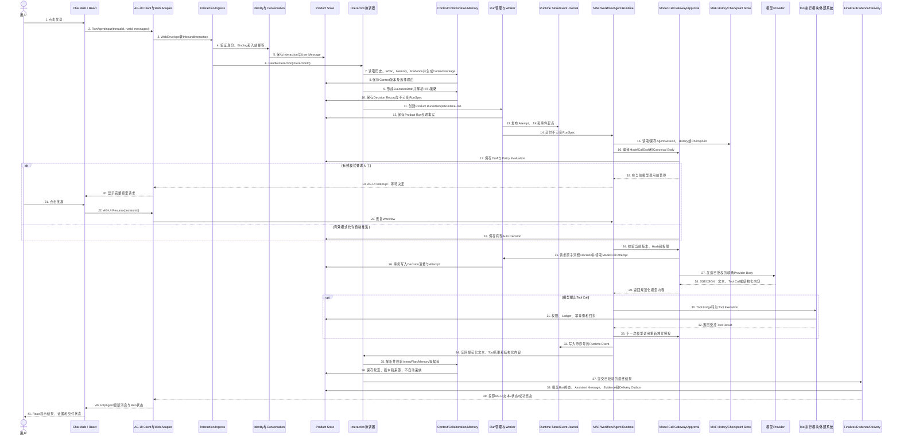
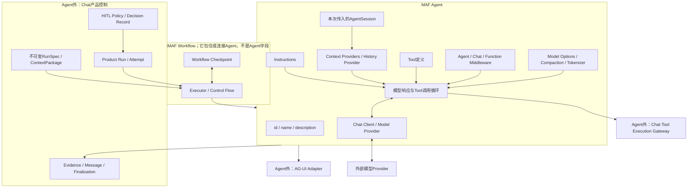

# Chat 架构新手导读：从前端对象到 Agent 内部

> 状态：目标架构解释已随总体架构获批；超级管理员对象与流程于2026-07-24补入，详细Schema/API仍待专项审核
> 更新日期：2026-07-30
> 作用：用普通语言解释[总体架构基线](./overall-architecture-proposal.md)，不单独创造另一套架构决定。
> 边界：本文只确认对象职责和关系，不冻结字段、数据库表名、API Schema或目录实现。
> 阅读提示：高风险名称的当前语义边界从[Chat概念资产索引](../概念空间/00-索引.md)进入；实现进度只以[PROJECT_STATE.md](../PROJECT_STATE.md)为准。本文标为“当前代码”的段落是2026-07-21写作快照，不拥有后续实现状态。

## 1. 先用一句话看懂整个系统

用户在前端输入一句话后，Chat不会把这句话直接丢给模型。它要依次完成5件事：

1. **接住输入**：确认是谁、来自哪里，并先保存用户真的说过什么。
2. **弄清任务**：选择本轮上下文，识别意图，形成工作、计划或待确认问题。
3. **守住执行门**：把将要发送给模型或工具的内容做成可审核草稿，用户批准后才执行。
4. **运行Agent**：MAF Agent使用模型、上下文和工具完成一次或多次运行步骤。
5. **提交结果**：保存消息、证据和运行终态，再把结果交付到Web或外部Channel。

可以把它想成一家工作室：

| 架构部分 | 小白理解 | 它不是 |
|---|---|---|
| Chat Web | 用户的工作台 | 不是数据库，也不是Agent本身 |
| Web/API Adapter | 前台接待，把浏览器协议翻译成内部请求 | 不是业务大脑 |
| 产品模块 | 档案、计划、审批、任务和证据的管理者 | 不是模型SDK |
| MAF Runtime Adapter | 把已经获准的任务交给MAF执行 | 不是产品事实源 |
| Agent | 一台可配置的智能执行引擎 | 不是整个Chat产品 |
| Product Store | 产品长期事实的权威档案 | 不是浏览器缓存或AG-UI快照 |

## 2. 一条请求从前端到后端到底经过什么

这一节不再从名词开始，而从用户的两个按钮开始：先点击“发送”，再点击“批准模型调用”。先看目标架构完整流程，第2.7节再对照当前代码实际已经做到哪里。

下面出现的领域对象仍是**架构级候选**，不表示字段和数据库表已经批准。

### 2.1 Agent里面到底有没有Session管理和Tool管理

简短答案是：**有运行时能力，但没有完整产品管理责任。**

#### Session为什么会同时出现在Agent内外

模型接口本身通常只处理一次请求；连续对话需要有人保存历史、上下文和恢复位置，所以MAF提供了运行时Session相关能力。但用户真正使用的“会话”还包含标题、归档、分支、权限、Work和Evidence，这不是MAF Agent应该拥有的。

| 位置 | Session相关部件 | 管什么 | 为什么需要 | 明确不管什么 |
|---|---|---|---|---|
| Agent内部/MAF运行时 | `AgentSession` | 运行Session ID、服务侧Continuation ID、Context Provider状态 | 让同一个Agent运行能延续模型侧和Provider侧状态 | 产品标题、归档、访问权、Work和Evidence |
| Agent内部/MAF运行时 | `HistoryProvider` | 在模型调用前加载MAF Message，调用后保存运行历史 | 模型需要看到经批准的连续上下文 | Product Message树和完整审计历史 |
| Agent外/MAF Workflow | Workflow Checkpoint | 保存流程走到哪个Executor、哪里暂停、怎样恢复 | 多步骤流程和HITL不能只依靠进程内调用栈 | Tool副作用是否真的发生、用户是否收到结果 |
| Agent外/Chat产品 | Conversation模块的Product Session | 用户创建、打开、分支、搜索、归档和恢复的协作容器 | 这是产品长期承诺和权限边界 | MAF内部控制流 |
| Agent外/前后端协议 | AG-UI Thread | 用`threadId`关联请求、事件、Interrupt和前端投影 | 浏览器需要知道哪些事件属于同一交互线程 | 用户授权和产品事实 |

所以不是“二选一”。Product Session回答“用户长期在做什么”；MAF AgentSession回答“Agent运行上下文怎样延续”；Workflow Checkpoint回答“控制流停在哪里”；AG-UI Thread回答“前端事件属于哪条线程”。

#### Tool为什么会同时出现在Agent内外

模型只能生成内容，不能天然读文件、查数据库或调用业务系统。要让模型提出行动，Agent必须知道有哪些Tool、每个Tool接受什么参数，以及怎样把Tool结果交回下一次模型调用。但“模型想调用”不能等于“产品已经授权并安全执行”。

| 位置 | Tool相关部件 | 管什么 | 为什么需要 |
|---|---|---|---|
| Agent内部/MAF | Tool Definition/Function Tool | 给模型看的名称、说明和输入Schema | 模型要知道可以提出哪些调用及参数格式 |
| Agent内部/MAF | Model/Tool Loop | 识别模型返回的Tool Call，把Tool Result放回后续模型上下文 | 多步Agent任务需要模型和工具交替 |
| Agent内部/MAF | Function Middleware/Tool Bridge | 拦截调用并转交产品Tool端口 | 防止MAF函数直接绕过产品治理 |
| Agent外/Chat产品 | Tool Catalog与Policy | 哪些Tool已安装、谁能用、风险和能力范围 | Tool存在不等于当前用户有权限 |
| Agent外/Chat产品 | Approval与Tool Execution Ledger | 记录获批参数、Hash、幂等键、派发、回执和结果未知 | 外部副作用必须可审核、对账和恢复 |
| Agent外/Chat产品 | Reconciler/Compensation | 查询外部结果、决定重试、补偿或人工处理 | 超时不代表外部操作一定失败 |

本项目已批准关闭不受控的自动Tool循环：每一次Provider调用都先生成独立ModelCallDraft和授权判断；当前默认人工审批，目标策略可在不可放宽下限内有界自动推进。模型返回Tool Call后，也必须先经过Tool执行模块，Tool结果若要再次交给模型，会生成下一份ModelCallDraft和新的独立授权判断。

### 2.2 后端到底有没有数据库

目标架构有数据库，而且数据库不是一个“什么都往里塞”的黑盒。逻辑上至少有5类Store：

| 逻辑Store | 保存什么 | 为什么必须保存 | 起点物理实现 |
|---|---|---|---|
| Product Store | Principal、Product Session、Interaction、Message、Context、Work、ExecutionDraft、RunSpec、HITL Policy、Decision Record、Approval、Product Run、Tool Execution、Evidence、Memory、Delivery等产品事实 | 页面刷新、服务重启和长期审计后仍然成立 | 已批准以SQLite作为实现起点 |
| Runtime Store / Event Journal | Runtime Job、Run Attempt所有权、Lease、Heartbeat、运行事件序号、控制请求 | HTTP断线后Run继续；Worker失联后能判断接管和重放 | 可先使用同一SQLite文件中的独立表/Repository，需并发验证 |
| MAF History / Checkpoint Store | `AgentSession`序列化状态、History Provider数据、Workflow Checkpoint | 恢复模型上下文和MAF控制流 | 可物理共用SQLite，逻辑Schema和迁移独立 |
| AG-UI Snapshot Store | 当前Thread的Message/State/Interrupt协议投影 | 浏览器Hydrate和活动线程恢复 | 可选投影Store；不能替Product Store |
| Artifact Store | 报告、附件和其他大文件内容 | 大文件不适合全部塞进关系表 | 本地文件系统起步；哈希和元数据归Evidence |

“逻辑上5个Store”不等于必须部署5个数据库服务。可以先是`1个SQLite文件 + 1个文件目录`，但每类状态必须由自己的模块和Repository读写，不能让MAF History表替代Product Message，也不能让AG-UI Snapshot替代Product Session。

**当前代码事实**：Product Session、Message、Product Run/Attempt、ExecutionDraft、RunSpec、HITL Policy、Decision/Grant/Consumption、Provider Attempt、Product Harness和Trace均已进入SQLite Product Store；Runtime Job/Event Journal/Control Command/Worker Heartbeat使用同库独立Runtime表。持续协作主Workflow的MAF Checkpoint与Interrupt Link已经持久化并完成跨进程安全点恢复。旧模型审批/演示Workflow仍有进程内状态，通用Tool副作用账本、独立Evidence/Artifact和Delivery Store尚未完成；具体实现进度仍只以`PROJECT_STATE.md`为准。

### 2.3 用户点击“发送”后的目标架构全景



这张图有两个重点：

1. 模型调用之前，用户输入已经是Product Store里的正式事实；模型失败不会让输入消失。
2. Provider返回之后，结果还要经过解析、校验和产品提交；只有MAF返回文本并不等于Product Run已经成功。

### 2.4 “发送”到“出现审批面板”的逐步解释

| 步骤 | 负责组件 | 输入 | 做什么 | 读写Store | 用户看到什么 |
|---|---|---|---|---|---|
| 1 | Conversation Workspace | `ComposerDraft` | 点击发送，冻结本次输入，避免按钮重复触发 | 浏览器仅保留短期草稿 | 自己的消息立即出现为待接纳状态 |
| 2 | AG-UI Client Adapter | 文本、附件引用、threadId | 创建`RunAgentInput`并POST到AG-UI端点 | 无权威写入 | 页面显示“处理中” |
| 3 | Web/API Adapter | AG-UI DTO和认证声明 | 终止HTTP/AG-UI协议，转成`WebEnvelope` | 可写接入Trace，不写领域表 | 无额外变化 |
| 4 | Interaction Ingress | `WebEnvelope` | 验证来源、请求ID和幂等键；调用Identity取得可信`RequestContext` | Identity/Product Store | 越权或重复请求得到稳定结果 |
| 5 | Conversation | 可信请求 | 原子创建Interaction和User Message | Product Store | 输入正式保存，刷新后仍存在 |
| 6 | Interaction协调器 | interactionId | 决定要澄清、更新工作还是启动受控模型Run | 只调用模块公开合同 | 可能直接出现澄清，不一定运行模型 |
| 7 | Context | Message、Work、Memory、Evidence引用 | 选择、裁剪并保存`ContextPackage` | Product Store读取和写入Context版本 | 用户可查看本轮采用的上下文 |
| 8 | Collaboration / HITL Policy Resolver | Intent、Plan、Context和能力边界 | 形成ExecutionDraft，解析人工或自动决定，并编译不可变RunSpec | Product Store | 必要时出现Execution Review；自动推进也显示依据 |
| 9 | Run管理 | RunSpec | 建立Product Run、Run Attempt与Runtime Job | Product Store + Runtime Store | Run状态变成准备中 |
| 10 | Worker + MAF Runtime Adapter | RunSpec | 启动或恢复Workflow，映射MAF AgentSession/Checkpoint | Runtime Store + MAF Store | Run状态变成运行中或等待某个决策点 |
| 11 | Model Call Compiler | Materialized Context、Instructions、Tools和模型参数 | 编译规范Provider Body，生成bytes、Hash和ModelCallDraft | Product Store | 尚未向Provider发送 |
| 12 | HITL Policy Resolver / Workflow | ModelCallDraft | 独立解析授权；人工模式通过Interrupt暂停，自动模式保存Decision Record后继续 | Product Store + MAF Checkpoint Store | 人工时显示审核卡片；自动时显示“按策略通过” |

### 2.5 需要人工时，用户点击“批准”后模型请求怎样真正发出

1. 前端不会重新拼Provider请求，只发送`approvalId`和`approve`决定，通过AG-UI Resume恢复原Workflow。
2. Approval Service重新检查Draft仍是当前版本、Hash没有变化、用户权限仍有效、没有其他Worker已经消费审批。
3. Run管理创建一个Model Call Attempt并原子消费Decision Record，保证同一份批准不会被发送两次；自动模式也走同一原子消费边界。
4. `PreparedProviderRequest`直接引用审核时生成的同一份Canonical JSON bytes。
5. Provider Router根据服务端Provider目录选择Transport和凭据；API Key永远不进入审核草稿或浏览器。
6. Exact Provider Transport把已批准bytes原样作为HTTP Body发送。它不能在发送前再偷偷补Prompt、历史或Tools。

这就是“用户看见并批准的请求等于实际发送请求”的技术含义。

另外两个按钮走不同分支：点击“保存修改”时，前端通过REST提交完整Provider请求和旧Hash，后端生成新Draft、新Hash和新Approval，再用AG-UI Resume让Workflow停到新审批点；点击“放弃”时，只解决当前Interrupt并结束本次调用，不创建Model Call Attempt，原输入回到编辑框。

### 2.6 模型返回后怎样解析、保存并显示

模型回程不是一步完成，而是5层处理：

| 层 | 负责模块 | 输入 | 输出 | 为什么不能跳过 |
|---|---|---|---|---|
| 1. Provider协议解码 | Provider Transport/Response Decoder | HTTP状态、SSE行或JSON Body | 统一的文本Delta、Tool Call、Usage、结构化内容或Provider错误 | 不同Provider返回格式不同，错误必须脱敏 |
| 2. MAF运行归一化 | MAF Agent/Workflow + Runtime Event Translator | MAF Response/Content/Workflow事件 | 带runId、attemptId、序号的Runtime Event | 需要重连、去重和恢复，不直接依赖Provider JSON |
| 3. 产品候选解析 | Interaction协调器/Collaboration/Tool Bridge | 文本、Tool Call、结构化候选 | Assistant回复候选、Intent/Plan/Memory候选或Tool Execution请求 | 模型输出只是候选，不能自动改产品事实或执行副作用 |
| 4. 产品提交 | Run Finalizer + Conversation/Evidence/Delivery | 已校验结果、Tool状态和证据 | Run终态、Assistant Message、Evidence、Outbox | 防止MAF结束但数据库没写完的假成功 |
| 5. 前端投影 | AG-UI Projector + `HttpAgent` + React组件 | Runtime/Product事件 | 流式文本、审批卡片、Run状态、最终Message和Evidence View | AG-UI只是投影；刷新后仍要以REST/Product Store为基线 |

流式文本可以在运行中作为“正在生成”的临时投影显示，但`RUN_FINISHED(succeeded)`必须晚于产品提交门。若Provider返回Tool Call，Tool Bridge不会直接执行Python函数，而是先建立Tool Execution并经过权限、Approval、Ledger和幂等检查。

### 2.7 当前代码实际已经跑通的链路

当前纵向切片比目标架构短，真实调用顺序如下：

```text
App.tsx表单submit
→ useChatAgent.send()
→ @ag-ui/client HttpAgent.addMessage() + runAgent()
→ POST /api/agent
→ MAF add_agent_framework_fastapi_endpoint
→ AgentFrameworkWorkflow / ModelCallApprovalExecutor.prepare()
→ 过滤审批协议消息并编译Provider请求
→ InMemoryModelCallReviewStore生成Draft、bytes和Hash
→ MAF request_info产生Interrupt
→ AG-UI SSE返回审批卡片
→ useChatAgent订阅到Interrupt并渲染ModelCallReview
→ 用户点击批准，HttpAgent.runAgent(resume)
→ ModelCallApprovalExecutor.resolve()
→ 内存中唯一领取ModelCallAttempt
→ RoutedProviderTransport选择Provider
→ ExactProviderTransport原样发送已批准bytes
→ _provider_text()解析Provider SSE/JSON中的文本
→ ctx.yield_output()生成MAF Workflow输出
→ MAF AG-UI适配器编码为Text Message SSE事件
→ HttpAgent更新messages
→ React MessageBubble渲染Assistant文本
```

这里必须明确3个现状：

1. **模型模式当前走MAF Workflow + 自定义Executor，不是直接调用MAF `Agent`对象。** Bootstrap模式才使用`BootstrapAgent`；目标MAF Runtime Adapter以后可以组合Agent步骤，但每次Provider发送仍要经过受控Model Call Gateway。
2. **当前没有正式产品数据库。** `InMemoryModelCallReviewStore`、Workflow Thread实例和前端messages都在内存；重启不会恢复Product Session、草稿和运行。
3. **当前Response Decoder只完成可显示文本提取。** 它能解析Responses风格SSE、简单delta、Chat Completions choice和非流式output文本；Tool Call、Usage、结构化Intent/Plan、Evidence和产品提交门尚未形成完整链路。

目标架构不是推翻这条链，而是在它前面补`Identity → Conversation → Context → Collaboration → Run`，在运行中补`Product/Runtime/MAF Store与Tool Ledger`，在返回后补`候选解析 → Evidence → Finalization → Delivery`。

## 3. 同一份信息为什么会变成不同对象

最容易困惑的地方是：用户明明只说了一句话，为什么系统里会有Draft、DTO、Message和MAF Message？因为它们处于4个不同责任区域。

| 对象形态 | 例子 | 负责什么 | 生命周期 | 是否权威事实 |
|---|---|---|---|---|
| 前端交互对象 | `ComposerDraft`、选中面板、输入焦点 | 用户还在编辑什么、页面当前怎么显示 | 页面或标签页级 | 否 |
| 传输/协议对象 | REST DTO、AG-UI `RunAgentInput`、AG-UI Event | 穿过网络，并符合特定协议 | 一次请求或事件级 | 否 |
| 产品领域对象 | Product Session、Interaction、Message、Work、Run、Evidence | 产品承诺长期保存和恢复的事实 | 跨刷新、重启和长期使用 | 是，由Product Store保存 |
| 运行时对象 | MAF `Message`、`AgentSession`、Workflow Checkpoint、Runtime Job | 执行模型、工具或工作流 | 一次运行到可恢复运行期 | 只对其运行职责权威 |

对象转换不是重复造轮子，而是隔离责任：

1. 前端草稿可以随时清空，不能因此删除已经接纳的User Message。
2. AG-UI字段随协议升级可以变化，不能迫使产品数据库一起改模型。
3. Telegram SDK Payload不能进入领域层，否则核心会依赖某个平台。
4. MAF `Message`是模型运行输入，不自动等于用户长期可见的Product Message。
5. MAF `AgentSession`可以重建或迁移，Product Session仍要保持标题、工作、证据和权限。

## 4. 前端里面有哪些模块和对象

前端不是一个大`App.tsx`。目标结构中，它由8个可理解的区域组成。

### 4.1 App Shell

App Shell负责路由、登录状态、主题、错误边界和全局查询客户端。它主要拿着：

- `CurrentPrincipalView`：当前用户的安全展示信息。
- `RouteState`：正在查看哪个Session、Run或设置页。
- `GlobalErrorView`：服务不可用、权限失效等全局错误投影。

这些对象帮助页面运行，不拥有Message、Run终态或Approval事实。

### 4.2 Conversation Workspace

这是用户看到的主要聊天工作区。

| 前端对象 | 普通解释 | 来源 | 能否只保存在浏览器 |
|---|---|---|---|
| `SessionSummaryView` | 会话标题、更新时间、归档状态等列表卡片 | REST查询 | 只能缓存 |
| `MessageTreeView` | 当前分支中的消息和父子关系 | REST为基线，AG-UI补活动增量 | 只能缓存/投影 |
| `ComposerDraft` | 输入框里尚未提交的文字和附件选择 | 浏览器本地 | 可以 |
| `InteractionStatusView` | 本次输入是处理中、等澄清还是已完成 | 服务端Interaction投影 | 不能作为终态源 |
| `BranchSelection` | 页面当前展开哪个分支 | 浏览器本地 | 可以 |

点击“发送”之前，`ComposerDraft`只是草稿；后端成功通过Interaction接纳门后，才有正式的User Message。

### 4.3 Context Review

这里让用户看见“模型这次准备参考什么”。主要对象是：

- `ContextPackageView`：某一版本上下文的整体投影。
- `ContextItemView`：一条消息、一段知识、一个WorkItem或一份Evidence的引用。
- `ContextDiffView`：用户增删上下文前后的差异。
- `TokenBudgetView`：预算、裁剪和摘要的可解释结果。

用户修改Context后，后端创建新版本；前端不能直接改Product Store里的旧版本。

### 4.4 Collaboration Panels

这里把“聊天内容”变成可推进的工作。

| 前端投影 | 用户看到什么 | 对应后端对象 |
|---|---|---|
| `IntentReviewView` | 系统理解到的目标、依据和不确定性 | Intent |
| `WorkBoardView` | 长期事项、当前状态、责任人和下一步 | WorkItem、ActionItem |
| `PlanView` | 步骤、依赖、检查点 | TaskPlan |
| `ExecutionReviewView` | 最终要做什么、使用什么能力和风险 | ExecutionDraft |
| `RunSpecView` | 已授权且本次运行不可再变的执行合同 | RunSpec |
| `ModelCallReviewView` | 这一次真正要发给Provider的完整请求 | ModelCallDraft |
| `DecisionView` | 人工或策略决定、命中规则、作用域、失效原因和等待状态 | Decision Record、Approval |

`ExecutionDraft`、`RunSpec`与`ModelCallDraft`不是一回事：

1. ExecutionDraft是产品层的“这项工作准备怎样执行”，可能包含多个步骤、工具和权限。
2. RunSpec是从已接受ExecutionDraft、Context、权限和HITL策略快照编译出的不可变执行合同。
3. ModelCallDraft是其中某一次模型调用的精确Provider请求Body。
4. 一个Product Run可以有多次模型调用，因此可以有多份ModelCallDraft和独立Decision Record。

### 4.5 Run Inspector

这里回答“现在到底执行到哪儿了”。主要对象是：

- `ProductRunView`：用户长期看到的一次执行。
- `RunAttemptView`：第几次实际尝试，由哪个Worker领取。
- `RuntimeEventView`：流式文本、步骤、暂停和错误事件。
- `ToolExecutionView`：工具是否准备、已派发、成功、失败或结果未知。
- `RecoveryActionView`：可取消、重试、恢复、对账或需要人工处理。

浏览器断线只会让这些View暂时停止更新，不会自动取消Product Run。

### 4.6 Evidence与Memory视图

- `EvidenceView`：某个结论或外部操作凭什么成立。
- `ArtifactView`：文件、报告等产物的元数据、哈希和下载入口。
- `SourceValidityView`：来源是否有效、过期、删除或无权限。
- `MemoryCandidateView`：模型建议长期记住、但尚未生效的内容。
- `AcceptedMemoryView`：经过用户或明确规则采纳的长期信息。

### 4.7 Integration Settings

这里管理Channel、外部身份绑定和交付状态：

- `ChannelView`：Telegram、OPC-OS Bridge等已配置入口能力。
- `ChannelBindingView`：哪个外部身份/会话被授权映射到哪个Product Session。
- `DeliveryView`：结果准备发送到哪里，目前是否送达。
- `ReceiptView`：平台返回的消息ID、回执或失败原因。

### 4.8 Super Admin Console

这是只对经过服务端授权的超级管理员开放的运营看护区，不是普通用户个人主页：

- `UserPresenceView`：真实Authentication Session、最近活动和入口，不拿Product Session冒充登录。
- `UsageSummaryView`：分别显示登录会话、前台活跃、有效协作和机器运行耗时。
- `UserWorkProgressView`：读取Product Harness的Project、Work和Plan权威进度。
- `ArtifactProgressView`：读取Evidence的Artifact revision、验证、有效性和交付状态。
- `AttentionQueueView`：等待批准、长期停滞、失败、结果未知、证据失效和交付失败。
- `AdminAuditView`：管理员何时、因为什么目的查看受限内容、导出或执行治理动作。

这些View只缓存Super Admin REST API返回的读模型。前端不能自行累计“使用时长”、联表计算进度或因为菜单可见就认为已经获得跨用户权限。

## 5. 从浏览器进入后端时有哪些对象

### 5.1 REST对象

REST用于管理稳定产品资源，例如：

- `CreateSessionRequest / SessionResponse`
- `GetMessagesQuery / MessagePageResponse`
- `ReviseContextRequest`
- `ApproveDraftRequest`
- `CancelRunRequest`
- `GetEvidenceResponse`

这些名字只是合同类型示意。字段要在模块详细设计时单独审核。

### 5.2 AG-UI对象

AG-UI用于一次Agent Run的实时交互：

- `RunAgentInput`：带`threadId`、`runId`、消息、State和resume信息的运行请求。
- Run Started/Finished/Error事件：告诉前端运行生命周期。
- Message事件：流式投影Assistant文本。
- Tool Call事件：投影工具调用过程。
- Interrupt/Resume：表达等待用户和继续运行。
- State/Snapshot：帮助活动线程Hydrate，但不是Product DB。

### 5.3 内部Envelope

Web和外部Channel终止各自协议后，先转换成内部对象：

| 内部对象 | 谁创建 | 包含什么 | 为什么需要 |
|---|---|---|---|
| `WebEnvelope` | Web/API Adapter | Web来源、请求ID、正文、附件引用和协议关联ID | 隔离AG-UI/HTTP DTO |
| `ChannelEnvelope` | Telegram/OPC-OS等Adapter | 已验证平台来源、外部消息ID、sender、能力和规范内容 | 隔离平台SDK Payload |
| `InboundInteraction` | Interaction Ingress前的Mapper | 统一内容、来源引用、幂等键和目标Session提示 | 让所有入口共享同一产品接纳规则 |
| `RequestContext` | Identity模块 | 可信Principal、Scope、Channel和Binding | 不让threadId/chatId冒充权限 |
| `InteractionAccepted` | Conversation接纳后 | Interaction ID、Message ID、Session ID和后续订阅关联 | 告诉Adapter输入已经成为产品事实 |

关键点：外部客户端不能自己构造可信`RequestContext`；它只能提交凭据和来源声明，由服务端验证后创建。

## 6. 后端产品模块里面有哪些对象

本节从对象视角展开已批准模块，不负责重复拥有“为什么是这些模块”的推导。阅读对象清单前，先用
[从0推导11个产品模块](../项目掌握/架构与模块/Chat总体架构与一次点击的七层链路.md#7-11个产品模块不是列出来的从0推导全过程)完成“9类用户场景→13个候选责任→2次合并→11个顶层模块”的演算；
否则下面的对象仍然容易被读成一份需要背诵的名词清单。

### 6.1 Identity与Channel Binding

| 对象 | 是什么 | 谁创建/修改 | 保存多久 |
|---|---|---|---|
| Principal | 用户、服务或外部主体的稳定身份 | Identity模块 | 长期 |
| Role | 一组可撤销、可版本化的Grant；Super Administrator是高影响Role | Identity/授权管理 | 到撤销或版本失效 |
| Scope/Grant | 当前主体被允许读取或执行什么 | Identity/授权策略 | 到撤销或过期 |
| Authentication Session | 一次登录、续期、撤销和过期的服务端身份会话 | Identity模块 | 到退出、撤销或过期 |
| Channel | 一个入口的类型和能力 | 管理配置 | 长期配置 |
| Channel Binding | 外部身份/会话到Product Session的授权映射 | 用户或可信绑定流程 | 到撤销 |
| RequestContext | 某一次请求已验证的身份与权限快照 | Identity模块 | 单次请求 |

Identity回答“你是谁、你现在能做什么”，不保存聊天正文。

### 6.2 Conversation

| 对象 | 是什么 | 关系 |
|---|---|---|
| Product Session | 用户可打开、归档、恢复的长期协作容器 | 包含很多Interaction、Message、Work和Run引用 |
| Interaction | 用户与系统的一次完整交互 | 一次输入可以产生0到多个Run |
| Message | 用户或系统可见的一条已提交消息 | 属于Session和Interaction，可有parent形成分支 |
| Message Branch | 由parent关系得到的一条会话路径 | 决定当前阅读分支，不等于模型每次都看到全部内容 |
| Inbound Idempotency Record | 某个请求/外部消息已经接纳过的记录 | 防止刷新、Webhook重放造成重复Message |

Conversation回答“发生了什么”，不回答“哪些内容可以长期当成记忆”。

### 6.3 Context

| 对象 | 是什么 | 关键规则 |
|---|---|---|
| ContextPackage | 某次Interaction或Run真正采用的上下文快照 | 有版本，可重建，可审核 |
| ContextItem | 被纳入的一条历史、Work、Memory、Evidence或附件引用 | 必须带来源和纳入原因 |
| Exclusion | 候选为何没有进入本轮上下文 | 让裁剪可解释 |
| Compaction/Summary | 为预算生成的摘要或压缩结果 | 不删除原始事实，也不冒充原始证据 |
| Materialized Context | 最终交给MAF的不可变消息/指令/资源投影 | 只服务这一版本Run |

Context回答“这一次用了什么”，与完整Conversation和Accepted Memory都不同。

### 6.4 Collaboration

| 对象 | 是什么 | 何时成为正式事实 |
|---|---|---|
| Intent | 系统理解到的一个目标、依据和不确定性 | 候选可保存；确认状态由用户/规则决定 |
| WorkItem | 需要跨回合持续推进的事项 | 通过产品命令创建或采纳 |
| ActionItem | 明确由用户或AI负责的下一行动 | 进入Work生命周期后 |
| TaskPlan | 节点、顺序、依赖和检查点 | 用户或策略接受某一版本后 |
| ExecutionDraft | 某项实际执行的目标、上下文、Runtime、工具、权限和限制 | 仍是草稿，不等于执行 |
| RunSpec | 从已接受ExecutionDraft、Context、权限和策略快照编译出的不可变执行合同 | 编译并持久写入后；不能被Worker原地修改 |
| HITL Policy | 某作用域内对决策点采用禁止、人工、条件暂停或自动推进的规则 | 规则版本生效后；仍不能放宽系统下限 |
| Decision Record | 人或策略对特定对象版本、Hash和后果的决定 | 持久写入后；绑定内容变化即失效 |
| ModelCallDraft | 某一次Provider调用的完整规范请求与Hash | 仍是草稿；独立授权后才可发送 |
| Approval | Decision Record中的授权子类型 | 持久写入后；不是所有自动决定的统称 |

Collaboration回答“系统理解什么、准备做什么、谁批准了什么”。它不自己调用模型或工具。

### 6.5 Run管理

| 对象 | 是什么 | 为什么不能合并 |
|---|---|---|
| Product Run | 用户长期看到的一次Agent/Workflow/Runtime执行 | 即使Worker重试也保持同一个产品含义 |
| Run Attempt | 第几次实际执行尝试 | Worker崩溃后可以新建Attempt，不改写旧尝试 |
| Runtime Job | 等待Worker领取的运行任务 | 可以过期、重排或清理，不等于Product Run消失 |
| Worker Lease | 当前哪个Worker在一段时间内拥有写权 | 防止两个Worker同时宣布终态 |
| Runtime Event | 运行中可重放的事件与单调序号 | AG-UI事件只是它的协议投影之一 |
| Run Trace | 面向用户和运维的步骤、错误与关联记录 | 不保存模型隐藏推理 |
| Recovery Decision | 重试、恢复、对账或人工处理的明确决定 | 不能由“超时”自动推导成功/失败 |

### 6.6 Tool执行

| 对象 | 是什么 | 关键规则 |
|---|---|---|
| Tool Definition | 工具名称、输入Schema、能力和风险说明 | 声明能力不等于授予权限 |
| Tool Policy | 什么身份和范围可以怎样调用 | 来自产品策略 |
| Tool Execution | 一次具体调用的长期账本 | 先记录，再派发副作用 |
| Idempotency Key | 外部系统识别同一次操作的稳定键 | 防止无意重复 |
| External Receipt | 外部系统返回的操作ID或回执 | 是Evidence来源之一 |
| Reconciliation Result | 对结果未知操作的查询/人工判定 | 先对账，再决定是否重试 |

### 6.7 Evidence、Memory与Delivery

| 模块 | 核心对象 | 它回答的问题 |
|---|---|---|
| Evidence | Source、Evidence、Artifact、Lineage、Validity | 结果凭什么成立，来源现在是否仍有效？ |
| Memory | Memory Candidate、Accepted Memory、Version、Scope | 哪些信息被允许跨Session复用？ |
| Delivery | Delivery、Delivery Attempt、Receipt、Retry Plan | 结果是否已经到达某个接收方？ |

Run成功、Evidence有效和Delivery成功是3件不同的事。例如：报告已经生成且证据完整，但Telegram暂时发送失败；这时Run可以成功，Delivery仍在重试。

### 6.8 Super Admin Operations

| 对象 | 是什么 | 谁拥有 | 为什么不能放到别处 |
|---|---|---|---|
| User Activity Event | 最小化的前台心跳或有效产品动作 | Super Admin Operations | 不是开发日志，也不是完整消息正文 |
| Activity Window | 根据心跳、空闲阈值和服务器时间推导的前台活跃区间 | Super Admin Operations | 不能用登录开始/结束时间差替代 |
| Usage Aggregate | 按用户和时间汇总、可从事件重建的使用读模型 | Super Admin Operations | 不属于Project或Run权威状态 |
| Operations Projection | Work、Artifact、Run和Delivery的跨用户查询投影 | Super Admin Operations只拥有投影 | 原事实仍归Product Harness、Evidence、Run和Delivery |
| Super Admin Audit Event | 管理员敏感查询、导出和治理动作记录 | Super Admin Operations | 不是可随意删除的一般日志 |

关键关系是“运营模块读取或投影别人的权威事实，但不拥有它们”。如果某个Work从`running`变成`done`，必须先由Product Harness完成合法状态转换，随后运营投影更新；管理员页面不能直接把它改成100%。

## 7. Agent里面到底有哪些东西

### 7.1 先区分3个范围

1. **产品里的Agent能力**：从用户角度看，它能理解、计划、调用工具并返回结果。
2. **MAF `Agent`对象**：代码里一次模型/工具运行的组合对象。
3. **Agent外面的产品控制**：身份、Session、审批、Run、Evidence、Delivery和恢复。

在本项目安装的`agent-framework-core==1.11.0`中，MAF `Agent`构造器实际接受Client、Instructions、Tools、Context Providers、Middleware、默认Options、Compaction Strategy和Tokenizer等内容。`AgentSession`只保存`session_id`、可选的服务侧Session ID和一个可序列化`state`字典；Provider属于Agent，不属于Session。

为什么Agent需要这些部件，可以归结为3件事：

1. **模型本身没有产品连续性**：AgentSession、History Provider和Context Provider负责把本次运行需要的状态送进模型，但只处理运行上下文；Product Session的生命周期和权限仍在Conversation模块。
2. **模型本身不能行动**：Tools让模型能够提出结构化调用，Tool Result让模型继续判断；真实执行必须经过Agent外的Tool Policy、Approval和Execution Ledger。
3. **一次智能步骤不等于完整业务完成**：Workflow组织审批和多步骤控制，Run管理负责Worker与恢复，Finalizer负责把结果写成产品事实，AG-UI只把状态投影给前端。

所以“Agent里面有Session和Tool”是正确的，但准确说法是“Agent具有运行时Session和Tool协作能力”；它不等于产品Session管理器或副作用Tool管理平台。

### 7.2 MAF Agent内部组成



逐个解释：

| 部件 | 普通解释 | 本项目怎样使用 |
|---|---|---|
| ID/Name/Description | 这个Agent是谁、用途是什么 | 用于Agent目录和运行选择，不构成用户权限 |
| Instructions | 这个Agent默认怎样行为 | 会进入可审核的ModelCallDraft，不允许隐藏改变实际请求 |
| Chat Client | 把统一模型请求发给具体Provider | 封装OpenAI兼容或其他模型服务差异 |
| Default Options | 温度、输出、推理等调用参数 | 与具体Provider能力目录校验 |
| Context Providers | 在运行前加入消息、指令、工具；运行后处理响应 | 只接收已批准ContextPackage的投影 |
| History Provider | 一种专门加载/保存MAF消息历史的Context Provider | 保存运行历史；不能替Product Message数据库 |
| AgentSession | 运行Session ID、服务侧Continuation和Provider状态 | 显式映射到Product Run/Session，但不合并 |
| Tools | 模型可以提出调用的函数Schema和入口 | 真正执行必须经过Chat Tool Execution Gateway |
| Middleware | 拦截Agent、模型或工具调用 | 放运行策略、脱敏、Trace和最后一道权限防线 |
| Compaction/Tokenizer | 控制模型上下文预算和压缩 | 不能删除Product History或Evidence |
| Model/Tool Loop | 模型返回工具调用时继续执行下一步 | 本项目关闭不受控自动循环；每次Provider调用重新生成草稿并审批 |
| Response/Updates | 最终消息或流式增量 | 先转Runtime Event，再由产品提交门决定何时成为正式结果 |

**当前实现特别说明**：真实模型纵向切片为了保证逐次审批和精确Body，主链路使用MAF Workflow中的自定义`ModelCallApprovalExecutor`直接调用受控Provider Transport，而不是调用`Agent.run()`；上表描述的是MAF Agent能力和目标Runtime Adapter的组成。未来即使把MAF Agent步骤接入Workflow，Provider发送、Tool副作用和产品成功终态也仍受Agent外的产品门控制。

### 7.3 Workflow不等于Agent

MAF Workflow是一个图：里面可以放确定性Executor、一个或多个Agent、审批中断和分支。Checkpoint保存Workflow控制流位置。它适合表达：

```text
准备模型请求
→ 等待用户审批
→ 调用Agent或Provider
→ 根据结果准备Tool
→ 再次等待审批
→ 继续执行
```

Workflow回答“步骤走到哪里”；Agent回答“这一智能步骤怎样调用模型和工具”；Product Run回答“用户长期看到的这次执行是什么状态”。三者不能合并。

### 7.4 AG-UI也不在Agent里面

AG-UI Adapter包住Agent或Workflow，把MAF的运行变化翻译成前端认识的事件。它负责协议，不负责：

- Product Session标题和归档。
- 用户授权。
- Work、Approval和Evidence事实。
- Product Run最终是否成功。
- 外部Channel回执。

### 7.5 Agent明确不拥有的东西

不管Agent多智能，它都不能自己成为以下事实的主人：

1. Product Session和用户访问权。
2. 用户是否接受Intent、Plan或Memory。
3. 哪个ExecutionDraft和ModelCallDraft真正获批。
4. Product Run、Attempt和Worker Lease终态。
5. Tool副作用是否已经在外部发生。
6. Evidence是否有效、结果是否已经交付。

## 8. 用一个真实例子把所有对象串起来

用户在Chat Web中输入：

> 把昨天关于Session的讨论整理成开发计划；先让我审核，再写入项目文档。

### 8.1 输入和接纳

1. 用户打字时只有前端`ComposerDraft`，刷新前可本地保留，也可以清空。
2. 点击发送后，AG-UI Client创建`RunAgentInput`；其中`threadId`只做协议关联，不是权限。
3. Web/API Adapter把AG-UI DTO转换为`WebEnvelope`，结束浏览器协议责任。
4. Interaction Ingress把它规范成`InboundInteraction`，检查请求ID和幂等键。
5. Identity根据登录凭据创建可信`RequestContext`，确认用户能访问目标Product Session。
6. Conversation先创建`Interaction`和正式`User Message`。从这里开始，刷新页面也不应丢失输入事实。

### 8.2 理解和规划

7. Context模块从昨天的Message、当前Work、已接受Memory和有效Evidence中选择内容，生成`ContextPackage v1`。
8. Interaction协调器要调用模型识别Intent和Plan候选，因此创建或关联一个受控`Product Run`。
9. MAF Workflow把将要发送给Provider的完整内容编译成`ModelCallDraft v1`并独立解析授权；当前默认形成人工`Approval`并由AG-UI发出Interrupt，策略自动模式也必须生成Decision Record。
10. 前端展示Instructions、消息、知识、Tools、模型和参数。用户修改任何字段都会生成新版本和新Hash；旧Approval失效。
11. 用户批准当前版本后，才创建/领取这次实际发送的Attempt。MAF Agent接收Materialized Context、`AgentSession`和运行选项，Chat Client调用模型。
12. 模型产出的Intent、TaskPlan和WorkItem只是候选；Collaboration保存候选状态，前端让用户审核。

### 8.3 执行写文件

13. 用户确认计划后，Collaboration生成“写哪些文件、使用哪个工具、允许改哪些范围”的`ExecutionDraft`。
14. HITL Policy Resolver取得当前Draft的人工或自动决定，随后编译不可变`RunSpec`；Run管理再创建执行用Product Run/Attempt，Worker领取Runtime Job。
15. 如果Agent还要再次调用模型生成文档内容，会产生新的`ModelCallDraft`和独立授权判断，不复用上一次模型决定。
16. Agent提出文件写入Tool Call后，MAF Tool Bridge把它交给Tool执行模块；Tool执行模块验证权限和Hash，创建`Tool Execution`与幂等键，然后才真正写文件。
17. 文件写入结果、文件哈希和变更引用形成`Evidence`；生成的文件形成`Artifact`或外部资源引用。

### 8.4 提交和展示

18. Finalizer确认当前Attempt仍有写权、Tool不处于`outcome_unknown`、Evidence和Assistant Message都已提交。
19. Delivery模块创建Web交付记录；产品提交成功后，AG-UI才允许发成功终态。
20. 前端的`RunView`、`MessageView`和`EvidenceView`更新。用户看到的不只是“完成了”，还包括计划、实际写入、文件链接和证据。

这个例子里至少有3类不同决策点：Intent/计划确认、ExecutionDraft执行授权、单次ModelCallDraft发送授权。它们可以分别解析为人工或自动决定，但必须使用各自对象版本、Hash、作用域和后果，不能压成一个可无限复用的“同意”按钮。具体组成和策略优先级见[执行治理合同](./execution-governance-contract.md)。

### 8.5 超级管理员点击“查看用户进度”时走什么流程

1. Super Admin Console调用专用REST查询，不调用AG-UI，因为这次动作是在读取产品资源，不是在启动Agent Run。
2. Web Authentication Adapter验证Authentication Session；Identity把Principal、Role/Grant和查询范围放入可信RequestContext。
3. Super Admin Authorization Guard再次检查是否允许跨用户读取；前端传来的`super_admin=true`没有授权作用。
4. Operations Query Service读取自己的可重建投影。投影中的登录来自Identity、Work进度来自Product Harness、作品进度来自Evidence、失败/等待来自Run与Delivery。
5. 每个指标带时间窗、时区、定义版本、最后更新时间和`fresh/stale/unknown`；4类时间分开显示。
6. 默认只返回必要元数据。点击受限Message/Artifact正文、导出或治理动作时，再检查额外Grant和用途，并先写Super Admin Audit Event。
7. React只渲染查询结果和筛选状态；投影延迟时显示陈旧，不回退为浏览器直查数据库或自行猜测完成度。

因此，“用户登录了8小时”不自动等于“使用了8小时”；“模型说作品完成”也不自动等于Artifact已验证。超级管理员看到的每个关键数字都必须能回到真实来源和计算口径。

## 9. 失败时哪些对象保证可以解释和恢复

| 失败 | 不能怎么做 | 依靠哪些对象恢复 | 用户看到什么 |
|---|---|---|---|
| 浏览器在流式输出时断线 | 不能把断线当Run取消 | Product Run、Runtime Event序号、AG-UI重订阅 | 重连后继续或看到权威终态 |
| API在User Message后崩溃 | 不能再次创建重复输入 | Interaction、入站幂等记录 | 原输入仍在，可继续处理 |
| Provider请求发送后超时 | 不能直接标失败并盲重发 | Model Call Attempt、传输状态、Provider对账能力 | 显示结果未知或人工处理 |
| Worker在Tool派发后崩溃 | 不能仅凭Lease过期重做副作用 | Run Attempt、Tool Execution、幂等键、外部回执 | 对账、恢复或人工处理 |
| 用户修改Context或Draft | 不能继续使用旧批准 | 版本、Hash、Approval失效关系 | 要求重新审核 |
| Evidence来源被删除 | 不能静默继续当真 | Source Validity、Lineage、Memory失效传播 | 历史保留，但显示来源失效 |
| Telegram发送失败 | 不能把Run改成失败 | Delivery、Delivery Attempt、Receipt | 结果已生成，交付重试或失败 |
| 运营投影中断或落后 | 不能让前端直查源表或猜测进度 | Projection Cursor/Version、源模块事件、全量重建 | 显示最后更新时间和`stale/unknown` |
| 管理员审计写入失败 | 不能继续敏感正文读取、导出或治理动作 | Super Admin Audit Gate | 操作失败关闭并给出可重试/联系管理员提示 |

## 10. 最容易混淆的名字

### 10.1 4种Session/Thread

| 名字 | 最短解释 | 保存什么 | 不保存什么 |
|---|---|---|---|
| Product Session | 用户长期打开的协作空间 | Message、Work、Run等产品引用 | MAF内部控制流 |
| MAF AgentSession | Agent运行上下文容器 | Session ID、服务侧ID、Provider状态 | 标题、权限、Work、Evidence |
| AG-UI Thread | 前后端实时协议关联 | threadId、活动消息/State投影 | 产品授权和长期事实 |
| 外部Channel Conversation | Telegram/OPC-OS等平台自己的会话 | 外部平台消息和ID | Chat内部Product Session事实 |

### 10.2 5种执行对象

| 名字 | 最短解释 |
|---|---|
| Interaction | 用户与系统的一次完整交互，可以没有Run或有多个Run |
| Product Run | 用户长期看到的一次执行 |
| Run Attempt | 某个Worker的第N次实际尝试 |
| Model Call Attempt | 某份已批准Provider请求的一次发送尝试 |
| Tool Execution | 某个外部工具操作及其副作用账本 |

Delivery Attempt又是“把结果发送给接收方”的尝试，不能与上述对象混用。

### 10.3 3种“上下文”

| 名字 | 含义 |
|---|---|
| Conversation History | 产品保存的完整历史证据 |
| ContextPackage | 某一次Interaction/Run选中的上下文版本 |
| MAF AgentSession/History | MAF运行时为了模型连续性保存的状态 |

Accepted Memory只是Context候选来源之一，也不等于ContextPackage。

## 11. 当前代码已经有哪些，目标架构还缺哪些

必须把“现在能运行”与“目标对象已实现”分开。

| 范围 | 当前代码已有 | 仍未实现 |
|---|---|---|
| 前端 | `HttpAgent`、AG-UI Message投影、输入、Run状态、模型调用审批卡片和页面局部状态 | Super Admin Console以及尚未完成的产品Feature |
| Web后端 | FastAPI产品资源、AG-UI Agent/Workflow端点、Product Harness与Runtime查询 | 真实Identity/Authentication Session、Super Admin Query API和活动采集 |
| MAF | Bootstrap模式使用`BootstrapAgent`；模型模式主链使用原生Workflow/自定义Executor、Interrupt/Resume和精确Provider Transport；另有Provider Agent创建代码但不在当前模型主链 | 正式Runtime Adapter、受控Agent步骤、持久AgentSession/Checkpoint映射 |
| 审批切片 | `ModelCallDraft`、Hash、精确Body、逐次审批规则和进程内Attempt | Product Store中的持久Approval、跨进程领取和重启恢复 |
| 产品事实 | 只有架构和研究文档 | Product Session、Message、Work、Product Run、Evidence、Delivery等正式Schema/Repository |

因此，本文解释的是**已批准目标架构，但不是已完成实现清单**。当前纵向切片证明MAF、AG-UI、Product Harness、运行治理和逐次模型调用审批合同可行，不能被外推为超级管理员、完整Tool/Evidence或全部目标对象已经实现。

## 12. 对本轮架构审核的帮助

读完本文后，后续详细设计必须继续守住6个对象级问题：

1. 是否接受前端View、网络DTO、产品领域对象和MAF运行对象分开？
2. 是否接受Product Session、AG-UI Thread、MAF AgentSession、Product Run/Attempt按各自生命周期显式映射？
3. 是否接受Agent只负责智能运行，Product Session、Approval、Evidence和Delivery由Agent外的产品模块拥有？
4. 是否接受ExecutionDraft与逐次ModelCallDraft分开，且一个Run可能有多份模型调用草稿和审批？
5. 是否接受结果必须经过Evidence、Assistant Message和Delivery提交，再向前端宣布产品成功？
6. 是否接受超级管理员身份/登录、用户活动、业务进度和管理员审计分别归属Identity、Super Admin Operations、Product Harness/Evidence和Audit，而不是做成一个直连数据库的Dashboard？

这6项不是另造架构范围，而是把[总体架构基线第17节](./overall-architecture-proposal.md#17-已批准的总体架构决定)的决定翻译成对象级心智模型。对应能力仍要分别通过字段、状态机、API和Repository的模块详细设计审核。
