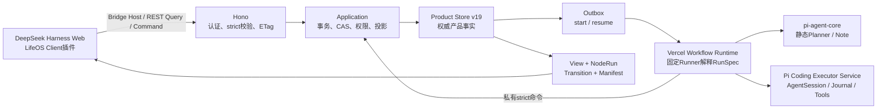

# Chat 可配置工作流 As-built

> 日期：2026-08-24
> 状态：后端产品事实、运行内核与公开API已落地；DSH已接入Workflow选择、发送级配置与人工审核表面
> 范围：运行投影、受限定义内核、发送级配置、Planning、Note、Direct Agent、Memory Direct、Rules、Definition、迁移与验收

## 1. 用户结果

本次实现把“工作流只能写死在代码里”改成两层边界：

1. **节点能力仍由代码和策略注册。** 浏览器不能上传代码、表达式、HTTP节点或任意Executor。
2. **已有节点怎样组合、默认启停、选择哪些资源、使用哪个已发布版本，可以在运行前配置。** 发送消息时服务端把选择编译为不可变RunSpec；本次Run随后只读这个版本。

后端当前已经支持：

- 查询真实Run、节点Input/Output/Timeline/Evidence和受控Trace摘要；
- 为Run选择已发布Planning或Note流程以及Memory、Project、Rules和审核策略；
- 显式选择独立Memory Direct，并按本轮配置选择Query/Write Provider、失败政策和查询预算；
- 通过严格Command复制、编辑、校验、发布、归档或恢复受限Definition；
- 在Planning审核中要求修订、批准或拒绝；在Note审核中确认、编辑后确认、要求修订或拒绝；
- 刷新、进程重启或重复提交后继续同一产品Run，不重复消费已经提交的决定或副作用；
- 查询正式Note、历史Revision和来源，维护带Revision/Tag/Scope的规则并把精确Rule Revision注入规划。

DSH桥接面已经交付原生对话、Planning HITL与Note Candidate审核。Note审核读取安全DTO并支持确认、要求修订和拒绝；Candidate正文、标签、类型和来源数量在手机/桌面同一卡片中可见。Note列表/历史编辑、Run Viewer、Rules和Definition编辑仍是已存在的Chat API能力，但在对应DSH Client插件完成前不能写成当前用户界面已经可操作。

与原始目标对照，本次真正交付的是受限Kernel、运行观察、Memory/Project/Rules配置化Planning、人工审核循环、执行/验证/提交、Note、Rules和Designer。正式Research产品事实与正式Skill集合/授权/冻结/消费链尚未交付；它们保留为原始目标中的明确延期项，不用兼容节点、空资源目录或`optional_unavailable`冒充完成。

## 2. 实际架构



责任没有合并：

- Product Store拥有Definition、Revision、RunSpec、Run、Decision、Note、Rule和节点产品证据；
- Workflow Store只拥有耐久步骤、Hook和Checkpoint；
- pi只产生候选，不拥有审批、正式Note或Run成功事实；
- DSH与浏览器只保存会话轨迹、未发送草稿和查询缓存，不拥有产品历史与终态；
- Trace只记录路径、版本、耗时、错误与对象引用，不保存隐藏推理或产品正文。

Note Application按变化原因拆分：公开Query/DTO投影、普通Note维护、冻结Candidate/Policy纯规则和Node/Manifest投影分别在独立模块；`publishNoteCandidate`、`submitNoteDecision`与`commitConfirmedNote`仍各自保留完整Product Store事务，避免为了压缩函数行数把一个原子提交拆成多个Service调用。

## 3. 定义、运行与观察模型

| 对象 | 作用 | 不变量 |
| --- | --- | --- |
| `WorkflowDefinition` | 可变聚合身份 | 只指向current draft/published revision |
| `WorkflowDefinitionRevision` | 一版语义结构 | draft/published/superseded内容与Hash不可原地改写 |
| `WorkflowRunConfiguration` | 本次发送前的有限覆盖 | strict联合；无任意metadata或JSON口袋 |
| `WorkflowRunSpec` | 本次Run的实际执行输入 | 服务端重新编译；绑定Definition、Runner、资源三元组、策略和Hash |
| `WorkflowViewDefinition` | 本次Run的稳定图快照 | 历史Run不读取latest Definition重新画图 |
| `WorkflowNodeRun` | 一个节点、路径、轮次与attempt | 状态机、executionPath和父子关系受Domain约束 |
| `NodeRunTransition` | 节点状态历史 | 序号连续；reason、时间和产品引用与状态匹配 |
| `NodeValueManifest` | 节点输入/输出版本证据 | 只存ref/revision/hash；生成后不可原地改写；queued节点不提前伪造消费事实 |

受限IR只包含Task、Sequence、Choice、BoundedLoop和Composite。结构操作是strict命令：插入、移动、删除可选Task，设置默认activation/config，包装/展开Choice或BoundedLoop以及移动到固定分支。不存在自由edge、任意回边、表达式、代码节点或浏览器指定Executor。

## 4. 可配置字段的真实语义

只有运行链实际消费的字段才公开：

| 节点 | 字段 | 权威执行位置 |
| --- | --- | --- |
| `memory.query` | `providerId`、`required`、`maxResults`、`maxContextCharacters` | Workflow只读Provider Step + `WorkflowMemoryQuery/Snapshot/Context`原子事实；同类节点最多8个 |
| `memory.write@1` | `providerId`、来源Message、`conversation_turn` | 历史Memory Planning合同；保持原规范化结果与Definition Hash不变 |
| `memory.write@2` | `providerId`、`required`、来源Message、`conversation_turn` | Memory Direct合同；父Workflow按`required`决定写回失败或结果未知时是否阻断Product Commit。两个版本都复用统一写入状态机并唯一执行；直接Write Command才由Outbox启动独立`MemoryWriteWorkflow` |
| `context.memory` | 历史`required`、`maxItems`、选择的`mrs_*` | 旧完整上下文Planning兼容能力；Compiler + `PlanningMemorySelection`原子事实 |
| `context.project` | `required`、Project选择 | `PlanningProjectContext`与Node终态/Manifest同事务 |
| `policy.rules` | `required`、Rule选择 | `RuleSelection`与Node终态/Manifest同事务；正文只经私有Runtime边界 |
| `agent.plan` | `maxSteps` | Application发布Plan前再次校验 |
| `execute.plan` | `maxActions` | Application编译Execution Contract前再次校验，任何Provider调用之前失败 |
| `result.validate` | `strictEvidence` | Application确定性Validation消费并进入产品事实 |
| `note.extract` | `maxCharacters`、默认kind、建议tags | Definition默认值与本次输入按字段合并后进入RunSpec |
| `note.classify` | `allowCustomTags` | Workflow早失败 + Application发布Candidate权威复核 |
| `human.note_review` | manual / policy允许时自动继续 | 低风险固定策略产生`WorkflowPolicyResolution`；超界回到真实人工审核 |
| `agent.direct` | `promptReviewMode: manual / off` | Direct Runner从冻结RunSpec授权Pi Operation；`manual`逐次创建Product Prompt Review，`off`直接越过人工等待 |

Planning包含执行和产品提交，因此`human.plan_review`始终是manual；公开Catalog、Blueprint和Composer不再展示不可达的自动继续。`always_auto`仅保留为历史合同可识别值，Compiler明确拒绝。

发送级节点配置不是任意JSON：Node Catalog声明可理解的字段及类型，Blueprint只放行当前流程允许覆盖的
`configFields`，Published Definition再给出该具体节点的真实默认值。浏览器只渲染这三层交集；Command边界
接收boolean/string/integer标量，Compiler重新走Catalog strict schema并把结果冻结进RunSpec。新增Workflow
若没有声明`configFields`，前端不会出现配置入口，也不需要修改通用配置组件。

`agent.research`只为旧Definition兼容：新系统Planning已移除，配置为空，运行时固定`skipped/no_evidence`，不会把“没调研”投影成成功。`capability.skills`在没有正式Skill产品集合时只能安全形成`optional_unavailable`，不会伪造Skill已加载。这两项是未交付边界，不计入P6原始G3完成度。

## 5. Planning与Note运行链

### 5.1 Planning

当前公开目录有2个互相独立、身份不同的系统Planning Definition：

1. 默认Simple Planning：

```text
bounded_loop(Plan -> Human Review) -> Execute -> Validate -> Product Commit
```

2. 独立Memory Planning（仅在DSH显式选择后运行）：

```text
Memory Query -> Memory Write（本次用户输入） -> Project -> Rules -> Skills
             -> bounded_loop(Plan -> Human Review)
             -> Execute -> Validate -> Product Commit
```

历史完整上下文Planning v2（旧标题“默认规划工作流”）已从公开目录移除；其Revision、View和Runner为既有Run恢复、兼容调用与证据读取保留。旧“默认笔记工作流”同样不再出现在产品选择器中。

Simple Planning不是Memory流程的前置、后继或被包装子图。Memory Query冻结Provider描述、来源与结果Snapshot，再聚合为唯一`WorkflowMemoryContext`；Memory Write先提交Intent/Result，由同一父Workflow唯一执行，不创建竞争的start Outbox。Plan修订复用同一冻结Memory Context；批准后Execution只解析Approved Step明确引用的三元组。

Plan、Review、Execute、Validate和Commit由各自业务Application用例拥有running/terminal投影；Runner不再用通用命令二次补写不同摘要或outcome。外部执行结果未知进入`outcome_unknown`，不降级成普通失败或自动重试。

### 5.2 Note

Note流程为`bounded_loop(Extract -> Classify -> Review) -> Commit`。模型只产生Candidate；编辑确认和要求修订创建successor，不覆盖旧Candidate。Decision绑定精确Candidate revision/hash；正式Note Revision、Assistant Message、Run成功和commit Node同事务提交。

低风险自动继续只适用于Note，且Policy Resolution绑定RunSpec、Definition Node、Candidate和固定策略版本/Hash。策略不允许时仍创建可审计Resolution，并进入真实`waiting_human`。

### 5.3 Direct与Memory Direct

公开目录包含两个身份与Runner都独立的Direct Definition：

```text
direct@1 / direct-agent.v1:
  Agent Direct

direct@2 / memory-direct.v1:
  Memory Query -> Agent Direct -> Memory Write
```

`direct@1`的Definition、Runner、Prompt Review与Product Commit路径保持原样，不会因启用Memory Mode而查询或写入。`direct@2`先把Query终态冻结为唯一`WorkflowMemoryContext`，Application再把Context ID/Revision/Hash写入Direct Attempt Manifest；Pi Executor只在授权引用和组合Token预算都通过后，把规范化Context作为当前请求前的一条不可信历史消息加入同一个AgentSession。它不是系统指令，正文不进入Workflow Checkpoint、Operation Journal或Trace；真正的完整Provider Payload仍由现有Prompt Review显示和审核。

Direct Candidate先作为模型候选持久化。Memory Write随后按冻结配置保存来源User Message；`required=true`时`failed/outcome_unknown`阻止Product Commit，`required=false`时保留独立Write终态后仍可提交候选。无论是否必需，外部写入都只发生一次，结果未知只允许同一Intent做只读对账。

## 6. 前后端合同

公开面提供：

- Workflow Catalog、Blueprint、Published Definition和安全Resource目录；
- Published Definition节点的`runConfigFields`，只描述当前Workflow实际可覆盖的字段；
- Definition detail/validate/copy/save/publish/archive/restore；
- Run View、Node Detail、Run Configuration Summary；
- Note列表、详情、历史、修订、归档/恢复、Candidate审核；
- Rule/Revision/Tag/Scope/lifecycle与安全Selection摘要。

Query使用ETag/`If-None-Match`/304；Bridge Host在切换Run或取消请求时丢弃过期结果。公开DTO不包含Workflow Run ID、Hook Token、pi Session、Provider配置、完整Trace Payload或未授权正文。

写命令使用Command Envelope、CAS revision和稳定commandId。Bridge在网络结果未知时保存pending command；Note修订、归档、恢复和Decision重试复用同一commandId与原payload，不能通过再次点击创建第二个业务事实。

DSH Workflow选择旁的“配置”入口按服务端描述渲染当前Workflow。配置是会话级发送草稿；下一条消息创建请求时
冻结Definition revision、SHA与完整`WorkflowRunConfiguration`，之后切换开关不会改写已创建Run。当前首个字段是
Direct Agent的“发送前审核提示词”：开启保持逐次审核，关闭后不创建Prompt Review/Decision/Hook，但仍在Pi
Operation Journal中先提交`provider.started`派发栅栏；派发后结果未知仍禁止自动重发。
Memory Direct继续复用同一服务端描述表面，并额外公开Query/Write Provider、Query必需性、结果数、Context字符预算和Write必需性；这些都是会话级发送草稿，提交后冻结进RunSpec。

## 7. Checkpoint、恢复与安全

- Planning生成/发布、Note生成/发布、Execution执行/持久化分别合并在单个耐久Step内；Workflow作用域只保留产品ref、outcome和身份，不跨Step携带Message、Memory、Plan输出或Note正文。
- Hook先由产品Decision提交，再由Outbox恢复；edited Note同时区分被claim的旧Candidate和Decision绑定的successor。
- Runtime Binding保存runner family/bundle版本；恢复按当次Run证据分派，不按当前全局默认猜测。
- `direct-agent.v1/direct@1`与`memory-direct.v1/direct@2`必须一一对应；Store、Runtime分发和Direct授权三处都拒绝交叉组合。
- Runtime私有命令校验RunSpec、节点类型、合法executionPath、activation、状态、终态和产品引用；持有Runtime Key也不能伪造另一路径或在Run终态后创建节点。
- 百炼Host采用精确域名/Workspace正则；当前允许用户已配置并授权且真实验收通过的`coding.dashscope.aliyuncs.com`，Token Plan与同形恶意域名仍在启动或付费调用前失败关闭。Project模型Profile在provider为`bailian`时使用同一安全合同。

## 8. Store与迁移

Product Store当前为`chat-product-store.v20`：

- v6：Workflow View/Node/Transition/Manifest；
- v7：Definition/Revision/RunSpec；
- v8：Note；
- v9：Rules与Planning Project Context；
- v10：Planning Memory Selection与Workflow Policy Resolution。
- v11：保留完整上下文Planning Definition，新增独立且默认的“规划执行工作流”；它不声明Memory/Project/Rules/Skills资源节点，历史RunSpec继续引用原冻结Definition。
- v12：新增Provider中立的Workflow Memory Query/Snapshot/Context与Memory Write Intent/Result，并发布独立Memory Planning Definition；v11的Simple Planning仍是默认且内容不变。
- v13：新增独立Direct Agent Run、Prompt Review Request/Decision、Direct Candidate与单个Execution Agent系统Definition；Prompt Review是该节点内部状态，原始Provider请求正文只保存在Product Store一次。
- v14：新增用户Prompt Fragment/Revision产品事实。
- v15：新增每个Direct Run唯一Prompt Assembly；本次发送级Workflow配置继续复用既有RunSpec，不增加Store版本。
- v16：Prompt Revision正文迁入可见Markdown引用，历史v1继续兼容读取。
- v17：统一两条历史v16分支并补齐Project Bootstrap事实集合。
- v18：新增不可变Agent Version，并发布继承Pi CLI默认能力的Direct系统Revision。
- v19：只新增固定Memory Direct Definition/Revision/View；不改写已有Run、历史Direct或其他产品事实。
- v20：新增Provider中立的Session Import批次；批次冻结来源/Preview Hash并引用统一Memory Write Intent/Result，不复制Provider对象或把Codex Session变成Product Session。

迁移按版本串行、可重复打开，并对非空历史Fixture执行Zod、生产完整性、只读Auditor和故障注入。v5→v6使用迁移专用冻结投影，不调用会继续演进的当前Application projector。

JSON Store仍是当前单实例Adapter，不宣称多实例数据库、备份或生产容量。未来替换Store不改变上述产品合同。

## 9. 表面退出方式

Workflow Definition/View、Note和Rules均不依赖具体前端渲染库。旧Web使用过的React Flow与Markdown渲染器已经随旧前端删除；DSH接入必须通过公开Slot/Surface消费现有DTO，不把DSH类型写回产品合同。

## 10. 验证与剩余边界

自动门覆盖Contracts、Domain、Application、Store、Workflow、Runtime、API、迁移、并发、权限、IDOR、容量和Checkpoint正文扫描。旧Web浏览器证据只存在于Git历史；当前用户界面必须重新通过DSH真实浏览器纵向，不能沿用旧UI结论。Note Bridge的确定性纵向覆盖Candidate投影、版本/Hash绑定决定、断网原样重试和正式Assistant Message收敛；部署前仍须补真实手机浏览器证据。

既有Planner、旧单轮Executor与Note Capture真实Provider门已通过并保存脱敏证据。完整AgentSession Executor的确定性Service/Journal/Workflow合同门和单独真实Provider付费门均已通过；DSH原生Trajectory另有不付费的真实Host/Session浏览器门。DSH切换后的浏览器门以当前根脚本为准；已删除的旧Web Playwright命令不再是当前完成门。

```text
pnpm test:provider:bailian
pnpm test:provider:bailian:coding
pnpm test:provider:bailian:note
pnpm test:e2e:dsh-real
```

Research与Skill仍是产品范围延期，不是Provider问题。Note列表/历史编辑、Definition和Run View的DSH表面尚待单独纵向接入。
