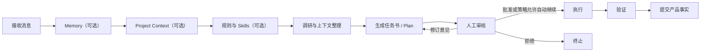
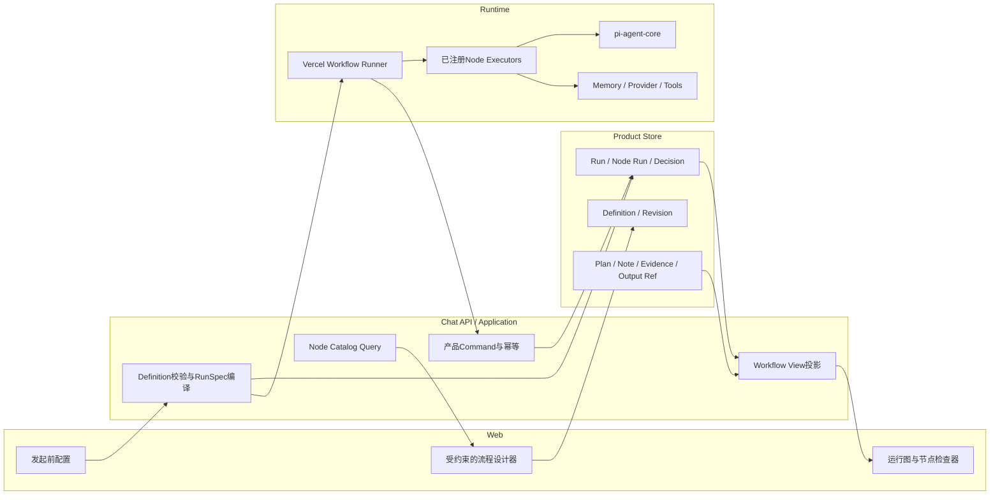
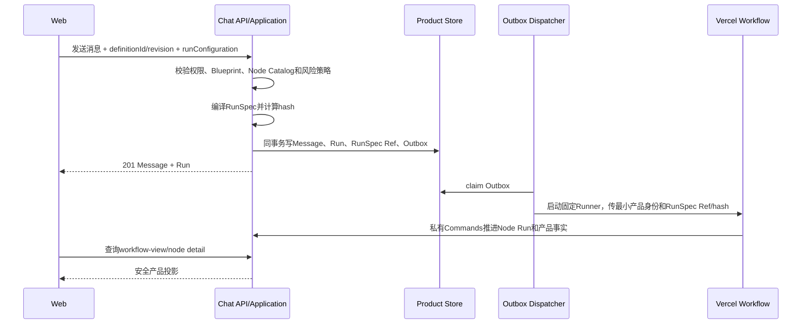

# Chat 可配置工作流技术研究与实施建议

> 状态：研究、架构方向与实施计划已获用户批准；实现按S1～S7推进，本文仍不冒充as-built合同  
> 日期：2026-08-09  
> 范围：参考项目、现有实现、前后端交互、节点与运行投影、测试矩阵、阶段候选  
> 非范围：本稿不修改当前生产行为，不承诺让用户编写任意代码或搭建任意自动化

## 0. 摘要结论

1. **技术上可行，而且不需要替换现有 Vercel Workflow。**  
   Vercel Workflow继续负责耐久步骤、暂停、恢复和Checkpoint；Chat在它上面增加一层“受约束的工作流定义”，由一套或少量代码定义的Runner解释执行。

2. **前端可以设计和配置工作流，但只能组合后端已经注册、验证和实现的节点类型。**  
   前端负责画布、表单和交互，不负责发明可执行代码，也不把React Flow的坐标和连线直接当成权威执行定义。

3. **Chat不应该做一个缩小版n8n。**  
   当前场景需要的是少量预设工作流、可选上下文节点、明确的人工审核、有限分支和有上限的循环，而不是任意有向图、任意脚本、任意表达式、任意多输入Join和局部重跑。

4. **真正缺少的不是另一套日志，而是Chat拥有的工作流运行投影。**  
   当前后端已有严格Trace、Plan、Approval、Attempt和执行结果，但公开API只有粗粒度Run/Plan/Approval/Context；真实前端没有稳定的定义节点、节点运行、输入、输出和安全时间线可读。

5. **推荐的产品形态分成三个界面。**

   - 工作流设计：维护少量预设和允许配置的节点。
   - 发起前配置：选择预设，勾选Memory、Project、规则、Skill和审核方式。
   - 运行观察：从左到右显示图，点节点查看概览、输入、输出、证据和运行时间线。

6. **第一次落地应先把当前固定工作流“看见”，再把它“配置化”。**  
   先建立Node Run投影和真实前端图，再引入Definition/RunSpec和动态Runner。这样每一步都有用户可验证结果，也避免同时重写运行时和前端。

## 1. 研究问题与判断边界

本次研究回答五个问题：

1. 当前底座是否只能通过代码定义工作流。
2. 前端是否能够通过拖拽或配置形成工作流。
3. Chat场景里什么才算一个节点。
4. 节点的输入、输出、状态、Trace和人工审核如何在前端表达。
5. 怎样测试，才能证明它不是“能画图但不能可靠运行”的Demo。

这里所说的“动态”有明确边界：

| 能力 | 本方案是否支持 | 原因 |
| --- | --- | --- |
| 从已注册节点中组合预设 | 支持 | 是当前真实需求 |
| 为节点填写参数、选择资源、启停可选节点 | 支持 | 可验证、可治理 |
| 在运行前选择审核为人工或策略自动继续 | 有条件支持 | 必须受节点风险策略约束 |
| 有限分支、审核回路、有上限循环 | 支持 | 足以覆盖当前场景 |
| 前端创建一种全新的节点执行代码 | 不支持 | 仍需实现、测试和部署 |
| 任意JavaScript/Python表达式 | 不支持 | 会引入沙箱、权限和重放问题 |
| 任意有向图、任意回边和多输入Join | 首期不支持 | 会把系统推向n8n级别复杂度 |
| 运行中修改正在执行的定义 | 不支持，也无此需求 | 运行已经读取本次RunSpec |

“运行前确定、发起后使用本次配置”应当只是正常的数据读取和编译边界，不应包装成一个复杂的“冻结功能”。用户始终可以继续修改工作流定义；已经发起的Run只持有发起时解析出的RunSpec。

## 2. 用户场景还原

### 2.1 项目规划—审核—执行

这是首要场景，也是当前PlanningExecutionWorkflow的自然演进：



用户在发起前可配置：

- 使用哪一个Memory范围。
- 是否读取某个Project及其Resource、Decision和Evidence。
- 注入哪些有标签的用户规则。
- 开启哪些已注册Skill或工具能力。
- 审核节点采用人工审核，还是在策略允许时自动继续。
- 可选节点失败时是终止、降级还是请求人工处理。

### 2.2 快速查询

快速查询不需要伪装成完整项目工作流。它可以使用更短的预设：

```text
消息 → 可选Memory/规则 → Agent回答 → 结果投影
```

只有当某一步有独立配置、独立结果和独立观察价值时，才显示为节点。

### 2.3 笔记沉淀

“勾选笔记Skill”可以有两种语义，必须区分：

1. 它只是给Agent增加写笔记能力：这是Run配置，不一定单独显示成节点。
2. 它会执行分类、打标签、去重和持久化：这些步骤有独立输入输出，应成为可观察节点。

建议的首个复用验证工作流：

```text
接收内容 → 提取笔记 → 分类/标签建议 → 可选确认 → 写入Note资源
```

笔记类型可以是Idea、项目想法、学习主题或普通记录，但类型和标签属于产品资源字段，不应埋在Trace里。

### 2.4 提醒与待办

提醒工作流最终会包含外部时间和通知副作用：

```text
解析提醒 → 确认时间/时区 → 可选人工确认 → 创建提醒 → 对账
```

在Chat尚未拥有可靠的Tool Call Ledger、外部幂等和结果未知对账前，只能产出“提醒草稿”，不能把草稿显示成已经成功调度。该场景适合作为后续验证，而不是第一条配置化工作流。

## 3. 当前代码基线

先直接回答名称问题：当前底座确实是 **Vercel Workflow开源SDK**。仓库中的`packages/workflows/package.json`使用`workflow 4.8.0`和`@workflow/world-local 4.2.4`；Workflow经过代码转换和Bundle构建后，由当前Runtime Binding运行。它是不是部署在Vercel平台，是另一层World/部署适配问题，不改变这里的Definition、Step和Hook语义。

当前Web使用React 19、TypeScript和TanStack Query，尚未安装React Flow。仓库里的固定Workflow画布是产品壳层Fixture，不代表已经具备真实工作流设计器或运行查看器。

### 3.1 已经做对的部分

| 能力 | 当前证据 | 评价 |
| --- | --- | --- |
| 耐久编排 | `packages/workflows/src/planning-execution-workflow.ts` | 已有规划、审核Hook、执行、验证和提交 |
| 运行与产品事实分离 | `packages/domain`、`packages/application`、Product Store Adapter | 应继续保留 |
| HITL决定边界 | Decision先写产品事实，再恢复Workflow Hook | 正确，不应让浏览器直接恢复Hook |
| 严格Trace | `packages/contracts/src/trace.ts`、`packages/realtime` | 已覆盖Workflow、Agent、Provider、Memory、Hook等边界 |
| 幂等与恢复 | Outbox、Attempt、revision、Hash、Hook claim | 可作为动态Runner的基础 |
| 真实纵向闭环 | 后端集成测试、真实Provider、浏览器E2E | 不是纸面架构 |

这些能力意味着我们不需要另起一套编排底座，也不需要让前端直接调用Vercel Workflow。

### 3.2 当前固定点

1. `planning-execution-workflow.ts`用代码写死规划、审核、执行和提交顺序。
2. `WORKFLOW_DEFINITION_VERSION = planning-execution-workflow.v2`主要表示代码/Bundle版本，不是用户可编辑定义的revision。
3. Workflow Input只有产品Run、Attempt、Outbox和代码定义版本，没有用户选择的Definition或Run配置。
4. `runStep`能发出内部stepKey，但没有稳定的definitionNodeId和nodeRunId。
5. `RunDto`只提供粗粒度状态、阶段、当前Plan/Approval和结果，没有可画图的节点投影。
6. 真实页面 `RealWorkspace.tsx + PlanPanel.tsx`是纵向Plan体验；还没有真实运行图。
7. `WorkspaceShell.tsx`里的图是固定Fixture和坐标，不来自真实后端，不能在其上继续堆生产逻辑。

### 3.3 关键缺口

当前系统里已经存在两组事实：

- 产品事实：Run、Plan、Approval、Decision、Execution Candidate、Step Result、Attempt。
- 诊断事实：严格Trace事件。

缺的是中间一层：

```text
Workflow Definition Node
        ↓ 一次或多次实例化
Workflow Node Run
        ↓ 安全引用
Input / Output / Evidence / Public Timeline
```

它必须由Chat拥有，因为浏览器既不能读原始Vercel Workflow状态，也不能把原始Trace当产品API。

### 3.4 代码质量判断

当前代码质量的主要问题不是分层错误，而是固定纵向闭环完成后形成的**局部集中和扩展压力**：

| 位置 | 当前规模/现象 | 判断与后续动作 |
| --- | --- | --- |
| `planning-execution-workflow.ts` | 429行，顺序编排和失败收敛集中 | 现阶段可读；增加更多节点、分支后会出现重复try/catch和条件爆炸，应由Runner + Node Executor分担 |
| `workflow-step-support.ts` | 306行，集中Trace和Step支持 | 集中边界本身有价值；需把全局代码版本上下文扩成显式RunSpec/definition node上下文 |
| `use-real-chain.ts` | 560行，聚合多个Query和Command | 不应继续把Definition、Graph和Node Detail全部塞进同一个Hook，应按资源拆分query hooks和view model |
| `PlanPanel.tsx` | 364行，计划阅读与审核动作耦合 | 保留为Human Review内容能力，但拆出可复用review body/action boundary，避免图节点再复制一份审核逻辑 |
| `WorkspaceShell.tsx` | 1035行，包含Fixture画布 | 是壳层/原型债务，不应成为真实Viewer的起点；真实图应建立独立组件并吃真实DTO |
| `trace.ts` | 1351行严格联合类型 | 严格合同是优点；继续增长前按事件域拆文件导出，公开Node Timeline使用另一套小合同 |
| Workflow源码注释 | 仍写`PlanningExecutionWorkflow.v1`，实际常量为v2 | 是低风险文档漂移，进入相关实现PR时修正，不单独制造行为变更 |

因此架构调整应是增量抽取，不是推倒重写：Domain/Application/Product Store边界保留，重点新增Definition Compiler、Node Run投影、Runner Registry和独立前端Viewer。

## 4. 参考项目选择

### 4.1 结论矩阵

| 项目 | 主要参考价值 | 要吸收的设计 | 明确不照搬 |
| --- | --- | --- | --- |
| Activepieces | 最贴近的TypeScript工程与运行查看器 | typed action descriptor、版本/运行分离、Input/Output/Timeline、结构化横向布局、Waitpoint | 通用自动化市场、完整Piece生态 |
| Dify | 最贴近LLM、Knowledge、Human Input场景 | graph snapshot、节点执行记录、人类表单动作、知识节点和运行态UX | 前端画布对象直接耦合执行、任意LLM应用平台范围 |
| Windmill OpenFlow | 最清楚的控制流数据模型 | sequence、branch、bounded loop、suspend、retry、skip等显式容器语义 | 任意脚本、任意表达式和公开resume URL |
| n8n | 任意图执行复杂度与踩坑样本 | 节点目录、执行查看器、禁用节点提示 | execution stack、Join、partial execution、pin data、任意循环等整套复杂度 |
| React Flow | 直接前端画布候选 | 节点、边、选择、缩放、键盘操作、自定义节点 | 把React Flow数据当执行定义；假定其自带布局 |
| Vercel Workflow | Chat当前耐久运行底座 | code transform、step、hook、checkpoint、recovery | 让浏览器看到Runtime ID/Hook Token；每个用户定义生成代码 |

首选组合不是从六个项目里挑一个，而是：

1. **Vercel Workflow保留为运行底座。**
2. **Activepieces作为主要工程结构和运行查看器参考。**
3. **Dify作为LLM/HITL节点与用户体验参考。**
4. **Windmill作为控制流语义参考。**
5. **n8n作为复杂度红线。**
6. **React Flow作为前端投影组件。**

### 4.2 Activepieces：最值得读源码的主参考

有价值的实现点：

- Action是带判别字段的类型，节点有配置、下一步、Router和Loop子结构。
- Run查看器是只读图；点击节点查看Input、Output和Timeline。
- 画布布局不是权威执行事实。其横向布局本质上是结构化布局后的坐标投影。
- Waitpoint明确处理暂停、恢复以及“恢复先于暂停”的竞态。
- 大输入输出不会无限内嵌到运行记录中，而是截断或外置。

直接可见的踩坑：

- 递归Flow Action如果直接依赖递归Zod推导，可能让TypeScript类型计算爆炸；Chat的Definition应手写递归TypeScript类型、使用有上限的运行时解析，并限制最大深度。
- Loop中的同一节点会执行多次，仅有nodeId不足以唯一定位运行实例；必须增加iterationPath或等价执行路径。
- disabled节点的语义不能由一个通用布尔值决定，尤其不能把人工审核节点一律当作普通pass-through。

### 4.3 Dify：最贴近Chat产品场景

Dify的数据模型同时保存：

- Workflow画布图快照。
- Workflow Run的输入、输出和状态。
- 每个Node Execution的node id/type/title、输入、过程数据、输出、耗时、错误和Token。

这证明“运行图 + 节点详情”是成熟LLM工作流产品的合理交互。但也暴露两个问题：

1. 画布图对象和可执行图过度靠近，会使缓存、复制和运行时修改边界变脆。其源码注释记录过可变graph对象导致iteration单步执行异常。
2. 任意图的RIGHT方向自动布局需要ELK大量参数处理层级、端口、回边和嵌套，复杂度远高于当前Chat需要。

因此Chat吸收它的运行节点模型和Human Input体验，但不复制其整个画布数据模型或前端实现。Dify许可证也带额外条件，只作为设计研究来源。

### 4.4 Windmill OpenFlow：控制流语义参考

OpenFlow把流程表示成JSON可序列化模块序列，并把循环、分支、并行、暂停、重试和跳过定义为明确的模块或模块属性。

对Chat最重要的启发是：**图可以用来展示，但控制流应有结构化语义。**

首期定义只需要：

- sequence：顺序。
- choice：基于有限枚举结果选择分支。
- boundedLoop：有最大次数和退出条件的循环。
- humanReview：等待明确的产品决定。
- composite：把动态Plan Step作为可展开子运行。

不引入用户脚本、任意表达式和任意资源凭证。

### 4.5 n8n：复杂度红线

n8n的执行引擎需要维护execution stack、waiting execution、多个输入连接、局部执行、run data、pin data、循环判断和节点禁用语义。这些不是“画几条边”的附带实现，而是一整个通用数据流运行时。

两个特别相关的坑：

1. n8n的disabled节点通常把第一路主输入原样透传。这个规则不能用于Chat的Decision、Human Review和Loop节点。
2. 文档明确提示某些“始终输出”与IF组合可能制造无限循环。Chat必须只允许结构化回路并设置最大迭代次数。

n8n采用Sustainable Use License；本项目只研究产品和架构，不复制其实现。

### 4.6 React Flow：只负责画布

React Flow适合：

- 左到右节点图。
- 选择、缩放、平移和Mini Map。
- 自定义节点状态。
- 连接校验和可访问性辅助。

React Flow不负责：

- 图布局。
- 执行语义。
- 服务端验证。
- 运行状态权威性。

首个版本建议使用 `@xyflow/react`，但先实现一个适合sequence/choice/boundedLoop的确定性横向投影器，不立即引入ELK。若嵌套分支实验证明小布局器不足，再用独立依赖PR评估ELK。

预期依赖决策：

| 项目 | 决定 |
| --- | --- |
| 用途 | Web端工作流图、节点选择、缩放和平移 |
| 所有权边界 | 只在`apps/web`渲染服务端投影，不参与Domain和执行 |
| 许可证 | MIT |
| 退出方式 | Semantic Definition和LR投影合同不依赖React Flow；可替换为SVG、Canvas或List renderer |
| 首期排除 | 不引入ELK，不保存React Flow坐标为权威事实 |

## 5. 最终技术方案

### 5.1 总体结构



### 5.2 四层定义

#### A. Node Catalog：代码拥有

Node Catalog描述系统真正会执行什么：

| 字段 | 含义 |
| --- | --- |
| type | 稳定节点类型，如 `context.memory` |
| schemaVersion | 该节点配置和输入输出合同版本 |
| title/description | 前端目录和帮助 |
| configSchema/uiSchema | 可填写参数和表单提示 |
| input/output kinds | 可接受和产出的产品引用类型 |
| skipPolicy | 是否可跳过，跳过时如何处理 |
| riskPolicy | 是否强制人工审核或禁止自动继续 |
| executorKey | 后端私有执行器映射，不返回浏览器 |

新增一种节点类型仍然需要写代码、测试和部署。动态能力来自组合这些已注册节点。

#### B. Workflow Blueprint：代码拥有约束

Blueprint不是一次具体配置，而是某类工作流允许怎样变化：

- 允许哪些节点类型。
- 哪些节点必需。
- 哪些节点可以启停。
- 允许哪些分支和回路。
- 哪些配置可以在每次发起前覆盖。
- 哪些风险策略不可被前端关闭。

例如 `project-planning`允许选择Memory、Project、Rules和Skills，允许人工审核或策略自动继续，但不允许删除最终产品提交。

#### C. Workflow Definition：用户可保存

Definition是用户在Blueprint范围内保存的预设：

- 定义ID和revision。
- 结构化节点树/图。
- 各节点配置。
- 资源选择器。
- 展示元数据。

Definition可以继续编辑。保存时后端重新校验，不能只信任前端。

#### D. Run Configuration与RunSpec

每次发消息时，用户可以对Blueprint允许的字段做覆盖。Application把以下信息解析成RunSpec：

- Definition ID和revision。
- 本次启用/禁用的可选节点。
- 选中的Memory、Project、规则和Skills及其revision/hash/ref。
- 审核方式。
- 限制、超时和失败策略。
- 代码Bundle与Node Executor版本证据。

RunSpec是Workflow的普通输入或受保护引用。它只服务本次Run；这就是正常的“读取配置后运行”，不需要在产品上制造额外冻结仪式。

### 5.3 结构化IR，不用任意边解释执行

推荐的语义模型是结构化AST/IR，再投影成图：

```text
Sequence
├── Task(context.memory, optional)
├── Task(context.project, optional)
├── Task(policy.rules, optional)
├── Task(agent.research)
├── BoundedLoop(maxIterations = 3)
│   ├── Task(agent.plan)
│   └── HumanReview(manual | autoContinueIfAllowed)
│       ├── revise -> continue loop
│       ├── approve -> break loop
│       └── reject  -> terminate
├── Composite(execute.plan)
├── Task(result.validate)
└── Task(product.commit)
```

画布可以显示节点和边，但保存、校验和执行使用上述明确结构。这样可以在不实现通用图引擎的情况下表达用户最常用的顺序、分支和审核回路。

### 5.4 什么算一个节点

一个能力只有同时具备以下多数特征，才值得成为用户可见节点：

1. 有可理解、可配置的业务目的。
2. 有独立输入和输出合同。
3. 有独立状态、错误、耗时或证据。
4. 在多个Definition中有复用意义。
5. 用户会因为它的结果而采取动作或判断问题。

因此：

- Vercel Workflow的每个Step不等于一个用户节点。
- 一个用户节点内部可以包含多个耐久Step。
- 纯序列化、Hash计算、Hook claim等内部机制不必污染画布。
- 同一个definition node在修订循环中会产生多个node run。
- 动态Plan Step可以作为 `execute.plan` Composite下的子node run展开。

当前代码建议映射：

| 当前内部工作 | 用户节点 |
| --- | --- |
| Memory query、持久化Context | `context.memory` |
| 未来Project资源解析 | `context.project` |
| 规则/Skill解析与注入 | `policy.rules` / `capability.skills` |
| 编译规划输入、调用pi、发布Plan | `agent.plan` |
| Hook创建、等待、加载Decision | `human.plan_review` |
| 编译执行合同 | 内部过渡，不单列 |
| 每个Approved Plan Step执行 | `execute.plan`的动态子运行 |
| 保存候选、验证 | `result.validate` |
| 提交Run终态 | `product.commit` |

### 5.5 三种身份必须分开

| 身份 | 作用 | 是否给浏览器 |
| --- | --- | --- |
| definitionNodeId | 保存定义中的稳定节点 | 是 |
| nodeRunId | 某节点某一次执行实例 | 是 |
| runtimeStepId / workflowRunId | Vercel内部运行和Checkpoint | 否 |

修订和循环时，nodeRun还需要：

- attempt。
- iterationPath，例如 `review-loop/2`。
- parentNodeRunId。
- planRevision或等价业务revision。

只用nodeId会让第二次规划覆盖第一次规划，也无法解释循环内部失败。

### 5.6 跳过和自动继续不是同一件事

不能给所有节点定义一个通用“disabled就透传输入”规则。

| 节点类别 | 允许的跳过语义 |
| --- | --- |
| Context节点 | 不查询，输出明确的absent/disabled结果 |
| Transform节点 | 可声明pass-through或empty，但必须由节点类型固定 |
| Research节点 | 可按Blueprint决定是否必需 |
| Human Review | 只能manual或policy auto-continue；不能伪造human approved |
| Decision/Branch | 必须声明默认分支 |
| Loop | 必须声明退出条件和最大次数 |
| Product Commit | 通常不可跳过 |

对于可自动继续的审核节点，结果应显示：

```text
resolution.kind = policy_auto_continue
actor.kind = system_policy
reason = 本次配置允许，且风险策略校验通过
```

不能写成“用户已批准”。高影响动作的Blueprint或Node riskPolicy应强制manual，前端开关无法绕过。

## 6. 前后端交互

### 6.1 API职责

建议逐步增加以下资源，不要求一次全部实现：

| API | 用途 |
| --- | --- |
| `GET /api/workflow-node-types` | 读取可用节点描述和配置schema |
| `GET /api/workflow-definitions` | 读取预设列表 |
| `GET /api/workflow-definitions/:id` | 读取某个可编辑定义 |
| `POST /api/workflow-definitions/:id/validate` | 服务端验证草稿 |
| `PATCH /api/workflow-definitions/:id` | 带expectedRevision保存 |
| 发送消息Command扩展 | 携带definitionId、expectedRevision和runConfiguration |
| `GET /api/runs/:runId/workflow-view` | 返回安全的图和节点摘要 |
| `GET /api/runs/:runId/workflow-nodes/:nodeRunId` | 返回节点安全详情 |

Definition保存和发送消息都是Command，必须带幂等身份和预期revision。节点目录、运行图和节点详情是Query。

### 6.2 发起流程



RunSpec过大时不要整个复制进Outbox或Trace；保存到Product Store并传受校验的引用与Hash。Workflow每次读取都通过私有Application API，不直接打开产品数据库。

### 6.3 运行更新

第一阶段可以延续当前1.5秒Query polling：

- `run`决定顶层状态。
- `workflow-view`决定节点状态和安全时间线。
- `plans/approval/context`继续作为正式资源读取。

后续Runtime Journal/SSE只负责提示哪些Query需要刷新，或推送有序的小型delta；SSE断线后仍以REST Query为准。不要让Web在内存里根据零散事件自行推导权威节点终态。

## 7. 前端表达

### 7.1 运行查看器

桌面端推荐：

- 主工作区从左到右展开。
- 当前节点高亮，等待人工、失败、跳过有明确不同状态。
- 点击节点后，在右侧Inspector或现有Work Pane中显示详情。
- Inspector页签为：概览、输入、输出、运行时间线、证据。
- Human Review节点复用现有PlanPanel的阅读、修订、批准和拒绝能力。
- `execute.plan`可展开为每个Approved Plan Step的子节点。
- 提供“定位当前节点”，但运行更新时不强制抢走用户正在查看的节点和视口。

移动端推荐：

- 页面本身不产生横向溢出。
- 画布区域内部横向平移。
- 节点详情进入Drawer/Sheet。
- 同时提供按执行顺序排列的列表视图，支持键盘和屏幕阅读器，不把画布作为唯一入口。

### 7.2 设计器

首期设计器不是完全自由拖拽：

1. 从Blueprint给出的槽位或节点目录添加已允许节点。
2. 通过schema表单配置节点。
3. 允许有限顺序调整、启停和分支配置。
4. 实时显示前端校验，但保存时以后端校验为准。
5. 循环由专门容器创建，不允许随意画一条回边。

这样仍然有“搭建”的体验，但用户不需要理解Join、变量表达式、沙箱和局部执行。

### 7.3 Definition与View State分离

至少分开三份数据：

| 数据 | 所有者 | 示例 |
| --- | --- | --- |
| Semantic Definition | Product Store | 节点类型、结构、配置、revision |
| Run Projection | Product Store Query | nodeRun状态、输入输出引用、时间线 |
| View State | Browser/User Preference | 缩放、平移、折叠、Inspector宽度 |

React Flow nodes、edges、position只能由Semantic Definition投影，不能原样保存为唯一执行事实。

## 8. 节点输入、输出、Trace和日志

### 8.1 Node Run公开状态

建议状态集合：

- queued
- running
- waiting_human
- succeeded
- failed
- skipped
- cancelled
- outcome_unknown

`outcome_unknown`用于已经发出外部副作用但不能确认结果的情况，不能用failed掩盖，也不能自动当作可安全重试。

### 8.2 节点摘要

`workflow-view`中的节点摘要只需要：

- definitionNodeId、nodeRunId、type、title。
- status、attempt、iterationPath。
- startedAt、finishedAt、durationMs。
- 一句话输入/输出摘要。
- warning/error摘要。
- 当前是否有允许用户执行的动作。

### 8.3 节点详情

详情Query按需返回：

- 运行时实际使用的安全配置快照。
- 输入产品引用、Hash、来源和经过截断的预览。
- 输出产品引用、Hash、摘要和Evidence。
- Provider、Memory、Tool等允许公开的指标。
- 有序的公开时间线。
- 错误类别、是否可重试、是否需要人工处理。

完整Plan、Note、Resource等仍通过各自产品资源API读取，Node Run只保存引用，不复制第二份权威正文。

### 8.4 Trace不能直接暴露

当前严格Trace适合调试和证据，但不能直接返回浏览器：

- 它包含内部stepKey、运行关联和Provider边界信息。
- 它的字段和保留期服务诊断，不等于产品合同。
- 未来可能增加的调试字段不应自动变成用户可见数据。

应从Product事实和Trace allowlist生成Public Node Timeline。明确禁止：

- Workflow Run ID。
- Hook Token。
- pi Runtime Session ID。
- 密钥和完整Provider Payload。
- 模型隐藏推理。
- 未经过滤的Memory正文。

### 8.5 大输入输出

参考Activepieces的实践，必须在首版合同中定义：

- inline预览字节上限。
- 超限后的Artifact Ref。
- 内容Hash和MIME/Schema。
- 查询权限和保留期。
- UI截断提示和按需读取。

否则一个研究节点的大结果就可能拖垮Product Store、Query、SSE和浏览器渲染。

## 9. 版本与兼容性

当前 `WORKFLOW_DEFINITION_VERSION`实际混合了代码定义和运行证据。配置化后应分成四条轴：

1. Runner/Bundle版本：哪一份Vercel编译代码在执行。
2. Node Executor schema版本：节点配置和结果合同。
3. Workflow Definition revision/hash：用户保存的定义。
4. RunSpec hash：本次发起实际解析出的配置。

Definition revision变化不应触发重新编译Vercel Bundle；新增Node Executor或改变其代码才需要部署。

兼容策略：

- Node Catalog声明支持哪些旧schemaVersion。
- 保存Definition时可执行显式迁移，不在运行时静默猜测。
- 已有Run Viewer按其RunSpec和Node Run快照读取，不依赖当前最新Definition。
- 未知节点类型、未知字段或不支持版本在启动前失败，不进入半运行状态。

## 10. 本次可行性Spike

本次研究在仓库外使用当前安装的Vercel Workflow做了一个最小实验，未修改Chat代码：

1. 同一份编译后的 `graphRunnerWorkflow`读取不同序列化Definition。
2. v1关闭审核节点，运行完成并记录skipped。
3. v2开启审核节点，运行进入等待。
4. v2等待期间启动不同v3定义，v3独立完成。
5. 模拟Local World/Worker重启后，v2恢复等待并通过Hook继续。
6. 调用方在start之后修改原对象，不会改变已经序列化的运行输入。

这证明“固定代码Runner + 动态受约束Definition + 固定Node Executor集合”在当前底座上成立。

Spike尚不是生产实现，仍缺：

- Product Store RunSpec和Node Run事实。
- Blueprint与Node Catalog验证。
- 私有Application Commands。
- 错误、重试、外部副作用和安全投影。
- 真实浏览器E2E。

## 11. 主要踩坑清单

| 风险 | 触发方式 | Chat的防线 |
| --- | --- | --- |
| 把画布当运行时 | 保存React Flow对象并直接解释 | 结构化IR是权威，画布只是投影 |
| 任意回边 | 用户随手连线 | 只允许boundedLoop/review loop容器 |
| nodeId覆盖循环实例 | 同一节点执行多次 | nodeRunId + iterationPath |
| 通用disabled透传 | 审核或分支被跳过 | 每类节点显式skip policy |
| 自动继续伪装成人工批准 | 关闭审核开关 | 单独记录policy_auto_continue |
| 递归类型爆炸 | 无界递归Zod推导 | 手写递归类型、z.lazy/分层校验、深度上限 |
| 可变图对象污染运行 | 缓存/复用前端graph对象 | 编译成新RunSpec、Hash校验、不共享可变对象 |
| 自动布局吞噬前端复杂度 | 首期支持任意嵌套图 | 结构化LR布局，ELK延后独立评估 |
| 原始Trace泄密 | 浏览器直接读取JSONL | Public Timeline allowlist |
| 大输出拖垮系统 | 把研究结果全内嵌 | 预览上限 + Artifact Ref |
| SSE成为权威历史 | 前端仅靠事件累加 | REST Query为准，SSE提示刷新/delta |
| 外部副作用重复 | 普通异常自动重试 | 幂等键、结果未知、查询对账、人工处置 |
| 高风险审核被关闭 | 前端布尔开关直通 | Blueprint/risk policy服务端强制 |
| 版本概念混淆 | code version等于definition revision | 四条版本轴分离 |
| 做成万能Service | 所有节点走一个巨型类 | Registry映射明确Application用例和Adapter |

## 12. 测试方案

### 12.1 Definition与校验

至少覆盖：

1. 节点ID唯一。
2. 节点类型和schemaVersion已注册。
3. 必需节点存在且不可关闭。
4. 输入引用类型匹配。
5. 不允许断开的不可达节点。
6. 只允许结构化循环。
7. 循环和审核修订有最大次数。
8. skip policy和默认分支完整。
9. 高风险节点不能关闭人工审核。
10. Definition大小、节点数、深度和配置正文有上限。
11. 未知字段和未知版本拒绝。
12. Definition revision冲突返回可修复错误。

### 12.2 Compiler与RunSpec

1. 同一Definition、revision和Run配置产生确定性Hash。
2. 用户只能覆盖Blueprint允许的字段。
3. Memory、Project、规则和Skill引用绑定正确revision/hash。
4. 发起后编辑Definition只影响下一次Run。
5. 同一个消息Command重试不创建第二个RunSpec或Run。
6. 高风险策略在编译阶段阻断，不等到Workflow里才发现。
7. RunSpec过大时使用引用，不把正文泄露到Outbox和Trace。

### 12.3 Runner与耐久性

1. 同一编译Runner执行至少三种不同Definition。
2. 可选Context节点关闭时记录明确skipped结果。
3. manual review支持approve、revise、reject。
4. revise回到Planning并保留v1/v2节点运行历史。
5. auto-continue只在策略允许时生效。
6. Hook等待期间API/Worker重启可恢复。
7. 决定先到、Hook稍后进入等待的竞态可幂等收敛。
8. 超过最大修订/循环次数明确失败或转人工。
9. 纯计算/查询节点可按策略安全重试。
10. Provider和外部Tool使用各自幂等、收费和结果未知策略。
11. 取消、超时和终止时所有node run收敛到合法终态。

### 12.4 Node Run与API投影

1. definitionNodeId、nodeRunId、attempt和iterationPath稳定。
2. Composite执行节点能展开动态Plan Step。
3. 输入输出只出现允许的Product Ref和安全预览。
4. 大输出外置并可按权限读取。
5. Timeline顺序稳定，重复事件幂等。
6. 不返回Workflow Run ID、Hook Token、pi Session、Provider原始Payload和隐藏推理。
7. Run、Plan、Approval、Node Run终态一致。
8. 分页、保留期和已清理内容有明确占位状态。
9. 旧Run仍能按旧Node schema投影。

### 12.5 前端组件与交互

1. 图默认从左到右布局。
2. 节点点击、键盘选择和列表替代入口可用。
3. queued/running/waiting/succeeded/failed/skipped/outcome_unknown视觉可区分。
4. Inspector正确显示概览、输入、输出、Timeline和Evidence。
5. 轮询或SSE更新不抢走用户选中节点和视口。
6. “定位当前节点”在分支和循环中准确。
7. 修订循环可显示稳定主图，并按需展开每次iteration。
8. Human Review沿用版本绑定和Hash校验。
9. 网络结果未知时不显示假成功，允许重新查询。
10. 375px移动端无页面级横向溢出。
11. 超长标题、大输出和深层错误不破坏布局。

### 12.6 真实场景E2E

| 场景 | 必须证明的结果 |
| --- | --- |
| 项目规划主链 | Memory + Project + Rules + Research → Plan v1 → revise → Plan v2 → approve → execute → commit |
| 可选人工审核 | 低风险配置使用policy auto-continue，界面不显示为用户批准 |
| 强制审核 | 高风险动作即使前端篡改请求也无法跳过 |
| 快速查询 | 使用短Definition，不产生无意义空节点 |
| 笔记沉淀 | 内容分类、标签建议、可选确认和Note资源写入可追踪 |
| 提醒草稿 | 在调度能力未完成前不显示已经安排成功 |
| Memory降级 | optional失败可降级，required失败阻断 |
| Provider失败 | 不重复收费调用，不产生假Plan/假成功 |
| Hook恢复 | 等待时重启API/Worker后仍可决定并完成 |
| 大研究输出 | 图和Inspector可用，正文通过Artifact Ref读取 |
| 安全泄漏 | 所有公开响应和浏览器日志均无Runtime Token/隐藏推理 |

### 12.7 测试分层

1. **每次提交运行：** Definition、Compiler、Domain状态机、DTO、Projection和前端组件的确定性测试。
2. **每个相关PR运行：** Local Vercel Workflow、真实Product Store、Hook恢复和API集成。
3. **里程碑验收：** 真实Provider、真实Memory、真实浏览器和进程重启E2E。
4. **付费/慢测试：** 独立命令和显式凭证门，不让普通单元测试意外消费外部资源。

## 13. 阶段规划门禁

2026-08-09，用户确认了本稿的架构方向，同时指出本稿原先直接列出PR 1A、1B、2A等实现任务，跳过了阶段闭包证明。原任务级拆分全部撤回，不再作为实施依据。

后续规划固定采用以下顺序：

1. 写清整体目标、全局约束和整体完成证据。
2. 一次性列出全部阶段的目标、输入、输出、依赖、不做事项和完成门。
3. 自审阶段间的缺口、重叠、顺序和风险并优化。
4. 形成整体及逐阶段方案设计和测试设计。
5. 用追踪矩阵证明全部阶段完成门的并集覆盖整体目标。
6. 阶段总纲通过后，一次性拆出全部阶段的小任务地图，而不是只拆最近一个任务。
7. 检查任务地图对阶段目标的覆盖、依赖、粒度、可合并性和回滚性。
8. 为全部任务分别完成方案与测试设计并通过审核，最后才开始实现。

当前[阶段总纲与验证闭包](../tasks/configurable-workflow-stage-program.md)已获确认，并已形成[详细架构](./configurable-workflow-design.md)、[42项全任务地图](../tasks/configurable-workflow-task-map.md)和[实现前整体自审](../tasks/configurable-workflow-self-review.md)。用户最终批准整套设计前，仍不安装React Flow、不修改生产Workflow、不创建实现worktree。

## 14. 已确认与最终待审核

### 14.1 已确认的架构方向

1. 保留Vercel Workflow作为底座。
2. 接受“注册节点 + 受约束Definition”，不做任意自动化平台。
3. 使用结构化IR表达sequence、choice、bounded loop和human review。
4. 前端使用React Flow做投影，默认左到右；首期不用ELK。
5. 先建设Node Run投影和Viewer，再迁移动态Runner。
6. 审核节点用manual/policy auto-continue，不使用伪human approval。
7. 第二条复用验证选择Note Capture；Reminder延后到外部副作用底座完成。

### 14.2 最终需要审核的内容

1. 详细架构是否正确继承已确认方向和Chat事实所有权。
2. 42个任务的目标、约束、跨层方案、测试、非目标和完成门是否足够实施。
3. Planning + Note是否作为本次两个正式纵向，Reminder和独立Quick Answer Preset继续范围外。
4. 每个PR真实链回归、阶段真实门和S7干净组合门的成本/质量标准是否批准。
5. 实现中若证据推翻假设，是否按变更控制先修订受影响设计再继续。

以上内容通过后，才从S1.1创建第一个独立worktree；仍不直接跳到整个S1或批量实现。

## 15. 参考证据

### Chat与Vercel Workflow

- [Vercel Workflow：Workflows and Steps](https://useworkflow.dev/docs/foundations/workflows-and-steps)
- [Vercel Workflow：Code Transform](https://useworkflow.dev/docs/how-it-works/code-transform)
- [Vercel Workflow：defineHook](https://useworkflow.dev/docs/api-reference/workflow/define-hook)
- [Vercel Workflow：Testing](https://useworkflow.dev/docs/testing)
- 当前仓库：`packages/workflows/src/planning-execution-workflow.ts`
- 当前仓库：`packages/workflows/src/workflow-step-support.ts`
- 当前仓库：`packages/contracts/src/trace.ts`
- 当前仓库：`packages/contracts/src/product-api.ts`
- 当前仓库：`apps/web/src/components/RealWorkspace.tsx`
- 当前仓库：`apps/web/src/components/PlanPanel.tsx`

### Activepieces

- [Run Debugging：图、节点状态、Input/Output](https://www.activepieces.com/docs/flows/debugging-runs)
- [Flow Versioning](https://www.activepieces.com/docs/flows/versioning)
- [Durable Execution](https://www.activepieces.com/docs/install/architecture/durable-execution)
- [Waitpoints](https://www.activepieces.com/docs/install/architecture/waitpoints)
- [Limits：输入输出与Run Log限制](https://www.activepieces.com/docs/install/reference/limits)
- [Create Action：typed action descriptor](https://www.activepieces.com/docs/build-pieces/building-pieces/create-action)
- [固定提交：Action递归类型](https://github.com/activepieces/activepieces/blob/e91c79d302b3ce9b46c66918b109ff420fba0a65/packages/core/execution/src/lib/flows/actions/action.ts)
- [固定提交：Execution Journal](https://github.com/activepieces/activepieces/blob/e91c79d302b3ce9b46c66918b109ff420fba0a65/packages/core/execution/src/lib/flow-run/execution/execution-journal.ts)

### Dify

- [Workflow与Node Execution模型](https://github.com/langgenius/dify/blob/7522ae14b25fe7b431eca8a643232fce990b3e8b/api/models/workflow.py)
- [Human Input实体](https://github.com/langgenius/dify/blob/7522ae14b25fe7b431eca8a643232fce990b3e8b/api/core/workflow/nodes/human_input/entities.py)
- [Dify Repository与许可证](https://github.com/langgenius/dify)

### Windmill、n8n与React Flow

- [Windmill OpenFlow Specification](https://www.windmill.dev/docs/openflow)
- [Windmill Flow Architecture](https://www.windmill.dev/docs/flows/architecture)
- [Windmill Flow Approval](https://www.windmill.dev/docs/flows/flow_approval)
- [n8n Nodes与Disabled行为](https://docs.n8n.io/build/understand-workflows/workflow-components/work-with-nodes/)
- [n8n Loop注意事项](https://docs.n8n.io/build/flow-logic/loop/)
- [n8n Workflow Execute源码](https://github.com/n8n-io/n8n/blob/master/packages/core/src/execution-engine/workflow-execute.ts)
- [n8n Sustainable Use License](https://docs.n8n.io/privacy-and-security/sustainable-use-license/)
- [React Flow](https://reactflow.dev/)
- [React Flow Layouting](https://reactflow.dev/learn/layouting/layouting)
- [xyflow源码与MIT许可证](https://github.com/xyflow/xyflow)
