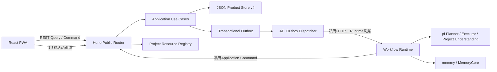

# Chat 前后端交互：当前实现

> 文档类型：当前实现（as-built）
>
> 当前传输：REST Query/Command + TanStack Query受控轮询
>
> 尚未实现：公开SSE Cursor Runtime Journal；目标合同见[技术合同](./technology-contract.md)。

## 1. 一句话说明

浏览器只向Chat API发送公开Query/Command。API校验请求后调用Application用例；Application在Product Store中原子提交产品事实、幂等Receipt和Outbox；API进程再异步启动或恢复Workflow。页面通过Query读取Run、Plan、Approval、Message、Context、Memory Import、Project Candidate和Project账本的权威投影，不从Workflow返回值或本地缓存猜测成功。

## 2. 当前拓扑



当前没有浏览器到Workflow、pi、百炼或Memory服务的直连，也没有公开SSE端点。Vite开发/预览服务只把 `/api` 代理到固定API端口。

## 3. 状态所有权

| 状态 | 权威所有者 | 浏览器怎样使用 |
|---|---|---|
| Session、Message、Run、Plan、Approval、Decision、Memory与Project事实 | Product Store | 通过Query读取，通过Command请求改变 |
| Workflow控制流、Hook等待和Checkpoint | Vercel Workflow Store | 不可见；只看到产品状态投影 |
| Workflow Run ID、Hook Token、Runtime Binding | Workflow Runtime私有存储 | 不进入响应、URL、localStorage或前端Bundle |
| pi会话、Provider请求和模型原始结果 | pi/Provider运行边界 | 只投影经校验的Plan、候选、使用量证据或稳定错误 |
| 草稿、主题、面板状态 | 浏览器 | 可以丢弃，不是产品事实 |
| 待重试Command ID、Session/活动Run定位 | 浏览器localStorage | 用于网络未知恢复；服务端幂等仍是最终保证 |

## 4. 浏览器公开API

实际路由入口是 `apps/api/src/product-routes.ts`，浏览器客户端是 `apps/web/src/api/client.ts`，公开Schema统一从 `@chat/contracts/public` 导出。

### 4.1 健康与准备

| 方法 | 路径 | 用途 |
|---|---|---|
| GET | `/api/healthz` | API进程存活；前端连接状态使用 |
| GET | `/api/readyz` | Product Store可读及百炼配置是否就绪的安全投影 |

### 4.2 Session、Message与Run

| 方法 | 路径 | 类型 | 当前结果 |
|---|---|---|---|
| POST | `/api/sessions` | Command | 幂等创建Session，返回201 |
| GET | `/api/sessions/:sessionId` | Query | 读取Session |
| POST | `/api/sessions/:sessionId/messages` | Command | 原子提交User Message、Product Run、Receipt和Workflow Start Outbox，返回201 |
| GET | `/api/sessions/:sessionId/messages` | Query | Cursor分页读取正式消息 |
| GET | `/api/runs/:productRunId` | Query | 读取Run的`status + phase + revision`及安全错误 |
| GET | `/api/runs/:productRunId/context` | Query | 读取本轮Memory选择、查询和ContextPackage安全摘要 |
| GET | `/api/runs/:productRunId/plans` | Query | 读取全部Plan Revision安全投影 |
| GET | `/api/runs/:productRunId/approvals/current` | Query | 读取当前仍可操作的Approval |
| POST | `/api/runs/:productRunId/decisions` | Command | 提交`request_revision/approve/reject`，返回201 |

### 4.3 Memory

| 方法 | 路径 | 类型 | 当前结果 |
|---|---|---|---|
| GET | `/api/memory-backends` | Query | 返回服务端注册的安全能力投影，不返回endpoint/Token/租户映射 |
| POST | `/api/memory-imports` | Command | 创建Import Intent、初始Result、Receipt和Start Outbox，返回201 |
| GET | `/api/memory-imports/:memoryImportIntentId` | Query | 读取单次导入状态 |
| GET | `/api/sessions/:sessionId/memory-imports` | Query | Cursor分页读取Session导入记录 |
| POST | `/api/memory-imports/:memoryImportIntentId/reconcile` | Command | CAS请求只读对账，返回202 |

### 4.4 Project

| 方法 | 路径 | 类型 | 当前结果 |
|---|---|---|---|
| GET | `/api/project-roots` | Query | 返回服务端允许根及安全Adapter能力，不返回绝对路径 |
| POST | `/api/project-intakes` | Command | 原子提交Message、queued Candidate、Receipt与Start Outbox，返回202 |
| GET | `/api/sessions/:sessionId/project-candidates/current` | Query | 刷新后恢复该Session唯一未决Candidate |
| POST | `/api/project-candidates/:id/decisions` | Command | 修订/确认/拒绝建项Candidate，确认时原子创建完整Project账本 |
| POST | `/api/project-management-candidates` | Command | 从显式管理模式的正式Message确定性编译待办/决定/贡献Candidate |
| POST | `/api/project-management-candidates/:id/decisions` | Command | CAS修订/确认/拒绝；确认后只提交一种对应Project事实 |
| GET | `/api/projects`、`/api/projects/:id`、`/api/projects/:id/timeline` | Query | Portfolio、Workspace与事实时间线 |
| POST | `/api/projects/:id/actions`及Action子命令 | Command | 新增、分派和状态转换，均校验对象revision |
| POST | `/api/projects/:id/resources/:resourceId/observations` | Command | 从允许根刷新只读Observation与Evidence |

## 5. Command合同

所有公开写请求使用统一Envelope：

```json
{
  "commandId": "cmd_...",
  "expectedRevision": 7,
  "payload": {}
}
```

规则：

1. `commandId`是一次用户意图的稳定幂等身份；同一ID同一请求返回原结果。
2. 同一`commandId`配不同规范化请求Hash返回409，不能覆盖原命令。
3. 修改已有对象的Command携带`expectedRevision`；过期页面使用旧revision时返回冲突。
4. Decision还必须绑定Plan ID、Plan revision和Plan SHA-256。
5. 浏览器不能指定Provider、模型、endpoint、Token、Workflow ID、Hook Token或pi Session ID。
6. POST已经发送但响应丢失时，浏览器保留同一个`commandId`并只允许“使用同一命令重试”。
7. Project Candidate同时绑定自身revision/Hash；管理Candidate还绑定Project revision。Project变化后旧候选不能确认，但允许显式拒绝以解除Session阻塞。

## 6. Query合同与当前轮询

前端 `useRealChain` 负责Query组合：

1. 首次打开没有Session定位时，以稳定Bootstrap Command幂等创建Session。
2. 活动Run期间每1.5秒轮询Run、Message、Plan、Approval和Context。
3. `succeeded/failed/cancelled/outcome_unknown`到达后停止活动轮询，并最后失效一次正式资源Query。
4. 导入处于`queued/dispatching`时轮询；MemoryCore的合法`accepted`只有限补查，不把它伪装成L1已物化。
5. 页面不可见时不在后台持续轮询。
6. Command成功后使相关Query失效，再从服务端读取权威状态。

这是一条已经实现并通过真实浏览器验证的恢复路径。未来SSE只负责活动事件和资源失效通知，不改变Query/Command合同，也不能成为产品事实源。

## 7. 规划—确认—执行交互

### 7.1 发送

```text
用户发送文本并选择可选Memory上下文
→ Web保存pending commandId
→ POST Message Command
→ Application原子提交Message + Run + Receipt + Workflow Start Outbox
→ API返回正式Message和Run
→ Web记录activeRunId并失效相关Query
→ Outbox Dispatcher启动PlanningExecutionWorkflow
```

浏览器收到201不代表Workflow已完成，只代表产品命令已经被接纳并耐久记录。

### 7.2 规划与人工决定

```text
Workflow生成并提交Plan Revision + Approval
→ Run进入waiting_human / plan_review
→ Web轮询Query并显示Plan与当前Approval
→ 用户修改、批准或拒绝
→ POST Decision Command
→ Application校验Principal、Run revision、Plan revision/Hash和幂等
→ 原子提交Decision + Resume Outbox
→ Dispatcher使用私有Runtime接口恢复同一Hook
```

- `request_revision`：同一Workflow回到规划循环，生成新Plan Revision。
- `approve`：编译不可变Execution Contract并执行。
- `reject`：提交Run取消终态，不进入执行。

前端从来不持有或调用Hook Token。

### 7.3 正式结果

```text
pi Executor生成候选
→ Workflow持久化候选
→ 确定性验证
→ Application Product Commit
→ 正式Assistant Message + Run succeeded
→ Web下一轮Query读取正式Message
```

Workflow函数正常返回、pi返回成功或前端轮询超时都不能独立产生成功消息。

## 8. Memory导入交互

```text
用户从正式Message选择正文范围和后端
→ POST Memory Import Command
→ Product Store提交Intent + Result(queued) + Receipt + Outbox
→ MemoryImportWorkflow建立dispatching栅栏
→ Adapter执行唯一一次外部写入
→ 提交accepted/materialized/failed/outcome_unknown
→ 必要时用同一身份执行只读reconcile
→ Web Query恢复状态
```

memmy可通过读取与搜索收敛为`materialized`；Tencent MemoryCore的L0接收可以合法停在`accepted`，不能因为L1暂未出现而重复写入。

## 9. Project建项与管理交互

```text
用户显式切换“建立项目”并选择安全rootId
→ POST Project Intake Command
→ Message + queued Candidate + Receipt + Start Outbox
→ ProjectIntakeWorkflow调用Project Understanding并观察真实资源
→ under_review Candidate
→ Web展示可编辑目标、方法、初始Work/Action与资源证据
→ 用户修订/确认/拒绝
→ 确认时原子创建Project完整初始账本 + Resume Outbox
→ Portfolio、Workspace和Timeline从Query恢复
```

普通任务消息不会被隐藏分类器改道。Provider/模型只由服务端Model Profile选择；公开Candidate没有Provider或模型字段。页面删除Candidate定位或刷新时，按Session Query恢复唯一未决候选。

项目建成后，显式“管理项目”模式把用户消息编译为待办、决定或贡献Candidate；必须再次确认才能写入账本。待办分派/状态转换与资源刷新是可见的显式Command：前两者使用对象CAS，资源刷新只观察允许根并生成Observation/Evidence。

## 10. 错误与恢复

HTTP错误统一使用Problem Detail安全投影：

```text
type, title, status, code, requestId, retryable, recoveryAction
```

前端只根据稳定`code`和`recoveryAction`处理，不解析错误字符串。主要恢复语义：

| 情况 | 前端/服务端行为 |
|---|---|
| DTO非法、未知字段或浏览器越权参数 | 400，失败关闭 |
| revision/Hash过期 | 409，重新Query后由用户再次决定 |
| 相同commandId不同请求 | 409，不执行第二次 |
| POST网络断开或2xx响应损坏 | 显示结果未知，保留同一commandId |
| 页面刷新 | 用localStorage中的公开定位ID重新Query；不恢复Runtime私有身份 |
| API重启 | 从JSON Product Store和Outbox恢复；浏览器继续Query |
| Workflow启动/恢复响应未知 | Dispatcher对账Runtime Binding，不盲目启动/恢复第二次 |

## 11. 私有Runtime接口

Workflow Step访问 `/internal/runtime/v1/*`，API Dispatcher访问Workflow Runtime的 `/internal/workflow/v1/*`。两组接口都只绑定本地服务、要求服务端Runtime凭据，并与公开Router、公开DTO和前端Bundle物理分离。

私有接口仍然经过Zod、Application用例、CAS、幂等和Trace；“私有”不等于可以绕过产品事务。

## 12. 当前实现与目标架构的差异

| 能力 | 当前 | 目标 |
|---|---|---|
| 产品读取/写入 | REST Query/Command | 保持不变 |
| 活动状态更新 | 1.5秒受控Query轮询 | Chat自有SSE + Cursor；Query仍负责Hydrate |
| Agent事件 | 只形成后端Trace和产品投影 | AG-UI兼容事件进入唯一Chat事件流 |
| Product Store | 单实例、单写者、版本化JSON v4 | 支持生产事务、多实例、备份恢复的持久Store |
| 身份 | 固定调试Principal | 正式认证、授权与租户隔离 |
| 后端部署 | 本地纵向链已验证 | 生产API/Workflow/Memory部署拓扑尚未冻结 |

不得根据目标架构中的SSE、Runtime Journal或生产数据库描述，声称当前代码已经提供这些能力。

## 13. 修改交互时必须同步验证

1. `packages/contracts`：公开Schema严格拒绝未知字段和内部身份。
2. `packages/application`：命令幂等、CAS、不变量和原子Outbox。
3. `apps/api`：路由状态码、Problem Detail、权限和秘密扫描。
4. `apps/web`：网络未知保留同一commandId、Query失效和刷新恢复。
5. 纵向场景：真实Workflow、指定真实模型、真实浏览器；Memory行为变化还要使用对应真实Memory服务。

主要测试入口见根 `package.json` 和 `docs/debug/local-debug.md`。
