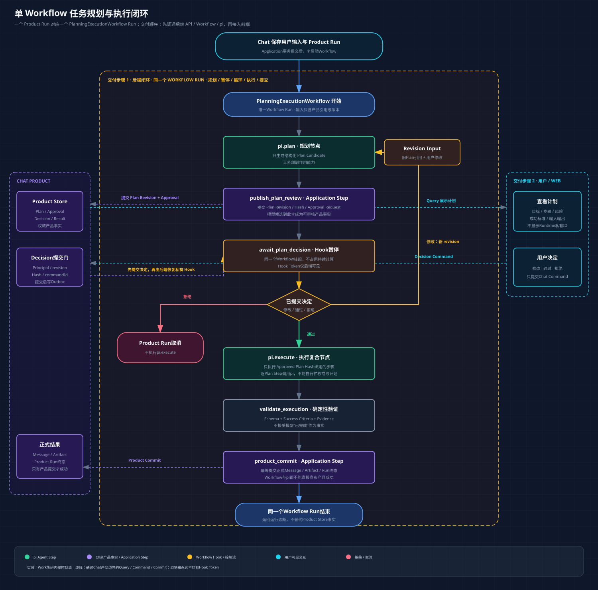

# 单Workflow任务规划与执行设计

> 状态：核心方向已由用户确认；后端实施边界见[工作流后端闭环任务书](../tasks/planning-execution-backend-closure.md)
>
> 日期：2026-08-07
>
> 设计目标：一次用户输入启动一个Vercel Workflow Run；pi规划、人工修改/通过循环、pi执行、结果验证和产品提交都在这个Workflow内完成。

## 1. 结论

Chat采用一个版本化的`PlanningExecutionWorkflow`：

```text
Chat保存用户输入与Product Run
-> 启动一个PlanningExecutionWorkflow
   -> pi规划节点
   -> 保存Plan Candidate
   -> 建立私有Decision Hook并暂停
   -> 用户修改 / 通过 / 拒绝
   -> Chat先提交Product Decision，再恢复同一个Hook
   -> 修改：同一Workflow回到pi规划节点
   -> 通过：同一Workflow进入pi执行节点
   -> 确定性验证执行候选
   -> 通过Application完成Product Commit
-> 同一个Workflow Run结束
```

这里的“Workflow恢复”不是一个新的业务节点，也不会启动第二个Workflow。它表示同一个Vercel Workflow Run在Hook处暂停后，从原检查点继续。

## 2. 用户最终看到什么

以“帮我根据这些资料整理本周进展并生成周报”为第一条验证场景：

1. 用户输入原始要求。
2. Chat显示“正在规划”。
3. pi规划节点给出可阅读的目标、步骤、输入、预计结果、成功标准和风险。
4. Chat进入“等待你确认计划”。用户可以：
   - 直接通过当前版本。
   - 输入修改意见或编辑计划，要求继续规划。
   - 拒绝并结束本次工作。
5. 每次修改都会产生新的计划版本，旧版本保留为证据但不能再批准。
6. 用户通过某个确定版本后，Chat显示“正在执行已批准计划”。
7. pi执行节点只按照已批准版本工作，不能自行增加能力或更换目标。
8. Chat验证结果后提交正式回复或产物；失败时显示失败，不用模型自述冒充成功。

## 3. 为什么必须是一个Workflow Run

1. 规划、等待、恢复和执行属于同一次后台工作，用户应看到一条连续状态链。
2. Vercel Workflow能够在Hook处不占用计算资源地暂停，并在收到信号后继续原控制流。
3. 计划修改循环可以用Workflow内部`while`分支表达；无需用多个Workflow拼出隐式状态机。
4. Workflow Run仍只是运行时对象。Product Run、Plan、Decision、Message和Artifact由Chat Product Store拥有。
5. 如果Workflow部署或实现被替换，产品仍保留用户输入、历次计划、决定、正式结果和证据。

## 4. 总体结构



### 4.1 Workflow边界内

同一个`PlanningExecutionWorkflow`负责：

1. 按顺序调用规划、发布候选、等待决定、执行、验证和提交Step。
2. 在用户要求修改时循环回规划节点。
3. 在用户通过时把不可变的Approved Plan引用交给执行节点。
4. 在用户拒绝、达到修订上限或发生不可恢复错误时进入明确终态。
5. 通过Vercel Workflow Event Log保存控制流进度和Step结果。

### 4.2 Workflow边界外

1. Chat API接收用户命令、校验Principal、revision和`commandId`。
2. Application Coordinator提交User Message、Interaction、Product Run、Plan Candidate、Approval Request、Decision和最终Message/Artifact。
3. Product Store拥有上述长期事实。
4. Runtime Journal拥有浏览器可见的有序事件。
5. pi Adapter执行Agent节点并将可见事件转换成AG-UI兼容投影。
6. 浏览器只提交Chat Command，不直接调用Vercel Workflow或pi。

## 5. Workflow节点

| 节点 | 类型 | 输入 | 输出 | 允许做什么 | 明确禁止 |
|---|---|---|---|---|---|
| `compile_planning_input` | Application Step | Product Run、用户消息、Context Package引用 | 版本化Planning Input | 读取已提交产品事实并编译本轮输入 | 复制完整历史、修改产品事实 |
| `pi.plan` | pi Agent Step | Planning Input、上版计划和用户修订引用 | `PlanCandidatePayload` | 生成结构化计划候选 | 外部副作用、正式批准、执行计划 |
| `publish_plan_review` | Application Step | Plan Candidate、iteration、稳定commandId | Plan Revision与Approval Request引用 | 校验并提交候选，绑定Hash/revision | 让模型直接写数据库 |
| `claim_decision_hook` | Workflow Primitive | Product Run、Plan Revision | 私有Hook | 注册本轮唯一等待点 | 把Hook Token返回浏览器 |
| `await_plan_decision` | Workflow Primitive | 私有Hook | Decision引用信号 | 暂停并恢复同一Workflow | 直接信任浏览器原始决定 |
| `load_committed_decision` | Application Step | Decision引用、Plan Hash/revision | 已验证Decision | 读取Chat已提交决定并复核绑定关系 | 用Hook Payload代替产品事实 |
| `compile_execution_contract` | Application Step | Approved Plan引用、Capability Policy引用 | 不可变Execution Contract | 固定计划、权限、上下文和限制 | 扩大用户未批准能力 |
| `pi.execute` | pi Agent Step | Execution Contract、当前Plan Step | `ExecutionCandidatePayload` | 执行已批准的当前步骤 | 修改计划、越过Capability、宣布产品成功 |
| `validate_execution` | Deterministic Step | 执行候选、Evidence引用、输出合同 | Validation Result | Schema、证据和完成条件校验 | 依赖模型“我完成了”的自述 |
| `product_commit` | Application Step | Approved Plan、验证结果、候选结果 | 正式Message/Artifact与Product Run revision | 幂等提交正式事实 | 由Workflow或pi直接写产品表 |

`claim_decision_hook`和`await_plan_decision`在代码中可以由同一个`defineHook().create()`对象与`await hook`表达；表格将“注册等待点”和“等待恢复”分开，是为了明确失败与安全边界。

## 6. Workflow伪代码

以下代码只表达责任和控制流，不是P1.2实现任务，也不是未经验证即可复制的最终代码：

```ts
export async function planningExecutionWorkflow(input: PlanningExecutionWorkflowInput) {
  "use workflow";

  let planRevision = 0;
  let revisionInputRef: RevisionInputRef | undefined;

  while (planRevision < input.limits.maxPlanRevisions) {
    planRevision += 1;

    const planningInput = await compilePlanningInput({
      productRunId: input.productRunId,
      sourceMessageRef: input.sourceMessageRef,
      contextPackageRef: input.contextPackageRef,
      priorPlanRef: revisionInputRef?.priorPlanRef,
      userRevisionRef: revisionInputRef?.userRevisionRef,
    });

    const planCandidate = await runPiPlanner({
      ...planningInput,
      planRevision,
      outputContractVersion: input.planContractVersion,
    });

    using decisionHook = planDecisionHook.create({
      token: decisionHookToken(input.productRunId, planRevision),
    });

    const conflict = await decisionHook.getConflict();
    if (conflict) {
      return await failRuntimeConflict(input.productRunId, planRevision);
    }

    const review = await publishPlanForReview({
      productRunId: input.productRunId,
      planCandidate,
      planRevision,
      hookToken: decisionHook.token,
      commandId: `open-plan-review:${input.productRunId}:${planRevision}`,
    });

    const resumeSignal = await decisionHook;
    const decision = await loadCommittedDecision({
      decisionRef: resumeSignal.decisionRef,
      expectedPlanRef: review.planRef,
      expectedPlanHash: review.planHash,
      expectedPlanRevision: review.planRevision,
    });

    if (decision.kind === "request_revision") {
      revisionInputRef = {
        priorPlanRef: review.planRef,
        userRevisionRef: decision.revisionInputRef,
      };
      continue;
    }

    if (decision.kind === "reject") {
      return await commitRejectedRun(input.productRunId, decision.ref);
    }

    const executionContract = await compileExecutionContract({
      productRunId: input.productRunId,
      approvedPlanRef: review.planRef,
      approvedPlanHash: review.planHash,
      decisionRef: decision.ref,
      capabilityPolicyRef: input.capabilityPolicyRef,
      contextPackageRef: input.contextPackageRef,
    });

    const stepCandidates = [];
    for (const planStep of executionContract.steps) {
      stepCandidates.push(
        await runPiExecutor({ executionContract, planStep }),
      );
    }

    const validation = await validateExecution({
      executionContract,
      stepCandidates,
    });

    return await commitProductResult({
      productRunId: input.productRunId,
      executionContract,
      validation,
      commandId: `commit-result:${input.productRunId}:${review.planHash}`,
    });
  }

  return await commitPlanningLimitReached(input.productRunId);
}
```

关键点：

1. `while`循环、分支和Hook都在同一个Workflow函数里。
2. 每次`runPiPlanner`都是同一Workflow中的一次规划节点执行，而不是启动子Workflow。
3. `runPiExecutor`按已批准计划步骤执行；在界面上属于一个“执行”复合节点，其子步骤可逐项显示。
4. Workflow只传递序列化值和产品引用，不持有数据库连接、HTTP Context或React对象。
5. 每个Application Step使用稳定`commandId`，允许Vercel Step安全重放而不重复提交产品事实。

## 7. 计划候选合同

规划节点必须返回结构化候选，而不是一段不可校验的Markdown：

```ts
type PlanCandidatePayload = {
  schemaVersion: "plan-candidate.v1";
  objective: string;
  summary: string;
  assumptions: Array<{
    statement: string;
    source: "user" | "context" | "planner";
  }>;
  openQuestions: string[];
  steps: Array<{
    stepId: string;
    title: string;
    purpose: string;
    dependsOn: string[];
    inputRefs: ContextRef[];
    expectedOutput: string;
    successCriteria: string[];
    requestedCapabilities: string[];
    risk: "low" | "medium" | "high";
  }>;
  completionCriteria: string[];
  warnings: string[];
};
```

以下字段由Chat确定性生成，不允许模型决定：

1. `planId`、`productRunId`。
2. `revision`、`createdAt`、`createdBy`。
3. canonical JSON Hash。
4. 实际批准状态和过期状态。
5. 最终Capability集合。

### 7.1 用户修改怎样进入下一轮

用户修改不是覆盖旧计划：

1. Chat保存原始修改文字或结构化编辑为`Revision Input`。
2. Decision绑定当前`planRef + revision + hash`。
3. 当前Plan Revision进入`superseded`。
4. 同一个Workflow恢复后，把旧计划引用与Revision Input引用交给下一次`pi.plan`。
5. 新候选形成新revision，再次等待用户决定。

如果用户直接编辑计划结构，编辑内容仍先成为用户来源的Revision Input；它不会在没有新Hash和再次确认的情况下自动成为Approved Plan。

## 8. 人工决定与Hook映射

### 8.1 用户可提交的决定

```ts
type PlanDecision =
  | {
      kind: "approve";
      planRef: PlanRef;
      planRevision: number;
      planHash: string;
    }
  | {
      kind: "request_revision";
      planRef: PlanRef;
      planRevision: number;
      planHash: string;
      revisionInputRef: RevisionInputRef;
    }
  | {
      kind: "reject";
      planRef: PlanRef;
      planRevision: number;
      planHash: string;
      reason?: string;
    };
```

### 8.2 正确恢复顺序

```text
用户在Web点击修改 / 通过 / 拒绝
-> POST Decision Command到Chat API
-> Hono校验DTO并建立Principal
-> Application校验权限、commandId、expectedRevision、Plan Hash和expiry
-> Product事务提交Decision + Outbox
-> API向浏览器返回Product Decision，不返回Hook Token
-> Outbox Worker读取后端私有Hook映射
-> Worker调用defineHook.resume(hookToken, { decisionRef })
-> 同一个PlanningExecutionWorkflow从await hook继续
-> Workflow通过Application Step读取已提交Decision并再次核对绑定关系
```

Hook Payload只携带不可变`decisionRef`及必要的完整性字段，不携带未经产品提交的浏览器原始选择。

### 8.3 Hook Token

1. 每个`productRunId + planRevision`使用一个后端私有、确定性Hook Token。
2. Hook Token只存在于Workflow Adapter和私有映射，不返回浏览器。
3. `defineHook`使用Zod Schema验证恢复信号。
4. Workflow在发布Approval Request前通过`hook.getConflict()`确认Hook已注册；冲突进入明确Runtime失败，不恢复未知运行。
5. 同一Decision Command重复提交只形成一个产品决定和一次有效Resume dispatch。

## 9. pi规划节点

### 9.1 输入

`pi.plan`接收：

1. 用户原始消息引用，不接受被摘要替换的原文。
2. 当前Context Package引用及每项`revision/hash`。
3. 上一版Plan引用和用户Revision Input引用。
4. `modelProfileRef`、最大turn、timeout和token budget。
5. `PlanCandidatePayload`输出合同版本。

### 9.2 工具边界

规划节点没有外部副作用工具，只暴露一个Chat内部结果收集工具：

```text
submit_plan_candidate(plan: PlanCandidatePayload)
```

该工具只把经过Schema校验的候选交回`PiRuntimePort`，不写Product Store、不恢复Hook、不执行计划。冻结pi源码已经证明`AgentTool`支持Schema参数、事件、`beforeToolCall/afterToolCall`和`terminate`结果；冻结版本没有可直接替代Chat输出合同的产品级Plan对象，因此由pi Adapter提供内部结果收集工具。

为防止Hook或工具层修改参数后绕过校验，Adapter在`execute()`内再次使用Chat的Zod合同解析；TypeBox工具Schema只作为模型调用入口校验。

### 9.3 输出和失败

1. 模型必须调用一次`submit_plan_candidate`。
2. 没有调用、调用多次、Schema不合法或超出限制都返回`invalid_candidate`，不发布Plan Revision。
3. pi文本、thinking或“计划完成”只是运行事件，不是Plan事实。
4. 只有`publish_plan_review`通过Application提交后，用户才看到正式候选和可用决定按钮。

## 10. pi执行节点

### 10.1 Execution Contract

用户通过后，Application从Approved Plan生成不可变执行合同：

```ts
type ExecutionContract = {
  schemaVersion: "execution-contract.v1";
  productRunId: string;
  approvedPlanRef: PlanRef;
  approvedPlanHash: string;
  approvalDecisionRef: DecisionRef;
  contextPackageRef: ContextPackageRef;
  steps: ApprovedExecutionStep[];
  capabilityRefs: string[];
  policySnapshotRef: string;
  limits: {
    maxTurnsPerStep: number;
    timeoutMsPerStep: number;
    tokenBudgetPerStep?: number;
  };
};
```

执行节点不能：

1. 修改`approvedPlanRef/hash`。
2. 添加不在`capabilityRefs`中的工具。
3. 把新发现的高影响动作直接执行；必须创建新的产品决定并进入后续受控流程。
4. 仅凭模型文本把步骤或Product Run标记为完成。

### 10.2 执行粒度

用户界面可以显示一个“执行”复合节点，但Workflow按Approved Plan Step逐项调用`runPiExecutor`：

1. 每个Plan Step拥有独立`attemptId`和可观察事件。
2. 前一步结果通过Evidence/Artifact引用传给后一步，不复制无限Transcript。
3. 每一步输出结构化`ExecutionCandidatePayload`。
4. 所有步骤完成后进入统一确定性验证。

### 10.3 第一版执行范围

第一条验证场景只开放无外部副作用或可确定性重放的Chat内部能力，例如整理输入、生成Markdown候选和形成摘要。发送邮件、修改代码仓库、写日历、扣费或删除数据等真实副作用到P5接入Tool Execution Ledger后再开放。

## 11. Product Commit

执行完成必须经过三道门：

1. **结构门**：所有输出符合Schema，步骤依赖和数量与Approved Plan一致。
2. **证据门**：每个成功标准都有结果或Evidence引用；不能只引用模型自述。
3. **产品门**：Application Coordinator在事务中提交正式Message/Artifact、Product Run终态与Outbox。

只有产品门成功后：

1. Product Run进入`succeeded`。
2. Assistant Message或Artifact成为正式事实。
3. Runtime Journal发布产品终态和资源失效事件。

Workflow返回值只用于运行诊断，例如：

```ts
{
  outcome: "product_committed",
  productRunId: "run_...",
  productRevision: 12,
}
```

Workflow返回成功本身不能替代Product Store中的终态。

## 12. 状态机

### 12.1 Product Run

现有Domain状态保持不变，`planning/executing/validating`是运行阶段投影，不新增一套竞争的Product Run终态：

```text
status=pending,       phase=queued
-> status=running,       phase=planning
-> status=waiting_human, phase=plan_review
   -> status=running,    phase=planning       用户要求修改
   -> status=running,    phase=executing      用户通过
   -> status=cancelled                         用户拒绝
-> status=running,       phase=validating
-> status=succeeded | failed | cancelled | outcome_unknown
```

`status`使用现有`pending/running/waiting_human/succeeded/failed/cancelled/outcome_unknown`合同；`phase`只解释当前运行到了哪个用户可见阶段，不能成为另一套终态来源。

### 12.2 Plan Revision

```text
candidate
-> under_review
   -> approved
   -> superseded               用户要求修改或新版本产生
   -> rejected
   -> expired
```

任意时刻一个Product Run最多只有一个`under_review` Plan Revision。旧revision、旧Hash或已过期Approval Request的Decision必须失败关闭。

## 13. 事件投影

浏览器仍只订阅Chat Event Feed：

| 内部变化 | 公开投影 |
|---|---|
| `pi.plan`开始/结束 | `STEP_STARTED` / `STEP_FINISHED`，节点名“规划任务” |
| Plan Candidate已提交 | Product资源失效事件，Web通过Query读取完整Plan |
| 等待决定 | AG-UI兼容Interrupt投影，引用`approvalRequestId` |
| 用户决定已提交 | 决定状态事件，不包含Hook Token |
| `pi.execute`步骤 | Step、Activity、允许公开的Tool Call/Result事件 |
| 验证失败 | 用户可执行错误，不泄漏Provider Payload或隐藏推理 |
| Product Commit成功 | Product Run终态 + Message/Artifact失效事件 |

Vercel Workflow原始事件和pi原始事件不直接发给浏览器。

### 13.1 Trace与历史回放

Trace不是会话副本，也不是第二份产品事实源。它只记录一次工作经过的系统边界、调用关系、状态转换、Run Attempt、版本、耗时、错误、统计和产品对象引用。用户消息、Plan、Decision、模型候选、Prompt、Provider请求与响应正文不复制进Trace；模型隐藏推理永远不保存。

完整历史回放由五类数据共同完成：

| 数据来源 | 责任 |
|---|---|
| Product Store | 保存Message、Plan各revision、Decision、Execution Candidate、正式结果和Artifact等产品事实与正文 |
| Trace | 保存按`productRunId`关联的系统时间线、Attempt、步骤、对象引用、Hash、耗时和错误 |
| Workflow Store | 保存Workflow运行状态、Checkpoint、Hook等待与恢复状态 |
| 版本证据 | 保存Git SHA、Workflow Definition、Prompt模板和模型配置版本 |
| Replay Assembler | 按引用加载上述数据、校验revision与Hash并生成`RunReplayView` |

Trace事件采用以`eventName`判别的严格Schema，每种事件只允许自己的白名单字段。Plan、Decision等版本对象使用`objectId + revision + sha256`引用，不可变对象至少绑定`objectId + sha256`；正文、任意`attributes/metadata/details`、Hook Token和原始错误消息不能进入Trace。

历史回放与重新执行必须分开：历史回放读取当时保存的产品对象和Trace，可以重建当时可观察到的路径；真实模型重新执行不保证产生相同文本，必须创建新的Run Attempt并保留与原运行的血缘，不能覆盖历史结果。Replay Assembler发现对象缺失、revision不存在、Hash不一致、Trace事件缺口或版本证据不可读取时必须明确标记，不能拼出看似完整的假回放。

## 14. 重试、恢复与结果未知

### 14.1 Workflow Step默认重试不是通用答案

`workflow@4.8.0`的Step默认重试3次。设计按责任区分：

1. 纯计算和读取Step可以安全重试。
2. Application提交Step必须使用稳定`commandId`和CAS；重复调用返回原结果。
3. pi模型调用在Provider请求发出后失联时可能产生重复费用或不同候选。没有Provider幂等或查询能力前，`pi.plan`和`pi.execute` Step设置`maxRetries = 0`，由Product Attempt显式决定是否重试。
4. 外部Tool副作用不得依赖Vercel Step自动重试。必须通过Tool Execution Ledger、稳定幂等Key、查询/对账和`outcome_unknown`处理。
5. Hook Resume失败不能盲目循环；Outbox Dispatch记录必须区分未发送、已发送、Hook不存在和结果未知。

### 14.2 恢复边界

1. Workflow Worker退出：Vercel Workflow Event Log恢复同一个Workflow Run控制流。
2. 浏览器刷新：Query恢复Plan、Decision和Product Run；SSE按Cursor恢复活动投影。
3. pi节点失败：保存Run Attempt和错误分类；不把半成品发布为Plan或结果。
4. Product Commit失败：保留验证通过的候选，重试幂等产品提交，不重新执行pi。
5. 部署新版本：既有Workflow Run继续固定在原部署；新Workflow Definition版本只用于新Product Run。

## 15. 取消与上限

1. 用户可以在等待计划决定时拒绝，Product Run进入`cancelled`并恢复Hook让Workflow正常结束。
2. 规划修订次数由Workflow Definition Policy限制，建议第一版默认5次；达到上限后进入`failed`并提供“调整目标后重新开始”的恢复动作，不让已经结束的Workflow假装仍可恢复，也不无限消耗模型调用。
3. 每个pi节点都有turn、时间和token限制。
4. 用户在执行中取消时，先提交Product Cancel Command，再由后端取消或中断Runtime；连接断开不等于取消。

## 16. 测试矩阵

### 16.1 Domain与Application

1. Plan Revision状态机和非法转换。
2. 一个Product Run最多一个活动Approval Request。
3. Decision绑定正确revision/hash；旧、重复、过期、越权决定失败。
4. `commandId`重复不创建第二个Plan、Decision、Product Message或Run终态。
5. Product Commit失败不产生正式Message或假成功。

### 16.2 Workflow真实集成

使用`workflow@4.8.0`和`@workflow/vitest`真实运行：

1. 一个Product Run只启动一个Workflow Run。
2. 第一次Plan Candidate后到达预期Hook。
3. `request_revision`恢复同一Workflow Run，并第二次调用规划节点，不启动新Workflow。
4. `approve`恢复同一Workflow Run并进入执行节点。
5. `reject`结束同一Workflow Run且不调用执行节点。
6. 重复Decision只恢复一次Hook。
7. Workflow replay不重复已完成的pi节点或Application提交。
8. 旧Plan Hash不能恢复当前Hook。

### 16.3 pi Adapter

1. Planner只得到内部`submit_plan_candidate`工具，不得到执行工具。
2. Plan Schema合法时产生一个候选；无调用、多调用、非法Schema失败。
3. Executor只得到Execution Contract批准的Capability。
4. pi事件转换成AG-UI兼容事件且不泄漏pi Session、Provider请求身份或隐藏推理。
5. 纯合同测试可以使用确定性输入，但真实完成门必须由百炼`qwen3.7-plus`证明Planner和Executor确实经过真实Provider；真实测试缺少凭据时失败关闭，不能静默跳过。

### 16.4 端到端用户场景

1. 输入 -> 计划v1 -> 用户修改 -> 计划v2 -> 用户通过 -> 执行 -> 正式结果。
2. 页面在每个阶段刷新都从服务端恢复正确Plan、Decision和Run状态。
3. SSE断开不取消Workflow；恢复后不重复规划或执行。
4. 执行失败、验证失败和Product Commit失败都没有假成功。
5. 浏览器响应、URL、localStorage和事件中没有Workflow Run ID、Hook Token或pi Session ID。

## 17. 两个交付步骤：先后端，后前端

用户已明确本工作流分为两个交付步骤。**步骤一先用真实后端API、Workflow、pi和百炼`qwen3.7-plus`把整条链证明完成；前端只允许把现有聊天输入框接到Message Command以触发Workflow，不接Plan、Decision或执行进度。步骤一通过后，步骤二才完成工作流前端适配。**

这两个步骤是用户可理解的交付阶段，不代表把全部后端塞进一个巨大PR。每个内部开发任务仍遵守“一项主要结果、一个独立PR”的工程规则。

### 17.1 步骤一：后端闭环

#### 用户得到什么

不增加新的Workflow界面。用户先从现有Chat输入框发送消息，开发者再通过Chat API或仓库内调试客户端完成：

```text
提交用户输入
-> 查询Plan v1
-> 提交修改意见
-> 查询同一Product Run中的Plan v2
-> 通过Plan v2
-> 查询执行状态
-> 读取正式结果
```

整个过程使用一个Product Run和一个`PlanningExecutionWorkflow` Run。聊天输入框只负责提交正式Message Command；Plan修改、批准、拒绝和结果核验不依赖React本地状态，也不允许人工修改JSON Store。

#### 后端实现范围

允许修改：

1. `packages/contracts`：Message、Run、Plan Revision、Approval Request、Decision、结果Query/Command Schema。
2. `packages/domain`：Plan Revision与Decision状态机、Product Run阶段规则和不变量。
3. `packages/application`：提交输入、发布计划、提交决定、生成执行合同、验证结果和Product Commit用例。
4. `packages/workflows`：单个`PlanningExecutionWorkflow`、Step、Decision Hook和循环。
5. `packages/pi-runtime`：`PiRuntimePort`实现、`pi.plan`、`pi.execute`、结构化候选收集和事件归一化。
6. `packages/realtime`：只实现后端运行事件记录所需的部分；前端订阅可以留到步骤二。
7. `packages/testing`：JSON Store、Workflow Hook、幂等、重放、失败Fixture和必须显式运行的真实百炼Provider场景。
8. `apps/api`：只增加Chat Query/Command入口与组合根，不把事务写进Router。
9. `apps/web`：只把现有聊天输入框接到Message Command，并让模型标签与实际`qwen3.7-plus`一致；不得接入Plan、Decision或执行状态。
10. `.vscode`与调试脚本：固定端口、启动前清理旧Chat调试进程、健康等待、断点和停止清理。

禁止修改：

1. 不修改`apps/web`来展示Plan、Decision或执行进度；聊天发送链以外的界面保持不变。
2. 不新增前端fixture冒充真实后端状态。
3. 不让调试工具直接读取Product Store表、调用pi或使用Hook Token。
4. 不用Vercel Workflow控制台状态替代Chat Query结果。
5. 不开放真实外部副作用Tool；第一版执行仍限于无副作用结果生成。

#### 后端API调试面

字段级Schema在实现任务中冻结，但至少需要以下语义入口：

```text
POST /api/sessions/:sessionId/messages
GET  /api/runs/:productRunId
GET  /api/runs/:productRunId/plans
GET  /api/runs/:productRunId/approvals
POST /api/runs/:productRunId/decisions
GET  /api/sessions/:sessionId/messages
```

要求：

1. 发送消息命令创建或返回同一个Product Run，并私下启动一个Workflow Run。
2. Plan Query返回当前revision、Hash、状态和可读步骤，不返回Workflow Run ID或Hook Token。
3. Decision Command支持`request_revision/approve/reject`，必须携带`commandId`、`expectedRevision`、Plan revision和Hash。
4. Result通过正式Message/Artifact Query读取，不从Workflow Return Value拼装。
5. 调试客户端只能调用这些Chat接口，确保未来Web复用同一合同。

#### 无前端调试路径

仓库提供可复制的API场景测试或调试客户端，顺序必须是：

1. 启动真实Hono + Vercel Workflow本地运行时。
2. 使用真实百炼Provider和真实`qwen3.7-plus`运行pi Agent loop，生成Schema合法的Plan v1。
3. 轮询Run/Plan Query直到`status=waiting_human, phase=plan_review`。
4. 通过Decision Command提交`request_revision`，而不是直接调用`resumeHook()`。
5. 验证同一个Product Run产生Plan v2，且内部仍是同一个Workflow Run。
6. 通过Decision Command批准Plan v2。
7. 使用真实百炼`qwen3.7-plus`运行`pi.execute`，完成无副作用结果候选。
8. 查询正式Message/Artifact与`succeeded` Product Run。

`resumeHook()`只允许出现在Workflow Adapter和底层Workflow集成测试中。端到端后端测试必须从Decision Command进入，证明“先提交产品决定，再恢复Hook”的正式链路。

#### 后端完成门

步骤一全部通过后才能开始前端：

1. 一次输入只创建一个Product Run和一个Workflow Run私有映射。
2. `pi.plan`真实执行并产生Schema合法的Plan Candidate。
3. Plan Candidate只有经过Application提交后才可Query。
4. `request_revision`恢复同一个Workflow并再次调用`pi.plan`。
5. `approve`进入`pi.execute`；`reject`不会调用执行节点。
6. 旧revision、错误Hash、重复commandId、过期或越权Decision安全失败。
7. 调试客户端和公开API都看不到Hook Token、Workflow Run ID或pi Session ID。
8. `pi.execute`只能获得Approved Plan和允许的无副作用Capability。
9. Workflow replay不重复已完成的pi节点或产品提交。
10. pi失败、Workflow失败、验证失败和Product Commit失败都不产生假成功。
11. Product Commit失败时保留候选并重试幂等提交，不重新运行pi执行。
12. 纯规则CI不产生付费调用；另有必须显式运行、缺少凭据即失败的真实百炼Provider和完整E2E入口。没有真实`qwen3.7-plus`脱敏Trace证据时不得宣称后端闭环完成。
13. Product Session、Message、Run、Plan、Approval、Decision和正式结果写入版本化JSON Product Store，并能在API进程重启后重新读取。
14. Trace可以按`productRunId`重建命令、事务、Workflow、Hook、Provider、pi、验证和Product Commit时间线，且不保存密钥、完整正文、完整Provider Payload或隐藏推理。
15. VS Code使用固定端口并在每次启动前清理上一次本项目调试进程；未知应用占用端口时安全失败，不杀无关进程也不自动换端口。

后端调试证据至少包含：自动测试数量、一次完整API记录、Product Run状态序列、Plan v1/v2 Hash变化、同一Workflow私有映射断言和最终正式Message/Artifact Query结果。证据不得包含密钥、Hook Token、完整Provider Payload或隐藏推理。

### 17.2 步骤一到步骤二的冻结门

开始前端前必须冻结：

1. Run、Plan、Approval、Decision和Message/Artifact Query/Command Schema版本。
2. Product Run的`status + phase`投影。
3. Decision错误族与`recoveryAction`。
4. Plan节点、执行节点和等待状态的公开事件语义。
5. 分页、revision、Hash、空态、失败和重试边界。

如果前端开发期间发现必须修改后端合同，先回到步骤一修改合同与后端测试；不在React层增加兼容猜测。

### 17.3 步骤二：前端接入

步骤二只消费步骤一已经通过的Chat合同：

1. 在现有工作流运行区显示后端Plan、revision、风险和步骤。
2. 提供修改意见、通过和拒绝入口，并提交Decision Command。
3. 显示`planning/waiting_human/executing/validating/succeeded/failed`阶段投影。
4. 页面刷新后从Query恢复正式Plan、Decision和结果。
5. SSE接入后按Chat Event Feed更新活动进度，不订阅Vercel或pi原始流。
6. 手机端沿用“对话 / 工作”切换，不重新定义后端状态。

前端完成门：同一个真实后端场景在桌面和375px手机上完成“Plan v1 -> 修改 -> Plan v2 -> 通过 -> 执行 -> 正式结果”；刷新、断线、重复点击和后端失败均不产生假成功。

### 17.4 与当前P1任务的关系

1. 当前P1.2仍由Kimi独立完成PWA、离线草稿和手机布局，不安装Workflow或pi。
2. P1.3先提供服务端Message/Product Run基础，成为后端步骤一的产品入口。
3. P1.4验证真实Vercel Workflow启动和确定性提交。
4. P1.7验证冻结pi工件与Agent Adapter。
5. 上述基础通过后，后端步骤一补齐Plan、Decision Hook循环和pi规划/执行闭环。
6. 后端步骤一完成并冻结合同后，才进入步骤二前端接入；现有聊天输入框的最小Message Command接线是步骤一的触发入口，不等于提前实现Workflow前端。

步骤一的7个顺序PR、JSON Store、Trace、VS Code端口、百炼凭据和测试细节以[工作流后端闭环任务书](../tasks/planning-execution-backend-closure.md)为准。

## 18. 已核验的源码与官方依据

### Vercel Workflow

核验版本：`workflow@4.8.0`，Apache-2.0，当前稳定版本。

1. [Workflows and Steps](https://useworkflow.dev/docs/foundations/workflows-and-steps)：Workflow函数负责编排，Step拥有完整Node运行时，Step结果进入Event Log。
2. [Hooks](https://useworkflow.dev/docs/foundations/hooks)：同一Workflow可以在Hook暂停并用外部数据恢复。
3. [defineHook](https://useworkflow.dev/docs/api-reference/workflow/define-hook)：支持类型一致和Zod运行时校验。
4. [Errors and Retries](https://useworkflow.dev/docs/foundations/errors-and-retries)：Step默认重试3次，可用`maxRetries = 0`关闭。
5. [Idempotency](https://useworkflow.dev/docs/foundations/idempotency)：Step ID在重试间稳定，但Chat产品提交仍使用自己的产品幂等身份。
6. [Versioning](https://useworkflow.dev/docs/foundations/versioning)：运行固定到启动它的部署，新运行使用新版本。
7. [Workflow Testing](https://useworkflow.dev/docs/testing)：`@workflow/vitest`可以真实测试Hook、恢复和重放。

### pi

能力核验源码：`/Users/xulater/Code/opc-os/pi`提交`10e99ae9914cd34f622633fac42f9a90714e9cf4`。
实际运行工件是锁文件固定的npm `@earendil-works/pi-agent-core`/`pi-ai` 0.82.1，
发布基点`b4f293684bba718d59cc1157679bcf6157b3a7f5`；两者不得混称。

1. `packages/agent/src/agent.ts`：`Agent`支持`prompt()`、`continue()`、`subscribe()`、`abort()`、消息状态和工具配置。
2. `packages/agent/src/types.ts`：`AgentTool`具有Schema参数、执行回调、更新事件和`terminate`提示。
3. `packages/agent/src/agent-loop.ts`：Agent循环发出message/tool/turn/agent事件，并在模型边界转换上下文。
4. `packages/agent/test/agent-loop.test.ts`：测试证明工具参数校验、顺序/并行执行、截断Tool Call拒绝和可控stream函数。
5. 本地pi工作区当前HEAD不是能力对照提交，因此本设计只使用`git show 10e99ae...`核验能力；运行行为由npm工件合同测试背书，不把本地后续分支能力写成运行事实。

### 阿里云百炼

1. [模型大全](https://help.aliyun.com/zh/model-studio/models)：确认真实模型ID为`qwen3.7-plus`。
2. [文本生成模型](https://help.aliyun.com/zh/model-studio/text-generation-model)：确认`qwen3.7-plus`支持Function Calling和结构化输出。
3. [Base URL总览](https://help.aliyun.com/zh/model-studio/base-url)：确认按量付费与业务空间Endpoint，并明确Token Plan/Coding Plan不能用于后端服务。
4. [OpenAI兼容Chat API](https://help.aliyun.com/zh/model-studio/qwen-api-via-openai-chat-completions)：确认`DASHSCOPE_API_KEY`与OpenAI兼容调用方式。

## 19. 用户已经确认的实施决定

1. 一次用户输入对应一个Product Run和一个`PlanningExecutionWorkflow` Run。
2. 用户每次修改形成新Plan Revision并再次等待确认，不覆盖或自动批准旧版本。
3. Workflow内部按Approved Plan Step逐项调用pi执行。
4. 第一版执行只做无外部副作用任务；真实外部Tool在P5治理完成后开放。
5. 规划修订默认上限5次。
6. 后端闭环必须做好脱敏Trace和可重复VS Code调试。
7. 现有聊天输入框接入Message Command以触发Workflow，其余Workflow前端后续实现。
8. Planner和Executor必须使用真实百炼Provider与真实`qwen3.7-plus`完成验收。
9. 当前使用版本化JSON Product Store保存会话及闭环产品事实。

上述决定已固化到[工作流后端闭环任务书](../tasks/planning-execution-backend-closure.md)，下一次用户审核重点是任务拆分、完成门和保证边界，不再重新讨论单Workflow结构。
