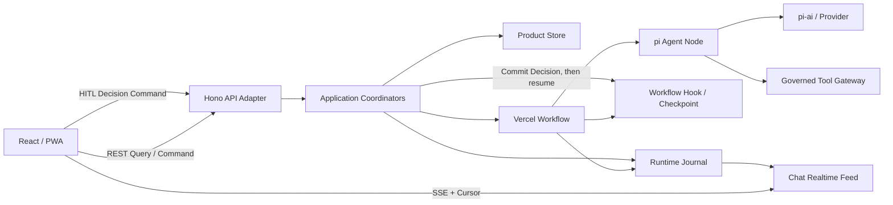

# Chat 前后端技术选型与实施合同

> 状态：已批准并冻结
>
> 日期：2026-08-06
>
> 作用：约束目标系统的前端、后端、实时交互、Workflow、HITL、Checkpoint与Agent Runtime。字段级Schema仍在各实现工作包中定义。

## 1. 决策摘要

Chat采用“三种责任组合”，而不是让一个框架拥有整个产品：

1. Chat产品后端拥有身份、会话、工作、决定、运行、证据和长期事实。
2. Vercel Workflow拥有耐久执行、等待、恢复和运行时Checkpoint。
3. pi拥有Agent loop、模型、Tool调用和Agent运行事件。

前端只面对Chat后端。AG-UI作为Agent交互事件语义存在于Chat的单一有序事件流中，不承担产品资源API，也不让浏览器直接连接Workflow或pi。

## 2. 冻结技术栈

| 位置 | 选择 | 责任 |
|---|---|---|
| 语言 | TypeScript strict | 前端、后端、Workflow和共享合同统一语言 |
| Workspace | pnpm Workspace | 多App、多Package依赖与锁文件 |
| Web | React + Vite | 响应式Web与PWA交互面 |
| 服务端状态 | TanStack Query | REST Query缓存、失效、刷新与加载状态 |
| Agent事件 | `@ag-ui/core`，按需使用`@ag-ui/client` | Run、Step、Text、Tool、Activity、Interrupt等兼容事件 |
| HTTP/API | Node.js + Hono | Web标准Request/Response、REST、Command与SSE边界 |
| 运行时校验 | Zod | 网络DTO、Command、Hook Payload和外部结果校验 |
| Workflow | Vercel Workflow | 耐久Step、等待、恢复、重放和Checkpoint |
| Agent | `pi-agent-core` | Agent loop与事件 |
| Model | `pi-ai` | Model与Provider抽象 |
| Coding Agent | `pi-coding-agent` | 受治理编码执行能力 |
| 测试 | Vitest + Playwright | 单元/合同/集成和真实浏览器验证 |
| 可观察性 | OpenTelemetry语义 | 关联请求、Product Run、Workflow与外部Attempt |

框架家族和职责已经冻结；确切包版本在P0创建锁文件时固定，并记录对应源码、官方文档和升级门。

## 3. 系统拓扑



浏览器没有到Vercel Workflow、pi、Provider或Tool的直连路径。

## 4. 前端合同

### 4.1 React负责什么

React负责：

- Workspace、Chat Pane、Workflow Run View、Artifact Preview和设置等界面。
- 用户输入、Workflow选择、审批、取消、Retry、Restart和恢复动作。
- REST服务端状态投影、AG-UI运行事件投影和PWA交互。
- 桌面、手机、键盘、触摸、弱网和可访问性体验。

React不负责：

- 权威Message、Project、Work、Approval或Product Run终态。
- Workflow Checkpoint和Hook Token。
- pi Session、Provider请求身份和Tool副作用账本。
- 从本地缓存推断正式成功。

### 4.2 前端状态分类

| 状态 | 工具 | 生命周期 |
|---|---|---|
| 产品资源投影 | TanStack Query | 由服务端revision、ETag或事件失效；可重新查询 |
| 活动Agent投影 | AG-UI兼容Reducer | 由有序事件流重建；不能直接提交产品事实 |
| 页面状态 | React局部状态，必要时使用轻量UI Store | 面板、筛选、焦点、展开和布局 |
| 输入草稿 | 浏览器本地存储或IndexedDB | 可丢弃、可按Product Session隔离，不是Message |
| PWA缓存 | Service Worker/Cache Storage | 静态外壳与明确可缓存Query；不得缓存授权决定为事实 |

不使用一个全局Store同时管理产品资源、运行事件、草稿和布局。

### 4.3 PWA边界

- 离线时可以打开外壳、阅读允许缓存的投影和编辑草稿。
- 离线时不能把产品写命令显示为已经成功。
- 后台通知使用Web Push或平台通知，不依赖永久保持SSE。
- 重新上线后先恢复身份与服务端状态，再恢复活动流；不得自动重放高影响命令。

## 5. 后端合同

### 5.1 Hono的边界

Hono只负责：

- HTTP路由和Web标准Request/Response。
- Authentication Context接入。
- 请求大小、Content Type和Zod DTO校验。
- Query、Command和SSE的协议终止。
- Problem Detail错误投影、Request ID和安全响应头。

Hono Router不得直接修改Product Store、恢复Workflow Hook或调用pi。它必须调用Application Coordinator。

### 5.2 Application Coordinator

一个用户用例只有一个Application Coordinator，负责：

1. 读取Principal和当前revision。
2. 校验命令权限、幂等身份和前置条件。
3. 开启并拥有产品事务。
4. 修改领域对象并写Outbox/Runtime Journal引用。
5. 在事务外启动或恢复Workflow。
6. 把外部结果重新带回产品提交门。

外部调用不放进产品数据库事务。

### 5.3 Product Store的要求

本合同不提前选择数据库，但任何实现必须支持：

- 事务、唯一约束、乐观并发和CAS。
- `commandId`幂等。
- Product Run、Attempt和Runtime映射。
- Transactional Outbox。
- 事件序号原子分配。
- 备份、恢复、迁移与审计。

Product Store和Workflow Store可以物理共用数据库基础设施，但逻辑表、Repository、事务所有权和恢复语义不能合并。

## 6. 产品API合同

### 6.1 Query

Query使用REST读取权威资源或稳定Read Model，例如：

```text
GET /api/sessions/:sessionId
GET /api/sessions/:sessionId/messages
GET /api/runs/:runId
GET /api/runs/:runId/approvals
GET /api/workflows
GET /api/projects/:projectId
```

Query响应包含适用的`revision`、`updatedAt`、权限裁剪和陈旧状态。列表必须使用服务端Cursor分页。

### 6.2 Command

所有写动作使用显式Command，不把副作用伪装成资源覆盖：

```json
{
  "commandId": "cmd_...",
  "expectedRevision": 7,
  "payload": {}
}
```

典型命令：

```text
POST /api/sessions/:sessionId/messages
POST /api/runs/:runId/decisions
POST /api/runs/:runId/cancel
POST /api/runs/:runId/retry
POST /api/runs/:runId/restart
```

Command响应返回被接纳的产品对象、revision和后续订阅位置。它不返回Workflow Hook Token或pi Session ID。

### 6.3 错误

HTTP错误使用结构化Problem Detail，至少包含：

- `type`
- `title`
- `status`
- `code`
- `requestId`
- `retryable`
- `recoveryAction`

用户可修复冲突、权限拒绝、结果未知和内部故障必须是不同错误族。

## 7. 实时事件合同

### 7.1 唯一公开事件流

浏览器只订阅Chat Realtime Feed：

```text
GET /api/runs/:runId/events
Last-Event-ID: <opaque cursor>
```

或在不支持Header恢复时使用等价的`?cursor=`。服务端通过SSE `id`返回下一个可恢复位置。

### 7.2 Envelope

架构级事件形状：

```ts
type ChatEventEnvelope = {
  schemaVersion: string;
  eventId: string;
  sequence: number;
  occurredAt: string;
  productSessionId: string;
  productRunId: string;
  attemptId?: string;
  payload: AgUiCompatibleEvent;
};
```

约束：

1. `sequence`在单个Product Run中严格递增。
2. 相同`eventId`重放必须具有相同内容Hash。
3. 浏览器发现缺口或同序号不同内容时停止应用Delta并重新Hydrate。
4. Product Run终态只由服务端产品提交产生，不能由某条pi或Workflow原始事件直接宣布。
5. Product资源变化通过AG-UI `CUSTOM`类事件发出失效/版本提示，完整权威数据仍由Query读取。

### 7.3 AG-UI采用范围

采用：

- `RUN_STARTED`、`RUN_FINISHED`、`RUN_ERROR`
- `STEP_STARTED`、`STEP_FINISHED`
- 文本消息流
- Tool Call/Result公开投影
- Activity进度
- State/Message Snapshot在明确投影范围内的同步
- Interrupt及其通用响应Schema
- `CUSTOM`扩展事件

不采用AG-UI作为：

- Product Session CRUD。
- Project、Work、Artifact或文件API。
- Product Approval权威记录。
- Workflow Checkpoint Store。
- Chat全局授权、sequence或cursor的唯一规范来源。

## 8. Vercel Workflow合同

### 8.1 采用方式

每个需要耐久执行的Product Run启动一个Workflow Run。Product Session不会被建模成永久Workflow Run。

Workflow负责：

- Step边界和耐久重放。
- 等待Hook、Timer或外部事件。
- Workflow内部状态和Checkpoint。
- Worker变化后的继续执行。
- Workflow运行诊断。

Workflow不负责：

- Product Session和Message历史。
- Principal、权限和Approval事实。
- Product Run最终成功定义。
- Accepted Memory、Project/Work和Evidence。

### 8.2 Step设计

Step必须满足：

1. 输入和输出可序列化并通过Schema校验。
2. 已提交Product事实通过ID/revision引用，不复制无限对象图。
3. 外部副作用Step携带稳定幂等Key。
4. Provider/Tool结果未知不能按普通异常自动重试。
5. Step版本变化通过Workflow Definition版本管理，不原地改变历史语义。

### 8.3 不直接采用WorkflowChatTransport作为产品合同

`WorkflowChatTransport`适合以Workflow Run为会话核心的应用。Chat需要独立Product Session、Product Run、Approval和产品事件游标，因此浏览器不直接保存`x-workflow-run-id`，也不直接从Workflow原始Chunk重建权威会话。

其断线重连和`startIndex`设计可以作为Runtime Adapter实现参考，但对外仍转换为Chat Event Envelope。

## 9. pi Agent Node合同

Workflow通过`PiRuntimePort`调用pi，不把pi对象泄漏到产品层。

架构级输入：

```ts
type PiStepInput = {
  productRunId: string;
  attemptId: string;
  objective: string;
  contextRefs: Array<{ id: string; revision: number; hash: string }>;
  modelProfileRef: string;
  toolCapabilityRefs: string[];
  limits: { maxTurns?: number; timeoutMs?: number; tokenBudget?: number };
  outputContract: unknown;
};
```

输出分为：

- 可见文本和Agent事件。
- Tool Call候选。
- 结构化结果候选。
- 使用量、耗时和错误。
- pi Runtime Session引用，仅后端可见。

pi返回成功只表示Agent步骤完成，不自动完成Product Run或Work。

## 10. HITL合同

HITL采用“产品决定 + Workflow Hook”双对象映射：

```text
Workflow到达决策点
-> 创建/复用Product Approval Request
-> Product Run进入waiting_human
-> 事件流投影AG-UI Interrupt
-> 用户提交Decision Command
-> Chat校验Principal、revision、Hash、expiry、权限和幂等
-> 产品事务提交Decision + Outbox
-> 后端Worker使用私有Hook Token恢复Workflow
-> Workflow继续同一Product Run
```

关键约束：

1. Hook Token和Workflow Run ID不返回浏览器。
2. Product Approval Request ID是用户可见相关身份。
3. 同一Decision Command重复提交只产生一个决定。
4. 被决定内容任何影响后果的变化都会使旧Request失效。
5. 拒绝、修改后重审、取消和过期具有独立语义。
6. AG-UI Interrupt是前端交互投影，Product Decision才是长期审计事实。

## 11. Checkpoint与恢复合同

必须分别定义以下恢复：

| 恢复对象 | 事实来源 | 动作 |
|---|---|---|
| 完成历史 | Product Store | Query/Hydrate |
| 活动事件流 | Runtime Journal | Cursor Replay |
| Workflow控制流 | Vercel Workflow Store | Resume/Replay |
| HITL等待 | Product Decision + Hook映射 | Commit Decision后Resume Hook |
| pi Agent上下文 | pi Runtime Session或重新编译输入 | 只在已证明边界内恢复 |
| Tool副作用 | Tool Execution Ledger | Query/Reconcile/Compensate/Human |
| Worker所有权 | Run Attempt/Lease | Fence旧所有者并接管 |

任何一个`resume`函数都不能同时代表上述全部保证。

## 12. 文件、语音、Canvas与日历

- 文件上传下载走REST和对象存储；Agent事件只报告处理进度和结果引用。
- Markdown/HTML是Message或Artifact的渲染，不把完整文档反复塞进事件流。
- 语音媒体走WebRTC或专用媒体接口；转写、Agent状态和决定仍进入Chat事件流。
- Canvas是独立、版本化的Artifact；Workflow通过受治理Command/Tool修改。
- 日历与提醒是产品资源和命令；高影响外部写入进入Approval与Tool Ledger。
- PWA后台通知走Web Push；通知不是Product Run状态源。

## 13. 版本与升级

P0必须生成一份版本证据清单：

- React、Vite、Hono、TanStack Query、Zod和AG-UI的锁定版本。
- `workflow`稳定版本与对应源码提交。
- pi固定提交和`pi-agent-core`、`pi-ai`、`pi-coding-agent`版本。
- Node.js与pnpm版本。

依赖升级必须先运行合同测试，重点检查AG-UI事件、Workflow Hook、Checkpoint、pi Tool/Event和SSE重连；不允许只更新Lockfile后假定语义不变。

## 14. 必须通过的第一批验证

1. 一条消息只创建一个Product Run和一个Workflow Run映射。
2. SSE断开后Workflow继续；Cursor重连不创建第二次pi/Provider调用。
3. 浏览器刷新后正式消息来自Product Store，不来自本地缓存。
4. HITL重复点击只提交一个Decision、只恢复一次Hook。
5. 旧revision、错误Hash、越权Principal和过期Decision均失败关闭。
6. Workflow Worker变化后从耐久点继续，不重跑已完成Step。
7. pi事件可以转换成AG-UI兼容事件且不泄漏Runtime私有ID。
8. Product Run只有在产品提交门通过后才显示成功。

## 15. 依据

- [Vercel Workflow Chat Session Modeling](https://useworkflow.dev/docs/ai/chat-session-modeling)
- [Vercel Workflow Resumable Streams](https://useworkflow.dev/docs/ai/resumable-streams)
- [Vercel Workflow Hooks](https://useworkflow.dev/docs/foundations/hooks)
- [AG-UI Architecture](https://docs.ag-ui.com/concepts/architecture)
- [AG-UI Interrupts](https://docs.ag-ui.com/concepts/interrupts)
- [AG-UI Serialization](https://docs.ag-ui.com/concepts/serialization)
- [Hono Web Standards](https://hono.dev/docs/concepts/web-standard)
- [Hono Streaming](https://hono.dev/docs/helpers/streaming)
- [Vite Guide](https://vite.dev/guide/)
- [TanStack Query Overview](https://tanstack.com/query/latest/docs/framework/react/overview)
- pi固定源码：`/Users/xulater/Code/opc-os/pi`，提交`10e99ae9914cd34f622633fac42f9a90714e9cf4`
