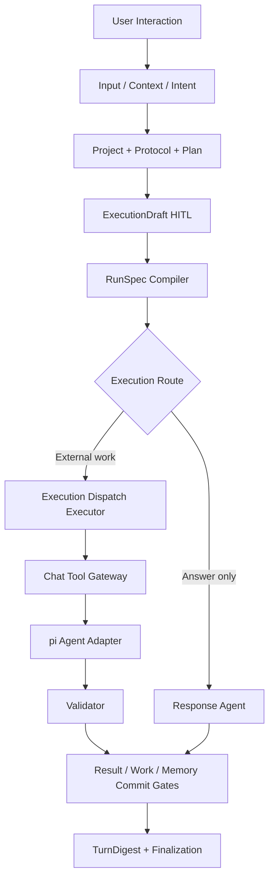

# Chat 开发 Chat：自举能力详细设计与验证计划

> 状态：**D1-D9、SD1/SD2及“Chat自开发可用门v1”已获批并完成；F01字段级设计、SD3-A至E及真实Qwen隔离写入已通过**
>
> 更新日期：2026-07-25
>
> 目标：让 Chat 能把自身作为一个普通但受严格治理的 Project 持续开发，并用可观察、可验证、可恢复的闭环证明“Chat 开发 Chat”，而不是因为能启动一个编码 Agent 就提前宣称完成。

## 1. 结论先行

“Chat 开发 Chat”不需要神秘的自我意识，也不应建立一套只服务于本仓库的特殊系统。它的本质是一个受控反馈回路：

```text
认识目标仓库和当前产品事实
-> 理解用户本轮目标
-> 选择最小充分上下文
-> 形成可编辑ExecutionDraft和不可变RunSpec
-> 在隔离执行工作区调用pi
-> 每个模型和Tool边界受治理
-> 运行确定性验证
-> 形成Artifact、Evidence和Product状态候选
-> 用户接受后提交产品事实或合入代码
-> 下一轮从已提交状态继续
```

本轮设计得出5个核心结论：

1. **Chat本身应是普通Product Project。** 它通过版本化的Repository Resource Binding关联本仓库，不建立`SelfProject`或硬编码`/Users/xulater/Code/Chat`。
2. **主Workflow仍是唯一根Workflow。** pi继续作为Chat注册的真实执行Tool，由主Workflow中的确定性`Execution Dispatch Executor`调用；不让用户再选择第二个根Workflow，也不把pi包装成另一个Product Run。
3. **读和写必须隔离。** 只读理解可以读取绑定仓库；任何代码写入默认发生在绑定精确Git基线的受管Execution Workspace中，不能直接修改承载当前Chat进程的活动工作区。
4. **不能先开放写能力再补治理。** `edit/write/bash`必须等待通用Tool Operation Ledger、结果未知对账和独立Evidence/Artifact完成相应纵向门；当前pi的Tool审批与统计不能冒充完整副作用账本。
5. **“会开发自己”必须以证据判定。** 最低证明是：跨天找回同一个Chat Project/Work，生成正确执行包，在隔离工作区完成真实改动和测试，用户能看到流程、Diff、验证、失败与恢复，且系统没有假成功、重复副作用或无授权合入。

当前12项必要条件中，3项已具备、6项局部具备、3项缺失。现有工程不是从零开始，但还不能称为已经具备完整自举能力。

## 2. 证据等级与研究边界

本文明确区分5类结论：

1. **[当前代码事实]**：由当前Chat源码、测试和项目状态直接证明。
2. **[MAF事实]**：由当前安装版`agent-framework-core==1.11.0`及其安装源码证明。
3. **[参考项目事实]**：由固定提交的pi、nanobot、QwenPaw或LibreChat源码证明。
4. **[本项目推导]**：从Chat产品问题和不变量推导，不冒充框架原生能力。
5. **[已批准决定]**：D1-D9已于2026-07-24获用户批准；其模块字段、事务、迁移和API仍按阶段进入详细设计门。

### 2.1 当前Chat事实

1. [当前代码事实] 主Workflow已经拥有Context、Intent、Project/Work选择、Protocol、Plan、ExecutionDraft、RunSpec、模型调用审批、结果/Work/Memory决定和TurnDigest链路，真实图位于`backend/app/workflows/continuous_chat_factory.py`。
2. [当前代码事实] `ExecutionDraft`和`RunSpec`已经版本化、Hash绑定并接受CAS式编辑；但当前编译器把`runtime`固定为`maf-workflow`、`isolation`固定为`in_process`、`working_directory`设为空、`tools`设为空。
3. [当前代码事实] pi已通过官方JSONL RPC、Chat Provider Gateway和pi Custom Tool Extension接入主Workflow；每次模型调用持久治理，`read/grep/find/ls`由Chat-owned只读Gateway执行，隔离编辑分支额外通过Chat-owned Gateway执行精确`edit`。
4. [当前代码事实] SD2 pi启动参数包含`--no-skills`、`--no-prompt-templates`、`--no-session`、`--no-context-files`和`--no-builtin-tools`；Repository规则来自已批准Context/StepInput，不再沿祖先目录隐式发现。
5. [当前代码事实] Product Harness已有Project、Work、Plan、Action、Note、Memory、ContextPackage、采用记录、Command幂等和Trace；尚无Project到Git仓库的权威资源绑定对象。
6. [当前代码事实] Product Run/Attempt、Runtime Job/Event/Cursor、Worker Lease、主Workflow安全点Checkpoint恢复已经存在；精确`edit`的Operation/Attempt可在启动时按文件Hash对账，但pi进程和pi Session仍不能跨进程续跑。
7. [当前代码事实] Work和Action可以保存内嵌Evidence引用，但尚无独立Evidence、Artifact和Provenance生命周期。

### 2.2 MAF事实

1. [MAF事实] MAF Workflow可以组合Agent Executor、确定性Executor、条件分支、扇出和子Workflow，并用`request_info`表达暂停/恢复。
2. [MAF事实] Function Middleware能在真实Function调用前后看到已验证参数和结果，适合作为Chat Tool Gateway的运行时接合点，但它本身不是产品Ledger。
3. [MAF事实] 原生Agent-as-Executor会直接调用Agent；严格逐次Provider审批仍需Chat的受治理Executor。
4. [MAF事实] 安装版`WorkflowExecutor`支持层级组合，但其Checkpoint恢复代码仍包含子Workflow待处理请求重水化缺口；不能假定“嵌套Workflow”天然得到跨进程安全恢复。
5. [MAF事实] Workflow Checkpoint拥有图签名、消息、状态和Pending Request；它不拥有Product Project、Approval、Tool副作用、Evidence或代码合入。

本地MAF参考源码提交为`9c4cd07899502157284b64a73f9a0adfb4594d96`，其中Python包元数据为1.10.0，与项目安装版1.11.0不是完全相同快照；具体行为以安装版合同测试为准。

### 2.3 pi、nanobot、QwenPaw和LibreChat事实

| 参考源 | 固定版本 | 真正提供的依据 | 没有提供的依据 |
|---|---|---|---|
| pi | 源码研究`2b00dade7cec918aefb025c8b7a4fa304a30acdd`；当前安装/接入版本0.82.0 | Provider抽象、Agent loop、Tool hooks、RPC、Session JSONL、ResourceLoader、工作目录内编码体验 | Product Project/Work、Web审批、Worker Lease、Tool副作用对账、Evidence提交门 |
| nanobot | `2c789767280482f38667044f8a3be5102c71dd26` | 小型Agent loop、文件与Shell工作区约束、读写根分权、Tool结果持久化卫生 | Chat Product Harness、持久HITL、通用副作用恢复 |
| QwenPaw | `2134427584c2657bb717bb083a120f2de011d047` | Web/Channel适配、单Producer多订阅、Tool系统下限与用户规则分层、批准范围 | 跨进程Job接管、通用产品决策、Repository绑定、Evidence |
| LibreChat | `8e5ef1fb31e9d63b735c089b21cbc82c50acce46` | Product资源API与Agent运行API分层、Job/Event恢复、成功Final晚于产品提交、HITL CAS | MAF语义、Chat Harness、Repository绑定、通用Tool exactly-once |

pi的`resource-loader.ts`会从临时Agent目录、当前工作目录及其祖先目录加载`AGENTS.md`或`CLAUDE.md`；`agent-session.ts`把它们加入System Prompt。因此当前Chat在pi工作目录指向本仓库时，pi会自动取得仓库`AGENTS.md`。但这只解决“发现开发规则”的一部分：

1. `AGENTS.md`不是当前Project、Work、Plan和用户本轮决定。
2. 自动发现不证明文件仍有效、采用了哪个版本或用户是否看见。
3. 主Workflow v1.6.0已根据不可变RunSpec选择`pi_readonly`或`answer_only`，并把有来源的最小StepInput交给pi；仍未开放写能力。
4. 当前`--no-session`意味着pi执行转录不会持久恢复。

所以方案不重复复制整份`AGENTS.md`进ExecutionDraft，而是记录Governance Manifest的路径和Hash，并用Provider审批验证**本次真实请求**最终包含了什么。

## 3. 第一性原理：为什么Chat可以开发自己

### 3.1 自举不是“模型知道自己是谁”

软件项目可以被表示为5类可观察对象：

1. 源码、文档、配置样例和测试。
2. Git revision、Diff、分支和工作树状态。
3. 产品目标、当前Work、约束和决策。
4. 可执行命令及其退出码、报告和产物。
5. 用户对目标、风险和结果的接受或拒绝。

编码Agent能读取和修改前2类，Chat Harness维护第3类，Tool/Validator产生第4类，HITL管理第5类。只要这些对象之间有明确版本、权限和提交门，目标仓库恰好是Chat自身并不会改变控制问题的本质。

### 3.2 自举的控制论表达

```text
Current State
  = Product facts + Repository snapshot + accepted decisions

Desired State
  = User goal + scope + done_when + non_goals

Controller
  = Root Workflow + deterministic gates + governed Agents

Actuator
  = pi + registered Tools

Sensor
  = git diff + tests + static checks + runtime/browser checks

Commit
  = human/policy decision + Product transaction + optional code integration
```

如果缺少任何一项，系统只能“生成代码”，不能稳定地“开发自己”：

1. 没有Current State会读错项目或使用陈旧事实。
2. 没有Desired State会把模糊表达直接变成范围漂移。
3. 没有Controller会绕过审批或无边界循环。
4. 没有Actuator只能给建议，不能完成工作。
5. 没有Sensor会把模型自述当成完成。
6. 没有Commit会把候选结果误写为长期事实或直接污染运行环境。

### 3.3 12项必要条件和当前差距

| # | 必要条件 | 当前状态 | 判定 |
|---:|---|---|---|
| C1 | 稳定产品目标与开发规范 | `AGENTS.md`、Context/State/Plan/Lessons存在；Chat显式采用有Hash的治理规则 | 已具备 |
| C2 | 权威Product Project/Work | Harness Schema和服务存在；真实实例由部署数据决定 | 局部具备 |
| C3 | Project到Repository的版本化绑定 | 正式Binding、不可变Snapshot、刷新和失效状态已实现 | 已具备 |
| C4 | 最小充分Context Compiler | 目录/详情两阶段Context已采用Repository Snapshot和治理规则 | 已具备 |
| C5 | 可编辑ExecutionDraft和不可变RunSpec | 已实现并验证 | 已具备 |
| C6 | 运行目标与能力选择 | RunSpec可选择`answer_only`、`pi_readonly`或绑定干净Snapshot的`pi_workspace` | 已具备（精确编辑） |
| C7 | 受治理编码Runtime | pi两道门、只读Tool和首个精确写Tool已实现 | 已具备（窄范围） |
| C8 | 隔离Execution Workspace | 受管detached Git worktree、基线校验、保留和启动对账已实现 | 已具备 |
| C9 | 通用Tool Operation Ledger | 精确`edit`已有Operation/Attempt/Hash对账；外部网络副作用与补偿未实现 | 局部具备 |
| C10 | Validation/Evidence/Artifact完成门 | Validation写在Plan/Draft；独立事实生命周期未实现 | 局部具备 |
| C11 | 运行观察、内容查看和用户纠正 | 根Workflow、三分支路由、Workspace、Operation、Attempt、对账和Diff可见 | 已具备（SD3范围） |
| C12 | 断线、进程、并发和版本恢复 | 主Workflow部分具备；pi与写Tool未具备 | 局部具备 |

### 3.4 “完成”必须满足的最小证明

只有同时满足以下8项，才能对用户说“Chat已经可以开发Chat”：

1. Chat Project与Repository Binding可查询、可失效、可刷新。
2. 第二天或另一个Product Session说“继续开发Chat”，能找回正确Project、Work和版本。
3. 用户能看到并修改采用的上下文、目标、计划、Runtime、能力和验证要求。
4. 主Workflow把受批准RunSpec交给pi，而不是让用户手动切换另一个Workflow。
5. 真实写入只发生在隔离Execution Workspace，并经过Tool Operation Ledger。
6. 至少一次真实代码改动通过确定性测试，产生可查看Diff、Artifact和Evidence。
7. 用户拒绝、崩溃、脏工作树、并发更新和结果未知不会产生假成功或自动重复写入。
8. 工作结果和下一步写回Harness，后续回合不依赖当前聊天历史才能继续。

## 4. 用户场景设计

以下场景先于Schema和代码。每个场景都定义用户目标、系统动作、用户可见结果和禁止行为。

### S01：首次把Chat登记为可开发Project

用户从Project界面选择“关联本地代码仓库”，选择现有Chat Project或新建Project，并选择后端允许根中的Chat仓库。

系统必须：

1. 校验目录存在、属于允许根、是Git仓库且没有符号链接逃逸。
2. 读取Git HEAD、默认分支、工作树摘要和治理文件Manifest。
3. 显示将绑定的Project、仓库、访问模式和发现的规则，不自动执行模型。
4. 以`command_id + project revision`幂等创建Binding和初始Snapshot。
5. 若同一Project已绑定同一仓库，返回现有对象；不重复创建。

禁止：

1. 根据“开发Chat”一句话静默创建Project或绑定路径。
2. 把完整文件正文复制进Product DB冒充仓库事实源。
3. 接受任意前端路径而不检查后端允许根。

### S02：只问“Chat现在开发到哪了”

系统从Product Store查询Project、Work、Plan、最近Evidence和Repository Snapshot。没有语义歧义时走确定性查询；只有需要概括多份资料时才调用模型。

用户看到：

1. 当前目标、阶段、进行中Work、阻塞和下一行动。
2. 信息来源及更新时间。
3. Repository HEAD/脏状态是否与上次Snapshot一致。

不创建Execution Workspace，不启动pi，不修改Work状态。

### S03：为Chat增加一个小功能

用户说：“继续开发Chat，让工作流节点点开后能看到输入、输出和为什么这样走。”

详细链路：

| 步骤 | 系统动作 | 权威输入/输出 | 用户可见 |
|---:|---|---|---|
| 1 | 保存User Message和Interaction | Product Message | 消息已接纳 |
| 2 | 召回Chat Project、活动Work和最近TurnDigest | Product Query | 候选Context及理由 |
| 3 | 刷新Repository Snapshot | Git HEAD、脏状态、Manifest | 代码基线是否变化 |
| 4 | Intent Agent识别为既有软件Project功能开发 | Intent Candidate | 目标、置信度、Project |
| 5 | 用户确认/修正Context与Project | Context Adoption、Decision | 可增删规则、文件、Note |
| 6 | Planner形成步骤和Validation Contract | Plan Candidate | 范围、非目标、完成门 |
| 7 | 编译ExecutionDraft | Draft revision | 可编辑完整执行包 |
| 8 | 用户接受后编译RunSpec | immutable RunSpec | Hash、Runtime、能力 |
| 9 | 创建隔离Execution Workspace | base revision + selected patch set | 工作区来源和脏状态策略 |
| 10 | Execution Dispatch调用pi | StepInputProjection | pi子运行阶段和内容 |
| 11 | 每次Provider/Tool边界治理 | ModelCallDraft/Tool Operation | 实际Payload、Tool参数、风险 |
| 12 | pi形成修改 | Workspace Diff | 文件级Diff，不等于完成 |
| 13 | Validator运行测试 | Evidence Candidate | 命令、退出码、报告 |
| 14 | 失败时在修复预算内重新规划 | new StepInput | 失败原因和剩余预算 |
| 15 | 形成Artifact/Result Patch | Artifact/Evidence candidates | 结果、依据、未解决项 |
| 16 | 用户接受结果 | Decision + Product transaction | Work进度、下一行动 |
| 17 | 单独请求合入 | Integration Operation | apply/commit/push分别决定 |

### S04：用户表达模糊

用户说：“把这里再优化一下。”

系统无法唯一确定“这里”、目标Project或完成标准时：

1. 保存Intent Candidate和Clarification Request。
2. 提供最近活动Project/Work卡片、自由输入和“只讨论、不执行”选项。
3. 用户回答后生成新Intent revision。
4. 澄清前不创建ExecutionDraft或pi执行。

### S05：用户主动指定规则、经验和文件

用户在输入前从Context选择器勾选：

1. `AGENTS.md`中的工程规范。
2. 某个前端交互经验Note。
3. 指定测试文件。
4. 排除一份已过时的草图。

系统记录选择来源、版本、锁定/排除和原因；Context变化使旧Draft与Approval失效。SD2关闭pi对工作目录及祖先
`AGENTS.md`的隐式发现，只把已经进入Context/StepInput、带来源与Hash的规则交给pi；因此用户选择和实际
Provider上下文使用同一份可审计事实。

### S06：只要方案，不允许改代码

用户说：“先设计，不开发。”

RunSpec的Capability Envelope必须是`read-only`，输出合同是设计Artifact候选。即使pi配置页曾启用`edit`，本Run也不得获得写能力。计划通过不代表代码完成。

### S07：用户在Tool审批时修改内容

pi提出：

```text
edit frontend/src/workflow-run-view.tsx
```

用户可以：

1. 修改目标文件或Patch参数，但只能选择当前Execution Workspace中的已注册路径。
2. 收窄操作范围。
3. 拒绝当前Tool并让Workflow回到修订/停止路径。
4. 放弃整个Run。

任何修改生成新Operation fingerprint；旧批准不能执行新内容。

### S08：测试失败后有限修复

测试第一次失败时：

1. Evidence状态是`failed`，Work仍未完成。
2. 确定性路由检查修复预算、范围和失败类型。
3. 新StepInput只包含原约束、相关Diff、失败摘要和必要文件。
4. 需要扩大文件范围、依赖或能力时重新HITL。
5. 预算耗尽后停止并交付失败证据，不循环到成功为止。

### S09：用户拒绝执行后继续修改Prompt

用户拒绝ExecutionDraft或某次ModelCallDraft：

1. 当前版本变为rejected/superseded，不发送Provider请求。
2. 原User Message保留。
3. 用户回到可编辑工作台修改目标、上下文、计划或实际Provider内容。
4. 新revision重新计算Hash并重新审批。
5. 接受后从当前安全点继续同一Product Run；若语义已根本改变则显式Restart为新Run。

### S10：当前Chat代码正在运行，Agent要修改同一仓库

系统不能在承载当前后端/前端进程的工作树直接写入。它必须：

1. 把当前Product Run绑定到Workflow版本、应用版本和Repository Snapshot。
2. 从精确Git基线创建隔离Execution Workspace。
3. 在隔离区修改和验证。
4. 当前运行继续使用启动时加载的代码和图，不被新文件改变。
5. 合入、重新构建和重启分别成为后续显式操作。

### S11：活动工作树已有用户改动

Repository Inspector发现未提交修改时，系统展示路径摘要和3个选项：

1. 以HEAD为基线，不带入未提交改动。
2. 由用户选择要带入的Diff，形成有Hash的Base Patch Artifact，再应用到隔离工作区。
3. 停止本次执行。

系统不得自动stash、reset、覆盖或复制全部脏状态。

### S12：两个Product Session同时开发Chat

Session A修改Workflow视图，Session B修改Harness项目页：

1. 两者可基于同一Repository Snapshot在不同Execution Workspace并行。
2. 各自拥有独立Context、RunSpec、Tool Operation和Artifact。
3. 合入时对目标基线和受影响路径做CAS/冲突检查。
4. 无冲突可分别提出合入；有冲突保留Artifact并要求rebase/用户选择。
5. 不能用Project全局锁阻塞所有工作。

若两者修改同一文件，后完成者不能静默覆盖先合入者。

### S13：进程在写入前或写入后崩溃

1. Tool外发前崩溃：Operation仍为`prepared`，可安全重新领取。
2. 写入已发生且回执未记录：Operation进入`outcome_unknown`，不得自动重做。
3. 对账读取Execution Workspace的前后Hash和目标Patch。
4. 能证明结果时记录Recovered Outcome；不能证明时请求人工处置。
5. Product Run、Work和Artifact都不能提前成功。

### S14：pi进程或Workflow恢复

当前pi使用`--no-session`，所以现状只能记录中断，不能从pi内部状态继续。目标恢复必须区分：

1. 主Workflow Checkpoint恢复。
2. pi Session/Transcript恢复。
3. Tool Operation恢复/对账。
4. Execution Workspace恢复。
5. 浏览器Event Cursor重连。

任何一层缺失都不能笼统显示“可恢复”。初期失败关闭并允许用户Restart；F05完成后才开放声明过的Resume。

### S15：来源更新、删除或权限撤销

绑定仓库被移动、治理文件改变或Source失效时：

1. Binding/Snapshot标为stale/unavailable。
2. 未执行Draft重新编译；旧Approval失效。
3. 已完成Artifact保留历史Provenance，但有效性降级。
4. 用户看到受影响结论和重新验证动作。

### S16：越界路径和秘密文件

以下请求必须失败关闭：

1. Repository Binding逃逸后端允许根。
2. Execution Workspace中的相对路径经符号链接逃逸。
3. 读取`backend/config.json`、`.env`、SSH密钥等受保护资源。
4. Shell通过`cwd`、重定向、子命令或绝对路径绕过工作区。
5. 日志、Trace、Provider审批或Evidence包含密钥正文。

### S17：commit、push、部署和重启

代码测试通过不自动获得以下授权：

1. 合入用户活动工作树。
2. 创建Git commit。
3. 推送远端。
4. 部署或重启Chat。

它们是4个不同后果的Operation，可以在策略允许下合并展示，但授权范围和结果必须分别记录。

### S18：从Chat切换到另一个Project

用户下一轮说“回到AuditTraceAI”。主Workflow选择新Project和Repository Binding；Chat仓库的规则、Diff、Execution Workspace和Work不能进入新Context。公共用户习惯可以复用，但Project事实必须隔离。

### S19：跨天自举长场景

| 日期 | 用户动作 | 系统应持续维护 |
|---|---|---|
| Day 1 | 设计Workflow节点内容查看 | Chat Project、Work、Plan、Context、设计Artifact |
| Day 2 | 继续开发并让pi实现 | 同一Work revision、Repository基线、Execution Workspace、Tool Operations |
| Day 2晚 | 测试失败，用户停止 | 失败Evidence、未完成Work、可恢复/不可恢复说明 |
| Day 3 | 新Session说“继续昨天Chat前端” | 正确召回失败点和最新仓库状态，不拼全历史 |
| Day 3晚 | 修复通过，用户暂不合入 | Artifact保持候选，Work显示等待用户 |
| Day 4 | 用户批准合入但不push | Integration Operation成功、Work进度更新、push仍待决定 |
| Day 7 | 用户问“本周Chat做了什么” | 从已提交事实和Evidence汇总，不让模型猜 |

## 5. 从场景反推的目标架构

### 5.1 一条根Workflow，而不是多个隐式叠加Workflow



[已实施决定] 现有主Workflow已经增加真实的Execution Route、Dispatch和Result Assembly节点；用户始终只
使用主Workflow，是否调用pi由已接受的Protocol、Plan和RunSpec决定。确定性Validation仍按能力分阶段补齐，
不能用pi文本自述替代Evidence或Work完成门。

### 5.2 为什么pi是受治理Tool，而不是第二个Product Run

1. Product Run表达用户看到的一次根执行；本轮Intent、Plan、pi执行、验证和结果提交属于同一Run。
2. pi本身是另一个Agent loop，但在Chat边界上表现为一个有输入、能力、事件和结果的外部执行能力。
3. 当前产品已经把pi注册为`FunctionTool`并保存`ToolExecutionRecord`，沿用该语义改造成本更低。
4. 如果为pi再创建Product Run，会与当前每个Product Session只有一个active Run的合同冲突，也会让一次用户动作出现两个并列根Run。
5. MAF原生AgentExecutor会绕过现有逐次Provider治理；原生WorkflowExecutor又不能为安装版子图跨进程恢复背书。

因此推荐：

```text
Root Product Run
└── Run Attempt / Runtime Job
    ├── MAF Workflow nodes
    ├── Model Call Attempts
    ├── pi Tool Execution
    │   ├── pi model calls
    │   └── internal Tool Operations
    ├── Validation Evidence
    └── Artifact / Product Patch candidates
```

pi的内部Agent身份、Session和事件仍保留独立映射，但不升级成第二个用户根Run。

### 5.3 Repository Resource与Execution Workspace

[待审核概念] **Repository Resource Binding**表示Product Project引用哪个代码仓库、按什么权限和版本读取。它不拥有源码正文。

[待审核概念] **Execution Workspace**表示某次Run Attempt为执行创建的隔离工作目录。推荐使用受管Git worktree或等价隔离检出：

```text
Canonical Repository (read / source of truth)
  └── Repository Snapshot (HEAD + dirty fingerprint + governance manifest)
       └── Managed Execution Workspace (exact base revision)
            ├── Tool Operations
            ├── Diff / generated files
            ├── Validation Evidence
            └── Artifact Candidate
```

不采用“直接让pi写当前Chat目录”，原因是：

1. 当前进程可能热重载或重启。
2. 用户未提交改动会被覆盖或混入结果。
3. 当前Run采用的Workflow代码可能在执行中改变。
4. 失败后无法区分原状态、用户改动和Agent改动。
5. 多Session无法进行可靠的基线冲突判断。

### 5.4 Context和执行包

发给pi的StepInput不是“User Prompt + 整段历史”，而是以下有来源的块：

| 块 | 为什么需要 | 默认装载方式 |
|---|---|---|
| User Request | 保留用户当前表达 | 原文 |
| Intent/Goal | 消除自然语言歧义 | 已接受revision |
| Project/Work | 告知当前事项和进度 | Product引用+摘要 |
| Repository Snapshot | 固定代码基线 | HEAD、dirty policy、Manifest |
| Accepted Context | 背景、决定、经验、指定文件 | 有界内容+来源 |
| Plan/Step | 让pi只完成当前步骤 | StepInputProjection |
| Scope/Non-goals | 防止范围漂移 | RunSpec不可变字段 |
| Capability Envelope | 限制Tool、路径、网络和预算 | 服务端Grant |
| Validation Contract | 定义“怎样证明完成” | 确定性检查优先 |
| Stop/Escalation | 何时停下问用户 | RunSpec规则 |

`AGENTS.md`由pi ResourceLoader自动发现；Chat同时记录其路径和Hash，并在真实ModelCallDraft中展示最终Provider Payload。当前Project/Work、用户决定和Validation Contract仍由Chat显式提供，不能只靠AGENTS间接要求pi自行寻找。

### 5.5 状态所有权

| 状态 | 唯一所有者 | 前端/运行时角色 |
|---|---|---|
| Project、Work、Plan、Note、Memory | Product Harness | 查询和提交候选 |
| Repository Binding/Snapshot | Product Harness资源模块 | UI投影；Git Adapter采集 |
| ContextPackage/Adoption | Context/Harness | 用户编辑投影 |
| ExecutionDraft/RunSpec/Decision | Governance | 工作台编辑与审批 |
| Product Run/Attempt/Runtime Event | Run管理 | AG-UI实时投影 |
| pi Session/进程 | pi Runtime Adapter | 只作为执行机制 |
| Tool Operation/Outcome | Tool执行模块 | MAF Middleware/Adapter调用 |
| Execution Workspace | Workspace Adapter | Tool只在授予范围操作 |
| Evidence/Artifact/Provenance | Evidence模块 | Workflow提出、Validator写入 |
| Git仓库文件 | Git/文件系统 | Product DB只存引用、Hash和状态 |

## 6. 模块设计

本设计不把功能继续堆入已经超过审查线的`harness/service.py`或`continuous_chat.py`。模块按状态所有权和变化原因拆分。

| 模块 | 用户价值 | 负责 | 不负责 | 关键端口 |
|---|---|---|---|---|
| Project Resource Application | Project能稳定关联仓库 | Binding命令、版本、失效、Snapshot引用 | 读取全部源码、执行Git写入 | `BindResource`、`RefreshResource` |
| Repository Inspector Adapter | 系统知道真实Git状态 | 路径校验、HEAD、dirty摘要、Manifest、文件元数据 | Product事务、用户批准 | `inspect(binding)` |
| Execution Workspace Application | Agent不会污染活动目录 | 创建/恢复/销毁隔离worktree，绑定基线和Run | 决定目标、自动合入 | `prepare(spec)`、`snapshot()` |
| Context Compiler | 生成最小充分Context | Repository/Harness/用户选择的采用、裁剪、Hash | Tool授权、Git写入 | `compile_directory`、`compile_detail`、`materialize_step` |
| Execution Dispatch Application | 把RunSpec交给正确Runtime | Runtime选择、StepInput、调用Tool Gateway、结果映射 | 直接执行文件副作用 | `dispatch(step)` |
| pi Runtime Adapter | 运行pi官方RPC | 进程、Session映射、事件、Provider网关 | Product决定、Tool副作用事实 | `start/resume/stop` |
| Tool Execution | 安全执行能力 | Catalog、Policy、Operation Ledger、幂等、对账 | Product Run终态、Evidence有效性 | `prepare/authorize/dispatch/reconcile` |
| Validation Application | 用可重复方法检查结果 | Validation Contract、Runner选择、报告规范化 | 把失败改成成功 | `validate(artifact, contract)` |
| Evidence/Artifact | 保存结果及证明 | Artifact Revision、Evidence Check、Provenance、Validity | 自行完成Work | `record_candidate/accept/invalidate` |
| Workflow Execution Slice | 真实控制流 | execution route/dispatch/validation/result节点 | 产品资源CRUD | MAF Executors |
| Collaboration Workbench | 用户观察和控制 | Project资源、Context、Draft、运行、Diff、Evidence渐进展示 | 保存权威事实 | Product REST + AG-UI |

### 6.1 推荐代码落点

以下只是模块候选，不在审核前创建目录：

```text
backend/app/
  project_resources/        # Binding、Snapshot、命令/查询、Git只读Adapter
  execution_workspaces/     # 受管worktree生命周期
  execution_dispatch/       # RunSpec到Runtime/Tool的应用协调
  tool_execution/           # F01
  evidence/                 # F02
  workflows/
    continuous_chat_execution.py

frontend/src/features/
  projects/                 # Project资源和Repository状态
  execution/                # Workspace、Diff、Validation和Evidence
  workflow/                 # 继续拥有真实图和节点内容
  harness/                  # 继续拥有Context/Work/Memory投影
```

约束：

1. Router只解析DTO、调用Application Coordinator和映射Problem Detail。
2. Repository Inspector和Workspace Adapter不自行提交Product事务。
3. Workflow Executor不直接写Project/Work表，通过命令端口提交。
4. Tool Adapter不能绕过Tool Execution模块。
5. 前端Zustand只保存布局、展开和草稿状态，服务端资源使用查询缓存。

## 7. 接口设计

### 7.1 Product REST候选

#### 创建Repository Binding

```http
POST /api/harness/projects/{project_id}/resource-bindings
```

```json
{
  "command_id": "client-generated-idempotency-key",
  "expected_project_row_version": 3,
  "kind": "git_repository",
  "locator": {
    "type": "local_path",
    "value": "/allowed/path/Chat"
  },
  "access_mode": "read_only",
  "display_name": "Chat"
}
```

服务端响应只返回经过授权的公开视图、Binding revision、状态和最新Snapshot摘要；密钥、受保护文件内容和内部凭据不返回。

#### 查询与刷新

```text
GET  /api/harness/projects/{project_id}/resource-bindings
GET  /api/harness/resource-bindings/{binding_id}
POST /api/harness/resource-bindings/{binding_id}/refresh
POST /api/harness/resource-bindings/{binding_id}/transition
```

刷新命令携带`command_id + expected_row_version`。资源不存在返回404，版本冲突返回409，路径/策略错误返回422。

### 7.2 活动运行接口

1. AG-UI继续负责启动根Run、实时事件、HITL和恢复。
2. REST继续负责查询Product Run、Tool Operation、Artifact和Evidence。
3. 不新增第二套“pi流式协议”给浏览器；pi事件转换成根Run的规范Runtime Event。
4. 工作流节点内容通过已有Run/Trace查询扩展，不让浏览器读取pi私有Session文件。

### 7.3 内部命令和端口候选

```python
class RepositoryInspector(Protocol):
    async def inspect(self, binding: RepositoryBindingRef) -> RepositorySnapshot: ...

class ExecutionWorkspacePort(Protocol):
    async def prepare(self, request: WorkspaceRequest) -> PreparedWorkspace: ...
    async def inspect(self, workspace_id: str) -> WorkspaceSnapshot: ...

class ExecutionRuntimePort(Protocol):
    async def start(self, step: ExecutionStepInput) -> RuntimeHandle: ...
    async def resume(self, handle: RuntimeHandle, decision: RuntimeDecision) -> None: ...
    async def stop(self, handle: RuntimeHandle) -> None: ...

class ToolGateway(Protocol):
    async def execute(self, command: ToolOperationCommand) -> ToolOperationResult: ...

class ValidationRunner(Protocol):
    async def run(self, contract: ValidationContract, workspace: WorkspaceRef) -> ValidationReport: ...
```

这些端口使用显式DTO，不把未约束`dict[str, Any]`作为长期公开合同。

### 7.4 ExecutionDraft/RunSpec扩展

现有17部分保留，增加或具体化：

1. `project_work_binding.resource_binding_id`
2. `resource_manifest.repository_snapshot_id`
3. `runtime_target.runtime = pi_agent`
4. `runtime_target.execution_workspace_policy`
5. `capability_grant.tool_capabilities`
6. `capability_grant.path_scope`
7. `validation_plan.contract_id/revision`
8. `output_commit_contract.artifact_policy`
9. `stop_escalation.dirty_tree/conflict/outcome_unknown`

用户不能直接填写任意工作目录或Tool名称，只能从已注册Binding、Workspace Policy和Tool Catalog中选择。可读视图显示名称、用途和后果；高级视图显示一致的结构化请求。

### 7.5 稳定错误码候选

| 错误码 | 含义 | 是否可重试 |
|---|---|---|
| `PROJECT_RESOURCE_NOT_FOUND` | Binding不存在 | 否，先刷新 |
| `PROJECT_RESOURCE_CONFLICT` | revision或基线变化 | 否，先重新审查 |
| `REPOSITORY_ROOT_DENIED` | 路径不在允许根 | 否 |
| `REPOSITORY_SYMLINK_ESCAPE` | 解析后逃逸根目录 | 否 |
| `REPOSITORY_STATE_STALE` | HEAD/dirty fingerprint变化 | 重新编译后可 |
| `EXECUTION_WORKSPACE_CONFLICT` | Workspace基线或Patch冲突 | 人工处理 |
| `CAPABILITY_NOT_GRANTED` | RunSpec未授予Tool/路径 | 新授权后可 |
| `TOOL_OUTCOME_UNKNOWN` | 副作用结果无法确认 | 先对账 |
| `VALIDATION_FAILED` | 完成门未通过 | 在预算内修复 |
| `ARTIFACT_SOURCE_STALE` | Artifact来源已变化 | 重新验证 |
| `RUNTIME_RESUME_UNSUPPORTED` | 当前pi/图不能安全Resume | Restart |

### 7.6 公开事件候选

```text
project_resource.bound
project_resource.refreshed
repository_snapshot.created
execution_workspace.prepared
execution_step.dispatched
tool_operation.prepared
tool_operation.waiting_approval
tool_operation.dispatched
tool_operation.outcome_unknown
validation.started
validation.completed
artifact.candidate_created
product_patch.proposed
product_patch.committed
```

事件只含公开摘要、ID、状态和Hash，不含密钥、完整Provider Payload、隐藏推理或不必要文件正文。完整可编辑ModelCallDraft仍通过专用审批查询取得。

## 8. 状态与失败语义

### 8.1 Repository Binding

```text
active -> stale -> active
active -> unavailable -> active
active -> revoked
stale/unavailable -> revoked
```

`stale`表示可定位但版本变化；`unavailable`表示当前无法读取；`revoked`表示用户或策略停止采用。删除Binding不删除历史Snapshot、Run和Artifact引用。

### 8.2 Execution Workspace

```text
preparing -> ready -> running -> validating -> retained
     |          |        |            |
     +--------> failed <-+------------+

retained -> integrated
retained -> discarded
```

`retained`表示执行产物仍可检查，不等于已合入。清理只能在Artifact和Evidence已保存、保留策略满足后执行。

### 8.3 Tool Operation

F01详细设计必须至少区分：

```text
proposed -> prepared -> authorized -> dispatching
                                   -> succeeded
                                   -> failed
                                   -> outcome_unknown -> reconciling
                                                      -> succeeded/failed/manual
```

审批只绑定Operation版本与fingerprint；Worker Lease、Tool进程状态或模型Tool Call文本都不能替代Operation事实。

### 8.4 自修改版本Fence

1. Product Run绑定启动时Workflow definition/version。
2. Repository Snapshot绑定源代码基线。
3. Execution Workspace绑定base revision和可选Base Patch hash。
4. Integration Operation绑定目标仓库当前revision和目标路径preimage。
5. 已运行中的Workflow不切换到新代码。
6. 重启后只对新Run启用新版本；旧Checkpoint兼容性必须显式判断。

## 9. 测试方案

### 9.1 测试分层

| 层 | 重点 | 禁止替代 |
|---|---|---|
| T1 纯领域/合同 | 状态机、Hash、CAS、Context预算、RunSpec、错误码 | 不用浏览器测试替代 |
| T2 应用集成 | SQLite事务、命令幂等、Outbox、Repository Binding | 不用全Mock Repository |
| T3 Adapter | Git/worktree、路径、symlink、pi RPC、MAF/AG-UI | 不靠文档猜行为 |
| T4 Workflow | 真实图、分支、HITL、Checkpoint、节点内容 | 不只测投影函数 |
| T5 Browser E2E | 用户选择、审批、Diff、移动端、重连 | 不用API测试替代 |
| T6 真实模型/Agent | Intent、Plan、pi read/edit/test | 不把Fake Provider当真实验证 |
| T7 故障实验 | SIGKILL、断线、Lease、outcome unknown、冲突 | 不用普通异常替代进程故障 |
| T8 长周期 | 跨天、跨Session、多Project和状态维护 | 不用单轮问答替代 |

### 9.2 领域与应用测试

至少覆盖：

1. 同一`command_id`同内容返回同结果，不同内容冲突。
2. Repository Binding路径允许根、父路径、符号链接和不存在路径。
3. Snapshot的HEAD、dirty paths、Manifest和Hash稳定。
4. Project revision变化时旧Binding命令失败。
5. Context只采用已允许Source，用户排除项不回流。
6. Repository Snapshot变化使旧Draft/Approval失效。
7. RunSpec只能从已接受Draft编译。
8. `runtime_target=pi_agent`只能引用启用的真实Tool配置。
9. Workspace从精确base revision创建；脏状态不被静默带入。
10. Integration Operation校验目标preimage和基线。
11. Validation失败不能提交Work完成。
12. Artifact/Evidence重复回调幂等。
13. 两Session不同路径并行、同路径冲突。
14. 受保护文件正文不进入日志、Trace和API。

### 9.3 MAF与pi合同测试

1. 固定安装版MAF能构建新增节点和条件分支。
2. 每个新增Executor ID、边和Workflow graph signature稳定。
3. 原生AgentExecutor未被用于绕过Provider Gate。
4. SD2 pi命令行必须包含`--no-context-files`和`--no-builtin-tools`；祖先目录唯一Marker不得进入Provider Draft，采用的治理规则只能经版本化Context/StepInput进入。
5. `--no-session`现状有测试；启用持久pi Session前必须先验证`--session-dir/--session-id`的创建、重开、分支和损坏行为。
6. pi Tool名称必须来自Catalog，参数修改后重新验证路径与fingerprint。
7. Provider Gateway转发的字节与批准revision完全一致。
8. MAF主Checkpoint、pi Session和Tool Operation分别损坏时返回不同错误。

### 9.4 浏览器端到端场景

#### E2E-01：只读认识自己

1. 新建测试Project并绑定临时Git仓库。
2. UI显示HEAD、分支、治理文件和只读状态。
3. 用户说“这个项目现在做到哪了”。
4. Workflow采用正确Project，不创建Execution Workspace。
5. 刷新后Project、Context和Run Trace仍可读。

#### E2E-02：完整设计但不执行

1. 用户说“先设计一个功能，不改代码”。
2. Intent、Plan、Draft和RunSpec全部可见。
3. Runtime/Tool显示只读。
4. 即使后台Tool配置允许edit，Provider请求也不能拿到写能力。
5. 结果只作为设计Artifact候选。

#### E2E-03：真实pi读取

1. 使用临时Git仓库和真实Provider。
2. pi读取README和测试入口。
3. 每次ModelCallDraft由用户确认。
4. Tool卡片只允许真实`read/grep/find/ls`。
5. 最终回答引用实际文件，不产生Diff。

#### E2E-04：真实pi写入一次性仓库

1. 从fixture仓库创建受管worktree。
2. 用户批准一个精确edit。
3. pi修改1个文件并运行1条批准测试。
4. 浏览器显示Diff、命令、退出码、Evidence和Artifact。
5. 拒绝Result Commit时Work保持未完成，文件仍只在隔离区。

#### E2E-05：修改Tool参数后继续

1. pi提出修改A文件。
2. 用户改为B文件或收窄Patch。
3. 新Operation hash生成，旧授权失效。
4. 用户重新批准后只修改B。
5. 后续Provider调用仍再次审批并看到真实Tool Result。

#### E2E-06：崩溃与对账

1. Tool dispatch前终止Worker，确认新Worker安全领取且只执行一次。
2. 文件写入后、结果提交前SIGKILL。
3. Run显示`outcome_unknown`，不自动edit第二次。
4. 对账通过文件Hash确认结果或请求用户决定。
5. 旧epoch不能写成功终态。

#### E2E-07：两个Session并发

1. 桌面Session A和手机Session B打开同一Chat Project。
2. A、B在不同worktree修改不同文件，均可验证。
3. A先合入；B提交前刷新目标基线。
4. 无冲突重放或重新验证；同文件冲突显示Diff。
5. 两个Session的Context、Run和事件不串线。

#### E2E-08：受保护路径与移动端

1. 390px视口完成Project选择、Draft审批、Tool拒绝和Evidence查看。
2. 尝试选择`backend/config.json`或路径逃逸。
3. 后端拒绝且页面解释原因。
4. 日志、Trace、截图和错误响应不含文件正文或密钥。

### 9.5 真实Chat仓库Dogfood验收

真实仓库测试只能在前述一次性仓库全部通过后进行：

1. 用户明确选择Chat Project和一个小而可逆的Work。
2. 系统从当前认可的Git revision创建隔离worktree。
3. 不读取`backend/config.json`，Provider密钥只由现有服务端配置使用。
4. pi完成真实改动；运行项目`.venv`、前端Node和现有验证脚本。
5. 至少通过相关单元/集成测试、前端类型检查/构建和一条浏览器E2E。
6. 用户在UI审查Diff、Evidence、范围偏差和日志。
7. 第一轮Dogfood只形成可应用Patch，不自动commit或push。
8. 用户批准Integration Operation后才合入；若目标工作树已变化则停止。

### 9.6 长周期测试

建立一个不少于4天、3个Product Session、2个Project和至少20轮Interaction的fixture：

1. Chat Project连续经历设计、开发、失败、暂停、恢复、验证和合入。
2. 中途切换学习事项，再回到Chat开发。
3. 另一个Project并行开发，验证Context不污染。
4. 第三天更新AGENTS规则，使旧Draft失效。
5. 第四天从手机继续，验证Event Cursor和Product事实恢复。
6. 最终查询一周进展，结果必须完全来自已提交事实和Evidence。

自动断言：

1. 没有把完整历史无界放入Context。
2. 没有未批准Tool Operation。
3. 没有失败Evidence对应的completed Work。
4. 没有跨Project Source泄漏。
5. 每个代码Artifact都有Repository Snapshot和Validation Provenance。
6. 每个合入都有独立Decision和目标revision。

## 10. 分阶段交付

### SD0：详细设计与合同冻结（已完成）

交付：

1. 本文的场景、架构、模块、接口、状态和测试矩阵。
2. 源码/参考证据和采用/拒绝理由。
3. 反证审查和待审核决定。

不交付：Schema、迁移、正式API或功能代码。

### SD1：Chat认识自己（只读）

1. [Repository Binding/Snapshot模块详细设计](./repository-resource-detailed-design.md)审核。
2. 通用Project Resource模块、迁移、REST和项目资源UI。
3. 主Context Compiler采用Repository Snapshot与Governance Manifest。
4. Project状态、仓库状态和规则可见。
5. 真实模型只读问答和跨Session找回。

完成门：能可靠回答“当前Chat项目是什么、做到哪、代码基线和规则是什么”，不启动写Tool。

### SD2：Chat会准备开发工作

详细Schema、状态机、两层运行视图、失败恢复和测试门见
[SD2受治理pi只读执行详细设计](./pi-readonly-execution-detailed-design.md)。

1. 扩展ExecutionDraft/RunSpec的Runtime、Repository、Capability和Validation字段。
2. 主Workflow增加Execution Route和只读Execution Dispatch。
3. pi读取受批准StepInput并提出代码方案或Patch计划。
4. Workflow节点内容、路由原因和pi子阶段在工作台可见。

完成门：用户不切Workflow即可从自然语言走到真实pi只读执行；仍不修改文件。

状态：**已完成**。真实Chat仓库Dogfood完成2次模型审批、2次Chat-owned `read`和确定性结果组装；
运行前后Repository无写入、无Shell、无Git操作。实现证据与未兑现保证见
[SD2详细设计第24节](./pi-readonly-execution-detailed-design.md#24-实施与验证结果)。

### SD3：Chat能在隔离区安全修改

前置依赖：F01 Tool Operation Ledger详细设计和纵向门审核通过（已满足）。

1. Execution Workspace受管worktree。
2. Tool Gateway覆盖pi内部`read/grep/find/ls/edit`。
3. 只开放单文件精确`edit`；`write`和受限`bash`仍需后续单独开放。
4. 结果未知、对账、路径策略和SIGKILL故障测试。

完成门：一次性仓库真实修改不重复、不越界、不污染活动目录。

状态：**工程纵向切片、确定性故障矩阵和真实Qwen隔离写入已完成**。第19次迁移、受管worktree、逐Operation/Attempt/
Reconciliation、一次性授权消费、Run取消收敛、37节点主Workflow和桌面/手机设计者投影已通过。
真实模型Dogfood已证明从用户输入正确路由到`pi_workspace`并完成精确`edit`。首次HTTP 401已定位为
Chat本机Gateway凭据与SDK `Authorization`冲突，并通过独立`X-Chat-Pi-Token`及回归测试修复；
早期Ark与DashScope流超时继续作为安全失败证据。网络恢复后，Qwen在干净Fixture完成完整Product
Run，唯一获批Operation、文件前后Hash、Workspace Diff与实际结果一致，源仓库保持干净。完整证据见
[F01/SD3详细设计第11节](./tool-operation-workspace-detailed-design.md#11-实施与验证结果)。

### SD4：Chat能证明改动有效

前置依赖：F02 Evidence/Artifact/Provenance详细设计审核通过。

1. Validation Runner与Contract。
2. Diff/Artifact Revision、Evidence Check和Provenance。
3. 失败修复预算与Result Commit Gate。
4. Work状态只从已接受Evidence更新。

完成门：代码生成、测试通过、用户接受和Work完成之间有可审计链。

### SD5：Chat能持续开发自己

1. pi持久Session与任意Workflow恢复详细设计（F05）。
2. 多Product Session并发、stale base、rebase和冲突UI。
3. Integration Operation与当前工作树CAS。
4. 真实Chat仓库Dogfood、小步合入和跨天恢复。

完成门：满足第3.4节8项最低证明。

### SD6：部署与长期运营

1. commit、push、build、deploy、restart各自策略和Operation。
2. 版本兼容、回滚、备份、SLO和容量验证。
3. 运营面板观察自举Run、失败、成本和Artifact。

该阶段不属于第一轮“Chat开发Chat”最低闭环。

### 10.1 每个阶段固定节奏

```text
开发
-> 单元/合同测试
-> 集成和故障测试
-> 真实模型/Agent或浏览器E2E
-> 架构与代码检视
-> 性能/可读性/交互优化
-> 目标偏航审计
-> 用户体验审核
```

每阶段必须回答6个问题：

1. 本阶段新增了哪一段可证明的自举闭环？
2. Product Store是否仍是唯一产品事实源？
3. 失败/重启是否会假成功或重复副作用？
4. 用户能否看懂“为何这样走、用了什么、下一步是什么”？
5. 实现是否沿用项目模块/接口/日志/注释/测试规范？
6. 参考项目是否真正覆盖该结论，未覆盖处是否标为本项目推导？

任一答案不明确，不进入下一阶段。

### 10.2 已批准的“Chat自开发可用门 v1”交付节奏

2026-07-25用户批准以下8个阶段，目标是下次接手时能在电脑Web端或手机Web端直接让Chat继续开发
Chat，并能观察、审批、验证和安全恢复。该批准只授权已经完成详细设计的阶段直接实施；F01、F02和
F05仍须先完成各自字段级详细设计审核，不能用总计划批准替代核心状态机审核。

| 阶段 | 交付 | 验收重点 |
|---:|---|---|
| 0 | 收口SD1、手机HTTP链路和当前工程基线 | 私密配置/运行产物不入Git；完整质量门通过；提交并推送 |
| 1 | SD2受治理pi只读执行 | 根Workflow真实派发pi；两层运行视图；桌面/手机可观察；仓库指纹不变 |
| 2 | F01 Tool Operation Ledger与SD3隔离写入 | 写操作可授权、幂等、对账；只写受管worktree；结果未知不重放 |
| 3 | F02 Evidence/Artifact/Provenance与SD4验证门 | Diff、验证、Evidence和Work提交有可审计血缘；失败不假完成 |
| 4 | F05所需持久运行、多Product Session和Integration Operation | 跨天/断线继续；同一Harness并发有revision/CAS；合入冲突可见 |
| 5 | 窄范围受控自更新 | commit、build、restart、rollback分别建模；push单独授权；不得用当前进程直接自毁 |
| 6 | 电脑/手机一致体验与安全Markdown | 助手CommonMark/GFM安全渲染；用户原文保持纯文本；代码/表格窄屏可滚动 |
| 7 | 真实Dogfood与交接 | Chat以自身Project完成可逆功能，跨Session恢复，下一次不依赖旧聊天历史继续 |

阶段5新增了“无需终端也能完成受控交接”的必要产品保证，因此纳入v1；它不改变D8“commit、push、
build、deploy和restart是不同Operation、不同授权”的决定。当前公网入口仍是响应式HTTP Web验证
链路，不冒充标准PWA、TLS或正式身份系统。

阶段6只交付安全Markdown渲染边界：禁用原始HTML，过滤危险URL，外部图片不自动加载，移动端代码块
和表格横向滚动；未来“帖子/朋友圈式图文回复、网页组件和可交互协议”只保留渲染器扩展缝，不在本轮
创建Rich Response Schema。

## 11. 已批准决策卡

2026-07-24用户批准D1-D9。批准范围是对象边界、运行关系、隔离原则、能力开放顺序、验证原则和恢复路线；
不把候选REST示例直接冻结为字段级Schema，也不越过SD1 Repository Binding/Snapshot模块详细设计门。

### D1：Chat自身如何建模

| 选项 | 优点 | 缺点 |
|---|---|---|
| 特殊`SelfProject` | 看似直接 | 硬编码、无法复用、破坏Harness统一性 |
| 普通Project + Repository Binding | 可复用到全部软件项目，边界一致 | 需要新增资源绑定 |

**建议**：普通Project + Repository Binding。信心：高。

### D2：仓库内容放哪里

| 选项 | 优点 | 缺点 |
|---|---|---|
| 全量复制到Product DB | 查询简单 | 双重事实源、体积和失效困难 |
| 文件系统/Git权威，DB保存Binding/Snapshot/Hash | 来源清晰、可失效 | 读取时需Adapter |

**建议**：第二种。信心：高。

### D3：主Workflow如何调用pi

| 选项 | 优点 | 缺点 |
|---|---|---|
| MAF原生AgentExecutor | 图简单 | pi不是MAF Agent，且会绕过Chat Provider Gate |
| 嵌套`WorkflowExecutor` | 层级直观 | 安装版子Workflow Checkpoint恢复存在缺口 |
| 确定性Dispatch Executor -> Tool Gateway -> pi Adapter | 延续现有pi Tool、同一Product Run、治理清楚 | 需要F01/F05接合 |

**建议**：第三种。信心：高。

### D4：在哪里改代码

| 选项 | 优点 | 缺点 |
|---|---|---|
| 直接改当前工作树 | 快 | 可能自毁、覆盖用户修改、难恢复 |
| 默认受管worktree，显式合入 | 隔离、可验证、可并发 | 增加Workspace生命周期 |

**建议**：受管worktree。信心：高。

### D5：何时开放写Tool

| 选项 | 优点 | 缺点 |
|---|---|---|
| 先用现有pi审批开放 | 快速看到效果 | 崩溃后不能对账，可能重复副作用 |
| 只读先行，F01后逐项开放 | 风险可控 | 写能力交付稍晚 |

**建议**：只读先行。信心：高。

### D6：如何使用AGENTS和当前Project Context

| 选项 | 优点 | 缺点 |
|---|---|---|
| 每轮复制所有治理文档 | 看似完整 | Token膨胀、版本重复 |
| 关闭pi隐式发现；Chat渐进式编译已采用规则、当前事实和Manifest | Repository边界、版本与最终Payload均可审查 | Chat必须维护来源、Hash和预算合同 |

**已实施决定**：第二种。信心：高；已完成安装版、合同和真实运行验证。

SD2源码核对发现pi会从`cwd`继续向祖先目录发现规则，可能越过Repository Binding。SD2 R5因此
修正**实现方式**为：关闭环境自动发现，由Chat把已Hash绑定的AGENTS/治理规则显式装入
StepInput。该安全修正已于2026-07-25获用户批准。

### D7：如何判定完成

| 选项 | 优点 | 缺点 |
|---|---|---|
| 由Reviewer Agent判断 | 能处理语义 | 不能替代退出码和事实 |
| 确定性Validator优先，Reviewer只补语义 | 可重复且保留灵活性 | 需要Validation Contract |

**建议**：第二种。信心：高。

### D8：commit/push/deploy是否随代码成功自动执行

| 选项 | 优点 | 缺点 |
|---|---|---|
| 自动执行 | 流程短 | 后果不同、难撤销、权限过宽 |
| 分开Operation和授权 | 可控、可审计 | 多一个交互步骤 |

**建议**：分开。信心：高。

### D9：pi恢复策略

| 选项 | 优点 | 缺点 |
|---|---|---|
| 一直`--no-session`，失败只Restart | 简单 | 长任务体验差 |
| 立即开启pi Session | 可恢复转录 | 尚未验证与Product Checkpoint/Tool Ledger一致性 |
| SD1-SD4保持现状，F05完成Session映射后启用 | 不过度承诺 | 完整恢复较晚 |

**建议**：第三种。信心：中；需要专门运行Spike。

## 12. 自我检视与方案修正

本轮不是只写完方案后勾选“通过”，而是对最危险假设做了反证。共发现并修正6处：

1. **原假设：pi不知道仓库规范。** 源码核对后修正为：pi默认加载工作目录及祖先的AGENTS/CLAUDE；真正缺的是Product事实、版本采用和主Workflow派发。
2. **原候选：把pi做成子Product Run。** 对照当前`active_run_id`和Product Run语义后否决；pi应是同一根Run下的Tool Execution。
3. **原候选：直接让pi修改Chat仓库。** 对照自修改、热重载和脏工作树风险后否决；增加Execution Workspace和单独Integration Gate。
4. **原候选：复用现有ToolExecutionRecord即可。** 对照F01失败矩阵后否决；统计记录不包含Operation Attempt、外发边界、幂等和对账。
5. **原候选：用MAF嵌套Workflow自然恢复pi。** 对照安装版子Workflow重水化缺口后否决；采用显式Adapter和分层恢复。
6. **原候选：测试通过即可完成Work。** 对照Evidence产品边界后修正为：测试只是Evidence Candidate，仍需结果提交门和Work CAS。

### 12.1 架构规范检查

| 检查 | 结果 |
|---|---|
| 是否引入第二产品事实源 | 否；Git拥有文件，Product DB拥有Binding和状态 |
| 是否把MAF Session当Product Session | 否 |
| 是否让Router/React页面拥有事务 | 否 |
| 是否继续堆大Service | 否；明确新能力模块 |
| 是否让Tool绕过治理 | 否；统一Tool Gateway |
| 是否把Trace冒充Evidence | 否 |
| 是否保存隐藏推理 | 否 |
| 是否依赖完整历史 | 否；采用Context Compiler |
| 是否保护用户现有改动 | 是；默认隔离worktree |
| 是否区分成功、失败、取消、等待和结果未知 | 是 |
| 是否给旧Worker/旧基线Fence | 是 |
| 是否把commit/push/deploy混成一次授权 | 否 |

### 12.2 4类读者检查

1. **架构师**：能看见状态所有权、MAF/Tool/pi边界、关键决策和失败语义。
2. **项目经理**：能按SD0-SD6排依赖、验收门和用户价值。
3. **开发者**：能依据模块、端口、API、错误码、状态机和测试开始详细设计。
4. **产品负责人**：能从19个场景、9张决策卡和真实Dogfood门判断方案是否符合愿景。

### 12.3 参考覆盖检查

1. MAF只为Workflow/Executor/RequestInfo/Checkpoint/Middleware背书。
2. pi只为编码Agent loop、RPC、Session、Tool Hook和AGENTS加载背书。
3. nanobot只为最小核心、路径/工作区约束和Session持久化卫生背书。
4. QwenPaw只为入口适配、运行/连接分离和Tool策略分层背书。
5. LibreChat只为Product资源/活动运行分层、Final提交门和HITL CAS背书。
6. Repository Binding、Execution Workspace、Chat Harness提交门和自举验收主要是**本项目推导**，没有借参考项目名义包装。

### 12.4 检视结论

阶段检视结论：**SD1、SD2、SD3和F02/SD4-B通过；完成声明门正在进入SD4-C，持久恢复仍受F05约束**。

1. D1-D9已获用户审核通过。
2. SD1的Repository Binding、不可变Snapshot、REST/UI、Context Source Freshness和真实只读
   Dogfood已经按R1-R12完成；已兑现和未兑现保证见
   [SD1模块详细设计15.5-15.6节](./repository-resource-detailed-design.md#155-sd1已兑现保证)。
3. [SD2详细设计](./pi-readonly-execution-detailed-design.md)已经按安装版MAF、pi源码和现有Runtime
   事实实施并完成真实Dogfood；34节点根Workflow、Chat-owned只读Tool Gateway、逐次模型治理、
   ToolExecution结果和两层设计者视图均已验证。
4. [F01/SD3详细设计](./tool-operation-workspace-detailed-design.md)已经实现受管worktree、精确
   `edit`副作用账本、启动对账、取消收敛和设计者视图；确定性纵向测试已通过。本机Gateway 401
   已经修复并由回归测试固定；Qwen随后在干净Fixture完成一次完整隔离写入Product Run，且原仓库
   保持干净。Chat活动仓库当前因用户未跟踪文件而被干净Snapshot门拒绝，未触碰该文件。
5. F02/SD4-A记录层和SD4-B内容寻址Artifact Store/确定性Validation Runtime已经实现；真实macOS
   seatbelt验证证明网络和Workspace外读取被拒绝。SD4-C完成声明、SD4-D失效传播和SD4-E界面仍未
   完成，pi持久恢复仍等待F05，不得以“Chat开发Chat”为由跳过。

后续每阶段继续严格执行
“开发—测试—检视—优化—偏航审计”，并在进入下一阶段前提交已兑现/未兑现保证。

## 13. 直接证据索引

### 当前Chat

1. `backend/app/workflows/continuous_chat_factory.py`
2. `backend/app/workflows/continuous_chat.py`
3. `backend/app/governance/models.py`
4. `backend/app/governance/service.py`
5. `backend/app/harness/models.py`
6. `backend/app/harness/service.py`
7. `backend/app/pi_runtime.py`
8. `backend/app/pi_gateway.py`
9. `backend/app/execution_dispatch/`
10. `backend/app/tool_configs.py`
11. `backend/app/runtime_execution/`

### MAF

1. 当前`.venv`中的`agent_framework/_workflows/_workflow_builder.py`
2. 当前`.venv`中的`agent_framework/_workflows/_agent_executor.py`
3. 当前`.venv`中的`agent_framework/_workflows/_workflow_executor.py`
4. 当前`.venv`中的Workflow Checkpoint与Function Middleware实现

### pi

1. `/Users/xulater/Code/opc-os/pi/packages/coding-agent/src/core/resource-loader.ts`
2. `/Users/xulater/Code/opc-os/pi/packages/coding-agent/src/core/agent-session.ts`
3. `/Users/xulater/Code/opc-os/pi/packages/coding-agent/src/core/session-manager.ts`
4. `/Users/xulater/Code/opc-os/pi/packages/coding-agent/src/modes/rpc/`
5. `/Users/xulater/Code/opc-os/pi/packages/coding-agent/src/cli/args.ts`

### 其他参考

1. `/Users/xulater/Code/opc-os/nanobot/nanobot/agent/tools/path_utils.py`
2. `/Users/xulater/Code/opc-os/nanobot/nanobot/agent/tools/filesystem.py`
3. `/Users/xulater/Code/opc-os/nanobot/nanobot/agent/tools/shell.py`
4. `/Users/xulater/Code/reference-agent-sources/QwenPaw/src/qwenpaw/app/task_tracker.py`
5. `/Users/xulater/Code/reference-agent-sources/QwenPaw/src/qwenpaw/governance/policy.py`
6. `/Users/xulater/Code/opc-os/LibreChat/packages/api/src/stream/interfaces/IJobStore.ts`
7. `/Users/xulater/Code/opc-os/LibreChat/packages/api/src/stream/ApprovalLifecycle.ts`
8. `/Users/xulater/Code/opc-os/LibreChat/api/server/controllers/agents/request.js`
