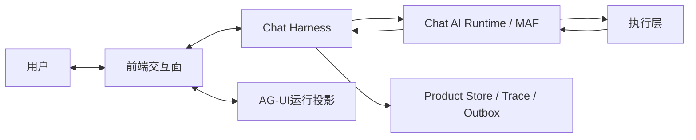

# Chat系统分阶段实现基线

> 状态：已批准并执行中。
> 更新日期：2026-07-24。
> 上位架构：[Chat总体架构与模块基线](./overall-architecture-proposal.md)。
> 愿景验证：[Chat愿景场景验证](./chat-vision-scenario-validation.md)。

## 1. 系统边界

完整Chat系统由4类运行责任共同工作，但只有两类核心产品能力：

1. `Chat Harness`：产品语义、权威事实、协作协议、Context、治理、结果沉淀和三方投影。
2. `Chat AI Runtime`：以MAF为基线的Agent、Workflow、Executor、模型、Tool和Checkpoint运行。
3. `前端交互面`：横跨两者的可读投影和用户命令入口，不拥有权威状态。
4. `执行层`：Worker、Tool Gateway、pi、Validator和Reconciler；属于Chat系统，但使用独立权限、
   Lease、幂等、副作用和恢复边界。



## 2. Chat Harness模块

| 模块 | 拥有 | 关键入站合同 | 关键出站合同 | 失败与恢复 |
|---|---|---|---|---|
| Identity/Binding | Principal、Scope、Channel Binding | `ResolvePrincipal`、`BindChannel` | `TrustedRequestContext` | 认证失败不创建Interaction；撤销传播 |
| Conversation | Product Session、Interaction、Message | `AcceptInteraction` | `InteractionAccepted`、历史查询 | 幂等接纳、分支、撤回和标题重算 |
| Work | Project、Work、Plan、Action | 领域Command/CAS | 工作集、Product Patch结果 | 事实/Trace/Outbox同事务 |
| Knowledge | Note、Memory、来源关系 | 候选、接受、修订、撤销 | 版本化知识投影 | 模型候选不直接生效；来源失效 |
| Protocol | Protocol Definition、Binding、可执行规则 | 绑定/覆盖/CAS | `ProtocolSelection` | revision不可变；冲突显式 |
| Context | Recall、Adoption、ContextPackage | `CompileContext`、用户选择 | 版本化ContextPackage | 超预算可解释裁剪；来源失效 |
| Collaboration/Governance | Intent、Draft、RunSpec、HITL、Approval | 候选与用户决定 | 不可变RunSpec、Decision | Hash/版本变化使旧授权失效 |
| Evidence/Delivery | Evidence、Artifact、Provenance、Delivery | 结果、验证、回执 | Product提交和用户可见交付 | unknown先对账，不盲重试 |

## 3. MAF运行与执行层模块

| 模块 | 责任 | 不负责 |
|---|---|---|
| Workflow Catalog | 版本化MAF Definition、节点和分支 | 用户Project/Work事实 |
| Interaction Workflow | Context→Intent→协议→Plan→Draft→Run→验证→回写 | 直接绕过Harness提交 |
| Agent Profiles | Agent身份、Instructions、模型和能力快照 | Product Session与长期Memory |
| Model Call Gateway | ModelCallDraft、逐次审批、精确Provider Body与Attempt | 一次审批授权未来所有调用 |
| Tool Gateway | 真实Catalog、Tool Request、授权、Ledger、Result和对账 | 把模型Tool Call当授权 |
| Execution Worker | Job、Lease、Attempt、游标与Checkpoint恢复 | Product Run成功终态 |
| Validator/Reviewer | 确定性规则和必要的语义质量检查 | 无限修复或扩大RunSpec |
| Finalizer | Evidence、Product Patch、Message、Run终态和Outbox提交门 | 用MAF完成替代产品成功 |

## 4. 核心对象链

```text
InboundInteraction
-> Interaction + User Message
-> ContextPackage(directory)
-> IntentCandidate
-> ProtocolSelection(protocol@revision + binding)
-> ContextPackage(detail)
-> TaskPlan / ExecutionDraft
-> Decision Record
-> immutable RunSpec
-> StepInputProjection(step + agent + allowlist + budgets)
-> Product Run / Attempt / ModelCall / ToolExecution
-> ResultCandidate + Evidence + ProductPatch
-> ValidationDisposition
-> Product commit + TurnDigest + index + Delivery
```

其中`TurnDigest`由现有`TurnSummaryRecord`演进，不新建第二张摘要事实表；它保存有来源、可重建的
本轮重点和候选，不直接提交Project、Work或Memory。

## 5. 接口规则

1. REST管理Project、Work、Note、Memory、Protocol、Context选择、Draft、Evidence和配置资源。
2. AG-UI承载一次Product Run的实时事件、共享投影和HITL interrupt/resume。
3. Product Domain Event写Transactional Outbox；Runtime Event写单调游标Journal；AG-UI事件可重建。
4. 所有写命令包含`command_id`、可信Principal、预期revision、原因和可选Decision/Grant。
5. 网络DTO不直接进入MAF；应用协调器先建立产品对象、权限与Context。
6. Agent只提交结构化候选、Result、Evidence或Product Patch；Repository不向Agent暴露。
7. 日志只记录关联ID、状态、耗时、错误分类和摘要指标；完整Prompt、Payload、密钥与隐藏推理禁止
   进入普通日志。

## 6. 前端信息架构

前端采用三层渐进披露：

1. **本轮概览**：目标、关联Project/Work、协议、关键规则、Context预算、当前步骤和待处理决定。
2. **可操作分组**：相关工作、采用Context、规则与经验、计划、执行、验证和沉淀；每组显示数量、
   状态、原因和主动作。
3. **审计细节**：source/revision/hash、完整公开内容、Trace、Model/Tool Attempt与恢复事实。

用户不需要到多个页面寻找“系统理解了什么”。聊天输入附近提供本轮Context入口；右侧Workbench
承载完整资源和运行看护；配置中心承载Provider、Agent、Tool、HITL和协议默认设置。

## 7. 分阶段实现

### 阶段A：协议、Context与步骤输入

实现Protocol Definition/Binding、TurnDigest合同、Context采用命令、StepInputProjection和渐进式
Harness Workbench，并把协议解析作为真实MAF节点接入主Workflow。

完成门：用户能看见并修正本轮目标、协议和Context；Intent/Planner/Executor/Reviewer收到不同、
可审计的最小输入；旧绑定或Context变化使相关Draft授权失效。

状态（2026-07-24）：**已完成并通过自动化、长跨度场景和真实模型浏览器回合**。当前内置7套协议，
主Workflow已升级为v1.4.0/28节点；Context revision、StepInputProjection、TurnDigest v1和三层渐进披露
均已接入。该完成状态不外推阶段B的多Intent，也不外推阶段C的Tool副作用和Evidence保证。

### 阶段B：Intent、多事项与计划

实现独立Intent revision、多Intent聚合、确定性产品查询、澄清回答合同、Plan revision和局部成功。

完成门：简单查询0模型；多事项不会串Context；用户可分别接受、修改、跳过或停止。

状态（2026-07-24）：**实施中**。Intent Set/Intent不可变revision、CAS、最多4个有序目标、跨Run
Clarification Request/Answer、28节点主Workflow、复合Plan和完整Intent Set编辑器已经接入并通过
自动化和真实模型浏览器回合：2个独立目标、4次逐次审批、权威Project空目录与文本回答均完成。
长期TaskPlanRevision接合、独立Branch Execution、部分成功/Evidence仍是本阶段完成门，当前不能把
复合Plan外推成独立分支执行保证。详细设计见
[Intent、多事项、澄清与计划详细设计](./intent-and-planning-detailed-design.md)。

### 阶段C：Tool、Evidence与结果提交

完成通用Tool Operation Ledger、outcome_unknown对账、Evidence/Artifact/Provenance、Validator、
Product Patch与Finalization Gate。

完成门：每次外部动作能回答“准备了什么、批准了什么、是否发生、如何证明、结果写到哪里”。

### 阶段D：周期工作、Delivery与长期协作

实现Schedule、周期Run、Delivery/Receipt、复习和资讯工作流、来源失效与重建索引。

完成门：跨天/周任务可继续；失败不丢任务、不重复外发；用户能看到下次行动与送达状态。

### 阶段E：完整Session、身份与多入口

完成分支、活动Run接回、任意Workflow/HITL恢复、Principal/Scope、Channel Binding及外部Adapter。

完成门：多入口继续同一Work；权限不依赖平台ID；刷新、断线、进程退出和Worker接管有明确保证。

### 阶段F：生产运营与规模

完成SLO、告警、备份、恢复演练、容量和并发测试、保留策略、依赖升级与安全审计。

完成门：故障可定位、可处置、可恢复；产品状态与用户可见结果一致。

## 8. 测试矩阵

每阶段至少覆盖：

1. 纯规则与状态机。
2. API Schema、CAS、幂等、事务回滚和稳定错误。
3. Worker退出、Lease、Checkpoint、Outbox、重复与结果未知。
4. 前端类型、组件逻辑、键盘、窄屏、错误边界和生产构建。
5. 浏览器真实交互：空状态、正常、修改、拒绝、取消、重连和恢复。
6. 多周虚拟时钟长场景：软件项目、学习、研究、周期简报、无关问答和多项目切换。
7. 真实模型关键回合：每次Provider调用逐次审批，断言结构合同、产品事实和Context来源，不按措辞
   逐字断言。
8. Trace与日志回放：从可见Product Session短ID定位Interaction、Run、Workflow节点、Model/Tool
   Attempt、Evidence和最终提交。

## 9. 当前实施顺序

```text
Protocol与Binding
-> TurnDigest权威边界
-> Context采用/排除与检索评测
-> StepInputProjection
-> 主Workflow接入
-> 渐进式前端与错误隔离
-> 多Intent
-> Tool/Evidence
-> Schedule/Delivery
-> Identity/Channel/完整Session
-> 生产运营
```

任何阶段都不得用Mock绿灯替代真实模型、真实浏览器或真实故障验证；也不得用“后面再做”从目标
架构删除尚未启用的模块。
