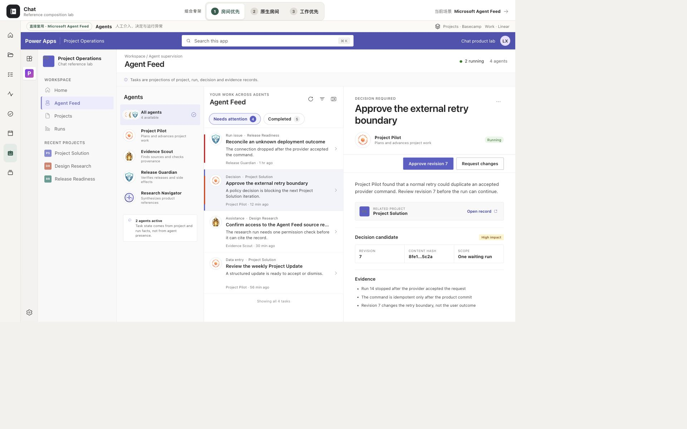

# Microsoft Agent Feed 工作台单项研究 v0.1

> 本文是 9 项工作台研究集中 Microsoft Agent Feed 的单项研究卡。截图是 Chat 冻结 Agent Feed v0.1 参考原型在 2026-08-12 的已验收画面，不是微软官方产品截图。证据标记：`O` = 本卡对既有画面的可见观察；`F` = 已批准审计/矩阵/冻结登记中的事实；`I` = 跨证据归纳；`U` = 当前未知/未验证。v0.1 审计事实标 `F · audit`；v0.2 Human Loop freeze 事实标 `F · matrix`（登记于 `reference-scenario-matrix-v0.1.md`）。

## 1. 结论卡

| 维度 | 结论 | 证据 |
|---|---|---|
| 定位 | 多 Agent 类型化监督队列：解决"哪些 Agent 现在需要我介入，风险与后果是什么" | F · audit §1 |
| 页面中心所有者 | **Supervision-feed-owned**：Needs Attention + Completed 的监督分流队列拥有页面中心。Feed 是投影和入口，不拥有 Product Run / Decision / Evidence 权威事实 | F · audit §1, §2; F · matrix §4; matrix §6 |
| 最适合 Chat 的场景 | 风险优先的类型化监督；多 Agent 异步监督；人工介入绑定 item type / owner / waiting reason / revision / hash / affected scope | F · audit §5; F · matrix §6.1 #2, #3 |
| 最强可迁移机制 | 任务类型决定动作（无通用万能 CTA）；`outcome_unknown` 只能 Reconcile / Escalate，拒绝普通 Retry；动作写回权威对象后 Feed 重新投影 | F · audit §3 #8-11; F · matrix §6.1 #3; §6.2 |
| 对人—Agent 工作台的主要缺口 | Feed 不证明生产耐久执行；无完整 Project 目标/阶段/持续推进生命周期；不是连续聊天；不是完整 Project/Work 工作台 | F · audit §6 #1; F · matrix §4 ① 部分覆盖 |

## 2. 一张已检查画面



**画面性质**：Chat 冻结 Agent Feed v0.1 参考原型的已验收画面（1920×1200），不是微软官方产品截图。它只证明结构布局，不冒充完整交互路径。

**可见布局**（O）：

- **顶部**：Agent Feed 标题 + Agent filter 下拉（可按 Agent 筛选）。
- **主区域分两区**：
  - **Needs Attention**（上半区）：待处理项列表，每项含 Agent 身份标识、任务标题、描述摘要、时间戳、related record 链接。可见 request_assistance 和 invoke_data_entry 类型的 item。
  - **Completed**（下半区）：已完成项列表，包含用户完成、Agent 完成和 request_review 信息项。
- **右侧 / 全屏**：选中 item 的详情面板，显示完整步骤、Agent 身份、时间、related record。
- **底部**：Insights 7 / 14 / 30 days 聚合统计（Agent 完成 vs 用户完成数量）。

**健康度**：健康 — Needs Attention / Completed 分流清晰，用户先看到真正阻塞 Agent 的工作（F · audit §5 #1）。每项显示 Agent 身份、时间戳和 related record 链接，提供最低限度可追溯性（F · audit §5 #4）。

**可见优点**：
- Feed 按用户是否需要介入分组，比按 Agent 或时间的纯事件流更接近监督任务（F · audit §5 #1）。
- 任务类型决定动作：request_assistance → Complete；data_entry → Accept and complete | Dismiss；review → 仅信息展示，无伪造审批按钮（F · audit §3 #8-11）。
- Side pane 保留业务上下文，full screen 支持批量审核（F · audit §5 #3）。

**可见风险/可访问性风险**：
- v0.1 画面在 `389/391×844` 时 page width `451px`，横溢 `62/60px`（F · matrix §6.3 P1）。
- v0.1 所有动作共用 Undo，可把已确认 provider 对账、Decision approval 回退（F · matrix §6.3 P1）；v0.2 已收口。
- v0.1 核心移动控件只有 `30/32px`（F · matrix §6.3 P2）；v0.2 已统一到 `44px`。
- `Completed` 同时容纳人类完成、Agent 完成和信息项，无法单独表达 failed、canceled、outcome_unknown（F · audit §6 #3）。
- Insights 的"人完成 vs Agent 完成"数量容易被误读为质量和价值（F · audit §6 #6）。

**证据限制**：冻结画面只证明 v0.1 布局结构存在。不证明 v0.2 的 Decision 修订、outcome_unknown 对账、Agent—Agent delegation 等交互路径（这些来自 v0.2 freeze fixture，不在本截图中）。不证明懒加载、side pane、Agent filter 的键盘/屏幕阅读器体验。

## 3. 一条核心路径

路径事实来自已批准审计（F · audit）和 v0.2 freeze 登记（F · matrix），不来自本截图的实际运行。

**三类 typed item 概括**：

```text
类型 A：request_assistance → Complete
  Agent 阻塞，异步等待人类
  → Feed: Needs Attention
  → user opens task + related record（F · audit §4.1）
  → performs missing work
  → Complete → task moves to Completed
  → callback resumes waiting agent

类型 B：data_entry / candidate → Accept+complete 或 Dismiss
  结构化候选需要明确接受
  → Agent invoke_data_entry（F · audit §4.2）
  → suggested changes in agent pane
  → human reviews
  → Accept and complete | Dismiss
  → v0.2 补充：人工修订 → revision / hash / scope / Evidence 绑定 Decision → Product Commit → Run resume → result（F · matrix §6.1 #2）

类型 C：request_review → 查看后无需伪造动作
  Agent 已自主完成，只要求复核
  → Completed（F · audit §4.3）
  → open evidence / related record
  → no approval action

补充：outcome_unknown → Reconcile / Escalate，拒绝普通 Retry
  → v0.2 证明：outcome_unknown → provider query → Evidence → Product Commit / manual disposition（F · matrix §6.1 #3）
  → 不提供普通 Retry；只有 Query / Reconcile / Escalate（F · matrix §7 已废弃方案 §8.3 #5）
```

**关键事实**：
- 人工介入必须绑定 item type、owner、waiting reason、revision / hash / affected scope（F · matrix §6.1 #2）。
- 动作写回权威 Product Run / Decision / Evidence / related record，然后 Feed 重新投影（F · audit §1; F · matrix §6.1 #2）。
- Feed item 只是 Agent Task 的呈现，不是产品权威事实（F · audit §1, §2）。

## 4. 工作台交互语法（六层职责）

| 层 | Agent Feed 事实 | 证据 |
|---|---|---|
| 作用域/导航 | App sitemap → Agent Feed；Agent filter 按 Agent 缩小范围；side pane ↔ full screen 切换注意力强度 | F · audit §3 #1, #2, #5 |
| 主工作表面 | Needs Attention + Completed 监督分流队列；任务类型决定可用动作 | F · audit §2, §3; matrix §4 |
| 上下文副表面 | item 详情面板（标题、描述、步骤、Agent、时间）；related record link 回到业务事实 | F · audit §3 #6, #7 |
| 连续性 | 任务类型决定动作语义；v0.2 补充 candidate → revision/hash → Decision → Product Commit → Run resume 纵向闭环 | F · audit §2; F · matrix §6.1 #2 |
| 人工检查点 | Complete / Accept+complete / Dismiss / Reconcile / Escalate；v0.2 补充 Decision 修订、outcome_unknown 对账 | F · audit §3 #8-11; F · matrix §6.1 #3 |
| 结果/证据写回 | 动作写回权威 Product Run / Decision / Evidence / related record；Feed 只是投影，重新投影后反映新状态 | F · audit §1; F · matrix §6 |

## 5. 布局为什么成立

**监督分流，不是社交 Feed**（F · audit §1, §5）：

Agent Feed 最值得借的是"监督分流"：Agent 产生的是带类型的任务，界面先分 `Needs Attention` 与 `Completed`，再由任务类型决定 `Complete`、`Accept and complete`、`Dismiss` 或无动作（F · audit §1）。

1. **Needs Attention 风险优先**：用户先看到真正阻塞 Agent 的工作（F · audit §5 #1）。
2. **Completed 留痕回看**：将需行动与留痕分开（F · audit §3 #4）。
3. **Agent filter 多 Agent 异步监督**：多 Agent 环境下快速缩小责任范围（F · audit §3 #5）。

**任务类型决定动作**（F · audit §3 #8-11, §5 #2）：

- request_assistance → Complete：人类补全缺口，向等待中的 Agent 回传。
- data_entry → Accept and complete | Dismiss：审阅建议后接受或拒绝；允许拒绝候选，而不是强迫完成。
- request_review → 仅信息展示：Agent 已自主完成时避免伪造审批按钮。

这避免每张卡都出现通用"批准 / 完成"（F · audit §5 #2）。

**`outcome_unknown` 拒绝普通 Retry**（F · matrix §6.1 #3, §6.2）：

v0.2 freeze 已证明 `outcome_unknown → provider query → Evidence → Product Commit / manual disposition` 的监督语法。`outcome_unknown` 只提供 Query / Reconcile / Escalate，不提供普通 Retry（F · matrix §7 已废弃方案 §8.3 #5）。这是对外部副作用结果未知的严肃对待，不能用乐观重试掩盖。

**与 Linear 的区分**（I）：

- **Linear 的 Update 是负责人叙事**：Project Update 是负责人署名、带 health/narrative/time 的阶段叙事，进入 Updates history / Pulse。它回答"项目现在怎样"。
- **Feed 是需要介入的 typed supervision queue**：Feed item 是 Agent 产生的带类型任务，按是否需要介入分流。它回答"哪些 Agent 现在需要我"。
- Linear Update 由人主动写；Feed item 由 Agent 产生、人响应。

**Feed 不是连续聊天，不是完整 Project/Work 工作台**（F · audit §1, §6 #1; F · matrix §4 ①）：

- Feed 是监督投影，不是聊天窗口（F · audit §5 #1）。
- Feed 没有 Project 目标、阶段或持续推进生命周期（F · matrix §4 ①）。
- Feed item 只是 Agent Task 的呈现，Chat 必须让 Product Run、Decision、Artifact 和外部副作用各自拥有权威状态（F · audit §1）。

## 6. Chat 的 Take / Adapt / Refuse

### Take

1. 默认先显示 `需要我介入`，再显示 `最近完成 / 仅供查看`（F · audit §7 Take #1）。
2. 每个动态必须显示 Agent、时间、对象类型和关联 Project（F · audit §7 Take #2）。
3. 任务类型决定动作；没有通用万能 CTA（F · audit §7 Take #3）。
4. Human input 可以暂停和恢复耐久 Run（F · audit §7 Take #4）。

### Adapt

1. Feed item 只是 `Decision / Work / Run / Artifact` 的投影，点击回到权威对象（F · audit §7 Adapt #1）。
2. 分组至少区分 `需要决定 / 需要补充 / 运行异常 / 仅供查看 / 最近完成`（F · audit §7 Adapt #2）。
3. 高影响 Decision 使用版本、hash、权限和幂等校验；不能用普通 Complete（F · audit §7 Adapt #3）。
4. `outcome_unknown`、failed、canceled 与 completed 分开，外部副作用提供对账入口（F · audit §7 Adapt #4）。
5. 默认排序结合风险、阻塞关系与时间，不采用纯热度或纯最后修改时间（F · audit §7 Adapt #5）。

### Refuse

1. 不让 Agent 自报的 Feed task 成为产品权威事实（F · audit §7 Refuse #1）。
2. 不复制模糊的 Completed 大桶（F · audit §7 Refuse #2）。
3. 不把接受建议、完成任务、批准高影响动作合并为一个按钮（F · audit §7 Refuse #3）。
4. 不在权限边界不明时展示可能包含私密上下文的动态（F · audit §7 Refuse #4）。
5. 不用 Insights 数量塑造 Agent 排名或社交竞争（F · audit §7 Refuse #5）。
6. 不对 `outcome_unknown` 使用普通 Retry（F · matrix §6.2）。

## 7. 覆盖与不覆盖

### 覆盖

| 场景 | 判定 | 证据 |
|---|---|---|
| 多 Agent / HITL / Decision / Candidate / 运行异常 | **覆盖**：v0.2 以 4 个角色 Agent、4 个 Project 跨项目监督；Decision 修订、Assistance、candidate、`outcome_unknown` 与 Agent—Agent delegation 均有 typed human/system action、owner、waiting 和独立终态 | F · matrix §4 ④ |
| visibility / consent / participant 边界 | **部分覆盖**：delegation 明示 participant visibility 与 coordination-only；不虚构跨账户社交或生产 Agent 私聊 | F · matrix §4 ⑦ |

### 不覆盖

| 能力 | 证据 |
|---|---|
| 多 Project 事务与持续推进 | F · matrix §4 ① 部分覆盖：v0.2 有 4 Project 跨项目监督，但没有 Project 目标、阶段或持续推进生命周期 |
| Project room / Stage / Milestone / Iteration / Work / Scope / Action / Update | F · matrix §4 ② 部分覆盖：有 Update candidate、Decision / Run / Evidence、related record 纵向闭环；没有 Room 或 Stage → Iteration → Work 层级 |
| Today / 个人节奏 | F · matrix §4 ③ 不负责：风险队列不是个人 Today，不能占用日常节奏入口 |
| Resource / Evidence / 知识资料长期编排 | F · matrix §4 ⑤ 部分覆盖：可选择 Evidence、展示新 Evidence、delegated Evidence 与 related record；没有知识资料的长期编排，Feed 仍不拥有 Evidence |
| 生活、娱乐、爱好等个人 Project | F · matrix §4 ⑥ 部分覆盖：保留只读 dismissed Personal Studio fixture；没有个人 Project 的真实推进 |
| 完整 Project 对象链（Stage → Milestone → Iteration → Work → Scope → Action → Update → Gate → Decision） | F · matrix §6.1 #1 |
| 跨表面连续性（同一 Work 在 Project Room / Today / Agent Feed / Workbench 间往返） | F · matrix §6.1 #4 |
| 正式 Evidence 验证、版本、贡献归属与完成门 | F · matrix §6.1 #6 |
| 失败 / 等待 / 恢复状态的完整交互证明（v0.1 截图未展示） | U |

**结论**：Microsoft Agent Feed 是 Chat 工作台的**多 Agent 监督与类型化 HITL 参考**，不是完整人—Agent 工作台答案。它回答"哪些 Agent 现在需要我介入"和"任务类型决定什么动作"，但不回答"项目现在怎样""今天选择什么""时间怎样安排""知识怎样编排"。

## 8. 证据边界

以下事项本截图与已批准审计**不能证明**：

| 未证明 | 等级 |
|---|---|
| v0.2 Decision 修订、outcome_unknown 对账、Agent—Agent delegation 的实际交互路径（来自 v0.2 freeze fixture，不在 v0.1 截图中） | U（截图）; F · matrix（冻结登记） |
| 失败 / 等待 / 恢复三种状态的完整交互路径 | U |
| 懒加载、side pane、Agent filter 的键盘 / 屏幕阅读器体验 | U |
| v0.1 移动端 `391×844` 横溢 P1 和控件 P2（v0.2 已收口，但本截图是 v0.1） | F · matrix §6.3 |
| Insights 计数的实际准确性（v0.1 有硬编码 P2，v0.2 已收口） | F · matrix §6.3 |
| 权限模型的实际行为（官方明确标记 preview，权限边界存在公开警告） | F · audit §6 #1-2 |
| 生产耐久执行（Feed 不证明；权威事实必须由 Chat Product Store / Application / Workflow 实现） | F · matrix §6.1 #2 |
| 浏览器 Back 键（非产品内导航）的滚动位置与焦点恢复 | U |

已批准审计中的事实（F · audit）来自微软官方 preview 文档与官方产品截图。v0.2 freeze 事实（F · matrix）来自 `reference-scenario-matrix-v0.1.md` 中的冻结登记。本截图只证明 Chat 冻结 v0.1 参考原型呈现了上述布局结构。

---

> Microsoft Agent Feed 5/9 已整理；本阶段只完成研究卡，未制作原型。
