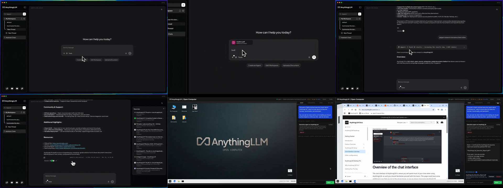

# AnythingLLM / Open Computer 工作台证据卡 v0.1

> status: candidate / pilot complete
> date: 2026-08-12
> scope: 工作台布局、状态位置、人工介入与交付方式
> forbidden: 不制作原型、不修改 Chat UI、不登记为 frozen reference
> visual evidence base: Chat research commit `e2b5aa43d719a282fdd8a0ffe6baebb1ecbaf021`
> source base: AnythingLLM `4af22f8b5c9ca3f90064b56c86c119e687602b48`

## 1. 同尺度视觉对照



这组画面不是营销首页。02～05 来自 AnythingLLM 官方 README 当前引用的 v1.11.2 产品演示，06～07 来自 Open Computer 官方演示；01 是固定源码的本地布局渲染，只证明布局，不证明运行。

## 2. 一句话结论

AnythingLLM / Open Computer 不是一个工作台形态，而是同一项目里的两种结构：

1. **Conversation-owned shell**：对话是主对象，文件、Agent 进度、Sources 都附着在消息连续性上。
2. **Workspace-owned shell**：桌面是主对象，对话、Subagents、Logs、Run 与 Deliverables 退到固定 sidecar，负责控制和解释桌面中的工作。

因此，“传统三栏工作台”只是共同零件，不是唯一答案。真正需要决定的是当前任务由 **Conversation** 还是 **Workspace / Artifact** 拥有页面中心。

## 3. AnythingLLM：Conversation-owned shell

| 状态 | 可见事实 | 设计目的推断 | 证据边界 |
|---|---|---|---|
| 对话起点 | 左侧 Workspace/Thread，中央 greeting、输入框与快捷动作（02） | 先确定工作范围，再在同一中心表面发起任务 | 官方演示版本，不等于 2026 在线实例 |
| 文件上下文 | 文件以 chip 进入输入框，提交入口不变（03） | 把资料选择保持为“这次对话输入”的组成部分 | 不证明权限、长期记忆或大文件处理 |
| Agent 进度 | 折叠进度行插在用户请求与最终回答之间，显示检索数量、阶段文本和 token（04） | 用户不离开对话即可判断 Agent 仍在工作 | 不证明展开详情、暂停、恢复或失败处理 |
| 结果与证据 | 回答留在中央消息流；Sources 从右侧抽屉展开；底部输入仍可继续追问（05） | 阅读结果、核对证据和继续对话构成一条连续路径 | 不证明来源选择、评论、接受/拒绝或正式写回 |

### 核心交互语法

```text
Workspace / Thread
→ 在同一 composer 添加文字、工具或文件
→ Agent 状态成为消息流中的中间节点
→ 最终回答仍属于消息流
→ Sources 作为可关闭侧栏出现
→ 用户继续追问
```

### 适合的场景

- 知识问答、资料研究、摘要和需要反复追问的任务；
- 工作过程可压缩为少量状态文字，不要求持续观看外部应用；
- Evidence 主要用于解释回答，而不是成为独立工作对象。

## 4. Open Computer：Workspace-owned shell

| 状态 | 可见事实 | 设计目的推断 | 证据边界 |
|---|---|---|---|
| 空工作台 | 顶栏 + 大面积桌面 + 右侧 Chat/Subagents/Logs/VM Logs + 底部输入（01） | 桌面预留给浏览器、文件和应用；对话成为控制面 | 该帧 WebSocket 未连接，只证明布局 |
| 运行中 | 右侧任务卡显示 running、子任务状态和 `Abort run`；桌面保持可见（06） | 人在不丢失工作表面的情况下观察或中断 Agent | 不证明 Abort 后的终止、对账或恢复结果 |
| 交付 | 桌面浏览器、右侧历史与 Deliverables 同屏；产物提供 Download / Remove（07） | 运行、验证线索和取走产物不需要切换到独立结果页 | 不证明产物内容质量、版本、评论、接受/拒绝或写回 |

### 核心交互语法

```text
Goal / Prompt
→ Agent 在桌面中使用浏览器、文件或应用
→ 右侧 sidecar 投影 Run、Subagents 与 Logs
→ 人通过追问或 Abort 介入
→ Deliverable 回到同一 sidecar
→ 桌面保留结果验证现场
```

### 适合的场景

- 需要浏览器、文件、桌面应用或可视化工具的长任务；
- 用户既要看“Agent 说了什么”，也要看“Agent 正在什么环境里做事”；
- 交付物是文件或工作空间状态，而不只是消息答案。

## 5. 基础骨架与真实差异

### 共同基础

两种形态都包含 6 个必要区域：

1. 工作范围导航；
2. 自然语言目标入口；
3. 主工作表面；
4. Agent / Run 状态；
5. 人工介入控制；
6. 结果与证据。

### 真实结构差异

| 问题 | AnythingLLM | Open Computer |
|---|---|---|
| 页面中心属于谁 | Conversation | Desktop / Workspace |
| 进度放在哪里 | 消息流内部 | 右侧任务/子任务面板 |
| Evidence 怎样出现 | 可关闭 Sources 抽屉 | 桌面现场 + Logs / Deliverables |
| 人怎样介入 | 继续回复、继续提问 | 回复、查看状态、Abort run |
| 结果是什么 | 可引用、可继续追问的回答 | 可下载的文件 + 保留的桌面现场 |
| 主要代价 | 长任务细节容易被压缩成不透明状态行 | sidecar 信息密度高，桌面与状态需要分配注意力 |

## 6. 开源证据核对

源码不是为了复刻，而是用来确认布局和交互归属不是截图误读。

### AnythingLLM

| 区域 | 源码入口 | 已核对事实 |
|---|---|---|
| 左侧导航 | `frontend/src/components/Sidebar/index.jsx` / `Sidebar()` | 宽度在 0 与 292px 间切换，组合 Workspace/Thread 列表 |
| 中央对话 | `frontend/src/components/WorkspaceChat/ChatContainer/index.jsx` / `ChatContainer` | `ChatHistory` 与 `PromptInput` 纵向组合，主区占满剩余宽度 |
| 内联进度 | `.../ChatHistory/PromptReply/index.jsx` + `ThoughtContainer/index.jsx` | pending 与 thought chain 被渲染在回复结构中 |
| Sources 侧栏 | `.../ChatContainer/ChatSidebar/index.jsx` | `activeSidebar` 控制 366px 侧栏的滑入/滑出 |

### Open Computer

| 区域 | 源码入口 | 已核对事实 |
|---|---|---|
| 桌面 | `open-computer/services/public/index.html` / `#desktop-container` | `flex: 1` 的 VNC iframe 占据剩余主区域 |
| 控制 sidecar | 同文件 / `#sidebar` | 默认 397px，可拖拽调整，最大 60vw |
| 状态页签 | 同文件 / `#sidebar-tabs` | Chat、Subagents、Logs、VM Logs 切换对应 panel |
| 运行与交付 | 同文件 / `#panel-chat`、`#deliverables-panel`、`#combo-btn` | Chat、Deliverables、prompt 与 send/abort 等动作在 sidecar 内组合 |
| Plan | 同文件 / `renderPlanReview()` | 源码存在可编辑 items 与 Approve/Deny；本轮接受的运行截图未覆盖，不能当作视觉闭环证据 |

## 7. 对 Chat 的 Take / Adapt / Refuse

### Take

1. 把“谁拥有页面中心”作为工作台模式的首要决定，而不是固定左/中/右模板。
2. Conversation 模式让状态与 Evidence 紧贴消息连续性。
3. Workspace 模式保留主工作表面，让 Run、Subagents、Logs 与人工控制进入 sidecar。
4. Deliverable 在任务现场交付，不跳到脱离上下文的下载中心。

### Adapt

1. Chat 不能只显示不透明的 Agent 状态行；需要能展开到 Task / Run / Evidence，但默认保持轻量。
2. `Abort` 只能是运行控制之一；Chat 仍需自己的暂停、恢复、结果未知和人工处置状态。
3. Deliverable 不能止于 Download / Remove；至少还要能查看、评论、修订、接受或拒绝。
4. Conversation 与 Workspace 应共享同一 Product Run 和 Artifact 身份，而不是两个互不相认的页面。

### Refuse

1. 不把 token 数或“正在运行”当成充分进度。
2. 不因 Open Computer 源码出现 Plan 卡片，就宣称完整 Plan 审核闭环已经被画面证明。
3. 不照搬单一 397px sidecar 或单一 292px 导航宽度；尺寸是实现证据，不是 Chat 的设计结论。
4. 不让浏览器/桌面运行事实替代 Chat 自己的权限、审批、写回与完成事实。

## 8. 当前仍缺的证据

本轮未证明：

1. 可修改、可版本绑定的 Plan 审核路径；
2. Pause / Resume、失败、结果未知和恢复；
3. 对中间 Artifact 的评论、修订、接受或拒绝；
4. Context、Memory、权限和写回范围的可见表达；
5. 多 Agent participant、visibility 与 Agent—Agent 协作关系。

因此 AnythingLLM 可以作为“基础工作台 + 两种主对象布局”的参考，但目前不能单独覆盖第 7 个参考原型所需的完整人—Agent 长任务闭环。

## 9. Pi 打样方法复盘

### 已验证的方法

```text
Codex 固定官方画面并人工验收
→ 每个 Pi Attempt 只读 1 张关键画面
→ Trace 验证 contentTypes + imageMimeTypes
→ Pi 输出可见事实 / 有界推断 / 未证明项
→ Codex 对照原图纠错并综合
→ 开源项目再做一次小范围 source map
```

成功的 5 个单图 Attempt 共 7 次工具调用、26,348 tokens，均保持 worktree 无改动。一次并发读取 4 张大图的 Attempt 在输出前以 `process_exit code=143` 进入 `outcome_unknown`；没有自动重发，改为单图分段后稳定通过。

源码核对最终完成，但第一轮探索达到 44 次工具调用、393,572 tokens；Trace 在 39 次工具调用时显示范围开始扩张，Codex 随即 steer 为“停止找新文件并综合”。下一批 Brief 不限制工具总数，但应预先给出两个入口目录，并在“每个可见区域已有一个所有者文件”时立即进入综合，避免把 source map 变成架构审计。

## 10. 当前停点

AnythingLLM / Open Computer 打样卡已经完成。它确认了基础骨架和两种真正不同的主对象布局，但没有选择第 7 个参考项目，也没有开始任何原型。
