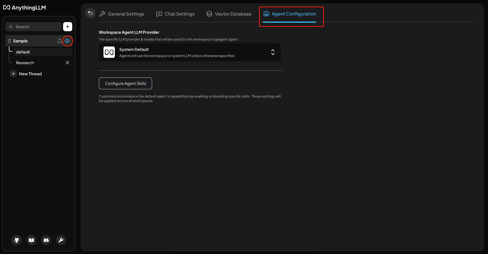
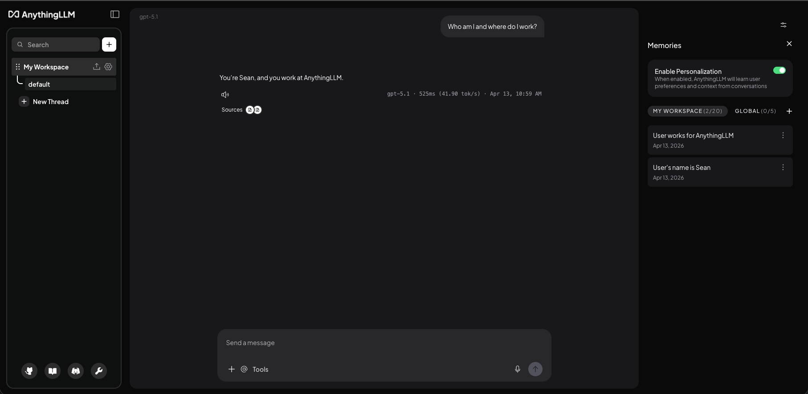
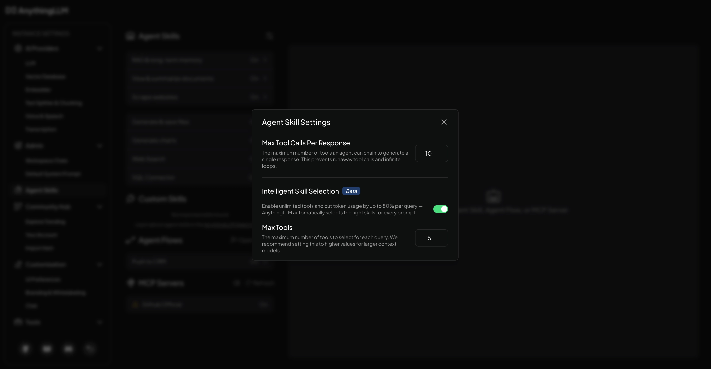
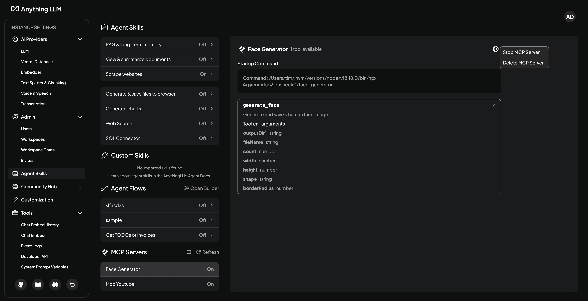
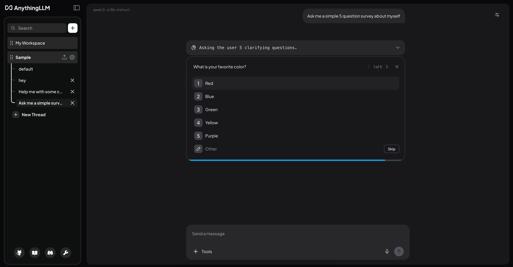
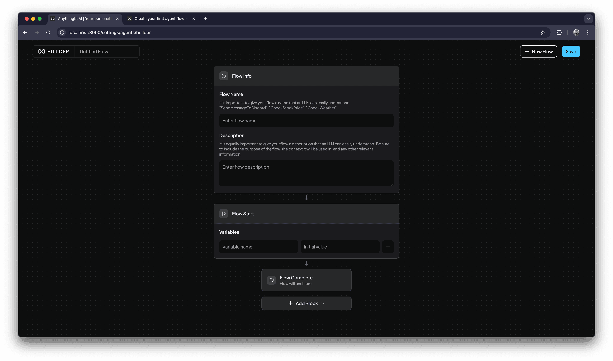
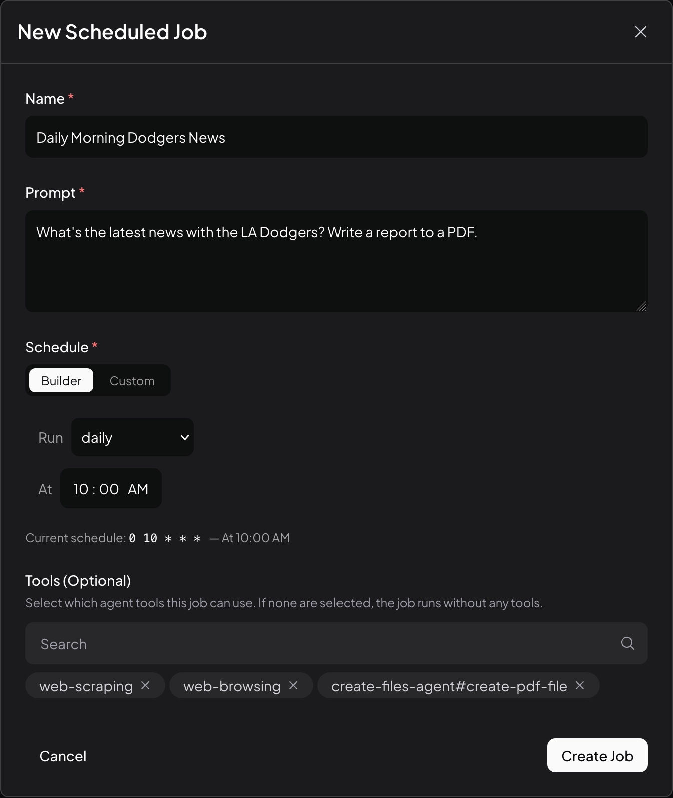
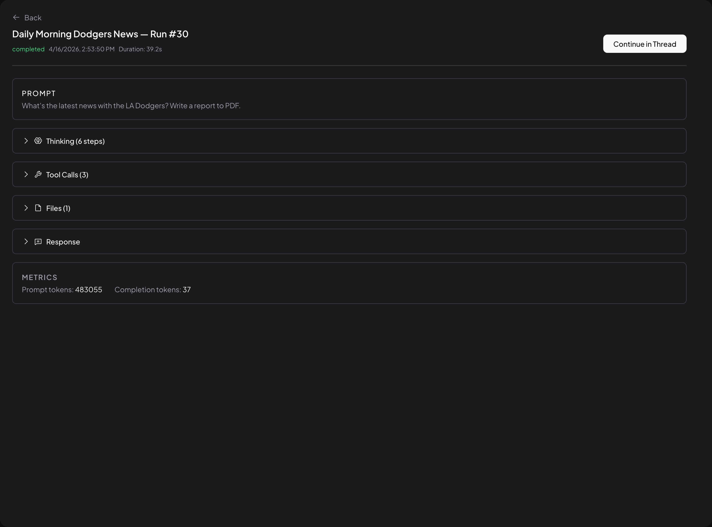
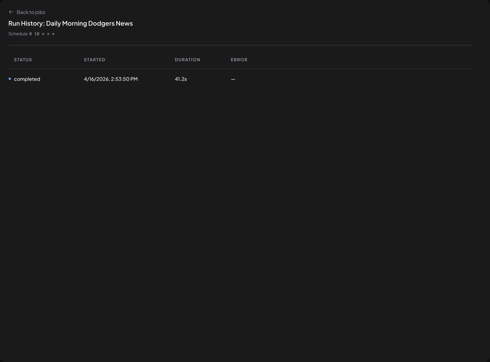

# AnythingLLM 完整参考研究 v0.2

> 本文是 9 项工作台研究集中 AnythingLLM 的单项研究卡，从 v0.1 的"Conversation + Open Computer 两种页面中心"升级为完整参考：覆盖 Conversation、Agent Configuration、Memory、Skills/MCP、Agent Survey、Flow Definition、Scheduled Jobs、Run History 和 Open Computer。截图组来自 AnythingLLM Agent Constitution / Workflow 视觉证据 v0.1（25 张官方文档截图，Codex 已检查，固定源码 commit `4af22f8`）和 v0.1 工作台证据卡中的 AnythingLLM / Open Computer 演示截图。它们不是本地完整运行实例。
>
> 证据标记：`F` = Chat 已批准合同/冻结事实；`O` = 本批已检查官方产品 UI 画面直接可见；`D` = 当前官方文档/官方源码说明；`I` = 跨证据归纳；`U` = 没有证明。

## 1. 结论卡

| 维度 | 结论 | 证据 |
|---|---|---|
| 定位 | **多表面 Agent 工作台参考**：不只是一种页面中心，而是 Conversation + Agent Configuration + Memory + Skills/MCP/Flow + Scheduled Run/History + Open Computer 的完整表面集合 | O · 25 张截图 |
| 页面中心 | 两种真正不同的模式：AnythingLLM 核心 = **Conversation-owned**；Open Computer = **Workspace-owned** | F · evidence card §2；O · 02–05, 06–07 |
| Agent Constitution 表面 | Workspace Agent Configuration 选择 LLM provider/model 并链接 Agent Skills；全局 Agent Skills / Flows / MCP 同页管理 | O · `23-workspace-agent-configuration.webp`、`10-mcp-management-ui.png` |
| Memory 表面 | Chat 右侧 Memory sidebar；Workspace / Global scope 分开；记忆卡可见、可管理 | O · `02-memory-sidebar.webp` |
| Agent Workflow Definition 表面 | Flow Builder 定义可复用 Flow（name / description / variables / blocks）；Scheduled Job 定义触发和 allowed tools | O · `05-agent-flow-new.png`、`18-scheduled-job-create.webp` |
| Agent Workflow Run 表面 | Run detail 同屏包含 Prompt、Thinking steps、Tool Calls、Files、Response、Metrics、Continue in Thread | O · `14-scheduled-job-run-detail-sections.webp` |
| 澄清 / Checkpoint 表面 | Agent Survey 以内嵌多题卡片在对话内呈现澄清问题 | O · `21-agent-survey-multiple-choice.webp` |
| 最强可迁移机制 | Agent Configuration 独立工作面、Memory scope 可见、Skills/MCP/Flow 同页管理、Survey 对话内澄清、Scheduled Run 完整生命周期、Continue in Thread 返回路径 | O · 多张截图 |
| 主要缺口 | 无完整耐久 Agent Profile；无 Plan 版本确认；无真正 Pause/Resume；无 Definition version/publish/approval；无正式 Evidence/Contribution | O/I · 见 §8 |

## 2. 七条可视路径

### 路径 1：Workspace Agent Configuration

**可见事实**（O）：Workspace 设置中有独立的 Agent Configuration 页面，可选择 Agent LLM provider 和 model，并链接到 Agent Skills。Agent 身份和能力是**独立工作面**，不只是聊天输入框旁的设置图标。

**不能证明**（U）：完整 Agent Profile（把身份、职责、能力、记忆、权限、当前工作和贡献历史统一在一起）。

→ 补充：`24-workspace-agent-skills.webp` 显示 Workspace 配置可进一步进入 Agent Skills 页面；`25-chat-tools-menu.webp` 显示 Chat composer 中可显式选择可用工具（O）。

### 路径 2：Memory Sidebar

**可见事实**（O）：Chat 右侧有 Memory sidebar，包含 Personalization 开关、Workspace / Global tabs、配额和记忆卡。Memory 是 Chat 内可见、可管理的上下文副表面；Workspace 与 Global scope 明确分开。

**证据等级细分**：
- Memory 的 Workspace/Global scope 与可编辑 UI → **O**（画面直接可见）
- 自动提取流程和模型注入细节 → **D**（依赖官方文档说明，画面未展示抽取过程）
- 第三方模型实际接收范围 → **U**

→ 补充：`01-memory-chat-settings-menu.webp` 显示 Chat settings 中有 Memories 入口（O）。

### 路径 3：Agent Skills / MCP 同页管理

**可见事实**（O）：Agent Skills 页面有 Max Tool Calls、Intelligent Skill Selection、Max Tools 作为显式控制。

**可见事实**（O）：Agent Skills、Custom Skills、Agent Flows、MCP Servers 在同一页面管理。MCP server 显示状态、tools 列表、startup command，并提供 Stop/Delete 控件。

**证据等级细分**：
- Agent Skills/Flows/MCP 同页管理 → **O**
- 真实工具授权和调用成功 → **U**（画面只展示配置入口，不证明运行时调用结果）

→ 补充：`03-agent-skills-settings-entry.webp` 显示 Agent Skills 设置入口位置（O）；`09-agent-flow-list.png` 显示已保存 Flow 列表（O）。

### 路径 4：Agent Survey（对话内澄清）

**可见事实**（O）：澄清问题以内嵌多题卡片形式呈现在对话中，有进度指示、选项、Other 自由输入和 Skip。Survey 是对话内结构化 Checkpoint，不需要跳到设置页面。

**不能证明**（U）：回答是否进入版本化 Plan 假设；长期记忆/项目事实写回。

→ 补充：`20-agent-survey-settings.webp` 显示 Agent Survey 设置入口（O）；`22-agent-survey-saved.webp` 显示 Survey 回答保存后的界面状态（O）。

### 路径 5：Agent Flow Builder

**可见事实**（O）：独立 Flow Builder，包含 Flow name / description、variables、Flow Start / Complete、Add Block、Save。Agent Workflow Definition 是独立产品表面，与 Conversation 和 Run 分离。

**不能证明**（U）：Flow 版本历史、发布审批、真实执行。

→ 补充：`06-agent-flow-info-node.png` 显示 Flow identity/description 节点（O）；`07-agent-flow-variables.png` 显示 Flow variables（O）；`08-agent-flow-add-block.png` 显示 Add Block 控件（O）。

### 路径 6：Scheduled Job Definition

**可见事实**（O）：创建 Job 时可配置 Name、Prompt、Schedule（cron 或 interval）和 allowed Tools。Scheduled Job 是 Trigger + Definition 的产品表面。

**不能证明**（U）：事件触发、对象变化触发、版本发布。

→ 补充：`19-scheduled-job-list.webp` 显示 Job 列表，包含 schedule/status/last/next run 和 edit/run now/enable-delete controls（O）。

### 路径 7：Scheduled Run Detail + Continue in Thread

**可见事实**（O）：单个 Run 同屏包含 Prompt、Thinking steps、Tool Calls、Files、Response、Metrics 和 **Continue in Thread**。Run detail 是 Agent Workflow Run 的完整产品表面；Continue in Thread 明确提供 Run → Conversation 的返回路径。

**关键约束**（F）：
- Run detail 的 `Thinking` UI 不能成为 Chat 保存隐藏推理的依据；Chat 仍只保存可观察步骤、工具、Artifact、Evidence 和显式说明（F · AGENTS.md §6.6）。
- `Thinking` 区在 AnythingLLM 画面中可见，但 Chat 的 Trace 合同只保存可观察事件和证据（F）。

→ 补充：`15-scheduled-job-tool-calls.webp` 显示 Tool Calls 展开（工具、参数、时间和结果入口）（O）；`16-scheduled-job-files.webp` 显示 Run 生成文件区（O）；`17-scheduled-job-response.webp` 显示 Run 最终回复区（O）。

### 路径 8：Run History + Stop Control

**可见事实**（O）：Run History 列出 status、started、duration、error。Scheduled Jobs 覆盖 Trigger/Run/History 完整生命周期。

**可见事实**（O）：running row 有 Stop 控件。

**关键约束**（O/F）：
- Stop 不等于 Pause/Resume。画面只证明终止入口，不证明暂停后可恢复（O）。
- AnythingLLM 的 Stop 是终止操作，Chat 仍需自己的暂停、恢复、结果未知和人工处置状态（F · AGENTS.md §4.10）。

→ 补充：`13-scheduled-job-run-detail-stop.webp` 显示 Run detail 中也有 Stop Job 入口（O）。

## 3. Open Computer 路径（保留 v0.1 结论）

Open Computer 作为 Workspace-owned 模式仍保留在本研究中，完整路径和证据见 v0.1 证据卡（F · evidence card §4）。核心事实不变：

- 桌面/浏览器/文件现场居中，对话退到 sidecar（O · v0.1 截图 06–07）。
- 任务卡显示 running、子任务状态和 `Abort run`（O）。
- Deliverable 在任务现场交付，提供 Download / Remove（O）。
- 不证明可编辑 Plan 审核、版本绑定、Pause/Resume、Artifact 评论/接受/拒绝闭环（F · evidence card §8）。

## 4. 工作台交互语法（六层职责 + Agent 扩展）

| 层 | AnythingLLM 事实 | 证据 |
|---|---|---|
| 作用域/导航 | 左侧 Workspace/Thread 列表；Settings 进入 Agent Configuration / Skills / MCP / Flows / Scheduled Jobs | O · `23`, `10`, `05`, `18` |
| 主工作表面 | Conversation-owned（消息流）；Open Computer = Workspace-owned（桌面现场） | F · evidence card §2；O · `02`, `14` |
| 上下文副表面 | Memory sidebar（Workspace/Global）；Sources 抽屉；Run detail 的 Thinking/Tool Calls/Files 区 | O · `02`, `05`, `14` |
| 连续性 | Thread 保存对话上下文；Continue in Thread 提供 Run → Conversation 返回路径 | O · `14` |
| 人工检查点 | Survey 对话内澄清；Run detail Stop；Chat composer 工具选择 | O · `21`, `12`, `25` |
| 结果/Evidence 写回 | answer + Sources；Run Files + Response；Continue in Thread 回到对话 | O · `14`, `16`, `17` |
| **Agent Configuration（扩展层）** | Workspace Agent 模型选择 + Skills 链接；全局 Skills/MCP/Flows 同页管理 | O · `23`, `10` |
| **Workflow Definition（扩展层）** | Flow Builder 定义可复用 Flow；Scheduled Job 定义触发 + tools | O · `05`, `18` |
| **Workflow Run（扩展层）** | Run detail 同屏 Prompt/Thinking/Tool Calls/Files/Response/Metrics | O · `14` |

## 5. Agent Constitution 覆盖分析

AnythingLLM 在 Agent Constitution 四轴上的覆盖：

| Constitution 维度 | AnythingLLM 覆盖 | 证据 |
|---|---|---|
| **Identity / Role / Owner / Participant** | 部分覆盖：Workspace 可选 Agent 模型，但没有完整耐久 Agent Profile（身份、职责、能力、记忆、权限、当前工作和贡献历史统一） | O · `23`；U · 完整 Profile |
| **Capability / Skill / Tool / MCP / Model** | 覆盖：Agent Skills（含 Intelligent Selection）、Custom Skills、Agent Flows、MCP Servers 同页管理；Chat composer 可选工具 | O · `10`, `04`, `25` |
| **Memory / Context / Source / Provenance** | 部分覆盖：Memory sidebar 有 Workspace/Global scope，记忆卡可见可管理；Sources 抽屉可引用；自动提取和模型注入细节未证明 | O · `02`（scope + UI）；D · 自动提取；U · 模型注入范围 |
| **Permission / Visibility / Consent / Write scope** | 不覆盖：画面未展示 Agent 权限边界、visibility 控制或 consent 机制 | U |

**结论**：AnythingLLM 在 Capability/Skill/Tool 轴覆盖最强；Memory scope 可见；但完整 Identity/Role Profile 和 Permission/Visibility 仍缺。

## 6. Agent Workflow Lifecycle 覆盖分析

| Lifecycle 阶段 | AnythingLLM 覆盖 | 证据 |
|---|---|---|
| Goal input / Clarify / assumptions / scope | 部分覆盖：Survey 提供对话内结构化澄清 | O · `21` |
| Editable Plan / confirmation | 不覆盖 | U |
| Flow definition / nodes / blocks / variables / tools | 覆盖：Flow Builder 提供完整定义表面 | O · `05`, `06`, `07`, `08` |
| Configuration / version / publish | 部分覆盖：Configuration 可见（Agent 模型选择）；version/publish 未证明 | O · `23`；U · version/publish |
| Trigger: manual / event / schedule / object change | 部分覆盖：Scheduled Jobs 提供 schedule trigger；manual 通过 Run now；event/object change 未证明 | O · `18`, `19`；U · event/object change |
| Run / task / subtask / tool progress | 覆盖：Run detail 同屏 Thinking/Tool Calls/Files/Response/Metrics | O · `14`, `15` |
| Checkpoint / ask-user / HITL / edit / accept / reject | 部分覆盖：Survey 是 ask-user；Stop 是控制入口；无 edit/accept/reject 中间 Artifact | O · `21`, `12`；U · Artifact accept/reject |
| Pause / resume / cancel / abort | 部分覆盖：Stop 提供 cancel/abort；Pause/resume 未证明 | O · `12`（Stop）；U · Pause/resume |
| Failure / timeout / retry / outcome_unknown / reconcile | 部分覆盖：Run History 显示 error status；具体 failure/retry 语义未证明 | O · `11`（error 列）；U · 完整 failure 语义 |
| Artifact / file / diff / Evidence review | 部分覆盖：Run Files 区展示生成文件；无评论/修订/接受拒绝 | O · `16`；U · review 闭环 |
| Delivery / writeback / notification | 部分覆盖：Response 区展示最终回复；Continue in Thread 提供返回路径 | O · `17`, `14` |
| Run history / Continue in Thread / reuse / next schedule | 覆盖：Run History 列出历史；Continue in Thread 明确返回对话 | O · `11`, `14` |

## 7. Chat 的 Take / Adapt / Refuse

### Take

1. **Agent Configuration 是独立工作面**，不只是聊天输入框旁的设置图标（O · `23`）。
2. **Memory 的 Workspace/Global scope 分离与可编辑 UI**（O · `02`）。
3. **Agent Skills/Flows/MCP 同页管理**减少配置跳转（O · `10`）。
4. **Survey 是对话内结构化 Checkpoint**，不跳设置页面（O · `21`）。
5. **Flow Builder 是独立 Definition 表面**，与 Conversation 和 Run 分离（O · `05`）。
6. **Scheduled Jobs 覆盖 Trigger/Run/History** 完整生命周期（O · `18`, `11`, `14`）。
7. **Continue in Thread 是 Run → Conversation 返回路径**（O · `14`）。

### Adapt

1. Chat 不能只显示不透明的 Agent 状态行；需要能展开到 Task / Run / Evidence，但默认保持轻量（F · evidence card §7 Adapt #1）。
2. `Stop` 只是运行控制之一；Chat 仍需自己的暂停、恢复、结果未知和人工处置状态（F · AGENTS.md §4.10）。
3. Deliverable / Files 不能止于展示；至少还要能查看、评论、修订、接受或拒绝（F · evidence card §7 Adapt #3）。
4. Conversation 与 Workspace / Run 应共享同一 Product Run 和 Artifact 身份（F · evidence card §7 Adapt #4）。
5. Survey 回答需要进入版本化 Plan 假设，不能只保存在对话上下文中（U → Chat 必须自建）。
6. Flow Definition 需要 version/publish/approval 才能成为 Chat 的正式配置（U → Chat 必须自建）。

### Refuse

1. **不把 `Thinking` UI 作为 Chat 保存隐藏推理的依据**（F · AGENTS.md §6.6）。Chat 的 Trace 只保存可观察事件和证据。
2. **不把 Stop 写成 Pause/Resume**（O · `12`, `13`）。Stop 只证明终止入口。
3. 不把 token 数或"正在运行"当成充分进度（F · evidence card §7 Refuse #1）。
4. 不照搬单一 sidecar 宽度；尺寸是实现证据，不是 Chat 的设计结论（F · evidence card §7 Refuse #3）。
5. 不让浏览器/桌面运行事实替代 Chat 自己的权限、审批、写回与完成事实（F · evidence card §7 Refuse #4）。
6. **不声称完整 Agent Profile 已有参考**（U）。AnythingLLM 把身份、职责、能力、记忆、权限、当前工作和贡献历史统一在一起的完整耐久 Agent Profile 不存在于任何已检查画面中。

## 8. 覆盖与不覆盖

### 覆盖

| 场景 | 判定 | 证据 |
|---|---|---|
| Conversation-owned 对话型 Agent 工作区 | **覆盖** | F · evidence card §3；O · `02`–`05` |
| Workspace-owned 电脑式执行工作面 | **部分覆盖**（保留 v0.1 结论） | F · evidence card §4；O · v0.1 截图 06–07 |
| Agent Configuration（模型选择 + Skills 链接） | **覆盖** | O · `23`, `24` |
| Memory（Workspace/Global scope + 可编辑 UI） | **覆盖** | O · `02` |
| Agent Skills / MCP / Flows 同页管理 | **覆盖** | O · `10`, `04` |
| Agent Survey（对话内结构化澄清） | **覆盖** | O · `21` |
| Flow Builder（Workflow Definition） | **覆盖** | O · `05` |
| Scheduled Jobs（Trigger + Run + History） | **覆盖** | O · `18`, `19`, `11`, `14` |
| Continue in Thread（Run → Conversation） | **覆盖** | O · `14` |

### 不覆盖

| 能力 | 证据 |
|---|---|
| 完整耐久 Agent Profile（身份 + 职责 + 能力 + 记忆 + 权限 + 当前工作 + 贡献历史） | U |
| 可修改、可版本绑定的 Plan 审核路径 | F · evidence card §8 #1；U · Flow/Survey 均未证明 |
| Flow version / publish / approval | U |
| 真正 Pause / Resume（Stop ≠ Pause/Resume） | O · `12`（Stop only）；U · Pause/resume |
| 对中间 Artifact 的评论、修订、接受或拒绝 | U |
| Permission / Visibility / Consent / Write scope | U |
| 事件触发 / 对象变化触发 | U |
| 正式 Evidence / Decision / 产品写回 | F · evidence card §3, §4 |
| 完整 Project 对象链 | F · matrix §6.1 #1 |
| 跨表面连续性（同一 Work 在 Project Room / Today / Agent Feed / Workbench 间往返） | F · matrix §6.1 #4 |
| 移动端等价交互 | U |

## 9. 证据边界

以下事项本批截图**不能证明**：

| 未证明 | 等级 |
|---|---|
| 完整耐久 Agent Profile | U |
| Flow version / publish / approval | U |
| Pause / Resume（Stop 只证明终止） | O（Stop）/ U（Pause/Resume） |
| Survey 回答进入版本化 Plan | U |
| 第三方模型实际接收 Memory 范围 | U |
| 真实工具授权和调用成功 | U |
| 事件触发 / 对象变化触发 | U |
| Artifact 评论/修订/接受/拒绝闭环 | U |
| Permission / Visibility / Consent | U |
| 正式 Evidence / Decision / 产品写回 | F · evidence card §3, §4 |
| Thinking 区的合法性作为 Chat 隐藏推理保存 | F · AGENTS.md §6.6（拒绝） |

---

> AnythingLLM 完整参考研究 v0.2 已完成；本阶段只完成研究卡，未制作原型。
