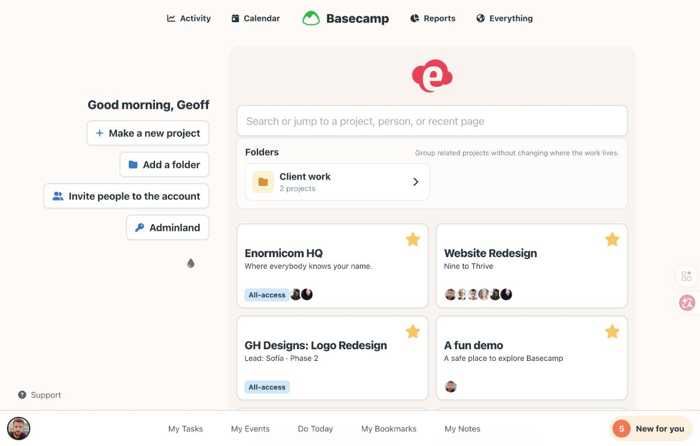
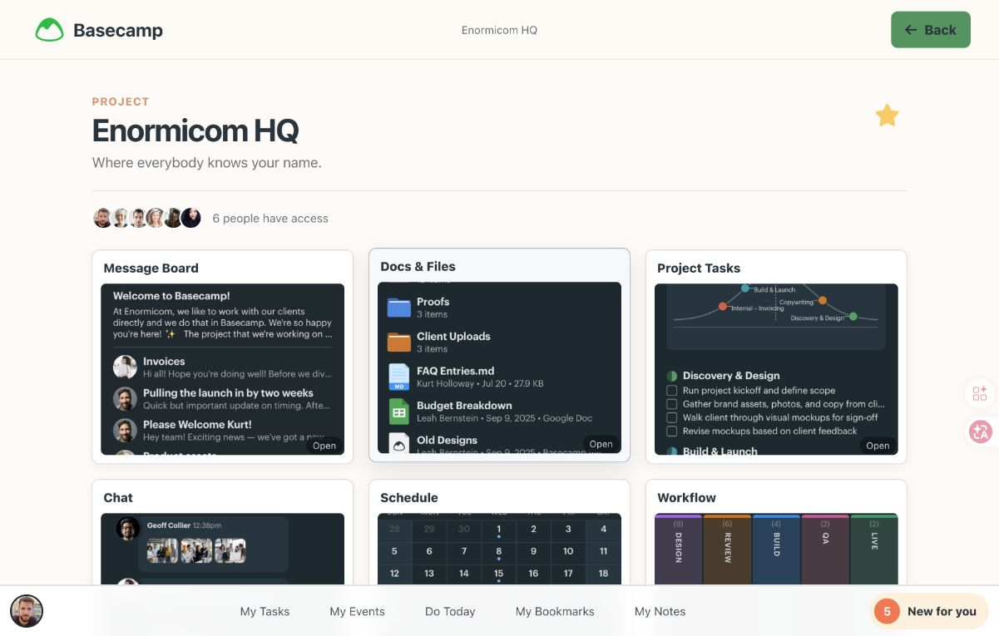
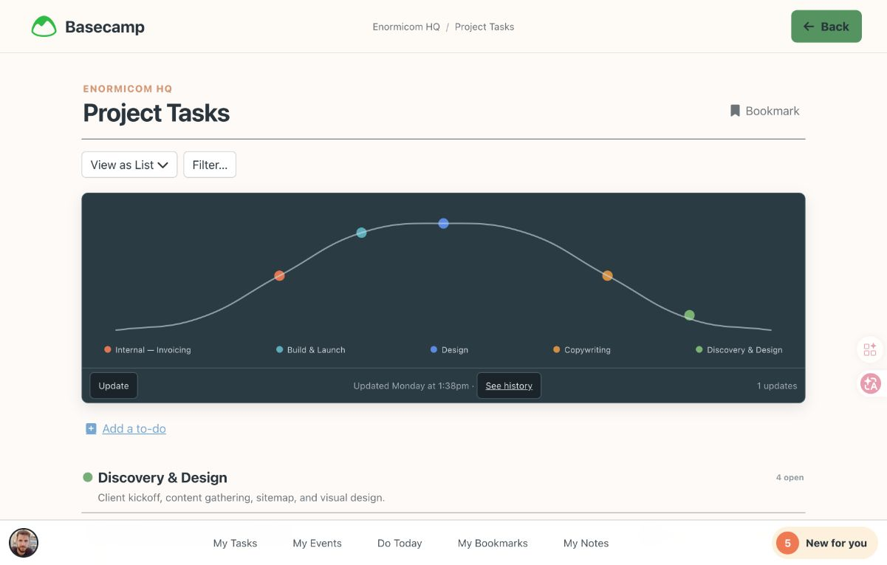
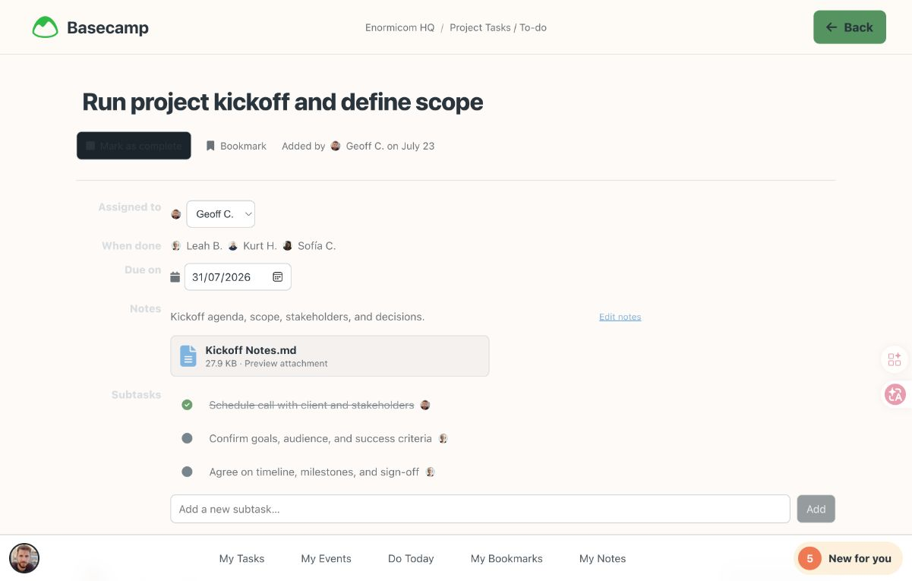

# Basecamp 工作台单项研究 v0.1

> 本文是 9 项工作台研究集中 Basecamp 的单项研究卡。四张截图是 Chat 冻结 Basecamp 参考原型在 2026-08-12 的实际运行画面，不是 Basecamp 官方产品截图。证据标记：`O` = 本次浏览器实际观察；`F` = 既有已批准审计/矩阵中的冻结事实；`I` = 基于多项证据的归纳；`U` = 当前未知/未验证。

## 1. 结论卡

| 维度 | 结论 | 证据 |
|---|---|---|
| 定位 | 多 Project 持续推进的地点与对象导航：解决"我在哪个范围、下一件事在哪里" | F · audit §1 |
| 页面中心所有者 | **Room-owned**：Project Room 拥有页面中心；Home / Activity / My bar 是入口或投影，不拥有正式对象 | F · audit §2; matrix §6 |
| 最适合 Chat 的场景 | 多 Project 地点骨架 + 对象下钻 + 个人入口整理与权威事实分离 | F · audit §8; scenario §4 ① 覆盖 |
| 最强可迁移机制 | Account → Project → Surface/Tool → Item 四层稳定作用域；Back 恢复入口上下文 | F · audit §5.1; O · 本次路径 |
| 对人—Agent 工作台的主要缺口 | 无 Agent 身份、Plan/Run/Checkpoint、暂停恢复、Evidence 验证、Agent—Agent visibility | F · scenario §4 ④ 不负责 ⑤ 部分覆盖 |

## 2. 四步可视路径

本次实际观察路径（O）：

```text
Home → Enormicom HQ Project Room → Project Tasks
→ Run project kickoff and define scope（To-do Detail）
→ Back → 同一 Enormicom HQ / Project Tasks
```

### 步骤 1：Account Home — 选择目的地



- **用户看到什么**：Account Home 中央区域展示 Project 卡片列表，Enormicom HQ 可见（O）。
- **这一步证明什么**：Home 是入口选择面，卡片是目的地，不是仪表盘小组件（F · audit §2）。
- **健康度**：健康 — 布局清晰，Project 有识别信息。
- **可见优点**：卡片只承担"去哪里"，不承担执行或提醒。
- **可见风险/可访问性风险**：暖灰背景与浅边框的对比度未实测（U）；Project 数量增长后必须依赖 Search / Folder / Star，否则退化为卡片墙（F · audit §7）。
- **证据限制**：冻结画面，不证明悬停、键盘导航或屏幕阅读器行为。

### 步骤 2：Project Room — 确认协作地点



- **用户看到什么**：Enormicom HQ 的 Room 视图，展示 Tool 入口与 Project 身份（名称、成员头像）（O）。
- **这一步证明什么**：Room 是长期协作地点，Tool 是 Room 内的固定插槽（F · audit §3）。
- **健康度**：健康 — Project 身份明确，Tool 分区清晰。
- **可见优点**：人物头像回答"谁在这个 Project"，是在场感不是装饰。
- **可见风险/可访问性风险**：6 个 Tool 等权展示，首次进入可能需要引导（I）。
- **证据限制**：冻结画面，不证明 Tool 切换后的状态保持或移动端折叠行为。

### 步骤 3：Project Tasks — 扫描一类对象



- **用户看到什么**：Tool View 层 — Project Tasks 列表，含 "Run project kickoff and define scope" 等多个 To-do（O）。
- **这一步证明什么**：Tool View 是 Room 内的一类对象投影，列表密度优先，不展开详情（F · audit §3; O）。
- **健康度**：有风险 — 列表密度合理，但已审计的 Complete checkbox 对比度 `1.24:1`、事实标签 `1.33:1` 低于 WCAG AA（F · scenario §6.3 P1）。
- **可见优点**：列表扫描优先，不需要展开就能获取状态。
- **可见风险/可访问性风险**：对比度 P1 已登记；移动端 `375px` 下触控目标 < `44px`（F · scenario §6.3 P2）。
- **证据限制**：冻结画面，不证明排序、过滤、拖拽或键盘操作。

### 步骤 4：To-do Detail — 处理一件具体事务



- **用户看到什么**：Item Detail 层 — "Run project kickoff and define scope" 的完整详情，含描述、评论区、Complete checkbox、Back 按钮（O）。
- **这一步证明什么**：单对象占满主表面，评论和 Complete 在同一表面完成；Back 按钮可见（O）。
- **健康度**：有风险 — 信息层次清晰，但对比度 P1 同步骤 3（F · scenario §6.3）。
- **可见优点**：直接链接保持 Web 质感，不依赖卡片包装。
- **可见风险/可访问性风险**：评论区在长对话中需要滚动；移动端 Complete `38px`、Post comment `42px` 均 < `44px`（F · scenario §6.3 P2）。
- **证据限制**：冻结画面，不证明评论提交后的状态变化或 Complete 后的视觉反馈。

**返回验证**（O）：第四步后点击 Back，已由 Codex 实际验证回到同一 Enormicom HQ / Project Tasks。没有为返回后的页面再生成重复截图。这证明产品内 Back 恢复 Tool View 与 Project 归属，但不证明浏览器 Back 键、滚动位置、键盘焦点或跨 Session 恢复（U）。

## 3. 工作台交互语法

| 层 | Basecamp 事实 | 证据 |
|---|---|---|
| 作用域/导航 | Account → Project → Tool → Item 四层；Home 负责"去哪里"，Room 负责"在哪里"，Tool 负责"看哪类"，Item 负责"处理哪件" | F · audit §3 |
| 主工作表面 | Project Room 拥有页面中心（Room-owned） | F · matrix §6 |
| 上下文副表面 | Item Detail 是 Room 的子表面；Activity 是跨项目时间投影，不拥有正式对象 | F · audit §2 |
| 连续性 | 对象层级：跨层跳转保持身份与返回位置；本次实际证明 Home → Room → Tool → Item → Back → 同一 Tool View | F + O |
| 人工介入 | To-do Complete、评论、Message Board 发帖；My bar 个人聚合；无 Agent / HITL / Decision | F · audit §4; scenario §4 ④ |
| 结果/资料写回 | Docs & Files、Message、附件留在 Project Room 对应 Tool；Activity 只是投影，权威留在 Tool/Item | F · audit §8; matrix §4 |

## 4. 布局为什么成立

布局位置直接表达作用域，不依赖颜色标签或装饰效果（F · audit §6）：

- **全局在上**：顶部导航承担跨账户 / 跨项目的浏览入口（Activity、Calendar、Reports、Everything）。
- **管理在左**：低频创建与管理（新建 Project、Folder、邀请成员、Adminland）与高频浏览分区。
- **主要目的地在中**：Project 卡片占据中央，是用户的主要选择面。
- **环境变化在右**：跨项目最近活动提供快速扫一眼后深链到具体对象。
- **个人责任在下**：My bar（My Tasks、My Events、Do Today、My Bookmarks、My Notes）以"我"为作用域，与 Project 作用域分开。

空间位置 = 作用域优先级。个人入口布局可以被整理（Star / Folder），但不改变 Product Store 的权威事实（F · audit §5.3）。

## 5. Chat 的 Take / Adapt / Refuse

### Take

1. Account → Project → Surface/Tool → Item 四层作用域必须稳定（F）。
2. Project Room 是长期地点；Activity、Today、Search 只深链回来，不拥有事实（F）。
3. 投影不拥有事实：Agent Pulse 是事实投影，权威留在 Work / Run / Decision / Evidence（F）。
4. 个人入口整理（Star / Folder）只改变导航布局，不改变团队事实（F）。

### Adapt

1. `New for you` → Chat `需要我处理`：只放版本绑定的决定、阻塞和定向交付（F · audit §8）。
2. Recent Activity → Chat Agent Pulse：同一 Work 的连续事件折叠为叙事，点击回权威对象（I）。
3. Jump / Search → Chat 全局跳转：查 Project、Agent、Work、Artifact、Conversation（F · audit §8）。
4. Room 中的 Tool 适配为 Chat 的 Work / Artifact / Run / Evidence / Update 等稳定表面，但不复制六宫格等权布局（I）。

### Refuse

1. 不复制六宫格等权 Tool 首页作为全局骨架（F · audit §8）。
2. 不让 Everything 成为没有对象类型和范围的万能搜索（F · audit §8）。
3. 不用颜色、头像或星标替代 Candidate / Decision / Running / Failed / Formal 状态（F）。
4. 不把 Workflow 列或 Hill Chart 冒充 Chat 的 Stage / Iteration / 产品阶段（F · scenario §4 ②）。
5. 不复制 Basecamp 品牌图形、语气和响应式位置（F · audit §8）。

## 6. 对 Chat 的覆盖与缺口

### 覆盖

| 场景 | 判定 | 证据 |
|---|---|---|
| 多 Project 事务与持续推进 | 覆盖 | F · scenario §4 ① |
| Project Room + 对象下钻 | 部分覆盖（有 Room、6 Tool、Item Detail；无一等 Iteration / Scope） | F · scenario §4 ② |
| 个人聚合返回 | 部分覆盖（My Tasks / Do Today 复用原对象并能返回；无 Things 式节奏） | F · scenario §4 ③ |

### 不覆盖

| 能力 | 证据 |
|---|---|
| Agent 身份、Plan / Run / Checkpoint、暂停 / 恢复、工具调用 | F · scenario §4 ④ 不负责 |
| Evidence 验证、版本、贡献归属、完成门 | F · scenario §4 ⑤ 部分覆盖 |
| Agent—Agent visibility / consent / participant 合同 | F · scenario §4 ⑦ 部分覆盖 |
| 失败 / 等待 / 恢复状态的交互证明 | U |

**结论**：Basecamp 是 Chat 工作台的**作用域与地点底座**，不是完整人—Agent 工作台答案。完整答案需要 Basecamp 地点感 + Linear Work 链 + Agent Feed 监督 + Heptabase 知识编排 + Things Today + HEY Calendar 的组合。

## 7. 证据边界与用户检视门

以下事项本次截图与路径**不能证明**：

| 未证明 | 等级 |
|---|---|
| 浏览器 Back 键（非产品内 Back）的滚动位置与焦点恢复 | U |
| 返回后列表中之前选中的 To-do 是否仍可见/可聚焦 | U |
| 跨 Project 跳转后返回 Home 时的状态恢复 | U |
| 移动端返回语义 | U |
| 失败 / 等待 / 恢复三种状态的交互 | U |
| Star / Folder 拖拽的即时反馈、Undo 与跨设备持久化 | U |
| Search / Jump 的空态、无权限结果和键盘循环 | U |
| 截图对比度实测值（已引用审计中的 P1 数据，本次未独立重测） | U |

四张截图是 Chat 冻结原型的运行证据，不是 Basecamp 官方界面截图。官方/产品能力事实只来自已批准审计中列明的官方资料。

> Basecamp 1/9 已整理，停在用户检视门；用户确认前不进入 Things，不制作新原型。
