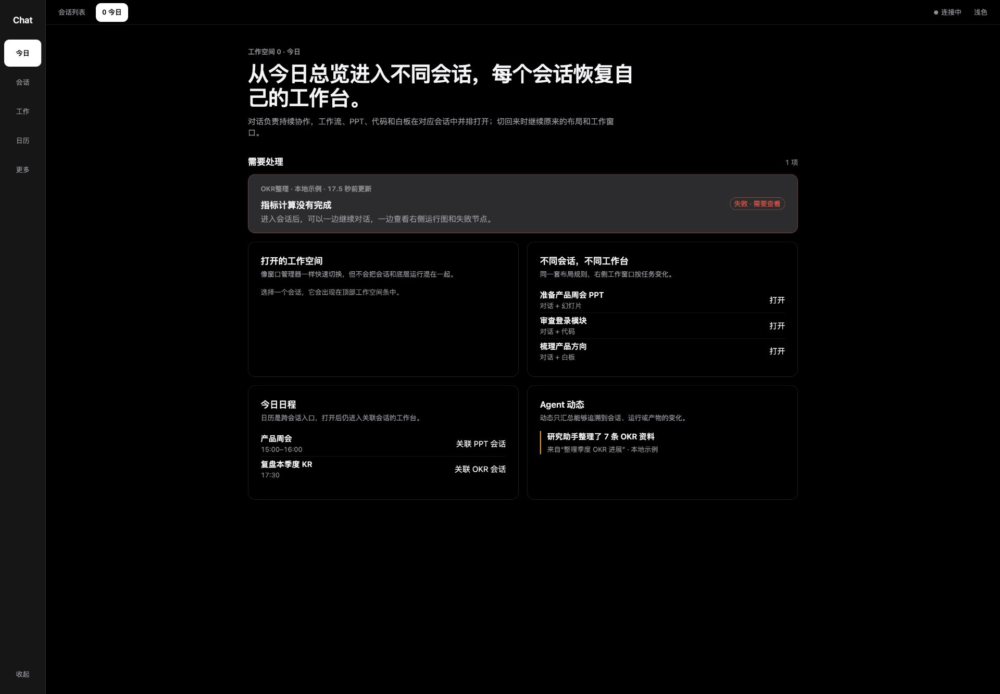
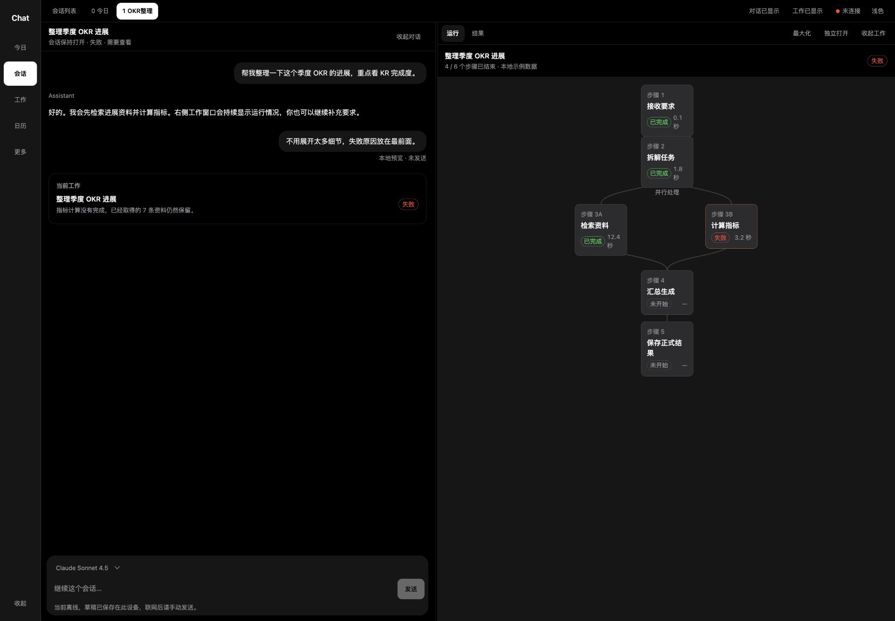
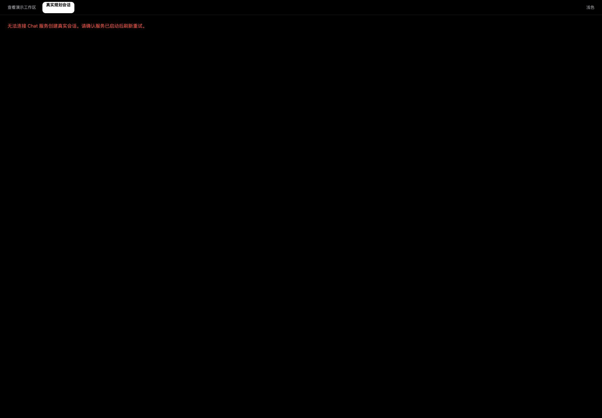
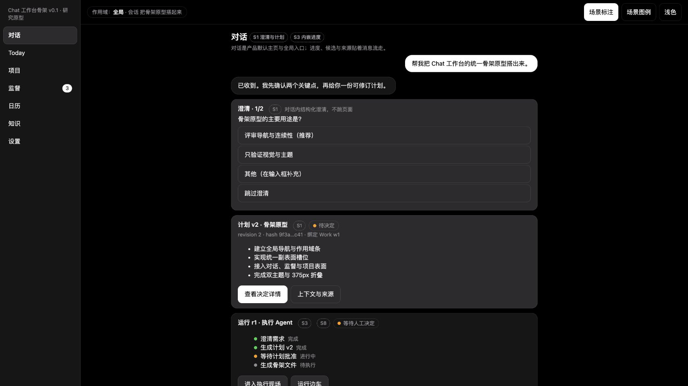
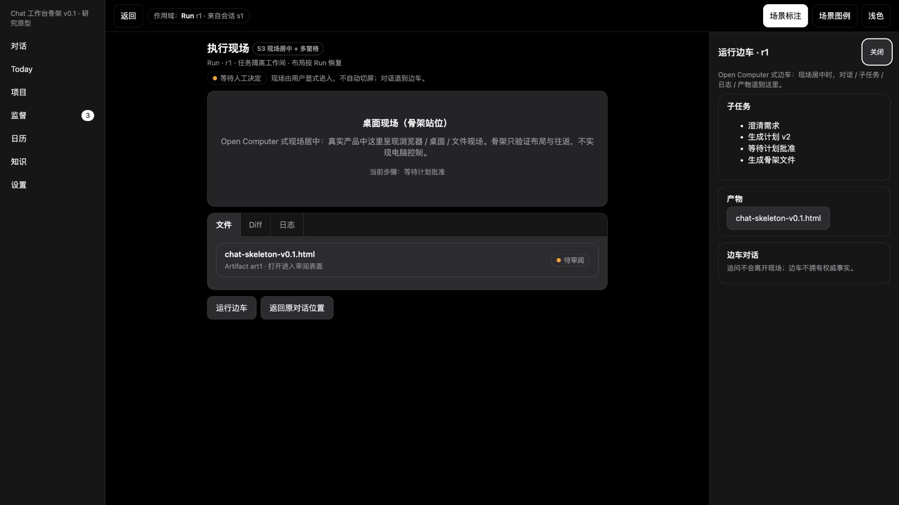
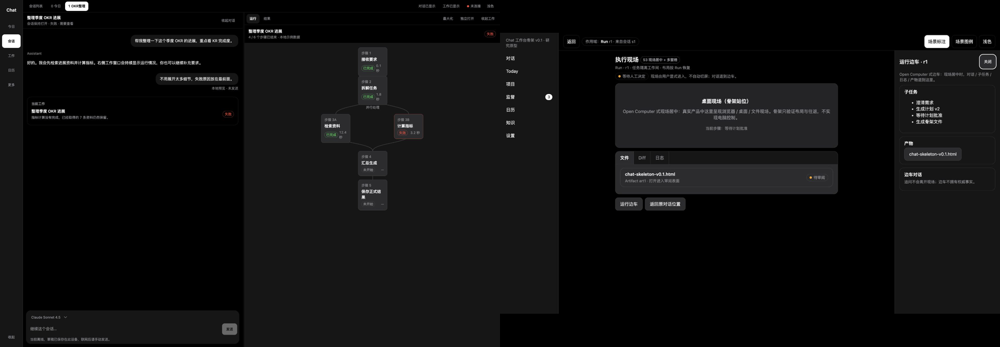

# 当前 Chat 前端工作台适配审计 v0.1

## 1. 结论

当前前端不需要重做聊天、运行图或 Workflow 内容。代码已经同时拥有两部分可复用能力：

1. `WorkspaceShell` 有全局栏、会话栏、Today、会话切换、桌面对话/工作分栏、折叠、最大化、拖拽宽度和手机单表面切换。
2. `RealWorkspace` 已接入真实 Chat / Project / Run / Note / Rule / Designer 内容，但被 `RealView` 包在另一套无侧栏的固定双栏壳中。

第一阶段应只做一件事：**把真实内容接回统一壳层，并把右侧工作区从默认常驻改为用户按需打开。** 视觉语言先沿用当前 Chat token；交互节奏以 Codex 式“导航 → 对话 → 工作区逐步展开”为主，AnythingLLM 只补左侧 Workspace / Thread 导航语法。

Workflow Definition、Agent Profile、Calendar、Today、监督和 Knowledge 的具体页面不在第一阶段实现，只保留可导航的未来位置，避免一开始把工作量扩成全产品重绘。

## 2. 本轮检查范围与证据边界

- 检查日期：2026-08-12。
- 当前生产代码基线：`0ee46633571118cd1e1d5c32b386bd6796fea653`。
- 冻结工作台骨架：`2536cb4d22d9108bf7350dc911f8e9781c4e2f61`。
- 统一工作台冻结登记：`45dc6394c9fea902a80cdc1525cc52a36e8e0d79`。
- 本轮在 `1440 × 1000` 同尺度下捕获当前 fixture、真实入口失败态和冻结骨架。
- 当前 `43111` API 未运行；真实入口只能检查服务不可用失败态，不能据此判断真实内容渲染、数据恢复或命令路径的视觉质量。
- fixture 只证明现有壳层交互和布局，不证明真实 Product Store / Workflow 已适配。

## 3. 可视路径

### Step 1 · Today 与全局导航 — 健康，但属于演示壳

可见优点：全局窄栏、顶部打开空间、Today 总览与跨会话入口已经存在；暗色层级和大面积工作空间稳定。

问题：左侧只有窄的全局栏，会话列表默认关闭；它还没有成为真实会话入口。顶部工作空间标签与左侧导航同时承担切换，今后需要明确一个主入口、一个恢复辅助。

### Step 2 · 会话 + 工作双栏 — 内容可复用，打开逻辑需改

可见优点：对话、输入框、当前工作卡、运行图、结果标签、最大化、独立打开、收起与分隔条都已经存在；右侧内容不是占位。

问题：工作区进入会话后默认常驻，并占据超过一半宽度；用户还没有通过打开文件、Run、Artifact 或“当前工作”来决定何时展开它。左侧会话列表不在当前画面，导致“选择会话 → 对话 → 打开工作”的三段式关系没有完整可见。

### Step 3 · 真实入口失败态 — 诚实，但壳层退化

可见优点：API 不可用时没有伪造会话成功，符合产品不变量。

问题：`RealView` 明确去掉了全局栏和会话栏；失败时几乎整屏空白。即使服务不可用，用户也应该仍能看到稳定导航、会话范围和可恢复入口，错误只属于中间内容区。

### Step 4 · 冻结骨架默认对话 — 目标节奏已成立

冻结骨架把对话作为默认主表面，结构化澄清、Plan 和运行摘要贴着消息流；工作区未被强制打开。它提供目标节奏，不要求把这些示例卡片原样搬进生产。

### Step 5 · 冻结骨架按需工作区 — 第一阶段目标状态

用户从运行卡显式进入执行现场后，主区切到工作现场，右侧边车按需出现，并可返回原对话位置。这个状态比“所有会话默认 50/50 双栏”更适合文件、Diff、浏览器、Canvas 和运行详情。

### 同屏对照

左侧是当前 fixture 双栏，右侧是冻结骨架工作现场。差距主要是**状态编排**：现有内容已经足够，冻结目标需要的是按需展开、工作表面身份和返回路径。

## 4. 代码事实

| 现有位置 | 已有能力 | 当前阻断 |
|---|---|---|
| `apps/web/src/components/WorkspaceShell.tsx` | `GlobalRail`、`SessionRail`、Today、会话切换、`split/chat-only/work-only`、桌面宽度调整、手机 `chat/work` | 只接 fixture；壳层和演示内容耦合在一个大组件中 |
| `apps/web/src/components/RealWorkspace.tsx` | 真实 Chat、Project、Run Viewer、Notes、Rules、Workflow Designer | 始终使用 `layout-split real-grid`；没有桌面工作区 open/closed 状态；没有侧栏 |
| `apps/web/src/App.tsx` | `fixture` / `real` 双入口和真实健康状态 | `RealView` 另建单列壳；生产默认路径绕开 `WorkspaceShell` |
| `apps/web/src/styles/app.css` | 三列根网格、两种侧栏折叠、双栏/单栏、移动 drawer 与单表面切换 | `.workspace-app.real-app` 把根布局强制降为一列；`.real-grid` 固定双栏 |

## 5. 建议冻结的三栏语义

这里的“三栏”不是三栏永远同时出现，而是三个有独立开合状态的区域：

| 区域 | 默认 | 责任 | 不负责 |
|---|---|---|---|
| 左侧导航 | 桌面展开或保留窄栏；手机 drawer | Workspace / Project / Session 选择、Today 与全局入口、当前范围 | 不显示 Run 详情和编辑产物 |
| 中间对话 | 默认主表面；桌面可收起，手机是默认页 | 对话、Goal 输入、澄清、Plan 摘要、当前 Run/Artifact 的轻量入口 | 不承载完整 Canvas、Diff、浏览器或长运行审阅 |
| 右侧工作区 | 默认关闭；由明确对象打开 | File、Diff、Artifact、Run、Browser、Canvas、Project detail；记住当前对象和返回位置 | 不创造第二个 Session，也不替代 Product Run 身份 |

打开规则：

1. 打开会话时默认只显示左侧导航 + 对话。
2. 用户点击文件、Artifact、Run、Plan 详情、项目对象或“当前工作”时，右侧工作区打开。
3. 打开新的工作对象只替换右侧 `activeSurface`，不改变会话身份。
4. 关闭右侧工作区回到原对话滚动位置和草稿。
5. 用户可收起中间对话，把右侧工作区最大化；再次打开对话恢复原宽度。
6. 手机不做三栏压缩，使用导航 drawer + `对话 / 工作` 单表面切换，并保持同一对象 identity。

## 6. 第一阶段实现任务建议

### 目标

让真实默认入口使用统一、可折叠、按需展开的工作台壳；复用现有真实内容，不改领域对象、API、Workflow 或 Product Store。

### 建议改动

1. 从 `WorkspaceShell` 抽出只负责布局和导航的 `WorkbenchShell`，不携带 fixture 数据。
2. `App` 的真实入口直接使用 `WorkbenchShell`；fixture 只作为开发/视觉测试内容注入同一壳。
3. 增加浏览器 UI 状态：`navigationOpen`、`conversationOpen`、`workSurfaceOpen`、`activeWorkSurface`、`lastConversationPosition`。这些都是可丢弃界面偏好，不进入 Product Store。
4. `RealWorkspace` 只提供 `RealChatPane` 与现有工作表面内容，不再拥有根布局；右侧默认关闭。
5. 用现有“当前工作”、Run、Notes、Rules、Designer 入口触发右侧打开；Workflow Designer 保留入口但不在本任务重设计。
6. 保持 API 不可用时的诚实失败，同时让稳定导航和会话范围继续可见。

### 明确不做

- 不重做聊天消息、Composer、Plan 审核、运行图、Project、Notes、Rules 或 Workflow Designer。
- 不新增 Calendar、Today、Agent Profile、监督、Knowledge 的业务页面。
- 不实现自由浮窗、任意拖拽停靠、多窗口同步或新产品对象。
- 不修改后端、Workflow、Memory、pi 或公开 API。

### 完成门

1. 桌面默认：导航可见、对话可用、右侧关闭。
2. 从真实对话打开至少一个 Run 和一个已有副表面；右侧出现且会话、草稿、滚动位置不丢。
3. 关闭右侧回到原对话位置；对话可收起/恢复；宽度状态可恢复。
4. API 离线时导航与会话壳仍稳定，错误只占中间内容区。
5. `375 / 768 / 1440` 三视口覆盖；手机使用 drawer + 单表面切换，不产生横向溢出。
6. 现有前端单测、typecheck、build 通过；真实服务启动后完成浏览器 E2E，不能只用 fixture 结案。

## 7. 可访问性风险

截图可见的控件标签和分隔条语义基本齐全，但还需在实现任务中实测：

1. 侧栏、对话和工作区的折叠按钮必须有 `aria-expanded` 与被控制区域引用。
2. 右侧工作区打开后，键盘焦点不能自动掠走正在输入的 Composer；只有用户明确进入工作对象时才移动焦点。
3. 分隔条键盘调整需保留；收起区域不能只是视觉隐藏，必须退出 Tab 顺序。
4. 动画遵循现有 `prefers-reduced-motion`；截图不能证明读屏顺序和焦点恢复，需要真实浏览器测试。

## 8. 决策

第一阶段选择 **Codex 式按需三段展开** 作为主骨架，AnythingLLM 作为左侧 Workspace / Thread 导航补充。两者不是并列拼接：

- Codex 决定“工作区何时出现、怎样返回对话”。
- AnythingLLM 决定“用户怎样在左侧选择 Workspace / Thread 和进入配置”。
- Chat 当前实现继续拥有 Run、Project、Note、Rule、Workflow 和正式产品事实，不由参考产品替代。

本文件仍是 `candidate`。它整理第一阶段任务范围，不授权直接修改生产前端；进入实现前需用户确认该阶段任务书。
