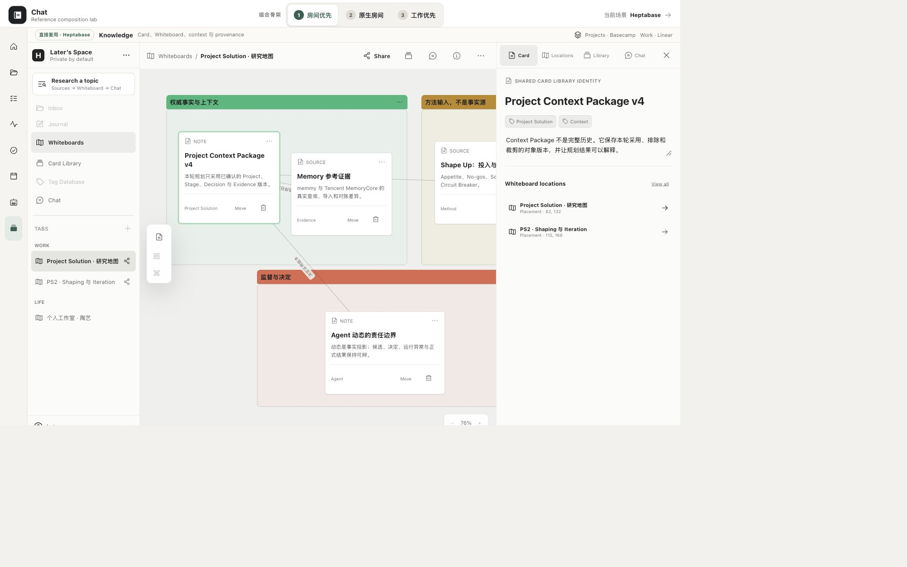

# Heptabase 工作台单项研究 v0.1

> 本文是 9 项工作台研究集中 Heptabase 的单项研究卡。截图是 Chat 冻结 Heptabase 参考原型在 2026-08-12 的已验收画面，不是 Heptabase 官方产品截图。证据标记：`O` = 本卡对既有画面的可见观察；`F` = 已批准审计/矩阵中的冻结事实；`I` = 跨证据归纳；`U` = 当前未知/未验证。

## 1. 结论卡

| 维度 | 结论 | 证据 |
|---|---|---|
| 定位 | 知识资料收集、关联、编排与复用：解决"对象身份与空间 placement 分离，AI 上下文显式可见" | F · audit §1 |
| 页面中心所有者 | **Knowledge-canvas-owned**：Card Library 持有 canonical Card；Whiteboard 只持 placement（`objectId + position + annotation`）；右侧 context sidebar 保持当前对象上下文 | F · audit §1, §2; matrix §6 |
| 最适合 Chat 的场景 | 知识工作台：同一对象跨 Board 复用、显式 AI context / provenance、主表面 + context sidebar 并排 | F · audit §7 Take; scenario §4 ⑤ 覆盖 |
| 最强可迁移机制 | canonical object × placement 分离；主表面 + context sidebar；显式 AI context chips 与 `searched` / `viewed` 访问日志 | F · audit §1, §4, §5 |
| 对人—Agent 工作台的主要缺口 | 无 Project 生命周期 / Update；没有有身份耐久 Agent、Plan、Run、暂停恢复、任务闭环或正式 Decision / Evidence 验证 | F · audit §7 Refuse; scenario §4 ② ④ 部分覆盖 |

## 2. 一张已检查画面



**画面性质**：Chat 冻结 Heptabase 参考原型的已验收画面（1920×1200），不是 Heptabase 官方产品截图。它只证明结构布局，不冒充完整交互路径。

**可见布局**（O）：

- **左侧栏**：顶部 Apps / Research 入口；中下部 tabs / folders / tab groups（可见 Work / Life 分组）；底部 Card Library 入口。
- **中央主表面**：当前 Whiteboard 画布，可见多张 Card 的空间摆放、Section 框、连接线和文本注释。Card 在画布上是 placement 引用，不是复制。
- **右侧 context sidebar**：Chat / References / Info / Location / Insight 等 tab；当前 tab 名称对 AI 可见但内容不会自动送入模型（F · audit §3 #10）。
- **Card Library side panel**（可从右侧或左侧打开）：Card 在 side panel 中作为参考，可继续拖入 Whiteboard（F · audit §3 #9）。

**健康度**：健康 — 中央主表面与右侧引用 / Chat 构成"做事 + 看材料"的并排工作台（F · audit §5 #3）。Card identity 与 Whiteboard placement 分离，允许复用而不复制（F · audit §5 #1）。

**可见优点**：
- 空间位置、Section、连接和子白板帮助外化思考，但 Card Library 仍保存权威对象（F · audit §5 #4）。
- AI 只先知道当前 tab 名称；真正读取来自手动上下文或 Space search 的可见访问记录，回答带引用（F · audit §5 #5）。
- 左侧 apps 是稳定能力，tabs 是短期工作记忆；信息架构与进行中上下文分层（F · audit §5 #2）。

**可见风险/可访问性风险**：
- 无限画布容易变成缺少入口、命名和维护规则的视觉仓库（F · audit §6 #1）。
- Apps + Tabs + right sidebar 形成多层导航，窄屏和新用户认知成本高（F · audit §6 #3）。
- 位置、颜色与连线含义由用户自行约定，不能直接成为系统权威关系（F · audit §6 #2）。
- 冻结原型移动端已按 Section 顺序大纲重写，`391×844` 实测 `scrollWidth = clientWidth = 391`，`P0/P1/P2 = 0`（F · matrix §6.3 已关闭）。

**证据限制**：冻结画面只证明桌面布局结构存在。不证明右键、拖拽、画框、hover AI actions 的键盘 / 触摸 / 辅助技术等价路径；不证明焦点顺序、屏幕阅读器语义、协作冲突与离线恢复。

## 3. 一条核心路径

路径事实来自已批准审计（F），不来自本截图的实际运行。

```text
Card Library owns Card A（canonical object）（F · audit §4.1）
  → 将 Card A 拖到 Whiteboard X（placement，不转移所有权）（F · audit §3 #2）
  → 将 Card A 拖到 Whiteboard Y（同一 Card 进入多个思考空间）（F · audit §4.1）
  → 编辑 Card A 内容 → 所有 placement 显示相同内容（F · audit §4.1）
  → Card Info 查看 locations → 列出 X + Y，可聚焦任一位置（F · audit §3 #4, #13）
  → 打开 Card / Whiteboard tab → 打开右侧 Chat sidebar（F · audit §4.2）
  → AI 默认只知道当前 tab 名称，不自动读取内容（F · audit §4.2）
  → 人手动选择 context chips（`+` / `@` 添加 Card / Whiteboard / Section / PDF）或开启 Space search（F · audit §3 #10, #11）
  → 访问日志显示 `searched` / `viewed`（F · audit §3 #10, §4.2）
  → AI 回答带引用，先是 candidate（F · audit §4.2）
  → 人拖动 AI response 到 Whiteboard 或保存为 Note Card（F · audit §3 #12）
  → 保存后仍保留来源和生成身份（F · audit §4.2）
  → 回到 Card Library 查看权威对象（F · audit §4.1）
```

**关键事实**：
- 人通过显式上下文 chips 或 Space search 开关影响 AI 读取范围；AI answer 是 candidate，不自动成长期事实（F · audit §4.2）。
- 拖动 AI response 到 Whiteboard 或保存为 Card 是用户主动选择，不是自动写入（F · audit §3 #12）。
- 权限 / Share 影响 AI 可见范围：协作者只看显式共享 Whiteboard 及其关联 Card（F · audit §9 #4）。

## 4. 工作台交互语法（六层职责）

| 层 | Heptabase 事实 | 证据 |
|---|---|---|
| 作用域/导航 | 左侧 apps（稳定能力）+ tabs / folders / tab groups（进行中上下文）+ Card Library（权威对象库） | F · audit §2, §3 #7-9 |
| 主工作表面 | Whiteboard 画布（中央）：Card placement + Section + 连接线 + 文本注释 + 子白板 | F · audit §2, §3 #5, #6; matrix §4 |
| 上下文副表面 | 右侧 context sidebar（Chat / References / Info / Location / Insight）+ Card Library side panel | F · audit §2, §3 #9, #10 |
| 连续性 | canonical object × placement 分离：编辑 Card 内容更新所有 placement；Card Info 列出所有 Board 位置 | F · audit §1, §4.1; matrix §4 |
| 人工检查点 | 显式上下文 chips（`+` / `@`）；拖动 AI response 到 Whiteboard / 保存为 Card；Share per-Whiteboard × per-participant | F · audit §3 #10-12; §9 #4 |
| 结果/证据写回 | Card 保存到 Card Library（权威源）；placement 保存 `objectId + position + annotation`；AI 访问日志 `searched` / `viewed` | F · audit §4.2; matrix §4 |

## 5. 布局为什么成立

**canonical object × placement 分离**是 Heptabase 最核心的设计决定（F · audit §1, §5）：

- **Card Library 拥有 Card 身份与内容**：所有 Card 都属于 Card Library；Whiteboard 不拥有 Card（F · audit §1）。
- **Whiteboard 只持有 placement**： placement 保存 `objectId + position + annotation`，不复制对象事实（F · audit §7 Adapt #1）。
- **同一 Card 可出现在多个 Whiteboard**：编辑 Card 内容更新所有 placement；Card Info 列出所有 Board 位置（F · audit §4.1）。

这意味着：**canvas 位置不是事实所有权**。空间位置、Section、连接和子白板帮助外化思考，但 Card Library 仍保存权威对象（F · audit §5 #4）。位置和连线表达思考上下文，但不自动成为权威业务关系（F · audit §1）。

**主画布 + context sidebar + Library side panel**（F · audit §2, §5）：

- **中央主表面**：Whiteboard 画布承担空间编排，是用户的主要工作面。
- **右侧 context sidebar**：Chat / References / Info / Location / Insight 并排，构成"做事 + 看材料"的工作台。
- **Card Library side panel**：Card 在 side panel 中作为参考，可继续拖入 Whiteboard（F · audit §3 #9）。

**显式 AI context 与 provenance**（F · audit §4.2, §5 #5）：

- AI 默认只知道当前 tab 名称，不自动读取内容（F · audit §4.2）。
- 人手动添加上下文（`+` / `@`）或开启 Space search；开启后系统可检索 Space，实际读取会显示 `searched` / `viewed`（F · audit §3 #10）。
- 工作位置、检索范围和真正读取的材料必须区分（F · audit §3 #10）。
- AI response 在被保存前只是对话输出；保存后仍应保留来源和生成身份（F · audit §4.2）。

**与 Agent Feed 的区分**（I）：

- **Agent Feed 监督运行 / HITL**：Feed 是 Needs Attention + Completed 的类型化监督队列，回答"哪些 Agent 现在需要我介入"。
- **Heptabase 编排知识 / Artifact / Evidence**：Whiteboard 是知识工作台，回答"资料怎样收集、关联、编排与复用"。
- Heptabase 没有有身份耐久 Agent、Plan、Run、暂停恢复和任务闭环（F · scenario §4 ④ 部分覆盖）。

## 6. Chat 的 Take / Adapt / Refuse

### Take

1. 对象归 Product Store，Workbench 只拥有布局与视图状态（F · audit §7 Take #1）。
2. 同一 Work / Artifact 可出现在 Project、Whiteboard、Conversation 和 Today（F · audit §7 Take #2）。
3. 主工作面与上下文侧栏并排，AI 上下文显式可见（F · audit §7 Take #3）。
4. 从对象可回到每个空间位置，避免"画布里失踪"（F · audit §7 Take #4）。
5. 把 AI 的搜索范围、实际读取记录和手动上下文分开显示（F · audit §7 Take #5）。

### Adapt

1. Whiteboard placement 保存 `objectId + position + local annotation`，不复制对象事实（F · audit §7 Adapt #1）。
2. 连接先是用户的视觉关系；确认后才可升级为 Dependency / Evidence link 等领域关系（F · audit §7 Adapt #2）。
3. AI response 落入 Workbench 时标记为 candidate；采纳或保存后保留 provenance（F · audit §7 Adapt #3）。
4. 桌面可用三栏，移动端改成层级导航和明确返回，不缩小无限画布硬塞（F · audit §7 Adapt #4）。
5. Chat 的 visibility / consent 必须由 Participant、Resource 与版本化权限事实表达；不能照搬 Heptabase 当前整个 Space 的搜索开关（F · audit §7 Adapt #5）。

### Refuse

1. 不把无限画布作为默认首页或所有工作的唯一入口（F · audit §7 Refuse #1）。
2. 不把位置、颜色、箭头直接当 Project / Run 的权威状态（F · audit §7 Refuse #2）。
3. 不在拖拽时复制 Work、Decision、Artifact 或 Card（F · audit §7 Refuse #3）。
4. 不让 AI 自动生成的 Card 无来源地进入长期知识（F · audit §7 Refuse #4）。
5. 不把"当前打开""同一 Space"或"Agent 搜索得到"当成用户已同意读取、共享或写回（F · audit §7 Refuse #5）。

## 7. 覆盖与不覆盖

### 覆盖

| 场景 | 判定 | 证据 |
|---|---|---|
| Resource / Evidence / 知识资料收集、关联、编排与复用 | **覆盖**：Card / source card、PDF、highlight、双向链接、Search、Whiteboard placement / Section / connection 与同一 Card 多 Board 复用形成完整知识工作台；边界是这些仍不是 Chat 的正式 Evidence 验证与版本事实 | F · scenario §4 ⑤ |

### 不覆盖

| 能力 | 证据 |
|---|---|
| 多 Project 事务与持续推进 | F · scenario §4 ① 部分覆盖：Work / Life tab group 与 3 个 Whiteboard 组织多个上下文；没有 Project 生命周期、推进事务或负责人 Update |
| Project room / Stage / Milestone / Iteration / Work / Scope / Action / Update | F · scenario §4 ② 部分覆盖：Whiteboard、Section、Card placement 可组成项目工作台；没有一等 Stage / Milestone / Iteration / Work / Scope / Action / Update |
| Today / 个人节奏与长期 Project 正交 | F · scenario §4 ③ 部分覆盖：官方 Daily Journal 与 Work / Life tab 分层提供日常记录语法；冻结核心路径没有执行 Today ↔ 长期 Project 的双向投影 |
| 多 Agent / HITL / Decision / Candidate / 运行异常 | F · scenario §4 ④ 部分覆盖：AI 上下文可显式选择，访问日志区分 `searched` / `viewed`，回答先是 candidate；没有多 Agent、正式 Decision、Run Attempt 或异常监督 |
| 生活、娱乐、爱好等个人 Project | F · scenario §4 ⑥ 部分覆盖：Life group 与"周末陶艺"Board 直接覆盖个人爱好资料编排；没有阶段、承诺、下一行动和健康 Update |
| visibility / consent / participant 边界 | F · scenario §4 ⑦ 部分覆盖：原型有 Board owner / edit / view / none；AI 有 Space search 开关和访问日志，但官方目前不能在已开启的 Space search 内排除单张敏感 Card / Board，也没有 consent 历史或 Agent Participant |
| 完整 Project 对象链（Stage → Milestone → Iteration → Work → Scope → Action → Update → Gate → Decision） | F · matrix §6.1 #1 |
| 跨表面连续性（同一 Work 在 Project Room / Today / Agent Feed / Workbench 间往返） | F · matrix §6.1 #4 |
| 正式 Evidence 验证、版本、贡献归属与完成门 | F · matrix §6.1 #6 |
| 失败 / 等待 / 恢复状态的交互证明 | U |

**结论**：Heptabase 是 Chat 工作台的**知识资料编排与显式 AI context 参考**，不是完整人—Agent 工作台答案。它回答"资料怎样收集、关联、编排与复用"和"AI 读了什么、回答带什么引用"，但不回答"项目现在怎样""今天选择什么""时间怎样安排""哪些 Agent 需要我介入"。

## 8. 证据边界

以下事项本截图与已批准审计**不能证明**：

| 未证明 | 等级 |
|---|---|
| 右键、拖拽、画框、hover AI actions 的键盘 / 触摸 / 辅助技术等价路径 | U |
| 焦点顺序、屏幕阅读器语义、协作冲突与离线恢复 | U |
| Space search 细粒度 consent（目前只能按整个 Space 开关，不能排除单张敏感 Card / Board） | F · audit §6 #7; scenario §4 ⑦ |
| AI 自动创建新 Card 的重复内容和来源治理压力 | U |
| 共享 Whiteboard 的权限边界实际行为（协作者只看显式共享 Board 及其关联 Card） | F · audit §9 #4 |
| MCP 写入（`save_to_note_card` / `append_to_journal`）的完整交互路径 | U |
| 浏览器 Back 键（非产品内导航）的滚动位置与焦点恢复 | U |
| 移动端 Section 顺序大纲的实际交互（冻结原型已收口 P0/P1/P2，但本截图是桌面） | U |

已批准审计中的事实（F）来自 Heptabase 官方 Wiki、产品页和支持文档（2026-08-10 复核），不由本卡截图单独证明。本截图只证明 Chat 冻结参考原型呈现了上述布局结构。

---

> Heptabase 6/9 已整理；本阶段只完成研究卡，未制作原型。
