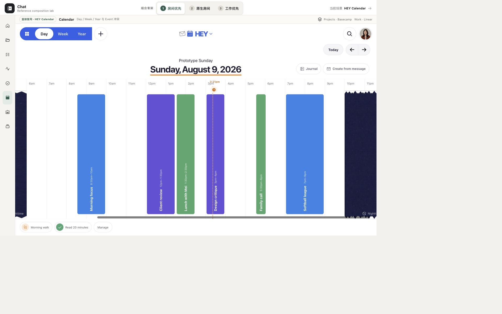

# HEY Calendar 工作台单项研究 v0.1

> 本文是 9 项工作台研究集中 HEY Calendar 的单项研究卡。截图是 Chat 冻结 HEY Calendar 参考原型在 2026-08-12 的已验收画面，不是 HEY 官方产品截图。证据标记：`O` = 本卡对既有画面的可见观察；`F` = 已批准审计/矩阵中的冻结事实；`I` = 跨证据归纳；`U` = 当前未知/未验证。

## 1. 结论卡

| 维度 | 结论 | 证据 |
|---|---|---|
| 定位 | 连续时间尺度与时间承诺：解决"时间怎样被阅读，时间承诺怎样从来源进入日历" | F · audit §1 |
| 页面中心所有者 | **Time-scale-owned**：Day 连续故事 / Week 七天章节 / Year 季节轮廓拥有页面中心；不是传统 Project 或 Agent Run | F · audit §1, §2; matrix §4, §6 |
| 最适合 Chat 的场景 | 真实时间约束与个人节奏的呈现；创建时间承诺时同屏冲突判断 | F · audit §1, §4.1; scenario §4 ③ 部分覆盖 |
| 最强可迁移机制 | Day / Week / Year 三尺度递进（每次放大主动减少细节）；Event 颜色表达来源 Calendar；创建时内嵌当天时间线，冲突判断同屏 | F · audit §2, §4, §5 |
| 对人—Agent 工作台的主要缺口 | 无 Agent 身份、Plan/Run/Checkpoint、暂停恢复、工具调用、多 Agent 协作、Evidence 完成门；来源→Event candidate 不是有身份耐久 Agent | F · scenario §4 ④ 部分覆盖 ⑤ 部分覆盖 |

## 2. 一张已检查画面



**画面性质**：Chat 冻结 HEY Calendar 参考原型的已验收画面（1920×1200），不是 HEY 官方产品截图。它只证明结构布局，不冒充完整交互路径。

**可见布局**（O）：

- **顶部导航**：Day / Week / Year 三个尺度切换按钮（Day 当前高亮）+ 日期导航（左/右箭头 + 当前日期）+ 搜索入口 + 新建事件按钮。
- **左侧栏**：Calendar 列表（多个 Calendar，每个有固定颜色）+ Habits 列表 + 底部设置入口。
- **主区域**：Day 连续时间线，从上到下按时间顺序排列 Event。Event 色块高度对应时长，颜色来自所属 Calendar（非任意改色）。空白区域可直接点击创建新 Event。
- **Event 块**：显示标题、时间范围、地点（可选）；颜色稳定表达来源 Calendar。

**健康度**：健康 — 连续时间线让空白和忙碌都能被直接感知，不依赖统计卡片（F · audit §5 #1）。Event 色块按时间顺序排列，时间约束一目了然。

**可见优点**：
- Day 视图是连续故事，不是传统时间网格；用户读"接下来发生什么"（F · audit §3 #1）。
- Event 颜色跟 Calendar 来源绑定，活泼但仍有语义纪律（F · audit §5 #3）。
- 时间线空白区域可直接点击创建，降低创建成本（O）。

**可见风险/可访问性风险**：
- Day 的非传统连续布局可能降低精确空档比较效率（U，需与传统时间网格实测）。
- 背景图、颜色和圈日可能影响文字对比度；不能作为唯一状态信号（F · audit §6 #2）。
- Habit、Journal、Sometime、Event 同屏时会增加类型识别负担（F · audit §6 #3）。
- 拖拽排期必须有键盘和辅助技术等价动作；官方快捷键表不能证明完整 WCAG 合规（F · audit §6 #4）。

**证据限制**：冻结画面只证明 Day 视图布局结构存在。不证明 Week/Year 切换、Event 编辑、拖拽创建、键盘导航（D/U/Y/S/K）、屏幕阅读器行为或移动端手势。

## 3. 一条核心路径

路径事实来自已批准审计（F），不来自本截图的实际运行。

```text
Email message（来源）
  → Create event（来源上下文中创建）（F · audit §3 #7）
  → title prefilled + private source link（预填邮件主题并保存回信私有链接）（F · audit §4.1）
  → Event candidate 进入 composer
  → composer 下方内嵌当天时间线 Peek（查看当天时间线并拖动新事件调整时间）（F · audit §3 #8）
  → 冲突可见（同屏判断时间冲突）（F · audit §5 #4）
  → 人拖动/改时间（调整到合适时间）（F · audit §3 #8）
  → Save / Cancel（F · audit §4.1）
  → Event 写回所属 Calendar（颜色自动使用所属 Calendar 的颜色）（F · audit §3 #9）
  → source link 保留（未来可回到证据）（F · audit §3 #7）
```

**关键事实**：
- 来源→Event candidate 不是有身份耐久 Agent；它只是从 Email 上下文中创建 Event 的便捷路径（F · audit §3 #7）。
- 人的检查点是时间冲突同屏判断、拖拽/改时间、Save/Cancel；它不是 Agent HITL（F · audit §4.1, §5 #4）。
- Event 颜色表达 Calendar 来源，不表达状态（F · audit §2, §3 #9）。

## 4. 工作台交互语法（六层职责）

| 层 | HEY Calendar 事实 | 证据 |
|---|---|---|
| 作用域/导航 | Day / Week / Year 三尺度切换；左/右方向键切换日期；Calendar 列表切换可见范围 | F · audit §3 #1-4, #13 |
| 主工作表面 | Day 连续时间线（当前尺度下）；Week 七天章节；Year 季节轮廓 | F · audit §2, §3 #1-3; matrix §4 |
| 上下文副表面 | composer 下方内嵌当天时间线 Peek；Event 编辑时显示通知、链接、Notes、Location、Invite、Countdown、Repeat | F · audit §3 #6, #8 |
| 连续性 | 时间尺度递进：Day→Week→Year 主动减细节；同一 Event 跨尺度保持身份 | F · audit §4.2, §5 #2 |
| 人工检查点 | 时间冲突同屏判断、拖拽/改时间、Save/Cancel；Day name / background / circle 个人化 | F · audit §3 #8, #10; §4.1 |
| 结果/证据写回 | Event 保存到所属 Calendar（颜色自动绑定）；source link 保留；Journal 自动保存；Habit 完成轨迹进入时间视图 | F · audit §3 #7, #9, #11, #12 |

## 5. 布局为什么成立

**Day / Week / Year 三尺度递进**是 HEY Calendar 最核心的设计决定（F · audit §1, §4.2, §5）：

1. **Day 是连续故事**：将今天排成一条连续时间线，用户读"接下来发生什么"，而非扫描时间网格（F · audit §3 #1）。
2. **Week 是七天章节**：显示当前周，并可查看前后周；七天成为连贯章节，保留邻近周背景（F · audit §3 #2）。
3. **Year 是季节轮廓**：只显示全日与跨日事件；最远尺度只保留季节级信号，主动丢弃小时噪声（F · audit §3 #3）。

每次放大都主动减少细节，而不是简单把同一网格缩小（F · audit §4.2）。

**Event 颜色表达来源 Calendar**（F · audit §2, §3 #9, §5 #3）：

- Event color 来自所属 Calendar，不能对单个 Event 任意改色（F · audit §2）。
- 颜色首先表达来源，而非装饰或状态（F · audit §2）。
- 色彩跟 Calendar 来源绑定，因此活泼但仍有语义纪律（F · audit §5 #3）。

**Journal / Habit / Sometime 属于日期意义层**（F · audit §2, §3 #10-12）：

- **Day decoration**（name / background / circle）：给某一天命名、加图或圈出；让时间具有记忆点，但不改事件事实（F · audit §3 #10）。
- **Journal**：在 Day 打开当天 Journal；输入自动保存；日历不仅记录承诺，也容纳围绕一天的上下文（F · audit §3 #11）。
- **Habits**：配置名称、图标、颜色；Day / Week 显示完成轨迹；重复实践进入时间视图，但与 Event 分型（F · audit §3 #12）。
- **Sometime This Week do**：不绑定精确时间的待办事项（F · audit §2）。

这些对象属于"给时间加上人的意义"层，不混同 Event 的时间承诺事实（F · audit §1）。

**与 Things 的区分**（I）：

- **Things 回答"今天选择什么"**：Today 是跨 Area/Project 的个人注意力投影，Calendar events 在顶部作为不可压缩约束呈现，但 Things 不拥有时间承诺的创建与编辑。
- **HEY 回答"时间上怎样安排与承诺"**：Day / Week / Year 是连续时间尺度，Event 是时间承诺，创建时同屏冲突判断。
- **两者都是投影/尺度，不拥有 Project 工作事实**：Things 的 Today 是注意力投影，HEY 的 Calendar 是时间尺度；它们都不拥有 Work、Run 或 Project 的状态（F · audit §1）。

## 6. Chat 的 Take / Adapt / Refuse

### Take

1. Day / Week / Year 是不同阅读问题，不是同一网格的缩放（F · audit §7 Take #1）。
2. Calendar Event 是外部时间约束，颜色表达来源 Calendar（F · audit §7 Take #2）。
3. 创建时间承诺时同屏显示冲突和来源（F · audit §7 Take #3）。
4. 少量"给一天命名"的个人表达可形成产品温度（F · audit §7 Take #4）。

### Adapt

1. Chat Today 采用连续日序列，但把 Event、Task、Decision、Run window 明确分型（F · audit §7 Adapt #1）。
2. Event 可以链接 Project / Conversation / Artifact，却不拥有这些对象（F · audit §7 Adapt #2）。
3. Day decoration 只影响个人视图；共享 Project 事实不能由背景和圈选表达（F · audit §7 Adapt #3）。
4. Calendar 与 Today 相互跳转时保留日期、滚动与来源上下文（F · audit §7 Adapt #4）。

### Refuse

1. 不复制 HEY 的具体色板、手绘气质和品牌图形（F · audit §7 Refuse #1）。
2. 不把 Work 自动转换成 Calendar Event（F · audit §7 Refuse #2）。
3. 不让颜色、背景图或位置成为唯一状态通道（F · audit §7 Refuse #3）。
4. 不把 Habit completion、Run completion 与项目完成混成一个勾选（F · audit §7 Refuse #4）。

## 7. 覆盖与不覆盖

### 覆盖

| 场景 | 判定 | 证据 |
|---|---|---|
| Today / 个人节奏与长期 Project 正交 | **部分覆盖**：Day / Week / Year 可连续切换，Event / Sometime / Habit / Journal 保持类型；但没有把 Today 项明确连回长期 Project，也不负责 Project 下一行动 | F · scenario §4 ③ |
| 生活、娱乐、爱好等个人 Project | **部分覆盖**：Personal / Family / Maybe、运动、旅行、Habit 与 Journal fixture 可体验；没有个人 Project 的阶段与持续推进 | F · scenario §4 ⑥ |
| 多 Agent / HITL / Decision / Candidate / 运行异常 | **部分覆盖**：Email 来源先形成日历候选，冲突可见，用户可改时间、保存或取消；没有 Agent 身份、Decision 版本、Run 或异常恢复 | F · scenario §4 ④ |
| Resource / Evidence / 知识资料 | **部分覆盖**：保留 Email / calendar source、搜索与 Journal；没有知识关系、版本、Evidence 验证或跨 Project 复用 | F · scenario §4 ⑤ |
| visibility / consent / participant 边界 | **部分覆盖**：有 calendar visibility、invitee 和来源；隐藏日历只是视图过滤，不是授权、consent 或 participant 合同 | F · scenario §4 ⑦ |

### 不覆盖

| 能力 | 证据 |
|---|---|
| 多 Project 事务与持续推进 | F · scenario §4 ① 不负责 |
| Project room / Stage / Milestone / Iteration / Work / Scope / Action / Update | F · scenario §4 ② 不负责 |
| Agent 身份、Plan / Run / Checkpoint、暂停 / 恢复、工具调用 | F · scenario §4 ④ 不负责 |
| 正式 Evidence 验证、版本、贡献归属与完成门 | F · scenario §4 ⑤ 部分覆盖 |
| 失败 / 等待 / 恢复状态的交互证明 | U |

**结论**：HEY Calendar 是 Chat 工作台的**连续时间尺度与时间承诺参考**，不是完整人—Agent 工作台答案。它回答"时间怎样被阅读"和"时间承诺怎样从来源进入日历"，但不回答"今天选择什么""谁在执行""结果是否可靠""证据在哪里"。

## 8. 证据边界

以下事项本截图与已批准审计**不能证明**：

| 未证明 | 等级 |
|---|---|
| Week / Year 视图的实际布局与切换动画 | U |
| Event 编辑、拖拽创建、Save/Cancel 的实际交互反馈 | U |
| 键盘导航（D / U / Y / S / K / 方向键）的焦点移动与屏幕阅读器播报 | U |
| 移动端手势与触控目标（已审计快捷键表不能证明完整 WCAG 合规） | U |
| 200% 放大、Reduce Motion、Dynamic Type | U |
| Journal 导出能力（当前不支持导出，不能把不可导出的界面状态当耐久知识） | U |
| 背景图 / 圈日对文字对比度的实际影响 | U |
| 浏览器 Back 键（非产品内导航）的滚动位置与焦点恢复 | U |

已批准审计中的事实（F）来自 HEY Calendar 官方帮助文档与官方产品截图，不由本卡截图单独证明。本截图只证明 Chat 冻结参考原型呈现了上述布局结构。

---

> HEY Calendar 4/9 已整理；本阶段只完成研究卡，未制作原型。
