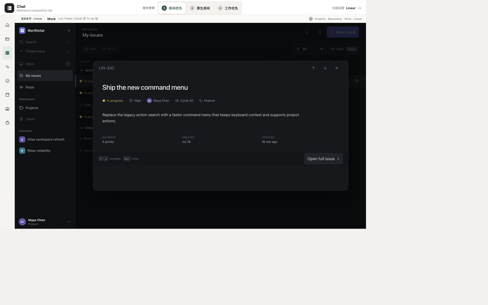

# Linear 工作台单项研究 v0.1

> 本文是 9 项工作台研究集中 Linear 的单项研究卡。截图是 Chat 冻结 Linear 参考原型在 2026-08-12 的已验收画面，不是 Linear 官方产品截图。证据标记：`O` = 本卡对既有画面的可见观察；`F` = 已批准审计/矩阵中的冻结事实；`I` = 跨证据归纳；`U` = 当前未知/未验证。

## 1. 结论卡

| 维度 | 结论 | 证据 |
|---|---|---|
| 定位 | Work 多档阅读速度与负责人署名 Update：解决"怎样快速扫描又不丢深度，怎样把项目事实写成可追溯的叙事" | F · audit §1 |
| 页面中心所有者 | **Work-list-owned**：Work List + Peek 拥有页面中心；列表负责扫描与定位，Peek 负责不离开列表的临时理解，Detail 负责完整处理 | F · audit §1, §5; matrix §4, §6 |
| 最适合 Chat 的场景 | Work 多档阅读速度 + 负责人署名 Update + "未更新"作监督信号 | F · audit §7 Take; scenario §4 ② 部分覆盖 |
| 最强可迁移机制 | List → Peek → Detail 三档阅读速度；同一对象在多个表面保持身份与状态一致；Project Update 是负责人署名、带时间和证据的叙事 | F · audit §1, §5, §7 |
| 对人—Agent 工作台的主要缺口 | 无耐久 Agent 身份、Plan/Run/Checkpoint、暂停恢复、工具调用、多 Agent 协作或完整 HITL；单一 Agent 只可起草 Update candidate，人工 Publish 后才成为项目承诺 | F · audit §7 Adapt #3; scenario §4 ④ 部分覆盖 |

## 2. 一张已检查画面



**画面性质**：Chat 冻结 Linear 参考原型的已验收画面（1920×1200），不是 Linear 官方产品截图。它只证明结构布局，不冒充完整交互路径。

**可见布局**（O）：

- **左侧栏**：Workspace 导航（Inbox、My Issues、Views）+ Projects 列表（可见多个 Project，如 "Atlas"、"Campsite"、"Revenue）+ 底部设置入口。
- **中央主区域**：Issue List，按状态分组（Backlog / Todo / In Progress / Done / Canceled），每行含状态图标 + Issue ID + 标题 + 优先级图标 + 负责人头像 + 创建时间。当前聚焦行高亮。
- **右侧 Peek pane**：当前聚焦 Issue 的预览，显示标题、描述（rich text）、状态、优先级、Assignee、Label、Cycle、估算、创建/更新时间。Peek 不是新对象，只是同一 Issue 的临时理解面。
- **顶部**：面包屑导航（Project 名 > Issues）+ 过滤/排序/分组控件。

**健康度**：健康 — 三栏布局清晰，列表密度优先但不压迫，Peek 只放判断是否深入所需的高价值字段（F · audit §5 #5）。

**可见优点**：
- 列表扫描优先，不需要展开就能获取状态和负责人（F · audit §5）。
- Peek 保持列表位置和焦点，↑/↓ 可连续检查相邻对象（F · audit §4.1）。
- 状态图标、优先级图标和负责人头像形成快速视觉编码，不依赖颜色单一通道（O）。

**可见风险/可访问性风险**：
- 高频灰阶、细小图标和密集元数据的对比度未在本卡独立实测（U）。
- Peek 在当前冻结原型中只能键盘启动（Space），首次使用者不容易发现；Chat 必须有可见入口和快捷键等价路径（F · audit §6 #1）。
- 移动端 `389/391×844` 时已审计 page width `451px`，横溢 `62/60px`（F · scenario §6.3 P1）；核心移动控件只有 `30/32px`（F · scenario §6.3 P2）。

**证据限制**：冻结画面只证明布局结构存在。不证明 Peek 键盘启动（Space/↑↓/Esc）、焦点回落、动画、屏幕阅读器行为或移动端等价交互。

## 3. 一条核心路径

路径事实来自已批准审计（F），不来自本截图的实际运行。

```text
Issue List 扫描
  → 聚焦行 → Space → Peek（current object）（F · audit §4.1）
  → ↑ / ↓ → Peek（adjacent object）连续检查（F · audit §3 #3）
  → 必要时 → 进入 Detail 完整处理（F · audit §1）
  → Esc → 关闭 Peek，List context preserved（F · audit §4.1）
  → 回到 Project Overview → 更新铅笔 → 打开最新 Update 编辑器（F · audit §3 #8）
  → AI 只起草 Update candidate（标记来源，不自动成为承诺）（F · audit §7 Adapt #3）
  → 人修订 health（On track / At risk / Off track）+ narrative（F · audit §3 #9, §4.2）
  → Publish → Overview latest + Updates history + optional Pulse / Slack（F · audit §4.2）
```

**关键事实**：
- Peek 不是新对象，也不是万能详情抽屉；它只是同一 Issue 的临时理解面（F · audit §1）。
- Agent 可以起草 Update，但必须标记来源；人工采纳后才成为项目承诺（F · audit §7 Adapt #3）。
- Update 可以被编辑或删除；Chat 的决定与证据历史不能因此被覆盖（F · audit §6 #4）。

## 4. 工作台交互语法（六层职责）

| 层 | Linear 事实 | 证据 |
|---|---|---|
| 作用域/导航 | Workspace → Project → Issues / Board / List；左侧栏负责范围切换，顶部面包屑负责层级返回 | F · audit §2 |
| 主工作表面 | Work List + Peek：列表负责扫描与定位，Peek 负责不离开列表的临时理解；Detail 负责完整处理 | F · audit §1; matrix §4 |
| 上下文副表面 | Peek pane（右侧）；Command menu（搜索/命令/预览共享同一阅读机制）；Project Overview（最新 Update + 属性） | F · audit §3 #5-7 |
| 连续性 | 三档阅读速度：List → Peek → Detail，同一对象在多个表面保持身份与状态一致 | F · audit §1, §5; matrix §4 |
| 人工检查点 | Peek Space/↑↓/Esc；Update composer 写 health + narrative 后 Publish；Reminder / stale health 监督信号 | F · audit §3, §4 |
| 结果/证据写回 | Project Update（author / health / narrative / evidence / observed changes / timestamp）→ Updates history → Pulse | F · audit §4.2; matrix §4 |

## 5. 布局为什么成立

**List → Peek → Detail 三档阅读速度**是 Linear 最核心的设计决定（F · audit §1, §5）：

1. **List 负责扫描与定位**：列表密度优先，状态图标 + 优先级 + 负责人形成快速视觉编码。用户先在这里找到目标（F · audit §1）。
2. **Peek 负责不离开列表的临时理解**：Peek 不是新对象，也不是万能详情抽屉；它只放判断是否深入所需的高价值字段（描述、负责人、状态、优先级、Cycle、标签、估算）。Peek 的价值来自"临时表面"——位置、焦点和相邻导航连续（F · audit §1, §5 #1）。
3. **Detail 负责完整处理**：当 Peek 不够时，用户进入 Detail 做完整编辑、评论或状态变更。

三档之间，同一对象保持身份与状态一致。Peek 打开时 ↑/↓ 可连续检查相邻对象，Esc 关闭后 List context preserved（F · audit §4.1）。

**Project Update 是负责人署名叙事**（F · audit §1, §4.2, §5）：

- Update 把 `health signal` 与 `explanation` 绑定：信号方便扫描，正文承担责任（F · audit §5 #3）。
- 最新 Update 位于 Overview，历史位于 Updates；当前判断与证据历史分层（F · audit §5 #4）。
- 系统自动补充进展事实（observed changes），但作者可隐藏细节；机器事实没有替作者下结论（F · audit §5 #5）。
- "未更新"本身成为可见事实（dashed overdue / Update Missing / grey inactivity），是监督信号，不等于项目失败（F · audit §4.3, §7 Take #4）。

**与 Basecamp / Things 的差异**（I）：

- **Basecamp 是 Room-owned**：Project Room 拥有页面中心，6 个 Tool 是 Room 内的固定插槽，对象层级负责连续性。
- **Things 是 Today projection-owned**：Today 是跨 Area/Project 的个人注意力投影面，Calendar / Daytime / This Evening 三层节奏占据页面中心。
- **Linear 是 Work-list-owned**：Work List + Peek 拥有页面中心，三档阅读速度负责连续性，负责人署名 Update 负责叙事。

## 6. Chat 的 Take / Adapt / Refuse

### Take

1. List → Peek → full detail 三档阅读速度（F · audit §7 Take #1）。
2. 同一对象在多个表面保持身份与状态一致（F · audit §7 Take #2）。
3. Project Update 是负责人署名、带时间和证据的叙事（F · audit §7 Take #3）。
4. "未更新"是监督信号，不等于项目失败（F · audit §7 Take #4）。

### Adapt

1. Peek 同时支持可见按钮、键盘和移动端半屏，关闭后恢复入口焦点与滚动（F · audit §7 Adapt #1）。
2. Project Update 拆为 `author / health / narrative / evidence / observed changes / timestamp`（F · audit §7 Adapt #2）。
3. Agent 可以起草 Update，但必须标记来源；人工采纳后才成为项目承诺（F · audit §7 Adapt #3）。
4. Agent 动态聚合按"与我有关 / 需介入 / 最近"，不采用 Popular 默认排序（F · audit §7 Adapt #4; §6 #3）。

### Refuse

1. 不复制 Linear 的黑灰、窄行高和快捷键专属入口（F · audit §7 Refuse #1）。
2. 不把所有详情都做成右侧抽屉（F · audit §7 Refuse #2）。
3. 不把事件流、模型摘要或点赞热度当成 Project Update（F · audit §7 Refuse #3）。
4. 不允许 Update 修改覆盖 Decision、Run 或 Artifact 的权威历史（F · audit §7 Refuse #4）。

## 7. 覆盖与不覆盖

### 覆盖

| 场景 | 判定 | 证据 |
|---|---|---|
| Project room / Stage / Milestone / Iteration / Work / Scope / Action / Update | **部分覆盖**：有 Overview、Issues、Updates、Milestones、Issue List / Peek / Detail 与负责人 Update；没有独立 Stage、Iteration、Scope、Action，Issue 不能代替所有工作层级 | F · scenario §4 ② |
| 多 Project 事务与持续推进 | **部分覆盖**：3 个 Project 可切换并进入 Pulse / Updates；只有 Atlas 有完整 Issue 集，状态保存在前端内存，未证明完整 Portfolio 生命周期 | F · scenario §4 ① |
| 多 Agent / HITL / Decision / Candidate / 运行异常 | **部分覆盖**：单一 Agent 可起草 Project Update，人工编辑后 Publish；只有发布后才进入 Overview / History / Pulse。没有多 Agent、正式 Decision、Run 或异常监督 | F · scenario §4 ④ |
| Resource / Evidence / 知识资料 | **部分覆盖**：有 Resources、来源、Observed changes 与 History；没有真实关联、空间编排、版本验证或复用闭环 | F · scenario §4 ⑤ |

### 不覆盖

| 能力 | 证据 |
|---|---|
| Today / 个人节奏与长期 Project 正交 | F · scenario §4 ③ 不负责 |
| 生活、娱乐、爱好等个人 Project | F · scenario §4 ⑥ 不负责 |
| 完整 Project 对象链（Stage → Milestone → Iteration → Work → Scope → Action → Update → Gate → Decision） | F · scenario §6.1 #1 |
| 跨表面连续性（同一 Work 在 Project Room / Today / Agent Feed / Workbench 间往返） | F · scenario §6.1 #4 |
| 正式 Evidence 验证、版本、贡献归属与完成门 | F · scenario §6.1 #6 |
| 失败 / 等待 / 恢复状态的交互证明 | U |

**结论**：Linear 是 Chat 工作台的**Work 多档阅读与负责人叙事参考**，不是完整人—Agent 工作台答案。它回答"怎样快速扫描又不丢深度"和"怎样把项目事实写成可追溯的叙事"，但不回答"今天选择什么""谁在执行""结果是否可靠""证据在哪里"。

## 8. 证据边界

以下事项本截图与已批准审计**不能证明**：

| 未证明 | 等级 |
|---|---|
| Peek 键盘启动（Space/↑↓/Esc）的实际焦点回落与动画 | U |
| 截图对比度实测值（高频灰阶、细小图标、密集元数据） | U |
| 移动端 `391×844` 下的实际交互（已登记横溢 P1 + 控件 P2） | U |
| 屏幕阅读器播报、200% 放大、Reduce Motion | U |
| Update 编辑/删除后的历史恢复与版本绑定 | U |
| Agent 起草 Update 的完整交互路径（截图未展示 AI 界面） | U |
| 多 Agent 协作、Agent—Agent 委派、Decision 修订、outcome_unknown | U |
| 浏览器 Back 键（非产品内导航）的滚动位置与焦点恢复 | U |

已批准审计中的事实（F）来自 Linear 官方文档与官方产品截图，不由本卡截图单独证明。本截图只证明 Chat 冻结参考原型呈现了上述布局结构。

---

> Linear 3/9 已整理；本阶段只完成研究卡，未制作原型。
