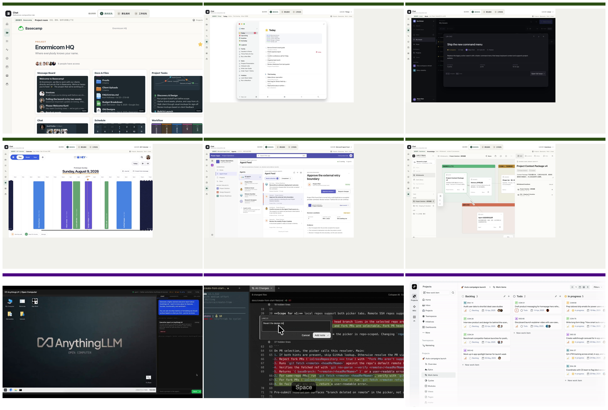

# 九项工作台研究与分类报告 v0.2

> 本报告是 9 项工作台研究的汇总，用于以后设计 Chat 工作台时按场景查表。v0.2 在保留 v0.1 "五类主要场景 + 六层骨架"历史研究价值的基础上，新增三轴选择框架 A/B/C，明确旧"五类场景"只覆盖 A 轴（Workbench Surfaces），不能作为完整选型菜单。
>
> **版本说明**：为保留稳定路径，文件名保留 v0.1；正文版本已升级到 v0.2。
>
> 截图命名空间定义：
> - **ACW-** = `evidence/anythingllm-agent-constitution-workflow-v0.1/screenshots/`（25 张：ACW-01 – ACW-25；覆盖 Memory / Skills / Flow / MCP / Scheduled Jobs / Survey / Agent Configuration）
> - **WB-** = `evidence/anythingllm-v0.1/screenshots/`（8 张：WB-00 – WB-07；覆盖 Conversation 起点 / 文件上下文 / Agent 进度 / 结果来源 / Open Computer）
>
> 证据标记：`F` = Chat 已批准合同、冻结事实或已批准研究登记；`O` = 本批已检查产品 UI 画面直接可见；`D` = 当前官方文档或官方源码说明；`I` = 跨证据归纳或 Chat 适配判断；`U` = 当前没有证明。

## 1. 结论先行

### 1.1 v0.1 的历史价值（保留）

九项研究不是九种皮肤，而是**五类主要场景 + 一组通用工作台骨架**（I · v0.1）。

**五类主要场景**（分类非互斥，每项一个主类别 + 可重叠的跨场景能力标签）：

1. **长期项目 / 工作对象**：Basecamp（Room-owned）、Linear（Work-list-owned）、Plane（Work-object-owned + Intake）。
2. **个人注意力 / 时间**：Things（Today projection-owned）、HEY Calendar（Time-scale-owned）。
3. **对话 / Agent 执行**：AnythingLLM（Conversation-owned）、Open Computer（Workspace-owned）。
4. **多 Agent 监督 / HITL**：Microsoft Agent Feed（Supervision-feed-owned）、Orca（Task/workspace-owned + Artifact review）。
5. **知识 / Artifact / Evidence**：Heptabase（Knowledge-canvas-owned）。

**通用工作台骨架**：所有 9 项都可以还原为 6 层职责（作用域/导航、主工作表面、上下文副表面、对象身份/连续性、人工检查点、结果/Evidence 写回），差异在"谁拥有页面中心、谁保持连续性、人工在哪里介入、结果写回哪里"。

### 1.2 v0.2 的关键纠偏

**旧"五类场景"只覆盖 A 轴（Workbench Surfaces），不是完整选型菜单**（I）。

完整的 Chat 工作台选择需要三条正交轴：

| 轴 | 回答的问题 | 本报告中 |
|---|---|---|
| **A 轴：Workbench Surfaces** | 工作在哪里呈现？页面中心由谁拥有？ | §3（保留 v0.1 五类 + 去重表面列表） |
| **B 轴：Agent Constitution** | Agent 是谁？能力、记忆、权限边界？ | §4（新增） |
| **C 轴：Agent Workflow Lifecycle** | 怎样从目标到结果？完整生命周期 | §5（新增） |

**核心发现**：没有任何一个项目完整覆盖三轴（I）。组合结果属于 I。

### 1.3 三个必须分开的概念

| 概念 | 定义 | 不属于 |
|---|---|---|
| **Agent Constitution** | 谁：身份、能力、记忆、权限 | ≠ Knowledge/Context 的子项 |
| **Agent Workflow Definition** | 定义/配置/版本/发布/触发 | ≠ Agent Workflow Run |
| **Agent Workflow Run** | 一次执行的进度、介入、失败、结果 | ≠ Business / Project Workflow |
| **Business / Project Workflow** | 业务 Work item 状态流 | ≠ Agent Workflow；不得冒充 |

## 2. 九项同屏视觉索引

**3×3 位置映射**：

| 位置 | 产品 | 来源类别 | 页面中心所有者 |
|---|---|---|---|
| (0,0) | Basecamp | Chat 冻结参考原型已验收画面 | Room-owned |
| (0,1) | Things | Chat 冻结参考原型已验收画面 | Attention/time projection-owned |
| (0,2) | Linear | Chat 冻结参考原型已验收画面 | Work-list-owned |
| (1,0) | HEY Calendar | Chat 冻结参考原型已验收画面 | Time-scale-owned |
| (1,1) | MS Agent Feed | Chat 冻结参考原型已验收画面 | Supervision-feed-owned |
| (1,2) | Heptabase | Chat 冻结参考原型已验收画面 | Knowledge-canvas-owned |
| (2,0) | AnythingLLM / OC | 官方/一手界面证据，非本地运行 | Conversation-owned / Workspace-owned |
| (2,1) | Orca | 官方仓库逐帧抽取，非本地运行 | Task/workspace-owned |
| (2,2) | Plane | 官方视觉 + 部分开源源码，非本地完整运行 | Work-object-owned |

**来源边界**：
- **1–6（上两行）**：Chat 冻结参考原型的已验收画面。
- **7–9（第三行）**：官方/一手界面证据，非本地运行实例。

## 3. A 轴：Workbench Surfaces（工作在哪里呈现）

保留 v0.1 五类场景，去重为可用表面列表。A 轴只回答"页面中心由谁拥有"，不回答 Agent 是谁或怎样执行。

### 去重后的可用表面

| 表面 | 代表项目 | 页面中心 | A 轴代码 |
|---|---|---|---|
| Project / Work / Task Board | Basecamp, Linear, Plane | Room / Work-list / Work-object | A1 |
| Conversation / Goal / Plan | AnythingLLM | Conversation-owned | A2 |
| Execution Workspace / Browser / Files / Tools | Open Computer, Orca | Workspace / Task-owned | A3 |
| Artifact / Evidence Review | Orca (diff), Heptabase (canvas) | Artifact / Knowledge-owned | A4 |
| Multi-Agent Feed / HITL | MS Agent Feed | Supervision-feed-owned | A5 |
| Knowledge / Canvas | Heptabase | Knowledge-canvas-owned | A6 |
| Today / Todo / Calendar | Things, HEY Calendar | Attention/time projection | A7 |
| Delivery / Update / Writeback | Linear (Update), Plane (对象写回) | 投影，不是独立表面 | A8 |

**说明**：旧 v0.1 的"Context/Run"表述已拆分——Context 进入 B 轴（Memory/Context/Provenance），Run 进入 C 轴（Workflow Lifecycle）。A 轴不再包含它们。

### AnythingLLM 升级说明

AnythingLLM 由 v0.1 的 L2 简单标签升级为多表面主参考（O · 25 张截图）：

| AnythingLLM 表面 | A 轴归属 | 证据 |
|---|---|---|
| Conversation（消息流 + Sources） | A2 | O · WB-02–WB-05 |
| Agent Configuration（模型 + Skills 链接） | B 轴（§4） | O · ACW-23 |
| Memory sidebar（Workspace/Global） | B 轴（§4） | O · ACW-02 |
| Skills/MCP/Flows 同页管理 | B 轴 + C 轴 | O · ACW-10, ACW-05 |
| Flow Builder | C 轴（§5） | O · ACW-05 |
| Scheduled Jobs（Trigger + Run + History） | C 轴（§5） | O · ACW-18, ACW-11, ACW-14 |
| Open Computer（桌面 + sidecar） | A3 | O · WB-06–WB-07 |

## 4. B 轴：Agent Constitution（Agent 是谁及边界）

B 轴必须是独立可选场景，不能再藏到 Knowledge/Context。

### 4 类 Constitution 场景

| 代码 | 维度 | 回答的问题 | 参考项目 | 证据 |
|---|---|---|---|---|
| **B1** | Identity / Role / Owner / Participant | Agent 是谁？属于哪个 Workspace/Project？ | MS Agent Feed（Agent 身份 + delegation）；AnythingLLM 模型选择归 B2，不作为 B1 证据 | F · Agent Feed audit；U · 完整 Agent Profile |
| **B2** | Capability / Skill / Tool / MCP / Model | Agent 能做什么？哪些工具/模型可用？ | AnythingLLM（Skills/MCP/Flows 同页）；Plane（AI 作用域） | O · ACW-10, ACW-04 |
| **B3** | Memory / Context / Source / Provenance | Agent 知道什么？上下文从哪里来？ | AnythingLLM（Memory sidebar Workspace/Global）；Heptabase（context chips + searched/viewed） | O · ACW-02；F · Heptabase audit |
| **B4** | Permission / Visibility / Consent / Write scope | Agent 能看什么？能写到哪里？需要谁的同意？ | MS Agent Feed（participant visibility + delegation）；Heptabase（Board permission） | F · Agent Feed audit；F · Heptabase audit |

### B 轴覆盖矩阵

图例：`●` = 核心机制覆盖；`◐` = 有相关能力但不完整；`—` = 当前证据不覆盖。

| 维度 | Basecamp | Things | Linear | HEY | Agent Feed | Heptabase | AnythingLLM | Orca | Plane |
|---|---|---|---|---|---|---|---|---|---|
| B1 Identity/Role | — | — | ◐ | — | ● | ◐ | — | ◐ | ◐ |
| B2 Capability/Tool | — | — | ◐ | — | ◐ | ◐ | ● | ◐ | ◐ |
| B3 Memory/Context | ◐ | — | ◐ | ◐ | ◐ | ● | ● | ◐ | ◐ |
| B4 Permission/Write | ◐ | — | ◐ | ◐ | ● | ● | — | — | — |

**关键发现**（I）：
- 没有任何一个项目在 B 轴 4 类全部 `●`。
- AnythingLLM 在 B2（Capability/Tool）最强，B3（Memory）有 Workspace/Global scope，但不提供可验证的 B1 Identity/Role/Owner/Participant，也缺 B4 Permission/Write scope。
- MS Agent Feed 在 B1 和 B4 最强，但 B2（具体工具管理）不覆盖。
- Heptabase 在 B3 和 B4 最强，但 B1 和 B2 不覆盖。
- **完整耐久 Agent Profile（把身份、职责、能力、记忆、权限、当前工作和贡献历史统一在一起）不存在于任何已检查项目中**（U）。

## 5. C 轴：Agent Workflow Lifecycle（怎样从目标到结果）

C 轴以连续生命周期表达，分为 12 阶段，可聚合为 4 段以控制认知负担。

### 12 阶段定义

| 阶段 | 代码 | 聚合段 | 回答的问题 |
|---|---|---|---|
| Goal input / Clarify / assumptions / scope | C1 | **Phase 1: Goal → Plan** | 目标是什么？需要澄清什么？ |
| Editable Plan / confirmation | C2 | **Phase 1: Goal → Plan** | Plan 可以编辑和确认吗？ |
| Flow definition / nodes / blocks / variables / tools | C3 | **Phase 2: Define → Publish** | 工作流怎样定义？ |
| Configuration / version / publish | C4 | **Phase 2: Define → Publish** | 配置怎样版本化和发布？ |
| Trigger: manual / event / schedule / object change | C5 | **Phase 2: Define → Publish** | 怎样触发执行？ |
| Run / task / subtask / tool progress | C6 | **Phase 3: Run → Control** | 正在执行什么？进度如何？ |
| Checkpoint / ask-user / HITL / edit / accept / reject | C7 | **Phase 3: Run → Control** | 人在哪里介入？ |
| Pause / resume / cancel / abort | C8 | **Phase 3: Run → Control** | 可以暂停/恢复/取消吗？ |
| Failure / timeout / retry / outcome_unknown / reconcile | C9 | **Phase 3: Run → Control** | 失败怎样处理？ |
| Artifact / file / diff / Evidence review | C10 | **Phase 4: Artifact → History** | 结果怎样审阅？ |
| Delivery / writeback / notification | C11 | **Phase 4: Artifact → History** | 结果怎样交付和写回？ |
| Run history / Continue in Thread / reuse / next schedule | C12 | **Phase 4: Artifact → History** | 历史怎样查看和复用？ |

### C 轴覆盖矩阵

图例：`●` = 核心机制覆盖；`◐` = 有相关能力但不完整；`—` = 当前证据不覆盖。

| 阶段 | Basecamp | Things | Linear | HEY | Agent Feed | Heptabase | AnythingLLM | Orca | Plane |
|---|---|---|---|---|---|---|---|---|---|
| C1 Goal/Clarify | — | — | — | — | ◐ | ◐ | ◐ | — | — |
| C2 Plan/Confirm | — | — | — | — | ● | — | — | — | — |
| C3 Flow Define | — | — | — | — | — | — | ● | ◐ | — |
| C4 Config/Version/Publish | — | — | — | — | ◐ | — | ◐ | — | — |
| C5 Trigger | — | — | — | — | ◐ | — | ● | — | — |
| C6 Run/Progress | — | — | — | — | ● | — | ● | ● | — |
| C7 Checkpoint/HITL | — | — | ◐ | ◐ | ● | ◐ | ◐ | ● | ◐ |
| C8 Pause/Resume/Cancel | — | — | — | — | ◐ | — | ◐ | ◐ | — |
| C9 Failure/Reconcile | — | — | — | — | ● | — | ◐ | — | — |
| C10 Artifact Review | ◐ | — | — | — | ◐ | ◐ | ◐ | ● | ◐ |
| C11 Delivery/Writeback | ● | ◐ | ● | ● | ● | ● | ◐ | ◐ | ● |
| C12 History/Continue | ◐ | ◐ | ● | ◐ | ● | ◐ | ● | ◐ | ◐ |

**关键发现**（I）：
- 没有任何一个项目在 C 轴 12 阶段全部 `●`。
- **MS Agent Feed** 在 C2（Plan/Confirm）、C6（Run）、C7（HITL）、C9（Failure/Reconcile）最强，但 C3（Flow Define）和 C5（Trigger）不覆盖。
- **AnythingLLM** 在 C3（Flow Define）、C5（Trigger）、C6（Run）、C12（History/Continue）最强，但 C2（Plan/Confirm）和 C8（Pause/Resume）不覆盖。
- **Orca** 在 C6（Run）、C7（HITL）、C10（Artifact Review）最强，但 C3–C5（Definition 侧）和 C9（Failure）不覆盖。
- **业务/项目 Workflow（Basecamp/Linear/Plane 的 Work item 状态流）不得冒充 Agent Workflow**（F）。它们覆盖 C11（Delivery）和部分 C12（History），但不拥有 Agent 执行生命周期。

### Agent Workflow vs Business Workflow 分离

| 概念 | 定义 | 代表 | 不属于 |
|---|---|---|---|
| Agent Workflow Definition | Agent 能力/Flow/Trigger 的配置 | AnythingLLM Flow Builder + Scheduled Jobs | ≠ Business Workflow |
| Agent Workflow Run | 一次 Agent 执行的进度/介入/结果 | AnythingLLM Run detail + MS Agent Feed Run | ≠ Project 状态流 |
| Business / Project Workflow | 业务 Work item 状态流转 | Basecamp Workflow / Linear Status / Plane Intake | ≠ Agent Workflow |

## 6. Agent 参与程度谱系（保留 v0.1）

同一项目可跨级，不要因为有 AI 按钮就称为耐久 Agent。

| 级别 | 定义 | 代表项目 | 说明 |
|---|---|---|---|
| **L0 无 Agent** | 纯人工操作 | Basecamp、Things | 没有 Agent 身份、Plan/Run/Checkpoint |
| **L1 AI 辅助 / candidate** | 有 AI 生成内容，无耐久 Agent Run | Linear、Heptabase、Plane | AI 输出是候选 |
| **L2 Agent 执行工作台** | Agent 在执行任务，工作台呈现执行过程 | AnythingLLM（对话型 + Config/Memory/Flow/Scheduled）、Open Computer（电脑式）、Orca（任务隔离型） | Agent 是可观察运行者 |
| **L3 多 Agent 监督 / HITL** | 多个 Agent 并行工作，人需要介入 | MS Agent Feed（类型化监督队列）、Orca（多 Agent + Artifact review） | 任务类型决定动作 |

**AnythingLLM 升级说明**：v0.1 标记为 L2 简单标签；v0.2 确认 AnythingLLM 在 L2 内部覆盖最广（Conversation + Agent Configuration + Memory + Skills/MCP + Flow Definition + Scheduled Run/History），但仍是 L2，不是 L3。

## 7. 基础通用骨架：六层职责（保留 v0.1）

所有 9 项都可以还原为 6 层职责。布局位置表达职责和注意力优先级，不是固定的"左/中/右"模板。

| 层 | 基础机制 | 九项怎样变化 | Chat 边界 |
|---|---|---|---|
| **1. 作用域/导航** | 当前在什么范围 | Basecamp 四层；Linear Workspace→Project；AnythingLLM Workspace/Thread + Settings | 范围切换不改变对象所有权 |
| **2. 主工作表面** | 页面中心由谁拥有 | 9 种不同所有者 | 先决定当前任务由哪个主对象拥有页面中心 |
| **3. 上下文副表面** | 不离开主表面的参考信息 | Linear Peek；Heptabase context sidebar；AnythingLLM Memory sidebar / Sources drawer | 副表面不复制主表面事实 |
| **4. 对象身份/连续性** | 跨表面保持身份 | Basecamp 对象层级；Heptabase canonical×placement；AnythingLLM Continue in Thread | 同一 Work 在不同投影间往返保持身份 |
| **5. 人工检查点** | 人在哪里介入 | Things checkbox；Agent Feed typed actions；AnythingLLM Survey + Stop | 高影响决定使用版本/hash/权限/幂等 |
| **6. 结果/Evidence 写回** | 结果保存在哪里 | Basecamp 留在 Room；Agent Feed 写回权威对象；AnythingLLM Run → Continue in Thread | Feed/Today/Canvas 都是投影，不是事实源 |

## 8. 真正有差异的特性机制（保留 v0.1 + 新增）

| 机制 | 代表项目 | Chat 可借鉴 | Chat 应拒绝 |
|---|---|---|---|
| **Room** | Basecamp | 多 Project 地点骨架 + 对象下钻 | 不把六宫格 Tool 当全局骨架 |
| **Today projection** | Things | parent context × attention horizon 双轴正交 | 不把所有对象 checkbox 化 |
| **List/Peek/Detail** | Linear | 同一对象多表面身份一致 | 不把所有详情都做成右侧抽屉 |
| **Day/Week/Year** | HEY | 连续时间尺度 + 创建时同屏冲突判断 | 不让 Calendar 拥有 Project |
| **Typed supervision feed** | Agent Feed | 风险优先类型化监督 + outcome_unknown 语法 | 不让 Feed 成为事实源 |
| **Canonical object × placement** | Heptabase | 对象归 Product Store，Workbench 只拥有布局 | 不把位置/颜色/箭头当权威状态 |
| **Conversation-owned** | AnythingLLM | "谁拥有页面中心"是首要决定 | 不把 token 数当充分进度 |
| **Workspace-owned** | Open Computer | 保留主工作表面，Run/Logs 进入 sidecar | 不照搬固定 sidecar 宽度 |
| **Pane tree + diff notes** | Orca | 异构 pane tree + Artifact 锚定反馈 | 不把 terminal 当 Agent |
| **Multi-layout + Intake** | Plane | 同一对象集合多布局 + Intake 审核队列 | 不把 Accept/Decline 当完整 HITL |
| **Agent Configuration 独立面** | AnythingLLM | Agent 的模型/能力配置是独立工作面（O · ACW-23） | 不把模型选择写成 Identity；不声称完整 Agent Profile |
| **Memory scope 可见** | AnythingLLM | Workspace/Global scope 分开（O · ACW-02） | 不假设自动提取细节 |
| **Skills/MCP/Flow 同页** | AnythingLLM | 减少配置跳转（O · ACW-10） | 不证明真实工具授权 |
| **对话内 Survey 澄清** | AnythingLLM | 结构化 Checkpoint 不跳页面（O · ACW-21） | 不证明回答进入版本化 Plan |
| **Flow Builder** | AnythingLLM | Definition 独立表面（O · ACW-05） | 不证明 version/publish |
| **Scheduled Run + History** | AnythingLLM | Trigger → Run → History 可见连续路径（O · ACW-18, ACW-11, ACW-14） | 不是完整 Workflow 生命周期；Stop ≠ Pause/Resume |
| **Continue in Thread** | AnythingLLM | Run → Conversation 返回路径（O · ACW-14） | — |

## 9. 场景 → 参考项目查表（更新版）

| 场景 | 首要参考 | 补充参考 | 应借机制 | 不要误借的边界 |
|---|---|---|---|---|
| **Project room** | Basecamp | — | Account→Project→Tool→Item 四层作用域 | 不把六宫格当全局骨架 |
| **多 Project** | Basecamp | Linear, Plane | Folder/Search/Star 入口 + 跨项目聚合 | 不让 Everything 成为万能搜索 |
| **Today** | Things | — | parent context × attention horizon 双轴 | 不把所有对象 checkbox 化 |
| **Calendar** | HEY | — | Day/Week/Year 三尺度 + 创建时同屏冲突 | 不让 Calendar 拥有 Project |
| **工作列表与详情** | Linear | Plane | List/Peek/Detail 三档阅读 | 不把 Issue 当全部工作层级 |
| **负责人 Update** | Linear | — | 署名 + health/narrative/time + observed changes | 不让事件流冒充 Update |
| **多 Agent 看护** | Agent Feed | Orca | 任务类型决定动作 + outcome_unknown 语法 | 不让 Feed 成为事实源 |
| **异常 / HITL** | Agent Feed | Orca | revision/hash/scope 绑定 Decision | 不用普通 Retry 处理 outcome_unknown |
| **对话型 Agent** | AnythingLLM | — | Conversation-owned + Sources + Survey | 不把 token 数当充分进度 |
| **电脑式执行** | Open Computer | — | Workspace-owned + sidecar | 不照搬固定 sidecar 宽度 |
| **Artifact review** | Orca | — | diff 行级批注→批量交回指定 Agent | 不把 terminal 当 Agent |
| **白板 / 知识** | Heptabase | — | canonical×placement + 显式 context/provenance | 不把无限画布当默认首页 |
| **Task board** | Plane | Linear | 5 种布局切换 + 身份/筛选连续 | 不复制五套任务事实 |
| **Intake** | Plane | Agent Feed | 独立审核队列 + 决定前展示关键属性 | 不把 Accept/Decline 当完整 HITL |
| **Agent Configuration** | AnythingLLM | — | Workspace Agent 模型选择 + Skills 链接 | 不声称完整 Agent Profile |
| **Agent Memory** | AnythingLLM | Heptabase | Workspace/Global scope + 记忆卡可见 | 不假设自动提取细节 |
| **Agent Skills/MCP** | AnythingLLM | — | Skills/Flows/MCP 同页管理 | 不证明真实工具授权 |
| **Agent Flow Definition** | AnythingLLM | — | Flow Builder 独立定义表面 | 不证明 version/publish |
| **Scheduled Run/History** | AnythingLLM | — | Trigger + Run detail + History + Continue in Thread | Stop ≠ Pause/Resume |
| **Agent Survey/Clarify** | AnythingLLM | — | 对话内结构化澄清卡片 | 不证明回答进入版本化 Plan |

## 10. 跨场景能力标签（保留 v0.1 + 扩展）

图例：`●` = 该项的核心机制；`◐` = 有相关能力，但不是页面中心或不能单独完成该场景；`—` = 当前证据不覆盖。

| 标签 | Basecamp | Things | Linear | HEY | Agent Feed | Heptabase | AnythingLLM | Orca | Plane |
|---|---|---|---|---|---|---|---|---|---|
| 多 Project 地点与导航 | ● | ◐ | ● | — | ◐ | ◐ | — | ◐ | ● |
| 个人注意力投影 | ◐ | ● | — | ◐ | — | — | — | — | — |
| 多档阅读 | — | — | ● | — | ◐ | — | ◐ | ◐ | ◐ |
| 时间承诺 | ◐ | ◐ | — | ● | — | — | — | — | ◐ |
| 类型化监督 | — | — | — | — | ● | — | ◐ | ● | ◐ |
| Artifact 锚定反馈 | ◐ | — | — | — | ◐ | ◐ | — | ● | ◐ |
| 知识编排 | ◐ | — | — | ◐ | — | ● | ◐ | — | ● |
| 显式 AI context | — | — | ◐ | — | ◐ | ● | ● | ◐ | ◐ |
| Intake 审核 | — | — | — | — | ◐ | — | — | — | ● |
| 工作空间布局恢复 | — | — | ◐ | — | — | ◐ | ◐ | ● | ◐ |
| 长期对象多布局 | — | — | ● | ◐ | — | ◐ | — | — | ● |
| Agent Configuration | — | — | — | — | ◐ | — | ● | ◐ | — |
| Agent Memory/Context | ◐ | — | ◐ | ◐ | ◐ | ● | ● | ◐ | ◐ |
| Agent Flow Definition | — | — | — | — | — | — | ● | ◐ | — |
| Scheduled Trigger/Run | — | — | — | — | ◐ | — | ● | — | — |
| Continue in Thread | — | — | — | — | ◐ | — | ● | — | — |

## 11. 九项共同仍缺（更新版）

### 11.1 九项都未完整覆盖

1. **完整耐久 Agent Profile**：把身份、职责、能力、记忆、权限、当前工作和贡献历史统一在一起。没有任何一个项目覆盖（U）。
2. **Plan 版本确认**：goal → clarify → editable Plan → versioned confirm 的完整路径。只有 MS Agent Feed 部分覆盖 C2（F · Agent Feed audit）；其他项目不覆盖。
3. **真正 Pause / Resume**：AnythingLLM 只有 Stop（O · ACW-12）；MS Agent Feed 有 waiting 状态但不证明暂停恢复；Orca 有 Blocked 但不证明用户触发 Pause/Resume。
4. **Definition version / publish**：Flow Builder 画面没有证明版本历史或发布审批（U）。
5. **跨表面连续性**：同一 Work 在 Project Room / Today / Agent Feed / Workbench 间往返仍保持身份、revision、返回位置和未提交草稿。
6. **正式 Evidence / Contribution**：Evidence 验证、版本、贡献归属与完成门。
7. **移动端等价交互**：键盘/辅助技术/拖拽/焦点管理的移动端等价路径。

### 11.2 单个项目缺口

| 项目 | 特定缺口 |
|---|---|
| Basecamp | 无 Agent/Plan/Run/Evidence 验证 |
| Things | 无 Agent/HITL/Evidence/共享权限 |
| Linear | 无耐久 Agent/Plan/Run/完整 HITL |
| HEY | 无 Agent/Plan/Run/工具调用/Evidence 完成门 |
| Agent Feed | 不证明生产耐久执行 + 无完整 Project 生命周期 |
| Heptabase | 无 Project 生命周期/Update + 无耐久 Agent/Plan/Run |
| AnythingLLM | 无完整 Agent Profile / Plan 版本确认 / 真正 Pause/Resume / Definition version/publish / Permission |
| Orca | coding-only + 无自然语言 Plan / Flow Definition / 产品级 Run 终态 |
| Plane | 无 Agent Plan/Run/Artifact Diff 版本绑定/多 Agent visibility |

## 12. 对 Chat 下一步的研究结论

以下结论是研究推论（I），不是设计稿。

1. **不需要一种永久三栏布局**。应先决定当前任务由哪个主对象拥有页面中心（A 轴）。

2. **三轴必须独立选择**。A 轴决定页面中心；B 轴决定 Agent 是谁/能力/记忆/权限；C 轴决定从目标到结果的完整生命周期。旧"八场景"只覆盖 A 轴，不能作为完整选型菜单。

3. **不同工作面可切换，但事实所有者不能随布局改变**。Product object identity、Run、Decision、Artifact、Evidence 的事实所有者必须由 Chat 自己的合同定义。

4. **Feed / Today / Canvas 都不是事实源**。离开这些 projection 后，正式状态必须能由 Chat 的权威产品事实重新投影。

5. **Agent 参与程度是谱系，不是二元**。L0 → L1 → L2 → L3。不要因为有 AI 按钮就称为耐久 Agent。

6. **Agent Workflow / Run / Business Workflow 必须分离**。业务 Work item 状态流不得冒充 Agent Workflow。

7. **组合结果属于 I**。没有任何一个项目完整覆盖三轴；Chat 的组合选择必然是跨证据归纳。

8. **下一步若进入 Chat 工作台视觉选型，应以 A/B/C 三轴组合为输入**。本轮停在研究报告，不开始原型。

## 13. 证据索引

### 13.1 九份单项研究卡

| # | 研究卡 | 类型 | 主场景类别 | 页面中心所有者 | 证据等级 |
|---|---|---|---|---|---|
| 1 | [basecamp-workbench-study-v0.1.md](./basecamp-workbench-study-v0.1.md) | 研究卡 | 长期项目/工作对象 | Room-owned | F · audit + O · 冻结原型画面 |
| 2 | [things-workbench-study-v0.1.md](./things-workbench-study-v0.1.md) | 研究卡 | 个人注意力/时间 | Attention/time projection-owned | F · audit + O · 冻结原型画面 |
| 3 | [linear-interaction-audit-v0.1.md](./linear-interaction-audit-v0.1.md) | interaction audit | 长期项目/工作对象 | Work-list-owned | F · audit + O · 冻结原型画面 |
| 4 | [hey-calendar-interaction-audit-v0.1.md](./hey-calendar-interaction-audit-v0.1.md) | interaction audit | 个人注意力/时间 | Time-scale-owned | F · audit + O · 冻结原型画面 |
| 5 | [agent-feed-workbench-study-v0.1.md](./agent-feed-workbench-study-v0.1.md) | 研究卡 | 多Agent监督/HITL | Supervision-feed-owned | F · audit + F · matrix (v0.2) + O · v0.1 画面 |
| 6 | [heptabase-workbench-study-v0.1.md](./heptabase-workbench-study-v0.1.md) | 研究卡 | 知识/Artifact/Evidence | Knowledge-canvas-owned | F · audit v0.2 + O · 冻结原型画面 |
| 7 | [anythingllm-workbench-study-v0.1.md](./anythingllm-workbench-study-v0.1.md) | 研究卡 | 对话/Agent执行/Configuration/Memory/Flow/Scheduled | Conversation-owned / Workspace-owned + 多表面 | F · evidence card + O · 官方演示 + O · Agent Constitution/Workflow 证据 v0.1 |
| 8 | [orca-workbench-evidence-card-v0.1.md](./orca-workbench-evidence-card-v0.1.md) | evidence card | 多Agent监督/HITL | Task/workspace-owned | F · evidence card + O · 官方仓库逐帧 |
| 9 | [plane-workbench-evidence-card-v0.1.md](./plane-workbench-evidence-card-v0.1.md) | evidence card | 长期项目/工作对象 | Work-object-owned | F · evidence card + O · 官方视觉 |

### 13.2 两份总矩阵

| 矩阵 | 用途 | 证据等级 |
|---|---|---|
| [reference-workbench-mechanism-matrix-v0.1.md](./reference-workbench-mechanism-matrix-v0.1.md) | 9 项六层职责 + 8 种所有权模式 + 差异矩阵 | I（跨证据归纳） |
| [reference-scenario-matrix-v0.1.md](./reference-scenario-matrix-v0.1.md) | 6×7 事实场景矩阵 + 组合策略 + 缺口登记 | F（冻结登记）+ I |

### 13.3 新增证据

| 证据 | 用途 | 证据等级 |
|---|---|---|
| [AnythingLLM Agent Constitution / Workflow v0.1](./evidence/anythingllm-agent-constitution-workflow-v0.1/README.md) | 25 张官方文档截图 + 源码核对 | O（画面直接可见）+ D（文档说明） |

### 13.4 静态截图限制

所有截图都是静态帧，只证明布局结构存在，不冒充完整交互路径。

---

> 九项工作台研究与分类报告 v0.2 已完成；新增三轴选择框架 A/B/C，保留 v0.1 历史研究价值。本轮停在研究结论，不制作原型。
