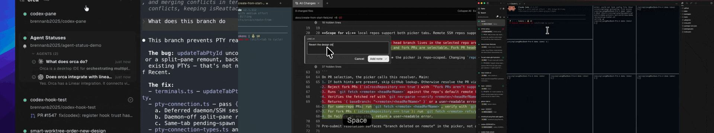
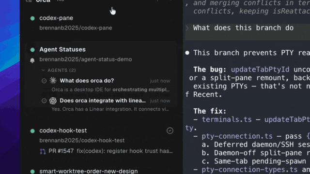
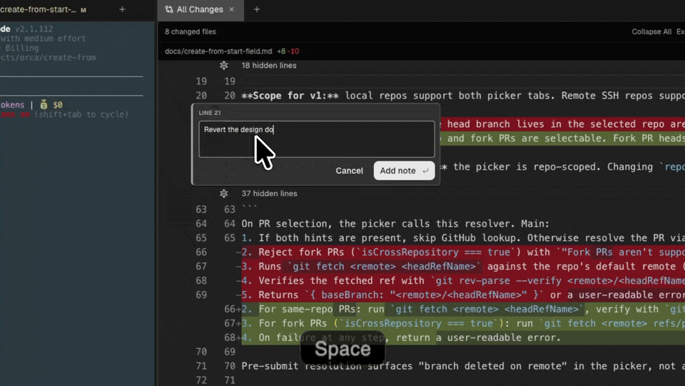
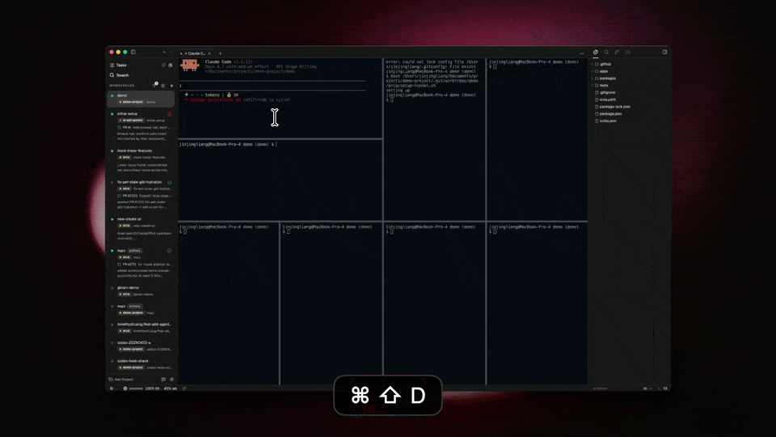

# Orca 工作台证据卡 v0.1

> 状态：研究候选，不是第 7 个参考项目的选型结论；未制作原型，未修改生产 UI。

## 1. 本轮只回答什么

本轮不研究 Orca 的全部功能，只回答 3 个工作台问题：

1. 多个任务 / Agent 的状态怎样集中呈现；
2. 运行中的终端、文件、diff 等工作对象怎样在一个工作面组合；
3. 人怎样在中间产物上留下具体意见，并把意见交回某个 Agent。

## 2. 证据固定点

- 官方仓库：[stablyai/orca](https://github.com/stablyai/orca)
- 本地只读源码：`/Users/xulater/Code/opc-os/orca`
- 固定 commit：`23cbe6dfe24269e380e57ad381e5a4ae23ede48a`
- 官方文档：
  - [Worktrees](https://www.onorca.dev/docs/model/worktrees)
  - [Tabs, panes & split layouts](https://www.onorca.dev/docs/model/tabs-panes-splits)
  - [Agents & sessions](https://www.onorca.dev/docs/model/agents-sessions)
  - [Annotate AI Diff](https://www.onorca.dev/docs/review/annotate-ai-diff)
  - [Agent hibernation](https://www.onorca.dev/docs/agents/hibernation)
- 视觉证据：官方仓库中的产品 GIF/JPG，逐帧抽取后人工检查；详见
  [evidence/orca-v0.1/README.md](evidence/orca-v0.1/README.md)。

官方 README 把 Orca 定义为面向并行 coding agents 的 ADE；本轮采用的产品事实均由当前官方文档或固定源码交叉核对，不以 README 宣传文案单独定论。

## 3. 同尺度视觉证据

从左到右：Agent 状态与任务条目、AI diff 行级批注、终端分屏工作面。三张均按 `640 × 360` 放入对照条；第三张只做界面窗口裁切，未改变产品内容。



### 3.1 Agent 状态嵌在工作条目里



画面可直接确认：

- 左侧是多个 worktree / 任务条目；`Agent Statuses` 条目内展开 `AGENTS (2)`；
- 每个 Agent 行有任务摘要、状态符号、最近活动时间和一行预览；
- 右侧同时保留当前工作输出，因此“找到需要关注的 Agent”和“查看它正在做什么”不必跳到另一套产品。

画面不能单独确认 Plan、暂停 / 恢复、失败恢复、权限边界或 Agent—Agent 调度。

### 3.2 人工意见直接锚定 Artifact



画面可直接确认：

- 主体是 `All Changes` diff，而不是聊天消息；
- 人在 `LINE 21` 打开批注框，输入具体修改意见；
- 批注粒度是 diff 行 / 行段，避免在聊天里重新描述文件和位置。

官方文档和源码进一步确认：保存批注与“发送给 Agent”是两个步骤。用户可先在多行留下意见，再由 `Send to agent` 汇成一个带行锚点的 prompt，从当前 worktree 的可用 Agent 中选择接收者，或新开 Agent；批注在 Agent 修订后仍保留，可 Resolve 或加入下一批复审。

### 3.3 工作面是可嵌套的 pane tree



画面可直接确认：

- 左侧任务 / worktree 导航、中央 8 个可见终端 pane、右侧文件树同屏存在；
- pane 尺寸和嵌套关系并不均匀，不是简单固定的 `2 × 4` 仪表盘；
- 多终端不等于多 Agent：普通 shell 没有 Agent 身份或状态标识。

官方文档进一步确认：任意 tab 可承载 terminal、editor、browser、diff 或 PR；不同类型能在同一个 pane tree 中嵌套分屏。边界位置和整棵布局按 worktree 保存，切换 worktree 时整套工作面一起切换和恢复。

## 4. Orca 的工作台设计思路

### 4.1 主对象不是 Chat，而是“任务隔离工作空间”

Orca 的层级是：

```text
Project / repo group
└── Worktree / task workspace
    ├── Agent sessions
    ├── Terminal / editor / browser / diff / PR tabs
    ├── Nested pane layout
    └── Review / ship lifecycle
```

官方文档给出的 worktree 生命周期是 `Create → Work → Review → Ship → Archive/Delete`。每个 worktree 有独立分支、文件和 Agent terminal；创建在后台进行，侧栏和 tab 显示进度，允许切走、取消，失败后 Retry。

这说明 Orca 的“连续性”主要由 task/worktree 持有，而不是由一条聊天记录持有。Chat 可以是一个 pane，但不是工作台的唯一中心。

### 4.2 Agent 是工作空间里的可观察运行者

官方产品模型把一个 Agent session 定义为“一个 worktree 中、一个 terminal 里的一个 CLI Agent”。状态语法是：

| 状态 | 视觉语法 | 用户含义 |
| --- | --- | --- |
| Working | spinner | 正在运行 |
| Needs You | amber `?` | 等待权限或输入 |
| Done / quiet active | emerald check / dot | 已完成或安静运行 |
| Blocked / interrupted / failed | red dot | 需要处理 |
| Idle | gray dot | 空闲 |
| Plain shell | 无状态符号 | 不是已识别 Agent |

状态既出现在 worktree 行，也可进入跨 worktree 的 Agent Dashboard / Map。源码还支持把已知子 Agent 展开为父 Agent 的子行，并从状态行直接聚焦对应 terminal pane。

### 4.3 Artifact 反馈是“先批注、后成批发送”

这是 Orca 最有辨识度的交互语法：

```text
Agent 修改文件
→ 人在 diff 精确行上留下多条 review notes
→ notes 保留行锚点并组成一批
→ 人选择当前 worktree 的某个可用 Agent，或新开 Agent
→ Agent 修订
→ 原批注仍在，供复核 / Resolve / 再发送
```

它把“对中间产物评论”与“给 Agent 发下一轮自然语言”连接起来，但没有把 Artifact 退化成聊天附件。

### 4.4 长任务能力分成 3 层

1. **任务空间层**：worktree 创建有后台进度、取消、失败和 Retry；
2. **Agent 进程层**：Launch → Work → Idle → Exit，退出后出现 Restart chip；
3. **资源回收层**：实验性 hibernation 只在 Agent done、无人操作、无未决 dispatch、无活跃子 Agent 等条件同时成立时暂停；重新打开 worktree 时按 provider session 自动恢复，恢复失败则进入新 prompt，旧 transcript 仍可查看。

这不是一个统一的 `Run` 状态机。对 Chat 来说，应借鉴它的可见边界，但不能把 worktree、terminal process、Agent session 和产品 Run 合并。

## 5. 源码归属核验

| 可见区域 / 行为 | 固定源码 owner | 核验结论 |
| --- | --- | --- |
| worktree 内嵌 Agent 行、子 Agent 层级、点击聚焦 | `src/renderer/src/components/sidebar/WorktreeCardAgents.tsx` | Agent 行是 worktree card 的一部分；支持 parent/child 与定位到具体 pane |
| diff 行级输入框 | `src/renderer/src/components/diff-comments/DiffCommentPopover.tsx` | `Line N` / `Lines N-M`、Cancel、Add note、Enter/Esc 语义明确 |
| review notes 选择接收者 | `src/renderer/src/components/editor/ReviewNotesSendMenuContent.tsx` | 可以选择 worktree 中任一可用运行 Agent，或启动新 Agent |
| notes 发送与错误边界 | `src/renderer/src/lib/active-agent-note-send.ts` | 发送前检查 Agent readiness；显式区分 permission、not-ready、no-agent、not-writable 等结果 |
| terminal 分屏入口 | `src/renderer/src/components/tab-bar/TerminalTabSplitMenuSection.tsx` | 明确提供向右 / 向下分屏 |
| 视觉原则 | `docs/STYLEGUIDE.md` | “monochrome and quiet”；中性色承载 chrome，颜色只用于状态、危险和 git decoration |

源码只用于确认可见 UI 的归属和边界，不替代真实画面，也不作为 Chat 产品对象设计的依据。

## 6. Take / Adapt / Refuse

### Take

- **worktree / task 行内状态**：用户不用进入每个会话就能发现 `Working / Needs You / Done / Failed`；
- **Agent 行与真实工作面互相定位**：状态不是孤立 feed，点击可回到具体运行 pane；
- **异构 pane tree**：Chat、浏览器、文件、diff、白板等应能在同一工作面并排，而不是每种对象单独造一个固定页面；
- **Artifact 锚定反馈**：评论先绑定具体产物位置，再批量交回指定 Agent；
- **未识别 shell 不冒充 Agent**：Participant / Agent 身份必须由真实运行证据支持。

### Adapt

- 把 Git worktree 抽象为 Chat 的 `Work / Scope / Run workspace`，保留任务隔离和布局恢复，不复制 coding 专用对象；
- 把 `terminal pane` 扩展为 Chat 可识别的 Chat、Artifact、Browser、File、Whiteboard、Calendar、Task Board、Evidence pane；
- 把 diff 批注推广为任意 Artifact 的 block / range / cell / object 批注；
- 把 Agent 状态点与可读的阶段、当前动作、等待原因、最近证据组合，避免只靠颜色；
- 把自动 hibernation 适配为 Chat 自己的耐久 Run / Checkpoint 语义，而不是直接停止外部进程。

### Refuse

- 不接受“worktree 就是权限沙箱，因此 Agent 默认全自治”的安全模型。Orca 当前会给受支持 Agent 预置 full-autonomy 启动参数；Chat 必须显式展示权限、可见范围和写回范围；
- 不把 terminal 当成 Agent，不把 CLI 进程状态当成产品 Run 终态；
- 不照搬 coding-only 的 Project → repo → branch 词汇；
- 不把实验性自动休眠当成可靠暂停 / 恢复证明；
- 不用宣传合成图证明完整交互路径。

## 7. 与已打样工作台的差异

| 参考 | 主要所有者 | 工作面语法 | 人工介入 | 最有价值的缺口覆盖 |
| --- | --- | --- | --- | --- |
| AnythingLLM | conversation / workspace | Chat 为主，工具和结果围绕会话展开 | 继续对话、配置 Agent / 工具 | 基础对话型 Agent 工作区 |
| Open Computer（AnythingLLM 内） | task workspace | 运行过程与文件 / 结果面更突出 | 观察、停止、取回产物 | 单 Agent 的电脑式执行工作面 |
| Orca | task/worktree | 左侧任务与 Agent 状态 + 中央异构 pane tree + 文件 / diff | 聚焦 Agent、行级批注、批量发回指定 Agent | 多 Agent 监督、Artifact 评审回路、可恢复工作面布局 |

因此 Orca 不是“传统 Chat 再加一个右侧预览”。它把任务隔离空间设为骨架，Chat / terminal 只是其中一种运行表面；这正是它与 AnythingLLM 的结构性差异。

## 8. 对 Chat 的初步意义与仍缺的证据

Orca 值得保留在“有差异的工作台”集合中，最适合回答：

- 多 Agent 怎样进入同一任务工作空间；
- 侧栏状态怎样与具体运行 pane 对应；
- 文件 / diff / browser / terminal 怎样组合；
- 人怎样在 Artifact 上批注并把一批意见交给指定 Agent；
- 工作空间布局怎样随任务恢复。

它仍不能独自回答：

- 自然语言目标怎样变成可编辑 Plan；
- Plan 假设、范围、资料和权限怎样共同确认；
- 非 coding 场景的 Evidence、Calendar、Todo、Whiteboard 与 Run 怎样闭环；
- Agent—Agent 协作中的 participant、visibility 和决策责任怎样表达；
- 产品级暂停 / 恢复 / 结果未知 / 外部副作用对账怎样呈现。

所以本轮结论是：**Orca 是差异明显的“任务隔离 + 多 Agent + Artifact Review”工作台参考，但不能单独代表完整的人—Agent 对话闭环。** 这仍是候选研究结论，不越过第 7 个参考项目的用户选择门。

## 9. Pi 审读记录

- 模型：`dashscope-coding/qwen3.7-plus`
- 方式：3 个独立只读 Attempt，每个只读取 1 张图片；无工具次数、Token 或时间硬上限；Codex 逐阶段审阅
- 成功 Attempt：3 次；工具调用：3 次；合计 Token：13,570；模型切换：0
- 运行时长：47 s、40 s、33 s
- 纠正：3 处视觉过推断（把 worktree 行称为项目 / 仓库、把 diff 称为未提交、把非均匀 pane tree 称为 `2 × 4` 等）已写回 Dialogue
- 事件：1 次 pre-dispatch 临时目录错误，`promptDispatched=false`、0 Token；重建目录后安全恢复，未重复发送未知结果
- 验证：3 个成功 Attempt 的 source/worktree 均无改动
