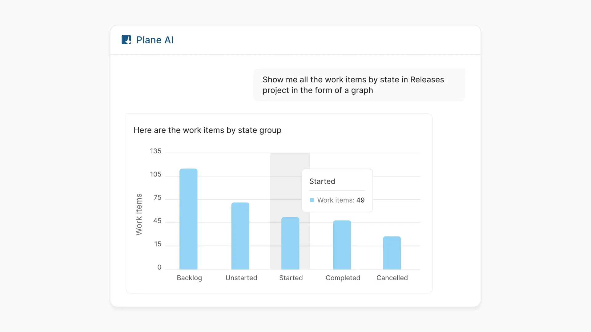
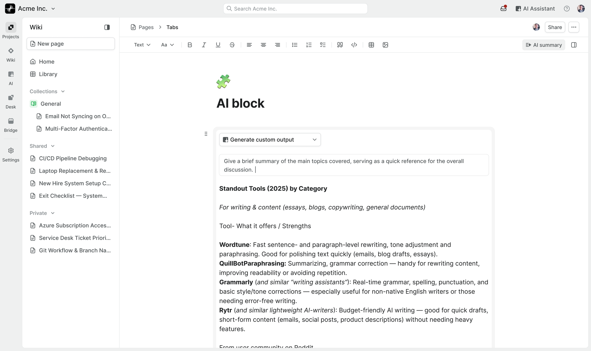
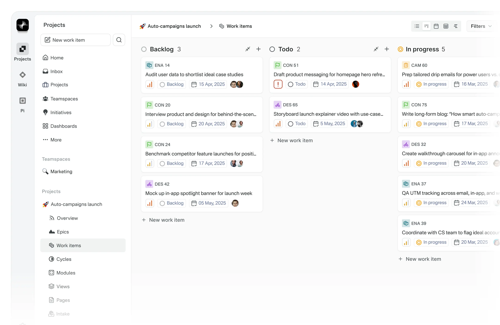
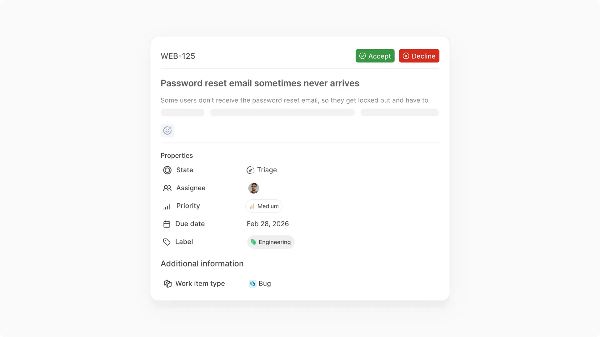

# Plane 工作台证据卡 v0.1

> 状态：工作台差异研究候选，不是第 7 个参考项目选型结论。  
> 日期：2026-08-12。  
> 范围：Project / Work item / Page / Intake 与 AI 入口的布局、对象归属和人工边界。  
> 禁止：不制作原型、不修改 Chat UI、不登记为 frozen reference。

## 1. 一句话结论

Plane 的辨识度不在“也有一个 AI Chat”，而在于：**长期存在的 Project、Work item 和 Page 拥有页面中心，AI 进入这些工作对象所在的表面，人工决定则由 Intake 这类独立队列承接。**

它可以为 Chat 补充 `work-object-owned shell`，但不能单独回答 Plan、Run、工具调用、长任务恢复或多 Agent 监督。

## 2. 证据固定点

- 官方开源产品页：[Plane Community Edition](https://plane.so/open-source)
- 官方仓库：[makeplane/plane](https://github.com/makeplane/plane)
- 本地只读源码：`/Users/xulater/Code/opc-os/plane`
- 固定 commit：`1c8a60f858d8472aa56e29994ec1c7926da2c6ce`
- 视觉证据、原图链接、尺寸和哈希：
  [evidence/plane-v0.1/README.md](evidence/plane-v0.1/README.md)

Plane 官方将当前产品描述为 Projects、Wiki 和 AI 共处一个 Workspace；Community Edition 使用 AGPL-3.0，并包含 Project、Work item、Cycle、Module、Page、五种布局、Intake、Dashboard、API 和 Webhook。以上只能说明产品范围；具体交互结论仍以本卡的画面与固定源码为准。

## 3. 四张关键画面

### 3.1 对话请求与数据 Artifact 共存



画面能直接确认：用户请求气泡、AI 文字响应和柱状图处于同一响应面；图表内已经显示 Tooltip 状态。

画面不能确认：输入入口、数据来源、检索过程、Plan、工具调用、点击跳转、继续追问、失败或恢复。Tooltip 只支持“可能存在悬停交互”的推断，不足以证明完整交互。

### 3.2 AI 进入 Wiki / Page 编辑表面



画面能直接确认：

- 产品级 Rail、Wiki 侧栏和 Page 编辑区形成三层结构；
- 全局 `AI Assistant`、工具栏 `AI summary`、正文 `AI Block` 三个 AI 入口同屏；
- AI Block 内的提示字段和已有输出与 Page 内容共处编辑表面。

官方 Changelog 进一步说明 AI Block 生成的内容会成为可继续编辑的 Page block。当前公开源码没有出现与 2026 画面等价的独立 AI Block，因此这条能力是**官方视觉与文档事实**，不是开源实现事实。

### 3.3 Project / Work item 拥有主工作面



可见结构：

```text
产品级 App rail
→ Workspace / Teamspace / Project 侧栏
→ Project 内导航
→ 当前 Work items 主工作面
→ 布局切换 / 筛选
→ 按状态分组的 Work item 卡片
```

截图中的按钮与 `+ New work item` 只能证明动作入口存在，不能证明点击、拖拽、状态切换或数据保持已经发生。

### 3.4 Intake 把人工决定放在对象进入下一阶段之前



画面能直接确认：候选 Work item 处于 `Triage`，在 `Accept / Decline` 之前展示编号、标题、部分描述、负责人头像、优先级、日期、Label 和 Work item type。

画面不能确认：候选来源、是否由 AI 生成、Accept 后精确写入范围、Decline 后去向、失败处理或撤销。

## 4. Plane 的工作台设计思路

### 4.1 主对象是长期工作事实，不是 Chat 或 Run

Plane 的中心对象是 Project 里的 Work item、Page、Cycle、Module、View 和 Intake。AI 的价值是查询、生成或修改这些对象，而不是用一条 Agent 会话替代它们。

这意味着用户离开一次 AI 对话后，工作仍由 Project 和对象状态保持，而不是依赖聊天历史恢复。

### 4.2 导航层级与工作范围相互对应

官方 2026 画面确认三层空间结构；固定公开源码只确认其中的 Rail 容器、Projects 侧栏和 Project 内基础导航，不能证明画面中的 Wiki / AI / Desk / Bridge 全部来自同一开源实现：

| 层级 | 源码 owner | 责任 |
| --- | --- | --- |
| 产品级 Rail 容器 | `apps/web/core/components/navigation/app-rail-root.tsx` / `AppRailRoot` | icon-only / icon-with-label；Dock / Undock；条目由 HOC 注入 |
| Workspace / Project 侧栏 | `apps/web/app/(all)/[workspaceSlug]/(projects)/_sidebar.tsx` / `ProjectAppSidebar` | 可伸缩、折叠、Peek 的范围导航 |
| Project 内导航 | `apps/web/core/components/workspace/sidebar/project-navigation.tsx` / `ProjectNavigation` | Work items、Cycles、Modules、Views、Pages、Intake；权限与 feature flag 决定可见性 |

当前固定公开源码的 `app-rail-hoc.tsx` 只直接注入 `Projects`；画面里的 Wiki、AI、Desk、Bridge 可能来自未公开扩展或不同版本，不能写成开源等价实现。可以采用的是“多级范围导航”的交互语法，而不是这些具体产品入口。

### 4.3 同一 Work item 集合可以换表达方式

`apps/web/core/components/issues/filters.tsx` 的 `HeaderFilters` 和
`apps/web/core/components/issues/issue-layouts/roots/project-layout-root.tsx` 的 `ProjectIssueLayout` 共同确认 5 种布局：

```text
List / Kanban / Calendar / Spreadsheet / Gantt
```

布局切换更新同一组 display filters；主区域根据 active layout 分发到对应视图，并保留筛选行、保存 View 和详情 Peek。这支持“对象身份不变，表达方式可换”的设计，而不是为 Calendar、Board 和 Table 分别建立互不相认的产品事实。

### 4.4 AI 有 3 种可能的作用域，但公开证据不完整

2026 官方画面显示：

1. 全局级：`AI Assistant`；
2. 页面工具级：`AI summary`；
3. 内容块级：`AI Block`。

公开源码只直接确认邻近的 Page 编辑器 AI：

- `editor-body.tsx` 把 `EditorAIMenu` 注入编辑器；
- `ai/menu.tsx` 和 `ask-pi-menu.tsx` 允许对选中文本提问、生成、Replace、插入下一行和重新生成；
- 当前读取到的路径通过 `editorRef.insertText()` 写入编辑器。

因此不能把开源 `EditorAIMenu / Ask Pi` 说成 2026 Cloud 的全局 Assistant、AI summary 或独立 AI Block，也不能由这一条路径推断 Plane 的全部 AI 写回都没有审核。

### 4.5 Intake 是明确的人工队列，但不是 Agent HITL 的完整证明

源码 owner：

- `apps/web/core/components/inbox/content/inbox-issue-header.tsx` / `InboxIssueActionsHeader`
- `apps/web/core/components/inbox/modals/decline-issue-modal.tsx` / `DeclineIssueModal`

源码确认：

- Accept / Decline 只在 pending 或 snoozed 状态提供；
- 可见入口受 Project Member/Admin 权限控制，真正打开动作还会检查 Admin 权限；
- Accept 先打开 `CreateUpdateIssueModal`，允许在加入 Project 前编辑；
- Decline 先打开确认框，并明确提示不可撤销；
- 完成后导航到下一候选或返回列表；另有 Snooze、Duplicate 和 Delete 边界。

这条语法适合迁移为 Agent 候选结果的审核队列，但 Plane 当前证据没有证明候选来自 Agent，也没有展示版本绑定、决定 Hash、结果未知或恢复。

## 5. Take / Adapt / Refuse

### Take

1. 让 Project / Work / Artifact 等长期对象拥有中心，不让所有工作退化为聊天消息。
2. 用产品级、范围级、对象级三层导航表达“我正在什么范围工作”。
3. 同一对象集合可切换 Board、Calendar、List、Table 等布局，身份与筛选保持连续。
4. 用独立 Intake 队列集中处理需要人决定的候选对象；决定前先展示关键属性。

### Adapt

1. 把 Plane 的 Intake 扩展为 Chat 的通用 Review Queue：可接受、拒绝、修订、评论、稍后处理，并绑定候选版本与 Agent Run。
2. 把多级 AI 入口收敛为明确作用域：全局 Agent、当前工作区 Agent、当前 Artifact 操作，界面要直接显示读取和写回范围。
3. 把普通 Page 版本与同步状态连接到 AI 写回：显示 AI 修改 Diff、来源、候选状态、用户接受和恢复点。
4. 把五种布局用于同一 Product Store 查询，不复制五套任务事实。

### Refuse

1. 不把 `Accept / Decline` 两个按钮本身当成完整 HITL 状态机。
2. 不把普通 Project 状态列当成 Agent Run 的进度、等待或失败事实。
3. 不因产品“开源”就假设当前 Cloud AI 表面也已有等价公开源码。
4. 不复制三层侧栏的固定宽度；保留其范围语义，再根据 Chat 的桌面和移动模式适配。

## 6. 与现有工作台样本的差异

| 参考 | 页面中心由谁拥有 | 连续性由谁保持 | 人工介入 | Plane 的新增价值 |
| --- | --- | --- | --- | --- |
| AnythingLLM | Conversation | Workspace / Thread | 回复、继续追问、查看 Sources | — |
| Open Computer | Desktop / Workspace | Run sidecar + 桌面现场 | 追问、Abort、取走 Deliverable | — |
| Orca | Task / Worktree | Worktree + pane tree + Agent sessions | 聚焦 Agent、Diff 批注、批量发回 | — |
| Plane | Project / Work item / Page | 长期工作对象及其状态 | 编辑对象、Intake Accept/Decline | **把 AI 嵌入长期 Project 事实，而不是让 Agent 会话拥有一切** |

## 7. 当前仍缺的证据

Plane 不能单独覆盖：

1. 自然语言目标如何形成可编辑 Plan；
2. Agent 工具调用、子任务、等待、失败和结果未知；
3. 长任务暂停、恢复和取消；
4. Artifact Diff、逐项评论和版本绑定的接受/拒绝；
5. Evidence / 来源与 Project 写回的连续性；
6. 多 Agent participant、visibility 和 Agent—Agent 协作。

因此 Plane 值得保留为“Project / Work-object-owned 工作台”样本，但不适合单独成为完整人—Agent 闭环的唯一参考。

## 8. Pi 审读记录

- Mission：`fe7945b3-d2d3-4ea5-9889-f1b87d0474c6`
- 模型：`dashscope-coding/qwen3.7-plus`，模型切换 0 次
- 方式：4 个单图 Attempt + 1 个固定源码 Attempt，均为 `discovery`
- 视觉阶段：4 次成功，12 次工具调用，63,599 Token；Trace 分别确认 `image/webp`、`image/png`、`image/webp`、`image/webp`
- 源码阶段：1 次成功，24 次工具调用，205,377 Token，其中 163,200 为 cache read
- 总计：5 次成功 Attempt，36 次工具调用，268,976 Token，约 359 秒；0 tool error、0 repeated signal、0 model switch
- 验证：Chat 受管 worktree 和 Plane 源码受管 worktree 均无改动
- Codex 纠正：可见状态不等于已发生动作；Tooltip 不等于已验证交互；入口不等于完整链路；Intake 不等于 Agent HITL；A4 验收含义未被 Cloud feature checklist 替代

本轮没有因为耗时达到某个阈值而停止 Pi；每次观察都以进程健康、事件前进、工具结果和错误信号为依据。

## 9. 当前停点

Plane 的视觉与源码证据卡已经完成。没有制作原型，没有修改生产 UI，也没有把 Plane 登记为第 7 个 frozen reference。
