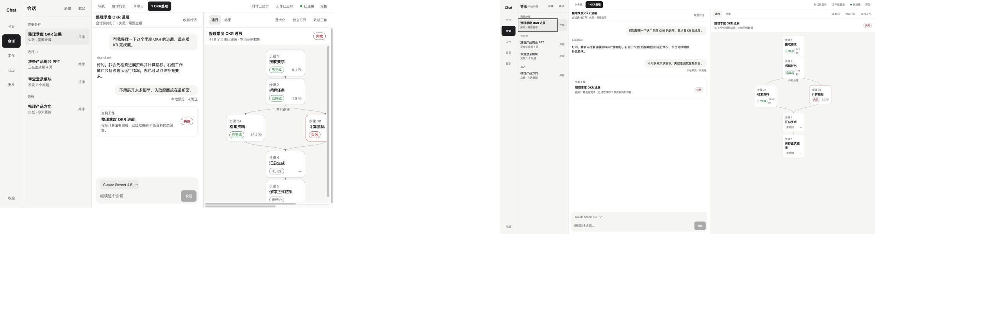
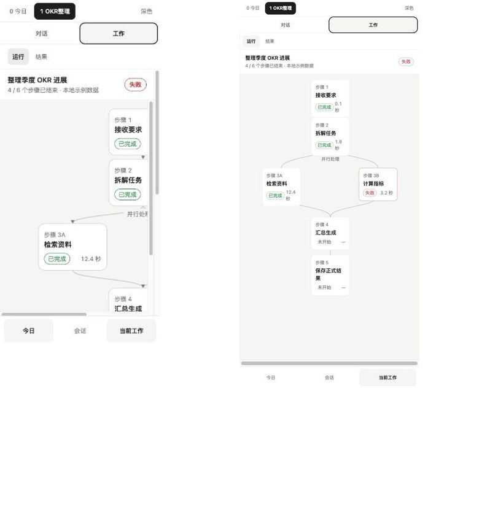

# Chat 参考与反参考板 v0.1

> 这不是 Pinterest 情绪板。每个参考都必须回答 5 个问题：它解决什么、我们取什么、我们拒绝什么、映射到 Chat 哪里、证据来自哪里。

外部材料只提供对应官方站点的站外链接，不在文档中内嵌或复制第三方素材。访问日期为 2026-08-08；页面变化时，以“来源”链接为准。

## 0. 当前 Chat 基线（own-work）

### 桌面：对话与工作并置

### 移动：对话与当前工作切换

### 基线判断

**保留**

1. 黑白中性骨架和浅/深主题基础。
2. 对话与工作并置的产品方向，而不是把 Agent 藏在单一输入框里。
3. 移动端用顺序与切换承载空间，不把桌面三栏强行缩小。
4. 真实 Plan/Run/Step 状态已经优先于营销性 AI 表达。

**需要突破**

1. 页面仍容易落入“左栏 + 卡片 + 右侧流程图”的通用生产力模板。
2. 同一 Work 在会话、流程图和结果区的对象连续性还不够强。
3. Agent 目前更多是文本发送者，尚未形成可辨的身份、职责与交接行为。
4. 完成反馈可靠但缺少一个克制、可记住的产品动作。

## 1. 五个设计锚点

锚点不是要模仿的产品，而是下一轮 UI Interaction Lab 必须共同回答的设计问题。

| 锚点 | 参考组合 | Chat 要抽取的语法 | 明确不取 |
|---|---|---|---|
| A. Project 是一个房间 | Basecamp | 一个稳定地点容纳目标、讨论、工作、日程与产物 | 六宫格模块首页、每种对象都变卡片 |
| B. 工作在空间间不断线 | Linear Peek + Project Updates | 原位查看、稳定对象身份、结构化进展叙事 | 复制 Linear 的密度、灰阶和快捷键文化 |
| C. Today 是一天的节奏 | Things + HEY Calendar | 今天/今晚、时间边界、需要介入优先 | 把所有项目统计塞成仪表盘 |
| D. 个性来自一个机制 | Kinopio + Playdate | 局部可触摸、直接操纵、单一记忆点 | 全屏霓虹画布、处处游戏化 |
| E. AI 必须显露责任边界 | Carbon AI label + Microsoft Agent Feed + Are.na | 来源、角色、需要介入、关系而非热度 | AI 发光皮肤、点赞/热门驱动的 Agent 社交 |

票据、接力结、落印是 `Chat original hypothesis`，不是任何参考项目已证明的答案。参考只能帮助我们判断取舍；它们是否构成 Chat 的独特语言，必须由下一轮可操作的 HTML 场景证明。

## 2. 正向参考：结构与连续性

### R01 · Linear Peek — 不离开列表就预览

- **视觉证据**：[Linear 官方示例图（站外）](https://webassets.linear.app/images/ornj730p/production/5205025fbe6e96bf749f76d5e1cad30b484f8b50-1052x634.png?w=1440&q=95&dpr=2)。

- **解决**：在列表或项目上下文中查看对象细节，同时知道自己从哪里来。
- **Take**：官方可证明的模式是用 `Space` 原位预览、`Esc` 关闭，并在相邻对象间移动。Chat 额外要求鼠标/触控等价入口、关闭后焦点归还、深链接和对象身份连续。
- **Refuse**：把所有详情都塞进侧边抽屉；为高级用户快捷键牺牲新用户可见性；照搬 Linear 的紧密灰阶。
- **映射**：Conversation → Work、Pulse → Project Update、Today → Decision 的快速查看。
- **深审计**：[Linear Peek + Project Updates 交互审计 v0.1](./linear-interaction-audit-v0.1.md)。
- **来源**：[Linear Peek 官方文档](https://linear.app/docs/peek)，`external-reference / link-only`。

### R02 · Linear Project Updates — 项目变化是一段有结构的叙事

- **视觉证据**：[Linear 官方示例图（站外）](https://webassets.linear.app/images/ornj730p/production/3a1609dc34b766530571d44ac4a2da30f825ae4d-3598x2700.png?w=1200&q=90)。

- **解决**：让协作者不用重读全部活动，也能知道项目健康度、变化和下一步。
- **Take**：更新与具体 Project 绑定；正文、health、作者、时间和历史并列；允许定期节奏但不强迫。Chat 额外增加输入来源与证据追踪。
- **Refuse**：只用红黄绿表达健康；把系统自动摘要包装成人类承诺；默认复制周报仪式。
- **映射**：Project 首页、Pulse、Agent 项目动态、阶段切换记录。
- **深审计**：[Linear Peek + Project Updates 交互审计 v0.1](./linear-interaction-audit-v0.1.md)。
- **来源**：[Linear Initiative and Project Updates](https://linear.app/docs/initiative-and-project-updates)，`external-reference / link-only`。

### R03 · Basecamp Home / Project Page — Project 是房间，不是筛选条件

- **视觉证据**：[Basecamp 5 Home 官方帮助](https://5.basecamp-help.com/article/1159-the-home-screen)、[Basecamp 首页交互演示](https://basecamp.com/)、[Basecamp 官方示例图（站外）](https://basecamp.com/assets/images/screenshots/project-page.webp)。

- **解决**：用 Account Home、个人聚合、Project Room、Tool View 和 Item Detail 分开“去哪里”“我的责任”“在哪里协作”和“处理哪件事”；Activity 只做可下钻的跨项目投影。
- **Take**：稳定作用域、Project 作为长期地点、个人 Home 整理不改变团队事实、Activity 深链到底层对象、`Project room → tool view → item detail → back` 的连续路径。
- **Adapt**：`New for you` 转为 Chat 的“需要我处理”，只收决定、阻塞、外部副作用确认和定向交付；Jump 扩展到 Project、Agent、Work、Artifact 与 Conversation。
- **Refuse**：等权六宫格、每个模块一张大卡、用星标/颜色替代事实状态、把 Basecamp 的品牌语气和图形直接带入 Chat。
- **映射**：Account Home、个人事务中心、Project Room、Agent Pulse、Project → Workbench / Conversation / Artifact 的进入与返回路径。
- **深审计**：[Basecamp Home 交互审计 v0.1](./basecamp-interaction-audit-v0.1.md)。
- **来源**：[Basecamp 5 Home Help](https://5.basecamp-help.com/article/1159-the-home-screen)、[Basecamp Home](https://basecamp.com/)、[Basecamp Features](https://basecamp.com/features)，`external-reference / link-only`。

### R04 · Basecamp Hill Charts — 进展不是虚构百分比

- **视觉证据**：[Basecamp 官方图示（站外）](https://basecamp.com/assets/images/hill-charts/uncovering-unknowns-simple.png)。

- **解决**：普通百分比无法区分“还在搞清问题”和“已经知道怎么做”。
- **Take**：把不确定性作为可讨论的阶段；更新是有作者、有时间的判断；让阻塞有位置而非只有红色。
- **Refuse**：复制 Basecamp 专属的 Hill Chart 名称、山形曲线和拖点方式；所有 Work 都强制画山；把主观位置当精密度量；用彩点替代文字和证据。
- **映射**：Project Update、复杂 Work 的阶段叙事、Agent 对风险的可解释报告。
- **来源**：[Basecamp Hill Charts](https://basecamp.com/hill-charts)，`external-reference / link-only`。

### R05 · Arc Spaces — 上下文边界是可切换的空间

- **解决**：同一套工具服务多个生活/项目语境时，如何减少混杂和切换成本。
- **Take**：Space 有名称、边界和稳定入口；切换后保留各自上下文；返回路径可预测。
- **Refuse**：照搬浏览器侧栏；用大面积渐变主题区别项目；让同一 Work 因换空间而改变身份。
- **映射**：Project 切换、个人事务/项目事务边界、不同 Agent 责任域。
- **来源**：[Arc Spaces 官方帮助](https://resources.arc.net/hc/en-us/articles/19228064149143-Spaces-Distinct-Browsing-Areas)，`external-reference / link-only`。

### R06 · Heptabase UI Logic — 同一对象可以有多种视图

- **解决**：卡片、白板、列表、标签和详情如何保持同一个知识对象，而不是产生副本。
- **Take**：对象身份稳定；地图只是视图之一；连接、移动和展开直接作用于同一对象。
- **Refuse**：无限画布成为所有任务的默认入口；用户必须先建立复杂分类体系；把“空间感”等同于四处拖卡。
- **映射**：Workbench 白板、Project 文档、Work/Artifact 在列表与画布之间切换。
- **深审计**：[Heptabase Workbench 交互审计 v0.1](./heptabase-interaction-audit-v0.1.md)。
- **来源**：[Heptabase User Interface Logic](https://wiki.heptabase.com/user-interface-logic)，`external-reference / link-only`。

### R07 · Craft Documents — 内容块可以组合成独立文档

- **视觉证据**：[Craft 官方示例图（站外）](https://mintcdn.com/craft-support/4lRkwRvDwE7Wr43k/images/introduction/documents/en/content/blocks-diagram.png?w=1100&fit=max&auto=format&n=4lRkwRvDwE7Wr43k&q=85&s=711fd77fe76b122b05d7eb252178445b)。

- **解决**：小块内容怎样组合、移动和重用，并最终成为可阅读的文档。
- **Take**：官方可证明 Blocks、Pages、Documents 的组合、嵌套、移动和链接保留。Execution Candidate 如何晋升为正式 Artifact，是 Chat 自己的领域规则。
- **Refuse**：给每个 block 加装饰；把 page/card/emoji/封面图当作默认个性；用漂亮排版掩盖候选状态。
- **映射**：Execution Candidate → Artifact、Project 文档清单、白板到正式文档。
- **来源**：[Craft Documents](https://support.craft.do/en/introduction/documents)，`external-reference / link-only`。

### R08 · Raycast Action Panel — 高级动作集中，但不制造按钮森林

- **解决**：同一对象动作很多时，如何同时服务键盘高手与普通用户。
- **Take**：动作有主次顺序、分组和可见快捷键；完整产品还支持搜索动作。Chat 仍让当前主动作直接可见。
- **Refuse**：所有动作都隐藏在命令面板；高影响动作只靠快捷键触发；无解释地追求“快”。
- **映射**：Work/Artifact/Agent 的次级动作、全局跳转、批量整理。
- **来源**：[Raycast Action Panel Manual](https://manual.raycast.com/action-panel)、[API Reference](https://developers.raycast.com/api-reference/user-interface/action-panel)，`external-reference / link-only`。

## 3. 正向参考：节奏、个性与关系

### R09 · Things Today — 今天是一条可完成的叙事

- **视觉证据**：[Things Today 当前官方帮助截图（站外）](https://culturedcode.com/frozen/2025/10/dates-today.jpg)、[Things Today / This Evening 官方示例（站外）](https://static.culturedcode.com/things/videos/2017-05-18-website-videos/2-today-mac.png)。

- **解决**：让 `Area / Project` 的长期语境与 `Today / Upcoming / Anytime / Someday` 的注意力范围正交；从所有可能事项中形成今天可理解、可调整的有限承诺。
- **Take**：Calendar → daytime → This Evening 的垂直节奏；来源副标题；Start date 与 Deadline 分责；Today 是同一对象的个人投影，不改变 Project 归属。
- **Adapt**：Today 可投影 Task、Decision、Run、Blocker 与 Calendar constraint，但保留对象类型、权威状态和不同主动作；改期只改变个人注意力日期。
- **Refuse**：把所有工作都简化成勾选框；复制黄色星标和蓝色 Plus；把人工排序当团队优先级；用极简视觉隐藏 blocked / failed / outcome_unknown。
- **映射**：个人事务中心、Today、需要用户介入、运行看护与日历约束。
- **深审计**：[Things Today 交互审计 v0.1](./things-today-interaction-audit-v0.1.md)。
- **来源**：[Things Today 官方指南](https://culturedcode.com/things/support/articles/4001304/)，`external-reference / link-only`。

### R10 · HEY Calendar — 时间可以像一条连续的河

- **视觉证据**：[HEY 官方 Day View 截图（站外）](https://d33v4339jhl8k0.cloudfront.net/docs/assets/59de6bbc2c7d3a40f0ed605f/images/695ff7e1813e0c002a12d6ec/file-Hqmej4LkxE.png)。

- **解决**：把一天呈现为连续可读的时间线，而不是 24 个等权方格。
- **Take**：官方文本支持连续 Day 叙事；从官方截图可观察白天/夜晚边界和事件块长度。Chat 让事件、需要介入和运行窗口在同一叙事中相遇。
- **Refuse**：桌面横向时间轴原样搬到手机；用 emoji 代替事件语义；让视觉趣味降低扫描效率。
- **映射**：Today 日历、Agent 计划与人的时间冲突、运行窗口。
- **深审计**：[HEY Calendar 交互审计 v0.1](./hey-calendar-interaction-audit-v0.1.md)。
- **来源**：[HEY Calendar Overview](https://help.hey.com/article/800-calendar-overview)，`external-reference / link-only`。

### R11 · Kinopio — 局部不规则让空间有手感

- **视觉证据**：[Kinopio 官方示例图（站外）](https://updates.kinopio.club/pages/about/hero/1.webp)。

- **解决**：早期想法和关系还没整齐时，如何允许人直接摆放、连接和共同思考。
- **Take**：直接操纵、局部手工感、连接线有语义、协作者有在场感；允许少数对象不完全对齐。
- **Refuse**：黑色网格铺底、每张卡都高饱和彩边、所有界面都变无限画布、GIF 和贴纸成为主要信息。
- **映射**：Workbench 白板、票据落点、多人/多 Agent 探索空间。
- **来源**：[Kinopio About](https://kinopio.club/about)，`external-reference / link-only`。

### R12 · Playdate — 一个机制胜过一百个装饰

- **视觉证据**：[Playdate 官方产品图（站外）](https://static-cdn.play.date/static/images/Playdate-in-hand1.70225f47634a.png)。

- **解决**：怎样让产品在极少颜色和有限能力下仍拥有鲜明人格。
- **Take**：一个清楚、诚实、反复可用的标志性机制；有限色板；动作与物理/语义反馈一一对应。
- **Refuse**：把黄色铺满 Chat；在严肃流程里加入游戏音效、积分和奖励；为了新奇而引入无用手势。
- **映射**：票据/接力结/落印三选一成为主记忆点，而不是三者同时抢戏。
- **来源**：[Playdate 官方站](https://play.date/)，`external-reference / link-only`。

### R13 · Are.na Connections — 关系比热度重要

- **解决**：内容如何通过人的选择建立关系，而不是通过点赞和热门被动排序。
- **Take**：官方可证明没有 Like/Favorite，block 与 channel 通过人的选择建立 Connection。来源追踪、跨项目对象身份和不丢上下文是 Chat 自己的扩展要求。
- **Refuse**：过度艺术化导致动作含义隐晦；开放浏览逻辑直接进入私密项目；把所有 Agent 内容都当收藏品。
- **映射**：Pulse 动态、Agent/Project 关系、知识引用与跨项目复用。
- **来源**：[Are.na Connections 官方帮助](https://help.are.na/docs/getting-started/connections)，`external-reference / link-only`。

### R14 · Carbon AI Label — AI 身份是可展开的责任说明

- **视觉证据**：[Carbon 官方 anatomy 图（站外）](https://carbondesignsystem.com/static/1a12f5be9abcf7780a8fe9439291d0da/7fc1e/ai-label-anatomy.png)。

- **解决**：用户如何识别 AI 参与，并按需打开解释入口。
- **Take**：借 AI presence、紧邻内容的轻量标记和按需展开。Chat 额外要求说明来源、Agent 角色、限制、候选状态与反馈路径。
- **Refuse**：每个对象重复贴 AI 徽章；暴露隐藏推理；把标签当品牌装饰；用“AI 生成”替代候选/正式状态。
- **映射**：Plan Candidate、Agent Update、Artifact Candidate、AI 摘要。
- **来源**：[Carbon AI Label Usage](https://carbondesignsystem.com/components/ai-label/usage/)，`external-reference / link-only`。

### R15 · Microsoft Agent Feed — 多 Agent 动态先分“需要介入”

- **解决**：多个 Agent 同时工作时，用户如何先看到需要监督和决定的事项，再回顾已完成活动。
- **Take**：`Needs Attention / Completed` 分流；动态必须能回到具体 Agent 工作与用户动作；Agent 活动与普通聊天区分。
- **Refuse**：Feed 自己拥有工作事实；逐条直播低层事件；每个 Agent 都用等尺寸卡片刷屏；把预览产品的接口或状态直接当成 Chat 合同。
- **映射**：Pulse、待我处理、Agent roster、阻塞与交付动态。
- **深审计**：[Microsoft Agent Feed 交互审计 v0.1](./microsoft-agent-feed-interaction-audit-v0.1.md)。
- **来源**：[Microsoft Power Apps Agent Feed](https://learn.microsoft.com/en-us/power-apps/user/supervise-agents-with-agent-feed)，`external-reference / link-only`；仅借交互模式，不假设预览能力稳定。

## 4. 反参考：明确拒绝的方向

### R16 · Carbon for AI 的发光/渐变语言 — 透明度可以取，皮肤不要取

- **视觉证据**：[Carbon 官方视觉元素图（站外）](https://carbondesignsystem.com/static/22afb15cb2069f174395a4495c268641/7fc1e/ai-style-elements-dark.png)。

- **它解决**：在成熟企业产品中快速建立统一的 AI 可识别性。
- **Take**：AI 来源可识别、可解释、可反馈，常规组件和 AI 组件有明确责任差异。
- **Refuse**：渐变边缘、发光表面、暗色霓虹、把 AI 识别做成到处重复的皮肤；不复制 Carbon 的 AI 图标、标签 anatomy 或视觉 Token。
- **映射**：作为所有视觉方向的一票否决对照。
- **来源**：[Carbon for AI Guidelines](https://carbondesignsystem.com/guidelines/carbon-for-ai/)，`external-reference / link-only`。

### R17 · Craft Cards 的过度使用 — “一切皆卡片”会吃掉层级

- **它解决**：让文档块更容易被装饰、移动、分组和展示。
- **Take**：对象可重排、可成组、可以拥有局部强调。
- **Refuse**：每块内容都有圆角背景、封面、emoji 或 Unsplash；装饰强度由用户内容随机决定；阅读面被切碎。
- **映射**：限制 Today、Project 首页和 Pulse 的卡片数量；Artifact 以阅读面优先。
- **来源**：[Craft Cards](https://support.craft.do/en/write-and-edit/styling/cards)，`external-reference / link-only`。

### R18 · Linear Pulse Popular — 工作动态不应被互动热度排序

- **它解决**：大组织中快速浏览项目与 initiative 更新，并用汇总降低信息遗漏。
- **Take**：来源清楚的更新、For me/Recent、自定义筛选、每日/每周可控节奏、可下钻原文。
- **Refuse**：`Popular` 按 emoji 与评论互动优先；让反应数成为项目重要性的代理；为了“活跃感”制造参与指标。
- **映射**：Chat Pulse 只按需要介入、项目关系、订阅和时间排序。
- **来源**：[Linear Pulse 官方文档](https://linear.app/docs/pulse)，`external-reference / link-only`。

## 5. 参考转译与证据缺口

1. Hill Charts 只证明“未知 → 已知”的进展语义；Chat 不复制专属名称、山形、拖点行为或配色。
2. Carbon 只证明 AI presence 与解释入口的价值；Chat 不复制 AI 图标、标签 anatomy、glow 或视觉 Token。
3. `Peek`、`Pulse` 都是研究术语，不自动成为 Chat 的正式导航名。尤其 `Pulse` 与 Linear 同名，命名阶段必须探索 Chat 自有词汇。
4. Microsoft Agent Feed 只证明监督分流模式，不替 Chat 定义 Product Run、Decision 或 Artifact，也不为预览接口稳定性背书。
5. 外部参考没有证明中文排版、票据/线/印记材料和人—Agent 责任交接的最终形式。它们是 Chat 原创假设，必须用下一轮 HTML 场景与真实中文内容验证。

## 6. Take / Refuse 总矩阵

| 设计问题 | Take | Refuse | 主要证据 |
|---|---|---|---|
| Project 如何成为长期地点 | 稳定房间、共享语境、对象按职责聚合 | 模块六宫格、统计仪表盘 | R03、R05、R06 |
| 对话如何进入工作 | 原位 Peek、票据、对象身份连续 | 新开一套无来源的任务卡 | R01、R07、R08 |
| 项目进展如何可信 | 有作者/时间的更新，由 Chat 追加来源证据，承认未知 | 假百分比、只靠红黄绿 | R02、R04 |
| Today 如何减负 | 今天/今晚、时间边界、需要介入优先 | 全产品摘要、模块拼盘 | R09、R10 |
| 白板如何有用 | 关系问题才用，直接操纵同一对象 | 所有任务默认无限画布 | R06、R11 |
| 个性从哪里来 | 单一标志机制、局部不规则、暖色身份 | 全局玩具化、满屏彩色 | R11、R12 |
| Agent 动态如何社交 | 需要介入分流、连接、追问、接手、可控节奏 | 点赞/热门/互动量排序 | R13、R15、R18 |
| AI 如何可辨 | 轻量标签、候选/正式状态、可展开证据 | 发光皮肤、隐藏推理、AI 万能徽章 | R14、R16 |

## 7. 对下一轮 UI Interaction Lab 的约束

下一轮不是把参考项目拼成 3 套换色皮肤，而是用可运行 HTML 验证空间与交接假设。所有场景都必须：

1. 继承同一产品对象与事实状态，不改状态机。
2. 同时支持桌面和移动的关键路径。
3. 在真实操作中分别验证票据、接力结、落印，但每个视口只能有 1 个主记忆点。
4. 使用同一份真实内容和异常状态，避免好看只是因为内容被简化。
5. 对照 [`taste-contract-v0.1.md`](./taste-contract-v0.1.md) 评分，出现一票否决项即退回。

## 8. 审核出口

本参考板只提供证据，不再单独要求用户作答。当前唯一决策入口在 [`README.md`](./README.md)。票据、接力结与落印的选择推迟到 UI Interaction Lab 可操作之后，避免仅凭文字或静态图片过早收窄探索。
