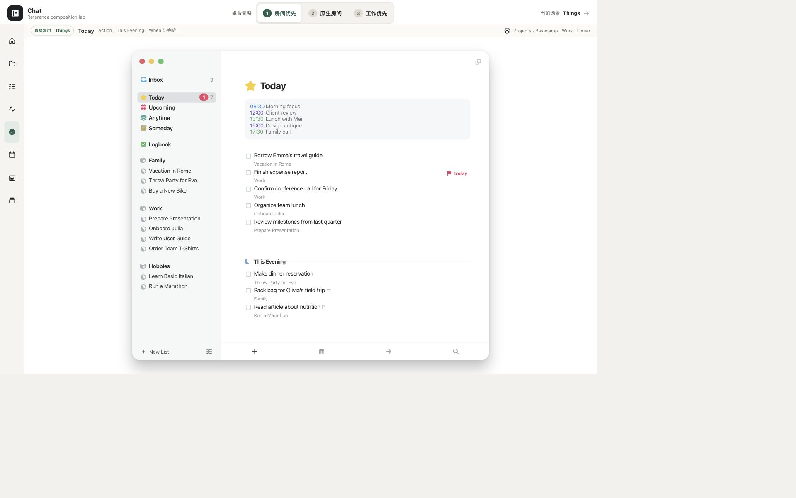

# Things 工作台单项研究 v0.1

> 本文是 9 项工作台研究集中 Things 的单项研究卡。截图是 Chat 冻结 Things 参考原型在 2026-08-12 的已验收画面，不是 Things 官方产品截图。证据标记：`O` = 本卡对既有画面的可见观察；`F` = 已批准审计/矩阵中的冻结事实；`I` = 跨证据归纳；`U` = 当前未知/未验证。

## 1. 结论卡

| 维度 | 结论 | 证据 |
|---|---|---|
| 定位 | 个人注意力/时间投影：解决"今天真正要做什么，怎样不丢长期语境" | F · audit §1 |
| 页面中心所有者 | **Attention/time projection-owned**：Today 是跨 Area/Project 的个人注意力投影面，不是新容器；Calendar events / Daytime / This Evening 三层节奏占据页面中心 | F · audit §3-4; matrix §6 |
| 最适合 Chat 的场景 | Today 个人节奏与长期 Project 正交投影；有限承诺的每日注意力面 | F · audit §1; scenario §4 ③ 覆盖 |
| 最强可迁移机制 | `parent context × attention horizon` 双轴正交；Today 来源副标题；This Evening 同日软分层；Calendar 是约束不是 Work | F · audit §3, §6 |
| 对人—Agent 工作台的主要缺口 | 无 Agent 身份、Plan/Run/Checkpoint、暂停恢复、HITL、Evidence 验证、共享权限、多 Agent visibility | F · scenario §4 ④ 不负责 ⑤ 不负责 ⑦ 不负责 |

## 2. 一张已检查画面



**画面性质**：Chat 冻结 Things 参考原型的已验收画面（1920×1200），不是 Things 官方产品截图。它只证明结构布局，不冒充完整交互路径。

**可见布局**（O）：

- **左侧栏**：Today（黄色高亮，当前作用域）、Inbox、Upcoming、Anytime、Someday、Logbook 六个注意力列表入口；下方是 Area/Project 层级导航（可见 "Things" area 及其子项目）。
- **主区域从上到下**：标题 "Today" + 黄色星标 → Calendar events 区（不可压缩的外部时间约束）→ Daytime to-dos 区（多行，每行含 checkbox + 任务文本 + 灰色 parent project 副标题）→ This Evening 区（视觉权重降低的同日后段）。
- **底部**：New Logbook Entry 入口；Magic Plus (`+`) 创建按钮。

**健康度**：健康 — 四层垂直节奏清晰（Calendar → Daytime → This Evening → Logbook），大片空白表达有限承诺，来源副标题保留 Project 语境。

**可见优点**：
- Calendar events 在顶部，先呈现不可压缩约束再排任务（F · audit §4）。
- 每行极简，灰色副标题回答"这件事属于什么 Project"，不污染扫描（F · audit §7）。
- This Evening 与 Daytime 共享同一 Today 页面但视觉权重降低，是罕见的同日软分层（F · audit §6.2）。

**可见风险/可访问性风险**：
- 灰色副标题、细图标和 checkbox 的对比度未在本卡独立实测（U）；已批准审计标记可访问性需实机验证（F · audit §9）。
- 冻结画面中可见的触控目标尺寸未量测；已批准审计记录 Things 桌面原型 46 个 visible button 中 41 个至少一维 < `44px`（F · scenario §6.3 P2）。
- 移动端 `375px` 下冻结原型是固定 macOS 窗（document width `760px`，内容缩为约 `303×262`），不能成为移动 UI（F · scenario §6.3 P1 组合阻断）。

**证据限制**：冻结画面只证明布局结构存在。不证明悬停、点击展开、拖拽排序、键盘导航、屏幕阅读器行为、完成动画或 Reduce Motion 降级。

## 3. 一条核心路径

路径事实来自已批准审计（F），不来自本截图的实际运行。

```text
长期 Project 中的 To-do
  → When → Today
  → Today 列表显示同一个 To-do + parent subtitle（F · audit §6.1）
  → 点击行 → 原位展开 detail：Notes / Checklist / Deadline / Tags（F · audit §5 #3）
  → 分支 A：点击 Checkbox → Completed → 进入 Logbook（F · audit §5 #4）
  → 分支 B：When → This Evening → 移到底部区域，视觉权重降低（F · audit §6.2）
  → 分支 C：When → 明天 / 具体日期 / Someday → 从 Today 离开，到新 start date 时重新出现（F · audit §6.3）
```

**关键事实**：对象不移动所有权。Today 只增加时间投影，Project 仍然是父语境（F · audit §6.1）。完成、改期和 This Evening 都作用于同一个 To-do，不创建副本（F · audit §1）。

## 4. 工作台交互语法（六层职责）

| 层 | Things 事实 | 证据 |
|---|---|---|
| 作用域/导航 | 双轴：`Area → Project → Heading → To-do`（长期语境）+ `Inbox / Today / Upcoming / Anytime / Someday / Logbook`（注意力范围）。Sidebar 切换注意力列表，不切换 Project 所有权 | F · audit §3 |
| 主工作表面 | Today 投影：跨所有 Area/Project 的个人时间面，4 层垂直节奏（标题 → Calendar → Daytime → This Evening） | F · audit §4; matrix §4 |
| 上下文副表面 | 原位展开 detail（Notes / Checklist / When / Tags / Deadline）；`Show in Project` 回到父语境；Quick Find 全局搜索 | F · audit §5 #3, #5, #12 |
| 连续性 | 双轴正交：同一 To-do 同时拥有 parent context 与 attention horizon，不复制两份；Today 行下方灰色副标题保留来源 | F · audit §1, §3 |
| 人工检查点 | Checkbox Complete、When 改期、拖拽排序、Magic Plus 创建、Quick Find 跳转；Deadline 独立于 When | F · audit §5 |
| 结果/证据写回 | 完成 → Logbook（时机受 Logging 偏好影响）；改期 → 新 start date 时重新出现；无 Resource / Evidence 系统 | F · audit §5 #4; §6.3; scenario §4 ⑤ 不负责 |

## 5. 布局为什么成立

**`parent context × attention horizon` 双轴正交**是 Things 最核心的设计决定（F · audit §1, §3）：

- **Context axis**（Area → Project → Heading → To-do）回答"这件事属于什么长期语境"。它是稳定的层级归属，不随时间变化。
- **Attention axis**（Inbox / Today / Upcoming / Anytime / Someday / Logbook）回答"什么时候值得进入我的注意力"。它是个人时间投影，随承诺变化。

一个 To-do 同时拥有两条轴，但不是被复制两份。Today 行下方的 Project / Area 名称负责保留来源（F · audit §3）。这意味着：
- 从 Project 进入 Today 不改变对象所有权（F · audit §6.1）。
- 从 Today 移除不改变 Work 的真实状态或归属（F · audit §10 Refuse #4）。

**Calendar / Daytime / This Evening 三层节奏**（F · audit §4）：

1. **Calendar events** 在顶部：先呈现不可压缩的外部时间约束。事件是 Apple Calendar 的只读镜像，不把会议伪装成待办（F · audit §5 #2）。
2. **Daytime to-dos** 在中部：今天主动承诺的可执行事项，可人工排序。顺序是用户当日计划，不需要额外优先级字段（F · audit §5 #7）。
3. **This Evening** 在底部：仍属于今天，但降低视觉权重并延后注意。这是罕见的"同一天内软分层"——没有增加精确时间，也能表达"现在先别打扰我"（F · audit §6.2）。

**Today 是投影不是权威容器**（F · audit §1, §10）：
- Today 不展示项目健康度、统计和完整未来，只展示会影响今天行动的内容（F · audit §4）。
- Today 的人工排序不改变 Project 中的权威优先级（F · audit §10 Refuse #3）。
- 复杂处理仍应回到 Project 长期语境（F · audit §5 #5）。

## 6. Chat 的 Take / Adapt / Refuse

### Take

1. Project 是长期语境，Today 是个人注意力投影；两者不能合并（F · audit §1）。
2. Today 只放今天可理解、可介入、可看护的有限事项（F · audit §4）。
3. 日历事件是约束，不自动变成 Work（F · audit §5 #2）。
4. Today 行必须显示来源 Project / Agent / Work（F · audit §1 Take #4）。
5. This Evening 可作为低权重的同日后段，而不是另一张 Dashboard 卡（F · audit §6.2）。
6. 一个可反复使用的直接操纵机制（Magic Plus / When），比到处加装饰更能形成产品个性（F · audit §7）。

### Adapt

1. Things To-do → Chat `Today item projection`：可投影用户 Task、待决定 Decision、需看护 Run、Blocker 和 Calendar constraint，但保留对象类型与真实状态（F · audit §10 Adapt #1）。
2. Things When → Chat `attention date`：只决定何时提醒用户介入，不代表 Run 执行时间、Deadline 或完成承诺（F · audit §10 Adapt #2）。
3. Things Deadline → Chat 外部硬约束：必须保留来源和后果，不能只显示一个红日期（F · audit §10 Adapt #3）。
4. Things checkbox → 只用于用户可直接完成的 Task；Decision、Run、Artifact 必须使用自己的权威命令和状态机（F · audit §10 Adapt #4）。
5. Quick Find → 全局跳转与最近路径；先查对象名和类型，按需扩展到全文和证据（F · audit §10 Adapt #5）。

### Refuse

1. 不把 Work、Decision、Run、Artifact 全部变成 checkbox（F · audit §10 Refuse #1）。
2. 不复制黄色星标、蓝色圆形 Plus 和 Things 图标体系（F · audit §10 Refuse #2）。
3. 不把人工排序写成团队权威优先级（F · audit §10 Refuse #3）。
4. 不因从 Today 移除就改变 Work 的真实状态或归属（F · audit §10 Refuse #4）。
5. 不让极简视觉隐藏 blocked、failed、outcome_unknown 或版本冲突（F · audit §10 Refuse #5）。
6. 不把单用户本地 Today 当作共享 Project 的事实源（F · audit §10 Refuse #6）。

## 7. 覆盖与不覆盖

### 覆盖

| 场景 | 判定 | 证据 |
|---|---|---|
| Today / 个人节奏与长期 Project 正交 | **覆盖**：Today 是跨 Project 的独立注意力投影；This Evening、来源副标题、原位详情、完成/撤销与 Quick Find 都保持长期 Project 身份 | F · scenario §4 ③ |
| 生活、娱乐、爱好等个人 Project | **覆盖**：冻结 fixture 直接包含工作、生活、娱乐与爱好；个人 Project、Anytime / Someday 和 Today 节奏可实际操作 | F · scenario §4 ⑥ |
| 多 Project 事务与持续推进 | **部分覆盖**：Area / Project / Today 管理多个个人 Project，状态跨列表与详情一致；没有团队 room、负责人 Update 或多人持续推进 | F · scenario §4 ① |
| Project room / Stage / Milestone / Iteration / Work / Scope / Action / Update | **部分覆盖**：有 Area → Project → Heading → To-do、Checklist，以及 When / Move / Deadline / Complete 分责；没有 Stage、Milestone、Iteration、Scope、Evidence 或负责人 Update | F · scenario §4 ② |

### 不覆盖

| 能力 | 证据 |
|---|---|
| Agent 身份、Plan / Run / Checkpoint、暂停 / 恢复、工具调用 | F · scenario §4 ④ 不负责 |
| 多 Agent / HITL / Decision / Candidate / 运行异常 | F · scenario §4 ④ 不负责 |
| Resource / Evidence / 知识资料收集、关联、验证与复用 | F · scenario §4 ⑤ 不负责 |
| visibility / consent / participant 边界 | F · scenario §4 ⑦ 不负责 |
| 失败 / 等待 / 恢复状态的交互证明 | U |

**结论**：Things 是 Chat 工作台的**个人注意力与今日承诺参考**，不是完整人—Agent 工作台答案。它回答"今天选择什么"和"时间上放在哪里"，但不回答"谁在执行""结果是否可靠""证据在哪里"。

## 8. 证据边界

以下事项本截图与已批准审计**不能证明**：

| 未证明 | 等级 |
|---|---|
| 截图对比度实测值（已引用审计中的风险标记，本卡未独立重测） | U |
| 原位展开 detail 时的焦点移动、滚动保持和动画细节 | U |
| Checkbox 完成后的 Undo、Logging 偏好与跨设备同步反馈 | U |
| Calendar event 的精确点击结果和无权限/日历失效状态 | U |
| 拖拽进入 This Evening、跨 Project 分组和空态的反馈 | U |
| Dynamic Type、200% 放大、Reduce Motion、VoiceOver 与完整键盘路径 | U |
| 移动端 `375px` 下的可用交互（冻结原型是固定 macOS 窗，已登记为组合阻断 P1） | U |
| 失败 / 等待 / 恢复三种状态的交互 | U |
| 浏览器 Back 键（非产品内导航）的滚动位置与焦点恢复 | U |

已批准审计中的事实（F）来自 Things 3 官方支持文档与官方产品截图，不由本卡截图单独证明。本截图只证明 Chat 冻结参考原型呈现了上述布局结构。

---

> Things 2/9 已整理；本阶段只完成研究卡，未制作原型。
