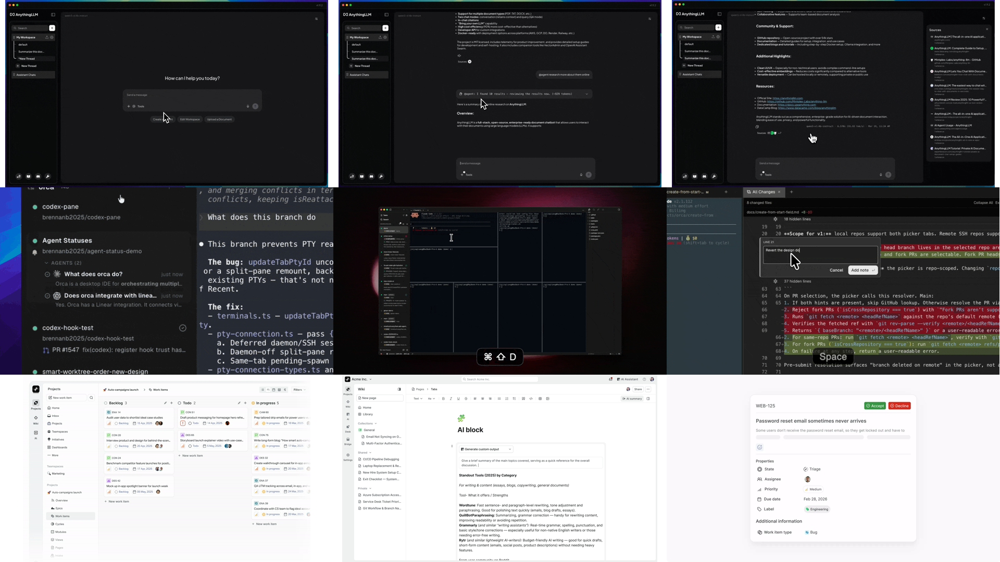

# 工作台差异试点对照 v0.1

> 样本：AnythingLLM / Open Computer、Orca、Plane。  
> 目的：确认基础工作台骨架和真正改变交互逻辑的差异。  
> 状态：研究检查点；不选择第 7 个参考项目，不制作原型。

## 1. 同尺度视觉对照

每格 `640 × 360`，整图 `1920 × 1080`。从上到下分别是 AnythingLLM、Orca、Plane；从左到右分别取该产品最能说明“起点/范围、工作中/主工作面、人工介入/交付”的画面。不同产品没有完全相同的状态，空缺本身也是差异证据。



| 行 | 左 | 中 | 右 |
| --- | --- | --- | --- |
| AnythingLLM | 对话起点 | 消息流内 Agent 进度 | 回答 + Sources 抽屉 |
| Orca | 任务条目内 Agent 状态 | 异构 pane / terminal 工作面 | Diff 行级批注 |
| Plane | Project / Work item 看板 | Page 内 AI Block | Intake Accept / Decline |

## 2. 共同基础不是“三栏”，而是 5 个责任区

三个样本都能还原为：

```text
1. Scope：当前 Workspace / Project / Task 在哪里
2. Primary surface：本次工作的主要对象在哪里
3. Agent / automation entry：自然语言或自动化从哪里进入
4. Human control：人在哪里继续、停止、批注或决定
5. Result continuity：结果如何留在原上下文并可继续工作
```

这些责任区可以左右并排、内嵌、弹出或折叠。真正决定交互逻辑的不是固定左中右，而是**谁拥有页面中心和任务连续性**。

## 3. 三种基础工作台模式

| 模式 | 代表 | 页面中心 | 状态放置 | Artifact | 人工介入 | 适合场景 |
| --- | --- | --- | --- | --- | --- | --- |
| Conversation-owned | AnythingLLM | 对话 | 消息之间的折叠状态 | 回答、Sources、附件 | 继续回复、追问 | 问答、研究、资料处理 |
| Task-workspace-owned | Open Computer / Orca | 桌面或任务隔离工作空间 | sidecar 或任务行内 Agent 状态 | 文件、浏览器、终端、Diff、Deliverable | Abort、聚焦 Agent、锚定批注 | 长任务、工具操作、多 Agent、Artifact review |
| Work-object-owned | Plane | Project / Work item / Page | 对象状态、同步状态、Intake 队列 | Page、Chart、Board、Work item | 编辑、接受、拒绝、稍后处理 | 长期项目推进、结构化协作、知识沉淀 |

这 3 种模式不是互斥产品。Chat 可以让同一个 Product Run 在不同阶段切换中心：提出目标时以 Conversation 为中心；执行时以 Task Workspace 为中心；产物进入长期维护后以 Work Object 为中心。

## 4. 真正的差异

### 4.1 连续性载体不同

- AnythingLLM：Thread 保存上下文，结果仍是下一轮消息的前文。
- Orca：Worktree 和 pane layout 保存任务现场，Chat / terminal 只是其中一个 pane。
- Plane：Project 对象和状态保存长期事实，AI 会话可以结束，但 Work item / Page 仍持续存在。

### 4.2 人的介入单位不同

- AnythingLLM：对整段回答继续说话。
- Orca：对具体 Agent 或 Artifact 行段发回意见。
- Plane：对结构化候选对象编辑、Accept 或 Decline。

### 4.3 进度表达不同

- AnythingLLM：少量阶段文字，轻，但长任务内部容易不透明。
- Orca：Agent 状态、terminal、pane、Diff 可观察，强，但产品 Run 事实需要另建。
- Plane：Work item 列和对象属性适合长期工作进度，但不是 Agent 工具调用或 Run 进度。

### 4.4 Artifact 身份不同

- AnythingLLM：Artifact 多附着于回答或 Deliverables。
- Orca：Artifact 是 task workspace 内可打开、可并排、可锚定评论的 pane。
- Plane：Artifact 是正式 Page / Work item / Chart，与 Project 生命周期绑定。

## 5. 对 Chat 的组合结论

### 基础骨架

1. 保留可折叠的范围导航，但层级必须对应 `Product → Project / Scope → Work / Run`，不能只是一列杂项入口。
2. 中心区不是永久 Chat：它根据当前主对象切换为 Conversation、Workspace 或长期 Artifact / Work Object。
3. Agent 状态既要有轻量摘要，也要能定位到真实 Run、pane、Artifact 和 Evidence。
4. Review Queue 是跨模式能力：对 Plan、外部动作、Artifact 修改和候选 Work item 使用同一套“查看 → 修订 → 接受/拒绝 → 稍后处理”语法。

### 布局变化能解决的

- 对话与 Artifact 是否同屏；
- Browser / File / Whiteboard / Calendar / Board 是否并排；
- Logs / Evidence / Agent 状态是内联、侧栏还是独立 pane；
- 桌面与移动端在同一对象上的聚焦方式。

### 不能靠布局解决的

- Plan 是否版本绑定、可修改；
- Pause / Resume / Cancel / Unknown result 的真实状态；
- Agent、Run、Artifact、Evidence 和 Project 写回的身份关系；
- 权限、读取范围、写回范围与外部副作用；
- 多 Agent participant、visibility、分工和责任。

这些必须由 Chat 的产品对象和状态机承担，不能从任何参考项目的 UI 外观直接借来。

## 6. 三个样本各自补什么

| 样本 | 最值得保留 | 不能让它代表全部 |
| --- | --- | --- |
| AnythingLLM / Open Computer | Conversation 与电脑式 Workspace 两种中心；Sources、Run sidecar、Deliverable | Plan、Artifact review、完整恢复 |
| Orca | 任务隔离空间、异构 pane、多 Agent 可观察性、Artifact 锚定反馈 | 非 coding 长期 Project、产品级权限和 Run 终态 |
| Plane | Project / Work-object-owned shell、多布局同对象、Page 版本/同步、Intake 队列 | Agent Plan/Run、工具调用、暂停恢复、多 Agent |

## 7. 当前判断

工作台的“基础设计”已经可以停止继续抽象：**范围导航 + 可切换的主对象表面 + Agent/Run 状态 + 人工控制 + 结果连续性**。

后续再看新项目，只在它能提供以下至少一个新机制时升级为深审：

1. 可编辑 Plan 与执行 Checkpoint；
2. 暂停、恢复、失败和结果未知；
3. 多 Agent participant / visibility / delegation；
4. 非代码 Artifact 的精确批注和修订回路；
5. Evidence、权限和写回范围的可见表达。

单纯改变侧栏位置、卡片颜色或 Board 样式，不再进入深审。

## 8. 当前停点

AnythingLLM / Open Computer、Orca、Plane 的工作台差异试点已经完成。没有制作原型，也没有替用户选择第 7 个参考项目。
