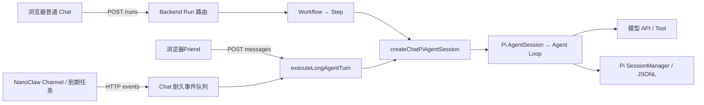

# 源码、流程与核心接口地图

本页供打开 IDE 后直接找文件、函数和断点。2026-09-15 按当前 checkout 源码核对；描述源码可达路径，不表示运行中的生产构建或私有任务配置已同步。函数名比行号稳定：点击文件后搜索表中的函数名；路由默认导出没有名字时，在 `defineEventHandler` 回调内打断点。


Workflow终端入口从 `cli/src/main.ts` → `controller.ts` → `api.ts` →同一 `POST /runs` 接入；UI组合在 `tui.ts`。启动、具体断点与Web/Fork同步场景见[Workflow TUI调试](./workflow-tui.md)。

## 第一次调试：先跑这一条

1. 在 Chat 根目录打开 VS Code，F5 选择 `Debug Chat`。它会启动本地假模型 `45401`、Backend `45112`、Vite `35145` 和独立 Chrome。只看页面时访问调试浏览器中的 `35145`；`43110` 是生产实例。
2. 打开 Debug Lab，选直接执行 Workflow，发送 `DEBUG_HELLO`。先只下 3 个断点：`useAgentSession.ts` 的 `handleSend`、`runs.post.ts` 的请求解析后、`step.ts` 的 `session.prompt()` 前。
3. 预期假模型返回 `DEBUG_OK`，Run 到 `completed`，刷新后 Session 仍有回复。再用 `DEBUG_READ_SKILL` 练习模型调用 `read`，观察 `DEBUG_SKILL_LOADED`。
4. 普通 Web 跑通后，再选 `Debug Chat + NanoClaw` 学长期 Agent。首次先执行 `pnpm debug:prepare:nanoclaw`。Nano 的断点在 `.data/debug/nanoclaw/src`，其他模块在原仓库源码。

停止当前 checkout 的正式服务用 `scripts/dev-start.sh stop release`；停止调试栈及 `dev:all` 用 `scripts/dev-start.sh stop debug`。二者可加 `--check`。手动启动且无法确认归属的进程会报出，不会按端口强杀。完整准备与恢复见[环境](./environment.md)、[停止](./stopping.md)。调试默认模型是协议 Fixture；它不会自动使用正式 Chat 的 DeepSeek 配置。



图中的箭头是执行/数据交接；每次执行并不会重新启动一个 Pi 服务。跨 HTTP 边界没有连续调用栈，要靠下面的 ID 表对齐两侧断点。

## 先分清 4 个模块

| 模块 | 学习入口 | 负责的事实 | 不负责的事 |
|---|---|---|---|
| Frontend | [useAgentSession](../../../frontend/hooks/useAgentSession.ts)、[浏览器 Run 客户端](../../../frontend/lib/chat-workflow-browser.ts) | 页面草稿、导航、显示、HTTP 响应解析 | 不保存另一份权威 Session，不直接连接模型或 Nano 数据库 |
| Backend | [Run 路由](../../../src/routes/runs.post.ts)、[公共装配](../../../src/agents/pi-agent-session.ts) | Project、配置、Workflow、Long Agent 生命周期、HTTP合同 | 不复制 Pi Agent Loop |
| Pi | [SDK](../../../pi/packages/coding-agent/src/core/sdk.ts)、[AgentSession](../../../pi/packages/coding-agent/src/core/agent-session.ts) | 模型请求、Tool Loop、原生消息、资源加载、Session 文件 | 不认识 Chat 的页面与 Nano Group |
| NanoClaw | [main](../../../nanoclaw/src/index.ts)、[router](../../../nanoclaw/src/router.ts) | Channel、Group、Wiring、Mailbox、投递和回执 | `chat-pi` 下不执行原生容器 Agent Runtime |

表中 Nano 链接用于阅读父仓库固定版本；实际调试断点与编辑文件在 `.data/debug/nanoclaw`，先核对两边 Commit。

## Web 普通对话：按函数追踪

1. `useAgentSession` 根据 Session `owner` 判断普通会话或Friend；普通会话调用 `runChatWorkflowPrompt()`。
2. `POST /runs` 校验用户输入与 Project，恢复默认选择/Session，返回 `runId / workflowInvocationId / sessionId`。
3. [startChatWorkflow](../../../src/workflows/start-chat-workflow.ts) 从 Registry 选择 Workflow，由 Workflow SDK 启动。
4. [minimalPiCodingAgentWorkflow](../../../src/workflows/minimal-pi-coding-agent/workflow.ts) 组织一次执行，进入 [runPiCodingAgentPromptStep](../../../src/workflows/minimal-pi-coding-agent/step.ts)。Workflow 代码受持久执行约束；Node 文件 IO、模型和 Tool 执行在 Step 中。
5. `prepareChatWorkflowTurnConfiguration()` 冻结本轮选择；`resolveWorkflowAgentDefinition()` 解析 Prompt/Tool/资源路径。
6. `createWorkflowAgentSession()` 是薄包装，最终只调用 `createChatPiAgentSession()`。后者构造 `DefaultResourceLoader`、加载资源、注册系统 Tool，并调用 Pi `createAgentSession()`。
7. `session.prompt()` 开始模型与 Tool 循环；事件订阅进入日志/Run 流，SessionManager 保存原生消息。最后释放 Session。
8. 浏览器消费 NDJSON，终态重新读取 Session；页面内存不是运行事实源。

### Web / Workflow 断点表

| 顺序、交接 | 文件 + 函数 | 断点观察值与作用 |
|---|---|---|
| 1. 输入 → 请求 | [useAgentSession.ts](../../../frontend/hooks/useAgentSession.ts)：`handleSend` | `message`、当前 `session.owner`、Project、Workflow 选择；这里分流普通会话和 Long Agent |
| 2. 浏览器 → Backend | [chat-workflow-browser.ts](../../../frontend/lib/chat-workflow-browser.ts)：`runChatWorkflowPrompt` | 输入 `ChatWorkflowPromptInput`；POST 后取得 Run 引用，进入 `followChatWorkflowRun` |
| 3. 请求 → 可信输入 | [runs.post.ts](../../../src/routes/runs.post.ts)：默认 handler；[run-request.ts](../../../src/run-request.ts)：`parseChatWorkflowHttpInput` | `body` 对比 `input`；`resolveRequestProject` 解析 Project，`resolveChatConfig` 提供默认值，首轮 `reserveChatSession` 先落盘 |
| 4. Run → Workflow | [start-chat-workflow.ts](../../../src/workflows/start-chat-workflow.ts)：`startChatWorkflow` | `definition.run`、`chatWorkflowInput`、SDK 返回的 `run.runId`；记录 Run 与 Session 的绑定 |
| 5. Workflow → Node Step | [workflow.ts](../../../src/workflows/minimal-pi-coding-agent/workflow.ts)：`minimalPiCodingAgentWorkflow`；[step.ts](../../../src/workflows/minimal-pi-coding-agent/step.ts)：`runPiCodingAgentPromptStep` | `input` → `chatSession` → `prepared.agents`；业务 IO、模型和工具在 Step 中执行 |
| 6. Step → 公共装配 | [agent-definition.ts](../../../src/workflows/agent-definition.ts)：`createWorkflowAgentSession` | `agent`、`toolContext`、`sessionManager`；Workflow 包装转交唯一公共入口 |
| 7. Pi → Run 流 | [agent-session-log.ts](../../../src/workflows/agent-session-log.ts)：`subscribeAgentSessionLog`；[chat-run-events.ts](../../../src/workflows/chat-run-events.ts)：`projectAgentSessionEvent` | Pi 原生事件投影成浏览器所需字段，再带上当前 Stage 信息 |
| 8. HTTP 流 → UI | [events.get.ts](../../../src/routes/runs/%5BrunId%5D/events.get.ts)：默认 handler；[chat-workflow-browser.ts](../../../frontend/lib/chat-workflow-browser.ts)：`consumeRunEvents`、`followChatWorkflowRun` | 每行 NDJSON 事件、当前 Run；不是 SSE。事件应用与最终状态查询要分别看 |
| 9. 持久会话 → 刷新恢复 | [session-read-model.ts](../../../src/session-read-model.ts)：`readChatSession`；[useAgentSession.ts](../../../frontend/hooks/useAgentSession.ts)：`fetchSessionData`、`loadSession` | Session entries → 页面消息/Workflow 配置读模型；刷新恢复不依赖此前 React 内存 |

异步受理后不要只停在 `POST /runs` 等结果；真正执行在 Workflow 的 Step 子进程。断点不命中时按[Backend 调试](./backend-workflow.md)核对自动附着和 `node_modules/.nitro-debug` 的 Source Map。

### 配置 → Agent → Pi：两种执行入口共用

| 文件 + 函数 | 输入 → 输出；适合观察什么 |
|---|---|
| [chat-config.ts](../../../src/chat-config.ts)：`resolveChatConfig` | Project / Chat Home → `effective` 配置；确认读的是调试目录和当前 Project |
| [workflow-configuration.ts](../../../src/workflows/workflow-configuration.ts)：`prepareChatWorkflowTurnConfiguration` | Workflow 默认值、Session 选择、本轮调整 → 冻结的 `prepared.agents`；这是普通 Workflow 的本轮选择入口 |
| [agent-config-loader.ts](../../../src/workflows/agent-config-loader.ts)：`resolveWorkflowAgentDefinition` | Agent 选择 → 有效定义及来源；检查模型、Thinking、Prompt revision、资源授权路径 |
| [pi-agent-session.ts](../../../src/agents/pi-agent-session.ts)：`createChatPiAgentSession` | 已解析 `agent` + 可信 `chatSession` → `CreatedChatPiAgentSession`；Workflow 和 Long Agent 在这里汇合 |
| 同上：`resourceLoader.reload()` 后 | `DefaultResourceLoader` 已加载的 Skill / Extension / Context；`resources.mode` 决定继承或显式资源，不能用“磁盘有文件”判断生效 |
| 同上：`ModelRuntime.create()` / `getModel()` 后 | 显式模型从 `chatSession.agentDir` 下的 `models.json` / `auth.json` 解析；模型不存在或无配置认证会在模型请求前失败。未显式指定时继续走 Pi SDK 默认解析 |
| [tools/registry.ts](../../../src/tools/registry.ts)：`resolveChatSystemTools` | Tool 地址 + 可信执行上下文 → 实际 Tool 定义；最终看 `created.session.getActiveToolNames()`，不要只看目录列表 |
| [Pi sdk.ts](../../../pi/packages/coding-agent/src/core/sdk.ts)：`createAgentSession` | Model、Settings、ResourceLoader、Tools、SessionManager → 可执行 AgentSession；公共装配本身不发送 prompt |
| [Pi agent-session.ts](../../../pi/packages/coding-agent/src/core/agent-session.ts)：`AgentSession.prompt` | 用户文本/图片 → 上下文准备与 Agent 执行；`_handleAgentEvent` 将原生消息交给 SessionManager |
| [Pi agent-loop.ts](../../../pi/packages/agent/src/agent-loop.ts)：`runAgentLoop`、`runLoop`、`streamAssistantResponse` | 当前消息、模型、Tool Schema → 模型流；`convertToLlm` 是内部消息转换成模型消息的边界 |
| 同上：`executeToolCalls`、`executePreparedToolCall` | Assistant 的 toolCall → 校验与执行 → ToolResult → 后续模型轮次；`read` 的具体执行在 [tools/read.ts](../../../pi/packages/coding-agent/src/core/tools/read.ts) |
| [Pi session-manager.ts](../../../pi/packages/coding-agent/src/core/session-manager.ts)：`appendMessage`、`appendCustomEntry`、`buildSessionContext` | 原生消息与 Chat 元数据分别追加；根据当前叶节点/分支还原模型上下文 |

Long Agent 的能力源是自身 `LongAgentConfig.definition`，经 `executeLongAgentTurn` 附加 Group 上下文后进入公共装配；不经过普通 Workflow 的 `prepareChatWorkflowTurnConfiguration`。Tool 的 `projectId/chatHome/sessionId/longAgentId` 来源于宿主上下文，模型只提供工具业务参数。完整配置实验见[配置与资源调试](./configuration-resources.md)。

## Web 长期 Agent：不经过普通 Workflow

| 交接 | 文件 + 函数 | 观察什么 |
|---|---|---|
| 打开 Agent | [long-agents-browser.ts](../../../frontend/lib/long-agents-browser.ts)：`startProjectLongAgent` → [start.post.ts](../../../src/routes/api/long-agents/%5BlongAgentId%5D/start.post.ts)：默认 handler | 请求 Project 与返回 `projectId/primarySessionId`；从系统共享入口打开时可能转到 Agent 自己的默认 Project |
| 确定主会话 | [project-agent.ts](../../../src/long-agents/project-agent.ts)：`ensureProjectLongAgent` | 当前 `(projectId, longAgentId)` 的 `ProjectLongAgent`；Agent 自己的 Daily Project 按宿主本地日期轮换，其他 Project 复用专属主会话 |
| 发送文本 | [useAgentSession.ts](../../../frontend/hooks/useAgentSession.ts)：`handleSend` → [long-agents-browser.ts](../../../frontend/lib/long-agents-browser.ts)：`sendLongAgentMessage` → [messages.post.ts](../../../src/routes/api/long-agents/%5BlongAgentId%5D/messages.post.ts) | `projectId/sessionId/text/contextProjectId`；不是 POST `/runs` |
| 生命周期与执行 | [runtime.ts](../../../src/long-agents/runtime.ts)：`executeLongAgentTurn` | `turnId`、原生 Turn 标记、Session 锁；`contextProjectId` 用于提示词上下文，不改变会话归属 |
| Group → Prompt | [agent-group-service.ts](../../../src/long-agents/agent-group-service.ts)：`readLongAgentAgentGroup`、`readFrozenLongAgentAgentGroup`、`buildAgentGroupContextInstructions` | Group 身份、核心 Memory、revision；重试读取冻结快照，避免同一 Turn 悄悄换身份 |
| 公共 Pi → 回复 | `runtime.ts` 中 `createChatPiAgentSession`、`created.session.prompt` | 实际模型、active tools、Long Agent 资源；返回 `ExecuteLongAgentTurnResult` 后前端重读 Session |

当前 Web `messages` 请求等待本轮完成，返回 `accepted: true` **和** `completed: true`；它不是普通 `/runs` 的异步 202 合同。若只在直接执行 Workflow 的 Step 下断点，Long Agent 对话不会命中。

## 渠道对话：跨进程的边界

```text
Telegram/微信 Adapter
  → routeInbound（平台身份、成员权限、Wiring、触发规则）
  → resolveSession / writeSessionMessage（Nano Channel Session / Inbox）
  → chat-pi ExecutionDriver（耐久 HTTP Outbox）
  → POST /api/internal/channel/v1/events（服务认证 + 结构校验）
  → acceptLongAgentEvents（Chat 耐久接收，返回 202）
  → syncLongAgentEvents（恢复 Worker / 重试）
  → executeLongAgentTurn（真实 Project + 原生 Chat Session）
  → createChatPiAgentSession → Pi
  → persistNanoClawDelivery → Nano Outbound
  → acknowledgeNanoClawInbound → Nano Inbox Ack
  → delivery poll → 对应 Adapter → 平台
```

Ack 与投递是不同操作；不能看到 Ack 就判断平台用户已读。Chat Session ID 与 Nano Session ID 也不同：Nano ID 是 Channel/Mailbox 路由坐标，映射关系保存在 Chat Long Agent 状态中。

### NanoClaw / Backend 断点表

下表 Nano 路径用于阅读固定子模块源码；F5 的实际断点放在 `.data/debug/nanoclaw` 下的同名文件。HTTP 两侧先记 `instanceId + eventId`，再按条件断点筛选。

| 顺序 | 文件 + 函数 | 作用与关键数据 |
|---|---|---|
| 1 | [Nano router.ts](../../../nanoclaw/src/router.ts)：`routeInbound` | Adapter 的 `InboundEvent` → 权限/Wiring/目标 Agent Group |
| 2 | [Nano session-manager.ts](../../../nanoclaw/src/session-manager.ts)：`resolveSession`、`writeSessionMessage` | 路由 → Nano Session 与耐久 Inbox 消息 |
| 3 | [execution-driver.ts](../../../nanoclaw/src/modules/chat-integration/execution-driver.ts)：`registerChatPiExecutionDriver` 注册的 `wake` | 恢复可转发事件；`chat-pi` 把执行交给 Backend |
| 4 | [chat-backend-client.ts](../../../nanoclaw/src/modules/chat-integration/chat-backend-client.ts)：`pushPendingChatIntegrationEvents` | 耐久 Outbox → `{schemaVersion, instanceId, events}` HTTP 请求 |
| 5 | [events.post.ts](../../../src/routes/api/internal/channel/v1/events.post.ts)：默认 handler；[bridge.ts](../../../src/long-agents/bridge.ts)：`acceptLongAgentEvents` | 校验、去重、耐久入队后返回 202；相同 ID、不同 payload 是冲突 |
| 6 | [runtime-initialization.ts](../../../src/runtime-initialization.ts)：`ensureChatRuntimeInitialized` → `bridge.ts` 的 `startLongAgentSync`、`syncLongAgentEvents`、`syncInstance` | 后台 Worker 取 pendingEvents、检查重试时间，映射 Project/Session，再执行 Turn |
| 7 | [nanoclaw-client.ts](../../../src/long-agents/nanoclaw-client.ts)：`persistNanoClawDelivery` → `acknowledgeNanoClawInbound` | Pi 完成后先保存回复 Delivery，再 Ack 原始入站；`deliveryId = chat-pi:<turnId>` |
| 8 | [Nano delivery.ts](../../../nanoclaw/src/delivery.ts)：`deliverSessionMessages`、`deliverMessage` | Outbound → 具体平台 Adapter；此处才能观察实际平台投递结果 |

### 定时任务与朋友圈分别在哪儿

| 路径 | 文件 + 函数 | 当前源码的行为 |
|---|---|---|
| 任务管理 | [tasks/service.ts](../../../src/long-agents/tasks/service.ts)：`manageFriendTask`、`acceptTaskTrigger` | LA2 定义/修订/发生记录由 Chat 持久化，Nano 保存调度投影。完整合同见 [Friend 任务](../../modules/long-agents/tasks.md)；新建 Friend 不再预置隐藏任务 |
| 到期 → Event | [Nano task-forwarder.ts](../../../nanoclaw/src/modules/chat-integration/task-forwarder.ts)：`startChatPiTaskForwarder`、`forwardDueChatPiTasks` | 启动立即扫描，随后每 60 秒扫描一次到期 pending 任务；生成 `kind: schedule`、`taskId` 事件。带 pre-task script 的任务跳过并记日志 |
| Event → Agent | [bridge.ts](../../../src/long-agents/bridge.ts)：`syncInstance` 的 `event.kind === "schedule"` 分支 | 使用 Agent 默认 Project 的主会话执行，`source: scheduled`；此分支没有普通渠道的自动 Delivery/Ack |
| Agent → 发帖 | [social-manage/index.ts](../../../src/tools/builtins/social-manage/index.ts)：`SOCIAL_MANAGE_TOOL_PROVIDER` 的 `execute` | `operation: post/read/comment`；要求可信 Long Agent 执行身份，写入后追加审计 |
| 发帖 → 持久化 | [social.ts](../../../src/long-agents/social.ts)：`publishLongAgentPost`、`commentOnLongAgentPost`、`listLongAgentFeed` | Chat Home 下 `social/posts.jsonl` 与 `social/comments.jsonl`；读取时合并评论 |
| API → 朋友圈页面 | [social.get.ts](../../../src/routes/api/long-agents/%5BlongAgentId%5D/social.get.ts) → [long-agents-browser.ts](../../../frontend/lib/long-agents-browser.ts)：`fetchLongAgentFeed` → [LongAgentFeedView.tsx](../../../frontend/components/LongAgentFeedView.tsx)：`LongAgentFeedView` 中 `load` | 页面取动态并展示。API 虽带一个 Agent ID，默认返回所有 Agent，只有 `only=self` 才按作者过滤 |

不要把页面加载、后台 Worker 的轮询、模型被唤醒、模型调用发帖工具看作同一事件。调“为什么没发朋友圈”时依次核对：**任务是否存在且到期 → schedule 事件 → Turn → social_manage 工具调用 → posts.jsonl → GET social 响应 → 页面**。21:00 规则是否配置，应查实际任务；不能从朋友圈页面存在推断已经配置。

## 关键数据结构：在 Watch 里看什么

下面是阅读摘要，不是可复制的完整 Schema；精确字段以链接中的类型和运行时 parser 为准。不要把内部结构整体当成浏览器可传参数。

| 结构、定义文件 | 核心字段 | 含义与常见混淆 |
|---|---|---|
| `ChatWorkflowPromptInput`，[前端合同](../../../frontend/lib/chat-workflow-contract.ts) | `projectId, cwd, prompt, images?, sessionId?, workflow, agentConfigs?` | 浏览器发一次普通 Chat 的输入；图片是 `{type: image, data, mimeType}`，`data` 是 base64 |
| `ChatWorkflowHttpInput`，[run-request.ts](../../../src/run-request.ts) | 上述字段及内部 `chatHome/defaultAgentConfigs/delegatedByAgentId` | HTTP 解析后的对象；内部来源字段不能由客户端任意指定 |
| `ChatWorkflowInput / ChatWorkflowResult`，[types.ts](../../../src/workflows/types.ts) | 输入包含 `workflowInvocationId`；结果为 `text/sessionId/sessionFile/model` | Workflow/Step 之间的可序列化参数和最终输出；`model` 是 `{provider, modelId}` 或 null |
| `ChatWorkflowRunAccepted`，[前端合同](../../../frontend/lib/chat-workflow-contract.ts) | `runId, workflowInvocationId, sessionId, isNewSession` | 请求被接受后得到的执行引用；不是 Assistant 的最终回复 |
| `ChatProjectContext`，[projects/types.ts](../../../src/projects/types.ts) | `projectId, projectRoot, cwd, chatHome, agentDir, projectDataDir, sessionDir, memoryDir` | 已解析的路径与作用域。项目源码根、Chat Home、Session 存储目录是不同概念 |
| `ChatSession`，[chat-session.ts](../../../src/chat-session.ts) | `manager, projectContext, cwd, agentDir, sessionDir` | Chat 对原生 SessionManager 的包装；`manager` 是运行对象，不是 HTTP JSON |
| `AgentConfigSelection`，[agent-config.ts](../../../src/workflows/agent-config.ts) | `primary, append, promptFiles, promptResources, tools, resources` | 用户选择/调整；不同于已解析好的完整 Agent 能力 |
| `WorkflowAgentDefinition`，同上 | `id, model?, thinkingLevel?, systemPrompt, customInstructions, tools, resources` | 公共装配收到的有效能力。Tool 模式是 `pi-default/none/explicit`；资源模式是 `inherit/explicit` |
| `CreatedChatPiAgentSession`，[pi-agent-session.ts](../../../src/agents/pi-agent-session.ts) | `session, resourceLoader, chatTools, toolResources, modelFallbackMessage?` | 装配结果；看实际 `session.model`、`thinkingLevel`、active tools，调用方最终负责 dispose |
| `ChatRunEvent`，[chat-run-events.ts](../../../src/workflows/chat-run-events.ts) | `type: stage_start/review_required/agent_event`；`stage`；内层 `event` 或 `review` | 外层描述 Workflow Stage，内层是投影后的 Pi 事件。一次 HTTP chunk 不一定正好等于一行事件 |
| `SessionEntryBase / SessionMessageEntry`，[Pi session-manager.ts](../../../pi/packages/coding-agent/src/core/session-manager.ts) | `id, parentId, timestamp, type`；message entry 内有 `message` | JSONL 是带父子关系的条目序列；当前上下文按 leaf 分支还原，不是直接把文件所有行都发给模型 |
| `LongAgentConfig`，[long-agents/types.ts](../../../src/long-agents/types.ts) | `id, instanceId, nanoclawAgentGroupId, defaultProjectId, definition, enabled, status` | 长期身份与 Nano 映射；`definition` 是 Chat 拥有的 Pi 能力，不交给 Nano 再执行一次 |
| `ProjectLongAgent / LongAgentConversationBinding`，同上 | 前者 `projectId/longAgentId/primarySessionId/sessionDate?`；后者 `projectLongAgentId/nanoclawSessionId/source` | 前者关联产品 Project 与 Agent 主会话，后者映射渠道会话；两者的 sessionId 不同 |
| `NanoClawIntegrationEvent`，同上 | `eventId, instanceId, direction, messageId, nanoSessionId, agentGroupId, kind, text, source, delivery, taskId?` | 跨进程耐久事件。schedule 没有普通对话来源/自动回复目标，走独立分支 |
| `LongAgentState`，同上 | `projectAgents, bindings, pendingEvents, processedEvents` | 当前 schemaVersion 为 3；pending 项含 `attempts/nextAttemptAt/lastError`，processed 项含 payloadHash 用于幂等 |
| `ExecuteLongAgentTurnInput / Result`，[runtime.ts](../../../src/long-agents/runtime.ts) | 输入 `longAgentId/projectId/sessionId?/turnId?/text/source?`；结果含 `accepted/completed/turnId/sessionId/text/model` | 渠道用稳定 eventId 作为 turnId；Web 未提供时新建 Turn ID |
| `LongAgentSocialPost`，[social.ts](../../../src/long-agents/social.ts) | `id, longAgentId, date, text, sourceSummaryDate, createdAt, comments` | 帖子及评论读模型；前端 `LongAgentFeedPost` 不包含全部后台字段 |

### 调试时先记下的 ID

| ID | 所属范围 | 怎么用 |
|---|---|---|
| `projectId` | 产品作用域 | 先确认请求、会话、资源是不是同一 Project |
| `sessionId` | Chat / Pi 原生会话 | 连接多轮消息与刷新后的读模型；不等于一次 Run |
| `runId` | Workflow SDK 一次执行 | 查询 `/runs/:id`、事件流、取消 |
| `workflowInvocationId` | Chat 一轮 Workflow 的关联标识 | 连接 Stage、本轮配置、审查与执行记录 |
| `longAgentId` / `agentGroupId` | Chat 长期身份 / Nano 长期实体 | 经 Registry 映射；不要按显示名称关联 |
| `nanoSessionId` | Nano Channel/Mailbox | 找入站、Outbound 和 Ack；不等于 Chat sessionId |
| `eventId` / `turnId` | 耐久入站 / 一次 Long Agent 执行 | 渠道调用将二者对齐，重试看同一个 ID |
| `toolCallId` | 一次工具调用 | 对齐 Assistant toolCall、执行事件和 ToolResult |

建议 Watch 只放 `input`、`agent.model`、`chatSession.projectContext`、`event.type` 和这些 ID；不要展开认证头或密钥。`session.getActiveToolNames()` 可以观察当前工具，避免在 Watch 中调用写入/重新执行方法。

## 核心接口速查

| 接口/函数 | 输入与输出 | 在这里看什么 |
|---|---|---|
| `POST /runs` | Project、prompt、workflow、可选 Session/本轮选择 → 202 + 三个 ID | accepted 不等于 completed；已有活跃 Run 不能随意叠加 |
| `GET /runs/:id` | Run ID → 当前状态/最终结果 | 区分 running、completed、failed、cancelled |
| `GET /runs/:id/events` | Run ID、startIndex → NDJSON | HTTP流，不是 WebSocket/SSE；恢复不是逐条已确认重放 |
| `DELETE /runs/:id` | Run ID → 取消执行 | 停止浏览器读取不是这个操作 |
| `resolveWorkflowAgentDefinition()` | 当前作用域、Agent 默认值、有效选择 → 解析后的 Definition | 权限根、模型覆盖、Prompt revision、资源规范路径 |
| `createChatPiAgentSession()` | 可信 ChatSession、SessionManager、已解析 Agent → session/resourceLoader/tools | 唯一装配入口；本身不调用模型；调用方负责 dispose |
| `POST .../agents/:id/resolve` | projectId/cwd + 可选 selection → 实际检查结果 | 内存 Session 装配，模型/Prompt/active tools/资源诊断 |
| `POST /api/internal/channel/v1/events` | schemaVersion、instanceId、events → accepted/duplicate | 服务认证；同 ID 不同内容拒绝；202 前耐久保存 |
| `executeLongAgentTurn()` | Long Agent、已绑定 Project/Session、Turn 输入 → 执行结果 | Turn 重试/原生分支、固定 Group Snapshot |
| Gateway `/v1/deliveries`、`/v1/acks` | 稳定 Delivery/Turn/Inbox 标识 → 持久结果 | 路径基于 Registry gatewayBaseUrl，鉴权使用双方服务 Token |

HTTP 请求体精确定义以[路由源码](../../../src/routes)与[配置文档](../../configuration/README.md)为准。新增字段时同时更新提供方、Frontend 的运行时 parser、测试；不能只改 TypeScript 类型。

## 常见名字的含义

| 名字 | 含义 |
|---|---|
| Project | 配置、Session、资源和授权的作用域；daily 也是真实 Project |
| Workflow | 一次执行的节点组织，不是第二套 Agent Runtime |
| Agent Definition | 本轮模型、Thinking、Prompt、Tool、Skill/Extension/Plugin 策略 |
| Long Agent | 跨任务长期身份；当前 Registry 映射到一个 Nano Agent Group |
| Agent Group | Nano 的长期实体，一个 Group 不是多个 Agent 的 Team |
| Messaging Group | 平台上的一段会话；Wiring 把它连接到一个或多个 Group |
| Rule / Experience | 可选择的版本化 Prompt 资源，不是另一套执行引擎 |
| Skill | 方法文档；发现摘要与读取正文是两个阶段 |
| Tool | 注册后可执行的动作；出现在目录不代表已激活 |
| Memory | 持久事实；Chat Personal/Project 与 Nano Group Markdown 作用域不同 |
