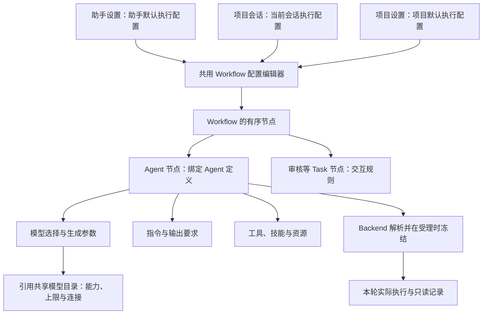

# Agent 配置打样：信息关系与交互方案

日期：2026-09-30。初稿状态：待用户审核；后续打样进展见 §10–12。

2026-09-30 后续：用户认可基础布局，要求形成强制规范并接入真实产品。现行方法见[前端设计方法与案例](../../../frontend/docs/frontend-design-method.md)，生产页面实施和验证见[工作流配置记录](../../../frontend/docs/design/workflow-configuration-rollout.md)。下文保留当时分析，不将原型目标当作全部已实现能力。

本轮只研究一个场景：为助手或项目会话选择 Workflow，理解其中各节点的职责，配置执行 Agent，确认下一次运行将使用什么。先用“直接执行”打样，再用“规划执行”的人工审核节点检查方案能否成立。这里不是全产品信息地图，也不替代正式配置合同。

实现基线：父仓库 `13b8405a`、Frontend `3e6cceb3`。在独立测试环境中使用对应构建、临时 Chat Home、本地假模型和资源服务，浏览器只查看配置，未保存改动。原有 43110 服务未部署此次基线，不能把旧服务仍显示的独立助手模型表单当作这版源码的回归。

## 1. 先确认业务关系

用户关心的统一方向成立：长期助手的执行配置与项目 Session 的执行配置，应使用同一套 Workflow Agent 配置能力。长期助手的身份、日程、Memory 所有权仍有自己的领域。



图中是建议的产品组织方式；“当前会话模型参数覆盖”等缺口见 §3，并非已经接通。配置所属助手/项目与实际执行项目是两个概念：助手切换顶栏项目，不应偷偷变成修改该项目的默认模型。

需要让用户一次区分 5 个对象：

| 对象 | 用户要理解什么 | 界面表达 |
| --- | --- | --- |
| 配置范围 | 我在改谁的默认值，还是只调整这段会话？ | 页面头部直接显示所属助手/项目、会话及生效时点 |
| Workflow | 这次工作按什么过程完成？ | 名称、简短用途、节点顺序 |
| 节点 | 这一步做什么，是模型工作还是等人审核？ | 有序节点列表、职责和类型；按需展示运行条件 |
| Agent 配置 | 负责这一步的执行者用什么模型、指令、工具？ | 选中节点后的内容区 |
| 共享模型定义 | 这个模型支持什么，连接到哪里？ | 节点内只读能力摘要，独立的共享模型维护入口 |

节点和 Agent 不应假设永久一对一。现有持久配置的键是“所属范围 + Workflow + Agent”。如果多个节点引用同一个 Agent，编辑应明确提示“同时影响节点 A、B”，不能让用户以为是独立节点覆盖。首版不新增节点实例配置事实源。

## 2. Workflow 实际有哪些节点

源码中有 8 个内置 Workflow；这里的列表用于核对编辑器，不要求用户理解内部目录。

| Workflow | 声明的节点顺序 |
| --- | --- |
| 直接执行 | 执行 Agent → 会话记忆 Agent |
| 长期记忆 | 记忆管理 Agent → 会话记忆 Agent |
| 问题诊断 | 诊断 Agent → 会话记忆 Agent |
| 规则管理 | 规则管理 Agent → 会话记忆 Agent |
| 会话记忆 | 会话记忆工作 Agent → 会话记忆 Agent |
| 规划执行 | 规划 Agent → 人工审核 Task → 执行 Agent → 会话记忆 Agent |
| 规划与调度 | 规划 Agent → 人工审核 Task → 调度 Agent → 会话记忆 Agent |
| 主题会话创建 | 收集 Agent → 人工审核 Task → 创建 Agent → 会话记忆 Agent |

具体名字以后端定义及翻译为准。会话记忆尾节点受启用与准入条件控制；配置中可见不代表每轮必定执行。人工审核不是一个模型，不应该出现模型和温度表单。

直接执行的两种职责必须一眼可分：

- **执行**：处理用户请求，产生用户看到的主要答复。
- **会话记忆**：评估和维护本会话记忆，结果属于执行过程；不是日终总结，也不替代主答复。

编辑页说明这两种职责，运行后的过程页使用相同节点标识与名称。配置页描述“可能如何执行”，过程页展示“这次实际发生了什么”，不伪造 skipped 节点已完成。

## 3. 哪些已有，哪些还缺

### 3.1 统一到什么程度

- 已有：`LongAgentWorkflowSettings` 与项目会话使用同一个 `WorkflowAgentConfigDialog`。助手默认配置保存在 Agent Home 范围；Backend 复用 Workflow 配置解析。
- 已有：Agent 持久配置包含模型、Thinking、工具策略和资源策略。模型/Thinking 控件更改会立即保存所属项目或助手的默认值，下次运行生效。
- 已有：会话选择包含主配置文件、追加配置文件、提示词文件、Rule/Experience、工具与资源选择。通过会话合同进入发送与恢复。
- 缺口：`AgentConfigSelection` 没有内联 `model`、`thinkingLevel` 或生成参数字段，不能把现有模型选择器称为“只修改当前会话/本次运行”。配置文件可以间接携带模型，但持久模型在当前 Resolver 中最后覆盖，不能假定文件选择天然优先。
- 缺口：节点级 temperature、top-p、输出预算等没有完整的公共 Schema、解析、执行与表单链路；当前主要是模型目录的 `samplingParams` JSON。
- 入口差距：`ChatInput.tsx` 仅在 `longAgentId === null` 时提供 Workflow Agent 配置按钮。助手可以经设置页改默认值，当前助手会话还没有对等的就地配置入口；共用组件并不代表入口体验已经统一。

因此，本次不能只调整前端位置：要完整支持用户预期的会话参数调整，还需要扩展同一公共配置合同。不能在浏览器另算优先级或临时拼 Provider 请求。

### 3.2 字段归类与表达

| 内容 | 当前事实 | 建议的表达和位置 |
| --- | --- | --- |
| Workflow 选择 | 已有选择和默认配置 | 页首，显示名称与用途；切换前处理未保存修改 |
| 节点次序、职责、Agent 绑定 | Workflow 定义已有 | 左侧节点列表，当前打样只读结构；不引入拖拽编排 |
| 模型与 Provider | 已有 Agent 持久选择 | “模型与生成”首项；显示最终模型名称、Provider、来源 |
| Thinking | 已有持久配置与能力映射 | 紧凑选择，仅提供当前模型可用项；继承项显示实际值 |
| Temperature、Top-P | 模型共享 JSON 有承载，缺少节点级完整链路 | 节点级目标能力；有可靠支持信息时提供数值输入、单位/范围、继承与重置 |
| 输出 token 预算 | 模型目录有 `maxTokens` 上限；不等于独立节点预算 | 明确区分“模型输出上限”和“本节点每次模型请求的输出预算”；不是整个 Workflow 总 token 上限 |
| 图片输入、推理支持 | 共享模型定义已有能力字段 | 节点页显示只读能力；附件行为与 Backend 校验一致；修改能力标记不会使 Provider 凭空支持图片 |
| 上下文窗口、模型输出上限 | 共享模型目录已有 | 能力摘要；编辑进入共享模型定义，不能与本次生成参数混成同一类 |
| System Prompt、自定义指令 | Agent 定义/配置文件已有；当前常规 UI 以文件及资源选择为主 | “指令与输出”先显示有效指令与来源；明确追加与替换语义，提供常用编辑须补公共合同 |
| 输出格式 | 可由指令约定；公共 Agent 定义没有通用结构化 response-format 字段 | 首版用“输出要求”表达指令约定；不能把 JSON 输出 Schema 开关作为现成能力 |
| Rule、Experience | 已有版本化 Prompt 资源选择 | “指令与输出”显示已选条目和摘要，再进入可搜索目录；ID/revision 放详情 |
| Tools | 已有继承、无工具、显式选择策略 | “工具与资源”，先显示实际可用项及必要限制，再编辑选择 |
| Skill、Extension、Plugin | 已有继承/显式路径与来源 | 同一区域按类型分组；已启用优先，路径进入高级详情 |
| 文件配置 `primary/append/promptFiles` | 已有高级入口 | 保留在“高级：配置文件”，不占会话配置首屏 |
| API、base URL、headers、compat、Thinking 映射 | 共享 Provider/模型高级配置已有 | 共享模型维护，保留高级 JSON；不挤入节点日常设置 |
| 价格、缓存计费 | 共享模型元数据已有 | 模型详情；不与用户本次输出预算并排争主次 |
| 助手身份、Standing Instructions、Memory 归属 | 独立领域 | 助手设置保留；节点必要时显示继承上下文，不复制另一份身份/Memory 定义 |

Pi 支持的请求参数不代表每个 Provider、每个模型都接受同一组字段。当前 `samplingParams` 透传也有适配器范围。目标表单必须由服务端给出支持状态、可选值、约束和不支持理由；未知不能冒充支持。不照抄其他产品的默认 temperature 或参数范围。

## 4. 本次实看流程及痛点

完整截图报告在本地 `.data/verification/agent-configuration-design-20260930/report.html`，包含 4 张本轮原始截图与逐步说明；截图不提交 Git。观察视口为 1707 × 960、英文、浅色主题。

| 步骤 | 操作 | 健康度 | 本轮证据与影响 |
| --- | --- | --- | --- |
| 1 | 项目会话 → Workflow Agent 配置 | 可用，但关系表达弱 | 已有左列表/右详情，也能看到有效模型；左侧实际列 Agent，节点顺序藏在折叠项；内容、范围、检查混成三个并列标签 |
| 2 | 切到 Session overrides | 可用，但操作负担高 | 首屏是 3 组路径输入和长资源目录；用户为了改行为先被要求理解文件装配；没有会话模型/Thinking 直接覆盖 |
| 3 | 点击 Model parameters | 可用，但任务与范围发生跳转 | 进入全局模型库，出现 Provider 管理、价格、移除及未接通能力说明；想改一个节点，却需要辨认整个共享模型目录 |
| 4 | 助手设置 → Workflow → Default selections | 存在明确文案错误 | 实际保存助手默认值，但仍显示“当前会话、下一条消息提交”；叠加同尺寸浮层，原对象与返回层级弱化 |

额外的布局判断：名称/职责在左右重复，主次信息重量相近；“继承”选择与最终值相隔较远；资源目录比已选结果更突出。统一圆角和控件高度无法解决这些关系问题。

可访问性风险：长名称截断、较多弱色说明、叠层中的焦点归属需要专项验证；不能仅凭截图宣称对比度、键盘或读屏不合规。此轮未验证键盘、读屏、移动端、保存失败和 revision 冲突，也未进行真实 Provider 请求测试。

## 5. 为什么参考能做得清楚，现有 skill 没有解决

Cherry Studio 的官方文档把“基础、模型、提示词、知识库、MCP”按内容分组，并解释助手默认模型与会话顶部临时选择的关系。可借鉴的是同一层级使用同一种分类依据，以及把常用生成参数放进执行者配置。Chat 仍需保留自己的 Workflow 节点和资源授权合同，不能照搬其助手数据结构。[官方说明](https://github.com/CherryHQ/cherry-studio-docs/blob/main/cherrystudio/preview/chat.md)

Google 的 list-detail 模式适合“选择一个节点、查看该节点配置”；supporting-pane 模式适合将有效配置解释附在编辑内容旁。两种关系有明确区别，窄屏也有返回与状态保留规则。这里借鉴内容关系与响应式行为，不引入 Android 技术栈。[官方布局规范](https://developer.android.com/develop/ui/compose/layouts/adaptive/canonical-layouts)

LobeHub 预览本轮跳转登录，未看到模型配置页；Little Plains 与 Aside Docs 的网页抓取失败。本轮不据此宣称已比较它们当前的实际视觉或交互。用户此前给出的 5 个网站仍作为下一步视觉稿参考，需实际截取对应画面并说明借鉴的具体元素，不能只在文档末尾列网址。

对我们自己的判断：

1. 已有规范写了“功能与状态 → 交互 → 视觉”，实施时仍常从现有字段和组件开始，缺少“用户在这里做哪个决定”的页面级设计。
2. 组件复用完成了，但数据范围、节点职责和保存反馈没有一起归一。同一个表单可能一处自动改默认值、一处等待发送。
3. 参考项目被用于侧栏宽度、圆角、字体等局部值，较少形成“对方怎样组织模型、能力、作用范围，我们如何映射”的明确取舍。
4. 验证主要证明按钮存在、接口能调和构建通过，尚不能证明用户能判断改动影响谁。截图也需要与真实场景、目标和前后对照一起审核。

Skill 提供检查方法，不能替代具体业务判断。改进方式是把这一页做成可审核样板，明确字段归属、来源、生效时点和成功状态，再让规范约束后续页面。

## 6. 推荐方案：一个配置工作区，两个进入语境

### 6.1 入口与作用范围

- 从助手设置进入：标题为“〈助手名〉 · 默认工作流”，保存影响该助手之后按此配置受理的运行，不随顶栏项目变化。
- 从项目设置进入：标题为“〈项目名〉 · 默认工作流”，保存影响使用该默认配置的后续运行。
- 从会话进入：标题为“〈会话名〉 · 工作流配置”，默认编辑当前会话的调整；如需改所属助手/项目默认值，用清楚的次级导航进入默认配置语境，不能暗中写回默认值。

前两项都是“默认配置”语境；后一项是“会话配置”语境。共用编辑器、字段合同和后端解析；保存对象由入口明确传入，不靠浏览器猜测。

建议首版“当前会话”表示从下一次发送起持续生效，直至修改或恢复继承；运行受理后冻结，修改不影响在途执行和历史。真正“仅下一次发送”是另一种生命周期，不默认为它已存在；若需要，单独确认后补一次性覆盖合同。

### 6.2 页面结构

```text
返回会话    工作流配置                         范围：当前会话
工作流：直接执行                              默认来源：助手 A
────────────────────────────────────────────────────────
节点顺序                  执行
                          处理请求并给出主要答复
1 执行           选中
2 会话记忆       按条件     模型与生成 | 指令与输出 | 工具与资源
                          ──────────────────────────────
                          模型       [继承：模型 A · 服务商]
                          思考强度   [继承：Medium]
                          图片输入支持 · 上下文 128K
                          生成参数   按当前模型支持情况显示

                          查看有效配置与来源
────────────────────────────────────────────────────────
修改 2 项 · 下次发送起对本会话生效       取消   应用到当前会话
```

此示意只审核信息结构，不是已定稿的视觉稿，模型名称/数值均为示例。长名称、多个资源、无模型和错误状态都必须在视觉稿中出现。

- **左侧表达步骤关系**：顺序、职责、类型。不是显示一串技术 Agent ID，也不做通用流程画布。人工审核节点显示审核说明；同一 Agent 的复用关系在详情可见。
- **右侧表达内容分类**：3 个标签均按内容分类。来源检查是辅助入口，保存范围固定在头部，不再与内容混为标签。
- **字段旁表达继承**：显示“继承 · 实际值 · 来源”，不只显示 Default；修改后显示“本会话覆盖”。恢复继承同时预览将恢复的真实值，无法解析时显示错误。
- **已选优先**：工具和资源先显示已启用列表、用途与必要限制；“添加”再进入搜索目录。文件路径、内部标识、完整装配轨迹逐步展开。
- **共享模型另有明确入口**：命名“编辑共享模型定义”，先只定位当前模型；注明影响所有引用者。使用同一工作区内的详情导航和返回，不连开多层同尺寸 Modal。连接/认证管理保留独立范围。
- **窄屏保留任务**：节点列表与详情分屏，返回保留选中节点和草稿；主操作与范围始终可找到。

### 6.3 保存、校验与反馈

建议此次样板统一为显式“应用”动作：编辑时保留草稿，底部显示修改数量、目标范围和生效时点。它比现在混合自动保存/发送提交更便于核对影响，属于待审核的行为变化。

不能只在 UI 中把多个独立请求包成一个“保存成功”。实施前确定同一范围的后端提交边界与冲突合同，成功后重新读取有效配置。失败保留草稿，冲突展示当前值和本地修改；切节点保留草稿，切范围/离开时保护未应用改动。

会话覆盖的优先级是拟增加的合同，须与现有文件配置、持久配置、资源合并规则一并确认并由 Backend 计算。不能先在文案里写“会话最高优先级”，执行仍被持久模型覆盖。模型变更若使已有参数不可用，应指出具体项并让用户处理，不能静默丢掉或把未知参数当作生效。

运行后的检查展示受理时的快照；配置页展示下一次运行的预览。两者时间语义要明确，不能因默认配置后来修改而篡改过去运行的解释。

## 7. 打样范围与验收

建议按同一条链路做完：两个入口 → 同一编辑器 → 直接执行两个 Agent → 生成参数 → 明确范围 → 应用 → 下一次运行核对。随后加入规划执行的人工审核节点验证布局通用性。

需要补的后端能力与 UI 同步设计：会话模型/Thinking/生成参数覆盖、节点 Agent 默认生成参数、参数支持信息、逐字段来源与有效值、提交与并发合同。现有模型目录、资源目录、Pi 公共装配继续复用，不新建并行配置系统。

建议用以下 7 个业务验收场景约束样板：

1. 从助手设置和项目会话都能找到执行、会话记忆节点，并正确说出谁产生主答复。
2. 修改会话执行模型，明确只影响当前会话；刷新可恢复，另一个会话和默认配置不被误改。
3. 在助手默认设置修改记忆节点，实际受理的后续运行能还原该值和来源；切执行项目不漂移配置所有者。
4. 模型切换覆盖支持图片/不支持图片、支持 Thinking/不支持、参数支持未知三种情况；表单与实际 Provider 请求一致。
5. 同名模型、超长模型名、多个已选资源下仍能辨认对象、范围和主动作。
6. 保存失败、并发冲突、切节点/范围及返回保留正确草稿；仅通过截图不能算通过。
7. 规划执行中的审核节点无模型表单；执行过程与配置页对应同一节点 ID；历史冻结值不随设置变化。

视觉稿至少覆盖默认继承、已覆盖、错误/冲突三个状态；与当前同视口截图并排审核。下一步只做此配置工作区的设计稿与交互样板，用户认可后再推广，不先展开全产品改造。

## 8. 本次需要用户审核的取舍

1. 采用“左侧节点顺序 + 右侧三类内容 + 顶部范围”的共用工作区。
2. 会话入口默认改当前会话，助手/项目入口改各自默认值；首版不隐含一次性覆盖。
3. 将常用生成参数纳入节点 Agent 的统一配置链路；共享模型能力与连接单独维护，并将混合保存方式收敛为明确的“应用”。

上述均为推荐方案，未据此修改正式接口、UI、版本或运行数据。

## 9. 代码证据入口

- `frontend/components/LongAgentWorkflowSettings.tsx`：助手默认配置及共用编辑器入口。
- `frontend/components/WorkflowAgentConfigDialog.tsx`：当前标签分类、自动保存模型、会话/默认选择与错误的范围说明。
- `frontend/components/ChatInput.tsx`：普通项目会话与助手会话的配置入口条件。
- `frontend/components/ModelsConfig.tsx`：共享模型目录与高级参数。
- `src/long-agents/workflow-configuration.ts`：助手 Home 配置所属范围及公共 Resolver。
- `src/workflows/*/workflow.json`：8 个 Workflow 的节点与 Agent 引用。
- `src/workflows/agent-config.ts`、`agent-model-config.ts`、`agent-config-loader.ts`：选择 Schema、持久 Schema、解析优先级。
- `pi/packages/ai/src/types.ts`：模型能力、请求选项、参数透传边界。
- `frontend/docs/ui-ux-guidelines.md` §16：已有“功能与状态 → 交互 → 视觉”的要求。

补充文档差距：`docs/configuration/README.md` 已增加助手 Home Workflow 统一说明，但 §4 仍有“Long Agent 模型属于 definition”的旧表述。实施时应基于当前事实消除冲突；本轮只记录，不把未审核方案写回正式规范。

## 10. 独立交互样板（同日后续）

用户授权按上述逻辑快速制作配置页面，并单独启动查看效果。样板位于 [Workflow 配置预览](../../design-previews/workflow-settings/README.md)，本机预览端口为 43118。

样板实现节点导航、三个配置分类、三个作用范围、模型搜索与能力差异、参数编辑与应用、模拟失败、工具资源选择，以及共享模型详情返回。只使用模拟数据与页面内状态；尚未接入真实配置服务，正式 Frontend、Backend、Pi 和 NanoClaw 均未修改。用户正在审核页面效果，不将此样板当作全部配置能力已实施。


## 11. 基础质感与可选材质（同日后续）

用户认可独立样板的信息关系、布局和配色，要求沿此方向增强艺术感、动效与阴影，并将毛玻璃作为可选风格。样板增加「经典纸感 / 柔光玻璃」两种材质、明暗主题、关闭动效与降低透明度控制；保留同一套布局和配置状态。细腻的交互反馈进入基础款，环境光与磨砂限定为玻璃皮肤。实现与验证见[样板说明](../../design-previews/workflow-settings/README.md#材质与动效样板同日后续)。

## 12. 七套主题与组件体验（样板已实现，待用户审美审核）

用户认可基础布局并要求整套组件主题，确认编辑器参考为 Dracula，新增独立 Instagram 方向。样板现有 纸白 / 冰川 / 桃雾 / Instagram（浅色）和 石墨 / 黑曜 / Dracula（深色）。按钮、输入、开关、选中态、菜单、弹层及保存反馈一起采用主题；背景、动效与透明度保持独立偏好。

实现与验证记录见 [样板 README](../../design-previews/workflow-settings/README.md#七套完整主题样板2026-09-30-后续)。用户继续在现有配置场景比较外观，未扩展为全产品信息地图或生产主题迁移。正式配置继承、后端合同、Agent 执行未改变。

参考分工：Apple [Materials](https://developer.apple.com/design/human-interface-guidelines/materials) 的操作层/内容层区分，Google [Material foundations](https://m3.material.io/foundations/) 的语义变量与交互状态，[Dracula VS Code](https://draculatheme.com/visual-studio-code) 的配色方向。Instagram 按用户指定方向做黑白内容及有限渐变表达，不声称接入其官方设计系统。当前等待的是视觉选择反馈，不是既有后端架构的变更授权。
