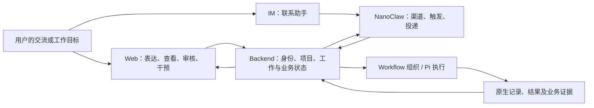

# 2026-09-30 Chat 业务与功能架构检视

状态：**完成本轮两层检视；改进建议未转为产品决策或实施计划。仅修改评审文档。**

本轮按用户明确的两个层次评估：① 整个 Chat 系统如何协同完成用户的事情；② Frontend、Backend、NanoClaw、Pi 各自内部的功能与职责是否合理。代码用于核实业务行为，不用文件大小、依赖数量或拆分目录代替业务架构判断。[代码架构复核](./2026-09-30-frontend-backend-nanoclaw-architecture-review.md)与[具体缺陷记录](./2026-09-30-project-code-documentation-review.md)保留为其他层次的历史证据。

**结论：Chat 已形成“与固定助手持续交流，并调用能力开展工作”的主干；长期任务、主题与群聊也有各自合理的业务对象。更需要收敛的是跨功能的关系：多个助手如何共同推进一个项目、不同入口如何呈现同一项工作的进展，以及何种证据意味着用户的目标已经达到。当前不宜仅依据这些问题重构代码或新建任务运行系统。**

依据包括 [Web 对象与交互](../../modules/web/chat-web.md)、[模块合同](../../architecture/chat-module-contracts.md)、[Project 管理](../../modules/projects/chat-project-management-design.md)、各 Long Agent 功能合同及下文源码。根仓库检视收尾基线 `d590cac81d93c3aff56cba4e8752852810335feb`；Frontend `12b16f12f748c21dd7344cb68bedd487d006d979`；NanoClaw `c14d98d096b962dc80ffadb7de0c2fd2f8215a04`；Pi `5b580155bc45123eb48f9b1e8bf46357f1239dd4`。本轮是文档与实现的定向核对，没有重新进行整套浏览器、真实模型或外部渠道验收，也不以仓库版本代表线上状态。

## 1. 整体架构：系统能否把用户的事情做完整

### 1.1 产品主线与各端分工

检视采用现行产品定位：用户可以围绕软件、学习、研究、生活等事务，与一个或多个长期助手持续协作。日常聊天是入口之一；一次聊天结束、一次模型运行结束，并不天然等于这件事结束。

| 系统部分 | 对用户承担的业务责任 | 与其他部分的协同边界 |
|---|---|---|
| Frontend | 表达意图、选择交流对象和项目、查看进展与成果、审核和干预工作 | 展示 Backend 确认的状态；切页面不改变已经接受的工作 |
| Backend | 确定谁在什么范围做什么，维护工作、上下文、权限和业务状态，组织执行 | Web 与 Agent Tool 共用领域服务；渠道事件也进入同一产品语义 |
| NanoClaw | 让助手在外部渠道可达，保存渠道消息，按时发出触发，投递结果，并管理 Group 自身资源 | 对接 Backend 的工作受理与执行；不决定项目目标是否完成，不再运行另一套模型循环 |
| Workflow / Pi | Workflow 组织一次工作的方法和步骤；Pi 承担实际 Agent 交互、工具调用与原生上下文 | 不拥有第二份项目进展、长期职责或渠道投递状态 |

这套分工在业务上成立，建议保留。TUI 是普通 Workflow 的另一个客户端入口；当前不把它描述成所有 Friend 功能均已覆盖的入口。依据：[当前组件边界](../../architecture/chat-current-architecture.md)、[TUI 合同](../../modules/tui/chat-workflow-tui.md)、[Nano/Pi 集成](../../modules/long-agents/chat-nanoclaw-pi-integration.md)。

### 1.2 需要共同理解的业务对象

| 对象 | 回答的用户问题 | 关键关系 |
|---|---|---|
| Friend / Long Agent | 我在和谁协作，谁持续负责？ | 同一身份可参与日常交流、后台工作和群聊；各场景的可见资料与能力不同 |
| Project | 我们在做哪件持续的事，资料和工作属于哪里？ | 承载项目身份、目录、配置与项目事实；不是某一个助手的私有聊天记录 |
| Session | 这段交流如何继续、回看和追溯？ | 固定存储归属；Friend 当日交流可以包含分别绑定不同项目的轮次 |
| 后台工作 Work | 这一次独立推进在做什么，结果在哪里？ | 有独立 Session 和执行记录，可由对话、任务或职责推进发起 |
| 定时任务 Task | 何时、由谁、按什么约定开始一项工作？ | 任务定义与每次发生分开；暂停未来触发不等于停止在途工作 |
| 长期任务 Duty | 持续目标是什么，进展、证据、下一步是什么？ | 复用 Task 和 Work 推进；一次推进完成不等于职责结束 |
| 群聊 Conversation | 哪些助手一起讨论，哪些内容在成员间公开？ | 成员参与、讨论和派生工作均有边界；不是 NanoClaw 的 Agent Group |
| 主题 Topic | 如何围绕一个问题整理上下文、分叉探索并继续？ | 节点是会话，关系和来源由主题图表达；不是另一种 Project 或任务调度器 |
| 结果与成果 | 做出了什么、能否打开核验、谁可以看到？ | 原生回答、项目文件、职责证据、笔记和动态各有用途，不能仅用运行终态代替 |

**值得保留的设计**：身份、工作空间、上下文、持续目标、触发和执行已经能够区分。问题主要在这些对象如何共同向用户表达一件事情，而非缺少更多对象。依据：[任务](../../modules/long-agents/tasks.md)、[职责](../../modules/long-agents/duties.md)、[群聊](../../modules/long-agents/group-chat.md)、[主题纠偏与收口](../../development/topic-mode-correction-plan.md)、[成果](../../modules/long-agents/deliverables.md)。

### 1.3 从用户场景检查协同

下表的“已有”表示合同与本轮核对的实现相符，不表示本轮重新执行了端到端验收。

| 场景 | 已有协同 | 业务闭环判断 |
|---|---|---|
| 与 Coder 聊天，中途从项目 A 切到 B | Frontend 选择下一轮项目；Backend 冻结该轮归属；Pi 延续同一日常会话 | 交流连续与工作范围分开，设计成立。不能把浏览项目、当前输入目标、历史轮次目标混成一个值 |
| 安排一项明天执行的工作，关闭浏览器后回来 | Chat 保存任务；Nano 发出触发；Backend 创建独立工作；结果与投递分别记录 | 已有持久任务链。用户必须能区分等待触发、执行完成和通知送达，不依赖页面在线 |
| 让助手长期推进学习 | Duty 保存目标、材料、进度证据和下一步；Task 唤醒；Work 推进 | 已有持续目标机制，不能仍将 LA3 一概列为未交付。已记录证据与达到学习目标仍需按目标判断 |
| 从旧讨论整理一个新问题，再分叉研究 | 整理 → 用户审核/修改 → 创建主题节点 → 公共聊天能力继续工作 | 现有创建审核和节点会话链已落地；旧计划中“尚未实现”的文字不能覆盖当前收口事实 |
| 邀请多个 Friend 讨论并做研究 | 群策略组织发言；独立参与上下文；群工作返回授权结果 | 讨论闭环已有；可执行的工作受群能力合同限制，不能由“同一个 Friend”推导为私聊能力全部可用 |
| 多个 Friend 分别推进同一项目，之后换助手接手 | 项目、Work、Duty、会话和结果已有稳定关联；项目工具可发现身份与简介 | 缺少统一的项目进展与续接视图，是跨功能最明显的目标差距；详情和执行权限仍须分别判断 |

主题链的实现核对见 [topic_manage](../../../src/tools/builtins/topic-manage/index.ts) 的 `request_topic`、[创建 Workflow](../../../src/workflows/topic-session-create/workflow.ts)；项目查询见 [Project 服务](../../../src/projects/management.ts)；后台工作与结果见 [Work 服务](../../../src/long-agents/work.ts)。没有将兼容代码中的旧创建路径当成当前新请求的主路径。

### 1.4 整体判断 B1：产品总纲仍包含两代模型，需要先统一业务基线

**类型：已确认的规范冲突；不是认定当前切项目实现有缺陷。**

[需求分析](../../architecture/chat-requirements.md) §2 第 25–30 项仍把共享 Daily、可跨日 Daily Session、切项目即创建或恢复另一 Session 描述为通用方向；现行 [Web 合同](../../modules/web/chat-web.md)与 [Long Agent 现状](../../modules/long-agents/chat-long-agent-roadmap.md)则采用 Friend 每日交流、固定存储归属和逐轮项目。Project-first 的数据约束与 Friend 为交流入口可以共存，冲突在于旧描述没有限定适用场景。

同类问题出现在能力状态：Long Agent 现状表仍有“职责、群聊尚未交付”的旧条目，而相应模块已有实施与验收记录；主题原计划仍写未达标，纠偏文档和当前主链已完成相应收口。

**业务影响**：新增功能可能分别沿“每项目一条 Friend 主会话”与“每天一条交流、每轮选择项目”设计；已有能力也可能被再次规划。多个模块各自正确，仍会拼出不同的产品。

**建议与验收**：下一轮先把产品总纲中的场景适用范围与能力状态核对清楚，再同步原权威文档。至少明确私聊、普通项目会话、后台工作、主题、群聊、IM 这 6 类入口的交流对象、项目来源、历史归属和续接方式。本报告只指出冲突，不直接重写规范或替用户批准新的模型。

### 1.5 整体判断 B2：项目仍偏向工作空间，跨助手的项目进展尚未形成统一视图

**类型：已有明确产品目标，当前查到的实现尚未闭环。**

例子：Nexus 推进学习，Coder 完成工具，Reviewer 留下待处理问题。用户进入该项目，应能知道“现在到哪一步、谁在做什么、有什么阻塞、从哪里继续”，不必依次翻每个 Friend 的日期、任务和群聊。

目前 Project 管理服务提供身份、简介、可用性、配置与能力；Work、Duty 和群工作各有事实，Friend 任务面板也能聚合该 Friend 的几类工作。但这些不等于跨 Friend 的项目概览。证据：[Project 管理合同](../../modules/projects/chat-project-management-design.md)、[Project 查询实现](../../../src/projects/management.ts)、[Friend 任务面板](../../../frontend/components/LongAgentTasksPanel.tsx)。已确认的共享认知目标明确要求参与者、工作状态、阶段、下一步、来源与可继续入口，见[共享认知场景 A1/A2](../../modules/long-agents/chat-long-agent-awareness-and-autonomy.md)。

现有项目选择器也有按 Session 聚合的运行中/未读计数。这是有用的活动提示，但不足以回答项目阶段、阻塞和下一步，不能据此宣称 B2 已闭环。

**建议与验收**：优先补一个从既有领域事实生成的项目视图，让 Web 与 Agent 查询相同来源。自动汇总真实工作状态；语义进展引用项目文档或经过确认的进度记录，并标注来源、更新时间与未知项。不要把消息数、执行次数或最近打开时间换算成完成度，也不要新建一份与 Duty、Work 竞争的任务库。概览可见、详情可读、实际可工作继续分开。

最小验收：两个 Friend 在同一项目产生工作后，用户和第三个获授权 Friend 都能查到同一组进展来源、阻塞与续接入口；权限不足时可清楚区分不可见和未发生。

### 1.6 整体判断 B3：“工作完成”的含义需跨功能对齐

**类型：已有局部闭环；一般工作场景的统一表达是本轮建议，尚非新产品要求。**

系统并非只有模型终态：Duty 已有目标、进度和证据；成果合同已验证笔记落盘或动态发布；渠道有独立投递回执。但专门的 Artifact 合同当前主要覆盖 `post/note`，一般后台工作主要通过原生回答和工作记录呈现结果。这些实现没有自动提供所有项目场景的统一验收含义。

例如“运行结束”“研究稿已生成”“稿件达到要求”“稿件已发布”和“用户已收到通知”是 5 个不同事实。文件存在也不能直接证明内容正确，职责结束也可能是用户终止而非目标达成。依据：[成果范围](../../modules/long-agents/deliverables.md)、[职责的目标与证据](../../modules/long-agents/duties.md)、[任务执行与投递](../../modules/long-agents/tasks.md)。

**建议与验收**：先选研究报告、代码修改这两类真实场景，明确需要保存的目标、结果位置、检查证据、待用户处理事项及继续入口。沿现有 Session、项目文件、Duty 与成果记录表达；是否需要通用结果摘要合同，取决于这两个场景能否由既有对象清楚回答，不先建设通用成果引擎。日常问答无需因此增加强制人工验收。

## 2. 模块内部：功能如何组织，职责是否完整

### 2.1 Frontend：按用户任务组织，页面不是独立业务系统

现有 6 个主入口是 Friend、项目、动态、群聊、主题、设置，源码见 [WorkspaceNavigation](../../../frontend/components/WorkspaceNavigation.tsx)。它们分别提供人物、事务、发布内容、多人交流、问题探索和配置的视角，并非同一种对象；并列导航本身不是问题，也不需要因此合并成一个页面。

| 内部功能组 | 应回答的问题 | 当前判断 |
|---|---|---|
| 交流与协作 | 找谁、在哪段上下文中继续？ | Friend、群聊、主题已有明确差异；共用聊天能力的方向正确 |
| 项目工作 | 当前是哪件事，资料、相关工作和进展在哪里？ | 项目选择、文件和普通会话已有；B2 的跨助手进展是主要缺口 |
| 工作跟踪与干预 | 在做、等待、失败的是哪项工作；暂停影响什么？ | Friend 日期视图、任务、职责与执行详情已有；应从同一工作关系导航，不让用户记住它最初出现在哪个页面 |
| 能力与设置 | 修改的是谁、哪个项目、什么能力，何时生效？ | 设置范围应沿既有有效配置来源展示，不把所有设置解释为全局偏好 |

内部改进重点是**关系可导航、状态可解释**，不是增加菜单。日期是查找视角，不是工作的身份；从项目、Friend、群聊打开同一结果，应能追溯到同一工作事实。新建 Friend 和安排后台工作保留既定的对话入口，不因本轮检视擅自添加创建表单。

这里是功能架构判断，没有对当前截图、按钮可发现性或完整交互可用性下新结论。具体 UI 体验仍需另按真实用户流程验证。

### 2.2 Backend：业务领域较齐全，需强化领域之间的关系

以下是职责地图，不是要求把每行拆成服务或新的目录。

| 领域 | 核心责任 | 应守住的业务边界 |
|---|---|---|
| Friend 与能力 | 长期身份、有效能力、启停与资源选择 | 身份持续存在，不等于模型持续运行；在不同场景可用能力不同 |
| Project | 事务归属、工作空间、项目资料与可见范围 | 项目事实不变成每位 Friend 各保存一份的私有记忆 |
| Session 与执行 | 交流连续性、接受、顺序、观察、停止与历史 | 执行过程不能代替目标或项目进度 |
| Work / Task / Duty | 一次推进、发生条件、持续目标 | 共用执行能力，分别拥有自己的生命周期；“暂停”“停止”“结束”作用对象明确 |
| 群聊与主题 | 成员公开协作；问题上下文整理与分叉 | 群成员资格不扩大私有资料权限；主题节点不另建执行模型 |
| 资源与知识 | Prompt/Rule/Skill、Personal/Project Memory、Agent Memory、会话记忆 | 规则、方法、历史事实与会话提炼各有用途；被发现不等于已选择或已授权 |
| 结果与渠道协作 | 结果来源、产物验证、投递状态与恢复 | 重试通知不重新执行工作；发布内容不能冒充项目进度 |

**判断**：这些领域大多已有实现入口，并非需要重新划分出一套体系。优先补齐 B2 的跨领域查询关系与 B3 的结果语义，再决定技术拆分。Web 操作与 Agent Tool 应继续表达同一种业务动作、读取同一事实。

知识功能也需从用户的问题检验：“刚刚记住的内容，下一次谁能用？”当前会话记忆、个人/项目 Memory、Nano Agent Memory 和 Rule 有意分域，不应直接合并；未来若提供“将这个结论用于其他工作”，需明确目标范围、来源和是否已生效。该建议属于跨功能解释与显式转存流程，不是在本轮要求自动同步所有记忆。依据：[上下文与资源模型](../../architecture/chat-context-resource-model.md)、[主题会话记忆](../../development/topic-mode-taskbook.md)。

### 2.3 群聊的跨模块问题 M1：身份复用，不代表能力完整复用

**类型：已确认的功能限制与产品取舍；不是绕过权限的理由。**

用户把熟悉的 Coder 邀请到项目群后，容易期待它沿用私聊中的专业资料、Skill 和工具。当前群场景默认不加载 Standing Instructions、私有上下文、Skill/Extension 等资源，也默认不注册工具；显式授权主要支持受限文件工具，Chat 系统工具允许集当前为空。依据：[群聊合同 §4](../../modules/long-agents/group-chat.md)、[作用域实现](../../../src/long-agents/scope.ts)。

因此当前能力适合公开讨论和已授权的有限项目操作；不能从“支持多个 Friend 协作”进一步推断为“多个完整私聊助手可以在群里完成任意项目工作”。独立参与上下文和隐私边界值得保留；业务上的疑问是：需要保留哪些可公开的专业角色能力，才能满足用户对这个群的用途预期？

**建议与验收**：先明确“讨论型群”与“实际项目协作”各自承诺的能力范围，核对能力检查、群管理和实际执行是否一致。后续如需群内 Skill 或更多操作，应通过原群作用域合同逐项扩展；不能直接加载私聊 Memory 或把所有工具放行。本轮未做群界面实测，不断言当前页面一定缺少相应说明。

### 2.4 NanoClaw：围绕长期身份接入、可靠触发与送达组织

| 内部功能组 | 在 Chat 产品里的价值 | 判断 |
|---|---|---|
| Channel / 路由 / Destination | 用户从正确的外部入口找到正确的 Friend，结果送回正确位置 | 保留渠道坐标，不把平台会话当成 Chat 项目或 Friend 身份 |
| 耐久 Inbox 与 Event | 断线和重启后仍知道哪些来信已经接受 | 接受与执行分开，符合离线仍能工作的产品需求 |
| 调度投影与 Trigger | 在约定时间给予任务执行机会 | Task/Duty 的目标与启停由 Chat 管理；Nano 不另存一套独立可编辑业务任务定义 |
| Outbound / Ack | 可靠交付已经产生的结果 | 渠道送达状态单独可查；投递失败不改变业务结果本身 |
| Agent Group / Workspace / Memory / Skill | 保留长期助手自身资源及渠道生态 | 一个 Group 对应一个 Friend；自身 Memory 不等于项目公共知识，资源通过明确合同进入执行 |

**判断**：NanoClaw 的业务位置成立，不是只剩一个消息转发器，也不应恢复为另一个任务决策或模型执行系统。内部扩展优先围绕渠道接入、可靠触发、送达和 Group 资源完成度。项目进度不清不能靠往 Nano 增加一份项目数据库解决。

跨入口的验收重点：Web 里选择的项目不被一条 IM 新消息隐式继承；通知重试不重复工作；用户能区分助手被停用、渠道不可用和工作失败。当前 IM 可用范围与真实外部收发验证必须分别声明，不能由 Host 健康推断所有渠道链路已通过。依据：[任务所有权](../../modules/long-agents/tasks.md)、[Nano/Pi 接缝](../../modules/long-agents/chat-nanoclaw-pi-integration.md)。

### 2.5 Pi 与 Workflow：保持执行能力清晰

Pi 的内部价值是通用 Agent 能力与原生上下文；Workflow 的内部价值是将一次工作组织为可观察、可审核的步骤。主题创建中的“整理—审核—创建”已经证明业务流程可以复用既有执行与审核能力，无需每个功能新增一个运行系统。

本轮没有发现要求改变 Pi 业务定位的证据。若增加“项目进展”“成果待处理”等产品状态，应由对应 Backend 领域维护；不能为了让某一页面方便读取，就把它们变成 Pi AgentSession 的第二套生命周期。依据：[Workflow 框架](../../modules/workflows/chat-workflow-framework.md)、[主题创建流程](../../development/topic-mode-correction-plan.md)。

### 2.6 建议的下一步与本轮验证边界

1. **先统一业务基线（B1）**：用 6 类入口核对总纲、模块合同和已实现范围。交付物是对象关系与场景合同，不先拆文件。
2. **优先补项目协作视图（B2）**：用“两个 Friend 推进，第三个接手”的完整故事确定最小范围；复用既有工作与进度事实。
3. **验证结果表达（B3）与群能力承诺（M1）**：选真实项目场景决定需要新增什么，保留不需要新增的部分，不直接引入通用成果引擎或更宽权限。

本轮只新增评审、更新历史索引及上一轮报告的层次说明。`pnpm check:architecture` 通过（191 个入口、1,753 条本地链接）；根仓库、Frontend、NanoClaw 的 `git diff --check` 均通过。不以这些检查证明业务闭环已通过，也不重述上一轮缺陷在新基线上的修复状态。业务代码、运行配置、正式数据与部署均未由本轮修改。
