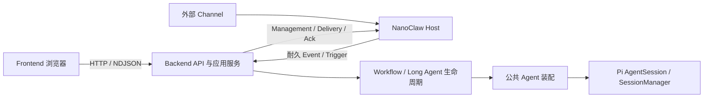

# 2026-09-30 Frontend / Backend / NanoClaw 代码架构复核

状态：**审查完成，改进建议待设计；未修改业务代码。**

本轮关注模块职责、依赖方向、状态归属、持久化边界和跨服务合同。第一轮发现的 8 项具体缺陷保留在[代码与文档问题记录](./2026-09-30-project-code-documentation-review.md)，不以该缺陷清单代替架构判断。

结论：**三层主干与唯一 Pi Runtime 的划分成立，建议继续保留。内部有 7 项需要收敛的架构问题，其中跨文件配置一致性、跨端协议约束已出现可复现故障；Frontend 编排集中、Backend 循环依赖和全局状态聚合主要是维护及扩展风险。NanoClaw 的 Runtime 隔离有实现和测试依据，后续重点是守住 Fork 接缝。**

## 1. 依据与范围

权威依据为[模块合同](../../architecture/chat-module-contracts.md)、[当前架构](../../architecture/chat-current-architecture.md)、[贡献方法](../../development/agent-contribution.md)、[Chat/Nano/Pi 合同](../../modules/long-agents/chat-nanoclaw-pi-integration.md)、[系统生命周期](../../architecture/chat-system-lifecycle.md)、[Frontend 开发指南](../../../frontend/docs/development.md)及 [Nano chat-pi 说明](../../../nanoclaw/docs/chat-pi-execution-driver.md)。本文记录审查判断，不替代这些规范，也不将建议写成已批准架构。

基线沿用第一轮记录中的 Root / Frontend / Pi / Nano Commit，包含当时工作区未提交改动。静态依赖扫描覆盖 `src/` 429、`frontend/` 228、`nanoclaw/src/` 235 个 TS/TSX 文件，共 **892 个**；排除常规 test/spec、声明文件和纯类型依赖，统计静态 import/export，未计入动态 import。统计集合仍可能包含命名未带 test 的测试辅助文件，不等于 892 个生产入口，也不代表每一行均已人工审计。

本轮追加 Nano 原生接缝测试和 2 个合成复现；未重跑第一轮已经执行的所有门禁。证据位于本机 `.data/verification/architecture-review-2026-09-30/`，含依赖图 JSON、扫描脚本、版本、测试日志和复现脚本。

## 2. 当前主干：值得保留的边界



| 边界 | 代码事实 | 评价 |
|---|---|---|
| Frontend → Backend | 浏览器请求封装位于 `lib/`，公共流读取在 `execution-stream.ts`；被查客户端路径没有引入 Agent Runtime | 成立；部分解析和请求仍留在组件/hook，见 A1 |
| Backend → Pi | `src/` 只有 `agents/pi-agent-session.ts:325` 一处底层 `createAgentSession()`；Workflow、Friend、群参与、维护调用公共装配 | 成立；不同生命周期包装不等于第二个模型 Runtime |
| Backend ↔ Nano | Chat 经 `nanoclaw-client.ts` 使用认证 HTTP；被查源码未见直接读取 Nano 数据库或依赖 `ncl.sock` | 成立；协议约束仍需联合验证，见 A5 |
| Nano → 执行归属 | `initializeAgentExecution()` 在实例级外部 Driver 存在时返回，跳过 Session Runtime 就绪和容器接管；Driver 注册拒绝实例级与 Session 级并存 | 成立；保持现有外部执行适配，不恢复另一套 Agent Loop |
| 耐久事实 | Pi 保存原生 Session；Chat 保存产品身份、执行受理及资源配置；Nano 保存渠道路由、Mailbox、调度投影和 Delivery | 分工合理；同一领域内部的聚合和提交边界仍有问题，见 A3/A4 |

Frontend 已有公共 reducer/传输工具，Backend 已有纯 Workflow Catalog、公共装配、Session 锁，Nano 已有 ExecutionDriver 和窄 Gateway。改进应优先复用这些现成边界。

## 3. 架构发现

### A1. Frontend：页面外壳、会话控制和数据读取过度集中

**性质：结构性维护风险；本项不以行数直接推导运行故障。优先级：中。**

| 文件 | 行数 | 文件内 useState / useEffect 调用数 |
|---|---:|---:|
| [AppShell.tsx](../../../frontend/components/AppShell.tsx) | 2,389 | 54 / 26 |
| [SessionSidebar.tsx](../../../frontend/components/SessionSidebar.tsx) | 2,438 | 48 / 16 |
| [useAgentSession.ts](../../../frontend/hooks/useAgentSession.ts) | 1,617 | 23 / 12 |

这 3 个文件合计 **6,444 行**。真正的问题是职责交叉：

- AppShell 同时负责布局、URL/历史恢复、Project/Session 切换、文件标签、分支面板和会话数据补全；约 684、895、1061 行直接读取 Session 列表。
- Sidebar 自己读取 overview、维护运行状态和轮询，又处理 Project、Worktree、文件浏览器和导航回调。选中会话、目录和运行集合还要与 AppShell 双向同步。
- useAgentSession 同时包含网络响应解析（约 245–409 行）、Workflow/Friend/Topic 请求分派、流观察、恢复、输入队列、配置与 UI 状态。一次跨入口参数变更需要理解整个控制过程，第一轮 Topic `promptCapture` 漏传就是这种变更面的实际例子。

已有 `session-preload` 和 `session-view-cache` 用于导航交接、请求合并和首屏，不应笼统判为“第二份事实源”；Backend 仍被重读校正。风险在于多个所有者靠 ref、刷新 key 和回调协调，容易遗漏失效与取消路径。

**建议方向：** 先将 Session 合同解析完整移入 `lib/`，再分离导航控制、Session 数据读取/观察、提交/取消控制与布局。沿用现有公共 stream reducer 和传输层，明确一个导航操作由谁发起、谁取消、谁刷新；新抽出的模块应能独立测试真实状态转换，避免仅把长函数搬进另一个文件。

**验收：** 同一会话首开/返回不重复请求；切项目、快速换会话、刷新恢复、断流及后台完成不会互相覆盖；Workflow/Friend/Topic 共用参数的合同逐入口验证。

### A2. Backend：配置、读模型与执行层存在 4 组静态运行时循环依赖

**性质：已确认依赖倒置，当前并未据此证明启动失败。优先级：中。**

静态 import/export 图有以下 4 个强连通分量：

```text
chat-config
  → workflows/registry
  → rule-management/index → workflow → step → chat-config

session-read-model → turn-feedback → live-turn → session-read-model

turn-queue → turn-controls / runtime → turn-queue

conversations/service ↔ conversations/access
```

最明显的是 [chat-config.ts](../../../src/chat-config.ts) 第 13–15、86–93 行：为验证 Workflow/Agent ID，依赖带执行函数的 Registry；后者又引入具体 Workflow/Step，最终回到配置读取。该文件的静态依赖闭包达到 **171 个本地模块**。这表示模块装载耦合，并不表示 171 个服务都被实例化或已测得性能退化。

[catalog.ts](../../../src/workflows/catalog.ts) 已明确提供无需装载可执行 Workflow 的声明式事实。配置层仍通过执行 Registry 验证，削弱了这条现成边界。`runtime-initialization.ts` 也已通过延迟加载规避部分 Nitro 初始化循环，说明后续不能依赖普通 Node 导入通过就推断 Builder/Step bundle 安全。

另一个明确倒置是 `live-turn.ts` 为使用消息投影函数引入 `session-read-model.ts`，而后者又读取活跃 Friend 执行。这把纯转换、Session 聚合查询与活跃执行句柄绑在一起。群聊 service 则仅为一个参与标记常量反向依赖 access。

**建议方向：** 配置验证依赖纯 Catalog；消息投影与 marker 常量下沉到无生命周期依赖的合同/转换模块；队列、控制与执行通过窄接口协作。优先拆这 4 组具体环，再增加禁止新增层间循环的门禁。

**验收：** 配置解析不再装载具体 Step；纯投影不依赖 live-turn；分别验证 Builder 转换、开发 Step bundle、生产构建和真实 Runtime，保留现有取消/引导/恢复语义。

### A3. Backend：身份事实跨文件双写，缺少完整提交边界

**性质：架构一致性缺陷，已动态复现。优先级：高。**

[storage.ts](../../../src/long-agents/storage.ts) 第 146–159 行的 `writeRegistrySplit()` 先逐个写所有 Agent 的 `definition.json`，最后写 `long-agents.json`。两处均保留 `id/name/description`；第 105 行读取要求完全一致。写队列保护并发写，读取不参与同一提交视图。

单个文件采用临时文件 + rename 是正确基础，但不能使一组文件原子可见。修改一个身份会经过“新 definition、旧 Registry”的窗口，还会重写未修改 Agent 的定义；在最终 Registry 更新前发生故障，可能留下持久不一致。

**复现：** 临时 Home、10 个合成 Agent，一次改名与 50 次正常读取并发，观测到 **9 次** `definition.json与登记身份不一致`，写入结束后名称正确。9/50 是一次调度下的观测值，不是固定故障概率；未使用正式配置。

**建议方向：** 明确完整身份的唯一权威文件，Registry 只作为可重建索引；如现阶段必须跨文件提交，采用有提交标志和恢复流程的事务目录/日志，读取同一个已提交版本。只给每个文件加原子 rename 或继续强化字段相等检查不足以解决问题。

此建议涉及持久化合同，实施前须完整核对配置文档及迁移/回滚；本轮未改变事实源或 Schema。

**验收：** 保存期间读取有一致结果；在每个写入阶段故障后重启可恢复；改一个 Agent 不使其他 Agent 配置不可读。

### A4. Backend：Long Agent 运行状态以整个 Chat Home 为一个聚合

**性质：规模与故障隔离风险，尚未进行容量基准。优先级：中。**

[LongAgentState](../../../src/long-agents/types.ts) 第 113–129 行把 8 类集合放在一起：works、nodeSessions、dailySessions、turns、projectAgents、bindings、pendingEvents、processedEvents。它们共用 `runtime/long-agent-state.json`。

[updateLongAgentState()](../../../src/long-agents/storage.ts) 第 287 行起按 Home 串行，读取/校验整份状态后整文件重写。因此不同 Friend、不同 Session 的队列虽能分别执行，任何状态变更仍竞争一个写入入口。`processedEvents` 有 10,000 项保留上限，但查到的 turn 写路径持续追加，反馈、队列和任务查询又频繁扫描 turns。

文件缓存降低重复读取成本，不能消除整文件写放大和共同损坏范围。现行单 Backend 部署下不应直接推断数据必然冲突；这些进程内队列也不能当作多进程写保护。

**建议方向：** 先定义 active turn、归档回执、日历和渠道 Inbox 各自保留/查询合同；由持久化服务提供按稳定 ID 的窄操作，调用方不直接更新整个 state。可评估按 Agent/领域分区或事务性存储，具体选择依据容量测量和跨集合原子需求，保持既有外部 ID 与 Pi Session 事实不变。

**验收：** 用合成数据测量 1/10/100 个 Agent、不同历史量下的接受与状态更新延迟；验证一位 Agent 的高负载或一份记录损坏不会拖垮全部 Friend。该项没有宣称当前线上延迟达到某个数值。

### A5. 跨层合同：校验器各自存在，但协议约束和接缝门禁未完全闭合

**性质：架构合同缺口，包含实际功能失败。优先级：高。**

Frontend、Backend、Nano 分别做运行时校验是必要的；需要收敛的是同一 wire contract 的字段、上限、版本和兼容测试。第一轮已复现 Topic 开关字段被 Backend 严格白名单拒绝。Nano 接缝还有具体证据：

- [Chat bridge](../../../src/long-agents/bridge.ts) 第 39–95 行按最多 10 张收集 ToolResult 图片，经 [Nano client](../../../src/long-agents/nanoclaw-client.ts) Delivery 发送，未对齐 JSON envelope 的总大小预算。
- [Nano Gateway](../../../nanoclaw/src/modules/chat-integration/gateway.ts) 第 14、111–112 行对 Delivery 使用 **1 MiB JSON body** 上限。
- 调用真实 Gateway 处理器，提供内存请求/响应替身和 **800 KiB** 合成附件，JSON 共 **1,092,562 字节**，返回 `400 request body exceeds 1048576 bytes`。拒绝发生在渠道投递前；没有实际发送，也没有验证真实图片解码。
- 当前 health 只验证 schema、ok、instanceId，不能证明任务投影、附件预算或其他新增操作兼容。保留基础健康的简单语义是合理的，新增能力不应靠健康成功推断。

本次另运行 8 个 Nano 原生接缝测试文件，**34 项中 33 项通过、1 项失败**：`chat-pi-delivery.test.ts:132` 的 Session manager mock 缺少生产代码已调用的 `resolveSession`。这是测试失配，不能据此断言生产投递必坏。父仓库 `verify` 有联合夹具测试，但未执行这组 Nano 原生测试；Nano 自己的 CI 有 Vitest，两者并未形成父仓库版本验收的完整接缝门禁。

**建议方向：** 为最关键协议建立同源 Schema/规范化 fixture 与两端兼容测试；校验器可以在各自仓库运行，规范来源和边界样本必须一致。纳入总字节预算、base64 开销、错误类型、新增字段兼容和能力版本。父仓库更新 Nano gitlink 或 Gateway 合同时执行选定原生接缝测试，再用真实双方 HTTP 实现做合成联验。

**验收：** 所有声明支持的请求都能越过提供方边界；超限请求在调用前明确反馈；同 revision 的合同双方接受集合一致；版本不匹配可诊断，健康检查不虚报功能可用。

### A6. NanoClaw：模式隔离正确，防线分散带来 Fork 维护成本

**性质：维护风险；未发现据此成立的第二 Runtime 旁路。优先级：中。**

关键边界已经正确落在 [ExecutionDriver](../../../nanoclaw/src/execution-driver.ts)、[启动选择](../../../nanoclaw/src/agent-execution-startup.ts)和 [Chat Driver](../../../nanoclaw/src/modules/chat-integration/execution-driver.ts)。但相同模式判断还分布在 `host-sweep`、`container-runner`、CLI groups、self-mod guard、approvals、group-init 和 container-configs。

这意味着上游新增一种容器/Provider 能力时，仅守住启动入口不足以覆盖后台 sweep、CLI 或自修改路径。当前测试确实覆盖了部分禁用行为，不能因源码仍含上游 Docker 模块就判为双 Runtime；真正风险是后续合并需要记住每个拒绝入口。实例为 chat-pi 时，调度时区仍借用 container-config 数据域，也应在维护账本中保持显式。

**建议方向：** 在现有 ExecutionDriver/Host 组合处集中表达“是否拥有本地 Agent Runtime、是否允许容器管理”等能力，CLI、sweep、自修改复用同一能力判断；保持 Chat 特有业务在 `modules/chat-integration/` 和窄合同内。扩展现有负向测试，要求 chat-pi 在所有这些入口都不会调用 Session Driver/Docker/Provider。

**验收：** 上游更新后以能力矩阵验证启动、wake、sweep、CLI、self-mod、approval 和停止；不可因 Chat 暂不可用而 fallback 到本地 Runtime。

### A7. 系统生命周期：组件停止与跨组件业务收尾之间仍有接缝缺口

**性质：文档已确认、尚未实施的架构能力差距。优先级：独立设计批次。**

[系统生命周期 §8](../../architecture/chat-system-lifecycle.md) 已明确没有跨组件业务排空。源码与该状态一致：Backend request 初始化启动同步/维护；Nano shutdown 停模块、delivery polls、Channel 并关闭 DB，尚没有与 Backend 协调“拒绝新工作—等待在途—保留结果投递—超时中断”的确认协议。

耐久 Inbox、Delivery/Ack 和重启恢复是现成保障，但不能据此声称正常停止已完成所有在途业务。反过来，也不能把正常重启中的 interrupted 都视作模型 Runtime 错误。

**建议方向：** 按现有生命周期文档设计有限的 draining 请求/状态查询，复用服务认证与稳定操作 ID；先保证所有入口关闭接受、在途与待投递状态可查询，再协调停止顺序。无需另建业务调度引擎。

**验收：** 隔离双进程在模型执行、Tool 执行、Delivery 待确认时分别停止；有界退出、可恢复且不重放已完成副作用。没有进行正式进程停止或真实渠道验收。

## 4. 建议推进顺序与边界

| 批次 | 内容 | 完成标准 |
|---|---|---|
| 1：事实与合同 | A3 身份完整提交、A5 协议预算/字段/接缝门禁 | 合成复现转为通过的业务回归；明确迁移与兼容策略 |
| 2：内部依赖 | A2 配置/执行解耦、纯 Session 投影；A1 前端合同与控制拆分 | 4 组指定循环解除；浏览器真实恢复/取消语义不变 |
| 3：规模与维护 | A4 状态聚合容量测量及存储方案；A6 Nano 能力矩阵 | 有容量证据、边界测试和持久化迁移方案 |
| 4：生命周期 | A7 跨组件 draining | 双进程故障/停止场景闭环，与现有启动停止入口共用语义 |

建议保留 Frontend 浏览器客户端、Backend 产品与生命周期、Nano 渠道 Host、Pi 模型执行的主干。当前证据支持模块内定向拆分、合同收敛和一致性治理；尚未形成拆分服务或更换底层 Runtime 的需求依据。

## 5. 本轮验证与未覆盖范围

- 静态依赖图：Backend 4 组循环，Frontend 本扫描范围内 0 组，Nano 1 组 CLI guard/registry 循环；Nano 的该局部环没有被当成跨 Runtime 违规。
- 真实配置服务并发读取复现：50 次中 9 次跨文件身份不一致。
- 真实 Nano Gateway 处理器 envelope 复现：800 KiB 合成附件对应请求被 400 拒绝。
- Nano 定向测试：8 文件、34 项，33 通过、1 测试 mock 失配；范围包含启动归属、Driver、HTTP Gateway、Backend client、任务投影、Agent Group 资源、恢复与投递。
- 沿用第一轮的 Backend/Frontend 测试、构建与 Runtime 证据，未宣称本轮重新执行或完整门禁全绿。
- 未逐行审计全部 Pi/Nano 上游实现；未运行完整上游原生套件、性能容量压测、付费模型、真实 IM 发送、生产停止或部署。

本轮只新增架构复核记录、补充历史索引及原记录互链；改进方案需要各自完成机制/合同设计后实施。
