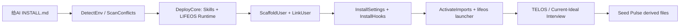
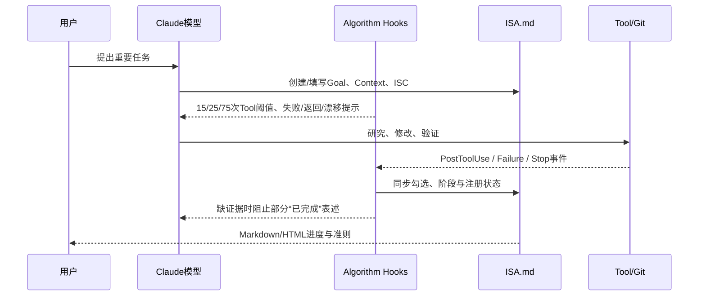
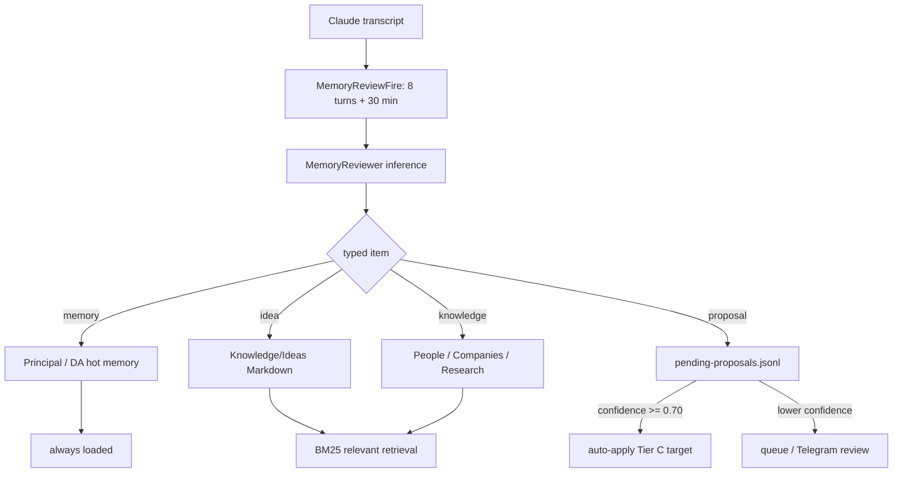
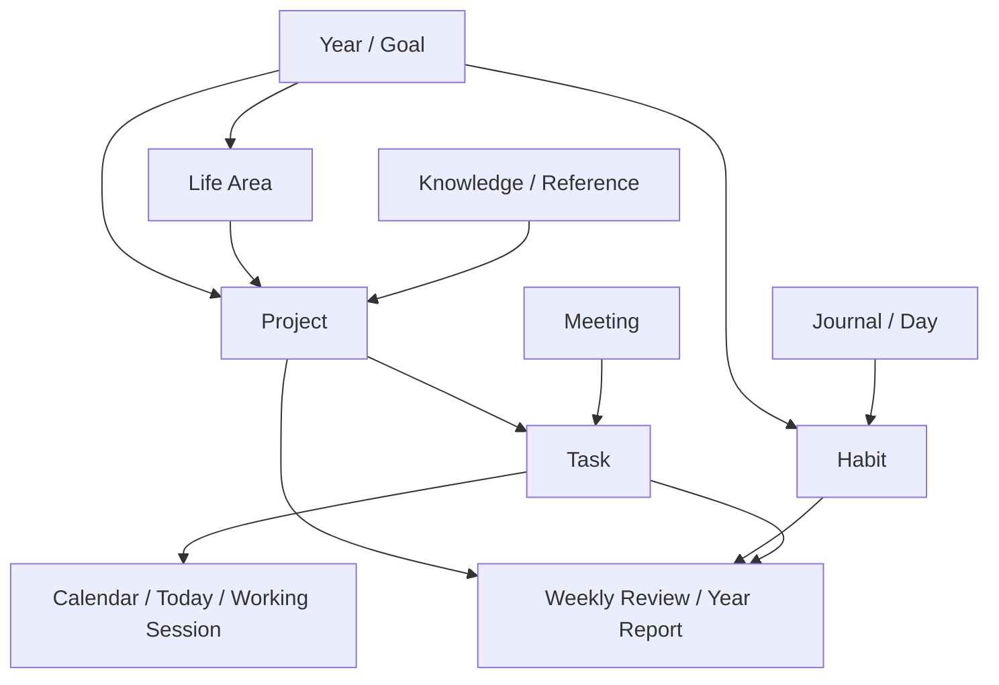

# LifeOS 深层研究：Daniel Miessler LifeOS 与 Better Creating Notion Life OS

> 状态：**经用户明确授权的有界深层研究；形成产品方法候选，不构成新增架构、Schema 或正式参考集授权**
>
> 研究日期：2026-07-27
>
> Daniel 源码固定点：`danielmiessler/LifeOS@d1d6240ce884dd70f5fc8333279ee6bbc21b96b1`
>
> 最新正式发布：`v7.1.1@a4e8e7466c5e01af1fff865c6ad4258282fac63e`，2026-07-13
>
> 本地只读检出：`/Users/xulater/Code/reference-agent-sources/danielmiessler-LifeOS`
>
> 关联总览：[类 LifeOS 产品方法与 Chat Harness 启发研究](./lifeos-product-method-research.md)

## 1. 先给结论

用户此前的判断基本正确，但需要加上两个限定：

1. **Daniel Miessler LifeOS 是目前研究对象中，在产品命题上最接近 Chat 的项目。**它不是把人生信息放进一个
   Dashboard，而是试图把用户身份、目标、偏好、工作方法、长期记忆、上下文召回、Agent Skill、执行纪律、后台
   维护和可视化统一进一个 AI Harness。
2. **它不是最适合 Chat 直接照搬的工程架构。**公开版实际是“Claude Code + Markdown 协议 + Hook + TypeScript
   工具 + 本地文件/Git + Pulse 单进程服务”的组合，完整能力明显偏 Claude Code；Product 事实、运行时状态、
   Evidence、Approval 和长期记忆没有 Chat 所要求的权威边界。
3. **Better Creating Life OS 代表另一半答案：成熟的人工作业协议和呈现。**它用 Notion 关联数据库把 Goal、Area、
   Project、Task、Meeting、Knowledge、Habit、Journal、Finance 和 Content 接起来，并通过 Today、Calendar、Review、
   Year Report 等视图推动使用；但协议仍主要靠人学习和维护。
4. **两者恰好构成 Chat 值得吸收的上下两层。**Better Creating 强在“人怎样理解、录入、查看和周期复盘”，Daniel
   强在“AI 怎样加载协议、召回上下文、执行 Skill、后台维护和投影”。Chat 的机会是把两者升级为有权威事实、
   revision、候选变更、HITL、Evidence、Trace 和失败恢复的产品闭环。
5. **Daniel 的公开版目前更像高速演进的高级玩家框架，而不是成熟大众产品。**它有真实代码、真实自动维护和活跃
   社区，但公开发行仍存在缺失私有模块、文档/实现漂移、路径假设、安装与升级缺口、无常规测试流水线等问题。
6. **Better Creating 的口碑更像“高价值、高学习成本、高个性适配风险”。**买家中有明确的强正反馈，也有已经购买、
   看完教程仍两周无法用起来的报告；Life OS 本体在 Notion Marketplace 只有 1 条评分，不能据此判断大众口碑。
7. **现有公开证据不能证明任何一套系统长期提升了大众用户的真实生活结果。**能证明的是方法、实现、一次可运行行为
   和自报体验；没有留存、持续使用率、目标达成率或对照实验。

一句话判断：**Daniel LifeOS 是 Chat 最接近的“概念与机制参考”，Better Creating 是最具体的“人工协议与视图参考”；
前者不应成为 Chat 的直接架构底座，后者不应被误认为自动维护系统。**

## 2. 研究问题、方法与证据纪律

### 2.1 本次真正回答的问题

1. 用户一次输入如何进入系统，经过哪些真实代码和状态载体，下一轮如何恢复？
2. Current → Ideal、TELOS、Algorithm、ISA、Memory、Skill、Pulse 分别是什么，哪些只是文档，哪些有运行时“牙齿”？
3. 学习、工作、生活、娱乐到底由哪些对象、关系、视图和周期动作承载？
4. 安装、更新、自定义、损坏、迁移和失败怎样处理？
5. 用户实际效果和口碑怎样，证据样本有多强？
6. 哪些机制 Chat 应采用、改造或拒绝？

### 2.2 证据标签

| 标签 | 含义 |
|---|---|
| `文档宣称` | README、官网、安装文档或作者说明 |
| `源码事实` | 固定提交中的入口、数据结构、写入和失败路径 |
| `运行实测` | 在隔离 HOME/配置根实际执行的结果 |
| `界面证据` | 官方产品截图或本地构建后真实页面 |
| `用户报告` | GitHub Discussion、Issue、Reddit、Marketplace 等自报体验 |
| `项目推断` | 由以上证据推导的设计判断，不能冒充实现保证 |

Daniel 的技术结论优先使用源码和隔离运行。Better Creating 是商业 Notion 模板，未购买模板实例，也没有数据库
Schema、公式和自动化源码；因此只能使用官网文字、官方截图、Notion Marketplace、演示视频元数据和用户报告。
本文不会根据截图编造隐藏字段、公式或后台自动化。

## 3. Daniel LifeOS 到底是什么

### 3.1 不是独立 App，而是装进 AI 编码 Harness 的个人运行层

固定提交中，Daniel LifeOS 由 7 类东西组合：

| 组成 | 公开版真实实现 | 作用 | 权威/状态载体 |
|---|---|---|---|
| Constitution | `LIFEOS_SYSTEM_PROMPT.md` | 输出纪律、安全、验证、Current→Ideal原则 | Markdown Prompt |
| Personal Context | `USER/PRINCIPAL`、`USER/TELOS`、`USER/WORK`等 | 身份、目标、偏好、生活/工作上下文 | Markdown、JSON、TOML |
| Algorithm / ISA | Algorithm v8.4.0、ISA Skill、`algorithm.ts` | 把“完成”写成可勾选准则，提示观察/计划/执行/验证 | ISA Markdown、sidecar JSON |
| Skills | 51 个Skill目录、911个安装文件 | 研究、写作、网页、知识、Interview、TELOS等方法 | Markdown + TypeScript |
| Hooks | 11类事件、安装后45条Hook项、72个Hook文件 | 上下文注入、Skill提示、记忆维护、验证门、安全门 | Claude Code settings + Hook状态JSON |
| Memory | MemoryTypes/System/Writer/Retriever/Reviewer | 对话后提取、写入、检索和提案 | Markdown、JSONL、快照、锁文件 |
| Pulse | Bun daemon + Next.js静态Dashboard | Cron、Telegram、语音、API、健康、生活/工作投影 | 文件读取、JSONL、进程内状态 |

因此它最像一个“AI Harness 发行版”，不是 Notion/Obsidian 插件，也不是拥有统一数据库和状态机的 SaaS。

### 3.2 “Harness agnostic”只有概念层和安装层较成立

`LifeOS/INSTALL.md:85-104`公开写明：

- Claude Code 通过 Hook 获得完整的 always-on 行为；
- Cursor、Cline、Codex、Gemini 等只通过`AGENTS.md`/rules加载上下文，工作流按需运行；
- Constitution 只有通过专用`lifeos`启动命令，把系统Prompt传给Harness，才真正加载；普通`claude`命令没有这层；
- 其他 Harness 没有等价 Hook 时只是“最接近的上下文加载”，不是同等语义。

这意味着项目真正可移植的是**文件协议和方法**，不是完整运行行为。完整产品当前仍然是 Claude-Code-first。

### 3.3 为什么作者会这样设计

`项目推断`：这种实现选择有清晰理由。

1. Markdown 可读、可Git版本化，用户和Agent都能编辑。
2. Claude Code 已提供Session、Transcript、Tool和Hook事件，不必先造完整Agent Runtime。
3. Skill把方法分发成模型可读文件，启动成本低。
4. 文件和Git允许高级用户Fork、自定义和回滚。
5. Pulse弥补“只在终端对话”缺少后台任务、移动入口和Dashboard的问题。

代价也来自同一选择：路径、Hook、Prompt、文件格式和文档相互引用后，系统没有一个编译器、Schema Registry或
事务层保证它们持续一致；模型既是执行者，又经常是协议解释器和维护者。

## 4. 5 条真实主链路

### 4.1 安装与Onboarding链路

`源码事实`：

1. `DeployCore.ts`把`install/skills/*`复制到配置根Skills，把`install/LIFEOS/*`复制到Runtime，并创建6个
   Memory目录。`copyMissing`保证已有文件不覆盖。
2. `ScaffoldUser.ts`从95个USER模板文件建立个人树；`LinkUser.ts`把系统树下的USER链接到单独数据目录。
3. `InstallSettings.ts`安装宽权限配置；`InstallHooks.ts`合并Hook并备份`settings.json`。
4. Setup不是一个确定性事务，而是一份给AI执行的Workflow。Shell/TypeScript工具承担步骤，AI负责顺序、授权、
   CLAUDE.md、launcher、外部依赖和Interview。

`运行实测`：在全新隔离目录按公开安装顺序执行：

- Core复制911个Skill文件、532个Runtime文件、创建6个Memory目录；
- USER复制95个文件；
- Hook安装写入11种事件、45条Hook项、72个Hook文件，并备份settings；
- 第二次Core安装复制数为0，基础覆盖操作具备幂等性；
- `ActivateImports`没有可激活内容，因为这组工具并未自行建立`CLAUDE.md`。

最后一点很重要：**“AI-native installer”实际意味着AI仍是安装编排器。**直接跑文档列出的工具不是一个完整、
自验证的安装事务。

### 4.2 一次“重要工作”的 Algorithm / ISA 链路

#### 文档层

Algorithm v8.4.0是一组Outcome/Claims合同。核心思想是先把理想结果写成ISC（Ideal State Criteria），再观察、
思考、计划、执行、验证，并持续修正“完成”的定义。

#### 运行时真正有“牙齿”的部分

1. `AlgorithmNudge.hook.ts:58-60`使用3个阈值：15次Tool调用未编辑ISA、25次Tool调用没有注册Run、75次Tool
   调用仍有开放准则。
2. 它在Tool失败、Agent/Research返回、用户中途改要求、ISA陈旧、消耗过大时向模型注入提示。
3. `VerificationGate.hook.ts:25-26`对3类可见完成声明提供阻断：网页已上线、交互流程可用、视觉正确；代码逻辑
   默认只记日志，事实声明不阻断。
4. `ISASync.hook.ts`读取Markdown frontmatter与checkbox，写入`MEMORY/STATE/work.json`并触发HTML投影。
5. `CheckpointPerISC.hook.ts`在显式Git allowlist中，可对新通过的ISC自动提交；默认allowlist为空。

#### 没有做到的部分

1. 它不是一个拥有持久节点、Lease、Attempt、Checkpoint和恢复状态机的Workflow Runtime。
2. 大多数Nudge是建议性additional context；Hook异常普遍fail-open。
3. ISA的事实源仍是Markdown和JSON sidecar，勾选准则没有与外部副作用、Evidence和批准形成事务。
4. `algorithm new`只生成0/0准则的ISA骨架；OBSERVE、ISC、计划和证据仍由模型填充。

`运行实测`：默认`~/.claude`布局下，CLI成功创建ISA，包含Goal占位、Context、Risk、Plan、ISC、Decision、
Changelog和进度字段；创建动作本身没有注册`work.json`，后续要靠真实Hook事件和模型编辑推进。

### 4.3 Memory 自动维护链路

#### 对象和召回

`MemoryTypes.ts`注册4种类型：

| 类型 | 写入语义 | 位置 | 召回 |
|---|---|---|---|
| memory | set-overwrite | Principal/DA Memory Markdown | 每次加载 |
| idea | append | `MEMORY/KNOWLEDGE/Ideas` | 相关时召回 |
| knowledge | append | People/Companies/Research | 相关时召回 |
| proposal | queue | pending proposals JSONL | 供应用/审批表面读取 |

`MemoryRetriever.ts:16-23,61-72`使用本地BM25-lite，不使用向量数据库；CLI默认Top 3、约500 token预算。
最新函数也提供Top-K、阈值、摘录长度和类型过滤。

#### 自动写入和治理

`MemoryReviewer.ts:445-468`会把普通Memory/Idea/Knowledge直接写入；proposal置信度达到配置阈值（默认0.70）
时，除了排队，还会直接编辑目标Tier-C文件并标成`auto-applied`。可提案目标包括身份、写作风格、定义、Canonical
Content、履历、操作规则、Projects和Contacts。

这证明它不是“概念上的自动记忆”，而是确有后台模型维护；同时也是对Chat最危险、最值得改造的部分：

- 模型提取结果不是候选事实，而可能直接成为长期事实；
- 置信度由同一推理调用产生，不是用户批准或外部证据；
- Pulse下一轮能显示新增/删除数量，但通常是事后可见，不是写入前授权；
- 身份、规则、项目和联系人不应因为模型给出0.70就自动改变。

#### 写入工程质量

Memory hot layer实现了锁文件、临时文件、`fsync + rename`、快照和JSONL审计，比简单`append Markdown`成熟。
但路径仍大量基于`homedir()/.claude`，与可配置Harness根冲突。

`运行实测`：

- MemoryTypes 52项smoke check通过；MutationTier 21项通过；KnowledgeSchema 29项通过；
- 默认`~/.claude`布局下MemoryWriter通过容量、重复、越界和路径保护测试；
- MemoryReviewer的12项解析/分发/E2E自测通过，最后1项因隔离环境没有真实Claude transcript失败；
- 自定义配置根下MemoryWriter寻找`$HOME/.claude`而失败，印证路径没有贯穿。

### 4.4 TELOS 与 Current → Ideal 链路

TELOS把人生上下文拆成Mission、Goals、Beliefs、Problems、Challenges、Strategies、Wisdom、Current State、Ideal
State、Health、Finances、Relationships、Creative、Rhythms、Freedom等Markdown。`InterviewIdealState.ts`不是对话
引擎，而是静态问题集和Agenda/完成状态记录；真正提问的是模型。

最关键的代码事实是：公开版“Gap”目前很浅。

1. `ComputeGap.ts:76-78`明确写着v1只做简单Markdown解析，未来才做语义提取；当前主要数`TBD`。
2. `UpdateLifeosState.ts:15-18`在Current State存在`have/partial/missing`时按`1/0.5/0`计算；否则使用
   `100 - TBD数量 × 10`。
3. 这衡量的是“模板填写/覆盖程度”，不是健康、财务、关系或自由的真实改善。

`运行实测`：全新模板在没有真实人生数据时，Money/Freedom/Creative/Relationships/Rhythms仍显示50%，因为每个
模板有5个TBD；Pulse页面据此展示“平均达到理想状态38%”。这在视觉上像人生状态评分，实际是模板完整度投影。

因此应分开评价：

- **Current → Ideal作为Agent的目标框架很强；**
- **当前公开版的定量Gap引擎不强，不能被当作真实人生测量。**

### 4.5 Pulse、Work 与后台运行链路

Pulse是Bun单进程，默认端口31337。它加载Voice、Hook、Observability、Telegram、iMessage、Syslog、Work、
Content、Local Intelligence、TELOS、Hypotheses、Memory、Projects、Assets、Usage、Doctor等模块，并提供Next.js
静态Dashboard和JSON API。

`源码事实`：Pulse文档自己明确写着“没有队列、没有AI triage、没有Channel abstraction；只是运行Job并路由输出”。
它更接近本地Daemon和文件投影层，不是可恢复的分布式执行平台。

`运行实测`：

1. Core安装没有为Pulse子目录安装依赖；单独执行`bun install`后服务才启动。
2. 首次启动时API可用，但Dashboard静态构建缺失，`/healthz`返回503并明确给出构建命令。
3. 构建Next.js静态站后，34个页面成功生成，`/`、`/telos`、`/life`、`/work`、`/knowledge`均返回200。
4. `/api/memory`能展示review cadence、pending/auto-applied proposals和Memory条目。
5. `/api/work`在新安装上要求运行`skills/_ULWORK/Tools/SetWorkRepo.ts`；这个`_ULWORK`私有Skill没有公开发布。
6. Dashboard能真实投影TELOS、Memory、Projects等文件，但公开新安装显示大量sample数据和未配置模块。

Work链路的公开缺口不是偶然：

- `WorkSweep.ts`会把TELOS Goal与GitHub Issue匹配、创建提醒和检查；
- 最后调用未公开`_ULWORK/Tools/RegenerateTasklist.ts`；
- Work配置文档也要求未公开`SetWorkRepo.ts`；
- Security Policy明确仓库是从私有源码树生成的public mirror，私有区会在发布时删除。

所以**作者本人使用的完整Work系统与公开用户拿到的Work系统不是同一套能力**。公开版可以手工配置GitHub Issue
投影，但不能把作者演示中的完整闭环全部归因于这个仓库。

## 5. 安装、升级、测试和安全成熟度

### 5.1 自定义配置根没有端到端成立

隔离测试使用非默认`CLAUDE_CONFIG_DIR`时：

1. DetectEnv、DeployCore、Scaffold、Link、Settings和Doctor能识别显式配置根；
2. MemoryTypes/Writer仍解析`$HOME/.claude`；
3. Pulse启动时仍读取`$HOME/.claude/LIFEOS/PULSE/PULSE.toml`；
4. `algorithm.ts`的相对导入仍假设`~/.claude/hooks`布局；
5. GitHub当前Issue [#1584](https://github.com/danielmiessler/LifeOS/issues/1584)正是“支持隔离CLAUDE_CONFIG_DIR”。

这不是“某条命令写错”这么简单，而是路径合同没有成为统一依赖。

### 5.2 Upgrade文案比实际迁移能力强

`LifeOS/Workflows/Update.md`描述了版本对比、系统重覆盖、Hook合并、USER增量模板、Import激活和验证。但公开
`LifeosUpgrade.ts`中的7个Migration全部是detect-only或`apply not implemented`，`--from-fresh-install`也明确未实现。

当前更真实的更新模型是：

- 系统文件通过release重新overlay；
- USER文件copy-missing、不覆盖；
- 用户定制和新系统版本之间的语义合并主要由人/AI处理；
- Git作为外层回滚手段；
- 迁移工具还不是可靠的自动升级引擎。

### 5.3 测试：大量自测函数，不等于常规测试体系

固定提交中：

- 没有`.test.ts`、`.spec.ts`等Bun标准测试文件；
- `bun test`实测返回`No tests found`；
- GitHub Actions只有Claude Code响应与Claude Code Review，没有build/test/typecheck发布门；
- 部分TypeScript工具内置`test`子命令和smoke checks，实际能抓容量、Schema、路径和解析问题；
- Next.js构建明确`Skipping validation of types`。

因此不能说“没有任何测试”，但可以说：**公开版没有一套能在每次提交/发布中证明安装、Hook、Memory、Pulse、
Algorithm和跨平台主链路的自动回归体系。**

### 5.4 安全：意识很强，权限面也很大

优点：

1. USER/SYSTEM分离、private release containment、Secret Scan、PreToolGuard、Egress、SystemFileGuard、Verification
   Gate和Doctor都体现了真实安全意识。
2. 安装工具大多dry-run优先、备份设置、copy-missing和dev-tree refusal。
3. 危险的根目录删除、curl-pipe-shell、force-push main等有deny/hard-deny。

风险：

1. `settings.system.json`默认允许写/改`~/.claude/**`和`~/Projects/**`；
2. 允许`git push/add/commit/rm`、`curl`、`ssh/scp/rsync`、`gh`、浏览器自动化等高权限命令；
3. 安全最终仍依赖高权限Coding Agent、Prompt/Hook规则和路径匹配；
4. 已关闭Issue曾报告MCP写入绕过、未接线Injection Inspector、日志/截图进入私有备份等问题。

Chat应吸收其“能力自检、写入分级、发布containment、完成声明验证”思想，但不能照搬默认权限面和Prompt安全边界。

## 6. Better Creating Notion Life OS 实际怎样落地

### 6.1 它不是插件，而是一组规范化数据库、关系、视图和使用仪式

[官方产品页](https://bettercreating.com/products/lifeos)当前把产品定位为Notion内的Complete Second Brain。官方
截图比功能清单更能说明它怎样工作：每个“页面”大多不是新事实库，而是对Master Database的Linked View。

从12张当前官方界面图可以确认以下对象与关系：

| 对象/页面 | 界面中可见的字段与动作 | 它解决的问题 |
|---|---|---|
| Goals | Goal编号、Year、Related Habits、Live/Achieved视图 | 把年度方向连接到习惯与执行 |
| Tasks | Date、Deadline、Project、Priority、Assignee、Status | 所有行动进入一个Master Task库 |
| Working Session | Start Work、End Work、Duration、In Progress | 把“任务存在”推进到“正在工作”并记录时间 |
| Projects | Tasks、进度、Last Reviewed、Next Review、Review Overdue、Time Tracked | 让项目有周期检查，不只依赖任务状态 |
| Life Areas | Direct Tasks、Live Projects、Related Goals等Rollup | 用长期责任域聚合项目/目标/行动 |
| Calendar | Tasks by Date、Projects Timeline、Tasks by Deadline | 同一行动按时间而不是主题呈现 |
| Meeting Notes | Meeting Task、Meeting relation、Assignee、Priority Matrix | 会议记录可直接产生关联行动 |
| Knowledge Base | Note/Reference、Process、URL、Tag、Reading Queue | 把资料变成可处理、可关联的知识对象 |
| Journal | Today’s Log、Entries This Year、Daily Productivity | 用Prompt和年度统计形成反思节奏 |
| Habit Tracker | Start New Day、Log Reading/Gratitude/Friend Chat、Related Goals | 每天创建Day记录再写习惯事实 |
| Finance | Financial Inbox、Budgets & Invoices、Subscriptions、Year So Far | 把收入、支出、续费和预算放入同一视图 |
| Content Manager | Channels、Calendar、Live/In Progress、Ideas、Published、Metrics | 把创作从想法推进到发布与指标 |

其关系本体可以概括为：

这套设计的核心不是数据库数量，而是4条关系链：

1. `Why`：Year/Goal/Life Area；
2. `What`：Project/Task/Habit；
3. `When`：Today/Calendar/Deadline/Working Session；
4. `Learn`：Meeting/Knowledge/Journal/Review。

### 6.2 用户每天、每周、每年怎样使用

根据官方页面和截图，最合理的真实使用链路是：

#### 日常

1. 用Quick Capture建立Task、Project、Meeting Note、Reference或Journal，不先寻找数据库。
2. 在Tasks & Action View筛选Today；需要专注时创建Working Session，点击Start/End记录耗时。
3. Calendar按日期、Deadline和Project Timeline投影同一批Task/Project。
4. 新的一天创建Day记录，再记录阅读、感恩、社交等Habit和Journal。
5. Meeting中的Follow-up直接成为Task，并保留Meeting来源。

#### 每周

1. 查看Project的Last Reviewed、Next Review和Review Overdue；
2. 更新项目是否仍Live、Task是否完整、目标是否一致；
3. 使用GTD Weekly Review清Inbox、处理Next Actions、陈旧项目和等待事项；
4. Knowledge中把Reference从Inbox/Reading推进到处理完成并关联Project/Goal。

#### 每年

1. 使用Guided Goal Setting创建Year和Goal；
2. 把Goal连接到Project、Task和Habit；
3. Year Report汇总相关进度、习惯和项目；
4. 通过年度回顾修订下一年目标。

这说明Better Creating不是纯Dashboard：它确实把GTD、Goal Setting、Periodic Review和关系数据库固化成一套人工
协议。问题是每个关系、状态和Review仍要人理解并持续操作。

### 6.3 Agent & Skills Hub 真正做了什么

官方当前截图显示，Life OS内置的是`Agent OS Instructions (Lite)`和`Agents & Skills Hub`：

1. 集中保存Master Agent Instructions；
2. 建立Agent Knowledge Database；
3. 为Specialist Agent维护Instruction、Knowledge Base和Skills；
4. 通过手工引用把这些指令和数据库交给Notion Agent；
5. 如购买完整Agent OS，需要用户把额外数据库、引用和Instruction Set手工接入Life OS。

它和Daniel/Chat的差别非常大：

- Hub是**Prompt、知识库和引用的管理页面**，不是独立Agent Runtime；
- Notion Agent拥有当前Workspace页面/数据库访问能力，但状态、Session、Tool、Approval和恢复由Notion平台决定；
- Life OS模板没有自己实现后台Memory Reviewer、Tool Hook或Run状态机；
- Notion AI/Agent当前需要Business或Education计划，官方也提示移动端能力有限。

因此它对Chat的意义是**Agent配置和用户可见呈现的参考**，不是Agent基础设施参考。

### 6.4 为什么采用Notion关系数据库

`项目推断`：

1. 同一Task可以同时出现在Today、Project、Goal、Calendar和Meeting，而不复制事实。
2. Relation/Rollup能把大量隐式规则变成可视关系，普通用户比目录/文件路径更容易看到。
3. Linked View允许作者为不同任务设计不同界面，而底层仍是少量Master Database。
4. 模板可一键复制，适合商业分发；用户复制后拥有Workspace并可任意定制。

这种设计同时产生3个结构性代价：

1. Notion允许用户改任何关系、视图、公式或数据库，系统缺少强Schema和Traceback；
2. 用户如果不理解Master Database与Linked View，很容易在错误位置新建库或改坏关系；
3. “完整”模板包含的对象和视图越多，Onboarding、认知成本和个性适配成本越高。

### 6.5 如何更新和维护

[官方FAQ](https://bettercreating.com/products/agentos)说明：Marketplace会提供未来更新，但不能自动更新用户已经复制并
定制的Workspace；用户必须重新Duplicate新版本。

所以真实维护模型是：

- 作者维护“全新模板版本”；
- 用户维护自己的已复制实例；
- 版本升级没有自动Schema migration或三方合并；
- 用户要在“保留定制”和“采用新模板”之间手工搬运；
- 邮件、视频、Guide和Discord承担售后与修复知识。

对Chat而言，这是一个应明确拒绝的升级模型：Protocol revision不能要求用户重新复制整套Harness，再手工迁移自己的
长期事实。

## 7. 口碑与实际效果

### 7.1 Daniel LifeOS：高热情、高贡献、高故障密度

#### 社区规模与维护速度

截至研究时点：

- GitHub约16,945 Star、2,295 Fork、245个Discussion；
- 最新200个Issue样本覆盖2026-05-12至2026-07-26，来自87个作者；
- 181个已关闭、19个仍开放；已关闭项中位关闭时间约62.3小时，50个在24小时内关闭；
- 标题关键词统计：安装/Setup 53个、Pulse/Dashboard 39个、Hook 22个、Memory 15个、Algorithm/ISA 14个；
- 2025-09至2026-07发布26个Release，2026-07-02至07-13的12天内发布6个版本。

解释要同时看两面：

1. 87个Issue作者和快速关闭说明社区真实参与、作者吸收反馈很快；
2. 安装、Pulse、Hook和Memory问题占比高，也说明公开发行主链路仍在快速修复；
3. Release频率体现创新速度，也提高文档、迁移和用户定制漂移成本。

#### 明确正向报告

[Discussion #542](https://github.com/danielmiessler/LifeOS/discussions/542)中，一位长期Power User把PAI与OpenClaw
并行使用，认为PAI在安全、深度个性化、Skill质量和复杂协作任务上更好；其自报已经成为生产力核心并开始带来
经济回报。讨论有24名参与者，其他用户也分享了Slack、Telegram、Tailscale和Heartbeat扩展。

这类反馈最可信的部分不是“变得更聪明”口号，而是具体工作分工：

- PAI适合人在终端共同推进复杂任务；
- OpenClaw类系统更适合移动入口、提醒、小任务和无人值守；
- PAI最有价值的是长期Context、TELOS和成熟Skill，而不是一个万能自治Agent。

#### 明确负向报告

同一Discussion中，另一位用户报告PAI与vanilla Claude Code的较系统对比：没有观察到结果质量改善，成本为
1.6x-2.8x；其真正想保留的是跨Session/Project意识和TELOS，而不是Algorithm。作者回应称自己的测试中Algorithm
与ISA明显胜出，并承认不同任务不都值得加载完整框架，6.x因此加强Native routing。

这组冲突非常有价值：

- **双方都认可持久Context/TELOS有价值；**
- **Algorithm的净效果没有形成独立共识；**
- 完整框架可能增加Token、时间和仪式成本；
- 必须按任务价值决定是否加载，而不能每轮默认运行最大协议。

#### Onboarding与可运行性报告

1. [Discussion #922](https://github.com/danielmiessler/LifeOS/discussions/922)：一位艺术/创意用户在Windows失败后
   转WSL，花约3小时手工安装Node、Claude CLI、zsh、unzip、Bun和PATH；认为“面向所有人”的愿景与终端要求冲突。
2. [Discussion #1461](https://github.com/danielmiessler/LifeOS/discussions/1461)：一位有经验工程师用数天迁移到v6，
   认为系统运行后强大，但从安装到可信状态必须读源码和试错；列出外部工具静默降级、Hook未接线、重复注册、路径
   漂移、文档领先发布等问题。共有7名参与者，多人确认相似痛点。
3. v7.1.1的Doctor/Install Awareness显然直接回应了上述反馈，说明维护者响应快；但当前Issue #1584、#1596、
   #1605、#1611、#1619仍分别涉及配置根、Hook接线、依赖、Proposal路径和源文件删除风险。

#### Memory口碑的深层信号

[Discussion #884](https://github.com/danielmiessler/LifeOS/discussions/884)记录了一次社区Memory生产者/消费者审计：
曾发现28个Writer、2个Context Reader和9个缺口，包括144个Summary写入却从未读取、40个PRD过期后不可见、部分
Learning/Research没有召回路径，以及多个目录无界增长。该讨论基于用户定制版本，不能直接等同当前v7.1.1；但它
很好地证明了LifeOS类系统的核心风险：**写入成功不等于未来能被正确召回，必须对Producer→Store→Retriever→Use
做端到端合同测试。**

#### 综合评价

Daniel LifeOS的口碑不是简单“好”或“差”，而是：

| 维度 | 判断 | 信心 |
|---|---|---|
| 产品愿景与启发性 | 很强 | 高 |
| 高级用户个性化价值 | 强，但依赖投入 | 中高 |
| Context/TELOS价值 | 多方认可 | 中高 |
| Algorithm净质量提升 | 证据冲突 | 中 |
| 安装/升级可用性 | 快速改善，但仍不稳定 | 高 |
| 非技术用户适配 | 当前较弱 | 高 |
| 社区和维护响应 | 很活跃 | 高 |
| 大众长期效果 | 没有足够数据 | 高 |

更准确的产品阶段描述是：**有真实价值和强社区的先锋型Framework，尚不是稳定、低维护、面向大众的Life OS产品。**

### 7.2 Better Creating：购买价值与复杂度同时成立

#### 可用口碑样本

1. Notion Marketplace的Life OS页面显示5.0，但只有**1条评分**；这不能支持“口碑很好”的统计结论。
2. Better Creating的独立AgentOS页面有4.9/5、86条评分；可说明作者的Agent产品家族有较多正向用户，但不能把
   AgentOS评分冒充Life OS评分。
3. [r/Notion购买讨论](https://www.reddit.com/r/Notion/comments/1goxt3k/has_anyone_bought_notion_life_os_bundle_from/)
   中，直接购买用户有人报告“改变生活”“明显提高生产力”“目标和Fitness最好用”“支持响应好”；同一讨论也有用户
   认为价格过高、必须深度定制、需要一边看Onboarding视频一边操作。
4. 至少一位已购买用户报告看了教程仍连续两周无法理解模板，寻求付费帮助；另一位初次使用者称产品“全面、最好，
   但作为第一个Notion项目很难理解”。
5. 一位Notion实施顾问指出，关联数据库系统损坏后Notion缺少Traceback，普通客户即使有文档也常难以自助修复。
   这是从咨询经验推断，不是Better Creating官方售后数据。

#### 为什么评价会两极

正面用户购买的是：

- 不用自己花数周设计数据库和关系；
- 一套已经连接Goal、Project、Task、Habit和Review的方法；
- 视觉完整的Dashboard；
- 教程、Guide和售后支持；
- 可按自己偏好继续定制。

负面用户承担的是：

- 约99-147美元起的模板价格，以及Agent/Chart可能需要的Notion付费计划；
- 大量对象、关系、视图和公式的学习成本；
- 模板作者心智模型与个人习惯不匹配；
- 自己改坏关系后难以诊断；
- 新版本需要重新Duplicate，不能自动合并现有定制和数据。

#### 综合评价

Better Creating Life OS很可能是“做得好的复杂Notion模板”，不是“低维护的自动LifeOS”。它最适合愿意完整Onboard、
持续使用GTD/Review、并愿意定制Notion的人；不适合希望买完即自动理解自己、不会维护关系、或只需要轻量Today/Task
的人。

公开证据没有用户留存、每日活跃、目标完成或长期生活改善数据。官网“7000+ Life OS用户”“更平静、更简单”的说法
只能标为Vendor claim，不能当效果证明。

### 7.3 按产品风险排序的问题

| 排名 | 问题 | 严重度 | 出现频率 | 证据信心 | 对Chat的建议动作 |
|---:|---|---|---|---|---|
| 1 | Memory模型结果可自动修改身份、规则、Project和Contact | Critical | Memory Review周期触发 | 高，源码 | 一律先生成候选；按影响进入HITL，提交绑定来源与revision |
| 2 | 文档、Hook注册、公开/私有模块与真实运行不一致 | High | 新安装、升级和特定能力调用 | 高，源码+Issue+实测 | 构建Declared/Registered/Observed三方Doctor，保证等级不可静默降级 |
| 3 | 文件Writer多于真实Retriever/Consumer，写入成功但未来不可见 | High | 跨Session和长期积累后 | 中高，历史审计+当前架构 | 每种长期写入必须有召回/消费合同与端到端测试 |
| 4 | Current→Ideal页面显示精确百分比，实际来自TBD/覆盖率 | High | 每次看Pulse | 高，源码+实测 | 所有指标展示口径、来源、新鲜度和未知，不得把填写度写成效果 |
| 5 | 完整Algorithm/Context可能增加1.6x-2.8x成本且净增益有争议 | High | 任务相关；重任务更常见 | 中，单个对比用户+作者相反报告 | 按任务收益路由Protocol和Context，持续做配对评测 |
| 6 | 更新依赖overlay/re-duplicate，用户定制没有可靠语义迁移 | High | 每个大版本 | 高，源码+官方FAQ | Protocol revision、Impact Report、Dry Run、Migration与Rollback成为一等能力 |
| 7 | Notion关联库全面但认知/修复成本高 | Medium-High | 日常使用和自定义时 | 中高，界面+多名用户报告 | 逐步启用对象与View，Chat承担关系建议、陈旧检查和修复解释 |
| 8 | Pulse/Notion Dashboard信息丰富，但下一步与保证等级可能不清 | Medium | 日常查看 | 高，界面+实测 | 以短Review和可执行Next Action为主，Dashboard只作投影 |

## 8. 谁更接近 Chat

下面的0-10分是基于本次证据的**启发式相关度**，不是产品质量排名：

| 维度 | Daniel LifeOS | Better Creating | Chat目标 |
|---|---:|---:|---|
| 跨学习/工作/生活的协议 | 9 | 8 | 10 |
| 对话作为主要入口 | 9 | 3 | 10 |
| AI自动维护Context/Memory | 8 | 3 | 10 |
| 人能看懂的对象和视图 | 6 | 9 | 9 |
| 权威事实与并发治理 | 3 | 3 | 10 |
| Approval/Evidence/Trace | 4 | 2 | 10 |
| Harness/Provider可替换 | 4 | 2 | 9 |
| 当前开箱稳定性 | 4 | 7 | 目标9 |

结论：

1. **Daniel最接近Chat的系统命题和运行机制。**它已经把“作者脑内协议”转成系统Prompt、Skill、Hook、Memory、
   ISA和Daemon，证明方向不是空想。
2. **Better Creating最接近用户真正会看见和操作的LifeOS对象模型。**它把Why/What/When/Learn投影成清晰页面，
   证明用户不应只面对聊天和文件路径。
3. **两者都没有解决Chat最难的可信闭环。**Daniel依赖文件/Hook/模型自律，Better Creating依赖人维护Notion；
   Chat必须拥有候选→审核→事务提交→Evidence→Trace→恢复的产品语义。

## 9. 对 Chat 的采用、改造与拒绝

### 9.1 直接采用的原则

1. **Current → Ideal，但不伪造百分比。**每个长期领域都要能表达Current、Ideal、Gap、下一步和Evidence；Gap未知
   就显示未知，不用模板完成度冒充真实生活进度。
2. **低摩擦Capture + 延迟类型化。**吸收Notion Quick Capture和Daniel transcript review，让用户先说/记，系统再
   生成带来源的候选。
3. **Goal → Area → Project → Work/Action → Evidence关系链。**学习、工作、生活、娱乐共用稳定核心对象，领域差异
   落在Protocol和View。
4. **周期Review是协议的一等组成。**吸收Project Last/Next Review、GTD Weekly Review、Memory cadence和Doctor。
5. **一份事实，多种投影。**对话卡、Today、Calendar、Project、Review、Markdown/目录都读取同一Product事实。
6. **Protocol对人和Agent都可读。**类似Skill/ISA/Agent Hub，但必须有Schema、revision、兼容范围和明确Tool权限。
7. **Capability Doctor。**对Provider、Tool、Channel、Memory、Workflow、Browser等区分live/broken/declined/stale，
   不允许静默降级后仍声称高等级保证。
8. **完成声明需要Evidence。**吸收VerificationGate的“上线、流程、视觉必须真实验证”，扩展为领域Evidence合同。

### 9.2 必须按 Chat 边界改造

| 参考机制 | Chat改造 |
|---|---|
| Markdown ISA checkbox | `Work/Plan/Step/Acceptance Criterion`权威对象；Markdown只是投影 |
| Memory Reviewer直接写 | 产生`MemoryCandidate`，显示来源、置信度、影响和过期策略；高影响事实先批准 |
| Hook additional context | Context Selection记录来源、版本、为什么采用、预算、排除和新鲜度 |
| Pulse文件Dashboard | REST读取各模块权威事实，View不复制/改写状态 |
| GitHub Issue作为Work | 外部绑定/投影；Product Work仍在Chat，避免双重事实源 |
| System Prompt Constitution | 可测试Protocol/Policy/Coordinator，不把全部保证压进Prompt |
| Notion relation和rollup | 稳定ID、typed relation、revision、CAS、迁移和Trace |
| Template duplicate update | Protocol revision + Impact Report + Dry Run + 分批迁移 + 回滚 |
| Hook fail-open | 按风险分级；高影响授权/副作用门必须fail-closed并提供恢复路径 |

### 9.3 明确拒绝

1. 以一个巨大系统Prompt要求模型每次记住所有规则。
2. 用“置信度≥0.70”自动修改用户身份、项目、操作规则或联系人。
3. 把Markdown、JSONL、Git提交或AG-UI Snapshot当作Product权威事实。
4. 用TBD数量、填写覆盖率或模型主观评分冒充真实人生效果。
5. 默认给Agent整个个人系统和Projects目录宽写权限。
6. 把作者私有模块支撑的演示当公开产品能力。
7. 每次模板升级要求用户复制新系统并手工搬数据。
8. 一开始把完整LifeOS强加给所有人；应从用户当前瓶颈逐步启用协议模块。

## 10. 对 Chat 产品落地最重要的 6 个新启发

### 10.1 Harness不是目录，而是“长期事实 + 协议 + 运行维护”

Daniel证明只有Context文件不够，还要Hook/Reviewer/Doctor/Pulse；Better Creating证明只有Agent也不够，还要用户可见对象、
关系和Review。Chat Harness应同时拥有：事实、协议、触发器、Context策略、执行策略、Evidence、Projection和Lifecycle。

### 10.2 每个自动写入都必须有对应召回和消费合同

Memory审计的28 Writer/2 Reader是最重要的反例之一。Chat新增任何Memory、Learning、Artifact或Review写入前，都要回答：

- 谁在什么场景读取？
- 如何检索、排序和去重？
- 没被消费多久后算陈旧？
- 来源失效怎样传播？
- 哪个测试证明写入→召回→使用完整成立？

### 10.3 Context要按任务收益选择，不是每轮最大化

用户报告中最稳定的共识是Context/TELOS有价值，而完整Algorithm是否增益有分歧。Chat应建立Context与Protocol路由的
成本模型：只有任务确实受用户历史、目标、偏好或长期工作影响时才注入；简单通用任务走轻量路径。

### 10.4 Review应成为系统发起的短对话

Better Creating把Weekly Review做成页面和Overdue字段，Daniel把Memory Review做成后台Hook。Chat可以把两者合并：
系统检测陈旧/冲突后，在对话中展示3-7个高价值处置项，让用户完成、取消、重排、修正或授权，而不是打开巨型Dashboard
自行巡检。

### 10.5 Projection必须公开“这个数字怎么来的”

Pulse的38%理想状态在视觉上非常有说服力，但源头只是模板TBD计数。Chat所有进度、风险、健康、信心和推荐都应可展开
看到口径、来源、时间、新鲜度和未知项；未知比假精确更可信。

### 10.6 个性化覆盖必须与系统升级可合并

Daniel的private/public overlay和Better Creating的template duplicate都在处理“系统模板 vs 用户个性化”，但都没有完整
解决语义迁移。Chat的Protocol Pack必须从第一天区分：系统定义、用户参数、用户事实、实例运行和Projection；升级只改
其拥有的层，并对其他层提供可审核Migration。

## 11. 可体验建议

### 11.1 Daniel LifeOS

不建议现在直接装进真实`~/.claude`并作为日常主系统。更有价值的是在隔离用户目录体验4个场景：

1. 完成TELOS Interview，观察输入怎样生成Current/Ideal和Principal summary；
2. 用一个真实中等任务跑ISA，记录创建准则、修订准则和验证门是否真的帮助；
3. 连续20轮对话后观察Memory Reviewer写了什么、召回了什么、错误怎样纠正；
4. 查看Pulse的TELOS/Memory/Work，逐个追溯每个数字和状态来源。

验收不看“界面是否酷”，而看：纠正次数、无用Context、Token/时间增量、错误长期写入、遗漏召回、恢复成本和用户控制感。

### 11.2 Better Creating

如果愿意付费体验，先购买Simplified版本而不是完整Bundle更适合研究基础协议；如果重点研究Agent Instructions，则单独研究
AgentOS。体验时连续使用7天并只记录：

1. Capture平均几步；
2. Task是否真的从Goal/Project/Meeting正确出现；
3. Project Review是否发现陈旧事实；
4. 哪些关系/字段必须靠自己记；
5. 删除一个视图或改一个Relation后怎样恢复；
6. 新版本Duplicate后个性化内容怎样迁移。

不要把“复制模板后看起来完整”当成体验完成。

## 12. 证据索引

### 12.1 Daniel 源码入口

固定提交：`d1d6240ce884dd70f5fc8333279ee6bbc21b96b1`。

| 主题 | 关键路径 |
|---|---|
| 安装/Harness差异 | `LifeOS/INSTALL.md`、`LifeOS/Workflows/Setup.md`、`LifeOS/Tools/*.ts` |
| Constitution | `LifeOS/install/LIFEOS/LIFEOS_SYSTEM_PROMPT.md` |
| Algorithm | `LifeOS/install/LIFEOS/ALGORITHM/LATEST`、`v8.4.0.md` |
| ISA | `LifeOS/install/skills/ISA/SKILL.md`、`hooks/ISASync.hook.ts`、`TOOLS/algorithm.ts` |
| Runtime提示 | `LifeOS/install/hooks/AlgorithmNudge.hook.ts` |
| 验证门 | `LifeOS/install/hooks/VerificationGate.hook.ts` |
| Memory | `TOOLS/MemoryTypes.ts`、`MemorySystem.ts`、`MemoryWriter.ts`、`MemoryRetriever.ts`、`MemoryReviewer.ts` |
| Memory触发 | `hooks/MemoryReviewFire.hook.ts`、`MemoryTurnStart.hook.ts`、`LoadMemory.hook.ts` |
| TELOS | `install/USER/TELOS`、`InterviewIdealState.ts`、`ComputeGap.ts`、`UpdateLifeosState.ts` |
| Work | `TOOLS/WorkSweep.ts`、`PULSE/modules/work.ts`、`DOCUMENTATION/Work/WorkSystem.md` |
| Pulse | `PULSE/pulse.ts`、`PULSE/modules/*`、`DOCUMENTATION/Pulse/PulseSystem.md` |
| 权限/安全 | `settings.system.json`、`SECURITY.md`、`hooks/PreToolGuard.hook.ts` |
| 升级 | `Workflows/Update.md`、`TOOLS/LifeosUpgrade.ts` |

### 12.2 Daniel 社区与发布

- [官方仓库](https://github.com/danielmiessler/LifeOS)
- [v7.1.1 Release](https://github.com/danielmiessler/LifeOS/releases/tag/v7.1.1)
- [Discussion #542：PAI与OpenClaw并行使用](https://github.com/danielmiessler/LifeOS/discussions/542)
- [Discussion #922：愿景与安装现实](https://github.com/danielmiessler/LifeOS/discussions/922)
- [Discussion #1461：工程师Onboarding friction log](https://github.com/danielmiessler/LifeOS/discussions/1461)
- [Discussion #884：Memory Writer/Reader审计](https://github.com/danielmiessler/LifeOS/discussions/884)
- [Discussion #1481：Algorithm/ISA术语和文档漂移](https://github.com/danielmiessler/LifeOS/discussions/1481)
- [Issue #1584：自定义CLAUDE_CONFIG_DIR](https://github.com/danielmiessler/LifeOS/issues/1584)
- [Issue #1596：文档声明Hook与实际接线不一致](https://github.com/danielmiessler/LifeOS/issues/1596)
- [Issue #1605：MemoryGraph依赖未发布](https://github.com/danielmiessler/LifeOS/issues/1605)
- [Issue #1611：Proposal目标路径导致静默丢失](https://github.com/danielmiessler/LifeOS/issues/1611)
- [Issue #1619：大小写不敏感系统删除TELOS源风险](https://github.com/danielmiessler/LifeOS/issues/1619)

### 12.3 Better Creating

- [Notion Life OS官方产品页](https://bettercreating.com/products/lifeos)
- [官方演示视频：How I Organise My Life Using Notion: In the AI Era](https://www.youtube.com/watch?v=CE1eiitVSyc)
- [Notion Marketplace Life OS页面](https://www.notion.com/templates/notion-life-os)
- [AgentOS官方产品页](https://bettercreating.com/products/agentos)
- [购买者讨论](https://www.reddit.com/r/Notion/comments/1goxt3k/has_anyone_bought_notion_life_os_bundle_from/)
- [早期用户讨论](https://www.reddit.com/r/Notion/comments/vrwhi8/better_creating/)
- [跟随教程构建时的Linked Database困惑](https://www.reddit.com/r/Notion/comments/1ija8tf/better_creating_build/)

## 13. 最终判断

Daniel LifeOS真正证明了3件事：

1. 用户个人Context、目标、协议、Memory、Skill和后台维护可以被打包成Agent可执行Harness；
2. 协议可以不只靠人记忆，而由Hook、Reviewer、Doctor和Projection持续执行；
3. 对话之外仍需要可读文件、可见准则、Dashboard和周期维护。

它也证明了3个反面：

1. 用文件、Hook和Prompt承载全部产品语义，会产生接线、路径、版本和Producer/Consumer漂移；
2. 自动记忆如果没有候选、授权和Evidence，会把“维护”变成高风险长期写入；
3. 作者自己的私有系统、公开发行和文档如果边界不清，用户会把愿景误认为已交付能力。

Better Creating真正证明的是：用户需要一个清晰可见的Why→What→When→Learn对象网络，Quick Capture、Today、Calendar、
Project Review和Year Report可以把抽象方法变成日常动作。它没有证明人愿意长期维护几十个关系和视图，更没有证明
Notion Agent会自动维护它们。

所以对Chat最正确的方向不是“复刻Daniel LifeOS”或“做一个Notion Life OS”，而是：**用Chat权威Product Store承载
长期事实，用可版本化Protocol表达方法，用MAF/Worker执行Run，用AG-UI表达实时交互，用候选/HITL/Evidence/Trace治理
自动维护，再把对话、Today、Project、Calendar、Review和人类可读文档做成同一事实的投影。**
