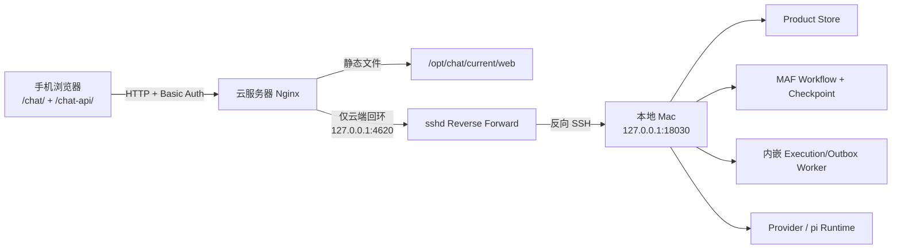

# 手机公网访问与云端中转运行手册

## 1. 已兑现的用户能力

手机通过云服务器公网 IP 打开完整 Chat Web，不是单独的“手机版聊天页”：

1. 对话、Product Session 和持续协作主 Workflow。
2. 每次真实模型调用的可读编辑与逐次审批。
3. Workflow 实时状态、选择分支、节点公开输入/输出和运行事实。
4. Project、Work、Knowledge 等 Chat Harness 权威资源视图。
5. 会话、Workflow、Agent、Tool、HITL 和系统配置入口。

当前入口：

```text
http://121.43.113.236/chat/
```

访问账号是 `later`。密码只保存在本机被 Git 忽略的
`backend/.data/deployment/chat-http-access-password`，不得复制进文档、
日志、浏览器响应或 Git。

## 2. 当前部署边界

这是经用户批准的 **公网 IP + HTTP 验证阶段**，不是最终安全形态：

1. Nginx Basic Auth 可以阻止匿名访问，但 HTTP 不加密账号、聊天内容和审批内容。
2. Basic Auth 只是云端边缘访问门，不是 Chat 的 Product `Principal`、
   `Role/Grant` 或 `Authentication Session`。
3. Product Store、MAF Checkpoint、私有 Provider 配置和模型密钥仍只在本地 Mac。
4. 公网 HTTP 不是浏览器安全上下文，标准 PWA Service Worker 和“安装到桌面”
   不能作为已兑现能力；当前可使用完整响应式 Web。
5. 进入长期日常使用前仍应迁移到 HTTPS，并实现正式 Product Identity。

Basic Auth没有产品级登录会话。浏览器保存的边缘凭据被清理或失效后，已加载或已缓存的
PWA/Web App Shell仍可能显示，但REST和AG-UI请求会统一收到带`WWW-Authenticate`的`401`。
前端会把它显示为“登录状态已失效”，而不是普通断网或后端故障。

## 3. 运行拓扑



关键安全边界：

1. 本地 Uvicorn 只监听 `127.0.0.1:18030`。
2. 反向端口显式绑定云服务器 `127.0.0.1:4620`；服务器
   `GatewayPorts no`，公网不能直连该端口。
3. Nginx 同时保护 `/chat/` 和 `/chat-api/`。
4. Nginx 完成 Basic Auth 后会清空上游 `Authorization`，边缘口令不会被
   FastAPI 当作产品授权凭证。
5. AG-UI SSE 关闭 Nginx 响应缓冲，读写超时为 21 分钟。
6. `/chat/auth-refresh.html`使用相同Basic Auth保护并返回`Cache-Control: no-store`；
   它被明确排除在PWA预缓存和Navigation Fallback之外，确保顶层文档导航可以重新触发
   浏览器认证挑战。认证成功后只返回`/chat/`，不会自动重放Provider、Tool或写请求。

## 4. 为什么当前只运行两个本地守护进程

本地 LaunchAgent：

| Label | 职责 |
|---|---|
| `com.later.chat.backend` | 运行 `backend.app.asgi:app`；包含 FastAPI、MAF 和当前内嵌 Execution/Outbox Worker |
| `com.later.chat.cloud-relay` | 维持反向 SSH，断线后由 launchd 重启 |

当前是单用户、本地 Mac 运行场景。把 API、Execution Worker 和 Outbox Worker
立即拆成三个守护进程不会增加用户能力，反而增加启动顺序、多进程日志轮转和故障面。
已有独立 Worker 入口继续保留；出现负载隔离、独立扩缩或升级不中断要求时再切换。

## 5. 安装、发布与验证

所有 Python 命令都使用项目 `.venv`，不使用系统 Python。

### 5.1 安装或重装本地常驻链路

```bash
scripts/install-mobile-relay.sh
```

脚本会：

1. 校验项目 `.venv`、私有配置、SSH Host Key 和免密 SSH。
2. 拒绝覆盖已被其他进程占用的云端中转端口。
3. 生成并校验两个 LaunchAgent。
4. 等待本地 `/api/ready`。
5. 启动反向 SSH，再从云服务器回环地址验证 `/api/ready`。

运行定义保存在：

```text
~/Library/LaunchAgents/com.later.chat.backend.plist
~/Library/LaunchAgents/com.later.chat.cloud-relay.plist
```

### 5.2 构建并发布不可变 Web 版本

```bash
scripts/deploy-mobile-web.sh
```

脚本会：

1. 使用 `VITE_WEB_BASE_PATH=/chat/` 和 `VITE_API_BASE_URL=/chat-api` 本地构建。
2. 运行前端包体门，不在资源受限云服务器上安装 Node 依赖或构建。
3. 生成或复用本机私有访问口令，只上传 Apache MD5 Hash。
4. 上传静态归档和 Nginx Location。
5. 在云端备份旧站点配置、Snippet、口令文件和 `current` 目标。
6. 安装不可变版本到 `/opt/chat/releases/<UTC时间>/web`。
7. 规范化静态文件所有者与权限。
8. `nginx -t` 成功后才重载并切换 `/opt/chat/current`。

云端备份位于 `/var/backups/chat/<UTC时间>/`。

### 5.3 运行验收

```bash
scripts/verify-mobile-relay.sh
```

验收必须同时满足：

1. 两个 LaunchAgent 处于运行状态。
2. 本地和云端回环 readiness 都成功。
3. 公网未提供口令时返回 `401`。
4. 提供口令后 `/chat/` 和 `/chat-api/api/ready` 都成功。
5. `/chat/auth-refresh.html`未提供口令时返回`401`，认证后返回`Cache-Control: no-store`。

### 5.4 停止本地常驻链路

```bash
scripts/uninstall-mobile-relay.sh
```

该脚本只卸载两个精确 LaunchAgent，不删除 Product Store、私有配置、口令或日志。

## 6. 诊断与恢复

本地日志：

```text
backend/.data/logs/mobile-relay/backend.stdout.log
backend/.data/logs/mobile-relay/backend.stderr.log
backend/.data/logs/mobile-relay/cloud-relay.stdout.log
backend/.data/logs/mobile-relay/cloud-relay.stderr.log
```

常用只读检查：

```bash
launchctl print "gui/$(id -u)/com.later.chat.backend"
launchctl print "gui/$(id -u)/com.later.chat.cloud-relay"
curl -fsS http://127.0.0.1:18030/api/ready
scripts/verify-mobile-relay.sh
```

故障语义：

| 故障 | 用户可见结果 | 恢复 |
|---|---|---|
| SSH 短暂断开 | `/chat-api/` 暂时不可用，静态页仍可打开 | launchd 重建 SSH；同一 Product Store 与 Runtime Journal 继续 |
| 本地后端退出 | API 暂时不可用 | launchd 重启后端，执行恢复由已有 Runtime/Checkpoint 语义决定 |
| 本地 Mac 关机或断网 | 云端静态页可打开，API 不可用；前端禁止离线发送 | Mac 和网络恢复后 Relay 自动重连 |
| Web 新版本失败 | Nginx 不应切换到未通过语法检查的配置 | 使用 `/var/backups/chat/<release>/` 和前一不可变 Release 回滚 |
| Provider 失败或结果未知 | 继续使用现有 Product Run/Attempt 失败语义 | 不因 Relay 重连自动重发 Provider 请求 |
| Basic Auth凭据失效 | 已加载/PWA缓存界面显示“登录状态已失效”，REST/AG-UI停止在401 | 用户点击“重新登录”，经不缓存的顶层文档完成认证后返回Chat；不自动重放任何执行 |

Relay 重连只能恢复传输，不会把 Provider 调用、Tool 副作用或 Product 提交冒充
Exactly-once。实际恢复仍以 Product Run、Runtime Job、Checkpoint 和 Provider Attempt
权威状态为准。

## 7. 2026-07-24 验证证据

1. 云端中转端口只监听 `127.0.0.1:4620`。
2. Relay 进程被终止后出现短暂不可用，launchd 以新 PID 自动恢复并重新返回 200。
3. 后端进程被终止后出现短暂不可用，launchd 重启、Product Store readiness 恢复。
4. AuditTraceAI、Mini-Claw 和 Nginx 仍为 active，Nginx 配置检查通过。
5. 390×844 真实浏览器无横向溢出，控制台 0 错误；对话、资源、配置、Workflow
   运行视图和节点内容均可操作。
6. Product Session `PS-53F42E0E` 从公网创建并发送，意图识别、协作响应和回合主题
   提取 3 次真实模型调用逐次审批，最终回复 `MOBILE_RELAY_E2E_OK`。
7. 对应 Product Run 成功、Session revision 为 2，正式 Project、Work 和 Accepted
   Memory 均保持 0。
8. 原临时`/chat-pwa-http-test/`入口已退役并跳转到正式`/chat/`；旧静态目录、
   Snippet和站点配置保留在云端时间戳备份中。

## 8. 2026-07-29 认证恢复发布证据

1. 本地后端和反向SSH LaunchAgent恢复运行，本地与云端回环Readiness均成功；公网认证后的
   `/chat-api/api/ready`返回`200`。
2. 不可变Web Release `20260729T014603Z`已切换到`/opt/chat/current`；同ID云端备份存在，
   `nginx -t`通过。
3. 未认证的`/chat/`与`/chat/auth-refresh.html`均返回`401`；认证后的重新登录入口返回`200`
   且带`Cache-Control: no-store`。
4. 已部署Service Worker包含认证入口Navigation denylist，预缓存清单不包含
   `auth-refresh.html`。
5. 390×844公网Chromium完成认证后打开主页、进入对话，页面宽度与滚动宽度均为390，控制台
   0错误且没有误显示认证失效卡片。
6. 前端82项、部署合同5项和认证/冷启动/会话侧栏定向Playwright 5通过1跳过；同步会话侧栏
   CSS拆为3.5 KiB独立Chunk后，主CSS为149.3 KiB，重新通过150 KiB包体门。
7. 扩大执行的混合Playwright为17通过、4跳过、3失败；失败项是既有Repository测试数据与手机
   隐藏说明文案断言，不属于认证恢复或会话侧栏样式路径。本次没有把该混合集误记为全量通过。
8. 物理手机上“清除已缓存Basic Auth凭据 -> 点击重新登录 -> 浏览器重新挑战”的人工验收仍待执行；
   自动化已分别证明应用内401恢复、文档级认证入口、PWA缓存排除和公网移动布局。

## 9. 2026-07-29 反向SSH中转恢复事件

1. 用户访问`pi.ai4child.asia`时看到Cloudflare 504；直接访问边缘入口看到401。401只表示Basic Auth
   挑战仍可达，504表示认证后的上游中转超时。
2. 故障时本地pi-web `127.0.0.1:30141/api/health`与Chat
   `127.0.0.1:18030/api/ready`均返回200，云端Nginx、Cloudflare和新建SSH连接正常；故障边界在
   反向SSH。
3. 两个Relay LaunchAgent曾退出255；旧云端`sshd`会话仍占用`33041/4620`并留下
   `CLOSE-WAIT`连接，导致launchd重试的新进程持续收到`remote port forwarding failed`。
4. pi-web在诊断期间由launchd成功建立新会话；Chat只终止`4620`当前精确确认的失效`sshd: root`
   会话，再重启`com.later.chat.cloud-relay`。没有批量终止SSH，没有重启本地产品服务，也没有重放
   Provider、Tool或产品写请求。
5. 恢复后pi-web和Chat本地健康、两个云端回环端口、pi-web认证前401/认证后Nginx与公网200、
   Chat完整Relay脚本均通过。390×844公网Chromium打开pi-web返回200，标题为`Chat - Pi Web`，
   无504/401错误页、无横向溢出且控制台0错误。
6. 当前运行已恢复，但“LaunchAgent已加载”和“远端端口仍监听”不能作为健康证据；长期仍需实现
   服务端半开SSH会话回收、运行态/PID检查和端到端健康驱动的精确自愈。
