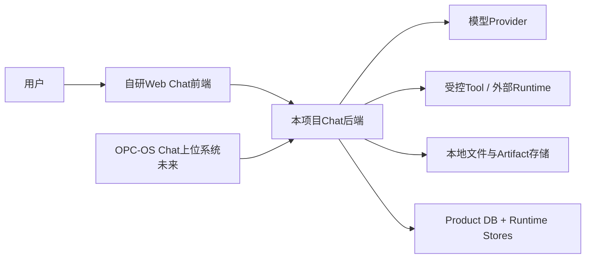
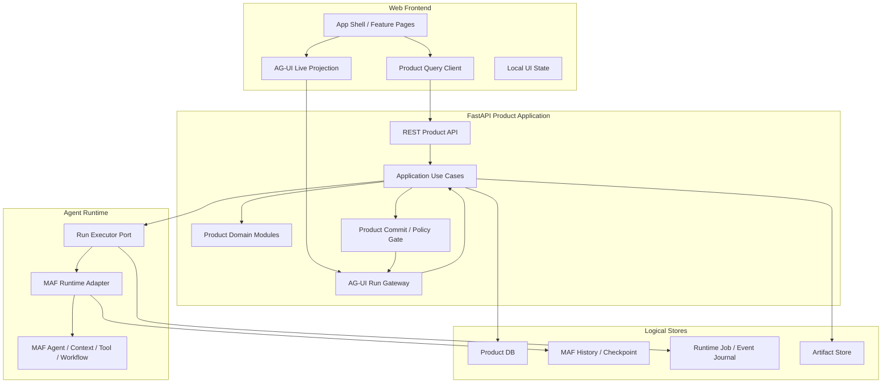
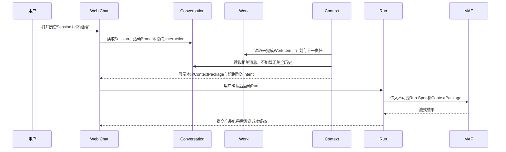

# OPC-OS自研Chat通道：总体架构候选

> 状态：`待用户审核，未冻结，未实施`
> 日期：2026-07-21
> 决策范围：架构风格、逻辑模块、状态所有权、依赖方向、关键链路和部署演进。
> 本次不决定：数据库表字段、API路径、Python类名、消息队列/数据库产品、详细UI布局或Worker实现。

## 1. 一句话方案

本项目建议采用：

> **领域模块化单体作为产品核心，以FastAPI提供REST产品资源接口和AG-UI Agent Run接口，以MAF作为被封装的Agent Runtime，初期在同一进程内执行但保留可分离的Run Executor；Product DB保存权威产品事实，MAF Store、Runtime Job/Event Store和浏览器投影各自只保存自己的状态。**

它不是微服务，也不是“一个大SessionService”。模块先在同一仓库、同一部署单元内用边界和端口隔离；只有断线续传、Worker接管和多实例需求真正出现时，才把Run Executor抽成独立Worker。

## 2. 为什么是这套架构

### 2.1 它直接对应6个问题

1. 会话被困住：Conversation模块和Product DB保存可打开、归档、分支和恢复的产品历史。
2. “继续”没有稳定上下文：Context模块从Conversation、Work、Memory和Evidence生成有来源、可审核的ContextPackage。
3. 意图、计划、待办和结果断裂：Understanding与Work模块拥有明确生命周期，Message不再承担全部业务状态。
4. 未审核就执行：Execution Governance模块生成版本化ExecutionDraft和Approval，Run模块只能消费仍有效的批准。
5. 模型建议冒充事实：Work和Knowledge模块都使用Candidate门，模型只能提出，用户或规则决定生效。
6. 失败、重启、来源删除难追溯：Run/Attempt、Checkpoint、Evidence、Delivery和Trace分别记录执行、恢复、事实与送达。

### 2.2 它符合当前项目规模

[项目事实] 当前是单用户、本地优先、刚完成Hello World纵向回合的独立Web Chat项目。现在最重要的是产品语义和事务正确性，不是跨团队独立发布或超大流量。

领域模块化单体的收益：

1. 一个Product DB事务可以原子提交User Message、Run接纳或最终结果。
2. 本地启动、调试、测试和升级成本低。
3. 模块边界先稳定，再按真实压力抽Worker，不需要提前处理分布式事务。
4. 前后端、MAF和未来OPC-OS Channel边界仍然清楚，不会因单进程而混成一层。

代价：

1. 必须用依赖规则和合同测试守住模块边界，否则会退化成大泥球。
2. Run仍在API进程内时，进程退出会中断执行；Session路线Phase 5才解决Worker接管。
3. SQLite适合起步，但高并发事件和多Worker阶段可能需要重新评估存储。

## 3. 系统边界



边界说明：

1. 本项目是OPC-OS Chat体系中的一个自研Chat通道，不是完整上位系统。
2. Web前端是本项目的产品体验层，不拥有权威历史或执行终态。
3. 模型、Tool和外部Runtime都是可替换依赖，不能决定产品状态。
4. OPC-OS Chat未来只通过版本化Channel合同、身份绑定和交付回执接入，不直接读取本项目私有表。

## 4. 容器与运行结构



初期`Run Executor`和FastAPI在同一进程，`Product DB`、MAF Store和Runtime Store可以物理共用同一个SQLite文件，但必须使用不同Repository、表和迁移边界。图中的逻辑分层不等于现在要部署4个数据库或3个服务。

## 5. 后端分层

### 5.1 Interface / Delivery层

包含3类入口：

| 入口 | 负责 | 不负责 |
|---|---|---|
| REST Product API | Session、Message历史、Work、Draft、Approval、Evidence、Memory、Trace等产品资源查询与命令 | 不重新定义Agent实时事件协议 |
| AG-UI Run Gateway | 接纳并关联一次Agent Run、流式事件、Tool Call、Interrupt/Resume和实时State | 不拥有Session CRUD、权限事实或长期产品历史 |
| Channel Contract | 未来接收上位系统规范化入站消息，返回结果、状态、证据和Delivery回执 | 不读取其他通道私有状态 |

这一层只做：协议解析、认证上下文提取、Schema校验、错误映射和Application调用。它不能直接写表或直接调用模型。

### 5.2 Application层

Application层负责跨模块用例和事务边界。逻辑用例包括：

1. `AcceptInteraction`：校验Scope并原子保存Interaction、User Message和接纳状态。
2. `BuildContextAndUnderstand`：生成ContextPackage与Intent候选。
3. `PrepareExecution`：从计划节点生成ExecutionDraft和配置快照。
4. `ApproveOrRejectExecution`：绑定版本、Hash、权限和过期规则。
5. `StartRun`：创建Product Run/Attempt并调用Run Executor。
6. `FinalizeRun`：提交Assistant Message、Run终态、Evidence和公开Trace后才放行成功终态。
7. `ReconcileRun`：启动或周期检查遗留Attempt、Job和Checkpoint。
8. `DeliverOutcome`：通过Outbox/Channel发送结果并独立更新Delivery。

这些是职责名称，不是已经冻结的Python类或API名。

Application Coordinator可以编排多个模块，但不得包含每个领域自己的状态机，也不得成长为新的万能`SessionService`。

### 5.3 Domain层

Domain只表达产品语言，不import FastAPI、AG-UI、MAF、数据库ORM或具体模型Provider。建议划分8个产品模块。

## 6. 8个产品模块

### 6.1 Channel & Scope

**负责：** 当前Web入口、未来Channel Binding、可信Principal/Scope、入口能力、来源身份映射、撤销传播和入站关联。

**为什么独立：** Session ID、AG-UI Thread ID和外部Chat ID都只负责定位，不能证明用户身份或权限。nanobot明确暴露Session key不等于身份；MAF AG-UI源码也明确Thread ID不授权Snapshot访问。

**不负责：** Conversation历史、Agent执行、业务Approval或外部平台具体SDK。

### 6.2 Conversation

**负责：** Product Session、Interaction、Message、Message树、活动Leaf、标题、归档、搜索索引输入、临时会话、导入导出和产品历史读取。

**为什么独立：** 用户需要在没有活动Agent Run时也能创建、打开、搜索和恢复会话。LibreChat的Conversation/Message与Generation Job分层，以及pi的Session树都支持这一边界。

**不负责：** 模型Context装配、长期Work、运行Job或MAF History。

### 6.3 Context & Understanding

**负责：** ContextPackage、来源纳入/排除、Token预算、活动Branch投影、Intent候选、不确定性、用户修正和来源失效后的上下文降级。

**为什么独立：** 完整产品历史是证据，不等于每轮模型上下文；“继续”需要组合近期消息、当前Work、已接受Memory和相关Evidence，而不是把整段Session塞给模型。

**不负责：** 长期保存所有Conversation消息、直接执行Tool或自动激活Work。

### 6.4 Work & Plan

**负责：** WorkItem、TaskPlan、Plan Node、ActionItem、用户/AI责任、依赖、进度、候选到激活、暂停和完成。

**为什么独立：** 一个WorkItem可跨多个Session和Run，一个Session也可产生多个Intent和WorkItem。把Work藏在消息文本里无法稳定回答“继续哪个任务、下一责任是谁”。

**参考覆盖：** pi的队列/Session和nanobot Goal提供部分经验，但没有本项目需要的正式生命周期；该模块主要是项目需求推导。

**不负责：** Agent运行状态、Tool审批或长期Memory事实。

### 6.5 Execution Governance

**负责：** ExecutionDraft、Agent/Runtime/模型/Tool/权限/限制快照、版本与Hash、Approval/Reject、过期、修改失效、风险等级和执行门。

**为什么独立：** “模型准备做什么”和“用户批准了什么”必须成为可审计产品事实。MAF Tool Approval提供运行时机制，但不能替代跨重启的产品批准记录。

**不负责：** 实际模型/Tool循环、Run lease或结果交付。

### 6.6 Run & Recovery

**负责：** Product Run、Run Attempt、Runtime Job映射、幂等接纳、取消、Retry/Resume/Restart、Worker所有权、Lease/Heartbeat、状态对账、安全点和Checkpoint关联。

**为什么独立：** 一次Interaction可以不运行Agent或产生多个Run；一个Product Run也可以有多个Attempt。LibreChat的Generation Job可删除，不能取代长期Run；pi Orchestrator也没有虚构重启后自动恢复。

**不负责：** Conversation产品生命周期、Tool具体副作用事实或Delivery成功。

### 6.7 Knowledge & Memory

**负责：** Memory Candidate、Accepted Memory、Correction、Deletion、有效范围、来源和跨Session检索；模型只提出候选。

**为什么独立：** Session历史、当前Work和长期Memory是不同时间尺度。nanobot明确分开Session、Memory和Goal；本项目还要求模型建议不能自动成为正式事实。

**不负责：** 保存全部原始消息、把模型摘要当证据或自动修改Work状态。

### 6.8 Outcome：Evidence / Delivery / Trace

这是一个初期模块组，内部仍保留3类对象的不同语义：

1. **Evidence**：结果、来源、Artifact、Tool回执、派生关系和可验证性。
2. **Delivery**：结果是否已准备、已发送、已确认、失败或待重试；Run成功不等于送达。
3. **Trace**：可观察步骤、状态变化、关联ID、错误和恢复动作；不保存隐藏推理。

**为什么先组成一组：** 3类能力都围绕运行后果和追溯，早期团队与代码规模不足以把它们拆成3个独立部署边界。

**为什么对象仍分开：** nanobot证明Session保存不等于Channel送达；MAF Telemetry也不等于产品Evidence。以后可以按压力拆Repository或Worker，而不改变对象语义。

## 7. Agent Runtime技术模块

MAF不属于8个产品领域模块。它位于Application Port后，建议内部再分5个职责：

| Runtime子模块 | 责任 | MAF能力 |
|---|---|---|
| Agent Registry/Factory | 依据已批准Run Spec创建Agent、模型和指令 | `Agent`、Provider Client |
| Context Adapter | 把ContextPackage和MAF History映射为运行输入，保证唯一历史装配 | Context/History Provider、AgentSession |
| Tool Runtime | 工具注册、参数Schema、风险策略、中间件、结果映射 | Tool、Function Middleware、Tool Approval |
| Workflow Runtime | 多Agent/多节点流程、Checkpoint和HITL | Workflow、Checkpoint、Executor、interrupt/resume |
| AG-UI Event Adapter | 将MAF事件转换为AG-UI投影，并在产品提交前扣住成功终态 | MAF AG-UI Adapter、Snapshot、SSE |

关键规则：

1. Runtime只读取不可变Run Spec和可信Run Context。
2. Runtime不能直接把Intent、Work或Memory写成已接受事实。
3. Tool结果先通过Application保存Tool Execution/Evidence，再允许依赖该结果的产品终态提交。
4. MAF运行结束只是技术结果；Product commit成功后才是产品成功。
5. MAF AgentSession、Workflow Checkpoint和AG-UI Snapshot各自持久化并显式映射。

## 8. Infrastructure层

Infrastructure实现内层声明的Port：

1. Product Repository和迁移。
2. MAF History/Checkpoint Store。
3. Runtime Job/Event Journal实现。
4. Artifact/File Store。
5. Outbox与Channel Delivery Adapter。
6. 模型Provider与外部Runtime Adapter。
7. Clock、ID、事务、锁、Lease和幂等实现。
8. OpenTelemetry、结构化日志和脱敏。

Infrastructure可以依赖数据库、MAF和外部SDK；Domain不能反向依赖Infrastructure。

## 9. 前端模块

前端按用户任务组织，而不是按后端表或AG-UI事件类型组织。

### 9.1 产品Feature

| Feature | 用户看到什么 | 主要后端模块 |
|---|---|---|
| App Shell & Navigation | Session列表、搜索、项目/标签、全局状态 | Conversation |
| Conversation Workspace | Message树、输入、附件、Branch、实时回答 | Conversation + Run |
| Context & Intent Review | 本轮采用/排除的上下文、意图和不确定性 | Context & Understanding |
| Work & Plan | WorkItem、计划节点、人/AI下一行动、进度 | Work & Plan |
| Execution Review | 最终请求、Agent、模型、Tool、权限、限制、版本与批准 | Execution Governance |
| Run Center | Run/Attempt进度、取消、Retry、恢复、错误和活动流 | Run & Recovery |
| Evidence & Memory | Evidence、来源、Delivery、Trace和Memory候选 | Knowledge + Outcome |

Feature可以逐阶段出现，不要求首版同时完成全部页面。

### 9.2 前端3类状态

1. **Product Query State**：来自REST的Session、Message、Work、Approval、Run终态等；用查询缓存管理，不复制成第二事实源。
2. **AG-UI Live Projection**：当前Thread/Run的流式Message、Tool Call、State和Interrupt；可丢弃并从服务端恢复。
3. **Local UI State**：Sidebar、面板、筛选、弹窗、焦点和未提交输入；可由Zustand或组件状态管理。

禁止把AG-UI Snapshot或Zustand状态直接提交为权威Product Session。

## 10. 状态所有权矩阵

| 状态 | 权威所有者 | 可有的投影 | 明确不能替代它的东西 |
|---|---|---|---|
| Session/Interaction/Message | Product DB / Conversation | 前端Query Cache、搜索索引 | MAF Session、AG-UI Thread |
| ContextPackage/Intent | Product DB / Context | AG-UI共享State、前端Review UI | 一段临时Prompt |
| Work/Plan/Action | Product DB / Work | 前端Board | Message文本、模型Todo |
| Draft/Approval | Product DB / Governance | AG-UI Interrupt UI | 进程内pending registry |
| Product Run/Attempt | Product DB / Run | Run Center、AG-UI状态 | Runtime Job、SSE连接 |
| Runtime Job/Event | Runtime Store / Executor | AG-UI Live Projection | 长期Product Run、Product Message |
| MAF AgentSession/History | MAF Runtime Store | Context Adapter读取 | Product Session历史库 |
| Workflow Checkpoint | MAF Workflow Store | Run恢复视图 | Tool Evidence、Approval事实 |
| Evidence/Delivery/Trace | Product DB + Artifact/Outbox | 前端Outcome视图、Telemetry | 日志、模型回答本身 |
| Memory | Product DB / Knowledge | Context检索结果 | 全部Session历史、模型摘要候选 |
| Layout/Modal/Draft input | Browser | 无 | 服务端产品事实 |

物理共库不改变逻辑所有权；不同对象同值ID也不改变职责。

## 11. 依赖与事务规则

### 11.1 依赖方向

```text
Interface -> Application -> Domain
                         -> Port <- MAF / DB / Tool / Channel Adapter
```

具体规则：

1. Interface不能绕过Application直接写Repository或调用MAF。
2. Domain模块通过ID、明确Command/Result和只读Projection协作，不互相读私有表。
3. Context可以读取Conversation、Work、Knowledge和Evidence的公开投影，但不能修改它们。
4. Run只能执行有效Approval引用的Run Spec；不能自己重新解释用户意图。
5. Outcome消费已提交Run结果，Delivery失败不能回滚已完成Evidence或Run。
6. 跨模块异步动作只在确有重试/跨进程需求时使用Outbox，不先建通用事件总线。

### 11.2 3个关键提交门

1. **输入接纳门**：User Message、Interaction和接纳/幂等记录提交失败时，不调用模型。
2. **执行门**：高影响Run启动前，Approval必须匹配当前Draft版本、Hash、权限和上下文版本。
3. **成功终态门**：Assistant Message、Product Run终态、必要Evidence和Trace提交成功后，才发送AG-UI成功终态；Delivery另行记录。

这3个门是方案级保证，具体事务拆分仍待详细设计。

### 11.3 Trace策略

建议使用“**当前状态表 + 追加式Trace/Event Ledger + 必要Outbox**”，不采用全量Event Sourcing：

1. 当前状态便于产品查询、分页和恢复。
2. 追加Trace保留状态变化、错误、关联和恢复证据。
3. Outbox只用于需要可靠跨边界交付的动作。
4. 不要求所有产品对象都通过事件重放才能读取，降低首版复杂度。

## 12. 用户场景如何跑通

### 12.1 场景一：用户隔天说“继续昨天的Session持久化规划”



用户得到的不是“模型猜昨天聊了什么”，而是可见的Session、Work状态和Context来源。

### 12.2 场景二：一个请求里有两个意图

用户说：“把Session方案整理成文档，并给团队发一封邮件。”

1. Conversation保存原始输入。
2. Understanding识别“整理文档”和“发送邮件”两个Intent，并展示不确定性。
3. Work建立两个Plan Node：先形成文档，再发送。
4. 第一个节点是低风险本地草稿，可自动或一次确认执行。
5. 第二个节点涉及外部发送，Governance生成含收件人、正文、附件、Tool和权限的ExecutionDraft。
6. 用户修改收件人后旧Approval失效，必须对新Hash重新批准。
7. Run执行发信Tool；Evidence保存外部回执，Delivery记录是否真正送达。

这说明Intent、Work、Approval、Run和Delivery必须是不同模块，不能只靠一条聊天消息完成。

### 12.3 场景三：模型失败但用户输入不能丢

1. 输入接纳事务先保存Interaction、User Message和Product Run。
2. MAF调用模型超时，Run Attempt标记明确错误码。
3. AG-UI收到错误终态，不收到成功Final。
4. 用户刷新后仍能看到原输入、失败Attempt、Trace和“Retry”操作。
5. Retry创建新Attempt并关联旧Attempt，不覆盖失败历史。

满足“失败可解释、可恢复”，同时避免重复执行。

### 12.4 场景四：浏览器断线，但Agent仍在生成

该能力在Session路线Phase 4实现，逻辑架构从第一版预留：

1. Product Run长期存在。
2. Runtime Job继续拥有活动Attempt。
3. Event Journal保存有限游标事件。
4. 浏览器断线只关闭订阅，不自动取消Run。
5. 重连后先读取Product Message/Run，再从游标接回活动事件。
6. Job已经完成或过期时，前端回退Product DB，不把流缓存当最终事实。

### 12.5 场景五：Worker在Tool执行后崩溃

该能力按Session路线Phase 5-7逐步实现：

1. Run Attempt的Lease过期，Reconciler发现失联。
2. Tool Execution Ledger显示请求已发出但回执未知。
3. 系统不盲目重做，而是根据Tool能力查询、对账或请求人工确认。
4. Evidence确认外部结果后，新的Attempt从安全点继续。
5. Workflow Checkpoint只用于恢复控制流，不替代Tool Evidence。

### 12.6 场景六：原始来源被删除

1. Evidence保存来源引用、版本/Hash和派生关系。
2. 来源删除或失效后，Outcome把相关Evidence标记为失效或降级，而不是删除历史结论。
3. Knowledge检查依赖该Evidence的Accepted Memory，标记需复核。
4. Context下一轮不再静默注入失效事实，并向用户展示原因。
5. Trace保留来源何时失效、哪些派生对象受到影响。

### 12.7 场景七：未来从Telegram继续Web任务

1. OPC-OS Chat把Telegram来源解析成可信Principal与Channel Binding。
2. Channel模块校验该Binding是否允许访问目标Product Session。
3. 相同Product Session继续关联Work和Context，但Telegram消息有自己的来源Envelope。
4. Agent结果先提交Product Run/Evidence，再由Outbox投递Telegram。
5. Telegram发送失败时Run仍可成功，Delivery显示失败并可重试。

## 13. 场景到模块的完整映射

| 用户能力 | 必需模块 | 关键状态 |
|---|---|---|
| 创建、打开、归档和搜索会话 | Channel/Scope + Conversation | Session、Message |
| 编辑、重生成、切换Branch和Fork | Conversation + Context | Message树、活动Leaf |
| “继续刚才的任务” | Conversation + Work + Context + Knowledge | WorkItem、ContextPackage |
| 查看和修正意图 | Context & Understanding | Intent Candidate、Correction |
| 形成长期计划和人/AI待办 | Work & Plan | TaskPlan、ActionItem |
| 检查最终执行请求 | Governance | ExecutionDraft、配置快照 |
| 批准、拒绝和修改失效 | Governance + Run | Approval、Hash、Run Spec |
| 实时回答、Tool Call和Interrupt | Run + MAF Runtime + AG-UI | Product Run、Protocol Run |
| 取消、Retry、Steer和Follow-up | Run & Recovery | Attempt、Control Input、Queue |
| 刷新/断网接回活动Run | Run Runtime + Event Journal | Runtime Job、Cursor |
| Worker/Workflow跨重启恢复 | Run + MAF Workflow + Tool Ledger | Lease、Checkpoint、Evidence |
| Memory候选、接受和纠正 | Knowledge + Outcome | Memory、Provenance |
| 结果验证、交付与追溯 | Outcome | Evidence、Delivery、Trace |
| 跨通道继续和可靠投递 | Channel + Run + Outcome | Binding、Outbox、Receipt |

这张表与[Session能力全集](./session-capability-catalog.md)和[Session交付路线](./session-delivery-roadmap.md)互补：Session文档定义能力全集与交付顺序，本文定义这些能力应落在哪些架构模块。

## 14. 物理部署如何演进

### 14.1 第一步：单进程模块化单体

```text
Browser
  -> FastAPI（REST + AG-UI + Application + Domain + in-process Executor）
  -> SQLite（逻辑分开的Product/MAF/Runtime表）
  -> Local Artifact Store
```

适用：Session路线Phase 1-3。优先证明产品事实、Context、Approval和Run语义。

### 14.2 第二步：执行与连接生命周期分开

增加Runtime Job和Event Journal，即使仍在同一进程也不把HTTP连接当Run。适用Phase 4断线重连。

### 14.3 第三步：抽独立Worker

```text
Browser -> API
             -> Product DB / Job Store
          Worker -> MAF / Tool / Workflow
```

引入Lease、Heartbeat、Reconciler和安全点。存储或队列产品根据压测、部署和恢复需求另行审核，不预设Redis、PostgreSQL、Celery或Azure Durable Functions。适用Phase 5-7。

### 14.4 第四步：上位系统与多通道

增加Channel Contract、规范身份映射、入站去重、Outbox、Receipt和权限撤销传播。适用Phase 8。

架构模块和状态所有权在4步中保持不变，变化的是Runtime和Delivery Adapter的物理部署。

## 15. 决策卡

### A1. 架构风格

**原因：** 既需要强产品事务和低本地运维成本，又必须避免Hello World直连架构成为长期大泥球。

| 选择 | 优点 | 缺点 | 参考覆盖 |
|---|---|---|---|
| 前端 + 薄Route + 直接MAF | 最快、代码少 | 无法承载Work、Approval、Run恢复和Evidence；Route/框架状态会变成事实源 | MAF示例只证明链路，不证明产品闭环 |
| 领域模块化单体 + 可分离Executor | 强事务、低运维、边界可测试、未来可抽Worker | 需要严格依赖纪律；早期API与执行同故障域 | pi、nanobot、LibreChat共同支持 |
| 从第一天微服务/事件驱动 | 独立扩缩和故障隔离 | 分布式事务、观测、部署和Schema演进成本远超当前收益 | 参考项目没有证明本项目当前需要 |

**建议：** 第二项。

**信心：** 高。

**未验证：** SQLite并发上限和何时抽Worker。

### A2. 产品状态与运行状态

**原因：** Product Session、MAF Session、AG-UI Thread和Run已经明确是不同对象。

| 选择 | 优点 | 缺点 |
|---|---|---|
| 一份Session JSON保存全部 | 初期简单 | 权限、恢复、查询、版本和失败语义混乱 |
| 逻辑分Store，初期物理共SQLite | 保持边界和事务，运维简单 | 需要清楚Repository和迁移约束 |
| 从第一天物理分多个数据库 | 故障和容量可独立 | 事务、备份和本地开发复杂 |

**建议：** 第二项；未来按压力物理拆分。

**依据：** MAF状态分层、LibreChat Product/Generation分层、nanobot状态时间尺度。

**信心：** 高。

### A3. REST与AG-UI

**原因：** 产品资源和实时Agent事件有不同生命周期。

| 选择 | 优点 | 缺点 |
|---|---|---|
| 所有能力都走AG-UI | 单协议表面简单 | Session CRUD、Work查询、分页和权限被迫塞进实时协议 |
| 所有能力都走自定义REST/SSE | 完全控制 | 重复建设Agent事件、Tool和Interrupt协议 |
| REST产品资源 + AG-UI Agent Run | 各用其长，框架兼容，边界清楚 | 需要显式ID映射和前端状态协调 |

**建议：** 第三项，延续已批准技术路线。

**依据：** LibreChat产品Route/运行Route分层；MAF AG-UI能力边界。

**信心：** 高。

### A4. Run执行位置

**原因：** 当前需要简单启动，未来又需要断线和Worker恢复。

| 选择 | 优点 | 缺点 |
|---|---|---|
| 永久绑定HTTP请求 | 简单 | 断连、刷新和Worker恢复不可控 |
| 端口分离，初期同进程，后抽Worker | 早期简单且保留演进路径 | 需要从第一版保持Run/Connection语义分开 |
| 立即使用独立Worker/Durable平台 | 早获进程隔离 | 当前运维、依赖和恢复设计成本高 |

**建议：** 第二项。

**依据：** LibreChat Generation Job、pi RPC/Orchestrator、MAF Durable Task可选扩展。

**信心：** 高；具体Worker技术信心低，尚不选型。

### A5. 模块粒度

**原因：** 要避免God Session Service，也不想把每个对象变成服务。

| 选择 | 优点 | 缺点 |
|---|---|---|
| 一个Chat/Session模块 | 文件少 | 变化原因过多，pi的超大AgentSession已经展示风险 |
| 8个产品模块同处单体 | 对应用户问题、事务可协调、可渐进实现 | 需要公开合同和依赖测试 |
| 每个模块独立微服务 | 物理隔离 | 当前边界和团队规模不足，跨模块流程代价极高 |

**建议：** 8个产品模块 + 1个MAF Runtime技术模块。

**信心：** 中高；Outcome组是否未来拆分由复杂度决定。

### A6. Trace与历史策略

**原因：** 用户要求可追溯，但不需要从事件重建整个产品。

| 选择 | 优点 | 缺点 |
|---|---|---|
| 只留日志 | 便宜 | 用户不可查询，无法稳定关联或做恢复判断 |
| 全量Event Sourcing | 历史完整、可重放 | 投影、版本、迁移和调试复杂，首版风险大 |
| 当前状态 + 追加Trace + 必要Outbox | 查询简单、保留审计、可靠动作可重试 | 需要定义哪些状态必须追加记录 |

**建议：** 第三项。

**参考覆盖：** nanobot证明日志/Session不等于Delivery；LibreChat证明Job/Chunk不等于长期Run；没有参考项目要求本项目全量Event Sourcing。

**信心：** 高。

### A7. 前端状态所有权

**原因：** 产品事实、活动流和页面状态更新频率不同。

| 选择 | 优点 | 缺点 |
|---|---|---|
| 浏览器Store拥有全部 | 响应快 | 刷新/多设备/重启冲突，形成第二事实源 |
| 每次都直接请求，无本地投影 | 简单一致 | 实时体验差，重复请求多 |
| Query产品状态 + AG-UI活动投影 + Zustand局部UI | 状态职责清晰，可恢复且实时 | 需要定义投影合并和失效规则 |

**建议：** 第三项，延续已批准前端路线。

**依据：** LibreChat Query/Feature经验与MAF AG-UI协议。

**信心：** 高。

### A8. 是否增加参考项目

**原因：** Intent、Work、Approval、Evidence详细模型的外部覆盖不足。

| 选择 | 优点 | 缺点 |
|---|---|---|
| 现在再加入一个大型项目 | 可能获得部分领域例子 | 扩大研究面，未必匹配本产品；推迟架构审核 |
| 当前保持4源，详细设计时按主题申请新参考 | 研究成本可控，当前证据足够 | 某些领域详细设计届时还要补研究 |

**建议：** 第二项；本轮不新增。

**原因：** 现有来源足以决定所有权和依赖，暂不足的部分本来就要由项目需求定义。

**信心：** 高。

## 16. 风险与控制

| 风险 | 影响 | 当前控制 |
|---|---|---|
| 模块化单体退化成大泥球 | 领域互相读表、修改规则 | import边界、公开Port、模块合同测试、组合根集中装配 |
| Application Coordinator膨胀 | 复现pi AgentSession风险 | 只做流程/事务，状态机留在模块；按用例拆Coordinator |
| MAF版本错位 | API和事件行为变化 | 记录安装版本；关键路径建立合同测试和升级门 |
| 成功Final早于产品提交 | 刷新读不到结果或假成功 | Product commit gate；失败终态单独验收 |
| SQLite写竞争 | 活动事件和产品事务阻塞 | 事件有限写入、压测、Worker阶段重审存储，不提前承诺 |
| Runtime Job冒充Run | 清理后丢长期审计 | Product Run长期保留，Job只作活动投影 |
| Approval只存在MAF内存 | 重启后无法安全恢复 | 产品Approval持久化并映射Interrupt/Checkpoint |
| Trace泄露Prompt/Tool敏感内容 | 安全与隐私风险 | MAF敏感Telemetry默认关闭；产品Trace白名单和脱敏 |

## 17. 本次审核项

请只审核以下8项，不需要现在选择表、类或中间件：

1. 是否同意“领域模块化单体 + 可分离Run Executor”的架构风格。
2. 是否同意8个产品模块及MAF Runtime技术模块的边界。
3. 是否同意REST管理产品资源、AG-UI管理实时Agent Run。
4. 是否同意Product DB、MAF Store、Runtime Job/Event和浏览器投影逻辑分离，初期允许物理共SQLite。
5. 是否同意3个提交门：输入接纳门、执行批准门、成功终态门。
6. 是否同意“当前状态 + 追加Trace + 必要Outbox”，不采用全量Event Sourcing。
7. 是否同意先同进程Executor，按Session Phase 4-7逐步加入Job、Worker、Tool Ledger和Workflow恢复。
8. 是否同意本轮不增加参考项目，详细领域设计缺证据时再逐项提交候选。

审核通过后，下一步才是把架构转成“模块合同与第一纵向切片详细设计”；在此之前不创建正式Schema、Repository或目录重构。
