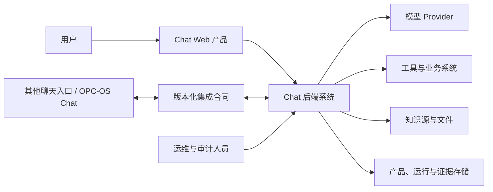
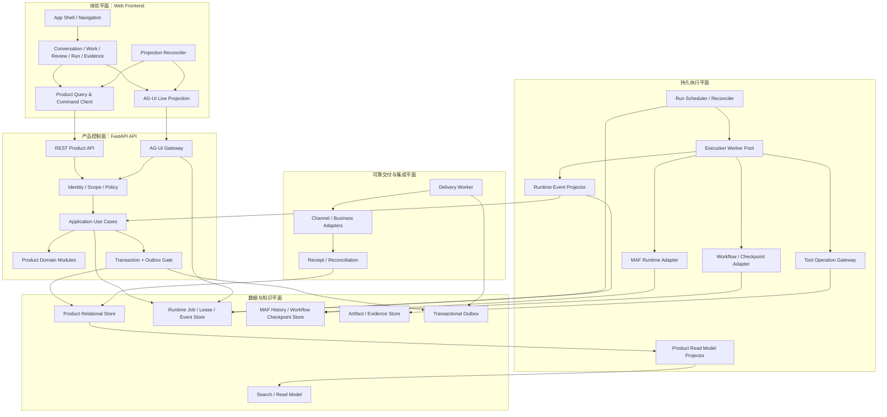

# Chat 总体架构候选

> 状态：`待用户审核，未冻结，未实施`
>
> 日期：2026-07-21
>
> 架构对象：独立运行和持续运营的完整 Chat 产品
>
> 证据入口：[总体架构研究与证据](./overall-architecture-research.md)

## 1. 这份文档必须回答什么

本文描述的是 Chat 的**完整目标架构**，不是某个交付切片的临时结构。

| 读者 | 阅读后应能完成的工作 |
|---|---|
| 产品负责人 | 判断架构为什么这样设计、是否覆盖完整用户场景、哪些决定仍需审核 |
| 架构师 | 继续完成模块、数据、接口、部署、安全和非功能详细方案，不需要猜状态边界 |
| 项目经理 | 把目标能力拆成工作包，识别依赖、风险、验收门和交付顺序 |
| 开发 | 知道代码归属、模块组成、调用方向、权威状态、失败语义和测试责任 |

本文决定：产品边界、目标系统形态、逻辑模块、组件职责、状态所有权、模块合同、关键交互、恢复保证、部署角色和交付依赖。

本文不冻结：数据库字段、URL、Python 类名、队列或数据库产品、云资源参数和页面视觉稿。这些需要在总体架构通过后进入对应模块的详细设计审核。

## 2. 架构结论

建议采用：

> **模块化产品核心 + 持久执行平面 + 可靠交付平面**。Web 前端通过 REST 管理产品资源，通过 AG-UI 参与 Agent Run 的实时交互；FastAPI 产品控制面拥有用户命令、领域状态和事务；持久执行平面通过 Run Job、Attempt、Lease、Event Journal 和 Checkpoint 驱动 MAF、Workflow 与 Tool；可靠交付平面通过 Outbox、Delivery Attempt 和 Receipt 与外部入口或业务系统互操作。Product DB 始终是产品事实权威，MAF Store、Runtime Store、Artifact Store、索引和浏览器状态只拥有各自语义。

它有 3 个重要含义：

1. **Chat 是产品，不是 MAF 外壳。** MAF 提供 Agent 运行时能力，但不拥有 Conversation、Work、Approval、Product Run、Evidence、Delivery 或 Memory。
2. **HTTP 连接不是执行生命周期。** Run 被接纳后由持久 Job 和 Worker 驱动；浏览器断线、API 重启或 Worker 失联都通过明确状态和恢复语义处理。
3. **模块化不等于每个模块一个服务。** 领域模块共享一个产品代码库和清晰合同；API、Execution Worker、Delivery Worker、Scheduler/Reconciler 是建议的进程角色。开发部署可以合并进程，但不能删除逻辑组件或合并状态责任。

## 3. 架构驱动：完整用户场景要求哪些保证

| 用户场景 | 用户真正需要的保证 | 架构必须提供 |
|---|---|---|
| 隔天打开会话说“继续” | 不重复背景，继续的是正确事项 | Product Session、Message 分支、Work 状态、ContextPackage、来源和版本 |
| 一句话包含多个目标 | 系统不漏项、不把不确定理解直接执行 | Intent 候选、澄清、TaskPlan、用户修正和候选生效门 |
| 让 AI 向外部系统执行动作 | 执行前看清内容和权限，执行后知道是否真的完成 | ExecutionDraft、Approval、请求 Hash、Tool Ledger、Evidence 和 Delivery Receipt |
| 页面刷新或网络中断 | 页面连接断开不等于任务取消，回来能看到真实状态 | Product Run、Runtime Job、Event Journal、游标订阅和产品事实回退 |
| Worker 在工具调用后崩溃 | 不重复产生副作用，不制造假成功 | Attempt、Lease、Tool 幂等键、结果未知状态、对账和人工处置 |
| Workflow 等待用户数小时 | 中断点跨进程存在，批准仍绑定正确版本 | Workflow Checkpoint、持久 Approval、Interrupt 映射和 Resume 合同 |
| 来源被删除或权限撤销 | 旧结论不被静默继续使用 | Provenance、Evidence 有效性、Memory 复核和 Context 排除 |
| 从其他聊天入口继续工作 | 仍是同一工作，不越权、不双写事实 | Principal、Channel Binding、版本化集成合同、幂等和单一事实源 |

由这些场景直接得到 8 个全局架构保证：

1. **权威性**：产品事实只有一个权威所有者。
2. **连续性**：会话、工作和知识跨交互保持稳定身份和版本。
3. **可控性**：有影响的执行必须消费仍有效的批准。
4. **持久性**：Run、Attempt、Tool、Checkpoint 和 Delivery 有各自恢复记录。
5. **可追溯性**：结果能够追到输入、上下文、版本、执行、工具和来源。
6. **无假成功**：产品提交、运行成功和送达成功是不同事实。
7. **可替换性**：模型、MAF 适配、工具、存储和外部入口不渗入领域规则。
8. **可运营性**：超时、重试、对账、告警、审计和人工处置是产品能力，不是日志补丁。

## 4. 系统上下文：独立产品与对等集成



边界规则：

1. Chat 自己拥有 Web 体验、产品资源、执行治理、运行恢复、证据、交付和运维能力。
2. OPC-OS Chat 或其他入口只通过外部集成合同交换命令、事件和回执，不能直接访问 Chat 私有表。
3. 模型和工具返回的是运行结果，不自动成为产品事实；必须通过产品提交门。
4. 外部消息 ID、AG-UI `threadId`、MAF Session ID 和 Product Session ID 都不能替代 Principal 或权限判断。

## 5. 目标容器与进程拓扑



### 5.1 各容器为什么存在

| 容器 | 组成 | 责任 | 不能承担的责任 |
|---|---|---|---|
| Web Frontend | 页面 Feature、REST Client、AG-UI Client、投影协调器、局部 UI 状态 | 提供完整交互体验，组合产品查询与活动 Run 投影 | 不判定权威终态，不持有权限和完整历史 |
| FastAPI API | REST、AG-UI Gateway、认证授权、Application、领域模块 | 接纳命令、查询产品事实、执行业务不变量、建立事务和运行请求 | 不把 HTTP/SSE 连接当作 Worker，不直接执行外部副作用 |
| Scheduler/Reconciler | Job 扫描、优先级、租约、超时、遗留状态对账 | 决定哪个 Job 可运行、检测失联 Attempt、触发安全恢复 | 不修改领域事实绕过 Application，不猜 Tool 外部结果 |
| Execution Worker | Run Spec 消费、MAF/Workflow/Tool 调用、事件写入、安全点 | 执行一次 Attempt 并持续写入可恢复运行状态 | 不接受未批准 Draft，不直接宣布产品成功 |
| Delivery Worker | Outbox 消费、外部适配、重试、回执与死信 | 可靠发送已经提交的产品结果和集成事件 | 不回滚已经完成的 Run，不把“已准备”当“已送达” |
| Product Store | 产品聚合、版本、当前状态、Trace、Outbox | 产品事实权威和事务边界 | 不保存高频临时流作为唯一恢复来源 |
| Runtime Store | Job、Attempt、Lease、Heartbeat、事件游标、控制输入 | 活动执行协调和重连 | 不替代长期 Product Run、Message 或 Evidence |
| MAF/Checkpoint Store | AgentSession、HistoryProvider 状态、Workflow Checkpoint | MAF 模型上下文与工作流恢复语义 | 不替代 Product Session、Approval 或 Tool 回执 |
| Artifact/Evidence Store | 文件、产物、校验值、大对象、外部回执 | 保存可验证内容并由 Product DB 记录元数据和来源 | 不自行决定证据是否有效或用户是否有权访问 |

进程可以在开发或单机部署中合并，但逻辑责任、持久记录、接口和测试必须保持不变。反过来，拆成多个进程也不能绕过产品事务和模块合同。

## 6. 后端结构与依赖方向

```text
interfaces (REST / AG-UI / external integration)
    -> application (use cases / transactions / orchestration)
        -> domain modules (rules / states / ports)
        -> execution ports (job / runtime / tool / delivery)
            <- infrastructure adapters (MAF / DB / provider / channel)
```

依赖规则：

1. Interface 只做协议解析、可信身份建立、Schema 校验、错误映射和 Use Case 调用。
2. Application 定义事务边界和跨模块流程；它不能保存领域状态机，也不能成为万能 `SessionService`。
3. Domain 不 import FastAPI、AG-UI、MAF、ORM、队列客户端或具体模型 Provider。
4. 模块之间只通过命令、查询 Port、只读 Projection 或领域事件协作；禁止互读私有表。
5. Execution Worker 只消费不可变 `RunSpec` 与服务端可信 `RunContext`。
6. 跨事务或跨进程动作必须通过 Runtime Job 或 Transactional Outbox；不能靠进程内回调冒充可靠交付。
7. 所有 Adapter 在组合根中装配，入口、Worker 和测试使用同一产品核心。

## 7. 产品领域模块总览

12 个逻辑模块分成 4 个有界域。它们是代码和状态边界，不是 12 个微服务。

划分标准不是“概念听起来不同”，而是满足以下任一条件就需要独立模块边界：

1. 拥有不同的权威状态和不变量。
2. 失败、重试或恢复语义不同。
3. 权限、保留或审计规则不同。
4. 变化原因和外部依赖不同，合并后会形成万能服务。

因此：Context 与 Intent 分开，因为前者治理来源和模型输入，后者治理理解候选和用户修正；Run 与 Tool 分开，因为 Run 可以重试，而外部副作用可能结果未知、不能重放；Evidence、Delivery 与 Trace 分开，因为“结果成立、结果送达、过程可审计”是 3 个独立事实；Identity 独立是为了阻止任何 Session/Thread ID 被误用为权限。

| 有界域 | 模块 | 直接服务的用户问题 |
|---|---|---|
| 访问与协作 | M1 Identity & Access、M2 Conversation、M3 Context、M4 Intent & Understanding | 谁能访问、会话连续、上下文透明、意图可修正 |
| 工作管理 | M5 Work & Planning、M6 Execution Governance | 长期事项推进、执行前可检查和批准 |
| 执行控制 | M7 Run Control & Recovery、M8 Tool Operations | 运行可恢复、副作用可对账、无假成功 |
| 知识与结果 | M9 Knowledge & Memory、M10 Evidence & Provenance、M11 Delivery & Integration、M12 Trace & Audit | 事实确认、来源有效性、可靠送达、可运营追溯 |

### 7.1 M1 Identity & Access

**用户价值与边界**

保证“谁以什么权限访问哪个产品对象”。它负责 Principal、Credential Context、Scope、Role/Policy、Channel Binding 和撤销状态；不负责登录 UI 的视觉实现，也不把 Session ID 或 Thread ID 当作身份。

**内部组件**

1. `Principal Resolver`：把 Web 登录态、服务凭据或外部来源映射为稳定 Principal。
2. `Scope Authorizer`：判断 Session、Work、Run、Evidence 和集成操作的访问范围。
3. `Policy Evaluator`：评估工具风险、数据访问和交付目标是否允许。
4. `Channel Binding Registry`：维护外部主体/会话与 Chat 对象的可撤销映射。
5. `Revocation Projector`：把权限撤销传播到活动 Run、上下文和 Delivery。

**状态、合同与依赖**

- 拥有：Principal、Credential Reference、Policy Version、Binding、Revocation Record。
- 入站：`ResolvePrincipal`、`Authorize(command, resource, scope)`、`BindChannel`、`RevokeBinding`。
- 出站：可信 `RequestContext`、`AuthorizationDecision`、`BindingRevoked`。
- 依赖：身份 Provider 和外部 Channel Adapter；其他所有模块只消费它的决定。

**不变量与失败**

- 客户端传入的 Principal、Session 所有者或 Tool 权限永远不可信。
- Approval 只能在同一 Principal/授权代理和 Policy Version 下生效。
- 身份 Provider 不可用时拒绝需要新授权的动作；已缓存决定必须有期限和版本。
- 撤销后阻止新 Run，并让活动 Run 进入安全中止或人工处置，而不是静默继续。

**技术与测试**

FastAPI dependency 建立可信上下文，领域 Policy 负责规则，Adapter 负责外部身份协议。必须有越权、伪造 ID、撤销竞态、外部 Binding 重放和审计测试。

### 7.2 M2 Conversation

**用户价值与边界**

让用户创建、打开、搜索、归档、分支和恢复会话，并在 Agent 不运行时仍能管理产品历史。它不负责模型上下文选择、长期 Work 状态或运行 Job。

**内部组件**

1. `Session Lifecycle`：创建、重命名、归档、恢复、删除策略和临时会话转正。
2. `Interaction Ledger`：记录一次用户到系统的完整交互及其关联对象。
3. `Message Tree`：保存消息父子关系、活动 Leaf、编辑、重生成、Sibling 和 Fork。
4. `Conversation Query`：分页、搜索输入、标签、置顶、导入导出和分享快照。
5. `Message Committer`：以幂等键接纳用户消息，并提交最终产品可见 Assistant Message。

**状态、合同与依赖**

- 拥有：Product Session、Interaction、Message、Branch/Leaf、Title、Archive、Import/Export Manifest。
- 入站：`CreateSession`、`AcceptInteraction`、`AppendMessage`、`ForkConversation`、`ArchiveSession`、查询合同。
- 出站：`InteractionAccepted`、`MessageCommitted`、`SessionChanged`、只读 Conversation Projection。
- 依赖：M1 授权；向 M3、M5、M10 提供公开 Projection。

**不变量与失败**

- User Message、Interaction 和幂等接纳记录必须在任何模型调用前提交。
- 编辑或重生成创建新分支，不篡改已经被 Run、Approval 或 Evidence 引用的历史版本。
- Message 保存失败时不得启动 Run；搜索索引失败不回滚产品事实，由 Projector 重建。
- 删除必须遵守保留、证据和派生关系策略，不能物理删除后留下无来源结论。

**技术与测试**

关系型 Product Store 保存权威树与版本；搜索是可重建投影。必须验证并发发言、幂等重试、分支切换、导入冲突、删除传播和重启恢复。

### 7.3 M3 Context

**用户价值与边界**

让用户知道本轮模型看到了什么、为什么纳入、哪些被排除，并确保“继续”使用正确且仍有效的上下文。它不拥有原始 Conversation、Work、Memory 或 Evidence，只保存本轮不可变 ContextPackage 和选择理由。

**内部组件**

1. `Source Collector`：从 Conversation、Work、Memory、Evidence、附件和外部知识源读取候选。
2. `Eligibility Filter`：按权限、来源有效性、时间、Branch 和任务相关性排除。
3. `Budget Planner`：按模型 Token 预算排序、裁剪和压缩，保留来源映射。
4. `Context Assembler`：生成版本化、可 Hash 的 ContextPackage。
5. `Context Review`：接收用户纳入、排除、更正和锁定操作。
6. `MAF Context Bridge Port`：向 Runtime 提供唯一历史装配输入。

**状态、合同与依赖**

- 拥有：ContextPackage、Context Item Reference、Include/Exclude Reason、Budget、Version、Hash。
- 入站：`BuildContext(interaction_id, intent_scope)`、`ReviseContext`、`InvalidateSource`。
- 出站：`ContextPrepared`、`ContextRevised`、`ContextInvalidated`、不可变 Context Snapshot。
- 只读依赖：M2 Conversation、M5 Work、M9 Memory、M10 Evidence；依赖 M1 授权。

**不变量与失败**

- 完整历史是证据源，不是默认模型输入。
- 同一 RunSpec 引用的 ContextPackage 不能原地改变；修改后生成新版本并使相关 Draft/Approval 失效。
- 来源失效时停止新 Run 使用，并标出既有结果受影响的范围。
- 任何时候只能有一个服务端权威历史装配器，避免 Product History、浏览器消息和 MAF Snapshot 重复注入。

**技术与测试**

使用读取 Port 和版本化 Snapshot；压缩器可以调用模型，但输出只作为 Context 派生物。测试需要覆盖 Token 超限、来源越权、重复历史、分支上下文、删除传播和确定性 Hash。

### 7.4 M4 Intent & Understanding

**用户价值与边界**

把自然语言输入转成一个或多个可见、可修正的意图，并在不确定时阻止错误执行。它不创建正式 Work、Approval 或 Run，只提出带依据和置信状态的候选。

**内部组件**

1. `Intent Detector`：识别目标、约束、期望结果和可能的多意图。
2. `Ambiguity Assessor`：判断缺失信息、互斥目标和风险不确定性。
3. `Clarification Planner`：形成最少必要澄清问题。
4. `Intent Review`：保存用户接受、修正、拆分、合并或驳回。
5. `Intent-to-Work Mapper`：提出关联既有 Work 或新建 Work 的候选。

**状态、合同与依赖**

- 拥有：Intent Candidate、Evidence Reference、Confidence/Uncertainty、Clarification、Correction、Accepted Intent Version。
- 入站：`UnderstandInteraction(context_package_id)`、`CorrectIntent`、`ConfirmIntent`。
- 出站：`IntentProposed`、`IntentClarificationRequired`、`IntentAccepted`、Work 候选。
- 依赖：M2 输入事实、M3 Context；向 M5 提供已确认意图。

**不变量与失败**

- 模型输出永远先是候选；有歧义或高影响目标不能自动进入执行。
- 用户修正创建新版本并保留旧版本 Trace。
- 理解模型失败不丢失 Interaction，用户可重试或手工定义目标。

**技术与测试**

结构化模型输出经过 Schema 校验和领域规则；测试覆盖多意图、低置信、相互冲突、用户修正、模型无效 JSON 和重复分析。

### 7.5 M5 Work & Planning

**用户价值与边界**

把会话中的目标变成可跨 Session 推进的 WorkItem、TaskPlan 和 ActionItem，回答“我们在做什么、下一步是谁负责、卡在哪里”。它不负责 Agent Attempt 或 Tool 调用细节。

**内部组件**

1. `Work Lifecycle`：候选、激活、暂停、阻塞、完成、取消和重新打开。
2. `Plan Manager`：节点、依赖、里程碑、完成条件和版本。
3. `Responsibility Manager`：用户行动、AI 行动、等待外部输入和检查点。
4. `Progress Projector`：从 Run、Evidence 和用户确认投影进度，但不自动把技术成功当业务完成。
5. `Work Matcher`：识别既有事项并避免重复创建。

**状态、合同与依赖**

- 拥有：WorkItem、TaskPlan、Plan Node、ActionItem、Dependency、Business Completion Criteria。
- 入站：`ProposeWork`、`ActivateWork`、`RevisePlan`、`AssignAction`、`ConfirmCompletion`。
- 出站：`WorkActivated`、`PlanVersionCreated`、`ActionReady`、`WorkBlocked`、公开 Work Projection。
- 依赖：M4 已确认 Intent；消费 M7 Run 和 M10 Evidence 的已提交事件；向 M3 提供当前工作上下文。

**不变量与失败**

- 一个 Session 可以关联多个 Work，一个 Work 可以跨多个 Session。
- 计划修改产生版本；已批准的执行仍绑定原 Plan Node 版本，不能被静默换目标。
- Run 成功只完成技术动作；是否满足 Work 完成条件由规则或用户确认。
- 循环依赖、重复 Work 和并发编辑必须被检测。

**技术与测试**

领域状态机与乐观并发控制；测试覆盖计划版本、依赖拓扑、责任转移、局部重跑、重复匹配和业务完成门。

### 7.6 M6 Execution Governance

**用户价值与边界**

让用户在执行前看清并控制最终请求、Agent、模型、Tool、权限、成本和限制。它负责 Draft、风险评估和 Approval，不执行模型或工具。

**内部组件**

1. `Draft Builder`：把 Intent、Plan Node 和 Context 转为版本化 ExecutionDraft。
2. `Capability Resolver`：解析可用 Agent、Workflow、模型、Tool 和 Runtime 能力。
3. `Risk Classifier`：按只读、可逆、外部写入、敏感数据和不可逆影响分级。
4. `Approval Manager`：保存批准、驳回、过期、代理批准和撤销。
5. `RunSpec Compiler`：只从有效 Draft 和 Approval 生成不可变 RunSpec。

**状态、合同与依赖**

- 拥有：ExecutionDraft、Capability Snapshot、Risk Assessment、Approval、Approval Policy、RunSpec Reference。
- 入站：`PrepareExecution`、`ReviseDraft`、`ApproveDraft`、`RejectDraft`、`CompileRunSpec`。
- 出站：`DraftPrepared`、`ApprovalGranted/Revoked`、不可变 `RunSpec`。
- 依赖：M1 Policy、M3 Context、M5 Plan；向 M7 提供 RunSpec。

**不变量与失败**

- Approval 绑定 Draft Version、Context Version、Plan Node Version、Policy Version、Capability Snapshot 和 Request Hash。
- 上述任一项变化都使旧 Approval 失效。
- 高风险动作必须存在显式 Approval；低风险自动策略也必须记录使用的 Policy Version。
- 运行时不能自行改写已批准参数；发现能力不可用时退回重新准备，而不是降级执行。

**技术与测试**

规范化序列化产生稳定 Hash；持久 Approval 与 MAF Tool Approval/HITL 做映射。测试覆盖篡改、过期、权限撤销、版本竞态、能力变化和重复批准。

### 7.7 M7 Run Control & Recovery

**用户价值与边界**

把一次产品执行与具体执行尝试分开，保证接纳、排队、运行、取消、失败、重试、接管和恢复都有可解释状态。它不拥有模型内部历史、Tool 外部事实或 Delivery 成功。

**内部组件**

1. `Run Lifecycle`：Product Run 的接纳、排队、运行、等待、成功、失败、取消和需处置状态。
2. `Attempt Manager`：创建 Attempt、恢复血缘、执行策略和错误分类。
3. `Job Scheduler Port`：写入 Job、优先级、Not-before 和幂等键。
4. `Lease Manager`：Worker 所有权、Heartbeat、超时和安全接管。
5. `Control Inbox`：Cancel、Steer、Follow-up、Resume 和人工处置输入。
6. `Run Graph Coordinator`：把可执行 Plan Node 映射为 Run，维护父子/同批关联、依赖就绪和局部重跑。
7. `Reconciler`：处理遗留 Run、失联 Attempt、Checkpoint 和未知结果。
8. `Finalization Gate`：产品结果提交完成后才允许成功终态对外可见。

**状态、合同与依赖**

- 拥有：Product Run、Run Attempt、Run-to-Job Mapping、Control Command、Recovery Decision。
- Runtime Store 拥有：Job、Lease、Heartbeat、Event Cursor；M7 保存其长期映射。
- 入站：`StartRun(run_spec_id)`、`CancelRun`、`RetryRun`、`ResumeRun`、Runtime Event。
- 出站：`RunAccepted`、`AttemptStarted/Lost`、`RunWaiting`、`RunSucceeded/Failed/NeedsReconciliation`。
- 依赖：M6 RunSpec；调用执行 Port；消费 M8 Tool 和 M10 Evidence 结果。

**不变量与失败**

- 一个 Product Run 可以有多个 Attempt；每个 Attempt 同一时刻只有一个有效 Lease。
- 浏览器断线不自动取消 Run；API 进程退出不改变 Worker 所有权。
- 非幂等 Tool 结果未知时禁止自动创建重试 Attempt。
- MAF 返回完成不等于 Product Run 成功；Assistant Message、必要 Evidence 和 Trace 提交成功才通过 Finalization Gate。
- 取消是请求和最终状态的组合；无法撤回的外部副作用必须继续对账。

**技术与测试**

Scheduler/Worker 使用持久 Job 和租约；状态变更使用乐观并发和幂等 Consumer。测试覆盖重复 Start、Worker 双领、Lease 过期、网络分区、取消竞态、恢复安全点和产品提交失败。

### 7.8 M8 Tool Operations

**用户价值与边界**

让外部副作用可授权、可去重、可查询、可对账并留下证据。它不决定业务目标，也不能把模型请求直接当授权。

**内部组件**

1. `Tool Catalog`：工具能力、参数 Schema、风险、幂等和对账能力声明。
2. `Tool Policy Gate`：核对 RunSpec、Approval、Scope 和动态风险。
3. `Execution Ledger`：记录每次 Tool Operation 的请求 Hash、幂等键、状态和外部引用。
4. `Tool Adapter`：调用具体 API、MCP、文件或本地能力。
5. `Result Reconciler`：查询外部状态、校验回执、补偿或请求人工判断。
6. `Result Normalizer`：把结果与错误转换为标准 Tool Result 和 Evidence 候选。

**状态、合同与依赖**

- 拥有：Tool Definition Snapshot、Tool Operation、Idempotency Key、Side-effect State、External Receipt Reference。
- 入站：`ExecuteTool(run_id, attempt_id, approved_call)`、`ReconcileToolOperation`、`CompensateToolOperation`。
- 出站：`ToolStarted/Succeeded/Failed/ResultUnknown/Reconciled`、Evidence 候选。
- 依赖：M1/M6 授权；由 MAF Tool Middleware 通过 Port 调用；向 M7/M10 返回结果。

**不变量与失败**

- 工具参数必须匹配已批准范围；模型临时增加的高风险参数触发新 Approval。
- 同一业务副作用使用稳定幂等键；工具不支持幂等时必须声明结果未知和对账路径。
- 超时不能直接等价为失败，也不能盲目重试。
- Tool 日志不是 Evidence；只有校验后的外部回执、Artifact 或可重现结果才能成为 Evidence。

**技术与测试**

MAF Function Middleware 接入 Tool Gateway，但产品 Ledger 在 MAF 外持久化。按工具类型做故障注入：请求前失败、请求后断线、重复回调、部分成功、回执不一致和补偿失败。

### 7.9 M9 Knowledge & Memory

**用户价值与边界**

让可复用知识跨 Session 存在，同时避免模型摘要或过期来源自动成为长期事实。它不保存所有聊天历史，也不拥有 Evidence 原件。

**内部组件**

1. `Memory Candidate Builder`：从用户确认、Work 结果和 Evidence 提出候选。
2. `Memory Review`：接受、驳回、纠正、合并和删除。
3. `Scope & Retention`：定义用户、项目、Work、Session 范围和保留策略。
4. `Provenance Linker`：关联来源、版本和 Evidence。
5. `Memory Retriever`：按权限、相关性、有效性和时间检索。
6. `Validity Projector`：来源失效时标记需复核或停用。

**状态、合同与依赖**

- 拥有：Memory Candidate、Accepted Memory、Correction、Scope、Validity、Retention、Source Links。
- 入站：`ProposeMemory`、`Accept/Reject/Correct/DeleteMemory`、`InvalidateMemorySource`。
- 出站：`MemoryAccepted/Corrected/NeedsReview/Deleted`、只读检索结果。
- 依赖：M1 授权、M5 Work、M10 Evidence；向 M3 提供可用记忆。

**不变量与失败**

- 模型输出只能产生 Candidate；正式 Memory 需要用户或已审核规则确认。
- Correction 保留版本和引用关系，不能静默覆盖历史。
- 来源无效、权限撤销或超过保留期限后不得继续注入 Context。
- 检索索引失败可重建，不能修改 Memory 权威状态。

**技术与测试**

Product Store 保存元数据和状态，搜索/向量索引只是投影。测试覆盖候选门、纠正链、删除传播、权限隔离、过期来源和索引重建。

### 7.10 M10 Evidence & Provenance

**用户价值与边界**

回答“这个结果凭什么成立、来自哪里、现在还有效吗”。它负责 Evidence、Artifact 元数据、来源关系、校验和有效性；不负责把结果送达用户，也不保存隐藏推理。

**内部组件**

1. `Evidence Collector`：从模型结果、Tool 回执、文件、测试和外部系统收集候选。
2. `Artifact Manager`：管理大对象位置、Hash、媒体类型、保留和访问。
3. `Provenance Graph`：连接输入、Context、Run、Tool、Artifact、Memory 和派生结果。
4. `Evidence Validator`：校验完整性、来源可访问性和验证方法。
5. `Invalidation Engine`：传播删除、权限撤销、版本过期和验证失败。

**状态、合同与依赖**

- 拥有：Evidence、Artifact Metadata、Source Reference、Derivation Edge、Validation Record、Validity State。
- 入站：`RegisterEvidence`、`ValidateEvidence`、`InvalidateSource`、`RevalidateEvidence`。
- 出站：`EvidenceVerified/Invalidated/Degraded`、Provenance Projection。
- 依赖：M1 授权，消费 M2/M7/M8 的已提交事实；向 M5/M9/M11 提供验证结果。

**不变量与失败**

- Product Run 成功所需的 Evidence 类型由 RunSpec/Plan 完成条件定义。
- 原始来源删除不应篡改历史；Evidence 进入失效或降级状态并传播影响。
- Artifact 上传和 Product DB 元数据必须有可对账状态，避免孤儿文件或悬空引用。
- Telemetry、普通日志和模型自述不能自动成为可验证 Evidence。

**技术与测试**

元数据和图关系在 Product Store，内容在 Artifact Store；Hash 与版本用于完整性。测试覆盖上传中断、Hash 不符、来源删除、权限撤销、派生链循环和重验证。

### 7.11 M11 Delivery & Integration

**用户价值与边界**

保证“结果已经产生”和“用户/外部系统已经收到”不被混为一谈，并让 Chat 通过对等合同与 OPC-OS Chat、其他入口或业务系统协作。

**内部组件**

1. `Delivery Planner`：根据结果、目标、格式和权限生成 Delivery Envelope。
2. `Transactional Outbox Publisher`：在产品事务中记录待发送动作。
3. `Delivery Worker`：领取、发送、退避重试和死信处理。
4. `Channel Adapter Registry`：实现 Web 通知、OPC-OS Chat 或其他目标合同。
5. `Receipt Processor`：验证外部回执、去重回调并更新 Delivery。
6. `Inbound Integration Gateway`：校验外部命令、Binding、版本和幂等键后转换为产品命令。

**状态、合同与依赖**

- 拥有：Delivery、Delivery Attempt、Outbox Record、External Message Mapping、Receipt、Integration Contract Version。
- 入站：`PrepareDelivery`、Outbox 消费、外部 Inbound Envelope、Receipt/Callback。
- 出站：`DeliveryPrepared/Sent/Confirmed/Failed/DeadLettered`、规范化产品命令。
- 依赖：M1 Binding/Scope、M2 Session、M7 Run、M10 Evidence；具体外部 SDK 只在 Adapter 中。

**不变量与失败**

- Run 成功不等于 Delivery 成功；Delivery 失败不回滚已提交 Run 和 Evidence。
- Outbox 与产生它的产品事实同事务提交。
- 外部入站和回执按来源 ID、合同版本和幂等键去重。
- 外部系统不能直接修改 Chat 私有状态；冲突通过版本化命令和明确拒绝解决。

**技术与测试**

使用 Transactional Outbox、Worker、指数退避、死信和回执对账。测试覆盖重复投递、乱序回执、外部超时、合同版本不兼容、撤销 Binding 和跨系统双写风险。

### 7.12 M12 Trace & Audit

**用户价值与边界**

让用户和运维人员看到发生了什么、为什么处于当前状态、谁做了什么以及如何恢复。它不保存模型隐藏推理，也不替代 Evidence 或基础设施日志。

**内部组件**

1. `Domain Trace Ledger`：追加关键命令、状态转换、批准、恢复和关联 ID。
2. `Audit Policy`：决定哪些字段记录、脱敏、保留和谁可见。
3. `Operational Projection`：Run、Worker、Delivery、失败和积压视图。
4. `Correlation Service`：贯通 Session、Interaction、Run、Attempt、Tool、Checkpoint、Delivery 和外部 ID。
5. `Alert Adapter`：把可操作异常发送到运维渠道。

**状态、合同与依赖**

- 拥有：Trace Entry、Audit Event、Correlation Map、Operational Incident、Retention Policy。
- 入站：所有模块的已提交领域事件和运行事件。
- 出站：用户 Trace、审计查询、指标、告警和处置链接。
- 依赖：读取公开事件，不允许反向修改业务状态；恢复动作必须重新走对应 Application Use Case。

**不变量与失败**

- 只记录可观察事实、决策输入摘要、版本和结果，不记录隐藏 Chain-of-Thought。
- 敏感 Prompt、Tool 参数、密钥和 PII 按白名单/脱敏策略处理。
- Trace 写入失败不能静默丢失关键审计动作；关键路径与业务提交同事务记录最小审计，详细 Telemetry 可异步补充。

**技术与测试**

Product Trace Ledger + OpenTelemetry + 结构化日志三层协作。测试覆盖关联完整性、脱敏、权限、保留删除、告警去重和 Trace 投影重建。

## 8. MAF 与执行技术模块

MAF 是持久执行平面中的 Runtime，不是第 13 个产品领域模块。

| 组件 | 内部组成 | 输入 | 输出 | 产品边界 |
|---|---|---|---|---|
| Runtime Registry | Agent/Model/Workflow 配置解析与版本快照 | RunSpec Capability Snapshot | 具体 Runtime Handle | 不能自行替换已批准能力 |
| MAF Session Adapter | AgentSession、HistoryProvider、Context Provider 映射 | ContextPackage、Runtime History ID | MAF Session/History 状态 | 不拥有 Product Session |
| Agent Runner | MAF Agent、Middleware、模型与 Tool 循环 | 不可变 RunSpec | 标准 Runtime Events | 结束事件不直接等于产品成功 |
| Workflow Adapter | Workflow、Executor、Checkpoint、Interrupt/Resume | Plan/Workflow Spec、Checkpoint ID | Checkpoint、Interrupt、Runtime Events | Checkpoint 不替代 Approval、Tool 回执或 Product Run |
| Tool Middleware Bridge | MAF Function Middleware 到 M8 Tool Gateway | Tool Call Candidate | Tool Result / Interrupt | 高风险动作必须回到产品批准门 |
| AG-UI Event Adapter | MAF 事件到 AG-UI Event 的标准映射 | Runtime Events | Thread/Run 实时投影 | 不拥有产品历史和最终状态 |
| Runtime Event Projector | 事件去重、持久游标、产品状态投影 | Runtime Events | Event Journal、Application Command | 只能通过应用用例提交产品状态 |

运行规则：

1. Worker 从服务端存储读取 RunSpec，不接受浏览器直接提供的 Agent、Tool 或权限配置。
2. Context Adapter 是唯一模型历史装配入口，明确区分 Product History、MAF History 和本轮增量。
3. MAF Middleware 提供运行防线和观测，但产品不变量必须在领域模块中再次校验。
4. Workflow Interrupt 与 Product Approval 建立显式映射；恢复时同时验证 Checkpoint、Approval 和 Policy Version。
5. `RUN_FINISHED`只有在 Product Finalization Gate 通过后才可作为前端成功终态发送；提交失败应产生错误或待恢复状态。

## 9. 前端架构

### 9.1 用户 Feature

| Feature | 内部组成 | 依赖的后端合同 | 失败与恢复体验 |
|---|---|---|---|
| App Shell & Navigation | Session 导航、搜索、标签、全局状态、账户与设置入口 | Conversation Query、Identity | 查询失败可重试；不清空本地未提交输入 |
| Conversation Workspace | Message Tree、Composer、附件、Branch、流式回答 | Conversation REST、AG-UI Run | 活动流断开显示连接状态，并从 Product Run + Cursor 重建 |
| Context & Intent Review | 来源列表、纳入排除、Token 预算、意图与澄清 | Context/Intent Query & Command | 版本冲突提示刷新或合并，不静默覆盖 |
| Work & Plan Workspace | Work 列表、计划图、Action、责任与进度 | Work Query & Command | 并发修改用版本冲突处理；Run 成功不自动显示业务完成 |
| Execution Review | Draft diff、能力、Tool、权限、成本、Hash、批准 | Governance Command | Draft 变化立即标记旧 Approval 失效 |
| Run Center | Run/Attempt、Queue、Worker、Cancel、Retry、Resume、处置 | Run REST + AG-UI Projection | 区分连接断开、Run 运行、Attempt 失联和结果未知 |
| Knowledge & Evidence | Memory 候选、来源图、Artifact、有效性和 Trace | Memory/Evidence/Trace Query | 来源失效显示影响范围，禁止继续无提示注入 |
| Delivery & Integration | Delivery 状态、回执、重试、Binding 和合同版本 | Delivery/Integration Query | 送达失败独立重试，不把 Run 改成失败 |
| Capability & Settings | Agent、模型、Tool、风险策略和外部连接配置 | Capability/Policy API | 配置变更版本化，影响未执行 Draft 和 Approval |

### 9.2 前端内部层次

```text
app shell / routes
  -> feature controllers
      -> product api client + query cache
      -> ag-ui live client
      -> projection reconciler
  -> entities / view models
  -> shared ui / local ui state
```

前端有 4 类状态：

1. **Product Query State**：来自 REST 的 Session、Work、Approval、Run 终态、Evidence 等，可缓存但服务端权威。
2. **AG-UI Live Projection**：当前 Thread/Run 的流式 Message、Tool Call、State 和 Interrupt，可重建、可丢弃。
3. **Optimistic Command State**：尚未由服务端确认的用户命令，必须带 Client Command ID 并能回滚或对账。
4. **Local UI State**：布局、面板、弹窗、筛选、焦点和未提交输入，可由 Zustand 或组件状态管理。

`Projection Reconciler`按 Product Run ID、Event Cursor 和 Message ID 合并 REST 与 AG-UI：活动事件提供实时体验，服务端产品查询决定最终状态。禁止把两个来源简单拼接成重复消息。

### 9.3 前端代码边界候选

```text
frontend/src/
  app/                         # 路由、组合根、全局错误边界
  features/
    conversations/
    context-review/
    intent-review/
    work-planning/
    execution-review/
    run-center/
    knowledge-evidence/
    delivery-integration/
    capability-settings/
  entities/                    # Product DTO/View Model，不含网络副作用
  data/
    product-api/               # REST Query/Command Client
    ag-ui/                     # AG-UI Client与标准事件适配
    projection/                # REST与活动流协调
  shared/                      # UI、错误、格式化、无业务状态工具
```

Feature 不直接调用 `fetch`、不解析原始 SSE、不修改其他 Feature 私有 Store；所有服务端合同统一由 `data/` 暴露。

## 10. 关键架构合同

下列是语义合同，不冻结字段名；详细设计必须保留这些信息和不变量。

| 合同 | 必含语义 | 生产者 -> 消费者 | 核心不变量 |
|---|---|---|---|
| Trusted Request Context | Principal、Scope、Credential/Policy Version、Channel Binding | M1 -> 所有用例 | 只由服务端建立，不接受客户端自报 |
| Interaction Command | Session、Client Command ID、Message、Parent/Branch、附件引用 | Web/Integration -> M2 | 幂等接纳，先提交后调用模型 |
| Context Snapshot | Context Version/Hash、来源、纳入排除、Token 预算、有效性 | M3 -> M4/M6/Runtime | 不可变；来源变化生成新版本 |
| Accepted Intent | Intent Version、目标、约束、澄清、用户确认 | M4 -> M5 | 候选不能越过确认门 |
| ExecutionDraft | Draft Version、Plan/Context 版本、能力与风险快照、规范化请求 | M6 -> Review UI | 可编辑但每次修改产生新版本 |
| Approval Grant | Draft/Context/Policy/Capability Version、Request Hash、Scope、期限 | M6 -> M7/M8 | 任一绑定变化即失效 |
| RunSpec | 不可变输入、能力、限制、Context 引用、所需 Evidence、恢复策略 | M6 -> M7/Worker | Worker 不得自行扩权或换目标 |
| Runtime Event | Run/Attempt/Sequence、类型、Payload Ref、Checkpoint/Cursor | Worker -> Runtime Store/AG-UI | 每 Attempt 单调序列，可去重 |
| Tool Operation | Tool Version、参数 Hash、Approval、Idempotency、External Ref | M8 <-> Adapter | 超时可为 result_unknown，不能盲重试 |
| Result Envelope | 输出、状态、Artifact/Evidence 候选、错误分类、Runtime 元数据 | Runtime -> M7/M10 | 产品提交后才可宣布成功 |
| Delivery Envelope | 目标、内容版本、权限、幂等、合同版本、回执要求 | M11 -> Adapter | Outbox 与产品事实同事务 |
| External Integration Envelope | Principal/Binding、Source ID、Contract Version、Command/Event、Idempotency | 外部系统 <-> M11 | 不直接暴露私有领域表或内部 Job |

### 10.1 关联 ID 链

```text
principal_id
  -> product_session_id
      -> interaction_id
          -> intent_version / context_version
          -> work_item_id / plan_node_version
          -> execution_draft_version / approval_id
              -> product_run_id
                  -> attempt_id
                      -> runtime_job_id / maf_session_id / checkpoint_id
                      -> tool_operation_id
                  -> evidence_id
                  -> delivery_id
      <-> ag_ui_thread_id
      <-> external_channel_binding_id
```

每个 ID 只标识自己的对象。映射可以存在，但不能用同值假设代替合同、授权或生命周期。

## 11. 状态所有权与生命周期

### 11.1 状态所有权

| 状态 | 权威所有者 | 可重建投影 | 绝不能替代它的状态 |
|---|---|---|---|
| Principal/Policy/Binding | M1 / Product Store | 认证缓存、前端账户视图 | Session ID、Thread ID |
| Session/Interaction/Message Tree | M2 / Product Store | Query Cache、Search Index | MAF History、AG-UI messages |
| Context/Intent Versions | M3/M4 / Product Store | Review UI、AG-UI State | Prompt 字符串、模型临时 JSON |
| Work/Plan/Action | M5 / Product Store | Board/Timeline | Message Todo、Runtime task |
| Draft/Approval/RunSpec | M6 / Product Store | Review UI、Interrupt UI | 进程内 Approval Registry |
| Product Run/Recovery Decision | M7 / Product Store | Run Center | Runtime Job、SSE connection |
| Job/Attempt Lease/Event Cursor | Runtime Store | AG-UI Live Projection | Product Run、Product Message |
| MAF History/Workflow Checkpoint | MAF/Workflow Store | Runtime recovery view | Product Session、Approval、Tool Evidence |
| Tool Operation/External Result | M8 / Product Store + external ref | Run Center | MAF tool event、普通日志 |
| Memory | M9 / Product Store | Search/vector index | 模型摘要、全部会话历史 |
| Evidence/Provenance | M10 / Product Store + Artifact Store | Evidence Graph | Telemetry、Assistant 自述 |
| Delivery/Outbox/Receipt | M11 / Product Store | Delivery UI | Run success、HTTP 200 |
| Trace/Audit | M12 / Product Store + telemetry backend | Operational dashboards | 隐藏推理、无结构日志 |

### 11.2 关键生命周期

```text
Interaction: accepted -> understanding -> waiting_user | ready -> completed | failed
Intent: candidate -> clarification_required | accepted | rejected -> superseded
Work: candidate -> active -> blocked | paused -> completed | cancelled -> reopened
Draft: prepared -> revised -> approved | rejected | expired -> superseded
Product Run: accepted -> queued -> running -> waiting_input | needs_reconciliation
             -> succeeded | failed | cancelled
Attempt: created -> leased -> running -> checkpointed | lost
         -> completed | failed | cancelled | abandoned
Tool Operation: prepared -> authorized -> sent -> succeeded | failed | result_unknown
                -> reconciled | compensated | manual_resolution
Delivery: prepared -> queued -> sending -> sent -> confirmed
          | retry_wait | failed | dead_lettered
Evidence: candidate -> verified | rejected -> degraded | invalidated -> reverified
Memory: candidate -> accepted | rejected -> corrected | needs_review -> deleted
```

字段级转换条件后续审核，但以下关系已经是架构不变量：

1. `Attempt.completed`不自动推出`Product Run.succeeded`。
2. `Product Run.succeeded`不自动推出`Delivery.confirmed`。
3. `Workflow Checkpoint`存在不自动推出 Tool 可安全重放。
4. `Evidence.invalidated`必须触发依赖 Memory、Context 和业务完成状态的影响评估。

## 12. 一致性、事件和提交门

### 12.1 同步命令与异步动作

1. 同一产品聚合和必须原子成立的事实使用 Product Store 事务。
2. 跨模块查询使用公开 Projection/Port，不直接读私有表。
3. 跨进程运行使用 Runtime Job；可靠外发使用 Transactional Outbox。
4. 领域事件只在源状态提交后发布；Consumer 按 Event ID 幂等。
5. 不采用全量 Event Sourcing。目标是“当前状态 + 追加 Trace/Event Ledger + 必要 Outbox/Job”。

### 12.2 四个产品提交门

1. **输入接纳门**：Interaction、User Message 和 Client Command 幂等记录提交失败时，不创建 Run、不调用模型。
2. **执行授权门**：RunSpec 只有在 Draft、Context、Plan、Policy、Capability 和 Approval 全部版本匹配时生成。
3. **工具副作用门**：Tool Operation Ledger 与授权记录存在后才能调用外部工具；结果未知时进入对账状态。
4. **成功终态门**：Assistant Message、Product Run 终态、必须 Evidence 和最小 Trace 成功提交后，才向 AG-UI/REST 暴露产品成功；Delivery 独立推进。

### 12.3 并发与幂等

- 所有客户端命令携带 `client_command_id`；服务端返回同一接纳结果。
- 领域聚合携带 Version，更新采用乐观并发；冲突返回可恢复语义，不做最后写入获胜。
- Job 领取使用原子 Lease；Heartbeat 只续当前 Owner/Generation。
- Runtime Event 以 `(attempt_id, sequence)` 去重并保证单调投影。
- Tool/Delivery 使用业务幂等键；Adapter 不支持时必须进入结果未知/对账路径。

## 13. 完整用户场景穿透

### 13.1 场景 S1：隔天继续一个长期任务

前置：Session 中有未完成 WorkItem，昨天的 Run 已完成，相关 Evidence 有效。

| 步骤 | 组件与合同 | 权威状态变化 | 失败/恢复 | 用户看到 |
|---|---|---|---|---|
| 1 | App Shell -> M2 `OpenSession` | 无，读取 Session/Branch/Work links | 查询失败可重试 | 历史消息、未完成事项、上次结果 |
| 2 | Composer -> M2 `AcceptInteraction`，内容“继续” | Interaction/User Message 原子提交 | 重复提交返回同一 Interaction | 消息立即显示为已接纳 |
| 3 | M3 Source Collector 读取 M2/M5/M9/M10 Projection | 新 ContextPackage candidate | 来源越权/失效被排除并记录原因 | “本轮将使用什么”面板 |
| 4 | M4 判断“继续”指向的 Work 与 Plan Node | Intent candidate/clarification | 多个事项同样相关时进入澄清 | 可选事项与不确定性 |
| 5 | 用户确认 -> M4/M5 | Accepted Intent、活动 Plan Node 版本 | 并发修改触发版本冲突 | 明确继续哪个目标、下一责任 |
| 6 | M6 生成 Draft；低风险策略或用户批准 | Draft/Approval/RunSpec | Context 或 Plan 变化使批准失效 | 最终请求、模型、权限和限制 |
| 7 | M7 创建 Run/Job，Worker 调 MAF | Run queued/running、Attempt leased | Worker 失联按 Lease/Checkpoint 恢复 | 实时进度，可刷新后接回 |
| 8 | Finalization Gate 提交结果与 Evidence | Assistant Message、Run succeeded、Trace | 产品提交失败则 Run 不成功 | 结果、证据和下一步 |
| 9 | M5 投影进度，M9 提出 Memory candidate | Work progress/Memory candidate | 不自动完成 Work 或接受 Memory | 用户确认长期状态后继续保留 |

这个场景证明：Conversation 负责历史、Work 负责“继续什么”、Context 负责“用什么”、Intent 负责“理解对不对”、Run 负责执行；任何一个 Session JSON 都不能替代这些对象。

### 13.2 场景 S2：一个请求包含“整理文档并发邮件”

前置：用户有文档存储权限，邮件发送是外部写入动作。

| 步骤 | 组件与合同 | 权威状态变化 | 控制点 | 用户结果 |
|---|---|---|---|---|
| 1 | M2 接纳原始 Message | Interaction committed | 输入接纳门 | 原请求不会因模型失败丢失 |
| 2 | M3 构建上下文；M4 识别两个 Intent | 2 个 Intent candidate | 用户可拆分/合并/修正 | 看到“整理”和“发送”两个目标 |
| 3 | M5 建立 Plan v1：Node A -> Node B | Work/Plan candidate -> active | 用户确认依赖与完成条件 | 知道先产出文档再发送 |
| 4 | M6 为 Node A 生成本地只读/写草稿 RunSpec | Draft/Policy decision | 按策略自动或确认 | 文档草稿在 Run Center 执行 |
| 5 | M10 校验 Artifact；M5 标记 Node A 可完成 | Evidence verified、Node A complete | 文档 Hash 成为 Node B 输入 | 用户可预览最终附件 |
| 6 | M6 为 Node B 生成含收件人、主题、正文、附件 Hash 的 Draft | Draft v1 | 外部写入必须显式批准 | 用户看到实际会发送什么 |
| 7 | 用户修改收件人 | Draft v2，v1 Approval 失效 | Hash/version 门 | 旧批准不能执行新地址 |
| 8 | M7/M8 执行邮件 Tool | Tool Operation sent/succeeded 或 unknown | 幂等、回执、结果未知对账 | 显示发送中/已确认/需处理 |
| 9 | M10/M11 保存回执和 Delivery | Evidence verified、Delivery confirmed | Run 与 Delivery 分离 | 有邮件外部 ID 和送达证据 |

### 13.3 场景 S3：浏览器断线，随后 Worker 也失联

前置：一个长 Run 正在执行，Workflow 有可恢复安全点。

| 事件 | 组件行为 | 状态变化 | 不允许的行为 | 用户恢复体验 |
|---|---|---|---|---|
| 浏览器网络断开 | AG-UI Gateway 结束订阅，不发 Cancel | Run/Attempt 不变 | 把 SSE 断开当 Run 取消 | 页面重连后先查 Product Run |
| Worker 继续执行 | Runtime Event 写 Event Journal | Cursor 继续增长 | 只把事件留在进程内内存 | 重连可从游标补活动事件 |
| Worker Heartbeat 超时 | Reconciler 标记 Attempt lost | Run -> needs_reconciliation | 立即盲目重跑 | 用户看到“执行失联，正在判断” |
| 检查 Checkpoint | M7 查询 Workflow Store 和 Tool Ledger | 生成 Recovery Decision | 仅因有 Checkpoint 就重放 Tool | 展示可自动恢复或需人工确认 |
| 从安全点恢复 | 新 Attempt 获取 Lease，引用旧 Attempt/Checkpoint | Attempt n+1 running | 覆盖旧 Attempt 历史 | 进度继续且能查看恢复血缘 |
| 完成提交 | Finalization Gate 去重结果与 Message | Run succeeded once | 发送两个 Final 或重复 Message | 最终只显示一次结果 |

如果 Worker 在外部 Tool 请求后失联且回执未知，则转入 S4，不允许仅凭 Workflow Checkpoint 自动恢复。

### 13.4 场景 S4：工具调用超时，外部结果未知

| 步骤 | 组件与合同 | 状态 | 决策依据 | 用户看到 |
|---|---|---|---|---|
| 1 | M8 在调用前保存 Tool Operation + idempotency | authorized | Approval、Tool Snapshot | 将执行的具体动作 |
| 2 | Adapter 发出请求后连接超时 | result_unknown | 不能区分未执行与已执行 | “结果未知，不会自动重试” |
| 3 | M7 将 Run 置为 needs_reconciliation | waiting | 暂停依赖此结果的后续节点 | Run Center 提供对账状态 |
| 4 | M8 使用查询 API/外部 ID/幂等键对账 | reconciled success/failure 或 manual | Tool Capability 声明 | 可验证的外部结果或人工选项 |
| 5 | M10 校验回执；M7 决定继续/失败 | Evidence + Recovery Decision | 完成条件和用户决定 | 不重复副作用，有完整 Trace |

### 13.5 场景 S5：来源删除导致记忆和结果降级

| 步骤 | 组件与合同 | 状态变化 | 传播路径 | 用户看到 |
|---|---|---|---|---|
| 1 | 来源 Adapter/M2 产生 `SourceInvalidated` | Source invalid | M10 Invalidation Engine | 哪个来源何时失效 |
| 2 | M10 遍历 Provenance Graph | Evidence degraded/invalidated | Evidence -> Run result/Work | 受影响结果列表 |
| 3 | M9 接收 Evidence 状态 | Memory -> needs_review | 禁止继续检索注入 | 需复核的长期记忆 |
| 4 | M3 构建下一 Context | 排除失效 Item，生成新 Context Version | 旧 Draft/Approval 失效 | 为什么不再使用该信息 |
| 5 | 用户补充新来源并重验证 | New Evidence verified | Memory corrected/reaccepted | 更新后的可信结论和版本链 |

### 13.6 场景 S6：从外部聊天入口继续 Chat 中的 Work

| 步骤 | 组件与合同 | 权威状态 | 权限/一致性 | 用户结果 |
|---|---|---|---|---|
| 1 | M11 接收 External Integration Envelope | Inbound receipt/idempotency | 校验合同版本与签名 | 外部消息被安全接纳 |
| 2 | M1 解析 Principal 和 Channel Binding | Binding/Scope decision | 外部会话 ID 不等于权限 | 只能访问被授权 Session/Work |
| 3 | M11 转换为 M2 Interaction Command | Chat Product Session 中生成 Interaction | Chat 仍是事实权威 | Web 与外部入口看到同一 Work |
| 4 | M3-M8 按普通产品闭环执行 | Context/Draft/Run/Tool | 不为外部入口复制第二套规则 | 同样的审核和恢复保证 |
| 5 | M10 提交结果，M11 写 Outbox | Run/Evidence + Delivery prepared | 同事务记录待交付 | Web 已可查看结果 |
| 6 | Delivery Worker 发送并收回执 | Delivery confirmed/failed | 重试不重复 Product Run | 外部入口收到结果或显示送达失败 |

### 13.7 场景 S7：多Agent完成一个可局部重跑的复杂任务

用户要求：“比较3个Agent框架，给出有证据的选型报告，并生成可交付文档。”

| 步骤 | 组件与合同 | 权威状态/关系 | 失败与局部恢复 | 用户看到 |
|---|---|---|---|---|
| 1 | M4接受“研究、比较、成文”组合Intent；M5建立Plan | 3个研究Node -> 综合Node -> 审校Node -> 交付Node | 依赖图无环校验失败则退回修改 | 任务结构、依赖和完成条件 |
| 2 | M6解析Researcher/Writer/Reviewer能力、模型、Tool和预算 | Capability Snapshot、Draft、Approval | 任一Agent/Tool能力变化使批准失效 | 哪些Agent做什么、能访问什么 |
| 3 | M7 Run Graph Coordinator为就绪研究Node创建独立Product Run | Plan Node <-> Product Run关联；每个Run独立Attempt | 某个研究Run失败只重试该Node，不覆盖其他成功结果 | 每个子任务的状态和成本 |
| 4 | Worker通过MAF Agent/Workflow执行；M8治理搜索、文件等Tool | Runtime Event、Tool Operation、Checkpoint | Worker失联按Run/Tool安全点恢复 | 可观察进度，而非内部无意义对话 |
| 5 | M10验证每个研究结果的来源与Artifact | Node Evidence verified/degraded | 来源不足的Node回到blocked，不进入综合 | 每条结论的证据与缺口 |
| 6 | 综合Node只读取已验证Evidence，Writer产生报告Artifact | 新Product Run、Context Snapshot、Report Evidence | 单一来源失效只重跑受影响Node和下游 | 报告版本与来源关系 |
| 7 | Reviewer输出审校结果候选；M5按完成条件决定通过或返工 | Review Evidence、Plan Node状态 | 审校不通过产生新Plan/Run版本，不篡改旧结果 | 修改原因、版本差异和待确认项 |
| 8 | 用户确认最终版本，M11通过Outbox交付 | Work completed、Delivery confirmed | 交付失败独立重试，不重做研究 | 最终文档、证据、Trace和送达回执 |

这个场景说明：多Agent是Work/Plan上的受控分工，不是让多个模型自由聊天。每个可执行节点有独立Run、Evidence和恢复血缘，系统可以局部重跑而不丢失已经验证的结果。

## 14. 模块交互和禁止依赖

### 14.1 主要交互矩阵

| 调用方 | 被调用方 | 允许的方式 | 目的 |
|---|---|---|---|
| M2 Conversation | M1 | Authorization Port | Session/Message 访问 |
| M3 Context | M2/M5/M9/M10 | 只读 Projection | 构建可追踪上下文 |
| M4 Intent | M3 | Context Snapshot | 理解与澄清 |
| M5 Work | M4/M7/M10 | 已确认 Intent、已提交事件 | 建计划、投影真实进度 |
| M6 Governance | M1/M3/M5 | Policy、版本化 Snapshot | Draft/Approval/RunSpec |
| M7 Run | M6/M8/M10 | RunSpec、Tool/Evidence Result | 执行与最终化 |
| M8 Tool | M1/M6 | Scope、Approval、RunSpec | 副作用治理 |
| M9 Memory | M10 | Evidence/Validity Projection | 长期知识确认与降级 |
| M10 Evidence | M2/M7/M8 | 已提交事实/Artifact | 来源与验证 |
| M11 Delivery | M1/M7/M10 | Binding、结果、Evidence | 可靠交付与集成 |
| M12 Trace | 全模块 | 已提交领域事件 | 审计和运营投影 |

### 14.2 明确禁止

1. M3 Context 直接更新 Work、Memory 或 Evidence。
2. M5 Work 直接把 Runtime Event 当作业务完成。
3. M7 Run 绕过 M6 重新解释 Intent 或扩大 Tool 权限。
4. MAF Runtime 直接写 Product Session、Accepted Memory 或 Work 完成状态。
5. M11 Delivery 因发送失败回滚 Product Run 或 Evidence。
6. M12 Trace 反向驱动业务状态；人工恢复必须走正式 Use Case。
7. 任一模块读取另一个模块私有表，即使物理上共用数据库。

## 15. 数据、存储与部署要求

### 15.1 逻辑数据分区

1. **Product Relational Store**：M1-M12 的权威产品聚合、版本、Trace 和 Outbox。
2. **Runtime Coordination Store**：Job、Attempt Lease、Heartbeat、Event Journal、Cursor 和 Control Inbox。
3. **MAF Runtime Store**：AgentSession、HistoryProvider 状态和 Workflow Checkpoint。
4. **Artifact Store**：附件、生成文件、Tool 回执和 Evidence 内容。
5. **Search/Read Models**：Session、Message、Work、Memory 和 Evidence 的可重建查询投影。

SQLite 是已批准的 Product Store 实现起点，但目标保证要求存储实现接受以下验证：事务与外键、乐观并发、Outbox 原子写、备份恢复、事件写入量、Worker 并发、Lease 原子领取和迁移。若某个部署配置不能满足这些保证，应更换该逻辑 Store 的实现，而不是删除保证。

### 15.2 建议进程角色

| 进程角色 | 水平扩展键 | 无状态/持久依赖 | 故障影响 |
|---|---|---|---|
| `api` | 请求/Session，可多实例 | Product/Runtime Store | 新请求受影响；已领取 Worker Run 不应中断 |
| `execution-worker` | Runtime/Tool 能力与队列 | Runtime + MAF + Product Store | 当前 Lease 过期后由 Reconciler 处理 |
| `scheduler-reconciler` | Job 分区 | Runtime/Product Store | 新 Job 延迟、遗留状态暂不恢复 |
| `delivery-worker` | Channel/目标类型 | Product Outbox + Adapter | 送达延迟，不回滚产品结果 |
| `projector-indexer` | Event/Projection 分区 | Product Store + Index | 查询投影延迟，可重建 |

进程角色可以共部署，但必须保留各自健康检查、指标、故障注入和生命周期边界。

### 15.3 运维和安全要求

- 所有外部依赖有超时、Circuit/退避策略和稳定错误分类。
- 密钥只通过环境或 Secret Provider 注入，Trace、Error 和 RunSpec 使用引用或脱敏值。
- Artifact、Evidence、Memory 和 Trace 查询都经过 M1 Scope 校验。
- 备份必须覆盖 Product Store、MAF/Checkpoint Store、Runtime 未完成状态和 Artifact 元数据的一致恢复点。
- 部署升级需要兼容正在运行的 Job、Checkpoint、Outbox 和合同版本；不能只验证空闲状态升级。

### 15.4 非功能指标框架

具体数值需要结合真实使用强度由用户审核，但在模块详细设计前必须为以下 8 类指标设定目标、测量点和告警阈值：

| 指标类别 | 必须度量的内容 | 主要责任组件 | 验证方式 |
|---|---|---|---|
| 正确性 | 假成功、重复Message、重复Tool副作用、越权访问数量必须为0 | M1/M2/M6/M7/M8 | 不变量测试、重复/竞态故障注入 |
| 接纳延迟 | Interaction接纳事务P50/P95/P99，不包含模型生成 | API、M2、Product Store | 压测和Trace |
| 首事件与流延迟 | Run排队、Worker领取、AG-UI首事件和事件间隔 | M7、Runtime Store、Worker、AG-UI | 真实模型与模拟Runtime压测 |
| 恢复目标 | R0-R6各自的RPO、RTO、自动/人工边界 | M7/M8/M11、Reconciler | 进程强退、网络分区和跨设备E2E |
| 容量 | 活动Session、并发Run、事件写入、Outbox积压、Artifact规模 | 所有Store和Worker | 容量模型与阶梯压测 |
| 可用性 | API、Worker、Scheduler、Delivery各自SLO和降级模式 | 各进程角色 | 健康检查、故障演练、告警 |
| 安全与隐私 | 鉴权失败、敏感字段泄漏、保留/删除完成时间 | M1/M9/M10/M12 | 安全测试、审计采样、数据生命周期演练 |
| 用户体验 | 页面可用时间、流式反馈、键盘/屏幕阅读器、窄屏和错误可理解性 | Web Features | 浏览器E2E、可访问性和用户验收 |

这些指标的数值没有在总体架构中擅自决定；但“是否定义、是否可测、由谁负责”是架构要求，不能留到上线后补日志。

### 15.5 分层验证责任

1. **领域单元测试**：每个模块的状态机、不变量、版本和权限规则。
2. **合同测试**：REST/AG-UI、MAF安装版、Tool、外部Channel和Store Port。
3. **事务集成测试**：输入接纳、Approval、Finalization、Outbox和Artifact对账。
4. **恢复测试**：断连、API退出、Worker失联、Lease过期、重复事件、Checkpoint不兼容和Tool结果未知。
5. **端到端测试**：真实浏览器、真实MAF/模型、真实或沙箱Tool与Delivery回执。
6. **容量与安全测试**：高并发写、积压、备份恢复、越权、重放、敏感数据和依赖故障。

任何能力只能承诺已经通过验证的场景与恢复等级；一个成功回合不能外推出Worker、Tool、Workflow或外部Delivery已经可靠。

## 16. 代码组织候选

```text
backend/app/
  bootstrap/                       # 组合根、配置、进程角色装配
  interfaces/
    rest/                           # 产品资源API
    ag_ui/                          # AG-UI Gateway与投影订阅
    integrations/                  # 外部入站合同
  application/
    commands/                       # 写用例和事务边界
    queries/                        # 跨模块读模型组合
    workflows/                      # 跨模块产品流程，不是MAF Workflow
  modules/
    identity_access/
    conversation/
    context/
    intent_understanding/
    work_planning/
    execution_governance/
    run_control/
    tool_operations/
    knowledge_memory/
    evidence_provenance/
    delivery_integration/
    trace_audit/
  execution/
    scheduler/
    worker/
    runtime_maf/
    workflow_maf/
    event_projection/
  infrastructure/
    persistence/product/
    persistence/runtime/
    persistence/maf/
    artifacts/
    search/
    providers/
    integrations/
    observability/
  workers/                         # 各进程入口，只调用共享Application/Ports

backend/tests/
  unit/modules/
  contract/                        # MAF、AG-UI、DB、Tool、Channel合同
  integration/                     # 事务、Outbox、Job、Checkpoint
  recovery/                        # 崩溃、断线、重复、对账
  e2e/                             # 真实模型/Tool/浏览器闭环
```

每个领域模块内部至少包含 `domain`、`application ports`、`repository port` 和测试；是否再拆文件由详细设计决定。模块公开 API 必须集中，禁止从外部 import 内部实体或 Repository 实现。

## 17. 决策依据、选择与审核项

### 17.1 为什么不是“聊天页直接调用 MAF”

- 优点：实现短、能快速展示流式回答。
- 缺点：Conversation、Work、Approval、Run、Tool、Evidence 和 Delivery 都没有权威所有者；无法满足完整场景。
- 参考：MAF 示例只证明 Runtime 接入；MAF 自身不承诺产品状态。
- 结论：拒绝作为产品架构，只保留为 Runtime 合同 Spike。

### 17.2 为什么是模块化核心而不是任意微服务拆分

- 模块化核心允许 Conversation、Approval、Run 接纳和 Outbox 使用明确事务，同时通过 Port 保持边界。
- API、Execution、Delivery 和 Reconciler 按故障域和生命周期形成进程角色，而不是按每个领域名创建网络服务。
- pi 展示共享 Agent Core 和薄入口的收益，也展示大协调器膨胀风险；nanobot展示逻辑分层可以同进程；LibreChat展示产品 API 与活动 Job/Transport 分开；MAF提供独立 Worker/Checkpoint 的运行能力，但不决定产品服务拆分。
- 结论：采用模块化产品核心 + 按执行/交付故障域拆进程角色。

### 17.3 为什么 REST 与 AG-UI 并存

- 全部使用 AG-UI 会把 Session CRUD、Work 查询、分页、权限和证据塞入实时运行协议。
- 全部自研 REST/SSE 会重复 Tool、Interrupt、State 和 Agent Event 协议。
- REST 负责产品资源；AG-UI 负责一次 Run 的实时投影和中断交互；Projection Reconciler 用 Product Run ID 对齐两者。
- 结论：延续已批准技术路线。

### 17.4 为什么需要持久 Job、Outbox 和 Tool Ledger

- Job 解决 HTTP 与 Run 生命周期分离、Worker 所有权和活动流重连。
- Outbox 解决产品事实提交与外部送达之间的可靠交接。
- Tool Ledger 解决外部副作用的幂等、结果未知和对账。
- 三者解决不同问题，不能由一张 Run 表、MAF Checkpoint 或通用消息总线互相替代。
- 结论：三者均属于目标架构的必要组成。

### 17.5 为什么不做全量 Event Sourcing

- 产品查询和权限需要直接、稳定的当前状态。
- Trace/Event Ledger 足以记录关键转换；Outbox/Job 只用于需要可靠异步的边界。
- 参考项目没有提供本项目必须通过全量事件重放读取所有产品对象的证据。
- 结论：当前状态 + 追加 Ledger + 必要 Outbox/Job。

### 17.6 参考项目实际提供了什么

| 参考 | 采用 | 改造 | 明确不采用 |
|---|---|---|---|
| MAF | Agent/Session/Context/Tool/Workflow/Checkpoint/HITL/AG-UI Runtime | 产品 Approval + MAF Interrupt 双层；产品 Finalization Gate 包裹技术终态 | 把 MAF Session/Snapshot 当产品会话或事实源 |
| pi | Agent Core 与产品入口分层、组合根、多模式共享核心、恢复不虚构 | 薄 Application Coordinator，避免 3000+ 行 Session 协调器 | 复制其产品对象或把进程记录当可续跑计算 |
| nanobot | Channel/Loop/Runner/Session/Memory/Goal 的时间尺度分离 | durable Job、Outbox、Tool Ledger 补足其轻量 MessageBus/Gateway | 把 Session save、Gateway 常驻或 Channel retry 当可靠交付 |
| LibreChat | Web Feature、Product Query/API、Generation Job/Event Transport、先保存产品消息再 Final | 独立 Product Run、标准 AG-UI、Python/FastAPI 合同 | Mongo/Redis 技术照搬、ID 混用、多套前端状态、私有 SSE 协议 |

Intent、Work、ExecutionDraft、产品 Approval、Evidence、Provenance 和完整 Delivery 语义主要来自本项目用户问题，参考项目没有完整覆盖。总体架构只确定其责任和合同；详细状态机仍需单独审核。

### 17.7 本轮需要用户审核的决定

1. 是否同意“模块化产品核心 + 持久执行平面 + 可靠交付平面”的目标架构。
2. 是否同意 4 个有界域、12 个产品模块及其内部组件和状态所有权。
3. 是否同意 API、Execution Worker、Scheduler/Reconciler、Delivery Worker 和 Projector 作为进程角色；它们可共部署但合同不合并。
4. 是否同意 REST 管理产品资源、AG-UI 管理活动 Run 投影、Projection Reconciler 对齐两者。
5. 是否同意 Product Store、Runtime Store、MAF/Checkpoint Store、Artifact Store 和 Search Projection 的逻辑分区。
6. 是否同意 4 个提交门、持久 Job、Tool Ledger、Transactional Outbox 和追加 Trace Ledger。
7. 是否同意 OPC-OS Chat 只作为对等外部集成，不改变 Chat 独立产品定位或事实源责任。
8. 是否同意本轮不新增参考项目；模块详细设计出现明确知识缺口时再按主题申请。

## 18. 交付阶段划分（只决定顺序，不改变目标架构）

阶段的目的，是按依赖顺序逐步兑现第 2-17 节已经定义的完整系统。任何阶段都不能新造一套临时状态模型，也不能把尚未启用的目标模块视为不存在。

| 阶段 | 交付目标 | 涉及模块/组件 | 依赖原因 | 阶段验收与不外推保证 |
|---|---|---|---|---|
| A. 架构与合同基线 | 冻结术语、ID、模块公开合同、错误分类、版本和恢复矩阵 | 全模块；重点 M2/M6/M7、MAF Adapter | 后续 Schema、API、Job 和 UI 都依赖同一语义 | 合同测试通过；不代表业务能力已实现 |
| B. 产品事实与完成历史 | Session/Message/Interaction/Product Run/Attempt/Trace 持久化，真实 MAF 回合可重开 | M1、M2、M7、M12、Product Store、MAF Adapter | 先有权威输入和运行事实，才能安全增加上下文与执行 | 满足完成会话和失败回合恢复；不外推活动 Run 恢复 |
| C. 上下文、意图与执行门 | 可查看 Context、修正多 Intent、审核 Draft/Approval | M3、M4、M6，前端 Review Features | RunSpec 必须依赖稳定产品事实和版本 | 旧版本/Hash 不能执行；不外推 Tool 副作用恢复 |
| D. Work 与 Memory 闭环 | Work/Plan/Action 跨 Session 推进，Memory 候选受控生效 | M5、M9、M10 基础来源 | Context 和 Intent 已稳定，才能建立长期状态 | 可继续真实长期任务；Memory 不自动生效 |
| E. 活动流与持久执行 | HTTP 与 Run 分离，Job/Event Cursor、Worker、Lease、Reconciler 可恢复 | M7、Runtime Store、Scheduler、Worker、AG-UI Reconciler | Product Run/Attempt 已区分，才能安全接管 | 浏览器断线可接回、Worker 失联可判断；不外推未知 Tool 可自动重放 |
| F. Tool 与 Workflow/HITL 恢复 | Tool Ledger、幂等、对账、Checkpoint、持久 Approval/Interrupt 映射 | M6、M7、M8、M10、MAF Workflow | 持久执行和审批版本已存在 | 从安全点恢复并处理结果未知；不承诺通用 Exactly-once |
| G. Evidence、Delivery 与运营 | Provenance、Artifact、Outbox、Receipt、审计、告警和人工处置完整 | M10、M11、M12、Delivery Worker | 运行和 Tool 结果已有稳定合同 | 结果可验证、送达可追踪、故障可运营 |
| H. 外部入口连续性 | 与 OPC-OS Chat/其他入口完成 Binding、入站去重、权限、回执和失效传播 | M1、M2、M11、M10 | 内部事实源和 Delivery 已稳定，避免跨系统双写 | 多入口继续同一 Work，不越权、不重复执行、不形成第二事实源 |

项目经理据此把每一阶段继续拆成“模块详细设计 -> Schema/API/事件合同 -> 实现 -> 故障测试 -> 用户场景验收”。专项 Session 路线仍负责更细的 R0-R6 恢复任务，但必须映射到本表，不得独立创造冲突边界。
