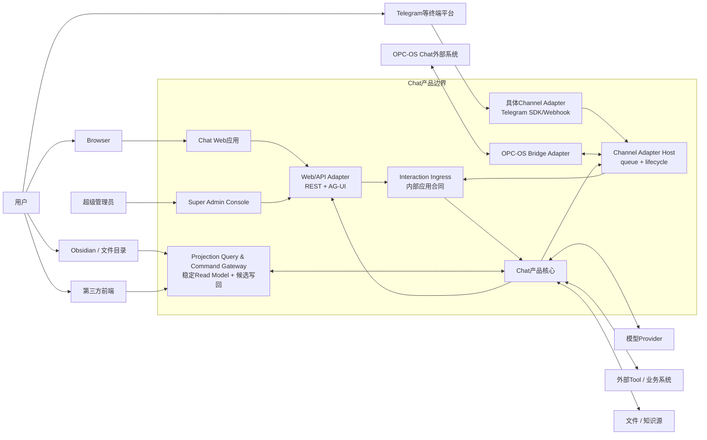

# Chat 总体架构与模块基线

> 状态：已批准。2026-07-24用户批准总体基线；2026-07-30用户进一步批准D1-D4架构补全。
> 更新日期：2026-07-30
> 决策依据：[总体架构源码研究与推导](./overall-architecture-research.md)
> 愿景与协作落地依据：[Chat持续协作系统研究与落地推导](./chat-collaboration-system-research.md)
> 新手阅读：[从前端对象到Agent内部](./architecture-beginner-guide.md)
> 约束：本文定义完整产品的目标架构。D1-D4批准只冻结逻辑责任、投影边界和交付坐标，不授权
> Schema、迁移、物理目录重构或产品代码；各模块仍须经过自己的详细设计门。

> 模块数量说明：正式目标架构现在包含**14个逻辑状态所有者、3个应用组件和3类运行责任**。
> 14不是永久数量指标；它由16类异质场景、23项目标能力及独立状态/事务/权限/恢复/变化原因重新计算。
> 2026-07-24的11模块是历史批准基线；2026-07-30的D1-D3保留其全部产品保证，同时把Collaboration
> 显式拆成Work、Knowledge、Protocol和Governance，并新增Schedule状态所有者与Projection应用边界。
> 推导与追踪见[目标能力、架构责任与开发地图](./product-capability-architecture-map.md)。

## 1. 架构结论

Chat不采用“前端聊天组件直接调用MAF Agent，AG-UI事件即全部产品状态”的结构。目标架构由3类明确责任组成：

1. **交互适配器与统一入站合同**：Web应用、Web/API Adapter、具体Channel Adapter、Channel Adapter Host和Interaction Ingress。
2. **产品状态所有者与应用组件**：14个状态所有者分别拥有Identity、Conversation、Work、Knowledge、Protocol、Collaboration Governance、Context、Memory、Run、Tool、Evidence、Schedule、Delivery和Super Admin Operations事实；Interaction Ingress、Interaction Coordinator与Projection Query & Command Gateway只协调用例和投影，不拥有这些事实。
3. **运行与基础设施责任**：MAF Runtime Adapter、Execution Runtime和Platform Operations；业务Schedule与Runtime Reconciler严格分开。

核心调用链：

```text
Chat Web / 具体外部平台 / OPC-OS Chat
→ 各自Web或Channel Adapter终止协议
→ Interaction Ingress建立可信内部请求
→ 可信身份和Channel Binding
→ 建立Interaction并保存User Message
→ 装配ContextPackage
→ 读取Work/Knowledge/Protocol并形成Intent / Plan / ExecutionDraft候选
→ 按HITL策略取得人工或自动Decision Record
→ 编译不可变RunSpec
→ 创建Product Run与Run Attempt
→ 每次Provider调用形成完整ModelCallDraft并独立授权
→ MAF执行Agent/Workflow，并通过Tool执行模块调用外部能力
→ 保存Run结果、Evidence和Assistant Message
→ 成功终态投影到AG-UI
→ 创建Delivery并取得Web或外部Channel回执
→ 提出Memory候选，明确采纳后供未来Context使用
→ 由Projection Gateway生成Web、Obsidian或第三方前端所需的同源Read Model
```

周期触发链与送达链分开：

```text
Schedule revision到期
→ Schedule Trigger Worker领取Trigger Occurrence
→ Interaction Coordinator创建新的Interaction/Product Run血缘
→ 正常治理、执行、Evidence与产品提交
→ Delivery只负责把既有结果送达，不重新执行周期工作
```

独立运营查询链：

```text
超级管理员
→ Super Admin Console
→ Web Authentication + Super Admin Role/Grant
→ Super Admin Operations查询
→ 只读关联Identity活动事实、Product Harness工作事实、Evidence作品事实和Run/Delivery异常
→ 返回带口径、来源、新鲜度和未知状态的运营投影
→ 记录Super Admin Audit Event
```

这条链直接组合了4个参考项目的结构经验：

- pi：产品AgentSession在通用Agent Loop之外协调资源和Session。
- nanobot：Channel、AgentLoop、AgentRunner、Session、Memory和Runtime Event各有边界。
- QwenPaw：Web Console经Console Route/ConsoleChannel进入统一AgentRequest；Telegram等平台经具体Channel Adapter和队列进入同一Workspace/Runtime。
- LibreChat：Web产品资源、Conversation/Message、活动Generation Job和实时订阅分开。

Chat新增的Work、Protocol、Governance、Schedule、Approval、Evidence、Delivery、外部Binding、Projection和Super Admin Operations不是参考项目现成模块，而是由本项目用户问题、独立运营责任和已确认场景补足。
参考项目用于校准对象生命周期、入口拓扑、运行恢复和工程取舍；它们不能替代前述产品场景推导，也不为未真实覆盖的Intent、Work、Approval、Evidence或Admin Operations背书。

本文主要回答模块责任、合同和状态所有权。第一次阅读时可先看[新手架构导读](./architecture-beginner-guide.md)：它把同一架构展开为前端View、网络DTO、产品领域对象、MAF运行对象和一次真实请求的对象流，不另行创造架构决定。

## 2. 系统上下文



边界结论：

1. Chat是独立产品，自己拥有Product Session、Work、Run、Evidence、Delivery和Memory。
2. Chat Web是产品自带客户端，通过Web/API Adapter访问自己的后端，不是一个外部Channel平台。
3. Telegram等终端平台必须先进入对应Channel Adapter；平台不能直接调用Chat产品核心。
4. OPC-OS Chat是对等外部系统，通过独立Bridge Adapter互操作；它与Telegram不是同一种对象，也不替Chat保存产品事实。
5. Web Adapter和Channel Adapter只在转换成内部`InboundInteraction`后，才能调用Interaction Ingress。
6. 模型Provider、Tool和知识源都是依赖，不能成为用户身份或产品授权来源。
7. 外部系统只能通过公开Bridge合同读取或提交状态，不能直接写Chat私有表。
8. 超级管理员控制台属于Chat产品自带Web能力，通过专用REST查询进入授权与运营模块；它不直接读数据库，也不通过AG-UI管理产品资源。
9. Web、Obsidian和第三方前端通过Projection合同读取同一权威事实；文件或页面编辑只能形成候选命令，不能直接覆盖Product Store。

## 3. 总体模块关系

```mermaid
flowchart TB
    Browser["Browser"]
    SuperAdmin["超级管理员"]
    Telegram["Telegram等平台"]
    OPCOS["OPC-OS Chat"]

    subgraph Entry["交互适配器与统一入站合同"]
        Web["Web应用"]
        AdminConsole["Super Admin Console"]
        REST["REST Resource Adapter"]
        AGUI["AG-UI Interaction Adapter"]
        TelegramAdapter["具体Channel Adapter"]
        OPCAdapter["OPC-OS Bridge Adapter"]
        ChannelHost["Channel Adapter Host\nqueue + lifecycle"]
        Ingress["Interaction Ingress"]
    end

    subgraph Apps["应用组件"]
        Ingress["APP-INGRESS\nInteraction Ingress"]
        Interaction["APP-INTERACTION\nInteraction Coordinator"]
        Projection["APP-PROJECTION\nRead Model + 候选命令"]
    end

    subgraph Product["14个逻辑状态所有者"]
        Identity["Identity与Channel Binding"]
        Conversation["Conversation"]
        Work["Work"]
        Knowledge["Knowledge"]
        Protocol["Protocol"]
        Context["Context"]
        Memory["Memory"]
        Governance["Collaboration Governance"]
        Run["Run管理"]
        ToolOps["Tool执行"]
        Evidence["Evidence"]
        Schedule["Schedule"]
        Delivery["Delivery"]
        AdminOps["Super Admin Operations"]
    end

    subgraph Runtime["运行与基础设施适配器"]
        MAF["RT-MAF\nMAF Runtime Adapter"]
        ProductStore["Product Store"]
        RuntimeStore["Runtime Store / Event Journal"]
        MAFStore["MAF History / Checkpoint Store"]
        ArtifactStore["Artifact Store"]
        Workers["RT-EXECUTION\nExecution / Schedule / Reconciler / Delivery"]
        Platform["RT-PLATFORM\n配置 / 安全 / 可观测 / 备份 / SLO"]
    end

    Browser --> Web
    SuperAdmin --> AdminConsole --> REST
    Web --> REST
    Web --> AGUI
    Telegram --> TelegramAdapter --> ChannelHost
    OPCOS --> OPCAdapter --> ChannelHost
    AGUI --> Ingress
    ChannelHost --> Ingress
    REST --> Projection
    REST --> Identity
    REST --> Conversation
    Ingress --> Identity
    Ingress --> Conversation
    Ingress --> Interaction
    Interaction --> Conversation
    Interaction --> Context
    Context --> Conversation
    Context --> Work
    Context --> Knowledge
    Context --> Memory
    Context --> Evidence
    Interaction --> Protocol
    Interaction --> Governance
    Interaction --> Work
    Interaction --> Run
    Schedule --> Workers
    Workers --> Interaction
    Run --> Workers --> MAF
    MAF --> ToolOps
    Run --> Evidence
    Run --> Conversation
    Run --> Delivery
    Delivery --> AGUI
    Delivery --> ChannelHost
    ChannelHost --> TelegramAdapter --> Telegram
    ChannelHost --> OPCAdapter --> OPCOS
    Run --> AGUI
    Projection --> Identity
    Projection --> Conversation
    Projection --> Work
    Projection --> Knowledge
    Projection --> Protocol
    Projection --> Context
    Projection --> Memory
    Projection --> Governance
    Projection --> Run
    Projection --> ToolOps
    Projection --> Evidence
    Projection --> Schedule
    Projection --> Delivery
    Projection --> AdminOps
    Identity --> ProductStore
    Conversation --> ProductStore
    Work --> ProductStore
    Knowledge --> ProductStore
    Protocol --> ProductStore
    Context --> ProductStore
    Memory --> ProductStore
    Governance --> ProductStore
    Run --> ProductStore
    ToolOps --> ProductStore
    Evidence --> ProductStore
    Schedule --> ProductStore
    Delivery --> ProductStore
    AdminOps --> Identity
    AdminOps --> Work
    AdminOps --> Evidence
    AdminOps --> Run
    AdminOps --> Delivery
    AdminOps --> ProductStore
    Workers --> RuntimeStore
    MAF --> MAFStore
    Evidence --> ArtifactStore
    Platform --> ProductStore
    Platform --> RuntimeStore
    Platform --> MAFStore
    Platform --> ArtifactStore
```



图中的箭头表示允许的主要调用方向，不表示每次请求都经过全部模块。数据库方框是端口的实现；模块只能通过自己的Repository接口访问自己拥有的状态。

### 3.1 从用户点击到模型返回的主链

上图按模块展示依赖；同一架构按一次Web操作的时间顺序展开如下：

```text
用户点击发送
→ React Conversation Workspace调用AG-UI Client
→ Web/API Adapter终止HTTP/AG-UI并调用Interaction Ingress
→ Identity建立可信RequestContext
→ Conversation先把Interaction和User Message写入Product Store
→ Interaction协调器调用Context、Protocol、Work与Governance
→ Context从Conversation、Work、Knowledge、Memory和Evidence生成ContextPackage
→ Run管理创建Product Run、Run Attempt和Runtime Job
→ Worker调用MAF Runtime Adapter，加载AgentSession/History/Checkpoint
→ Model Call Gateway编译完整Provider Body并保存ModelCallDraft/Approval
→ AG-UI Interrupt回到前端，用户查看、修改或批准
→ Resume后原子创建Model Call Attempt并原样发送已批准Body
→ Provider SSE/JSON由Response Decoder解析成文本、Tool Call、Usage或结构化内容
→ MAF Runtime Event Translator写Event Journal并投影活动流
→ Interaction协调器把模型内容解析成回复、Intent/Plan/Memory候选或Tool请求
→ Tool请求进入Tool Policy、Approval、Execution Ledger和外部对账
→ Finalizer提交Run终态、Assistant Message、Evidence和Delivery Outbox
→ AG-UI Projector发送最终事件，HttpAgent更新消息，React渲染结果
→ Projection Gateway以同一Product事实重建Dossier、Board、Calendar或Obsidian投影
```

Agent具有运行时Session、History和Tool协作能力，但Product Session生命周期属于Conversation，Tool授权、副作用和对账属于Tool执行模块。Product Store、Runtime Store、MAF History/Checkpoint Store、AG-UI Snapshot Store和Artifact Store可以物理共置，逻辑所有权不能合并。完整逐步解释和当前代码对照见[新手架构导读第2节](./architecture-beginner-guide.md#2-一条请求从前端到后端到底经过什么)。

## 4. 进程角色与部署关系

| 进程角色 | 责任 | 不承担 |
|---|---|---|
| FastAPI API | Web REST资源、AG-UI接纳/订阅、认证、Web DTO转换、查询投影 | 不接收未经Adapter验证的平台原生事件，不以HTTP连接寿命决定Run寿命 |
| Channel Adapter Host | 运行具体平台Adapter/Bridge、终止SDK/Webhook/WebSocket协议、维护Channel队列和连接生命周期 | 不拥有Conversation/Run事实，不把平台sender/chat ID直接当产品授权 |
| Execution Worker | 领取Run Attempt、执行MAF Agent/Workflow、续租、记录运行事件和安全点 | 不自行改变Approval或伪造Product Session权限 |
| Schedule Trigger Worker | 领取已到期的业务Trigger Occurrence，按Schedule revision和Misfire决定创建新的Interaction/Run血缘 | 不拥有Schedule规则，不复用旧Run，不负责Delivery重试 |
| Runtime Reconciler | 扫描租约过期、等待恢复和结果未知的运行，决定接管/对账/人工处置 | 不解释业务周期，不盲目重放外部副作用 |
| Delivery Worker | 从Outbox领取Delivery，调用Web/Channel适配器，记录回执和重试 | 不重新生成Run结果，不把发送失败改写成Run失败 |
| Projector | 将Runtime/Product Event转换成AG-UI事件，并为Projection Gateway和运营模块维护可重建读模型 | 不把投影当Product DB权威事实，不自行解释人的使用时长 |

这些是不同的运行责任，不强制部署成5个独立服务。它们可以在一个本地进程中共同运行，也可以拆成多个进程；无论如何，Run领取、事件提交和Delivery回执的合同保持不变。

## 5. 依赖方向和禁止事项

允许方向：

```text
Chat Web → Web/API Adapter ─────────────────┐
具体平台 → 具体Channel Adapter → Host/Queue ├→ Interaction Ingress
OPC-OS Chat → Bridge Adapter → Host/Queue ──┘
        → Identity / Conversation接纳 / Interaction协调器
        → 各产品模块公开用例
            → Repository / Runtime / Event / Tool端口
                ← SQLite / MAF / AG-UI / 外部Channel等适配器实现
```

禁止事项：

1. React组件直接拼数据库对象或把Zustand当服务端事实源。
2. FastAPI Route直接操作MAF Agent、SQLite表或外部Tool而绕过应用模块。
3. Telegram、OPC-OS Chat或任何平台原生Webhook直接调用Conversation、Interaction协调器、Run或数据库。
4. Product领域对象引用MAF类、AG-UI事件类或某个Channel SDK类型。
5. MAF运行适配器直接修改Work、Approval、Evidence或Delivery表。
6. 外部Channel使用`chat_id`、`threadId`或`session_id`绕过Principal和Scope校验。
7. Worker只凭超时就重试副作用Tool；必须先查Tool Execution及外部状态。
8. 在AG-UI发出成功终态后才保存Assistant Message或Evidence。
9. 一个“ChatService”“HarnessService”或Projection数据库同时拥有所有领域状态、运行恢复和投递。
10. 超级管理员前端或运营服务直接联表读写Product DB、复制Work/Artifact进度，或用Run耗时冒充人的使用时长。
11. Obsidian、Markdown、Web看板或第三方前端直接写领域表，或把文件时间戳当作对象revision。

## 6. 交互适配器

### 6.1 Web应用

**参考来源**：LibreChat的App/Root/Feature Route、Data Provider和React Query；不复制其多套全局状态历史。

**用户价值**：让用户在同一产品中查看会话、上下文、意图、计划、审批、运行、证据、记忆和交付状态，而不是只看到一串文本。

**内部组成**：

1. App Shell：路由、主题、错误边界、认证状态和全局Query Client。
2. Conversation Workspace：消息树、输入框、分支、搜索和归档入口。
3. Collaboration Panels：Intent、Work、Plan、Draft和Approval编辑/审核。
4. Run Inspector：Run、Attempt、Tool、事件、Checkpoint和恢复动作。
5. Evidence/Memory Views：来源、有效性、候选采纳、纠正和删除。
6. Integration Settings：Channel Binding、能力、权限和回执状态。
7. Product API Client：OpenAPI生成或Schema校验的REST客户端。
8. AG-UI Client Adapter：`@ag-ui/client`事件消费、重连和Hydrate，不拥有产品事实。
9. Super Admin Console：在服务端Role/Grant通过后展示用户、登录、使用、Project/Work、Artifact/Evidence、阻塞与异常，不与普通用户个人主页混用权限和查询合同。

**状态所有权**：React Query缓存服务端产品资源；AG-UI Client保存当前订阅的运行投影；Zustand只保存导航、选中面板、筛选、弹窗和布局。

**失败处理**：AG-UI断线后先从Run状态和事件游标恢复；REST查询失败显示陈旧/不可用状态，不把本地缓存写回为权威终态。

**验收**：刷新、断线、重复打开标签页、旧事件到达、Session切换、窄屏和键盘操作均不能产生第二事实源。

### 6.2 Web/API Adapter

**参考来源**：LibreChat把产品资源Route与Agent Route分开；QwenPaw的Console React只调用`/api/console/chat`，该Route再通过ConsoleChannel生成内部请求。

**责任**：作为Chat Web与后端之间的协议中间层，终止REST和AG-UI，完成Web DTO到内部合同的转换。REST Resource Adapter调用对应产品模块的公开查询/命令；AG-UI Interaction Adapter调用Interaction Ingress。它们属于Chat后端接口边界，但不是产品核心。

**内部组成**：

1. REST Resource Routes：Session、Message、Work、Run、Evidence、Memory、Delivery、Binding和Super Admin Operations查询/命令。
2. AG-UI Interaction Route：接纳`RunAgentInput`，转换成`InboundInteraction`并调用Interaction Ingress。
3. Web Authentication Adapter：把Cookie/Token解析为来源声明，交Identity模块验证。
4. Contract Mapping：HTTP/AG-UI DTO与应用命令/查询相互转换。
5. Run Subscription：把Run Event Journal投影成AG-UI事件，支持游标和Hydrate。
6. Error Mapping：稳定错误码、可恢复性、关联ID和安全错误文本。

**明确不负责**：平台Channel SDK、产品状态机、直接数据库写入、MAF上下文选择和Tool调用。

**关键合同**：REST管理产品资源；AG-UI表达一次交互涉及的实时Run事件和状态投影。AG-UI `threadId`映射Product Session，但不自动授权。AG-UI Interaction Adapter必须调用Interaction Ingress，REST Resource Adapter必须调用产品模块公开用例；二者都不能直接调用MAF或Repository实现。

**技术落点**：`backend/app/interfaces/http/rest/`、`backend/app/interfaces/http/ag_ui/`。

### 6.3 Channel Adapter Host

**参考来源**：QwenPaw的具体`TelegramChannel`、`BaseChannel`、`ChannelManager`和`UnifiedQueueManager`；nanobot的ChannelManager/Channel与MessageBus边界。

**责任**：承载外部协议Adapter的连接和消费生命周期。Telegram、飞书等是终端平台；OPC-OS Chat是外部系统，分别使用不同Adapter，不能用一个“其他入口”标签合并。

**内部组成**：

1. Concrete Channel Adapters：Telegram SDK/Webhook、OPC-OS Bridge及未来明确批准的平台实现。
2. Protocol Endpoint：Webhook、WebSocket、Polling、系统间HTTP或消息协议的终止点。
3. Source Verifier：平台签名、Bot身份、系统凭据和重放窗口验证。
4. Capability Mapper：文本、附件、流式、审批卡片和回执能力转换。
5. Channel Queue Manager：按Channel Binding/Product Session或可靠等价键排序、限流和隔离消费。
6. Outbound Renderer：把Delivery Payload转换成平台消息并保存平台回执。
7. Adapter Lifecycle：启动、健康、重连、停机和配置更新。

**输入/输出合同**：平台原生事件只能进入对应Adapter；Adapter输出规范化`ChannelEnvelope`，再调用Interaction Ingress。出站只消费Delivery命令，不直接读取Run内部状态。

**状态**：Adapter连接/游标属于Host运行状态；Channel定义和Binding属于Identity；已接纳Interaction属于Conversation；出站Delivery/Receipt属于Delivery。

**不变量**：平台不能直接调用产品核心；Adapter不得直接创建Product Run；外部sender/chat/session ID不构成产品授权；Web AG-UI协议不强迫外部平台实现。

**失败与测试**：签名错误、Webhook重复、平台乱序、队列满、Adapter重连、群聊身份、能力降级、发送成功但回执丢失必须按Adapter测试。

**技术落点**：`backend/app/interfaces/channels/base/`、`telegram/`、`opc_os/`及`backend/app/infrastructure/channel_queue/`。是否独立成进程是部署决定，不改变合同。

### 6.4 Interaction Ingress

**参考来源**：QwenPaw所有Channel最终构造统一`AgentRequest`再进入Workspace；本项目不能直接复制该Schema，因此定义自己的产品入站合同。

**责任**：作为Web/API Adapter和全部Channel Adapter唯一可调用的内部入站应用端口，把已终止协议的请求转成可信、幂等、有序的产品Interaction。

**内部组成**：

1. Envelope Validator：验证`request_id`、来源、内容、时间、附件引用和合同版本。
2. Identity/Binding Resolver：调用Identity模块得到Principal、Scope和Product Session映射。
3. Idempotency Gate：按来源消息ID/请求ID返回既有接纳结果或创建新Interaction。
4. Session Sequencer：保证同一Product Session的冲突命令按明确并发策略处理。
5. Conversation Acceptor：先持久化Interaction和User Message。
6. Interaction Dispatcher：接纳成功后调用Interaction协调器，返回Interaction/Run关联与订阅信息。

**内部合同候选**：`AcceptInboundInteraction(ChannelEnvelope|WebEnvelope) -> InteractionAccepted`。它不是公开wire schema，外部平台不能直接发送该对象绕过Adapter。

**不负责**：平台SDK、页面查询、Intent/Plan业务规则、MAF执行、Delivery发送。

**不变量**：身份解析早于产品写入；用户输入早于模型执行持久化；重复请求不创建第二Interaction；所有入口使用同一接纳与权限规则。

**技术落点**：`backend/app/application/ingress/`；接纳完成后调用`backend/app/application/interaction/`。

### 6.5 Adapter的逻辑边界与部署选择

逻辑边界固定：任何协议都必须先经过Adapter，再调用Interaction Ingress。物理部署有3种选择：

| 选择 | 结构 | 优点 | 缺点 | 结论 |
|---|---|---|---|---|
| A. Chat内置Channel Adapter Host | 类似QwenPaw，TelegramChannel等与Chat后端共同装配，通过进程内Ingress端口进入核心 | 调用链短；配置、健康和开发体验统一；最接近已研究源码 | 平台SDK依赖进入Chat部署；某个Adapter故障需进程隔离措施 | **推荐作为Chat原生支持Channel的形态** |
| B. 独立Channel Adapter进程 | Adapter进程通过受认证的Ingress网络端点调用Chat | 平台依赖和故障隔离更强；可独立扩缩 | 增加网络合同、部署、重放和版本兼容成本 | 合同保持支持，按具体Channel运维需要采用 |
| C. OPC-OS Chat托管渠道后调用Bridge | Telegram等先由OPC-OS Chat聚合，Chat只实现一个OPC-OS Bridge | Chat不维护每个平台SDK；复用上游渠道治理 | 依赖尚未取得的OPC-OS合同；上游故障影响入口；双方状态归属更复杂 | 作为系统间集成形态保留，不能冒充已确认默认拓扑 |

明确拒绝第4种隐含选择：Telegram/OPC-OS Chat直接调用Conversation、Run或MAF端点。即使Adapter与FastAPI部署在同一进程，调用仍必须经过`ChannelEnvelope → Interaction Ingress`合同。

## 7. 14个逻辑状态所有者

### 7.1 Identity与Channel Binding模块

**为什么存在**：LibreChat的Agent入口包含Agent、资源和Conversation访问校验；QwenPaw明确区分ACL sender、session_id和统一AgentRequest，并暴露sender缺失时的风险；nanobot的chat id同样不提供完整授权。Chat还需要与外部系统对等互操作。

**用户价值**：确保用户从Web或外部入口回来时进入正确Session，只能看到和执行被授权的资源，并可撤销外部绑定。

**拥有的对象**：Principal、Role、Scope/Grant、Authentication Session、Authentication Event、Channel、Channel Binding、Binding版本和撤销状态。

**内部组件**：

1. Principal Resolver。
2. Authentication Session Service。
3. Role/Grant Authorizer。
4. Channel Registry。
5. Binding Service。
6. Access Audit Writer。

**输入/输出合同**：

- 输入：认证凭据、外部主体、Channel会话、目标资源和请求能力。
- 输出：可信`RequestContext(principal_id, role_and_grants, scopes, auth_session_id, channel_id, binding_id)`或拒绝原因。

**依赖**：自己的Repository和审计端口；不依赖Conversation内部表。

**不负责**：保存Message、选择Context、决定Run终态或代表外部系统保存其私有身份事实。

**不变量**：ID映射不等于授权；Binding可撤销；每次访问按当前Grant判断；服务端创建映射。

**失败与测试**：凭据过期/续期/撤销、多设备会话、Role或Grant撤销、Binding撤销、跨Session越权、重放、Channel能力降级和权限变更必须有合同测试。

**技术落点与场景**：目标逻辑边界为`modules/identity/`；支撑第13.1、13.3、13.6、13.8、13.9节。

### 7.2 Conversation模块

**为什么存在**：pi SessionManager、nanobot SessionManager和LibreChat Conversation/Message都把长期历史放在Agent运行内核之外。

**用户价值**：创建、打开、继续、分支、搜索、归档和导出长期会话；刷新或重启后仍能看到已提交事实。

**拥有的对象**：Product Session、Interaction、Message、Message父子关系、Session生命周期、标题、归档、入站幂等记录。

**内部组件**：

1. Session Service：创建、打开、归档、恢复和访问检查。
2. Interaction Journal：一次输入的接纳、来源和处理状态。
3. Message Tree：User/Assistant/Tool可见消息、父子与分支。
4. History Query：分页、当前分支、搜索和导出。
5. Conversation Committer：原子提交User/Assistant Message和关联ID。

**输入/输出合同**：`AcceptInteraction`、`AppendMessage`、`CommitAssistantResult`、`GetHistory`、`ForkBranch`、`ArchiveSession`。

**依赖**：Identity授权结果和自己的Repository；不调用MAF。

**不负责**：决定长期Memory是否生效、执行Agent、保存MAF Checkpoint或判断外部消息是否送达。

**不变量**：Interaction接纳幂等；消息不可静默改写；分支有明确parent；Assistant成功消息只能引用已存在Interaction/Run；归档不等于删除。

**失败与测试**：重复入站、父消息缺失、并发分支、提交中断、分页游标失效和导入冲突必须测试。

**技术落点与场景**：目标逻辑边界为`modules/conversation/`；支撑第13.1、13.2、13.4、13.6、13.7、13.11节。

### 7.3 Work模块

**为什么存在**：Project、Work、Plan和Action拥有跨回合生命周期、责任人、依赖、CAS与完成门；它们的变化节奏不同于意图理解和执行授权。继续把它们藏在Collaboration大模块或聊天摘要中，会让项目推进没有稳定所有者。

**用户价值**：用户能脱离某个Product Session查看一个Project是什么、当前阶段、开放Work、下一行动、阻塞、计划版本、完成依据和历史推进。

**拥有的对象**：Project、WorkItem、TaskPlan/Revision、PlanNode、ActionItem、责任、依赖、状态、关联和工作级Outbox。

**内部组件**：Project Catalog、Work Lifecycle Service、Plan Revision Service、Action/Responsibility Service、Work Query与Progress Projector。

**输入/输出合同**：`CreateProject`、`CreateOrAdoptWork`、`ReviseTaskPlan`、`AssignAction`、`TransitionWork`、`GetProjectDossierSource`、`ListOpenWork`。

**依赖**：Identity授权；通过稳定引用关联Conversation、Knowledge、Protocol、Schedule和Evidence。完成迁移必须由应用协调器在同一事务中调用Evidence门，不自行接受模型自述。

**不负责**：理解Intent、决定HITL、保存Note正文、执行Workflow、计算Schedule到期或验证Artifact。

**不变量**：模型只能提出Work/Plan候选；计划修改产生新revision；Action责任明确；`completed`必须满足当前版本的Evidence/Result Commit要求；Product Session不是Project边界。

**失败与测试**：并发计划修订、依赖环、跨Project引用、Action与父Work冲突、过期Evidence、重复命令和事务回滚必须测试。

**技术落点与场景**：目标逻辑边界为`modules/work/`；W4-01详细设计已经批准，当前代码仍物理共置于`harness/`，后续只按已批准公开合同、无行为指纹和迁移/回滚门演进。支撑第13.1、13.2、13.7、13.9至13.11节。

### 7.4 Knowledge模块

**为什么存在**：Note、研究记录、决定、Idea和可执行规则引用有自己的作者、来源、revision、冲突和失效语义；它们既不是完整Conversation History，也不是已接受Memory。

**用户价值**：用户能积累、修订和追溯学习材料、研究结论、项目决定与规则，并知道某条内容来自哪里、哪个版本仍有效。

**拥有的对象**：Note、Note Revision、Knowledge Source Reference、Rule Reference、Idea候选/升级关联和知识级失效状态。

**内部组件**：Note Service、Revision/Conflict Service、Source Linker、Rule Reference Registry、Knowledge Query与Invalidation Participant。

**输入/输出合同**：`CreateNote`、`ReviseNote`、`LinkSource`、`ProposeIdeaUpgrade`、`InvalidateKnowledgeSource`、`QueryProjectKnowledge`。

**依赖**：Identity和自己的Repository；通过公开引用关联Work、Protocol、Context、Memory和Evidence。

**不负责**：把Note自动提升为Accepted Memory、决定本轮Context采用、拥有Artifact Blob或把规则直接写进System Prompt。

**不变量**：revision不可静默改写；每条正式知识有作者和来源；来源失效不删除历史但影响有效性；规则进入执行前必须经Protocol/Context/Governance绑定。

**失败与测试**：并发修订、来源撤销、跨Scope读取、Idea重复升级、规则引用失效和异步索引失败必须测试。

**技术落点与场景**：目标逻辑边界为`modules/knowledge/`；当前Note实现位于`harness/`。支撑研究、学习、Idea和多投影场景。

### 7.5 Protocol模块

**为什么存在**：项目推进、学习、研究、内容交付和软件开发采用不同方法，但方法不能散落在Prompt、Memory或Workflow条件中。Protocol拥有独立定义、版本、Binding、覆盖与升级节奏。

**用户价值**：用户能看见“这次按什么方法推进、规则从哪里来、适用于哪个Project/Work、版本变化会影响什么”，并可选择、覆盖或停用。

**拥有的对象**：Collaboration Protocol Definition/Revision、Protocol Binding、作用域优先级、覆盖、升级和停用状态。

**内部组件**：Definition Registry、Revision Publisher、Binding Resolver、Scope/Override Evaluator、Upgrade/Compatibility Service和Protocol Projection。

**输入/输出合同**：`PublishProtocolRevision`、`BindProtocol`、`ResolveEffectiveProtocol`、`PreviewProtocolUpgrade`、`RetireProtocolRevision`。

**依赖**：Identity授权；引用Work/Project作用域、Knowledge规则和Evidence验证要求，但不拥有这些事实。

**不负责**：创建Work、选择最终Context、执行MAF Workflow或把协议文本直接当RunSpec。

**不变量**：已被Run引用的revision不可原地修改；Binding解析确定且可解释；用户/Project/Work/系统层级冲突有稳定优先级；协议变化使受影响Draft/RunSpec重新验证。

**失败与测试**：循环继承、Binding冲突、版本停用、升级不兼容、权限撤销和旧Run重放必须测试。

**技术落点与场景**：目标逻辑边界为`modules/protocol/`；当前实现位于`collaboration_protocols/`。支撑项目、学习、研究、内容交付和Chat Dogfood。

### 7.6 Collaboration Governance模块

**为什么存在**：Intent理解和执行授权共同保护“系统理解了什么、准备做什么、用户实际授权了什么”，但它们不能继续拥有Work、Note或Protocol生命周期。

**用户价值**：用户能查看和修正一个或多个Intent、ExecutionDraft、HITL决定、RunSpec和逐次Provider请求，并确信授权内容与实际执行精确一致。

**拥有的对象**：Intent/Intent Set、Clarification Request、ExecutionDraft、RunSpec、HITL Policy、Evaluation、Human Decision Request、Decision Record、Grant/Consumption、ModelCallDraft和Approval。

**内部组件**：Intent Service、Clarification Service、Draft Service、HITL Policy Resolver、Decision/Approval Service、RunSpec Compiler和ModelCall Draft Compiler。

**输入/输出合同**：`ProposeIntentSet`、`RecordClarificationAnswer`、`PrepareExecutionDraft`、`EvaluateDecisionPoint`、`RecordDecision`、`CompileRunSpec`、`PrepareModelCallDraft`、`EvaluateExecutionGate`。

**依赖**：Identity、Conversation引用、ContextPackage、Work/Plan引用、Protocol revision和能力目录；不直接启动MAF，只向Interaction Coordinator返回“可执行/需澄清/需审批/禁止”。

**不负责**：推进Work状态、保存Note、领取Worker任务、执行Tool、计算Schedule或保存运行事件。

**不变量**：模型只能提出候选；Decision绑定不可变对象版本与Hash；Draft/Context/Protocol/权限变化后旧决定失效；RunSpec编译后不可变；每份ModelCallDraft独立版本、Hash和授权判断；系统下限不能被用户偏好放宽。

**失败与测试**：多Intent修正、可回答澄清、并发Draft、过期Approval、权限缩小、协议/计划失效、决定重放与Hash篡改必须测试。

**技术落点与场景**：目标逻辑边界为`modules/governance/`；当前实现分布在`collaboration_intents/`、`governance/`和主Workflow。支撑第13.1至13.5、13.7、13.10节。

### 7.7 Context模块

**为什么存在**：pi的完整树与当前leaf/compaction分开，nanobot在AgentLoop中独立Build/Compact；用户还需要知道本轮模型实际用了什么。

**用户价值**：每次交互都能查看、增删和复现被纳入的会话、工作、记忆、证据和附件上下文。

**拥有的对象**：ContextPackage、ContextItem、选择/排除原因、裁剪摘要、Token预算、来源版本和有效性快照。

**内部组件**：

1. Context Collector：从Conversation、Work、Knowledge、Protocol、Memory和Evidence按引用读取候选。
2. Selector/Ranker：依据当前Intent、用户固定项和预算选择。
3. Compactor：生成带来源引用的裁剪/摘要，不删除原始事实。
4. Context Reviewer：接受用户增删与锁定。
5. Materializer：生成交给MAF的不可变输入。

**输入/输出合同**：`BuildContext(interaction_id, intent_refs, policy)`、`ReviseContext`、`MaterializeContext(run_id)`。

**依赖**：通过公开查询读取Conversation、Work、Knowledge、Protocol、Memory和Evidence；写自己的Repository。

**不负责**：决定Memory候选是否生效、修改原始Message、批准Draft或保存模型隐藏推理。

**不变量**：一次Run只绑定一个明确版本；每个Item有来源；失效来源不会静默进入新Context；摘要不替代原始证据。

**失败与测试**：Token超限、来源删除、权限撤销、并发修订、摘要失败和重复历史注入必须测试。

**技术落点与场景**：目标逻辑边界为`modules/context/`；支撑第13.1、13.2、13.3、13.7、13.10节。

### 7.8 Memory模块

**为什么存在**：nanobot直接把Session和Memory分成不同存储；Chat问题5要求模型候选不能自动成为正式事实。

**用户价值**：跨Session复用稳定偏好、项目事实和工作经验，同时能看到来源、纠正、撤销和失效。

**拥有的对象**：Memory Candidate、Accepted Memory、版本、来源引用、有效期、适用Scope、纠正/撤销和失效状态。

**内部组件**：

1. Candidate Extractor：从已提交Interaction、Run和Evidence提出候选。
2. Admission Gate：用户或明确规则采纳。
3. Memory Store/Query：按Scope和相关性查询。
4. Provenance Monitor：消费Evidence/Source失效事件并降级Memory。
5. Correction Service：修订、合并、撤销和保留历史。

**输入/输出合同**：`ProposeMemory`、`AcceptMemory`、`RejectMemory`、`QueryRelevantMemory`、`InvalidateBySource`。

**依赖**：Conversation、Evidence和Identity的公开引用/事件，以及自己的Repository。

**不负责**：保存完整聊天历史、决定每轮Context最终选择、把任意模型输出自动提升为事实。

**不变量**：模型文本不自动生效；每条正式Memory有采纳者/规则和来源；撤销后不进入新Context；历史修改可追溯。

**失败与测试**：重复候选、来源失效、Scope越界、并发纠正、撤销后缓存残留和错误合并必须测试。

**技术落点与场景**：目标逻辑边界为`modules/memory/`；支撑第13.1、13.7节，并为所有后续Interaction提供受控跨会话连续性。

### 7.9 Run管理模块

**为什么存在**：LibreChat把HTTP接纳、Generation Job和SSE订阅分开；pi/nanobot没有提供完整Worker Lease，因此Chat必须补足长期Product Run与Attempt。

**用户价值**：执行可以断线继续、暂停、取消、恢复和追踪；重启后用户知道是成功、失败、等待还是结果未知。

**拥有的对象**：Product Run、Run Attempt、Model Call Attempt、Runtime Job、Worker Lease、Run Event Journal、Run Trace、取消请求、恢复血缘和终态原因。

**内部组件**：

1. Run Service：从已通过Gate的Draft创建Product Run。
2. Attempt Manager：创建Run Attempt和其下的Model Call Attempt，原子领取、续租、接管并隔离旧Attempt；Provider请求一旦开始派发，超时只能进入明确失败或结果未知语义，不能自动重发。
3. Runtime Queue：发布可领取Job；实现可为数据库队列。
4. Event Journal：持久记录规范化运行事件与单调序号。
5. Run Controller：暂停、取消、steer、resume和HITL关联。
6. Finalizer：核验Attempt所有权、Tool状态、Evidence和Message提交后再发布成功终态。
7. Reconciler：处理租约过期、卡住、事件缺口和结果未知。

**输入/输出合同**：`CreateRun(draft_ref, context_ref)`、`ClaimAttempt`、`AppendRunEvent`、`Pause/Resume/CancelRun`、`FinalizeRun`、`ReconcileRun`、`SubscribeEvents(after_seq)`。

**依赖**：Governance Gate、Context引用、MAF Runtime端口、Tool执行、Evidence、Conversation和Delivery。

**不负责**：决定用户身份、修改Draft/Approval、直接实现模型Provider或假定Delivery已经成功。

**不变量**：Product Run长期存在；一次仅有一个Attempt拥有写权；事件序号单调且幂等；终态不可被旧Attempt覆盖；取消请求不等于已取消；成功Final晚于产品提交。

**失败与测试**：Worker崩溃、租约竞争、旧事件迟到、订阅重连、重复Finalize、取消竞态、Checkpoint丢失和结果未知必须测试。

**技术落点与场景**：目标逻辑边界为`modules/run/`与运行Worker端口；支撑第13.3、13.4、13.5节，并为第13.1的模型回复提供可追踪执行。

### 7.10 Tool执行模块

**为什么存在**：pi/nanobot提供Tool注册与调用边界，但不提供通用副作用恢复；Chat必须支持审核、幂等和对账。

**用户价值**：用户知道将调用什么、获批什么、是否真的发生、失败后能否重试或补偿。

**拥有的对象**：Tool Definition、Tool Policy、Tool Execution、请求摘要、Approval引用、幂等键、外部回执、副作用状态、对账和补偿记录。

**内部组件**：

1. Tool Catalog/Loader。
2. Tool Policy Evaluator。
3. Invocation Proxy：MAF Tool只能通过此端口调用外部能力。
4. Execution Ledger。
5. Reconciliation Adapter：查询外部状态。
6. Compensation Handler：仅在具体Tool定义支持时使用。

**输入/输出合同**：`PrepareToolCall`、`AuthorizeToolCall`、`ExecuteToolCall`、`QueryOutcome`、`CompensateToolCall`。

**依赖**：Identity Scope、Approval引用、自己的Repository、外部Tool Adapter和Evidence记录端口。

**不负责**：自行批准扩权、拥有Product Run终态、决定Evidence有效性或向用户发送结果。

**不变量**：请求Hash与Approval匹配；每次副作用有稳定幂等键；超时不自动等于失败；`outcome_unknown`先对账后重试；Tool返回不直接成为正式Memory。

**失败与测试**：请求发送前崩溃、外部已成功但响应丢失、重复调用、权限撤销、补偿失败和不可查询Tool必须逐类测试。

**技术落点与场景**：目标逻辑边界为`modules/tool_execution/`；核心支撑第13.3、13.5节。

### 7.11 Evidence模块

**为什么存在**：参考项目主要保存Message和运行事件，未完整覆盖“结论来源、外部操作、附件产物和来源失效”；这是Chat问题5、6要求。

**用户价值**：用户能验证结果从哪里来、哪个版本、做过什么外部操作；来源失效时看到明确降级。

**拥有的对象**：Evidence、Source Reference、Artifact Metadata、Lineage、Validity、Verification Result和失效事件。

**内部组件**：

1. Evidence Recorder：记录模型输出依据、Tool回执、文件哈希和人工确认。
2. Artifact Manager：大文件/产物保存与内容哈希。
3. Lineage Graph：结果、来源、Memory和Run关联。
4. Validity Service：有效、过期、删除、权限撤销、无法验证。
5. Evidence Query：按Run、Message、Work和Source查询。

**输入/输出合同**：`RecordEvidence`、`AttachArtifact`、`VerifyEvidence`、`InvalidateSource`、`GetLineage`。

**依赖**：Artifact Store、自己的Repository；发布失效事件给Context和Memory。

**不负责**：决定Run是否拥有Worker写权、保存完整Message、采纳Memory或判断外部Channel送达。

**不变量**：来源有版本/哈希或明确“不可验证”；删除来源不删除历史结论，但改变有效性；产物内容与元数据可校验；Run成功需要的Evidence集合由Draft/策略规定。

**失败与测试**：Artifact写入中断、哈希不匹配、来源删除、权限撤销、验证器不可用、失效事件重复和Lineage缺边必须测试。

**技术落点与场景**：目标逻辑边界为`modules/evidence/`；支撑第13.3、13.5、13.7、13.10、13.11节。

### 7.12 Schedule模块

**为什么存在**：周期学习、提醒、维护和简报需要业务时间、时区、重复规则、暂停、例外和漏跑策略；Runtime Reconciler只恢复运行，Delivery只送达结果，二者都不能拥有“何时产生下一次工作”。

**用户价值**：用户能查看某项周期工作何时再运行、为什么本次被触发、错过后怎样处理、怎样暂停或恢复，并且每次触发都有独立运行与证据血缘。

**拥有的对象**：Schedule、Schedule Revision、Recurrence Rule、Exception、Trigger Occurrence、Misfire Decision、暂停/恢复状态和下次触发投影。

**内部组件**：Schedule Service、Revision/Timezone Validator、Due Query、Trigger Occurrence Ledger、Misfire Resolver、Pause/Resume Service和Schedule Query。

**输入/输出合同**：`CreateSchedule`、`ReviseSchedule`、`PauseSchedule`、`ResumeSchedule`、`ListDueOccurrences`、`ClaimTriggerOccurrence`、`RecordMisfireDecision`。

**依赖**：Identity；引用Work/Project、Protocol和Delivery策略；由Schedule Trigger Worker消费到期查询，并通过Interaction Coordinator创建新的Interaction/Product Run。

**不负责**：执行Agent、恢复Worker Lease、发送提醒、把Calendar格子当权威规则或复用上一次Run。

**不变量**：Schedule revision不可原地改写；每次Occurrence有稳定幂等键和独立血缘；时区和Misfire决定可解释；暂停后不产生新Occurrence；到期不等于执行成功或送达成功。

**失败与测试**：DST、跨时区、系统休眠、重复扫描、漏跑补跑、暂停竞态、规则修订、Trigger创建后崩溃和高频容量必须测试。

**技术落点与场景**：目标逻辑边界为`modules/schedule/`；当前未实现。支撑第13.10及周期资讯、提醒和维护场景。

### 7.13 Delivery模块

**为什么存在**：nanobot的Session保存不等于Channel送达；LibreChat的产品Message提交与实时Final也有顺序。Chat必须区分完成和送达。

**用户价值**：用户知道结果已生成、正在发送、已送达还是通知失败；外部Channel失败不会丢失产品结果。

**拥有的对象**：Delivery、Recipient、Payload Reference、Outbox Record、Attempt、Channel Receipt、重试计划和最终失败原因。

**内部组件**：

1. Delivery Planner：根据Interaction来源和用户选择生成一个或多个Delivery。
2. Transactional Outbox：与产品结果在一致提交边界内创建待发记录。
3. Delivery Worker。
4. Concrete Channel Adapter Port。
5. Receipt/Reconcile Service。

**输入/输出合同**：`PlanDelivery`、`ClaimDelivery`、`RecordReceipt`、`RetryDelivery`、`ReconcileDelivery`。

**依赖**：Conversation Message/Evidence引用、Identity Binding、Channel Adapter Host中的具体Outbound Adapter和自己的Repository。

**不负责**：重新生成Assistant结果、改变Run终态、验证Evidence内容或创建Channel Binding。

**不变量**：Delivery不复制结果正文作为第二事实；同一目标使用稳定幂等键；Run成功与Delivery成功分开；永久失败对用户可见且可重新发起。

**失败与测试**：网络超时、平台已收但回执丢失、重复推送、Binding撤销、多接收方部分成功和载荷能力降级必须测试。

**技术落点与场景**：目标逻辑边界为`modules/delivery/`、Delivery Worker端口与Channel适配器；支撑第13.3、13.4、13.6、13.10节。

### 7.14 Super Admin Operations模块

**为什么存在**：Chat是独立运营的产品，必须让超级管理员回答“谁登录了、怎样使用、工作和作品推进到哪里、哪里需要关注”。当前Chat只有固定本地Scope、Product Harness权威工作事实和Run/Provider/Tool技术耗时；旧项目只有单用户系统汇总视图。pi、nanobot、QwenPaw与LibreChat的现有正式研究没有覆盖这条完整运营链，因此本模块来自已确认的产品运营要求，不冒充参考项目原生能力。

**用户价值**：超级管理员在一个受授权、可审计的看护台中，按用户和时间查看登录与活跃、有效协作、Project/Work/Plan进度、Artifact/Evidence状态、等待批准、失败、长期停滞和数据新鲜度，并能区分“无活动”“尚未实现”“数据延迟”和“未知”。

**拥有的对象**：User Activity Event、Activity Window、Usage Aggregate、Operations Projection、Projection Cursor/Version和Super Admin Audit Event。它不拥有Principal、Project、Work、Plan、Artifact、Evidence、Run或Delivery权威状态。

**内部组件**：

1. Super Admin Authorization Guard：验证真实Principal、Authentication Session和细粒度Grant。
2. Activity Collector/Normalizer：接收最小化的页面前台心跳和有意义产品动作，去重并按服务器时间校正。
3. Duration Calculator：分别计算登录会话、前台活跃、有效协作和Run/Provider/Tool技术耗时。
4. Work/Artifact Projector：消费Work、Evidence、Run和Delivery事件，生成可重建跨用户读模型。
5. Operations Query Service：按用户、时间、Project、状态、入口和关注原因查询，不直读其他模块私表。
6. Privacy/Retention Policy：定义可见字段、正文额外授权、最小化、保留与删除/匿名化规则。
7. Super Admin Audit Writer：记录跨用户查询、敏感正文查看、导出和治理动作的主体、理由、范围与结果。

**输入/输出合同**：

- `GetUserPresence`：登录会话、最近活动、前台活跃区间及置信度。
- `GetUsageSummary`：有效协作动作和4类时间指标，返回口径版本、时区和数据新鲜度。
- `GetUserWorkProgress`：从Product Harness投影Project、Work、Plan、阻塞和下一行动。
- `GetArtifactProgress`：从Evidence投影Artifact revision、验证、有效性和交付状态。
- `GetAttentionQueue`：等待批准、长期停滞、失败、结果未知、证据失效或交付失败。
- `RecordActivity`：由受信Web/API边界和产品事件桥提交最小活动事件；客户端不能直接声明累计时长。

**依赖方向**：依赖Identity公开认证/授权查询，以及Work、Governance、Evidence、Run和Delivery公开事件或查询端口；写自己的Activity、Projection和Audit Repository。源模块不依赖运营投影，避免形成循环和第二事实源。

**不负责**：认证用户、修改Project/Work/Artifact状态、把管理员推断写回业务事实、保存完整Prompt/消息/键盘轨迹、展示隐藏推理或替代开发运维Observability。

**关键不变量**：

1. 登录会话时长、浏览器前台活跃时长、有效协作活动和Run/Provider/Tool耗时分别命名、计算和展示。
2. Project/Work/Artifact进度只能来自权威源模块；投影可以删除并重建，不能反向提交状态。
3. 页面关闭、网络缺口、心跳丢失和投影延迟产生`unknown/stale`，不能被补成连续使用或完成。
4. `Super Administrator`不是全内容读取通行证；消息/Artifact正文、导出和治理动作需要独立Grant、目的和审计。
5. 普通用户个人主页与Super Admin Console可以复用无业务状态UI组件，但不能复用权限、查询范围或跨用户缓存。

**失败恢复与测试**：覆盖普通用户越权、管理员Grant撤销、多设备/多标签、后台空闲、重复/乱序心跳、客户端时钟漂移、投影断点与重建、源事实失效、跨用户导出、审计写入失败和缓存串用户。审计记录无法写入时，敏感操作必须失败关闭；投影不可用时显示陈旧/未知，不回退直连源表。

**技术落点与场景**：目标逻辑边界为`modules/super_admin_operations/`及专用REST/前端Feature；支撑第13.9节。具体Schema、API、指标阈值和隐私保留规则必须经过专项详细设计审核后才能实现。

## 8. 3个应用协调与投影组件

### 8.1 APP-INGRESS：Interaction Ingress

Interaction Ingress已在第6.4节完整定义。它是Web/API Adapter和Channel Adapter共同调用的应用端口，负责Envelope验证、可信身份/Binding、幂等接纳、顺序和分派；它不拥有平台SDK、Conversation或Run事实。

### 8.2 APP-INTERACTION：Interaction Coordinator

**为什么存在**：一次Interaction可能只回答、澄清、更新Work、等待Decision，或触发0..n个Product Run；因此不能与Run管理或某个MAF Workflow合并。

**用户价值**：同一输入无论来自Web、Schedule还是外部Channel，都按相同的保存、理解、治理、执行、提交和恢复规则推进。

**拥有状态**：不拥有独立领域事实；处理进度由Conversation的Interaction和各模块幂等命令记录。

**内部组件**：Accept Handler、Context/Protocol Step、Interpretation/Governance Step、Work Planning Step、Run Decision Step和Completion/Memory Step。

**合同与依赖**：`HandleInteraction`、`ResumeInteraction`、`HandleScheduledOccurrence`；调用Conversation、Context、Protocol、Work、Governance、Run、Evidence和Memory公开用例。

**不变量**：协调器不直接写其他模块表；未通过Governance执行门不创建可领取Attempt；步骤可幂等恢复；一次Interaction可关联多个独立Run。

**当前实现与演进**：当前39节点主Workflow承担大部分回合内协调。正式架构保持应用协调器在逻辑上位于MAF图外；在W4-02或Schedule接入前，需按AD1详细审核图内/图外拆分，不立即重构已验证Checkpoint链。

### 8.3 APP-PROJECTION：Projection Query & Command Gateway

**为什么存在**：Web、Obsidian、文件目录、移动端和第三方前端需要读取同一Project、Work、Knowledge、Schedule、Evidence和运行事实，但不能各自理解内部表或形成第二写者。

**用户价值**：用户可在Web看Dossier/Board/Calendar/Queue，在Obsidian看目录/Markdown，在第三方前端看自定义视图；所有界面显示同一ID、revision、状态、新鲜度和未知原因。

**内部组件**：Read Model Composer、Projection Schema/Version Registry、Authorization Filter、Freshness/Cursor Service、Adapter Registry、ChangeSet/Diff Builder和Candidate Command Router。

**输入/输出合同**：`GetProjection(view_type, subject_ref, after_cursor)`返回带schema version、source revisions、freshness、permissions和unknown states的Envelope；`ProposeProjectionChange`只生成候选ChangeSet并路由到真正所有者命令。

**依赖方向**：只通过14个状态所有者的公开Query/Event组合Read Model；写回时重新经过Identity、当前revision、CAS、必要HITL、Validation和Evidence。源模块不依赖Projection。

**不负责**：拥有Project/Work/Note/Schedule/Evidence事实、直接写领域表、把Markdown时间戳当revision、代替AG-UI活动Run事件或成为独立领域数据库。

**失败与测试**：权限变化、源revision不一致、游标过期、投影陈旧、离线编辑冲突、部分导出、批量重命名、Adapter重试和跨用户缓存必须测试。当前只读切片已验证4类Project、责任去重、source revision、恶意标题路径、确定性ZIP、ETag和404；Identity、游标、编辑冲突与跨用户缓存仍待后续测试。

**物理边界与当前落点**：目标可位于`application/projection/`及Web/Obsidian/Third-party Adapter；
[W4-03详细设计](./projection-contract-dossier-queue-obsidian-readonly-detailed-design.md)已冻结v1合同。当前后端
位于`backend/app/projections`，通过`backend/app/harness/projection_queries.py`读取公开快照；前端位于
`frontend/src/features/workspace|projects|projections`。该固定Scope切片即时组合、不建Projection领域表；
双向ChangeSet、Sync Attempt、Cursor和持久缓存仍未实现。

## 9. 3类运行与基础设施责任

### 9.1 RT-MAF：MAF Runtime Adapter

**参考来源**：pi的通用Agent Loop边界、nanobot的AgentRunner，以及MAF自身AgentSession/History Provider/Workflow Checkpoint能力。

**责任**：把Chat规范化的Run请求转换成MAF Agent或Workflow执行，把MAF事件转换成内部Runtime Event，并通过Tool执行端口调用外部Tool。

**内部组成**：

1. Agent Factory：按批准的Runtime/模型/工具配置创建MAF Agent。
2. Agent Session Mapper：建立Product Run/Attempt与MAF AgentSession标识映射。
3. History Provider Adapter：只注入已物化Context，防止客户端历史、Product History和MAF History重复。
4. Workflow/Checkpoint Adapter：保存与恢复工作流状态和HITL中断点。
5. Model Call Gateway：把Instructions、Materialized Context、Tool定义和模型参数编译为完整ModelCallDraft；每次调用经独立授权判断后原样发送Canonical Body，并把Provider SSE/JSON解码为规范运行内容。当前实现默认为逐次人工审批；未来策略自动决定不能绕过版本、Hash和Trace。
6. Tool Bridge：将MAF Function Tool调用转交Tool执行模块，模型提出调用不等于已授权执行。
7. Runtime Event Translator：将MAF事件规范化后写Run Event Journal，再由AG-UI Projector输出。
8. Error Sanitizer：保留诊断关联，不向客户端泄露密钥或内部异常。

**Agent对象内部边界**：安装版MAF `Agent`组合`id/name/description`、Instructions、Chat Client、Tools、Default Options、Context Providers、Middleware、Compaction Strategy和Tokenizer；运行时传入Messages与`AgentSession`。Workflow/Checkpoint、AG-UI Adapter、Product Run管理、Approval和Finalizer都在Agent对象外。完整普通语言解释见[新手架构导读第7节](./architecture-beginner-guide.md#7-agent里面到底有哪些东西)。

**Session责任拆分**：`AgentSession`与History Provider只负责运行上下文；Product Session、Message Tree、标题、归档和权限由Conversation/Identity负责；Workflow Checkpoint只负责控制流恢复。三者通过ID映射协作，不能互相替代。

**Tool责任拆分**：MAF Agent拥有让模型看见Tool Schema、产生Tool Call和接收Tool Result的运行能力；Tool Catalog、用户授权、Execution Ledger、幂等、外部回执、结果未知和补偿由Tool执行模块负责。任何Tool Bridge都只能调用该模块公开端口。

**当前实现事实**：模型模式的现有纵向切片使用MAF Workflow中的自定义`ModelCallApprovalExecutor`和Exact Provider Transport，未直接调用MAF `Agent.run()`；Bootstrap模式使用`BootstrapAgent`。这证明审批和AG-UI往返链路，不代表目标Product Store、Session管理、Tool治理和Finalization已经实现。

**明确不拥有**：Product Session、Message、Intent、Approval、Product Run终态、Evidence、Delivery和Memory。

**关键不变量**：

1. MAF Session ID、Checkpoint ID、AG-UI threadId、Product Run ID和Attempt ID分别保存并显式关联。
2. MAF报告完成不直接等于Product Run成功；必须经过Run Finalizer。
3. Checkpoint恢复前验证Run、Attempt、Approval和Tool Ledger状态。
4. MAF升级不能要求迁移全部产品领域对象。

**待验证**：安装版`agent-framework-ag-ui`是否允许先写Product Store再发`RUN_FINISHED`。若现有适配器无法提供提交门，公共AG-UI Route必须使用自定义事件桥而不是暴露原始MAF终态。

### 9.2 RT-EXECUTION：Execution Runtime

负责Execution Worker、Schedule Trigger Worker、Runtime Reconciler、Delivery Worker、pi、Validator和外部Tool/Provider调用边界。它只消费已批准合同、维护运行所有权和公开结果，不拥有Work、Schedule规则、Approval、Evidence有效性或产品终态。

### 9.3 RT-PLATFORM：Platform Operations

负责Product/Runtime/MAF/Artifact Store实现、配置、安全、Observability、备份、容量、保留、SLO和灾难恢复。物理存储可共置，但不能改变14个状态所有者；技术Metrics不能冒充用户活动或业务进度。

## 10. 状态所有权

| 状态 | 唯一逻辑所有者 | 允许的投影/映射 | 禁止替代物 |
|---|---|---|---|
| Principal、Role/Grant、Authentication Session、Channel Binding | Identity模块 | RequestContext、Channel缓存 | chatId/threadId、前端菜单可见性 |
| Product Session、Interaction、Message | Conversation模块 | 前端Query缓存、搜索索引 | MAF Session、AG-UI消息全集 |
| Project、WorkItem、TaskPlan、PlanNode、ActionItem | Work模块 | Dossier/Board/Calendar、运营只读投影 | Session标题、Assistant文本、前端任务列表 |
| Note/Revision、Knowledge Source、Rule Reference、Idea升级关系 | Knowledge模块 | 搜索索引、Obsidian/Markdown投影 | Accepted Memory、Context复制文本 |
| Protocol Definition/Revision、Binding、覆盖与升级 | Protocol模块 | 有效协议投影、StepInput引用 | System Prompt字符串、Memory偏好 |
| Intent/Set、Clarification、ExecutionDraft、RunSpec、HITL Policy、ModelCallDraft、Decision Record、Approval | Governance模块 | 前端编辑/审批投影 | Work状态、Assistant文本或某一次Run结果 |
| ContextPackage | Context模块 | MAF物化输入 | 全部历史拼接 |
| Accepted Memory | Memory模块 | Context候选投影 | 模型自行声称的记忆 |
| Product Run、Run Attempt、Model Call Attempt、Event、Trace | Run管理模块 | AG-UI事件、监控指标 | HTTP连接、MAF Checkpoint |
| Tool Execution | Tool执行模块 | Run事件、Evidence引用 | Tool消息文本 |
| Evidence、Source、Artifact元数据 | Evidence模块 | Message/Run证据卡片 | Assistant结论 |
| Schedule、Recurrence、Trigger Occurrence、Misfire Decision | Schedule模块 | Calendar/Queue/下次触发投影 | cron配置、Worker心跳、Agent记忆 |
| Delivery、Outbox、Receipt | Delivery模块 | Web/Channel发送状态 | Run成功标志 |
| User Activity Event、Activity Window、Usage Aggregate、Super Admin Audit Event | Super Admin Operations模块 | 可重建Operations Projection | 登录时间差、浏览器本地计时、Run耗时 |
| Project/Work/Artifact跨用户运营投影 | Super Admin Operations模块（投影） | Super Admin Console查询缓存 | 另建进度事实或反向修改源模块 |
| Projection Schema、Read Model Envelope、Cursor、Sync Attempt | APP-PROJECTION（派生状态） | Web/Obsidian/第三方Adapter缓存 | 领域事实、Markdown文件时间戳 |
| MAF AgentSession/Checkpoint | MAF运行适配器及其Store | Product Run映射 | Product Session |
| 页面状态 | Web应用 | 无 | Product DB事实 |

物理上可以让多个逻辑Store使用同一SQLite文件，但表、Repository和事务责任仍由各模块拥有。Artifact内容可以放文件系统，对应元数据与哈希由Evidence模块拥有。

## 11. 关键合同和提交门

### 11.1 ID链

```text
principal_id
  ├→ auth_session_id / role_grant_ids
  └→ product_session_id
      → interaction_id
        → context_package_id@version
        → intent/work/knowledge/protocol/execution_draft/run_spec/decision refs
        → product_run_id
          → attempt_id
            → model_call_draft_id / model_call_decision_id / model_call_attempt_id
            → maf_session_id / checkpoint_id
            → tool_execution_id
            → runtime_event_seq
          → evidence_id / artifact_id
          → schedule_id@revision / trigger_occurrence_id
          → message_id
          → delivery_id / receipt_id

AG-UI thread_id → product_session_id
AG-UI run_id    → product_run_id或一次受控投影映射
external conversation_id → channel_binding_id → product_session_id
activity_window_id → principal_id + auth_session_id + metric_definition_version
super_admin_audit_id → admin_principal_id + target_scope + action
projection_revision → view_schema_version + source_object_revisions + cursor
```

映射可查询、可验证、可撤销；任何ID本身都不构成授权。

### 11.2 4个提交门

1. **Interaction接纳门**：可信身份、入站幂等和User Message在后续处理前持久化。
2. **Execution门**：ExecutionDraft经过有效HITL决定后编译为不可变RunSpec，且其中Context、权限、风险和策略快照全部有效，才创建可领取Run Attempt；每一次Provider调用还必须为完整ModelCallDraft生成独立Hash和授权判断，通过后才创建Model Call Attempt并发送精确请求Body。人工和策略自动决定都要记录；`deny`不能被下层偏好放宽。
3. **Tool副作用门**：Tool请求与批准范围匹配，Ledger先记录prepared/authorized，再派发外部调用。
4. **Finalization门**：当前Attempt仍拥有写权；必要Tool不处于unknown；Run终态、Evidence、Assistant Message和Delivery Outbox提交成功，才向AG-UI发布成功Final。

### 11.3 事件合同

1. Product Domain Event：模块状态变化，写Product Store/Outbox；长期可审计。
2. Runtime Event：Attempt执行步骤，写Event Journal；带单调序号，可用于重连。
3. AG-UI Event：Runtime/Product状态的前端协议投影；可重建，不是事实源。
4. Channel Message/Receipt：外部协议消息；映射Delivery并持久回执。

## 12. 关键状态机的架构级约束

这里定义跨模块需要统一的状态语义；字段和迁移在详细设计中决定。

### 12.1 Product Run

```text
queued → running → waiting_user → running
                  ↘ cancelling → cancelled
running → succeeded | failed | recovery_required
recovery_required → queued | failed | manual_resolution
```

`succeeded`只能由Finalization门写入；MAF返回、Worker退出或SSE结束都不能单独写成功。

### 12.2 Run Attempt

```text
created → claimed → running → paused | succeeded | failed | abandoned | outcome_unknown
```

Lease过期只表示旧Worker失去所有权，不证明外部Tool没有成功。

### 12.3 Tool Execution

```text
prepared → authorized → dispatched → succeeded | failed | outcome_unknown
outcome_unknown → succeeded | failed | retry_authorized | manual_resolution
succeeded → compensated（仅具体Tool支持）
```

### 12.4 Schedule Trigger Occurrence

```text
scheduled → due → claimed → interaction_created | skipped | misfired
misfired → catch_up_authorized | skipped | manual_resolution
```

同一Schedule revision和计划时间只能形成一个有效Occurrence；`interaction_created`只表示新的协作血缘已建立，不表示Run、Evidence或Delivery成功。

### 12.5 Delivery

```text
pending → sending → delivered
                  ↘ retryable_failed → pending
                  ↘ permanent_failed
```

## 13. 完整用户场景穿透

### 13.1 打开旧会话并说“继续”

1. Web通过REST读取Conversation历史、当前Work和未完成Run；React Query只缓存返回值。
2. Web/API Adapter把HTTP/AG-UI DTO转成WebEnvelope并调用Interaction Ingress。
3. Interaction Ingress调用Identity校验Session访问权，再由Conversation幂等创建Interaction并保存“继续”这条User Message。
4. Interaction协调器请求Context模块；Context读取当前分支、活动Work、已接受Memory和有效Evidence，形成可查看ContextPackage。
5. MAF运行适配器只接收该ContextPackage，不重复注入客户端消息全集。
6. Governance得到Intent候选，Work得到Plan/Action候选；若含歧义，保存候选并回复澄清，不创建执行Attempt。
7. Assistant Message提交后AG-UI才发成功终态。

用户结果：无需复述全部背景，同时能查看系统究竟用到了哪些历史和记忆。

### 13.2 用户发现意图理解错误并纠正

1. 用户在Governance投影中修改Intent或用自然语言纠正。
2. Conversation保存新Interaction；Governance创建新Intent版本并把旧版本标记为已纠正，不改写历史Message。
3. 依赖旧Intent的Plan和Draft被标记需要重新验证。
4. Context基于新版本重新物化；旧Approval因Draft Hash变化失效。
5. Interaction协调器展示新的计划或请求确认。

用户结果：纠正真正改变后续行为，不只是聊天记录里多了一句话。

### 13.3 高风险外部操作先审核再执行

1. Governance把目标、Work/Plan引用、Context、Protocol、Runtime、Tool、权限、限制和最终Prompt固化为ExecutionDraft。
2. Web展示差异、成本、风险和副作用；HITL Policy Resolver判定必须人工或可自动推进，Decision Record绑定Draft版本、Hash和权限范围。
3. 已接受ExecutionDraft编译成不可变RunSpec；Execution门通过后Run模块创建Product Run与可领取Attempt。
4. Worker领取Attempt并通过MAF运行；每次真正调用Provider前生成完整ModelCallDraft并独立进行授权判断，通过后才创建Model Call Attempt并发送已授权Body。
5. Tool Bridge请求Tool执行模块。
6. Tool执行模块验证Approval、写Ledger和幂等键，再调用外部系统。
7. 响应丢失时Tool进入`outcome_unknown`，Reconciler先查询外部状态，不盲重试。
8. Evidence记录外部回执；Finalizer提交Run、Message和Outbox后再发AG-UI成功终态。

用户结果：知道“将做什么、批准了什么、是否真的发生、凭什么判断成功”。

### 13.4 浏览器断线后重新连接

1. 原AG-UI/SSE订阅断开不取消Product Run或Worker Lease。
2. Runtime Event继续写Event Journal；产品终态写Product Store。
3. Web重连时先REST读取Run状态，再携带`after_seq`订阅缺失事件。
4. Event Journal仍有缺失段时重放；事件已清理时由Product状态和当前Snapshot Hydrate。
5. 旧浏览器连接迟到的事件因Run ID、Attempt ID和序号被去重。

用户结果：不会因页面刷新丢失运行，也不会把旧事件覆盖新结果。

### 13.5 Worker在Tool调用后崩溃

1. Lease到期后Reconciler将旧Attempt标为失去所有权。
2. 查看Tool Ledger：未派发可安全重建；已成功复用回执；`outcome_unknown`调用Tool专用查询。
3. 只有状态可判定且Approval仍有效时创建恢复Attempt。
4. MAF Checkpoint只是恢复模型/Workflow位置；Tool Ledger决定副作用步骤能否重放。
5. 新Attempt Finalize时CAS检查所有权；旧Worker即使回来也不能写终态。

用户结果：系统明确展示恢复、对账或人工处置，而不是悄悄重复操作。

### 13.6 从OPC-OS Chat进入同一工作

1. OPC-OS Chat只连接OPC-OS Bridge Adapter，不直接调用Conversation、Run或MAF端点。
2. Bridge Adapter验证系统凭据、合同版本、消息签名和能力，把外部消息转换成`ChannelEnvelope`。
3. Channel Adapter Host完成限流/排序后调用Interaction Ingress；Ingress按外部消息ID幂等接纳。
4. Identity模块通过可撤销Binding定位Principal和Product Session。
5. 接纳后的Interaction进入与Web相同的Conversation、Context、Protocol、Work、Governance和Run规则。
6. Delivery把结果交回OPC-OS Outbound Adapter，Adapter按协商能力生成载荷并保存系统回执。
7. OPC-OS Chat保留自己的消息事实，Chat保留自己的产品事实，双方用ID映射而非共享数据库。

用户结果：跨入口连续，但没有双重事实源或因为入口不同绕过审批。

### 13.7 来源被删除或权限撤销

1. Evidence把Source标为删除/无权/不可验证并发布失效事件。
2. Memory把依赖该Source的正式记忆降级；Context后续选择排除失效项。
3. 受影响的Draft和未执行Run被要求重新验证，旧Approval可失效。
4. Conversation保留历史Message和结论，但UI展示来源状态和影响范围。
5. 已完成外部操作不会被历史重写；其Tool回执继续作为当时发生过的证据。

用户结果：历史不消失，但系统不会继续把失效来源当成当前真相。

### 13.8 从Telegram进入同一工作

1. Telegram用户事件先到Telegram Bot SDK/Webhook，由Telegram Adapter终止平台协议。
2. Adapter解析真实sender、chat/group/thread、mention、附件和平台消息ID，并完成签名/Bot来源验证。
3. Channel Adapter Host按绑定后的会话键排序和去重，再调用Interaction Ingress；Telegram payload不会进入产品模块。
4. Identity区分Telegram sender、Channel Binding和Product Session，任何一个平台ID都不直接构成授权。
5. Interaction进入同一个协调器；核心不包含Telegram SDK类型。
6. Delivery结果回到Telegram Adapter，后者负责文本/卡片/附件降级、调用Telegram API和记录回执。

用户结果：Telegram可以继续同一工作，但不能绕过Web路径中的身份、审批、持久化和恢复规则。

### 13.9 超级管理员查看用户、使用和作品进度

1. 超级管理员在Chat Web打开Super Admin Console；前端先通过普通认证资源取得当前Principal的功能可见性，但不把菜单可见当成授权。
2. Console调用专用REST查询；Web Authentication Adapter验证Authentication Session，Identity返回包含细粒度Grant的可信RequestContext，Super Admin Authorization Guard再次检查查询范围。
3. Operations Query Service读取可重建运营投影：身份与登录事实来自Identity，Activity Window来自Super Admin Operations，Project/Work/Plan来自Work，Artifact/Evidence来自Evidence，等待/失败来自Run与Delivery。
4. 响应逐项携带指标定义版本、时间窗、时区、来源更新时间、`fresh/stale/unknown`和不可用原因。登录会话、前台活跃、有效协作和机器运行耗时分开展示。
5. React表格/详情按用户、Project、状态和关注原因筛选；点击作品时先展示元数据、revision、验证和交付状态，不默认下载正文。
6. 查看受限Message/Artifact正文、导出跨用户数据或执行治理动作时，前端提交目的；服务端要求额外Grant，并在返回/执行前写Super Admin Audit Event。
7. 若投影落后，页面显示最后更新时间并允许受控重建/等待；不让前端直接查询源表。若审计写入失败，敏感读取或动作失败关闭。

用户结果：超级管理员能可信回答谁登录、怎样使用、工作和作品推进到哪里以及哪里需要关注，同时普通用户不可越权、运营投影不成为第二事实源、敏感访问有记录。

### 13.10 每天学习英语并按计划复习

1. Work保存学习Project、当前单元、练习Action与薄弱点；Knowledge保存文章、词汇Note和来源revision；Protocol绑定诊断、主动回忆、反馈与复习方法。
2. 用户接受Schedule revision，明确时区、重复规则、暂停和Misfire策略；Calendar只显示该事实的投影。
3. Schedule Trigger Worker领取到期Occurrence，经Interaction Coordinator建立新的Interaction/Product Run；不会复用昨天的Run或依赖Agent“记得复习”。
4. Context只装配本次复习所需的Work、Note、Accepted Memory和历史Evidence；Governance展示目标、材料与练习计划。
5. 测验或作品经Evidence/Validation/用户决定后才能更新掌握状态；模型自述“学会了”不能完成Action。
6. Delivery失败只重试提醒或结果送达；Schedule、学习Evidence和已完成Run不被反向改写。

用户结果：用户在Web Learning Queue、Calendar或Obsidian Review中看到同一学习事实，并能解释本次为何触发、学了什么、掌握依据和下一次何时发生。

### 13.11 同一Project在Web与Obsidian呈现

1. 用户在Web创建“儿童AI课程”Project；Work拥有目标、Work/Plan/Action，Knowledge拥有课程Note，Protocol拥有学习/内容交付方法，Evidence拥有课程Artifact与验证。
2. APP-PROJECTION通过各所有者公开Query/Event生成带schema version、source revisions、权限和freshness的Project Dossier Envelope。
3. Web Adapter把Envelope呈现为Dossier/Board/Gallery；Obsidian File Adapter把同一ID/revision呈现为Project README、Note和Review文件，不复制第二套Project。
4. 当前固定Scope只读切片以确定性Tree/ZIP返回成功或稳定错误，不持久化Sync Attempt，也不写服务器Vault；失败不影响Product Store。未来增量导出/同步才记录Sync Attempt，文件编辑只能形成ChangeSet/Diff，再经过Identity、当前revision、CAS、必要HITL、Validation和Evidence调用真正所有者命令。
5. 两端同时修改同一对象时，过期revision失败关闭并展示Diff/rebase/保留产物或停止选项；文件时间戳不能覆盖较新产品事实。

当前用户结果：用户已可在Web Personal Workspace/Project Dossier与下载后的Obsidian只读目录查看同一Project ID、revision、Work、责任和已知缺口。目标结果还包括完整Evidence、Schedule、双向编辑和冲突状态；这些尚未实现。

### 13.12 16类场景的架构穿透矩阵

上面11条展开关键时间线；下表按能力地图的稳定场景ID检查所有场景均有前端/入口、应用协调、状态所有者、
运行责任、失败恢复和用户结果。它不替代详细设计，但任何一格为空都表示架构责任仍有缺口。

| 场景 | 前端/入口 | 应用、状态所有者与运行责任 | 合同与权威状态 | 失败与恢复 | 用户可见结果 |
|---|---|---|---|---|---|
| SCN-01 权威查询 | Web Dossier/List或Obsidian只读页 | APP-PROJECTION查询Work/Conversation；无需模型运行 | Query DTO、Projection Envelope；Project/Work是权威事实 | 查询失败显示`unknown/stale`与更新时间，不用模型补猜 | 空目录、正式对象或未知状态三者可区分 |
| SCN-02 新建并推进Project | Chat输入、Project Dossier、Work Board | APP-INGRESS→APP-INTERACTION；Work主责，Governance/Protocol/Context参与 | Create/Revise Project、Plan/Action命令；Work revision/CAS | 半提交回滚；冲突返回Diff/rebase；Evidence不足不完成 | 能看目标、阶段、下一行动、阻塞、成果与复盘 |
| SCN-03 跨天学习 | Learning Queue、Calendar、Review页/文件 | Work/Knowledge/Protocol/Schedule/Evidence；Trigger Worker与MAF按需运行 | 学习计划、Note revision、Schedule Occurrence、掌握Evidence | 漏跑按Misfire策略；Delivery失败不重做学习；来源失效重评 | 今日学什么、为何复习、掌握依据和下次时间明确 |
| SCN-04 研究与知识沉淀 | Research Workbench、Source/Evidence View、Obsidian Note | Knowledge/Context/Evidence/Memory；APP-INTERACTION与MAF研究Workflow | Source revision、ContextPackage、Note revision、Provenance、Memory接受 | 抓取失败保留来源状态；冲突并列；删除/撤权传播失效 | 结论、来源、冲突、未知项和可复用知识可追溯 |
| SCN-05 内容与Artifact交付 | Artifact Editor/Preview、Gallery、Review | Work/Knowledge/Evidence/Delivery；Execution Runtime生成与验证 | Artifact revision、Validation、Claim、Delivery Receipt | 生成失败不建Claim；验证失败保留候选；送达重试不重新生成 | 报告、图片、课程等有版本、审核、证据和送达状态 |
| SCN-06 周期工作与提醒 | Calendar、Schedule Editor、通知入口 | Schedule→Trigger Worker→APP-INTERACTION→Run→Delivery | Schedule revision、Occurrence幂等键、Misfire决定、Delivery Attempt | 重启后重新扫描未决Occurrence；时区/DST/漏跑显式处理 | 能暂停、补跑、跳过并解释本次为何触发 |
| SCN-07 Idea捕获与升级 | Quick Capture、Idea Garden、Chat | Conversation先保存输入；APP-INTERACTION路由Work/Knowledge/Memory候选 | Idea/Message证据、候选ChangeSet、接受或合并命令 | 捕获成功但升级失败时不丢原始输入；重复提交幂等 | 想法低摩擦留下，之后可关联、升级、合并或归档 |
| SCN-08 多Intent | Chat Intent Review、分支Run View、聚合结果 | Governance拆Intent Set；Context/Work/Run分别处理；MAF可生成0..n Run | Intent/Set revision、依赖、Branch Run、聚合Decision | 单分支失败/取消不伪装整体成功；可只重试目标分支 | 每个目标状态、依赖、部分结果和下一步清楚可见 |
| SCN-09 受治理软件开发 | ExecutionDraft Workbench、Workspace Diff、Validation View | Governance→Run→Tool/Evidence；Execution Runtime/pi在隔离Workspace执行 | Repository Snapshot、RunSpec、Operation Ledger、Artifact/Validation/Claim | 基线过期零发送；Tool未知先对账；验证失败不合入 | 看见将改什么、真实Diff、测试证据和是否已合入/部署 |
| SCN-10 外部副作用 | Approval、Operation与Receipt View | Governance授权Tool；Tool执行模块与Reconciler负责副作用 | Approval Hash、幂等键、Operation Attempt、外部回执/补偿 | 超时进入`outcome_unknown`；查询外部状态后重试、补偿或人工处置 | 能区分未执行、已发生、结果未知、已补偿 |
| SCN-11 跨Session并发 | Activity提示、Conflict/Diff View | APP-INTERACTION协调；Work/Knowledge等所有者用revision/CAS提交 | Resource Activity、expected revision、ChangeSet、冲突决定 | 无冲突并行；冲突失败关闭；保留双方产物后rebase/选择 | 知道其他Session在改什么，不被静默覆盖 |
| SCN-12 失败与恢复 | Run Timeline、Reconnect、Recovery Action | Run/Tool/Evidence；MAF Checkpoint与Execution Worker/Reconciler | Run/Attempt/Job/Lease/Cursor、Checkpoint、Operation Ledger | 断线回放；Worker接管；Tool副作用按账本恢复；不能恢复则人工处置 | 系统明确显示继续、重试、重启、未知或停止的区别 |
| SCN-13 跨入口连续 | Web、Telegram、OPC-OS Chat | APP-INGRESS+Identity Binding；Conversation/Work共享，Delivery分入口 | Channel Envelope、Binding revision、Product ID映射、Receipt | 重复平台消息幂等；Binding撤销失败关闭；送达独立重试 | 换入口仍是同一工作，同时保留各平台私有状态 |
| SCN-14 多呈现方式 | Web Board/Dossier、Obsidian目录/Markdown、第三方UI | APP-PROJECTION读取各所有者，Adapter只渲染/提候选命令 | Projection Envelope、source revisions、Cursor、Sync Attempt、ChangeSet | 导出失败标陈旧；编辑冲突用CAS/Diff；Adapter缓存可重建 | 可自由选择简洁目录或复杂看板，不产生第二事实源 |
| SCN-15 超级管理员运营 | Super Admin Console | Identity授权；Admin组合Work/Evidence/Run/Delivery只读投影；RT-PLATFORM供指标 | Activity Window、Usage Aggregate、freshness、Admin Audit | 投影陈旧显示时间；敏感读取审计失败则拒绝；源模块不可用显示未知 | 可信看登录、使用、进度、作品和异常，且访问有审计 |
| SCN-16 Chat开发Chat | 普通Project/Work Board、Execution Workbench、Evidence View | 与普通项目同用Work/Governance/Run/Tool/Evidence；pi只是Execution Runtime | RunSpec、Workspace、Operation、Validation、Result Commit | 任何开发失败沿普通恢复语义处理，不开“内部超级通道” | 用产品自身完成真实改动，同时证明治理闭环可Dogfood |

这16条共享同一套14+3+3责任；场景ID不是模块ID，也不各建一套Store。详细能力、差距和工作包双向关系
由[目标能力、架构责任与开发地图](./product-capability-architecture-map.md)及其Manifest维护。

## 14. 前端模块与后端映射

| 前端Feature | 服务端读取/命令 | 实时来源 | 页面局部状态 |
|---|---|---|---|
| Conversations | Session/Message/Interaction REST | 当前Run消息增量 | 展开节点、滚动位置、编辑草稿 |
| Work与Governance | Project/Work/Plan/Intent/Draft/Approval REST | Gate/Interrupt事件 | 选中版本、diff布局、确认弹窗 |
| Knowledge与Protocol | Note/Revision/Protocol/Binding REST | 来源失效与协议升级通知 | 编辑草稿、筛选、对比布局 |
| Project Dossier / Learning Queue / Calendar | Projection REST/Query | Read Model revision/freshness通知 | 视图类型、排序、展开、时间范围 |
| Runs | Run/Attempt/Tool/Event REST | AG-UI + Event Journal | 过滤器、日志折叠、选中Attempt |
| Evidence | Evidence/Artifact/Lineage REST | Evidence可用通知 | 预览、排序、验证筛选 |
| Memory | Candidate/Accepted Memory REST | 失效通知 | 候选选择、编辑表单 |
| Obsidian / Third-party Adapter | Projection Envelope、Export/Sync Attempt、候选ChangeSet | Cursor/freshness；活动Run仍走AG-UI或专用订阅 | 本地打开位置、Adapter缓存、未提交编辑草稿 |
| Integrations | Channel/Binding/Delivery REST | Delivery状态 | 配置页导航、测试对话框 |
| Super Admin Operations | User Presence/Usage/Work/Artifact/Attention REST | 可选投影新鲜度通知，不使用AG-UI作为资源事实 | 时间范围、筛选、列布局、详情弹窗 |

建议目录：

```text
frontend/src/
├── app/                    # App Shell、Router、Provider
├── features/
│   ├── conversations/
│   ├── work/
│   ├── knowledge/
│   ├── protocols/
│   ├── governance/
│   ├── projections/
│   ├── schedules/
│   ├── runs/
│   ├── evidence/
│   ├── memory/
│   ├── integrations/
│   └── super-admin/
├── api/                    # REST合同客户端、Query keys
├── agent/                  # AG-UI client、event reducer、reconnect
├── components/             # 无业务事实的共享组件
└── stores/                 # 仅页面状态
```

## 15. 后端目标逻辑组织（物理演进待详细设计）

下图表达批准后的依赖目标，不授权本轮创建或移动目录。当前`harness/`、`governance/`、
`collaboration_*`等代码当前可以继续物理共置；W4-01详细设计已经批准，真正搬迁仍必须先固定无行为指纹并通过迁移/回滚门。

```text
backend/app/
├── bootstrap/                     # app factory、依赖装配、配置
├── interfaces/
│   ├── http/rest/                 # 产品资源Route
│   ├── http/ag_ui/                # Web接纳、订阅、事件映射
│   └── channels/
│       ├── base/                  # ChannelEnvelope、Adapter合同
│       ├── telegram/              # Telegram SDK/Webhook适配
│       └── opc_os/                # OPC-OS Chat系统间Bridge
├── application/
│   ├── ingress/                   # 统一接纳、幂等、Binding、顺序
│   ├── interaction/               # Interaction协调步骤与命令
│   └── projection/                # 稳定Read Model与候选命令路由
├── modules/
│   ├── identity/
│   ├── conversation/
│   ├── work/
│   ├── knowledge/
│   ├── protocol/
│   ├── context/
│   ├── memory/
│   ├── governance/
│   ├── run/
│   ├── tool_execution/
│   ├── evidence/
│   ├── schedule/
│   ├── delivery/
│   └── super_admin_operations/
├── runtime/
│   └── maf/                       # Agent、History、Workflow、Tool Bridge
├── infrastructure/
│   ├── persistence/               # SQLite Repository实现、迁移
│   ├── events/                    # Journal、Outbox、Transport
│   ├── channel_queue/             # Channel队列/游标实现
│   ├── artifacts/
│   └── observability/
└── workers/
    ├── execution.py
    ├── schedule_trigger.py
    ├── reconciler.py
    └── delivery.py
```

每个`modules/<name>`至少包含：公开命令/查询合同、领域对象/规则、Repository端口和模块测试。其他模块不得导入其内部Repository实现或私有对象。

## 16. 架构决策摘要

| 决策 | 选择 | 主要依据 | 代价 |
|---|---|---|---|
| 入口拓扑 | Web/API Adapter与各具体Channel Adapter分别终止协议，再进入Interaction Ingress | QwenPaw ConsoleChannel/TelegramChannel/AgentRequest，nanobot Channel边界 | 需维护Adapter和内部Envelope映射 |
| 产品历史 | Conversation独立于MAF/AG-UI | 4项目均把长期历史置于Runner外 | 需要ID映射 |
| Context | 每次Interaction/Run版本化 | pi分支/compaction、nanobot build/compact | 需要来源和裁剪记录 |
| Memory | 独立采纳门 | nanobot Session/Memory分离 + Chat问题5 | 多一步用户/规则确认 |
| 协作状态 | Work、Knowledge、Protocol、Governance四个逻辑所有者分开 | 已落地对象具有不同状态机、事务和变化原因；参考项目未覆盖 | 跨模块原子Participant和物理演进需详细设计 |
| 活动执行 | Product Run + Attempt + Event Journal | LibreChat Job/Event、Worker恢复要求 | 恢复逻辑更复杂 |
| Runtime | MAF适配器不拥有产品事实 | pi Agent Core边界、nanobot Runner边界 | 需要转换合同 |
| Tool | 独立Ledger和对账 | 参考项目Tool边界但无副作用保证 | 每类Tool需适配策略 |
| 成功终态 | 产品提交后再发AG-UI Final | LibreChat正常完成顺序 | 需要自定义Finalization Gate |
| 交付 | Delivery独立于Run成功 | nanobot保存不等于送达 | 多状态和重试Worker |
| 周期工作 | Schedule独立于Work、Runtime Reconciler和Delivery | 周期学习/提醒/简报要求业务时间、Occurrence和Misfire生命周期 | 需时区、DST、漏跑和Trigger Worker详细设计 |
| 多前端呈现 | APP-PROJECTION组合稳定Read Model，Web/Obsidian/第三方只做Adapter | 同一事实多呈现且禁止第二事实源 | v1 Envelope/Dossier/只读Obsidian已落地；Cursor、Sync Attempt、Identity与冲突写回仍缺 |
| 外部集成 | 具体Adapter + Channel Host + Binding + 对等合同 | QwenPaw具体Channel/队列、nanobot Channel边界、Chat产品定位 | 需要每个平台适配、能力协商和回执 |
| 超级管理员运营看护 | 扩展Identity并新增Super Admin Operations；跨用户视图只读投影权威事实 | 已确认的独立运营场景；当前源码缺口；正式参考研究未涉及完整链路 | 需要认证、活动口径、隐私/审计、投影重建和容量设计 |

## 17. 交付映射（不拥有全局排序）

D4规定：W0-W10是唯一顶层工作流，`Wn-xx`是可执行工作包；Q/F/SD/Session编号只保留专项完成门和
历史引用，不能建立另一条全局优先级。唯一依赖序由[PROJECT_PLAN](../PROJECT_PLAN.md#3-目标工作流拆分)
和[能力开发地图](./product-capability-architecture-map.md#12-唯一主顺序)拥有，本文只定义目标责任。

架构到工作流的稳定映射为：W2承载Identity/Conversation，W3承载Context/Memory与连续理解，W4承载
Work/Knowledge/Protocol/Governance/Schedule/Projection，W5承载Run，W6承载MAF/Workflow恢复，W7
承载Tool，W8承载Evidence与Dogfood，W9承载Delivery/Channel，W10承载Admin；RT-PLATFORM由W1及
全程质量门横向负责。

## 18. 已批准的总体架构决定

1. Chat Web、Telegram和OPC-OS Chat分别经过Web/API Adapter、具体Channel Adapter和OPC-OS
   Bridge，再统一进入Interaction Ingress。
2. Chat原生Channel默认采用内置Adapter Host，同时保留独立Adapter进程和OPC-OS托管渠道两种
   部署合同。
3. 2026-07-30批准14个逻辑状态所有者：Identity、Conversation、Work、Knowledge、Protocol、
   Collaboration Governance、Context、Memory、Run、Tool、Evidence、Schedule、Delivery和Super Admin Operations；
   14是可重算结果，不要求14个微服务。
4. Work、Knowledge、Protocol与Governance从旧Collaboration责任中显式拆分；当前代码可物理共置，
   但新增状态、事务和合同必须按新所有权落位。
5. Product Run、Run Attempt、MAF AgentSession/Checkpoint和AG-UI Thread显式分开。
6. Tool执行、Evidence和Delivery分别拥有副作用、证明和送达状态。
7. MAF完成后仍必须经过产品Finalization门才能发布AG-UI成功终态。
8. 进程角色可以共置部署，但状态、合同、权限和恢复边界不得合并。
9. 2026-07-24确认Super Admin Operations属于Chat完整产品能力：Identity拥有真实登录与授权，
   运营模块只拥有Activity、可重建跨模块投影和管理员审计；Work与Evidence继续拥有
   Work和Artifact事实。详细Schema、API、指标、隐私和保留规则仍须专项审核。
10. 2026-07-30批准Schedule独立状态所有者；业务时间、Recurrence、Occurrence和Misfire不归Work、
    Runtime Reconciler或Delivery。
11. 2026-07-30批准APP-PROJECTION；Web、Obsidian、文件目录和第三方前端共享稳定Read Model与候选
    写回合同，Projection不得成为第二产品事实源。同日批准W4-03详细设计并实现固定Scope只读
    Personal Workspace、Project Dossier和确定性Obsidian Tree/ZIP；此实现不包含双向写回或同步。
12. 2026-07-30批准W0-W10唯一顶层交付坐标；专项编号只做映射，不能另排全局顺序。

总体批准固定模块、责任和目标保证；W1-01、W2-01、W4-01、W4-03详细设计已在2026-07-30连续
授权。除已经明确落地的W4-03只读切片外，新增正式Schema和实现仍须遵守对应详细设计、迁移、
回滚和测试门；详细设计完成不能冒充能力完成。
