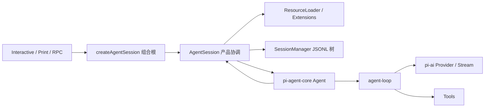
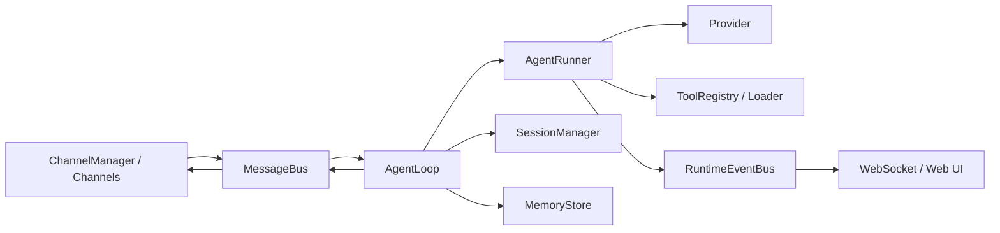
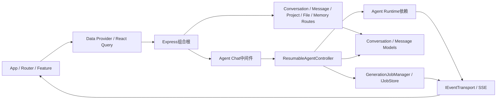
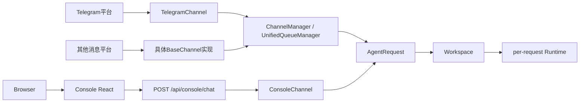

# Chat 总体架构源码研究与推导

> 状态：总体架构主体已于2026-07-24获用户批准；同日新增的超级管理员运营看护目标已确认，详细Schema、API、指标和隐私规则仍待专项设计审核
> 更新日期：2026-07-24
> 研究对象：pi、nanobot、QwenPaw、LibreChat，以及已批准的 MAF + AG-UI 技术路线
> 目的：从参考项目的真实模块和调用关系出发，推导 Chat 的架构与模块；本文不进行 Schema 和代码详细设计。

## 1. 研究纪律

这次推导遵守 5 条限制：

1. 参考项目事实必须能落到固定提交中的源码文件、类型或调用链。
2. “参考项目采用了什么”和“Chat 应该怎么做”分开陈述，不能把设计建议冒充源码事实。
3. 参考项目没有覆盖 Intent、Work、Approval、Evidence、Delivery 等问题时，明确写“未覆盖”，再由本项目需求补足。
4. 不使用“数据平面、知识平面、控制中心”之类不能决定代码边界、状态所有权和调用合同的抽象。
5. 目标架构按完整用户场景设计；交付阶段只能决定实现顺序，不能缩小模块责任。

证据等级：

| 等级 | 含义 | 可用于什么 |
|---|---|---|
| S1 | 固定提交中的源码、类型、测试或配置 | 证明参考项目当前实现 |
| S2 | 参考项目仓库内说明与注释 | 辅助解释意图，不能覆盖源码 |
| P1 | Chat 已批准的产品问题、对象和技术路线 | 决定本项目必须具备的能力 |
| D1 | 基于 S1 + P1 得出的架构决策 | 本项目架构决定，不冒充参考项目事实；是否已批准以对应章节和`PROJECT_STATE.md`为准 |

## 2. 固定版本和知识记录

| 项目 | 固定提交 | 本次使用范围 | 完整知识记录 |
|---|---|---|---|
| pi | `2b00dade7cec918aefb025c8b7a4fa304a30acdd` | Provider、通用 Agent Loop、产品 AgentSession、资源、Session 树、入口模式 | `/Users/xulater/Code/opc-os/agent_knowledge/project-studies/pi/架构与模块边界源码研究.md` |
| nanobot | `2c789767280482f38667044f8a3be5102c71dd26` | Channel、Bus、AgentLoop、AgentRunner、Tool、Session、Memory、Gateway | `/Users/xulater/Code/opc-os/agent_knowledge/project-studies/nanobot/架构与模块边界源码研究.md` |
| QwenPaw | `2134427584c2657bb717bb083a120f2de011d047` | Web Console、ConsoleChannel、外部Channel Adapter、统一队列、AgentRequest、Workspace/Runtime | `/Users/xulater/Code/opc-os/agent_knowledge/project-studies/qwenpaw/Web与Channel入口拓扑源码研究.md` |
| LibreChat | `8e5ef1fb31e9d63b735c089b21cbc82c50acce46` | Web App、产品 API、Conversation/Message、活动 Generation Job、事件订阅 | `/Users/xulater/Code/opc-os/agent_knowledge/project-studies/librechat/Web-Chat整体架构与模块边界源码研究.md` |
| MAF | 本地源码 `9c4cd...`；安装版 core `1.11.0`、openai `1.10.1`、ag-ui `1.0.0rc8` | AgentSession、History Provider、Workflow Checkpoint、AG-UI 接入约束 | `/Users/xulater/Code/opc-os/agent_knowledge` 中既有 MAF 专项记录 |

源码检索没有在上述4个参考项目的固定提交中发现AG-UI依赖或协议标识。因此，它们只能为产品、入口、运行和持久化边界提供参考；不能拿它们替AG-UI的具体事件合同背书。

### 2.1 MAF安装版的Agent对象事实

为避免把`Agent`当成整个Chat后端，本轮又直接核对了目标项目`.venv`中的安装版源码：

| 安装版事实 | 证据 | 对Chat对象边界的含义 |
|---|---|---|
| `Agent`构造器组合Client、Instructions、Tools、Default Options、Context Providers、Middleware、Compaction Strategy和Tokenizer | `.venv/lib/python3.12/site-packages/agent_framework/_agents.py:1686`起 | Agent是运行时组合对象，不拥有Product Session、Work、Approval、Evidence或Delivery |
| `Agent.run()`接收Messages、`AgentSession`、本次Tools/Options/Middleware等运行输入，可流式返回`AgentResponseUpdate` | 同文件`Agent.run()`重载与实现 | Product Run必须在Agent调用之外建立，MAF响应也要经过产品Finalization |
| `AgentSession`只保存`session_id`、可选`service_session_id`和可序列化`state`；Provider实例属于Agent | `.venv/lib/python3.12/site-packages/agent_framework/_sessions.py:913`起 | 它是轻量运行状态容器，不是用户会话、授权或产品历史 |
| `ContextProvider.before_run/after_run`可加入消息、指令、工具和中间件；`HistoryProvider`是其历史专用子类 | 同文件`:364`与`:426`起 | ContextPackage可以投影给MAF，但Product History不能被History Provider替代 |
| `WorkflowBuilder`接受Executor/Agent和Checkpoint Storage；Workflow是Agent外的控制图 | 安装版`_workflows/_workflow_builder.py`和当前`backend/app/model_call_workflow.py` | 审批、分支和恢复控制流可包住Agent，不能称为Agent内部字段 |
| AG-UI包提供Agent/Workflow包装、FastAPI端点、事件转换和Thread Snapshot | 安装版`agent_framework_ag_ui`包及其`AGENTS.md` | AG-UI是Agent外的协议适配层，不拥有产品资源或授权 |

这些是安装版事实。下面pi、nanobot、QwenPaw与LibreChat仍只用于补充产品协调、入口、会话和运行工程经验，不能替MAF API背书。

### 2.2 当前纵向切片的点击到模型往返证据

为了让目标架构不是脱离现状的方框，本轮按用户实际点击还原了当前代码链：

| 当前代码事实 | 直接证据 | 能证明什么 | 不能证明什么 |
|---|---|---|---|
| 表单`submit`清空本地草稿并调用`send(text)` | `frontend/src/App.tsx`的`submit` | 用户动作怎样进入AG-UI Client | 输入已经服务端持久化 |
| `send`先向`HttpAgent`加入User Message，再调用`runAgent()` | `frontend/src/use-chat-agent.ts` | 前端Message投影与运行触发 | Product Message已经建立 |
| FastAPI通过MAF的`add_agent_framework_fastapi_endpoint`暴露`POST /api/agent` | `backend/app/main.py` | 当前AG-UI协议终点 | Identity、Ingress和领域提交门已存在 |
| 模型模式装配`AgentFrameworkWorkflow`与`ModelCallApprovalExecutor` | `backend/app/model_call_workflow.py` | MAF原生Workflow承载Interrupt/Resume | 当前主链直接调用MAF `Agent.run()` |
| `prepare`过滤审批协议消息，Store编译Canonical Provider Body与Hash，再`request_info`暂停 | `model_call_workflow.py`、`model_call_review.py` | 可见请求、Hash和待发bytes同源 | 草稿/Approval已持久化到Product Store |
| 前端收到Interrupt后显示审核卡片；批准使用AG-UI Resume | `use-chat-agent.ts`、`model-call-review.tsx` | 用户点击批准如何恢复Workflow | 跨进程持久恢复已经实现 |
| `resolve`唯一领取内存Attempt，`ExactProviderTransport`原样发送bytes | `model_call_workflow.py`、`model_call_review.py` | 纵向切片的精确发送与零重复原则 | 正式Worker Lease和Product Run状态机 |
| `_provider_text`从Provider SSE/JSON提取文本，Workflow输出再由MAF AG-UI端点编码为SSE | `model_call_review.py`及安装版`agent_framework_ag_ui/_endpoint.py` | Provider文本怎样回到AG-UI事件 | Tool Call、结构化候选、Evidence和Finalization完整解析 |
| `HttpAgent`订阅Message变化，`MessageBubble`渲染文本 | `use-chat-agent.ts`、`App.tsx` | AG-UI事件怎样显示到React | 刷新后的服务端历史恢复 |

因此目标主链应保留已验证的`HttpAgent → AG-UI Endpoint → MAF Workflow → Model Call Gateway → Provider → AG-UI`脊柱，在其前后补齐产品接纳、Store、Tool治理、候选解析、Finalization和Delivery，而不是再建另一条并行Agent协议。

### 2.3 2026-07-24超级管理员运营看护补充证据

本节回答“谁登录了、使用多久、工作和作品推进到哪里”是否已经被现有模块覆盖。它没有扩大正式
外部参考集，也不拿邻近功能冒充完整运营看护。

| 证据类型 | 直接事实 | 证据路径 | 结论 |
|---|---|---|---|
| 当前Chat源码 | `ProductSessionService`仍使用固定`local-user` Scope；没有认证会话、Role/Grant或跨用户运营API | `backend/app/product_sessions/service.py`、`PROJECT_STATE.md` | 当前无法可信回答“谁登录了” |
| 当前Chat源码 | HTTP、Provider、Tool和Run已有技术耗时，但没有浏览器前台活跃区间或有效协作时间 | `backend/app/observability/`、Run/Provider/Tool查询 | 机器耗时不能冒充人的使用时长 |
| 当前Chat源码 | Project、WorkItem、TaskPlan和PlanNode已有权威领域对象，学习进度可由完成/总量查询得到 | `backend/app/harness/models.py`、`backend/app/harness/queries.py` | 管理员进度必须查询或投影这些事实，不能另建进度表 |
| 当前Chat状态 | 独立Artifact/Evidence生命周期尚未实现 | `PROJECT_STATE.md`第5节 | “作品进度”当前不能被完整、可信地计算 |
| 旧项目相邻实现 | 旧`opc-os/chat`有System View和`/api/dashboard`，展示Session、Interaction、Active Work、Memory及单次交互技术耗时 | `/Users/xulater/Code/opc-os/chat/frontend/src/App.tsx`、`backend/ops_os/api.py` | 可参考汇总呈现，但它是单用户执行/资源视图，不支持真实登录、人的活跃时长或管理员访问审计 |
| 当前交互原型 | 个人主页原型展示模拟Project进度和近期产出 | `prototypes/chat-uiux-v1/src/App.jsx` | 个人首页只服务当前用户，且模拟数据不能替代超级管理员跨用户视角 |
| P1产品决定 | 用户明确确认该能力属于超级管理员且必须加入Chat | 2026-07-24用户审核 | 这是Chat自身运营需求，不需要伪装成参考项目原生模块 |

本次已完成的pi、nanobot、QwenPaw与LibreChat限定研究没有覆盖“真实身份登录 + 人的使用时长 +
跨用户Project/Work/Artifact进度 + 管理员敏感访问审计”的完整链路，结论是**未涉及**。旧项目只提供
相邻展示证据，不能为目标身份、隐私或指标口径背书。基于现有P1要求可以完成模块归属；详细设计
如果出现认证、隐私分析或多租户治理知识缺口，再按新增参考项目审核门申请，不在本轮自动扩充。

## 3. pi：通用运行内核与具体产品协调分开

### 3.1 源码中的模块关系



### 3.2 直接源码事实

| 事实 | S1 证据 | 对模块边界的含义 |
|---|---|---|
| `pi-ai`统一模型和流式合同 | `packages/ai/src/index.ts`、`types.ts` | Provider 差异没有进入产品 Session 代码 |
| `pi-agent-core`包含`Agent`与`agent-loop` | `packages/agent/src/agent.ts`、`agent-loop.ts` | 模型/Tool迭代可以作为不拥有产品历史的运行内核 |
| `createAgentSession`装配具体产品依赖 | `packages/coding-agent/src/core/sdk.ts` | 组合根负责创建对象，不等于业务模块 |
| `AgentSession`连接资源、Session、事件和Agent | `packages/coding-agent/src/core/agent-session.ts` | 产品回合协调位于通用Agent内核之外 |
| `message_end`写入`SessionManager` | `agent-session.ts`与`session-manager.ts` | 运行事件需要经过产品协调后进入产品历史 |
| `SessionManager`是带`id/parentId`的JSONL树 | `session-manager.ts` | 完整历史、当前分支和模型活动Context是不同概念 |
| Interactive、Print、RPC共享AgentSession | `packages/coding-agent/src/modes/index.ts` | 多入口不应各自复制业务核心 |
| Orchestrator是experimental进程/RPC管理 | `packages/orchestrator/*` | 进程管理存在不代表已有持久Job、Lease和恢复保证 |

### 3.3 Chat可采用的经验与限制

采用：

1. MAF运行适配器与Chat产品模块分开；产品状态不能由Agent对象拥有。
2. Web、外部Channel和未来CLI先经过各自Adapter，再共享同一个Interaction协调流程。
3. 完整Message历史保存在产品模块中；每次模型调用只接收已选择的ContextPackage。
4. 资源加载、Tool注册和回合执行分开。

不能由pi背书：Web产品API、浏览器断线续订、后台Job、持久Approval、Evidence、Delivery、身份授权和Tool副作用对账。

## 4. nanobot：入口、回合协调、模型循环和两类状态分开

### 4.1 源码中的模块关系



### 4.2 直接源码事实

| 事实 | S1 证据 | 对模块边界的含义 |
|---|---|---|
| Gateway命令装配Bus、Session、AgentLoop、WebUI、Channel和Trigger | `nanobot/cli/commands.py` | 组合根只负责创建与启动组件 |
| Channel通过`MessageBus`收发标准消息 | `channels/manager.py`、`bus/queue.py` | 外部入口差异可以止于Channel适配 |
| 运行事件使用独立`RuntimeEventBus` | `bus/runtime_events.py` | 用户消息投递和运行观察不是同一条流 |
| `AgentLoop`有RESTORE→COMPACT→COMMAND→BUILD→RUN→SAVE→RESPOND状态 | `agent/loop.py` | 一个用户回合需要应用协调器，不是直接调用模型 |
| `AgentRunner`只负责模型与Tool迭代 | `agent/runner.py` | 产品Session、锁、保存和回复不应进入运行内核 |
| Tool有Registry和Loader | `agent/tools/registry.py`、`loader.py` | Tool发现/调用可独立于Provider实现 |
| Session与Memory分别持久化 | `session/manager.py`、`agent/memory.py` | 对话历史与跨会话长期记忆不能合并 |
| Session保存采用临时文件替换 | `session/manager.py` | 它解决单文件原子替换，但没有提供Job Lease或投递保证 |

### 4.3 Chat可采用的经验与限制

采用：

1. 外部Channel只做协议、身份映射和消息标准化，进入后共享产品核心。
2. Interaction协调器与MAF运行适配器分开；前者管产品流程，后者管模型/Tool循环。
3. Conversation和Memory分模块，因为生命周期、采纳规则和失效方式不同。
4. Product Message流和Runtime Event流分开保存与消费。

不能由nanobot背书：它的MessageBus是进程内队列，没有durable ingress、ack和跨实例重放；Session保存不等于用户已收到结果；WebSocket chat id不等于授权；常驻Gateway不等于持久Job和Worker接管。

## 5. LibreChat：Web产品资源、活动Generation和实时订阅分开

### 5.1 源码中的模块关系



### 5.2 直接源码事实

| 事实 | S1 证据 | 对模块边界的含义 |
|---|---|---|
| App、Root、ChatRoute和其他Feature Route分开 | `client/src/App.jsx`、`routes/*` | Chat运行视图不是整个Web应用架构 |
| Endpoint/Type/Data Service和React Query集中 | `packages/data-provider/*` | 服务端产品事实由查询层读取，页面Store不应复制事实源 |
| Server挂载Conversation、Message、Project、File、Memory和Agent等Route | `api/server/index.js` | 产品资源API与Agent运行入口分开 |
| Agent Route先执行内容、权限、资源、Conversation和Endpoint中间件 | `api/server/routes/agents/chat.js` | 协议入口不能绕过应用策略 |
| 创建Generation Job后原POST返回，SSE另行订阅 | `ResumableAgentController` | 请求接纳、后台执行、浏览器订阅是3个生命周期 |
| `IJobStore`与`IEventTransport`各有内存和Redis实现 | `packages/api/src/stream/*` | 活动Job状态和实时事件传输是可替换基础设施 |
| 正常完成先保存User/Assistant Message，再检查Job所有权并发Final | `controllers/agents/request.js` | 产品事实提交必须先于成功终态投影，旧执行不能抢写 |
| Conversation/Message与活动Job/Checkpoint分开 | 数据模型、Job Store和checkpointer实现 | 产品历史、活动运行、框架恢复状态不能合成一个Session对象 |

### 5.3 Chat可采用的经验与限制

采用：

1. Web按App Shell、Feature、服务端查询和页面状态组织。
2. REST产品资源与AG-UI实时运行入口分开。
3. Product Run、活动Attempt/Job和实时Event Journal分开建模。
4. 成功事件只能在Product Message、Run终态和必要Evidence提交成功后发布。
5. 使用Attempt所有权/版本检查阻止旧Worker抢写。

改造：LibreChat的共享TypeScript包改为OpenAPI/Schema合同；Mongo/Redis/Express改为Chat已批准的FastAPI、SQLite起点和端口接口；大量全局Provider不照搬。

不能由LibreChat背书：`@librechat/agents`在该固定仓库中是外部依赖，不能据此推断其内部模块；它也没有替Chat决定Intent、Work、Approval、Evidence、Delivery、跨系统Binding和通用Tool副作用恢复。

## 6. QwenPaw：Web与外部Channel先适配，再进入统一请求合同

### 6.1 源码中的入口拓扑



### 6.2 直接源码事实

| 事实 | S1证据 | 对Chat入口边界的含义 |
|---|---|---|
| Console React调用`/api/console/chat` | `console/src/pages/Chat/index.tsx` | Web只调用HTTP接口，不直接调用Workspace/Runtime |
| Console Route把HTTP DTO转成native payload后调用`ConsoleChannel` | `app/routers/console.py:post_console_chat` | Web与核心之间也有明确协议适配边界 |
| Telegram SDK事件先变成native payload | `app/channels/telegram/channel.py` | Telegram平台不认识内部Product Session、Interaction或Runtime |
| ChannelManager按channel/session/priority排队 | `app/channels/manager.py`、`unified_queue_manager.py` | 外部回调不能直接并发执行产品核心 |
| BaseChannel先做ACL，再构造`AgentRequest` | `app/channels/base.py` | sender身份、session连续性和内部请求是3个不同概念 |
| Workspace收到统一请求后每次创建Runtime | `app/_app.py:DynamicMultiAgentRunner` | Adapter之后才进入共享执行核心 |

### 6.3 Chat可采用的经验与限制

采用：

1. Chat Web通过Web HTTP/AG-UI Adapter转成内部`InboundInteraction`，不能直接调用产品模块。
2. Telegram等平台必须经过具体Channel Adapter；平台Webhook、SDK和群聊语义止于Adapter。
3. Web Adapter和外部Channel Adapter最终调用同一个`Interaction Ingress`应用合同。
4. 出站结果经Delivery回到来源Adapter，由Adapter渲染成平台消息或Web事件。

不能照搬：QwenPaw的`AgentRequest`是其运行时Schema；进程内UnifiedQueue不提供持久接纳和跨进程重放；BaseChannel在sender缺失时的ACL行为不能作为安全保证；Console和后端同进程部署不表示逻辑适配边界可以删除。

## 7. 四个参考项目共同给出的结构

这不是“投票”，而是把相同源码关系并排：

| 重复出现的关系 | pi | nanobot | QwenPaw | LibreChat | 可得出的最小结论 |
|---|---|---|---|---|---|
| 入口与核心分开 | 3种Mode共享AgentSession | Channel共享AgentLoop | Web/具体Channel先适配成AgentRequest | Route/Feature共享后端服务 | Web和外部平台先适配，再共享产品用例；平台不直接调用核心 |
| 产品协调与模型循环分开 | AgentSession vs agent-loop | AgentLoop vs AgentRunner | Workspace/Runtime vs Agent | Controller/Job vs Agent依赖 | Chat需要Interaction协调模块和MAF运行适配器两个边界 |
| 长期产品历史与活动运行分开 | SessionManager vs Agent状态 | Session vs RuntimeEvent | Chat/Session vs per-request Runtime | Conversation/Message vs Job/Event | Product Session/Message不能由MAF Session、AG-UI Thread或活动Job代替 |
| 模型输入不是完整历史 | 当前leaf/compaction | Context build/compact | Scroll/Memory由Builder装配 | Agent构建上下文 | ContextPackage必须是一次可追踪的装配结果 |
| 资源/Tool与Provider分开 | ResourceLoader/Tools | Tool Registry/Loader | Builder/Governance/ToolRegistry | Agent入口装配资源 | Tool发现、授权和调用治理不能散落在Provider代码中 |
| 组合根不拥有业务状态 | createAgentSession | gateway command | FastAPI app/Workspace registry | Express server | main/app factory只负责装配依赖 |
| 实时事件不是产品事实 | Agent events经过Session保存 | RuntimeEventBus另于MessageBus | Runtime events与Chat/Session分开 | EventTransport另于Message模型 | AG-UI事件是投影；Product DB才是长期事实源 |

## 8. 参考项目明确没有覆盖的Chat问题

这 8 项不能伪装成“参考项目已经证明”：

1. 多意图识别、纠正与确认。
2. WorkItem、ActionItem和TaskPlan的跨回合生命周期。
3. 可编辑ExecutionDraft以及绑定版本、Hash、权限范围的Approval。
4. Tool副作用幂等、结果未知、查询、补偿和人工对账。
5. Evidence来源、版本、有效性和来源删除后的失效传播。
6. Delivery回执、重试和“已生成但未送达”的区分。
7. OPC-OS Chat等外部系统的Channel Binding、授权和双边事实归属。
8. 超级管理员真实登录、人的使用时长、跨用户工作/作品运营看护和敏感访问审计。

这些能力来自Chat已批准的6个问题和完整产品闭环。参考项目只能提供相邻结构：pi/nanobot提供回合和Tool边界，QwenPaw提供Web/Channel/统一请求与治理边界，LibreChat提供产品资源、Job和提交顺序；最终模块仍需由Chat自身需求决定。

## 9. 从源码事实到Chat模块的逐项推导

| 编号 | 源码事实 | Chat必须解决的问题 | D1模块决策 | 为什么不是其他放法 |
|---|---|---|---|---|
| D1 | QwenPaw的Web Route→ConsoleChannel、Telegram→TelegramChannel→Queue，二者才转统一AgentRequest | Web和外部平台必须共享Product Session规则，但wire协议、身份和回执完全不同 | 分开`Web应用`、`Web/API Adapter`、`具体Channel Adapter`和`Interaction Ingress`；Adapter之后才调用产品模块 | 把“OPC-OS Chat / 其他入口”直接连后端会跳过协议终止、身份验证、幂等和能力转换 |
| D2 | AgentSession/AgentLoop在Runner外协调回合 | 一次输入要先保存、组上下文、识别意图、可能等待审批，再决定是否运行 | 建立`Interaction协调器` | 让MAF Agent直接处理会绕过产品提交门和审批门 |
| D3 | Session/Message是长期事实，Job/Event是活动事实 | 完成历史、断线续订、Worker恢复需要不同生命周期 | 分开`Conversation模块`与`Run管理模块` | 一个Session表或AG-UI Snapshot无法同时表达用户历史和Worker所有权 |
| D4 | 完整历史与活动Context分开 | 用户要知道本轮到底使用了什么上下文 | 建立`Context模块`，持久化ContextPackage | 直接把全部历史发送给模型不可审计，也不可稳定复现 |
| D5 | nanobot Session与Memory分开 | 模型候选不能自动成为长期事实 | `Memory模块`独立于Conversation和Context | Message出现过不代表可以跨会话作为正式记忆 |
| D6 | 参考项目没有Work/Approval，但Chat问题3、4要求它们 | 用户要看见意图、计划、责任和执行前最终请求 | 建立`Collaboration模块`，拥有Intent/Work/Plan/Draft/Approval | 把这些塞进Message JSON会失去生命周期、版本和查询能力 |
| D7 | Job Store、Attempt所有权和事件传输分开 | Run要断线继续、重试、接管且防旧Worker抢写 | `Run管理模块`拥有Product Run、Attempt、Lease、Event Journal | MAF Checkpoint只恢复框架状态，不拥有产品终态和Worker接管 |
| D8 | Runner/agent-loop不拥有产品状态 | MAF可升级替换，产品事实仍稳定 | 建立`MAF运行适配器` | 领域对象直接依赖MAF类会把框架版本传播到全部模块 |
| D9 | Tool有Registry/Loader，但参考项目不保证副作用恢复 | 外部写操作必须审批、幂等、对账 | 建立`Tool执行模块` | Tool调用只留在模型消息里无法判断是否已产生外部副作用 |
| D10 | 正常Final在Message保存后发布 | 用户看到完成时必须已有可读结果和证据 | 建立`Evidence模块`并定义Finalization Gate | Runtime返回文本不等于结果来源、附件和操作证据已持久化 |
| D11 | Session保存不等于Channel送达 | Web断线、外部Channel失败后仍要知道交付状态 | 建立`Delivery模块` | 把“生成成功”当“用户已收到”会造成假完成 |
| D12 | LibreChat入口有权限链；QwenPaw区分ACL sender、session_id和AgentRequest | 外部身份与Product Session绑定必须可撤销、可审计 | 建立`Identity与Channel Binding模块` | 把threadId/chatId当权限凭据会形成越权风险 |
| D13 | 当前Chat只有固定Scope和技术耗时；Product Harness已拥有Work事实，Artifact仍待实现；参考项目研究未涉及完整管理员看护 | 独立运营的Chat必须回答谁登录、真实使用情况、工作/作品进度和需要关注的异常，同时避免双重事实源和敏感内容越权 | 扩展`Identity`拥有Role/Grant与Authentication Session；新增`Super Admin Operations模块`拥有活动事件、使用聚合、跨模块可重建运营投影和管理员审计 | 塞入Observability会混淆人类使用与机器运行；塞入Harness会让身份/活动/审计依附Project；前端或管理员直读数据库会绕过授权、口径和审计 |

## 10. 推导后的架构分组

模块按责任性质分组，不假装它们是同一种“层”：

### 10.1 交互适配器与统一入站合同

1. Web应用：产品页面、查询缓存、AG-UI实时投影和页面局部状态。
2. Web/API Adapter：终止REST与AG-UI协议，把Web DTO转成内部`InboundInteraction`。
3. Channel Adapter Host：承载OPC-OS Chat Bridge、Telegram等具体Adapter及其协议端点、队列和出站渲染；平台不能直接进入产品核心。
4. Interaction Ingress：Adapter共同调用的内部应用合同，负责可信身份上下文、幂等接纳、Session映射和per-session顺序，然后调用Interaction协调器。

### 10.2 产品与应用模块

5. Identity与Channel Binding。
6. Conversation。
7. Collaboration。
8. Context。
9. Memory。
10. Interaction协调器。
11. Run管理。
12. Tool执行。
13. Evidence。
14. Delivery。
15. Super Admin Operations。

### 10.3 运行与基础设施适配器

16. MAF运行适配器：AgentSession、History Provider、Workflow/Checkpoint和模型流式运行接合。
17. Product Store、Runtime Store、Event Transport、Artifact Store的实现。
18. Execution Worker、Scheduler/Reconciler、Delivery Worker等进程角色。

这里的编号不是目录数量，也不是要求每个模块部署成微服务。模块先代表代码依赖、状态所有权和合同边界；同一FastAPI进程可以承载多个模块，但不能因此合并它们的事实。

## 11. 关键架构选择及备选方案

### 11.1 Web与外部Channel怎样进入产品核心

选择：各自协议Adapter → 统一Interaction Ingress → 产品核心。

原因：QwenPaw源码明确由Console Route/ConsoleChannel和TelegramChannel分别完成协议转换，再形成统一AgentRequest。Chat Web是本产品自带客户端；Telegram是外部平台；OPC-OS Chat是外部系统，三者不是同一种对象。

优点：Web仍可使用REST/AG-UI最佳体验；每个Channel独立处理平台身份、群聊、附件和回执；核心只理解稳定内部合同。

缺点：需要维护Web Adapter、具体Channel Adapter和内部Envelope映射。

备选1：所有入口直接调用同一个公开后端Route。wire合同看似少，但把Telegram身份和消息能力硬塞进AG-UI/REST，不采用。

备选2：所有入口都先进入OPC-OS Chat，再由一个Bridge调用Chat。适合由OPC-OS Chat统一托管渠道的部署，但其正式合同尚未取得；保留为具体Adapter部署方式，不能写成当前已确认事实。

### 11.2 Interaction协调器与Run管理是否合并

选择：分开。

原因：一次Interaction可以只回答、只更新Work、等待Approval，或触发多个Run；Run还能脱离原HTTP请求继续。pi/nanobot证明“回合协调器”存在，LibreChat证明“活动Job”有独立生命周期。

优点：产品回合和执行恢复语义清楚；支持0..n Run；便于测试审批前绝不启动执行。

缺点：多一个应用合同，需要显式传递Interaction、Draft和Run ID。

备选：一个大ChatService同时处理输入和运行。代码少，但会复现pi `AgentSession`可能膨胀的协调器风险，并把后台恢复塞进请求流程，不采用。

### 11.3 Conversation、Context和Memory是否合并

选择：3个模块分开。

原因：Conversation保存“发生了什么”；Context保存“本轮选了什么”；Memory保存“哪些信息被允许跨会话复用”。pi证明完整历史与活动分支/压缩不同，nanobot直接把Session和Memory分开。

优点：能回答来源、选择和采纳问题；删除来源后可以精确失效。

缺点：需要引用关系和版本管理。

备选：全部存成Message。实现容易，但不能区分模型见过、用户确认和当前运行实际使用，不采用。

### 11.4 Product Run、Run Attempt和MAF Checkpoint是否合并

选择：分开并建立映射。

原因：Product Run是用户长期可见事实；Attempt表示一次Worker执行和所有权；Checkpoint表示MAF内部恢复点。LibreChat的Message、Job、Checkpoint分离直接支持这一点。

优点：Job可过期、Attempt可接管、MAF可升级而不丢Product Run。

缺点：恢复逻辑必须验证三者一致性。

备选：以MAF Session/Checkpoint为唯一Run记录。缺少产品授权、交付、审计和Worker所有权，不采用。

### 11.5 Evidence与Delivery是否合并

选择：分开。

原因：Evidence回答“结果凭什么成立、外部操作发生了什么”；Delivery回答“结果是否到达某个接收方”。nanobot的Session保存与Channel投递之间没有等价保证，LibreChat也区分产品提交和实时Final。

优点：可以表达“执行成功但通知失败”和“已送达但来源后来失效”。

缺点：最终完成判断需要同时查看Run、Evidence和Delivery。

备选：Message有一个`delivered`布尔值。无法表达多接收方、重试、回执和证据失效，不采用。

## 12. 架构必须满足的场景验算

| 用户场景 | 必须经过的模块 | 关键保证 |
|---|---|---|
| 打开旧Session继续 | Web→Web/API Adapter→Interaction Ingress→Identity→Conversation→Collaboration→Context→Memory | 恢复的是产品事实；本轮Context单独生成，不把完整历史盲送模型 |
| 用户纠正系统理解 | Interaction协调→Collaboration→Conversation | Intent/Plan有版本和状态，纠正不会只变成一条无人消费的消息 |
| 高风险工具执行 | Collaboration Draft/Approval→Run→Tool→Evidence | Approval绑定Draft版本和请求Hash；Tool调用有幂等与对账记录 |
| 浏览器断线后回来 | Web→Web/API Adapter→Run→Event Journal；Conversation读取已提交消息 | HTTP、Run和订阅独立；缺失事件可重放或以产品状态Hydrate |
| Worker崩溃恢复 | Reconciler→Run Attempt→MAF Checkpoint→Tool Ledger | 先判断副作用是否已发生，再恢复或重试；旧Attempt失去写权 |
| 从OPC-OS Chat进入 | OPC-OS Chat→OPC-OS Bridge Adapter→Channel Adapter Host→Interaction Ingress→Identity/Binding→同一协调链→Delivery→Bridge | 外部系统不能直接调用产品模块；双方事实源、协议终止和回执明确 |
| 从Telegram进入 | Telegram平台→Telegram Adapter→Channel队列→Interaction Ingress→同一协调链→Delivery→Telegram Adapter | Telegram SDK、sender/chat、群聊、渲染和平台回执止于Adapter |
| 来源被删除或权限撤销 | Evidence→Memory/Context失效→Conversation提示 | 派生结论保留历史但降级有效性，后续Context不再静默使用 |
| 超级管理员看护用户与作品 | Super Admin Console→Web/API Adapter→Identity/Role Guard→Super Admin Operations→Identity活动事实 + Harness Work事实 + Evidence Artifact事实→管理员审计 | 登录、前台活跃、有效协作和机器耗时口径分开；进度来自权威模块；投影延迟显示`stale/unknown`；普通用户不可调用，敏感内容读取另行授权并留审计 |

任何一个场景如果只能写成“模块A调用模块B”，却说不出持久状态、失败点和用户看到什么，就不能算架构完成。

## 13. 未知与审核后验证

1. 安装版`agent-framework-ag-ui 1.0.0rc8`能否在MAF事件发出前后插入完整Product Finalization Gate，需要Spike。
2. SQLite能否满足Run领取、Lease续租、Outbox/Event Journal原子写入，需要事务与并发测试。
3. MAF History Provider、客户端消息全集和Product Context同时启用时的去重合同，需要E2E验证。
4. Workflow Checkpoint跨进程恢复与持久Approval接合，需要安装版测试。
5. OPC-OS Chat的正式身份、能力、消息、幂等和回执合同尚未取得。
6. Tool的幂等查询、补偿和结果未知处理必须按具体Tool类型设计，不能通用猜测。
7. OPC-OS Chat是否统一托管Telegram等Channel Adapter，还是Chat部署自己的具体Adapter，必须依据系统间正式合同决定；逻辑上两种部署都只能通过Interaction Ingress。
8. Authentication Session、多设备、前台心跳、空闲阈值和有效协作事件的产品口径尚待详细设计。
9. 超级管理员默认可见字段、敏感正文的额外Grant、隐私告知、保留期限、导出与审计不可篡改边界尚待安全与产品审核。
10. Project/Work/Artifact运营投影的延迟目标、重建方式和大规模查询容量尚待验证。

## 14. 研究结论

参考源码不支持“一个Chat组件直接连MAF Agent，再把AG-UI流当全部产品状态”的架构。4个项目共同证明：协议入口、产品回合协调、运行内核、长期历史、活动运行、实时事件和长期记忆具有不同责任。QwenPaw进一步证明最终聊天平台与产品核心之间需要具体Channel Adapter和统一内部请求合同。

因此Chat应采用：

```text
Chat Web → Web/API Adapter ──────────────────────┐
Telegram → Telegram Adapter → Channel Queue ────┼→ Interaction Ingress
OPC-OS Chat → OPC-OS Bridge Adapter ────────────┘
        ↓
Identity + Conversation + Interaction Coordinator
        ↓
Collaboration + Context + Memory
        ↓（只有满足执行门时）
Run Manager → MAF Runtime Adapter → Tool Operations
        ↓
Evidence → Conversation Finalization → Delivery

Super Admin Console → Identity/Role Guard → Super Admin Operations
        ↓只读关联
Identity活动事实 + Harness Work事实 + Evidence Artifact事实 + Run/Delivery异常
        ↓
可重建运营投影 + Super Admin Audit
```

这条链是下一份架构候选的来源。每个模块的内部组成、状态所有权、合同、失败与场景映射在`overall-architecture-proposal.md`中展开。
