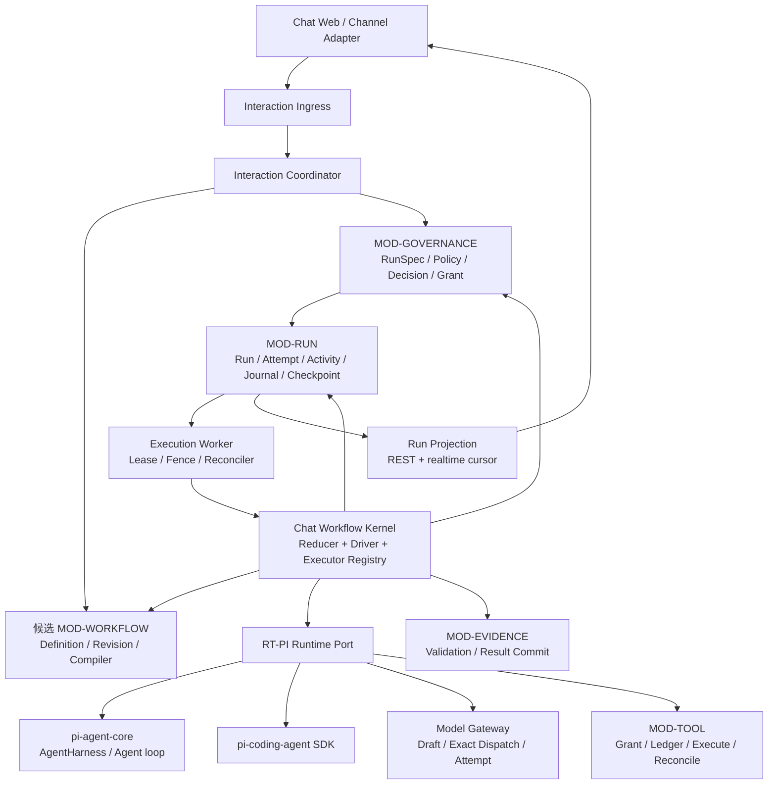

# pi 承载 Chat Workflow、HITL 与 Checkpoint 的架构候选

> 日期：2026-08-06
> 状态：**基于源码事实重建完成，D1—D8 待用户审核**
> 前置事实：[pi 原生支持研究](./research/pi-workflow-hitl-checkpoint-research.md)
> 上位合同：[总体架构与模块基线](./overall-architecture-proposal.md)、
> [ExecutionDraft、RunSpec 与 HITL 治理合同](./execution-governance-contract.md)、
> [运行执行详细设计](./runtime-execution-detailed-design.md)
> 授权边界：本文只提交架构选择，不授权依赖、正式 Schema、迁移、生产目录、Worker、部署或产品代码；
> 现有 Python/MAF 实现继续作为迁移行为预言机保留。

## 0. 先给结论

当前存在 4 条总体路线：

| 方案 | 核心做法 | 结论 |
|---|---|---|
| A. pi Session/Extension 中心 | 把一次 Chat Workflow 尽量塞入一个 `AgentSession`/`AgentHarness`，用 Hook 和 Extension UI 做人工介入，用 pi Session 当恢复材料 | 适合低风险在线 Agent，不满足 Chat 的耐久 Workflow/HITL/Checkpoint |
| B. pi Durable Harness 中心 | 以 pi 未来 durable harness 设计作为 Run/Step/Checkpoint 主体，Chat 在外侧补产品对象 | 方向有价值，但当前是 `design-only`，而且仍不拥有产品 Workflow 图与审批事实 |
| C. Chat 耐久 Workflow Kernel + pi Runtime Adapter | Chat 拥有定义、运行状态、HITL、Checkpoint 和副作用账本；pi 作为 Agent/Coding 节点的有界运行核心 | **建议采用**；最符合 pi 的设计哲学，也最能保持 Chat 产品边界 |
| D. 外部 Durable Workflow Engine + pi Activity | 引入外部引擎承载 Timer、Signal、重试、Worker 接管；pi 只做 Activity | 能力上限高，但现在没有需求和证据证明值得新增引擎与第二套运行语义 |

建议方案 C，但不是“pi 外面随便包一层”。目标是形成一个很小、职责明确的 Chat Workflow Kernel：

1. **Chat Workflow 只编排产品可见步骤与耐久边界**，不重写 Agent loop。
2. **pi AgentHarness/Agent loop 只执行 Agent Step**，继续提供模型、Tool batch、队列、Hook、事件、Session、Compaction 和 Coding Agent 能力。
3. **所有 Provider 与 Tool 外发经过 Chat Gateway 和账本**；低风险、已授权、可安全重放的调用可走同进程快路径，高风险或需人工的调用必须在外发前形成耐久暂停点。
4. **恢复重建状态，不恢复 JavaScript 调用栈**；Checkpoint 只指向已经提交的产品、运行和 pi Transcript 事实。
5. **未来 pi durable harness 若实现，可替换 RT-PI 内部恢复器**，不能反向接管 Product Run、Workflow、Approval、Evidence 或产品完成事实。

## 1. pi 源码事实怎样约束架构

### 1.1 已验证事实

固定 pi 提交为 `10e99ae9914cd34f622633fac42f9a90714e9cf4`、Packages `0.82.1`；pi-web 使用独立版本线，不能互相背书。支持矩阵已经通过 `44 + 23 + 22 + 13 = 102` 项定向离线测试。

| 源码事实 | 对 Chat 的约束 |
|---|---|
| pi 有 Agent loop、Tool batch、Hook、事件、队列、Session 树和 Compaction；没有 Workflow Definition、节点/边、Join、Timer、Subworkflow 和持久图进度 | 不把 Agent loop 命名为 Chat Workflow；业务图与运行进度必须由宿主提供 |
| `beforeToolCall` 在 Schema 校验后、`Tool.execute` 前执行，可以 block；block 会产生 synthetic error Tool Result，Agent loop 仍可能继续 | Hook 可做在线拦截和纵深防御，不能冒充耐久 Suspend/Resume |
| Hook 可原地修改 Tool 参数，修改后不再次 Schema 校验 | 审批后的执行参数必须由 Chat 重新校验并绑定 hash，不能直接相信 Hook 中的可变对象 |
| Extension UI、RPC、pi-web 的待答请求依赖同进程 Map/Promise；浏览器重连同一进程可重显，进程退出后消失 | 人工等待必须先成为 Product Decision Request，不能把 Promise 当批准事实 |
| Session 能重开消息、模型、thinking、Compaction 与 leaf；当前不记录 Provider/Tool in-flight、Durable Queue、Run/Step/Checkpoint ID 或 Writer Lease | pi Session 是 Runtime Transcript，不是 Product Run 或 Workflow Checkpoint |
| Provider stream 不可从中间续传；非幂等 Tool 在结果未知时不能自动重试 | Checkpoint 只能位于耐久边界；未知结果必须查询、对账、补偿或人工处置 |
| `packages/agent/docs/harness.md` 已设计 Run、Step、Checkpoint、Suspended、`resume()` 和私有 orchestration log，但当前实现仍是 Planned/Designed | 可借鉴对象和不变量，也可保留未来替换位；不能按已实现 API 设计当前系统 |

直接证据索引见[支持研究第 10 节](./research/pi-workflow-hitl-checkpoint-research.md#10-证据索引)。

### 1.2 从源码抽出的 pi 设计哲学

pi 的设计哲学不是“所有 Agent 产品都围绕 pi 的对象建模”，而是以下 6 点：

1. **小核心、强扩展缝**：README 明确要求把 pi 适配到宿主 Workflow，而不是让宿主适配 pi；核心保持最小，扩展放在 Extension、Skill、Package 和 SDK。
2. **宿主拥有应用责任**：AgentHarness 文档明确由应用加载/重载 Resource、提供 Tool 实现和运行环境；不可序列化依赖由宿主在恢复时重建。
3. **显式生命周期优于隐藏异步**：Hook、Listener、持久写和通知按明确顺序 await；事件观察已提交状态，不使用 fire-and-forget 冒充完成。
4. **每轮使用冻结快照**：当前 turn 使用固定 Model、Tool、Resource、Stream 配置；运行中修改只影响下一快照，不能偷改正在外发的请求。
5. **追加事实、从安全边界恢复**：Session 是 append-only tree；future durable harness 也选择 orchestration log，而不是序列化 Promise、Stream 或 Tool 实现。
6. **承认不可恢复边界**：Provider 流不能中点续传；Hook 自己产生的外部副作用不自动 exactly-once；非幂等 Tool 不能盲目重放。

因此，符合 pi 哲学的 Chat 架构应当“组合 pi、隔离产品状态、暴露明确 Port、允许未来替换”，而不是 Fork pi，也不是把 Chat 产品对象塞进 pi Session。

### 1.3 现有 Chat 行为预言机

目标实现可以改技术，但不能降低当前已经验证的 6 项保证：

1. User Message/Interaction 先持久化，再启动运行。
2. 每次 Provider 外发都有独立 ModelCallDraft revision/hash；拒绝必须是 0 发送。
3. Approval 绑定精确对象版本，Decision 先提交，再由 Outbox 恢复运行。
4. Tool 提议、授权、外发、结果与结果未知分开；未知副作用不自动重试。
5. Worker Lease/Attempt 隔离旧写者；浏览器连接不拥有 Product Run。
6. Assistant/Agent 完成只是候选；Evidence、Result Commit、Message 与 Product Run 终态按产品门提交。

## 2. 4 种总体方案对比

### 2.1 方案 A：pi Session/Extension 中心

```text
Web / Channel
-> pi AgentSession / AgentHarness
-> Extension Hooks + Extension UI
-> pi Session JSONL/SQLite
```

优点：代码最少；在线对话、Tool 交互、Coding Agent 和 TUI/Web UI 能力复用最多；低风险原型速度快。

缺点：

1. pi 没有 Chat Workflow Definition 与节点进度。
2. 人工等待和在线 Wrapper 同进程生存，不能作为跨进程批准。
3. pi Session 无法判断 Provider/Tool 是否已经外发或产生副作用。
4. Product Session、Run、Work、Approval、Evidence 会被迫进入 sidecar，最终形成隐蔽双事实源。

结论：只可作为 RT-PI 内部的在线执行方式，不能成为 Chat 总体架构。

### 2.2 方案 B：pi Durable Harness 中心

```text
Chat Product Layer
-> future pi Durable AgentHarness
   -> Run / Step / Checkpoint / Suspended / resume
   -> Session tree + private orchestration log
```

优点：pi 的 future 设计对 durable operation、单写者、Step、Tool 未知结果和恢复边界考虑充分；若未来实现，能减少 RT-PI 自己维护 Agent 级恢复的工作。

缺点：

1. 当前固定版本没有这些 API、类型和存储表。
2. future Harness 的 Run/Step 是 Agent loop 语义，不是 Chat 的任意 Workflow 图、产品 Run 或业务完成门。
3. 如果现在按设计稿 Fork 或自实现，会同时承担上游演进、兼容和产品层双重复杂度。

结论：作为方案 C 的未来内部实现候选，不作为当前总体架构事实源。

### 2.3 方案 C：Chat 耐久 Workflow Kernel + pi Runtime Adapter

```text
Chat Product/Application
-> Chat Workflow Kernel
   -> deterministic / wait / tool / commit / subworkflow executor
   -> RT-PI Runtime Port
      -> pi-agent-core AgentHarness / Agent loop
      -> pi-coding-agent SDK
```

优点：

1. 与 Chat 已批准的产品状态所有权一致。
2. 与 pi“小核心、宿主适配、明确边界”的哲学一致，不需要 Fork。
3. Workflow、HITL、Checkpoint、Tool、Evidence 各有唯一事实源。
4. RT-PI 可独立升级；未来 pi durable harness 可在 Adapter 内替换当前恢复实现。
5. 简单问答仍能编译成单 Agent Node，不要求每次对话都付出大型流程引擎成本。

代价：Chat 必须实现一个有界的 Durable Driver、运行日志、Checkpoint Reducer、Outbox 和恢复门；Provider/Tool 与 pi loop 的精确接合还需 Spike。

结论：建议采用。

### 2.4 方案 D：外部 Durable Workflow Engine + pi Activity

```text
Chat Product/Application
-> External Workflow Engine
   -> pi Agent Activity
   -> Tool Activity
   -> Human Signal / Timer
```

优点：Timer、Signal、重试、长任务、Worker 调度和可观察性可能复用成熟能力。

缺点：新增运行模型、持久历史、部署依赖和运维面；必须解决 Product Run 与 Engine Run 的映射、双重重试、数据保留、版本兼容和本地单机体验；当前正式参考没有为某个候选背书。

结论：保留为升级路线。只有出现跨区域、海量长周期 Timer/Signal、复杂补偿或自有 Driver 无法达到恢复 SLO 的明确需求时，再提交限定候选研究。

### 2.5 场景覆盖矩阵

| Chat 场景 | A | B | C | D |
|---|---:|---:|---:|---:|
| 普通无 Tool 对话 | 满足 | 满足 | 满足 | 满足但偏重 |
| Workflow 版本与真实节点 | 不满足 | 不满足 | 满足 | 可满足 |
| 逐次 ModelCallDraft/Hash | 局部 | 可设计 | 满足 | 可满足 |
| 跨进程 HITL | 不满足 | 当前不可用 | 满足 | 可满足 |
| Tool 副作用未知与对账 | 不满足 | 当前不可用 | 满足 | 仍需 Chat Tool Ledger |
| Worker 接管与旧写 Fence | 不满足 | 当前不可用 | 满足 | 可满足 |
| Product/Evidence 完成门 | 不满足 | 不拥有 | 满足 | 仍需 Chat 产品层 |
| pi 升级与替换 | 强耦合 | 依赖未来 API | **Adapter 隔离** | Engine 与 pi 双适配 |

## 3. 建议目标架构



这张图有 4 条不可跨越的边界：

1. Workflow Kernel 只推进执行状态，不直接修改 Work、Conversation、Evidence 或 Tool 的表。
2. RT-PI 只接收不可变 Runtime Input，返回候选、Tool Call、公开事件或明确失败，不返回产品成功。
3. Governance 决定是否允许，Run 决定当前执行位置；二者不能互相冒充。
4. Realtime 事件和 pi-web 状态只是投影；恢复读取 Product/Runtime Store，不读取浏览器或旧 Worker 内存。

### 3.1 pi 各包在目标中的角色

| pi 对象 | 建议角色 | 明确不负责 |
|---|---|---|
| `pi-ai` | Provider/Model、消息与流式基础；由 Model Gateway 约束外发 | Approval、Product Run、Workflow |
| `pi-agent-core` | 通用 Agent Node 的 AgentHarness/Agent loop、Tool batch、Hook、事件与 Runtime Session | 产品 Workflow 图、耐久 HITL、产品完成 |
| `pi-coding-agent` | Coding Node 的 SDK、Resource/Extension/Session 与编码执行能力 | 活动仓库授权、Work 状态、Evidence 通过 |
| `pi-server` | 进程监督与 RPC 边界的参考或可选内部 Adapter | Product Run Worker、持久接管、Workflow Engine |
| `pi-web` | Session Wrapper、Extension UI 与 SSE 交互模式的参考 | Chat 前端事实源、跨进程 HITL、目标实时协议决定 |

产品层只依赖统一 RT-PI Port；上表中的具体包可以升级、替换或按部署拓扑拆进程。

## 4. 对象与状态所有权

| 对象 | 候选所有者 | 说明 |
|---|---|---|
| Workflow Definition/Revision | **候选新增 `MOD-WORKFLOW`** | 稳定 ID、版本、节点/边、输入输出、兼容与发布生命周期 |
| Workflow Selection | Interaction 输入 + Workflow 引用 | 用户选择或接受推荐；发送后不可静默换版 |
| Compiled Workflow Plan | MOD-WORKFLOW 生成，RunSpec 引用 | 将 Definition 与本次能力/策略编译为不可变执行计划 |
| ExecutionDraft / RunSpec | MOD-GOVERNANCE | 用户准备执行什么、允许什么、绑定哪些版本与 Hash |
| Decision Request/Record/Grant | MOD-GOVERNANCE | HITL 的权威事实；绑定精确 Subject revision/hash |
| Product Run / Run Attempt / Lease | MOD-RUN | 产品运行、一次接管尝试和唯一写者事实 |
| Node Activity / Dynamic Agent Activity | MOD-RUN | 本次运行实际发生了什么；不反向修改 Definition |
| Orchestration Journal | MOD-RUN | 私有、append-only 的运行转换事实；恢复 Reducer 的输入 |
| Workflow Checkpoint | MOD-RUN | Journal 某水位的不可变安全点快照与外部事实引用 |
| ModelCallDraft / Approval | MOD-GOVERNANCE | 外发内容及允许决定 |
| ModelCallAttempt | MOD-RUN | 是否派发、响应、失败或结果未知 |
| Tool Call / Execution / Reconciliation | MOD-TOOL | 副作用账本、幂等、结果未知与对账 |
| pi Runtime Session/Transcript | RT-PI Runtime Store | 模型上下文与 Coding 历史；可重建、可替换，不用于授权 |
| Evidence / Artifact / Result Commit | MOD-EVIDENCE | 验证与产品完成依据 |

为什么建议新增 `MOD-WORKFLOW`，而不是继续把 Definition 塞入 Governance：

1. Workflow Definition 有独立的发布、版本、兼容、停用和迁移生命周期。
2. Governance 的变化原因是策略、批准和授权；Run 的变化原因是执行和恢复；二者都不应拥有图定义。
3. Protocol 描述“采用什么协作方法”，Workflow 描述“怎样形成可执行控制流”；一个 Protocol 可被多个 Workflow 使用，一个 Workflow 也可引用多个 Protocol 规则。
4. 新增的是逻辑状态 Owner，不要求新增微服务、数据库或立即建目录；物理上仍可共置。

这是对既有 14 个 Owner 的明确候选修订，必须由用户在 D2 单独批准。

## 5. Workflow Kernel 应该多大

Kernel 不是通用 BPMN 平台，只提供 Chat 已有场景需要的 7 类节点语义：

| 节点类型 | 责任 |
|---|---|
| Deterministic Node | 调用一个产品 Application Port、校验或确定性分支 |
| Agent Node | 调用 RT-PI，产生 Assistant 候选、Tool Call 或下一 Agent Step |
| Tool Node/Activity | 通过 MOD-TOOL 派发、等待、对账或返回真实 Tool Result |
| Human/Input Wait Node | 形成 Decision Request 或 Input Request，并耐久暂停 |
| Fork/Join Node | 维护显式分支 Token、汇合条件和部分失败语义 |
| Subworkflow Node | 固定子 Definition revision 与父子运行路径 |
| Validation/Commit Node | 校验 Evidence、提交 Result/Message/Work 终态 |

Timer、外部 Signal 和补偿通过同一 Wait/Activity 合同扩展，不把所有未来能力预写成大型 DSL。每种新节点必须注册：输入输出合同、幂等键、安全点、失败分类、恢复策略、公开投影和测试套件。

简单对话并不会变重：`direct-answer@revision` 可以只编译为“Agent Node -> Validation/Commit”两步；复杂研究、Coding、周期工作和多 Intent 才展开更多节点。

## 6. pi Agent Step 的运行粒度

不建议旧草稿中的“所有 pi 片段一律最多一次 Provider 调用”，也不建议“一整条 Workflow 永远运行在一个 Agent loop”。建议采用**风险驱动的耐久微步**：

1. 每个 Agent Node 由 1..n 个 `Agent Step` 组成；每个 Step 使用不可变的 Context/Model/Tool/Resource Snapshot。
2. 每次 Provider 外发前，Model Gateway 都形成并保存 ModelCallDraft、Policy Evaluation 和 Attempt。
3. 自动允许且无人工等待时，可以在同一 Worker Lease 内继续下一 Step，避免不必要的进程拆装。
4. 一旦需要人工、长等待、非幂等外部副作用或未知结果，当前运行切片必须结束；先写 Journal/Checkpoint，再释放 Worker。
5. 恢复时从已提交 Transcript、Tool Result 和 Snapshot 重建新 pi Runtime，不恢复旧 Promise、Stream 或调用栈。
6. 当前 pi 的 Hook/`streamFn`/`shouldStopAfterTurn`只用于实现 Adapter；产品模块不依赖这些具体 API。

### 6.1 Provider 路径

```text
Pi Turn Snapshot
-> before-provider Hook / Stream wrapper
-> Chat Model Gateway 编译 canonical request
-> 持久 ModelCallDraft + Evaluation
-> deny: 0 发送，返回拒绝
-> require_human: 0 发送，写 waiting checkpoint，结束当前 slice
-> auto/approved: 校验 hash，创建 Attempt，再派发
-> 响应先提交 Attempt/Transcript，再通知 pi 与前端
```

恢复后若不能重新构造与已批准 Hash 相同的请求，旧 Grant 失效，必须产生新 Draft；不得让前端把原 Provider Body 重新提交给 Worker。

### 6.2 Tool 路径

所有 pi Tool 都通过一个稳定的 `ToolExecutionPort`，但不要求所有 Tool 都物理搬出 Agent loop：

| Tool 类别 | 运行方式 |
|---|---|
| 已在 RunSpec 授权、只读/幂等、短时、结果可提交 | pi Tool Wrapper 可同步调用 Tool Port；Port 先建 Ledger，再执行并提交结果 |
| 需要人工、非幂等、长时、异步回调或结果难查询 | pi 只形成稳定 Tool Proposal；Agent Step 在持久安全点结束，由 MOD-TOOL 独立执行/等待/对账 |
| Runtime 私有纯函数 | 可在 RT-PI 内执行，但不得修改产品事实、外部系统或活动仓库 |

稳定 Tool Operation ID 由 `Product Run + Agent Step + assistant entry/call index + tool profile revision`派生或等价生成。恢复时相同调用只能读取已提交结果、继续查询或进入 `outcome_unknown`，不能再次盲发。

`beforeToolCall`仍可作为最后一道 fail-closed 防线，但不能承担 Product Decision、跨进程等待或唯一审计职责。

## 7. HITL 与 Checkpoint

### 7.1 HITL 是产品协议，不是 UI 回调

```text
Decision Point + Subject revision/hash
-> Policy Evaluation
-> deny
   或 auto Decision + Grant
   或 Human Decision Request
      -> 用户决定
      -> Decision Record + Grant + Outbox（同一事务）
      -> Runtime Control Command
      -> 新/现有 Worker 重新通过 Resume Gate
```

pi Extension UI、RPC 或 pi-web 对话框可以投影 Request 并提供低延迟交互，但丢掉它们不会丢掉 Request；浏览器换设备、API 重启或 Worker 退出后仍从产品事实重建。

Clarification/Input Request 与 Approval 分开：前者补充信息，后者允许某个不可变 Subject；两者可以共享等待与通知机制，不能共享 Grant 语义。

### 7.2 Checkpoint 采用“两层日志 + 引用快照”

1. **Product/Workflow 层**：MOD-RUN 的 Orchestration Journal 记录运行转换；Workflow Checkpoint 是某个 journal watermark 的不可变、带 hash 快照。
2. **pi Runtime 层**：保存 Transcript/Session、Compaction、leaf 和 Runtime Snapshot；Checkpoint 只引用兼容 revision/hash，不复制完整历史。

Checkpoint 至少引用：Run/Attempt、Workflow revision、RunSpec hash、当前节点/分支/子流程路径、已完成 Activity、Context/Runtime Snapshot、Pending Decision/Model/Tool/Evidence、最后事件序号、Lease epoch 与外部结果状态。

Checkpoint 明确不保存：Promise、函数、Socket、Stream、AbortController、PID、浏览器状态、密钥、隐藏推理，或对外部副作用的猜测。

### 7.3 6 个最低安全点

| 安全点 | 默认恢复语义 |
|---|---|
| `before_model_dispatch` | 已确认 0 发送且 Grant 有效时可派发 |
| `after_model_result_committed` | 复用已提交响应，不重复 Provider |
| `waiting_human_or_input` | 决定/输入提交并重新过门后恢复 |
| `before_tool_dispatch` | 已确认 0 派发且 Grant 有效时可执行 |
| `after_tool_outcome_committed` | 复用真实结果/Evidence，不重复 Tool |
| `node_completed` | 从下一节点继续 |

`provider_or_tool_inflight_unknown`不是安全点，只能查询、对账、补偿或人工处置。

### 7.4 Resume、Retry、Restart、Reconnect

| 动作 | Product Run | Attempt | Checkpoint | pi Runtime |
|---|---|---|---|---|
| Resume | 同一 Run | 通常新 Attempt | 从兼容安全点继续 | 重建或重开 Transcript |
| Retry | 新 Run，保留来源血缘 | 新 Attempt | 不消费旧进度 | 新 Runtime，可只读引用旧历史 |
| Restart | 新 Run，新输入/版本 | 新 Attempt | 旧 Checkpoint 仅审计 | 新 Runtime |
| Reconnect | 不变 | 不变 | 不变 | 只恢复投影/订阅，不重启执行 |

## 8. 代表场景验算

| 场景 | 目标链 | 用户得到的保证 |
|---|---|---|
| 普通问答 | 两节点 Workflow；一个 pi Agent Step；Product Commit | 不因完整架构而制造额外人工步骤 |
| 多轮 Tool | 每次 Provider/Tool 过 Gateway；安全调用可同 Lease 连续，高风险调用耐久暂停 | 既保留 pi loop 效率，也不绕过治理 |
| 用户隔天批准 | Decision Request + Checkpoint 已提交，Worker 已释放 | 原进程不存在仍能决定并恢复 |
| Coding Agent 修改仓库 | PiCodingRuntimeAdapter + 受管 Workspace + Tool Ledger + Validator/Evidence | pi Coding 能力复用，活动仓库和产品完成仍受控 |
| Worker 在 Tool 后崩溃 | Tool Ledger 判定 committed/unknown/not-dispatched | 已完成不重做，未知不盲重试 |
| Workflow v4 发布 | 旧 Run 绑定 v3；兼容读取、显式迁移或隔离 | 不静默换图 |
| 多 Intent 部分成功 | 父 Workflow 创建独立分支/子 Run 血缘并汇合 | 每个目标独立状态，聚合不掩盖失败 |
| 浏览器换设备 | REST 读取权威快照，Realtime 从 cursor 继续 | 连接不拥有 Run |
| Agent 声称完成但验证失败 | Assistant 只是候选；Commit Node 被 Evidence Gate 拒绝 | 无假成功 |

## 9. D1—D8 待审核决策卡

### D1：总体路线

| 项目 | 内容 |
|---|---|
| 决策原因 | pi 不拥有产品 Workflow/HITL/Checkpoint，但拥有高质量 Agent/Coding 执行核心 |
| 源码是否涉及 | 直接涉及 Agent loop、Harness、Session、Hook；明确缺失产品 Workflow 图与耐久 HITL |
| 全部可行选择 | A pi Session/Extension 中心；B future durable harness 中心；C Chat Kernel + pi Adapter；D 外部引擎 + pi Activity |
| 当前建议 | **C** |
| 建议原因 | 保留 pi 优势、隔离产品事实、允许升级替换，并能覆盖 Chat 的恢复与完成保证 |
| 信心 | 高 |
| 未验证 | RT-PI 的 Provider/Tool suspend 接合需 E1—E3 Spike |

### D2：Workflow Definition 的所有者

| 项目 | 内容 |
|---|---|
| 决策原因 | Definition 有独立发布、版本、兼容、停用和迁移生命周期 |
| 现有参考是否涉及 | pi 未涉及；现有 MAF 图只为运行行为背书；Chat 概念已明确 Protocol/Workflow/Run 不同 |
| 全部可行选择 | A RT-PI；B MOD-RUN；C MOD-GOVERNANCE；D **新增逻辑 `MOD-WORKFLOW`** |
| 当前建议 | **D**；Definition/Compiler 归 Workflow，Run 拥有实例进度，Governance 拥有允许决定 |
| 建议原因 | 长期变化原因最纯，不因维持“14”这个历史数字制造错误归属；物理上可继续共置 |
| 信心 | 中高 |
| 未验证 | 总体架构修订时需重算 Owner/合同/工作包，不在本轮建 Schema |

### D3：pi 执行粒度

| 项目 | 内容 |
|---|---|
| 决策原因 | 整条 Loop 不可耐久暂停；一律单 Provider 片段又会牺牲 pi loop 与低风险 Tool 效率 |
| 源码是否涉及 | 当前有 turn snapshot、awaited provider/tool Hook、事件和 `shouldStopAfterTurn`；durable Step primitives 仅 design-only |
| 全部可行选择 | A 整条 Workflow 一个 Agent loop；B 所有情况强制单 Provider 片段；C 重写 Agent loop；D **风险驱动 Agent Step + 耐久外发边界** |
| 当前建议 | **D** |
| 建议原因 | 自动安全路径可连续，高风险/人工/未知路径必须切断并重建；产品合同不依赖具体 Hook API |
| 信心 | 中高 |
| 未验证 | 人工暂停前 0 发送、恢复后 exact hash、连续快路径的 Transcript 顺序 |

### D4：Tool 怎样接入 pi

| 项目 | 内容 |
|---|---|
| 决策原因 | Tool 是 pi 的核心能力，但真实副作用不能只由 Hook/Tool Result 管理 |
| 源码是否涉及 | Tool batch、Schema、Hook、execute、Result 均原生；持久 Ledger、幂等、对账缺失 |
| 全部可行选择 | A 全部直接交 pi；B 全部搬出 pi；C Hook 中等待人工；D **统一 Tool Port，按风险选择 inline 或 durable activity** |
| 当前建议 | **D** |
| 建议原因 | 保留安全 Tool 的效率与 Coding 生态，同时让所有外部调用都有稳定身份、Grant、Ledger 和恢复语义 |
| 信心 | 中 |
| 未验证 | Tool Call 稳定 ID、多 Tool batch、暂停后真实 Tool Result 无损注入 |

### D5：HITL 的权威协议

| 项目 | 内容 |
|---|---|
| 决策原因 | 人的决定必须跨浏览器、API 和 Worker 生命周期，且绑定精确 Subject |
| 源码是否涉及 | pi 在线 UI/RPC 涉及交互；Decision/Grant/ACL/跨进程恢复未涉及 |
| 全部可行选择 | A Extension UI Promise；B 前端直接 resume；C Hook 长时间 await；D **Product Decision + Outbox + Resume Gate** |
| 当前建议 | **D** |
| 建议原因 | UI 只是投影；决定先落库，运行恢复可重复投递但只消费一次 |
| 信心 | 高 |
| 未验证 | 目标 TypeScript 事务与消息投递物理实现，不影响逻辑选择 |

### D6：Checkpoint 模型

| 项目 | 内容 |
|---|---|
| 决策原因 | 既要审计每次转换，又要快速恢复，还不能复制其他 Owner 的事实 |
| 源码是否涉及 | pi append-only Session 与 future orchestration log 提供设计证据；当前 Workflow Checkpoint 缺失 |
| 全部可行选择 | A pi Session 即 Checkpoint；B Run 行内可变 JSON；C 只有事件无快照；D **append-only Orchestration Journal + 不可变引用快照 + CAS current pointer** |
| 当前建议 | **D**，并分开 Product Workflow Checkpoint 与 pi Runtime Snapshot |
| 建议原因 | 可验证并发 Fence、损坏隔离、版本兼容和增量恢复；Checkpoint 不成为第二事实库 |
| 信心 | 高 |
| 未验证 | Snapshot 频率、保留、压缩、加密和迁移性能 |

### D7：pi 包与 Session 的使用边界

| 项目 | 内容 |
|---|---|
| 决策原因 | 通用对话与 Coding 场景需要不同 pi 能力，但产品层不应依赖两套 Session 格式 |
| 源码是否涉及 | `pi-agent-core`、`pi-coding-agent` SDK、Extension 和 pi-web 边界均已核对 |
| 全部可行选择 | A 所有场景只用 Coding AgentSession；B 只用低层 Agent loop；C **统一 Runtime Port，下设 Core 与 Coding 两个 Adapter**；D 产品模块直接调用各包 |
| 当前建议 | **C**；Core Adapter 承载通用 Agent Node，Coding Adapter 承载仓库执行；Extension 只做运行内定制，pi-web 只作 UI/事件参考 |
| 建议原因 | 复用各包强项，又不让包类型、Session 格式或 Web Wrapper 泄漏到产品领域 |
| 信心 | 高 |
| 未验证 | 两 Adapter 的统一 Runtime Event、Transcript Ref 与 Capability Descriptor |

### D8：自建 Kernel、Fork pi 还是外部引擎

| 项目 | 内容 |
|---|---|
| 决策原因 | Chat 必须补耐久编排，但不能无边界重造框架，也不能依赖未实现的上游设计 |
| 现有参考是否涉及 | pi 鼓励扩展/嵌入而非 Fork；future durable harness 可作演进输入；当前未批准外部引擎研究 |
| 全部可行选择 | A Fork pi；B 等待上游；C 立即引入外部引擎；D **实现最小 Chat Kernel，并保留上游/外部替换门** |
| 当前建议 | **D**；不 Fork、不立即引入新引擎 |
| 建议原因 | 当前所需语义已有 Chat 行为预言机；先固定 Port 和不变量，未来替换 RT-PI 内部或 Driver 实现不改变产品对象 |
| 信心 | 中高 |
| 未验证 | 长周期 Timer/Signal、跨区域、极高吞吐和复杂补偿需求可能触发外部引擎评估 |

## 10. 审核后的动作与验证门

若 D1—D8 获批，本轮只把边界提升为目标架构输入，不自动实现。未来编码前至少完成 6 个 Spike：

1. **E1 Provider Gate**：证明 canonical request 可在 0 发送时暂停，恢复后 exact hash 才能派发。
2. **E2 Agent Step**：证明自动路径可连续，人工路径可终止 slice 并从 Transcript 重建。
3. **E3 Tool Port**：证明 inline safe Tool 与 durable Tool Activity 共用稳定 Ledger，崩溃不重复副作用。
4. **E4 Checkpoint Reducer**：证明 Journal 任意合法前缀可恢复，旧 Lease 不能覆盖新指针。
5. **E5 Workflow Control**：证明分支、Join、Subworkflow、版本升级和不兼容隔离。
6. **E6 Coding Adapter**：证明 pi-coding-agent 在受管 Workspace、逐次 Model/Tool 治理和 Evidence Gate 下无损运行。

按已冻结顺序，D1—D8 审核完成后的下一工作包是：**Memory 在 TypeScript/pi 与本 Workflow 边界下的重新选型与接入设计**；E1—E6 是未来实现前门，不在本轮抢跑。

## 11. 当前禁止事项

1. 不把候选 D1—D8 写成已批准或已实现。
2. 不把 pi Session、Agent State、RPC Wrapper、SSE Thread 或 `save_point` 当 Workflow Checkpoint。
3. 不在 pi Hook/Extension UI Promise 中承担唯一人工等待。
4. 不让 Provider 或真实 Tool 绕过 Draft/Grant/Attempt/Ledger。
5. 不用 `agent_end`、Tool Result 文本、pi Session 终态或前端终帧完成 Product Run/Work。
6. 不 Fork pi，不引入外部 Workflow Engine，不新增依赖。
7. 不创建 TypeScript 生产目录、正式 Schema、迁移、Worker 或兼容层。
8. 不读取、复制或迁移 `backend/config.json`。
9. 不在 D1—D8 审核前进入 Memory、BMAD 或产品实现。
