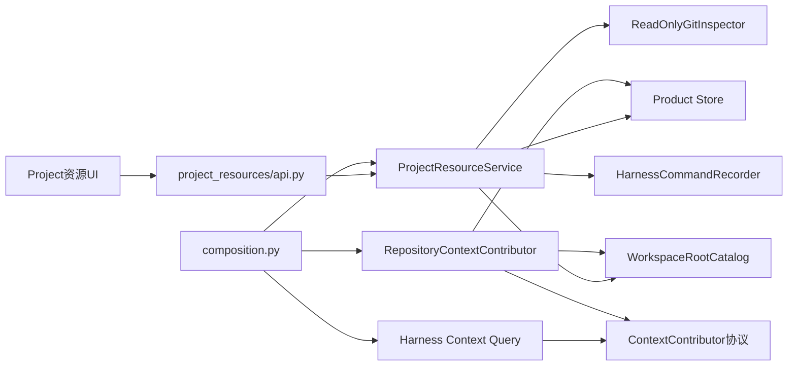
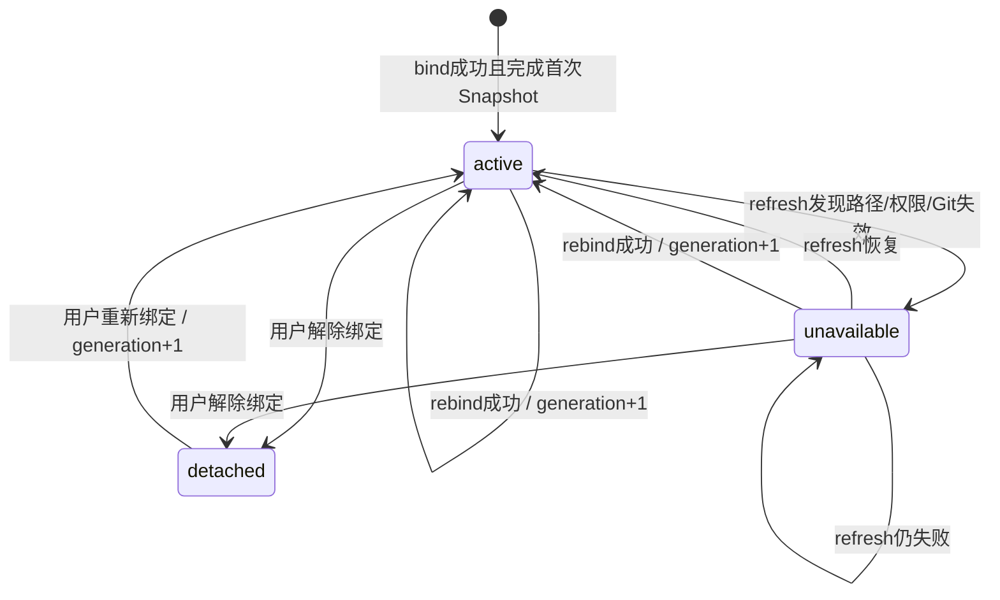

# SD1 Repository Binding / Snapshot 模块详细设计

> 状态：**R1-R12已于2026-07-24获用户批准；SD1-A/B/C/D均已完成，SD1只读纵向切片已收口**
>
> 日期：2026-07-24
>
> 上游决定：`Chat开发Chat` D1-D9 已批准
>
> 批准范围：允许按SD1-A/B/C/D顺序实施；写Tool、Execution Workspace与Evidence仍受后续独立门约束

## 1. 本阶段要交付什么

SD1只解决一个纵向问题：

> Chat如何把一个Product Project与用户明确选择的本地Git仓库建立可恢复关系，取得可验证的只读代码基线和治理文档，并把这些来源以可见、可选择、可失效的方式加入Context。

完成后，用户应能在前端完成：

1. 从服务端允许的目录中选择一个Git仓库并绑定到正式Project。
2. 看见仓库角色、分支、HEAD、干净/脏状态、最近观察时间和治理文档清单。
3. 手动刷新、重新绑定或解除绑定。
4. 在Context工作台看见哪些仓库事实和规则将进入本轮模型上下文。
5. 在发送前模型调用审批中继续看见最终实际内容。
6. 从另一个Product Session再次打开同一Project时取得同一组权威Binding和最新Snapshot。

SD1明确不交付：

1. 不让pi或任何Tool修改文件。
2. 不创建worktree。
3. 不执行测试、构建、commit、push或deploy。
4. 不把代码文件全文复制到Product DB。
5. 不把浏览器目录、MAF Session或pi Session变成Project事实源。
6. 不承诺OS级恶意进程隔离；SD1只有应用级只读边界。

## 2. 先固定4个对象

### 2.1 Workspace Root Catalog

服务端启动配置中的允许根目录目录。它回答“用户可以从哪些本地范围选仓库”，不是Project，也不写入Product DB。

公开字段只有：

| 字段 | 含义 |
|---|---|
| `root_key` | 稳定、非敏感的根目录标识 |
| `label` | 前端展示名 |
| `available` | 当前根目录是否可用 |
| `source` | `workspace_roots`或过渡兼容来源 |

服务端私有字段：

| 字段 | 含义 |
|---|---|
| `resolved_root` | 规范化后的绝对路径，不进入API、Trace或模型上下文 |
| `root_identity_hash` | 绝对根路径的SHA-256身份，用于发现配置路径被静默替换 |

Catalog加载规则：

1. `root_key`必须唯一且符合`[a-z][a-z0-9-]{0,63}`。
2. Root必须是已经存在、可读取的真实目录；Root自身也不能是符号链接或重解析点。
3. `resolved_root`只保存在进程内，不写Product Store。
4. Catalog配置无效时对应Root以`available=false`公开，服务不会猜测替代路径。

### 2.2 Repository Binding

Product Project与一个仓库位置的稳定关系。它由Product Store拥有，可以并发控制、失效、重绑和恢复。

Binding不保存代码内容，也不把绝对路径返回浏览器；它保存`root_key + relative_path`。

### 2.3 Repository Snapshot

一次不可变的只读观察。它记录Git HEAD、分支、dirty摘要、工作树指纹和治理文档Manifest。

Snapshot表示“在`observed_at`时刻看见了什么”，不承诺文件系统之后不再变化。

### 2.4 Governance Document Projection

Snapshot Manifest中的一份允许文档，在Context组装时按内容Hash再次校验后形成的本轮投影。

它不是新的长期文档副本。正文只进入当前ContextPackage和最终Provider请求，不写入Repository Snapshot表。

## 3. 当前工程事实与模块落点

当前事实：

1. `ProductProjectRecord`已经拥有`scope_id`、状态和`row_version`。
2. `HarnessCommandRecorder`可以在调用者事务中原子写Command、Harness Trace和Outbox。
3. `HarnessContextQueryService`已经组装Project、Work、Plan、Note和Accepted Memory，但不知道仓库。
4. `HarnessService`已超过2000行，不能继续承载Git、路径和Repository事务。
5. `composition.py`是应用组合根；Router和React页面不得拥有产品事务。
6. Product Store当前Alembic head为`a7b4c9d2e601`。

新增后端Feature：

```text
backend/app/project_resources/
├── models.py          # Binding与Snapshot ORM
├── contracts.py       # 枚举、纯校验、Hash与公开投影
├── catalog.py         # Workspace Root Catalog
├── paths.py           # 路径规范化、包含关系与符号链接拒绝
├── git_inspector.py   # 只读Git Adapter
├── queries.py         # 只读产品查询
├── context.py         # Repository Context Contributor与新鲜度校验
├── service.py         # Command Application Coordinator，唯一事务所有者
└── api.py             # DTO、HTTP映射，不开事务
```

新增前端Feature：

```text
frontend/src/features/project-resources/
├── project-resources-api.ts
├── repository-resource-panel.tsx
├── repository-binding-dialog.tsx
└── repository-resource-presenter.ts
```

依赖方向：



约束：

1. `harness`只定义通用`ContextContributor`窄协议，不导入`project_resources`。
2. `project_resources`可以复用Harness的Project表、错误和Command Recorder，但不能反向调用`HarnessService`。
3. `git_inspector.py`不导入SQLAlchemy、FastAPI或MAF。
4. `service.py`不导入FastAPI。
5. Router不调用`database.sessions.begin()`。

## 4. 参考事实、采用和拒绝

### 4.1 MAF 1.11.0

项目安装版`agent-framework-core==1.11.0`的
`agent_framework/_harness/_file_access.py`提供实验性：

1. `FileSystemAgentFileStore`：相对路径、根目录包含检查、拒绝`.`/`..`/绝对路径。
2. 路径每一段符号链接/重解析点检查，POSIX叶子文件打开使用`O_NOFOLLOW`。
3. `FileAccessProvider(disable_write_tools=True)`只声明read/ls/grep。
4. File Access Tool默认需要审批。

本地参考源码提交：
`9c4cd07899502157284b64a73f9a0adfb4594d96`。目标文件与安装版逐字一致，但该能力标记为Experimental。

采用：

1. 相对路径、根目录包含、符号链接fail-closed原则。
2. 只读能力与写能力从Tool定义层就分开。

不采用：

1. 不用MAF File Store保存Product Binding或Snapshot。
2. 不把实验性Provider当成Git、CAS、Trace、Outbox或Project资源管理。
3. SD1不向模型开放MAF文件Tool；该原语留给后续执行层单独审核。

### 4.2 pi

固定提交：
`2b00dade7cec918aefb025c8b7a4fa304a30acdd`。

源码事实：

1. `resource-loader.ts`从pi Agent目录、当前`cwd`及一直到文件系统根的祖先目录加载`AGENTS.md`或`CLAUDE.md`。
2. pi的read/write Tool参数明确允许“relative or absolute”路径。
3. `resolveToCwd`会保留绝对路径，并不强制限制在`cwd`内。

采用：

1. 后续pi运行必须把已批准的Execution Workspace作为明确`cwd`。
2. pi自动加载仓库规则可以减少重复Prompt装配。

不采用：

1. 不把pi默认路径解析当安全边界。
2. 不因为pi能读取AGENTS就省略Product Context、Repository Snapshot或用户审批。

### 4.3 nanobot

固定提交：
`2c789767280482f38667044f8a3be5102c71dd26`。

源码事实：

1. `workspace_policy.py`集中处理规范化、包含关系和边界错误。
2. filesystem Tool把额外读根、额外写根和精确写文件分开。
3. 项目明确声明应用级路径Guard不等于OS Sandbox。

采用：

1. 路径规则集中在一个模块。
2. 读、写能力和额外允许范围分别建模。
3. 错误明确告诉Agent这是硬边界，禁止换Tool绕过。

### 4.4 QwenPaw

固定提交：
`2134427584c2657bb717bb083a120f2de011d047`。

源码事实：

1. Coding Project API支持选择项目目录、目录浏览、文件树和Git状态。
2. 当前活动项目绝对路径保存在Agent配置。
3. Git status GET在非Git目录会自动`git init`并创建初始提交。
4. `Sandbox.check_path`在该固定提交仍是`NotImplementedError`接口。

采用：

1. Project资源应在前端可选择、可查看文件/Git摘要。
2. 工作空间与活动Agent/Session需要显式关联。

不采用：

1. 不把绝对路径作为浏览器或Agent配置里的唯一事实。
2. GET和Snapshot检查绝不自动`git init`或产生commit。
3. 不把未实现的Sandbox接口当安全保证。

### 4.5 LibreChat

固定提交：
`8e5ef1fb31e9d63b735c089b21cbc82c50acce46`。

源码事实：

1. Project后端能力、共享API合同、前端Query/Mutation分层。
2. Mutation成功后明确更新或失效Project、Conversation查询缓存。
3. Project Handler依赖注入具体数据方法，旧Express Router保持薄层。

采用：

1. Product资源服务、共享DTO和前端查询状态分开。
2. Binding变更后精确刷新Project/Repository/Context查询。

未涉及：

1. LibreChat没有为本项目的本地Repository Binding、Git Snapshot、路径根目录和Context Source新鲜度背书。

## 5. 正式Schema候选

### 5.1 `project_repository_bindings`

| 字段 | 类型 | 可空 | 规则 |
|---|---|---:|---|
| `id` | `String(36)` | 否 | UUID主键 |
| `scope_id` | `String(100)` | 否 | 必须与Project作用域一致 |
| `project_id` | `String(36)` FK | 否 | `product_projects.id`, `RESTRICT` |
| `alias` | `String(64)` | 否 | 小写技术标识，Project内稳定 |
| `display_name` | `String(120)` | 否 | 用户可见名称 |
| `role` | `String(24)` | 否 | `primary/supporting/documentation` |
| `root_key` | `String(64)` | 否 | 指向启动时Root Catalog |
| `root_identity_hash` | `String(64)` | 否 | 防止同Key静默换根 |
| `relative_path` | `Text` | 否 | 规范化POSIX相对目录，根本身为`.` |
| `locator_hash` | `String(64)` | 否 | 根身份与相对路径的Hash |
| `generation` | `Integer` | 否 | 每次位置变化递增，初始为1 |
| `status` | `String(24)` | 否 | `active/unavailable/detached` |
| `status_reason_code` | `String(80)` | 是 | 稳定错误码，不保存异常堆栈 |
| `latest_snapshot_sequence` | `Integer` | 否 | 当前最新观察序号，初始为1 |
| `row_version` | `Integer` | 否 | 所有状态变化CAS，初始为1 |
| `created_by` | `String(100)` | 否 | Product Principal |
| `updated_by` | `String(100)` | 否 | Product Principal或system |
| `created_at` | `DateTime(tz)` | 否 |  |
| `updated_at` | `DateTime(tz)` | 否 |  |
| `detached_at` | `DateTime(tz)` | 是 | 只在`detached`有值 |

约束与索引：

1. `UNIQUE(scope_id, project_id, alias)`。
2. `INDEX(scope_id, project_id, status)`。
3. `INDEX(scope_id, locator_hash)`。
4. `generation >= 1`、`row_version >= 1`、`latest_snapshot_sequence >= 1`。
5. 一个Project只能有一个非`detached`的`primary`。这是Project聚合不变量，由Project
   `row_version`条件更新提供并发Fence；不依赖仅SQLite可用的部分唯一索引。
6. 同一Project不能把同一`locator_hash`绑定两次。
7. Binding不物理删除。解除后保留历史和Snapshot。

说明：

1. 支持多个仓库不是为了提前做平台，而是覆盖一个Project包含主仓库、文档仓库或配套仓库的常见事实。
2. 前端首版默认只创建`primary`；`supporting/documentation`在高级区展开。
3. 同一个`alias`重新绑定时复用Binding ID，`generation + 1`，历史Snapshot仍能解释旧位置。

### 5.2 `repository_snapshots`

| 字段 | 类型 | 可空 | 规则 |
|---|---|---:|---|
| `id` | `String(36)` | 否 | UUID主键 |
| `scope_id` | `String(100)` | 否 | 与Binding一致 |
| `binding_id` | `String(36)` FK | 否 | `project_repository_bindings.id`, `RESTRICT` |
| `binding_generation` | `Integer` | 否 | 观察时的Binding generation |
| `sequence` | `Integer` | 否 | 每个Binding单调递增 |
| `capture_status` | `String(24)` | 否 | `available/unavailable` |
| `observed_at` | `DateTime(tz)` | 否 | 文件系统观察时间 |
| `root_identity_hash` | `String(64)` | 否 | 观察来源身份 |
| `relative_path` | `Text` | 否 | 历史解释所需，不是绝对路径 |
| `locator_hash` | `String(64)` | 否 | 观察位置Hash |
| `head_oid` | `String(64)` | 是 | 兼容SHA-1/SHA-256；unborn允许空 |
| `head_ref` | `String(255)` | 是 | 例如`refs/heads/main` |
| `upstream_ref` | `String(255)` | 是 | 没有upstream允许空 |
| `detached_head` | `Boolean` | 否 |  |
| `ahead_count` | `Integer` | 否 | 本地计算，不访问网络 |
| `behind_count` | `Integer` | 否 | 本地计算，不访问网络 |
| `dirty` | `Boolean` | 否 |  |
| `staged_count` | `Integer` | 否 |  |
| `unstaged_count` | `Integer` | 否 |  |
| `untracked_count` | `Integer` | 否 |  |
| `change_count` | `Integer` | 否 | 去重后的路径数 |
| `changes_truncated` | `Boolean` | 否 | UI摘要是否截断 |
| `change_summary_json` | `JSON` | 否 | 最多200项，仅相对路径和状态 |
| `fingerprint_complete` | `Boolean` | 否 | 是否完整覆盖dirty内容 |
| `worktree_fingerprint` | `String(64)` | 是 | HEAD、index、工作树和未跟踪文件的规范Hash |
| `governance_manifest_json` | `JSON` | 否 | 版本化的路径/Hash/大小/类别清单 |
| `governance_manifest_hash` | `String(64)` | 否 | Manifest规范Hash |
| `semantic_hash` | `String(64)` | 是 | 本次可采用代码基线的总Hash |
| `error_code` | `String(80)` | 是 | unavailable时的稳定错误 |
| `error_detail_safe` | `Text` | 是 | 脱敏、面向用户，不含绝对路径 |
| `inspector_version` | `String(32)` | 否 | 首版`git-inspector-v1` |

约束与索引：

1. `UNIQUE(binding_id, sequence)`。
2. `INDEX(scope_id, binding_id, observed_at)`。
3. 所有计数非负。
4. `available`必须有`semantic_hash`；`unavailable`必须有`error_code`。
5. Snapshot不可更新、不可删除；“刷新”只插入新序号。
6. 相同`semantic_hash`允许出现多次，因为它们是不同时间的观察；Context新鲜度按Hash而非Snapshot ID判断。

### 5.3 不新增的表

SD1不新增：

1. Repository文件表。
2. Git commit镜像表。
3. 全文索引表。
4. Execution Workspace或worktree表。
5. Tool Operation或Evidence表。

这些对象属于后续阶段或既有F01/F02门，不能混入只读资源模块。

## 6. 状态机



不变量：

1. 初次bind的路径无效时不创建半成品Binding。
2. 已存在Binding后来失效时，插入`unavailable` Snapshot并持久化状态；上一个成功Snapshot只作为历史显示，不自动进入新Context。
3. `detached`不再自动刷新，也不进入Context。
4. 只有用户显式rebind才能改变`root_key/relative_path`。
5. Root Catalog同Key对应的`root_identity_hash`变化时禁止静默跟随，Binding转为`unavailable`，要求rebind。

## 7. 路径与Git只读检查

### 7.1 客户端永远不提交绝对路径

写命令只接受：

```json
{
  "root_key": "local-code",
  "relative_path": "Chat"
}
```

路径规则：

1. 空值或`.`表示允许根本身。
2. 反斜杠统一为`/`。
3. 拒绝绝对路径、盘符、NUL、空段、`.`和`..`段。
4. 对候选路径从允许根逐段`lstat`；任一中间段或叶子是符号链接/重解析点即拒绝。
5. `resolve()`后再次验证仍位于`resolved_root`下。
6. 无法判断链接状态时fail closed。
7. 浏览目录时跳过符号链接，不跟随。

应用级边界仍存在TOCTOU窗口；SD1只执行只读命令。后续写阶段必须使用受管worktree和独立执行沙箱，不能把SD1 Guard外推为OS隔离。

### 7.2 Git Inspector只运行固定命令

允许的命令族：

1. `git rev-parse --is-inside-work-tree`
2. `git rev-parse --show-toplevel`
3. `git rev-parse --verify HEAD`
4. `git symbolic-ref -q HEAD`
5. `git status --porcelain=v2 -z --branch --untracked-files=all`
6. `git ls-files --stage -z -- <paths...>`，按批次执行

规则：

1. 使用参数数组，不使用shell。
2. `cwd`必须是已经通过安全解析的仓库目录。
3. `--show-toplevel`结果必须与绑定目录完全一致；不能绑定一个子目录后偷偷访问其父仓库。
4. bare repository拒绝。
5. unborn repository允许，`head_oid=null`并在Hash中使用`UNBORN`标记。
6. 设置`GIT_OPTIONAL_LOCKS=0`，避免只读检查刷新index。
7. 设置`GIT_TERMINAL_PROMPT=0`，不允许交互或网络凭据提示。
8. 显式关闭`core.fsmonitor`，不调用外部diff/textconv。
9. 不执行fetch、pull、clone、init、checkout、add、commit或任何Hook。
10. 单命令默认10秒超时，stdout/stderr有硬上限；超限或超时视为不可用。

### 7.3 dirty指纹

`git status --porcelain=v2 -z`解析出状态和路径。指纹包含：

1. HEAD OID或`UNBORN`。
2. 每个变化路径的规范相对路径和XY状态。
3. index中的blob OID/模式。
4. 当前普通文件的流式SHA-256。
5. symlink只Hash链接文本，不跟随目标。
6. 删除项使用稳定删除标记。
7. 未跟踪文件同样Hash。
8. Governance Manifest Hash。

限制：

1. 最多处理5000个变化路径。
2. 最多Hash 64 MiB dirty内容。
3. UI只保存前200个变化摘要。
4. 超过任一限制时仍返回可见Snapshot，但`fingerprint_complete=false`。
5. `fingerprint_complete=false`的Snapshot可以用于SD1说明现状，后续不得直接作为写执行基线。
6. ignored文件不进入指纹；以后执行测试时必须由RunSpec另行声明环境输入。

`semantic_hash`使用版本化规范对象计算，首版固定为：

```json
{
  "schema": "repository-semantic-v1",
  "binding_generation": 1,
  "locator_hash": "<sha256>",
  "head_oid": "<oid-or-UNBORN>",
  "head_ref": "<ref-or-empty>",
  "detached_head": false,
  "worktree_fingerprint": "<sha256>",
  "fingerprint_complete": true,
  "governance_manifest_hash": "<sha256>",
  "inspector_version": "git-inspector-v1"
}
```

规范JSON使用固定Key顺序、UTF-8和无多余空白后计算SHA-256。`observed_at`、Snapshot ID、
sequence和ahead/behind不进入Hash；重绑后的generation或locator即使指向内容相同的副本，
也必须形成不同Source revision。

### 7.4 治理文档Manifest

首版只扫描仓库根目录以下允许清单：

1. `AGENTS.md`
2. `CLAUDE.md`
3. `PROJECT_CONTEXT.md`
4. `PROJECT_STATE.md`
5. `PROJECT_PLAN.md`
6. `PROJECT_LESSONS.md`
7. `README.md`
8. `docs/engineering-standards.md`

规则：

1. 文件必须是普通UTF-8文本，不跟随symlink。
2. 单文件最大256 KiB。
3. Snapshot只保存`path/kind/sha256/size_bytes`，不保存正文。
4. `.env`、`config.json`、密钥文件和任意非允许路径不会因模型要求而加入。
5. Context组装读取正文后必须再次计算Hash；与Snapshot不符则标记`CONTEXT_SOURCE_STALE`并重新Snapshot。
6. 项目规则的优先级低于Chat产品安全规则和用户当前显式决定，不能覆盖Provider审批、路径边界或秘密策略。

## 8. Context组装与新鲜度

### 8.1 目录Context

Stage A只增加轻量`repository_directory`来源：

```json
{
  "source_kind": "repository_directory",
  "source_id": "<binding_id>",
  "source_revision": "<semantic_hash>",
  "content": {
    "display_name": "Chat",
    "role": "primary",
    "status": "active",
    "head_ref": "refs/heads/main",
    "head_short": "abc1234",
    "dirty": true
  }
}
```

它用于Project识别，不加载任何文件正文。

### 8.2 详情Context

Stage B加入：

1. 一个默认采用的`repository_snapshot`摘要。
2. 零到若干`repository_governance`文档来源。

治理文档采用策略：

| 用户意图 | 默认候选 |
|---|---|
| 开发、修改、审查代码 | `AGENTS.md/CLAUDE.md`、`engineering-standards.md` |
| 查询当前状态、做到哪 | `PROJECT_STATE.md` |
| 询问计划、下一步 | `PROJECT_PLAN.md` |
| 询问愿景、架构、边界 | `PROJECT_CONTEXT.md` |
| 复盘错误、规范 | `PROJECT_LESSONS.md` |
| 项目概览 | `README.md` |

限制：

1. 最多默认采用2份治理文档。
2. 正文总量最大32 KiB；超过时只提供Manifest，由用户在Context面板逐项选择。
3. 选择依据和未采用原因都进入Context工作台。
4. 用户可以采用、排除、编辑本轮投影；修改会生成新的ContextPackage revision。
5. 用户修改的是本轮Context副本，不会写回仓库。

### 8.3 Snapshot变化后的旧审批

规则：

1. ContextPackage使用`binding_id + semantic_hash`作为Source revision。
2. ModelCallDraft的`execution_context`增加`context_package_id`和Repository Source revisions。
3. 用户点击模型调用“确认发送”时，`ContextSourceFreshnessGuard`必须同时确认：Binding仍为
   `active`、generation和locator未变、最新一次Snapshot仍为`available`，且其
   `semantic_hash`等于Draft引用值。不能跳过最新失败观察去读取“最近一次成功Snapshot”。
4. 任一条件不成立时不创建Provider Attempt，不发送网络请求；当前Run进入可恢复的
   `context_source_stale`分支。
5. 前端提供“按最新仓库重新准备”和“停止Run”，不能让旧授权越过。
6. 相同语义Hash的重复观察不使审批失效。
7. SD2/SD3在Runtime Dispatch前还要再次执行同一Guard；SD1不能替代未来写入前Fence。

这条规则保证“旧请求内容未被偷偷修改”和“已经变化的代码基线不能冒充当前基线”同时成立。

## 9. Command与事务

### 9.1 共同两段式流程

文件系统和Git检查不能占用数据库事务：

```text
短事务检查command replay
-> 关闭事务
-> 解析路径并执行只读Git检查
-> 开启最终事务
-> 再次检查command replay
-> CAS校验Project/Binding
-> 写Binding/Snapshot
-> 同事务写Command + Harness Trace + Outbox
-> commit
```

两个相同Command并发时，最终事务中的第二次幂等检查只允许一个事实生效。

### 9.2 Bind

输入：

1. `command_id`
2. `project_id`
3. `expected_project_row_version`
4. `alias/display_name/role`
5. `root_key/relative_path`

流程：

1. 校验Project存在、作用域、状态不是`archived/cancelled`。
2. 安全检查并取得成功Inspection。
3. 最终事务用条件UPDATE递增Project `row_version`；影响行数不是1则冲突。
4. 检查Project内alias、locator和primary不变量。
5. 插入Binding和sequence=1的Snapshot。
6. 原子记录`harness.repository.bound`。

初次Inspection失败：不创建Binding、Snapshot、Trace或Outbox。

### 9.3 Refresh

输入：

1. `command_id`
2. `binding_id`
3. `expected_binding_row_version`

流程：

1. 对当前generation/location执行Inspection。
2. 条件UPDATE Binding：`row_version + 1`、`latest_snapshot_sequence + 1`。
3. 成功则`status=active`；失败则`status=unavailable`和稳定原因码。
4. 插入对应Snapshot。
5. semantic hash变化时Outbox Payload只记录旧/新Hash和计数，不记录文件名。
6. 不递增Project `row_version`，因为资源成员关系没有变化。

### 9.4 Rebind

输入同时携带Project和Binding期望版本。

流程：

1. 新位置必须Inspection成功。
2. 在同一事务分别用条件UPDATE Fence Project与Binding。
3. 改变root/location/role时`generation + 1`，Snapshot sequence继续全Binding单调递增。
4. 重新校验primary和locator不变量。
5. 插入Snapshot并记录`harness.repository.rebound`。

### 9.5 Detach

1. 不访问文件系统。
2. 同时CAS Project和Binding。
3. `status=detached`，保留所有历史。
4. 记录`harness.repository.detached`。
5. 旧Context仍是历史证据，但新Context不再采用。

### 9.6 启动时Root Catalog对账

启动初始化只对比配置身份，不扫描Git：

1. Root Key消失或Identity Hash变化的非detached Binding标记为`unavailable`。
2. 使用确定性Command ID
   `catalog-reconcile:<catalog_revision>:<binding_id>`。
3. 同事务写Trace和Outbox。
4. 不在启动时把不可用Binding静默改绑到新路径。

## 10. REST合同

所有写DTO使用`extra="forbid"`。

### 10.1 允许根与目录浏览

| 方法 | 路径 | 作用 |
|---|---|---|
| GET | `/api/harness/repository-roots` | 返回非敏感Root目录 |
| GET | `/api/harness/repository-roots/{root_key}/directories` | 分页列出安全子目录 |

目录查询参数：

1. `relative_path`，默认`.`。
2. `cursor`，服务端不透明游标。
3. `limit`，1-100。

首版API不提供`show_hidden`开关；以`.`开头的目录一律不枚举。需要绑定允许根本身时直接选择
`.`，不能通过通用目录浏览暴露服务端隐藏目录。

返回目录项：

```json
{
  "name": "Chat",
  "relative_path": "Chat",
  "has_git_marker": true,
  "selectable": true
}
```

绝不返回：

1. Root绝对路径。
2. 文件正文。
3. 隐藏文件。
4. symlink目标。

### 10.2 Binding管理

| 方法 | 路径 | 作用 |
|---|---|---|
| GET | `/api/harness/projects/{project_id}/repositories` | Project资源列表 |
| POST | `/api/harness/projects/{project_id}/repositories` | Bind |
| GET | `/api/harness/repositories/{binding_id}` | Binding及最新Snapshot |
| POST | `/api/harness/repositories/{binding_id}/refresh` | Refresh |
| POST | `/api/harness/repositories/{binding_id}/rebind` | Rebind |
| POST | `/api/harness/repositories/{binding_id}/detach` | Detach |
| GET | `/api/harness/repositories/{binding_id}/snapshots` | 历史Snapshot分页 |

Bind请求：

```json
{
  "command_id": "repository-bind-...",
  "expected_project_row_version": 3,
  "alias": "main",
  "display_name": "Chat",
  "role": "primary",
  "root_key": "local-code",
  "relative_path": "Chat"
}
```

Refresh请求：

```json
{
  "command_id": "repository-refresh-...",
  "expected_binding_row_version": 2
}
```

Rebind请求：

```json
{
  "command_id": "repository-rebind-...",
  "expected_project_row_version": 4,
  "expected_binding_row_version": 2,
  "display_name": "Chat",
  "role": "primary",
  "root_key": "local-code",
  "relative_path": "Chat"
}
```

Detach请求：

```json
{
  "command_id": "repository-detach-...",
  "expected_project_row_version": 5,
  "expected_binding_row_version": 3
}
```

公开Binding只展示Root label和relative path，不展示绝对路径或root identity hash。

### 10.3 稳定错误码

| 错误码 | HTTP | 含义 |
|---|---:|---|
| `REPOSITORY_ROOT_NOT_FOUND` | 404 | Root Key未配置 |
| `REPOSITORY_PATH_INVALID` | 422 | 相对路径格式错误 |
| `REPOSITORY_PATH_OUTSIDE_ROOT` | 422 | 路径逃逸 |
| `REPOSITORY_SYMLINK_REJECTED` | 422 | 路径包含符号链接 |
| `REPOSITORY_NOT_FOUND` | 404 | Binding或目录不存在 |
| `REPOSITORY_NOT_GIT` | 422 | 不是有效工作树根 |
| `REPOSITORY_INSPECTION_TIMEOUT` | 504 | Git检查超时 |
| `REPOSITORY_INSPECTION_TOO_LARGE` | 422 | 输出或结构超过安全上限 |
| `REPOSITORY_CONFLICT` | 409 | CAS、alias、locator或primary冲突 |
| `REPOSITORY_DETACHED` | 409 | 已解除资源不能refresh |
| `CONTEXT_SOURCE_STALE` | 409 | Context引用的仓库版本已变化 |

错误详情不包含绝对路径、Git stderr原文或文件正文。

## 11. 前端交互

### 11.1 Project资源卡

Project工作台增加“资源”区，默认折叠细节：

```text
┌ Chat代码仓库 · 主仓库 ────────────────┐
│ main · a1b2c3d · 12分钟前观察         │
│ ● 有7项未提交变化                     │
│ [查看基线] [刷新] [更多]              │
└──────────────────────────────────────┘
```

展开后分3层：

1. 基线：Branch、HEAD、ahead/behind、是否完整指纹。
2. 变化：按staged/unstaged/untracked分组，默认只展示前20项。
3. 项目规则：治理文档名、Hash缩写、大小、当前Context是否采用。

`unavailable`卡保留上一次成功信息，但明确标注“历史，不会自动发送给模型”。

### 11.2 绑定对话框

步骤：

1. 选择允许根。
2. 像文件夹导航一样逐层选择目录。
3. 确认用户可见名称和仓库角色；技术alias由界面生成，高级区才可改。
4. 后端完成只读检查后显示结果。

用户不能粘贴任意绝对路径绕过Root Catalog。

### 11.3 Context与模型审批

1. Context面板把Repository Snapshot和每份治理文档显示为独立来源。
2. 用户看见采用原因、Hash、Token估算和“来自哪一个Project/Binding”。
3. 用户可排除或编辑本轮投影；Key、来源ID和原始Hash不可编辑。
4. ModelCall审批仍展示最终普通文字内容与Provider Payload；两视图来自同一个Draft。
5. Source stale时确认发送按钮禁用，并提供“重新准备”。

### 11.4 响应式

390px视口：

1. Project资源卡单列。
2. 目录浏览为全高Sheet。
3. Snapshot细节分段展开，不渲染横向宽表。
4. 触控目标至少44px。

## 12. 日志、Trace与调试

### 12.1 结构化日志

记录：

1. Command入口与结果。
2. Git检查开始/结束、耗时和稳定结果码。
3. 状态迁移。
4. CAS冲突。
5. Context采用数量、Hash和stale校验结果。

关联字段：

1. `command_id`
2. `project_id`
3. `repository_binding_id`
4. `snapshot_id`
5. `product_run_id/context_package_id`（存在时）
6. `result`
7. `duration_ms`

不得记录：

1. 绝对路径。
2. 相对变化文件名。
3. Governance正文。
4. Git stderr原文。
5. Provider密钥或私有配置。

### 12.2 Product Trace

Mutation事件：

1. `harness.repository.bound`
2. `harness.repository.refreshed`
3. `harness.repository.unavailable`
4. `harness.repository.rebound`
5. `harness.repository.detached`
6. `harness.repository.catalog_invalidated`

Trace Payload只包含状态、generation、sequence、semantic hash、计数和稳定原因码。

### 12.3 调试面板

设计者视图可以显示：

1. Binding ID、generation、row version。
2. Snapshot ID、sequence、inspector version。
3. semantic/worktree/manifest Hash。
4. Context Source revision及新鲜度。

普通用户视图只显示名称、状态、基线和可行动作。

## 13. 配置与迁移

### 13.1 配置目标

新增顶层公共结构：

```json
{
  "workspace_roots": [
    {
      "key": "local-code",
      "label": "本地代码",
      "path": "/absolute/path/to/code"
    }
  ]
}
```

规则：

1. 私有`backend/config.json`仍是唯一运行配置；不读取到日志、文档或浏览器。
2. `backend/config.example.json`只提交脱敏路径。
3. 首个迁移周期若`workspace_roots`缺失，可把现有
   `pi_agent.allowed_working_roots`只读提升为兼容Catalog，并记录一次弃用警告。
4. 兼容Catalog Key由路径Hash稳定生成，不把路径写进DB或API。
5. 不自动重写用户私有配置。
6. SD3前把pi配置切到引用公共Root Catalog；SD1不改变pi行为。

### 13.2 Alembic

批准后只新增一条线性迁移，父版本为`a7b4c9d2e601`：

1. 创建`project_repository_bindings`。
2. 创建`repository_snapshots`。
3. 创建约束和索引。
4. 不回填任何绑定，不猜测哪个Project对应哪个目录。
5. downgrade先删除Snapshot，再删除Binding。
6. `migrations/env.py`显式导入新models。

上线顺序：

1. 迁移Schema。
2. 启动支持新Schema但Root Catalog可为空的后端。
3. 配置Root Catalog。
4. 用户在UI显式绑定。

空Catalog不会影响既有聊天、Harness或模型审批。

## 14. 测试方案

### 14.1 T1 纯规则测试

至少覆盖：

1. 相对路径规范化：空、`.`、`..`、绝对路径、Windows盘符、反斜杠、NUL、Unicode。
2. alias、role和状态转换。
3. Root Identity、Locator和Semantic Hash稳定性。
4. Git porcelain v2：空仓库、detached、rename、中文/空格、staged、unstaged、untracked、submodule、symlink。
5. dirty Hash完整和超过上限。
6. Governance Manifest排序、Hash和允许清单。
7. Context文档选择与Token/字节上限。

### 14.2 T2 真实文件系统与Git Adapter

测试使用临时目录和真实`git` CLI，不Mock Git语义：

1. clean仓库、dirty仓库、unborn仓库、detached HEAD。
2. 绑定子目录但Git根在父级，必须拒绝。
3. 非Git目录、bare repo、删除目录、权限错误。
4. 根内symlink、逃逸symlink、symlink到根内也拒绝。
5. 文件名含换行、Unicode和rename。
6. 大量未跟踪文件使`fingerprint_complete=false`。
7. 检查前后HEAD、index、工作树和目录清单不发生变化。
8. `GIT_OPTIONAL_LOCKS=0`合同测试。
9. 超时和输出上限。

### 14.3 T3 应用与事务

1. Bind成功同时产生Binding、Snapshot、Command、Trace、Outbox。
2. 相同Command相同Hash重放返回同一结果。
3. 相同Command不同Hash冲突。
4. Inspection失败无任何持久化。
5. 注入Snapshot或Recorder写入失败，整笔事务回滚。
6. 8个并发Bind争用同一primary，只有1个成功。
7. 8个并发Refresh同一版本，只有1个成功，其余409；sequence无重复。
8. Refresh成功/失效/恢复。
9. Rebind双CAS任一失败均不改变任何事实。
10. Detach后refresh拒绝，rebind可恢复。
11. Root Catalog换身份后启动对账可重放。

### 14.4 T4 API合同

1. 所有DTO拒绝额外字段。
2. Root API和错误体不含绝对路径。
3. 目录浏览拒绝逃逸、symlink和过大limit。
4. 404/409/422/504稳定映射。
5. Snapshot分页游标。
6. OpenAPI指纹有计划更新。
7. Project资源响应只包含当前scope。

### 14.5 T5 Context与审批

1. 无Binding时原有Context字节级语义不变。
2. Stage A只有轻量仓库目录。
3. Stage B包含Snapshot和匹配治理文档。
4. 治理文件Hash变化后旧内容不能装配。
5. unavailable/detached来源不自动采用。
6. 用户排除、编辑后产生新Context revision并失效旧ExecutionDraft授权。
7. Snapshot semantic hash变化后，旧ModelCall确认不创建Provider Attempt。
8. 重复Snapshot但semantic hash相同，旧审批仍可用。
9. Provider两视图内容一致。
10. 不会采用`backend/config.json`、`.env`或未允许文件。

### 14.6 T6 前端与浏览器E2E

场景1：首次绑定Chat仓库

1. 创建或选择正式Chat Project。
2. 选择Root和`Chat`目录。
3. 绑定后看见branch/head/dirty/规则。
4. 刷新页面和重新打开Product Session后仍存在。

场景2：仓库变化

1. 在测试仓库修改一个文件。
2. 刷新资源卡。
3. UI显示变化和新Hash。
4. 原待审批模型请求显示stale且不能发送。
5. 重新准备后只看到新Snapshot。

场景3：仓库不可用后恢复

1. 临时移动测试仓库。
2. Refresh显示unavailable，历史Snapshot只读可见。
3. 放回目录再Refresh恢复active。

场景4：重绑与并发

1. 桌面A和手机B同时打开同一Project。
2. A完成rebind。
3. B用旧版本操作得到清晰冲突，不覆盖A。

场景5：路径攻击

1. 手工构造`../`、绝对路径和symlink请求。
2. 后端拒绝。
3. 页面、日志、Trace和错误不泄露真实路径。

场景6：移动端

1. 390px完成目录选择、绑定、刷新、查看规则和Context采用。
2. 没有横向溢出，按钮可触控，信息分层可理解。

### 14.7 T7 真实模型纵向验证

使用现有私有Provider配置但不读取或输出密钥，至少验证：

1. “当前Chat项目是什么、代码在哪个基线、工作树是否干净？”
2. “这个项目当前做到哪、下一步是什么？”
3. “开发这个项目必须遵守哪些规则？”
4. 在另一个Product Session重复提问，命中同一Project资源。
5. 切换到另一个Project后不带入Chat仓库来源。
6. 每次Provider调用都经过现有逐次审批。
7. 最终Trace能解释Repository来源为何被采用。
8. 模型没有read/write/bash Tool，文件系统零修改。

真实模型结果只证明对应快照，不替代确定性合同和路径安全测试。

## 15. 阶段执行节奏与完成门

SD1批准后拆成4个小迭代，每个迭代都执行：

```text
开发
-> 单元/合同测试
-> 集成/异常测试
-> 代码与架构检视
-> 优化
-> 浏览器或真实模型E2E
-> 目标偏航审计
```

### 15.1 SD1-A：领域与只读Adapter

交付：

1. Root Catalog、路径规则、Git Inspector。
2. Binding/Snapshot models和迁移。
3. Application Service与事务测试。

偏航门：

1. 没有Tool、MAF或前端依赖进入领域/Adapter。
2. Git检查没有写副作用。
3. Product DB只保存Binding和Snapshot，不复制代码。

实施结果（2026-07-24）：

1. 已实现公共Workspace Root Catalog、兼容pi roots的一次性只读提升、逐段`lstat`路径防穿越、
   固定命令集只读Git Inspector、Binding/Snapshot Schema、线性Alembic迁移、两段式Application
   Service、Project/Binding CAS、Command/Trace/Outbox原子提交和启动Root身份对账。
2. 生产模块按配置、Catalog、Path Guard、Git Adapter、ORM、查询、事务内聚合规则、Snapshot构造
   和Application Coordinator拆分；Router、MAF、Tool和前端依赖均未进入SD1-A。
3. 真实临时Git仓库覆盖clean、dirty、unborn、detached、rename、Unicode/换行文件名、非Git、bare、
   子目录、符号链接、治理文档允许清单、容量截断、超时、输出超限和Git缺失；内存与持久SQLite均
   通过8路并发CAS场景。
4. 隔离数据库已通过`base -> head -> alembic check -> base`；全量后端200项、前端65项合同测试、
   前端规范检查和生产构建通过。
5. 当前Chat脏工作树完成一次真实只读Dogfood：观察到93项变化且指纹完整；检查前后HEAD、index
   内容与时间、完整status指纹一致。该证据只证明只读观察，不授权或证明任何写能力。

### 15.2 SD1-B：REST与Project资源UI

交付：

1. REST合同。
2. 目录选择、资源卡、刷新/重绑/解除。
3. 桌面与移动端E2E。

偏航门：

1. 浏览器不拥有权威路径或Binding状态。
2. UI不能提交绝对路径。
3. Router没有事务。

实施结果（2026-07-24）：

1. 已实现9个管理合同：公开Root目录、分页目录浏览、Project Repository列表、Binding详情、
   bind、refresh、rebind、detach和Snapshot游标查询；所有命令使用稳定错误码、幂等Command ID
   与Project/Binding CAS，Router只翻译HTTP而不拥有事务。
2. 浏览器只取得Root Key、显示标签和相对路径；隐藏目录、符号链接和父路径逃逸被拒绝，
   DTO禁止额外`absolute_path`字段，响应不返回Root身份Hash或服务端绝对路径。
3. Project页新增代码资源卡：区分`active/unavailable/detached`，可展开HEAD、Branch、dirty摘要、
   治理文档Manifest和最后可用历史基线；界面明确标注这些内容尚未进入本轮Context。
4. 绑定选择器使用页面根Portal，桌面为Modal、手机为底部Sheet；支持Esc、焦点恢复和Tab约束。
   同一Binding的刷新、重绑与解除互斥，避免前端用旧CAS版本制造可预防冲突。
5. 完整质量门通过：后端204项、78.41%覆盖率；前端66项、61.24%语句/71.06%分支/
   77.92%函数覆盖率；Playwright桌面与Pixel 5共13项通过、3项按设计跳过；Alembic
   `base -> head -> check -> base -> head`、OpenAPI指纹、生产构建和Bundle预算均通过。
   E2E曾真实发现并修复工作台动画层叠上下文遮挡、刷新/重绑竞态，以及手机/云中转慢响应下
   对话框先打开而Root投影后返回的恢复问题；Repository样式随后拆入Harness懒加载Chunk，
   全局CSS不再承担该Feature的完整成本。
6. 偏航审计通过：前端不拥有权威路径或状态，Router没有事务，Git检查仍严格只读；本阶段没有
   Context Contributor、Provider新鲜度门、MAF/Tool接入或任何写能力。

### 15.3 SD1-C：Context与审批新鲜度

交付：

1. Context Contributor。
2. Governance文档选择。
3. Source Freshness Guard。
4. 工作流节点内容和采用原因可见。

偏航门：

1. 不恢复完整历史堆叠。
2. 不自动采用秘密文件。
3. 旧Source revision不能越过发送门。

实施结果（2026-07-24）：

1. `RepositoryContextContributor`已接入Harness两阶段Context：阶段A只投影轻量仓库目录，阶段B
   默认采用一个Snapshot和最多2份匹配治理正文；允许清单外文件不会成为候选，默认正文总量超过
   32 KiB时仅提供Manifest。
2. 用户在本轮信息工作台选择Manifest后，服务端在数据库事务外重新核对Binding、最新Snapshot、
   普通文件/链接边界、大小与SHA-256，再在最终事务中重验Context CAS并创建新revision；精确
   Command重放只返回既有不可变结果，不二次触碰后来变化的文件。
3. 主Workflow升级为v1.5.0/31节点，新增目录与详情Context revision投影、详情Context采用节点；
   节点Trace公开来源类型、版本、采用/排除原因，治理正文仍只在专用Context与模型审批视图出现。
   目录Context决定中的修改/跳过会先创建新的不可变revision，再投影到后续节点，避免旧包重新装回。
4. ModelCallDraft准备、用户审批和Provider Dispatch前均检查当前ContextPackage及最新Repository
   Snapshot；Source失效会使Run以`context_source_stale`可恢复失败、失效旧授权且不创建
   Provider Attempt。重复观察但Semantic Hash相同仍保持有效。
5. 模型审批页与Provider请求从同一任务内容派生；前端公开来源类别、短版本、选择者、采用原因和
   实际文字，并提供重新准备入口。桌面和Pixel 5完整验证Manifest载入与revision升级；E2E发现并
   修复手机Flex收缩造成编辑按钮被下方卡片覆盖。
6. 完整门为后端211项/78.59%覆盖率、前端67项/61.26%语句覆盖率、Playwright 15项通过且3项按
   设计跳过；OpenAPI与Workflow指纹、Ruff、Pyright、Biome、生产构建和包体门均通过。
7. 偏航审计通过：没有恢复完整历史堆叠，没有采用`.env`、`backend/config.json`或任意文件，
   没有Repository写入、pi执行、worktree、commit、push、deploy或Evidence完成声明。

### 15.4 SD1-D：真实纵向与优化

2026-07-24完成，交付：

1. 把Chat自身建立为普通Product Project，使用Repository Binding关联当前仓库；3个独立
   Product Session均恢复同一Project和Binding，而不是从聊天历史重新猜测仓库。
2. 真实模型能从Product事实、Repository Snapshot和允许的治理来源回答当前Project、SD1阶段、
   活动Work、Git HEAD、工作树变更数量、规则及下一步。每次Provider调用仍逐次审批。
3. 最终只读Product Run为`d6d67699-3abd-48f8-b000-31befab7c602`：3次模型调用均有独立
   ModelCallDraft、Authorization和HTTP 200 Attempt；Runtime Job成功，Checkpoint没有遗留请求，
   Outbox全部发布，Work/Memory候选均为0。
4. 同一Run前后的Repository Snapshot sequence 3/4拥有完全一致的HEAD、Semantic Hash、
   Worktree Fingerprint和`change_count=129`，证明该产品运行没有修改Repository。
5. 修复Context预算的“首份超限文档阻塞后续小来源”问题；超限来源会被单独排除，剩余允许来源仍可
   进入Context。健康检查不再投影本地工作目录等配置路径。
6. Summary Agent只接收已采用来源的标识、版本和采用理由，不重复注入治理正文。真实审批估算从约
   12,574 Tokens降到约2,556 Tokens，最终回归约1,827 Tokens；前端明确标记“仅发送来源引用”。
7. 用户明确要求只读或禁止修改Project/Work/Memory时，确定性写回策略会在候选进入治理前过滤，
   不再只依赖模型遵从或让用户额外处理不该出现的写回审批。
8. 全量门通过：后端215项、覆盖率78.87%；前端67项，行覆盖率61.26%、分支71.40%、
   函数77.92%；桌面与Pixel Playwright 15项通过、3项按设计跳过；17次迁移升降、OpenAPI、
   Workflow指纹、Ruff、Pyright、Biome、生产构建、包体、Python/npm漏洞和前端许可证门通过。

最终完成门：

1. [x] 能可靠回答“当前Project、进度、代码基线和规则”。
2. [x] 只读Run前后Repository指纹完全一致。
3. [x] 跨Product Session恢复同一Binding。
4. [x] 路径逃逸和stale Source均fail closed。
5. [x] OpenAPI、Schema、架构、前后端和真实模型证据齐全。
6. [x] 已固定SD1与SD2/SD3的能力边界。

### 15.5 SD1已兑现保证

1. Product Store拥有Project和Repository Binding事实；Git/文件系统仍拥有源码事实。
2. 用户能在桌面与手机Project界面绑定、查看、刷新和解除Repository资源，浏览器不接收绝对路径。
3. Snapshot不可变，记录HEAD、脏状态、语义Hash、工作树指纹、完整性和治理文档Manifest。
4. Context按允许清单和预算渐进装配，用户能看到来源、版本、采用原因和正文，并能修改或排除。
5. ModelCallDraft准备、人工批准和Provider Dispatch前均做Repository Source新鲜度检查；
   Binding失效、最新观察不可用或语义版本变化都在网络发送前失败关闭。
6. 明确只读约束会同时约束Provider能力和Product写回；模型候选不能绕过确定性提交门。
7. Trace、Runtime Event、Attempt和Repository Snapshot足以回答本轮为何这样运行、实际发送了什么、
   是否触发Provider以及运行前后仓库是否改变。

### 15.6 SD1仍未兑现保证

1. SD2前不派发pi读取或检索源码；SD1只读取允许清单内的治理文档和只读Git元数据。
2. SD3前没有Execution Workspace、文件写入、补丁、commit、push、deploy或Integration Operation。
3. SD4前没有独立Evidence/Artifact生命周期，测试通过不能自动把Work标为完成。
4. ignored文件不进入当前工作树指纹；应用级路径边界也不是对共享主机恶意进程的操作系统沙箱。
5. Snapshot是观察结果，不会冻结文件系统；任何后续执行都必须在派发前再次校验基线。
6. 已接受TaskPlan中的PlanNode当前仍是修订快照，节点状态不会随ActionItem自动推进；实时进度权威
   仍是WorkItem/ActionItem。后续F06必须设计派生进度投影或正式PlanNode转换合同，在此之前UI和
   模型不得把原始`pending`节点解释为实时进度。
7. 通用Tool副作用对账、独立Evidence、任意Workflow/pi持久恢复分别仍受F01、F02和F05设计门约束。

## 16. 自我检视

### 16.1 发现并修正的6个候选错误

1. **错误候选：直接复用`pi_agent.allowed_working_roots`作为永久领域模型。**
   修正：建立通用Workspace Root Catalog；只保留一次兼容提升，防止Project资源依赖pi。
2. **错误候选：Binding保存绝对路径并返回前端。**
   修正：只保存Root Key、相对路径和不可逆身份Hash。
3. **错误候选：每次Refresh更新同一Snapshot。**
   修正：Snapshot不可变，sequence单调递增，才能审计旧Context。
4. **错误候选：Git HEAD足以表示代码基线。**
   修正：dirty/index/untracked和治理文档都进入指纹，并明确不完整状态。
5. **错误候选：Provider请求内容没变，仓库变了也可以继续用旧审批。**
   修正：审批内容仍不可变，但Source Freshness Guard在网络发送前阻止过期基线冒充当前。
6. **错误候选：仓库最新观察失败时，继续拿“最近一次成功Hash”通过新鲜度检查。**
   修正：Guard必须检查Binding active、最新Snapshot available、generation、locator和Hash；
   unavailable状态下上次成功Snapshot只能作为历史证据。

### 16.2 架构检查

| 检查 | 结果 |
|---|---|
| Product Store是否仍是Binding事实源 | 是 |
| Git/文件系统是否仍是代码事实源 | 是 |
| 是否引入第二套Workflow或事件协议 | 否 |
| Router/React是否拥有事务 | 否 |
| 是否继续扩大HarnessService | 否 |
| 是否默认开放写能力 | 否 |
| 是否把MAF实验能力包装成Product保证 | 否 |
| 是否把pi默认cwd当沙箱 | 否 |
| 是否有CAS、幂等、Trace与Outbox | 是 |
| 是否保存隐藏推理 | 否 |
| 是否保护秘密和绝对路径 | 是 |
| 是否覆盖失败、并发、恢复和移动端 | 是 |

### 16.3 仍然存在的边界

1. 应用级路径检查不能防御共享主机上的恶意并发进程。
2. ignored文件不在Snapshot指纹内。
3. `fingerprint_complete=false`只能用于说明，不能作为未来写基线。
4. SD1不执行代码文件搜索；回答源码细节要等SD2受治理只读执行。
5. Root Catalog改变需要重启和对账，首版不做在线热重载。
6. Snapshot观察后文件仍可能继续变化；因此后续执行前必须再次校验。

## 17. 已批准的12项决定

| 编号 | 候选决定 | 建议 |
|---|---|---|
| R1 | 一个Project可绑定多个仓库，首版UI默认一个primary | 批准 |
| R2 | Binding只存Root Key、相对路径和Hash，不存/返回绝对路径 | 批准 |
| R3 | Binding三态`active/unavailable/detached`，重绑递增generation | 批准 |
| R4 | Snapshot不可变，重复语义Hash也允许形成新观察 | 批准 |
| R5 | dirty指纹设路径/字节上限，超限标记不完整而不假装精确 | 批准 |
| R6 | 首版治理文档使用明确允许清单，不做任意文件自动注入 | 批准 |
| R7 | 新建通用Workspace Root Catalog，对旧pi roots只做一次兼容提升 | 批准 |
| R8 | Git检查严格只读，不自动init/fetch/checkout或运行Hook | 批准 |
| R9 | 资源成员变更递增Project版本；普通Refresh只递增Binding版本 | 批准 |
| R10 | Source变化或最新观察不可用时，在模型网络发送前fail closed并要求重新准备 | 批准 |
| R11 | 模块独立为`project_resources`，通过窄Contributor接入Harness Context | 批准 |
| R12 | 按SD1-A/B/C/D逐段开发，每段完成测试、检视、优化、E2E和偏航审计 | 批准 |

2026-07-24用户已批准R1-R12。该批准允许进入SD1只读纵向实施，不授权SD2的pi源码读取、
SD3的文件写入或SD4的Evidence完成声明。

## 18. 直接证据

### 当前Chat

1. `backend/app/harness/models.py`
2. `backend/app/harness/contracts.py`
3. `backend/app/harness/commands.py`
4. `backend/app/harness/queries.py`
5. `backend/app/harness/service.py`
6. `backend/app/collaboration_contexts/service.py`
7. `backend/app/model_call_review.py`
8. `backend/app/workflows/continuous_chat.py`
9. `backend/app/composition.py`
10. `backend/tests/test_architecture_contract.py`

### MAF

1. `.venv/lib/python3.12/site-packages/agent_framework/_harness/_file_access.py`
2. `/Users/xulater/Code/opc-os/agent-framework/python/packages/core/tests/core/test_harness_file_access.py`

### pi

1. `/Users/xulater/Code/opc-os/pi/packages/coding-agent/src/core/resource-loader.ts`
2. `/Users/xulater/Code/opc-os/pi/packages/coding-agent/src/core/tools/path-utils.ts`
3. `/Users/xulater/Code/opc-os/pi/packages/coding-agent/src/core/tools/read.ts`
4. `/Users/xulater/Code/opc-os/pi/packages/coding-agent/src/core/tools/write.ts`

### nanobot

1. `/Users/xulater/Code/opc-os/nanobot/nanobot/security/workspace_policy.py`
2. `/Users/xulater/Code/opc-os/nanobot/nanobot/agent/tools/path_utils.py`
3. `/Users/xulater/Code/opc-os/nanobot/nanobot/agent/tools/filesystem.py`
4. `/Users/xulater/Code/opc-os/nanobot/.agent/security.md`

### QwenPaw

1. `/Users/xulater/Code/reference-agent-sources/QwenPaw/src/qwenpaw/app/routers/coding_project.py`
2. `/Users/xulater/Code/reference-agent-sources/QwenPaw/src/qwenpaw/app/routers/workspace.py`
3. `/Users/xulater/Code/reference-agent-sources/QwenPaw/src/qwenpaw/app/routers/git.py`
4. `/Users/xulater/Code/reference-agent-sources/QwenPaw/src/qwenpaw/app/utils.py`
5. `/Users/xulater/Code/reference-agent-sources/QwenPaw/src/qwenpaw/services/workspace_manager/sandbox.py`

### LibreChat

1. `/Users/xulater/Code/opc-os/LibreChat/packages/api/src/projects/handlers.ts`
2. `/Users/xulater/Code/opc-os/LibreChat/api/server/routes/projects.js`
3. `/Users/xulater/Code/opc-os/LibreChat/packages/data-provider/src/api-endpoints.ts`
4. `/Users/xulater/Code/opc-os/LibreChat/packages/data-provider/src/data-service.ts`
5. `/Users/xulater/Code/opc-os/LibreChat/client/src/data-provider/Projects/queries.ts`
6. `/Users/xulater/Code/opc-os/LibreChat/client/src/data-provider/Projects/mutations.ts`
