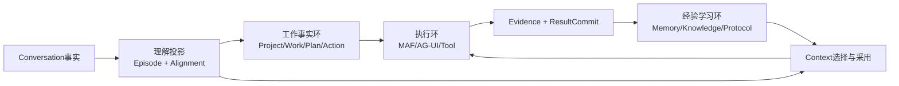
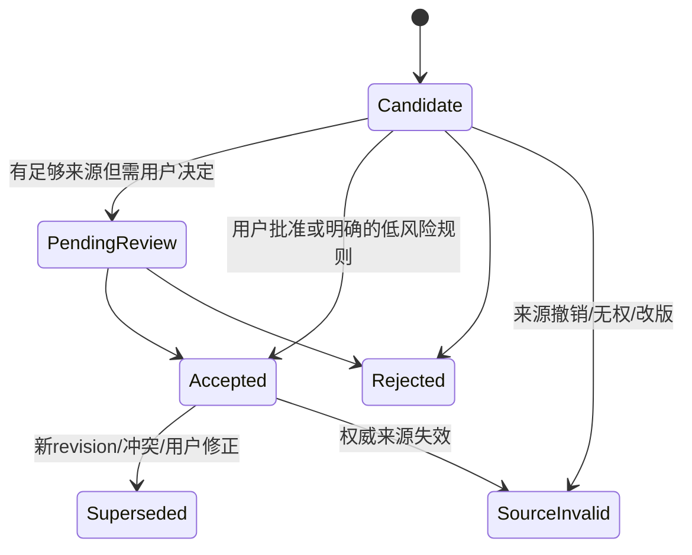

# MemOS、memmy-agent 与 Chat：会话后管理对比及超越方案

> 后续AI先读`/Users/xulater/Code/opc-os/agent_knowledge/project-studies/Agent-Memory-MemOS-memmy-agent-总入口.md`；
> 同目录`diagram/agent-memory-runtime-and-chat-decisions.svg`同时展示MemOS、memmy-agent与Chat候选链。

> 状态：**待用户审核的研究候选**，不是正式架构、Schema 或开发授权。
> 日期：2026-08-01
> 固定上游：MemOS `027dc8975836c066a7d1dd80c78c3da5c0fa084e`；memmy-agent `211d521b310fc23c63dd3d9ca848941173981c5e`。
> 范围：会话内容已经可用以后，怎样管理用户的学习、工作、项目和可复用经验；**不设计历史导入**。

> 本文负责架构对比与设计推导；逐入口“输入—处理—输出”及Chat可实施纵向合同见
> [Chat会话后管理I/O与落地合同](./agent-memory-io-implementation-contract.md)。两者都待用户审核。

## 1. 结论

要超越 Agent Memory，Chat 不应做一个“更复杂的 L1/L2/L3 向量库”，而应做成两个闭环的组合：

1. **工作事实闭环**：用户在做什么、属于哪个 Project/Work、计划和状态怎样变化、执行结果和证据是否足以提交。
2. **经验学习闭环**：这次为什么成功/失败、哪些偏好/规则/环境事实/流程值得跨会话复用、下次怎样召回、效果如何反馈。

MemOS/memmy 的长处主要在第 2 条；Chat 当前长处主要在第 1 条的对象、治理和 Result Commit。最优方案不是替换，而是让经验层成为 Chat 权威产品对象的**候选生成与派生层**：

```text
Conversation事实
→ Episode/Activity理解投影
→ Work变更候选 + Memory/Knowledge/Protocol候选
→ 用户/规则决定
→ 现有Product/Work/Memory/Knowledge/Protocol Owner提交
→ Agent执行
→ Artifact/Evidence/ResultCommit形成真实结果
→ 结果反向成为经验的正/负/冲突证据
→ 下一轮Context展示候选、采用、排除与来源
```

核心差异：Agent Memory 通常从“模型认为有用”推导未来行为；Chat 应从“用户批准的事实 + 可定位证据 + 实际结果”推导未来协作。

## 2. 两个上游已经掌握到什么程度

| 项目 | 源码范围 | 实跑 | 已钉死的管理链 |
|---|---|---|---|
| MemOS | Python 主线、MCP、Local v1、Local v2；重点 Local v2 | Local v2 全量 1225 passed；新定向 E2E 1/1；Python API/User/Scheduler 受控链 | Session→Episode→12 Trace→手工Reward调用→1 active Policy→1 World Model→1 active Skill；非空召回由其他源码/测试覆盖 |
| memmy-agent | Desktop、Backend、Gateway、Memory、Hook、Store/Worker | Memory 416 passed；真实 HTTP/SQLite 29/29；新完整演化定向 1/1；Agent 复跑全绿快照 | Hook→Session/Turn→RawTurn/L1→Job→L2/L3/Skill→Trial→反馈→再次召回 |

新增定向复跑首次都因 `npm ci --ignore-scripts` 未构建 `better-sqlite3` native binding 而失败；binding 可用后原测试通过。独立复核要求补强 commit 绑定，因此最终各有一份 `full-provenance-rerun2.json`，在一条命令中记录固定 commit/clean→archive→install→Node 24 native rebuild→定向测试→clean。中间 Node/C++ 与 Vitest cwd 补证失败也保留，环境失败和业务结果分开。

## 3. Agent Memory 到底怎样管理

### 3.1 它们共同的核心

两者当前会话后管理的共同骨架是：

| 层 | 管理对象 | 解决的问题 |
|---|---|---|
| 会话边界 | Session | 哪一批宿主回合属于同一运行范围 |
| 主题边界 | Episode | 哪些回合在解决同一个问题 |
| 观察来源 | RawTurn；MemOS原始Turn材料 | 具体输入、输出、Tool、错误和来源是什么 |
| 派生经验 | L1 Trace/Span | 经清洗、切步、摘要、标签和价值评分后，哪些片段值得学习 |
| 价值归因 | Reflection/Reward/Feedback | 哪些步骤有用、失败或被用户纠正 |
| 可复用经验 | L2 Policy | 下次在什么条件下怎样做 |
| 环境认知 | L3 World Model | 环境有哪些结构、规律和约束 |
| 可执行经验 | Skill + Trial | 可复用流程是什么，实际使用是否成功 |
| 下一轮使用 | Retrieval/Injection/RecallEvent | 候选、丢弃、注入和结果怎样关联 |
| 派生恢复 | Job/Lease/Processing | 模型/Embedding 失败如何重试和展示 |

MemOS Local v2 更像纯粹的本地经验内核；memmy 在此基础上补了 HTTP 合同、Agent Hook、RawTurn、幂等、Change/Audit/Panel、Desktop Supervisor 和多入口产品化。

### 3.2 它们不是怎样做的

正常实时链不是“定时读取各 Agent Session 文件、解码后管理”。

- MemOS Local v2 由 OpenClaw/Hermes Adapter 接 `before prompt/agent end/session end` 生命周期事件。
- memmy Agent Hook 在 `beforeRun` 调 `turn.start` 召回，在 `afterRun` 调 `turn.complete` 提交 answer/tools/usage/sourceMemoryIds。
- 历史文件扫描/manifest/recipe 只是另一种原始材料入口，最终仍要归一化进入 Memory 管理对象。

## 4. 两项目对比

| 维度 | MemOS Local v2 | memmy-agent | 判断 |
|---|---|---|---|
| 宿主接入 | Adapter + JSON-RPC/Core | Agent Hook + HTTP/CLI/Desktop | memmy 产品化更完整 |
| Episode | 默认 merge follow-up，可切 per-turn | plugin-style relation/idle close | 都是系统推断，不是 Work |
| 原始与派生 | 原始Turn材料→按step派生L1 Trace | RawTurn原始结构→派生L1/Span | memmy把来源事实与派生Trace分得更显式 |
| 来源召回 | Injection snippet `refKind/refId`、API logs | RawTurn `sourceMemoryIds` + RecallEvent | memmy 的采用反馈字段更完整 |
| 演化 | L2/L3/Skill 同一 Core 事件飞轮 | 同库 Job/Worker、Processing/Change/Audit | memmy 运维状态更产品化 |
| 技能反馈 | Skill Trial、eta、evidence anchors | Trial、成功率、Beta posterior、eta | 两者都优于静态 prompt 技能 |
| 幂等 | Local retry/lease；整体合同不一 | adapterId/requestId/hash/response，可跨重启 | memmy 明显更强 |
| 用户治理 | Viewer/edit/archive/share，但自动演化为主 | Panel/delete/retry，自动演化为主 | 都弱于 Chat Candidate/Decision/Revision |
| 权限 | Local owner namespace；Python Product 授权实跑缺口 | token scope；对象 namespace assert 为空 | 都不能直接背书多租户 |
| 工作管理 | 无 Project/Work/Plan/Evidence | 有 Goal/DAG/Cron，但非统一产品事实 | 都没有 Chat 闭环 |
| 完成语义 | reward/用户反馈 | reward/feedback/trial | 不能替代 Result Commit |

## 5. Chat 当前已经有什么

### 5.1 代码事实

当前 Chat 已有：

| 能力 | 代码对象/字段 | 已有保证 |
|---|---|---|
| Project/Work | `ProductProjectRecord`、`WorkItemRecord` | scope、status、row_version、层级与关联 |
| Plan/Action | `TaskPlanRevisionRecord`、`PlanNodeRecord`、`ActionItemRecord` | revision、依赖图、assignee_kind、validation、stop condition |
| Memory治理 | `MemoryCandidateRecord`→`AcceptedMemoryRecord`→`MemoryRevisionRecord` | candidate/accept/reject/session-only、来源、revision、supersede |
| Knowledge | `NoteRecord/NoteRevisionRecord` | 可编辑版本、source refs |
| Context | `ContextPackageRecord/ContextAdoptionRecord` | Run阶段、revision/hash、token budget、采用/排除/锁定/用户覆盖 |
| Evidence/Result | Artifact/Validation/CompletionClaim/ResultCommit | 验证、决定绑定、原子结果提交、不能无证据完成 |
| Runtime | MAF AgentSession/Workflow + AG-UI Run/Thread | 与产品状态分离 |

本次定向测试：`test_plan_action_note_and_memory_keep_independent_lifecycles` 通过，证明 Plan、Action、Note、Memory 各自生命周期、Memory reject/accept/revise/supersede 与 Result Commit Gate 的基本合同可运行。

另外 3 条 Context/Result 测试被当前源码中的显式 `breakpoint()` 中断：

- `backend/app/product_sessions/service.py::prepare_agui_run` 的 BP-04。
- `backend/app/runtime_execution/endpoint.py::durable_agent_endpoint` 的 BP-01。

它们是当前工作树调试配置事实，不是本研究引起；本次不修改。因而本报告不能宣称这 3 条当前快照全绿，只能引用它们已有代码/历史测试设计。

### 5.2 当前真正缺什么

1. 没有稳定的跨 Turn Episode/Activity 聚合和主题边界投影。
2. 没有从多个真实 ResultCommit/反馈中归纳“做法、环境、技能”的经验飞轮。
3. `commit_turn_candidates()` 对每个 Work candidate 都新建 `WorkItemRecord`；不能表达“更新已有 Work、链接 Project、补 Plan、仅记录进度、不做变更”。
4. 现有 Memory Candidate 主要是 `memory_kind + content + source_refs`，还没有 support/conflict/boundary/verification/outcome 等经验字段。
5. Context 能记录 adopted/excluded，但没有完整 Recall Ledger 把 candidate→dropped→adopted→ResultCommit outcome 串起来。
6. 结果尚未反向驱动经验可靠度；不能区分“模型说成功”和“Validation+ResultCommit 已接受”。
7. 当前回合后沉淀对用户的产品呈现还不完整，用户无法一次看到 Work/Knowledge/Memory/Protocol 4 类候选及其来源和影响。

## 6. 超越方案：三个闭环、一个理解投影、九个模块

### 6.1 三个不能合并的闭环



- 工作事实环回答“现在在做什么、进度到哪”。
- 执行环回答“这一次 Runtime 怎么跑、是否可恢复”。
- 经验学习环回答“以后怎样协作得更好”。

Session、Episode、Work、Run、Workflow、Skill 都不能互相代替。

### 6.2 九个模块及状态所有者

| # | 候选模块 | 归属现有 Owner | 负责 | 不负责 |
|---:|---|---|---|---|
| 1 | Turn Observation | Conversation/Interaction | Message、Tool摘要、Run/Result引用 | 归纳长期规则 |
| 2 | Episode Projection | Conversation Query/Projection | 把 Turn 聚成主题活动，保留模型和规则版本 | 创建/完成 Work |
| 3 | Work Alignment | Product Harness Application | 判断 create/update/link/noop，产出 Work Mutation Candidate | 直接改 Work |
| 4 | Outcome Attribution | Evidence Query/Application | 将 Validation、ResultCommit、明确反馈映射到来源 Turn/Experience | 用模型自评分冒充成功 |
| 5 | Experience Induction | Memory Application | 生成 preference/procedure/constraint/failure candidate；识别出的world fact只路由给Knowledge | 自动接受长期事实或拥有Knowledge候选 |
| 6 | Knowledge Abstraction | Knowledge Application | 形成 Note/World Fact candidate、冲突与revision | 直接成为权威 Note |
| 7 | Protocol Crystallization | Protocol/Governance Application | 从稳定程序经验生成 Protocol candidate | 绕过Tool权限和审批 |
| 8 | Context Selection + Recall Ledger | Context Application | 多源选择、丢弃、采用、用户覆盖、结果关联 | 拥有源对象 |
| 9 | Enrichment Worker | 各 Owner 本地 Job；共用执行设施 | lease/attempt/backoff/dead-letter/对账 | 跨 Owner 共享事务或事实 |

不新增“万能 Memory Service Owner”。每类候选最终由已有 Owner 用自己的事务、Decision、revision 和 Outbox 提交。

## 7. 候选对象与字段设计

这些是详细设计输入，不是已批准 Schema。

### 7.1 EpisodeProjection（派生投影，不是权威 Work）

```text
id / session_id
start_message_seq / end_message_seq
relation: initial | follow_up | revision | new_topic | resumed
topic / intent_refs
candidate_project_ids / candidate_work_item_ids
status: open | closed | superseded
boundary_reason / confidence
source_message_ids / source_run_ids
classifier_kind / model_id / prompt_version / algorithm_version
created_at / closed_at
```

设计原因：借鉴 Episode 的主题连续性，但保留“这是派生理解”，不能直接授权或完成 Work。错误分类可 supersede，不改写消息历史。

### 7.2 WorkMutationCandidate

```text
id / episode_projection_id
operation: create | update | link | split | merge_suggestion | noop
target_kind: project | work_item | plan | action
target_id / expected_row_version
patch: title/objective/status/priority/plan_node/evidence_refs...
rationale / confidence / alternatives[] / conflicts[]
source_refs[] / proposed_by
decision_point_id / decision_record_id
status: candidate | accepted | rejected | stale | applied
expires_at / created_at / resolved_at
```

设计原因：解决当前 `commit_turn_candidates()` 每个候选都新建 WorkItem 的问题。更新必须绑定 `target_id + expected_row_version`；stale 后重新理解，不静默覆盖用户修改。

### 7.3 ExperienceCandidate

```text
id / kind:
  preference | procedure | constraint |
  failure_avoidance | repair_instruction
scope_kind / scope_ref_id
title / trigger / procedure / verification / boundary
content
positive_evidence_refs[]
negative_evidence_refs[]
conflicting_evidence_refs[]
support_episode_count / support_result_count
success_count / failure_count / unknown_count
confidence / salience
source_revision_set_hash
inducer_model/prompt/algorithm versions
status: candidate | pending_review | accepted | rejected |
  source_invalid | superseded
decision_record_id / accepted_resource_ref
```

设计原因：吸收 L2 的 trigger/procedure/verification/boundary 和正负证据，但 support 不按“模型生成了多少 Trace”计算，而优先按**不同 Episode + 已接受 ResultCommit/显式反馈**计算。

### 7.4 KnowledgeCandidate

```text
title / body
environment[] / inference[] / constraints[]
source_policy_candidate_ids[] / source_refs[]
conflicts[] / supersedes_note_revision_id
confidence / scope / status / decision binding
```

设计原因：L3 World Model 更像版本化知识资产，不应塞入通用用户偏好 Memory。接受后进入 Note/NoteRevision；冲突生成新 revision 候选，不原地 merge。

### 7.5 ProtocolCandidate 与 Trial

```text
ProtocolCandidate:
name / invocation_guide / ordered_steps / parameters
preconditions / verification_contract / stop_condition
required_tools / permission_class / approval_policy_refs
evidence_anchors[] / source_experience_ids[]
status / decision/version binding

ProtocolTrial:
protocol_revision_id / run_id / action_id
result_commit_id / outcome: pass|fail|unknown|cancelled
validation_refs[] / tool_execution_refs[]
created_at / resolved_at
```

设计原因：Skill 一旦可能指导 Tool/Workflow，就不能只是 Memory。接受后应进入 Protocol/Governance 的版本化合同，调用仍受当前 Principal、Tool Grant、Approval 和 Runtime 治理。

### 7.6 RecallLedger

```text
id / run_id / context_package_id / package_revision
query_or_intent_hash / scope_snapshot_hash
candidates[]: source kind/id/revision/score/channel
dropped[]: source + reason(permission|stale|conflict|budget|low_score)
adopted[]: context_adoption_id
user_overrides[]
result_commit_id / outcome_attribution_status
created_at / resolved_at
```

设计原因：把 memmy RecallEvent 与 Chat ContextPackage/Adoption 合并成可审计链。模型看到什么、没看到什么、用户改了什么、结果怎样，全部能反查。

### 7.7 EnrichmentJob 与 EnrichmentAttempt

```text
EnrichmentJob（逻辑任务，可重试）:
job_id / owner_kind / operation
source_kind/id/revision / source_scope_snapshot / policy_revision
dedupe_key / status / available_at
attempt_count / max_attempts / backoff_policy
last_error_code / public_error_summary / created_at / updated_at

EnrichmentAttempt（每次领取的不可变事实）:
attempt_id / job_id / ordinal
lease_owner / lease_epoch / lease_started_at / lease_expires_at
started_at / finished_at / outcome
provider_attempt_refs[] / outcome_unknown
error_code / public_error_summary
```

设计原因：采用 memmy 的 Job/Processing 和 MemOS lease/recovery，但修正它们“Job行只累计attempts”的可审计缺口；Chat 将逻辑 Job 与每次不可变 Attempt 分开，并补 `source revision + scope snapshot + lease epoch + outcome_unknown`，防止撤权、改版和旧 Worker 迟到复活派生物。

## 8. 状态与事务流程

### 8.1 一轮完成后的沉淀

```text
Message/Run/Tool/Result事实已提交
→ Conversation Outbox
→ Episode Projection 更新（派生）
→ 并行生成 Work/Experience/Knowledge/Protocol candidates
→ 用户看到“本轮沉淀”卡片
→ accept/edit/reject/session_only/noop
→ 各Owner以 expected revision 提交
→ Outbox触发索引/Context刷新
```

候选生成失败不回滚 Message、Run、Work 或 ResultCommit；只显示 enrichment failed，并允许重试。

### 8.2 经验晋升门



默认不能因 support/gain 达阈值就自动接受。可自动化的只应是低风险、可撤销、已由用户策略授权的候选，并仍产生 Decision/Trace。

### 8.3 完成门

任何 Experience reward、Skill trial、Agent 文本“完成了”都不能直接把 Work/Action 置 completed。唯一链仍是：

```text
Artifact/Evidence
→ Validation Contract/Run
→ Completion Claim
→ 用户/Policy绑定的Decision
→ ResultCommit
→ Work/Action状态迁移
```

ResultCommit 反向为经验提供成功/失败证据，但经验层无权创建假 ResultCommit。

## 9. 用户交互流程

### 9.1 本轮执行前

Chat 显示 3 张可修正卡：

1. **我理解你正在做**：Project、Work、Intent、Episode topic。
2. **本轮准备采用**：Context 来源、revision、为什么采用/排除。
3. **准备执行**：Plan/Action、Tool、影响、Approval。

用户可以修正 Project/Work 对齐和 Context；修正生成新 revision/hash，旧包不可改写。

### 9.2 本轮执行后

显示“本轮沉淀”，按 4 类分开：

- 工作变更：创建/更新/链接/无变更。
- 用户记忆：偏好、约束、稳定事实。
- 项目知识：环境结构、决定、经验总结。
- 协作协议：可复用步骤、验证和权限要求。

每项展示：内容、来源、正/负/冲突证据、会影响哪些未来场景、接受/编辑/拒绝/仅本 Session。不能用一个“已记住”按钮吞掉全部语义。

### 9.3 下一轮或下次 Session

Context 卡展示系统召回了什么、为何召回、哪些因权限/失效/冲突被排除。用户修改后形成新的 ContextPackage revision；Run 实际使用版本与最终 ResultCommit 可反查。

### 9.4 周期回顾

按 Project/学习目标提供：

- 活动 Episode 列表及系统对齐置信度。
- Work 进度和阻塞，来源是权威 Work 状态，不是聊天频次。
- 待审核经验/知识/协议候选。
- 最近被证明有效、失败或冲突的经验。
- 处理失败/dead-letter/来源失效和需要用户关注的项。

## 10. 一个具体例子

用户连续说：

1. “研究 MemOS 和 memmy，要以代码事实为依据。”
2. “实际隔离运行，把失败恢复搞清楚。”
3. “对我们 Chat 有什么启发？”

### 普通 Agent Memory 的可能结果

- 形成一个 Episode 或多个 Trace。
- 归纳 Policy：“研究开源项目时读源码并运行测试。”
- 生成 Skill：“open_source_research”。
- 下次自动召回。

问题：它不知道 Chat 的研究 Work 当前到了哪个阶段、用户批准了哪些门、交付物是否有证据，也可能把本次特殊要求泛化为所有任务偏好。

### Chat 超越方案

1. EpisodeProjection 把 3 轮聚为“Agent Memory 管理研究”。
2. Work Alignment 指向**现有**研究 Work，提出 `operation=update`、绑定 `expected_row_version`，而不是创建第 2 个同名 Work。
3. Work candidate 更新“实跑证据完成；S6完整模型待审核”。
4. ExperienceCandidate 提出：

```json
{
  "kind": "preference",
  "trigger": "开源项目研究",
  "content": "结论必须同时给出固定提交的代码证据和代表性实际运行证据",
  "positive_evidence_refs": ["本次用户明确要求", "两项目通过的定向运行"],
  "conflicting_evidence_refs": [],
  "support_result_count": 2,
  "status": "pending_review"
}
```

5. KnowledgeCandidate 保存“Agent Memory 的 Session→Episode→L1/L2/L3/Skill 架构”，进入项目 Note 候选。
6. ProtocolCandidate 保存“研究阶段门、固定 commit、环境失败与业务失败分离、独立复核”，但 Tool/权限仍由 Chat 治理。
7. 用户接受偏好，编辑知识，拒绝把规则泛化到普通闲聊。
8. 下一轮 Context 显示已采用的研究偏好和项目 Work；完成研究仍需要报告 Artifact、验证证据和 ResultCommit。

## 11. 为什么这比 Agent Memory 更强

| 上游缺口 | Chat 的超越点 | 原因 |
|---|---|---|
| Episode 可能误判任务 | Episode 只作投影，Work 变更走候选/CAS | 不让模型理解改写工作真相 |
| L2/L3 自动晋升 | Candidate→Decision→Revision | 用户可见、可改、可撤回 |
| Reward 多由模型/反馈推断 | ResultCommit/Validation/明确反馈优先 | 用实际结果而非自评归因 |
| Skill 不等于权限 | Protocol revision + Tool Grant + Approval | 复用流程不扩大执行权 |
| recall 只有命中 | ContextPackage + RecallLedger + adopted/dropped/outcome | 能审计“为何影响本轮” |
| 来源删除传播弱 | source revision/validity/CAS/tombstone | 旧派生物不能复活 |
| 多租户 scope 缺口 | Identity Principal + 服务端 Scope + 负向测试 | 调用方字段不授权 |
| 只有经验，没有项目进度 | Project/Work/Plan/Action/Evidence | 真正帮助管理学习和项目 |

## 12. 不采用的做法

1. 不复制 `L1/L2/L3/Skill` 名称成为 Chat 的顶层产品对象。
2. 不引入第二个 Memory 数据库作为 Product Store。
3. 不让模型 reward 直接完成 Work。
4. 不用 Agent Session/Episode ID 作为授权或 Project ID。
5. 不因向量命中高就自动成为 Accepted Memory。
6. 不允许 Channel/Backend direct SQLite 绕过同一写协议。
7. 不把全部 Session 历史每轮默认塞给模型。
8. 不把新研究项目加入 Chat 日常强制参考集；本次只是用户批准的限定研究。

## 13. 映射现有唯一工作包（审核后才能进入详细设计）

本研究不建立第二条路线。`docs/product-capability-architecture-map.md` 拥有的唯一主顺序原样保持为：

```text
W2-01 → W4-01 → W4-03 → W3-01 → W5-01 → W1-02 → W6-01
→ W7-01 → W8-01 → W4-04 → W4-02 → W2-02 → W9-01
→ W3-02 → W10-01 → W8-02
```

本候选能力只登记到既有工作包，不改变依赖和排序：

| 候选能力 | 进入的既有工作包 | 依赖/边界 |
|---|---|---|
| Principal、Scope、跨范围召回拒绝 | W2-01 | Identity先于所有跨Session/Project经验处理 |
| Work create/update/link/noop与Protocol候选边界 | W4-01 | 绑定target ID、row version和Decision；Episode不拥有Work |
| Episode与本轮沉淀只读呈现 | W4-03 | Projection不复制Work/Memory权威状态 |
| Experience/Knowledge候选、Recall Ledger、来源失效 | W3-01 | 默认人工审核；由Memory/Knowledge/Context各Owner提交 |
| Enrichment Job/Attempt、lease epoch、强退 | W5-01 | 共用执行设施，不转移业务状态所有权 |
| Protocol实际调用与Tool权限 | W6-01、W7-01 | Skill/Protocol不自动扩大Workflow或Tool授权 |
| Outcome Attribution | W8-01 | 以Validation、ResultCommit和明确反馈为优先证据 |
| 外部入口连续性 | W9-01 | 不复制第二套Session、Work或Memory事实 |
| 周期回顾与运营可见性 | W3-02、W10-01 | 用户回顾与超级管理员看护分开，均只读权威投影 |
| Chat完整Dogfood与自动晋升实验 | W8-02 | 先冻结错误率、撤回率、越权率、来源失效和收益阈值，再另行审核 |

W1-02、W4-04、W4-02、W2-02 等仍按唯一主顺序提供安全、Schedule、多Intent和Session能力；本研究没有删减或改排。每个工作包仍须单独详细设计审核，本报告不授权 Schema、migration、Worker 或 UI 实现。

## 14. 审核决策点

请重点审核 6 件事：

1. 是否同意“工作事实环 + 经验学习环”是目标，而不是做更大的 Memory Store？
2. 是否同意 Episode 只作派生理解，不成为 Project/Work 权威对象？
3. 是否同意先解决 Work update/link/noop，而不是继续每轮新建 Work？
4. 是否同意 L2/L3/Skill 分别映射为 Memory/Knowledge/Protocol 候选？
5. 是否同意经验支持优先由 ResultCommit/Validation/明确反馈计算？
6. 是否同意上述方案只映射到现有 W 主顺序，批准前不建正式 Schema？
