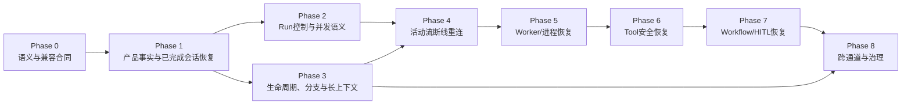

# Session分阶段交付路线

> 状态：`路线已获用户批准；Phase 0完成，Phase 1文本会话底座完成，Phase 2-8继续交付`
>
> 更新日期：2026-07-21
>
> 前置定义：[Session能力全集与目标边界](./session-capability-catalog.md)
>
> 持久化实现记录：[Session持久化设计](./session-persistence-design.md)与[审核包](./session-persistence-review.md)

## 1. 路线结论

建议把完整Session交付拆为9个阶段、53个任务：

| 阶段 | 核心结果 | 任务数 | 优先级 | 当前状态 |
|---|---|---:|---|---|
| Phase 0 | 冻结语义、框架边界和恢复验收合同 | 5 | P0 | 已完成 |
| Phase 1 | 已完成文本会话可耐久保存、重开和继续 | 8 | P0-P1 | 已完成文本会话底座 |
| Phase 2 | Run可幂等、取消、重试、Steer和排队 | 7 | P0-P2 | 进行中；P2-03的Retry/Restart窄切片完成，Resume未完成 |
| Phase 3 | 生命周期、分支、长上下文和可移植性完整 | 7 | P1-P2 | 未开始 |
| Phase 4 | 浏览器断线、刷新和换设备可接回活动Run | 6 | P2-P3 | 未开始 |
| Phase 5 | API/Worker退出后可安全接管或明确收敛 | 5 | P3 | 未开始 |
| Phase 6 | 工具副作用可记录、对账和安全恢复 | 5 | P3 | 未开始 |
| Phase 7 | Workflow与HITL可跨重启和Worker恢复 | 5 | P3 | 未开始 |
| Phase 8 | 跨通道、投递、分享、治理和全链路验收 | 5 | P3 | 未开始 |

这9个阶段覆盖能力全集中的全部74项。阶段只决定交付顺序；任何目标能力都没有被“以后再说”从规划中删除。

### 1.1 Phase 1已交付证据

1. SQLite Product Store由3个Alembic迁移建立，应用启动只对耐久数据库执行`upgrade head`；内存测试库才使用Metadata建表。
2. Product Session、Product Message、Interaction、Product Run、Run Attempt、AG-UI ID映射和公开Trace分别建模；Product Session ID与AG-UI Thread ID同值但职责不合并。
3. AG-UI入口校验客户端历史前缀，只接纳1条新User；随后由Product Store重新装配本轮完整消息，当前审批Workflow的确定性Executor据此生成唯一Provider请求，不再叠加浏览器或Provider历史。
4. User/Interaction/Run/Attempt先提交；Assistant与成功Run先提交，再放行MAF/AG-UI成功终态。失败、结果未知、取消、放弃和重启中断不产生假成功。
5. 前端提供Session列表、创建、打开、REST消息恢复、标题/归档、Provider/模型默认配置、Run状态和Attempt摘要。
6. 自动测试覆盖迁移升降级、重启恢复、并发唯一接纳、历史防篡改、runId终态重放拒绝、双轮历史不重复和模型审批交叉路径；真实浏览器完成双轮模型、刷新恢复、Provider切换与放弃回归。

当前边界仍是R0/R1：没有活动事件游标、后台Job、Worker Lease、Tool Ledger、Workflow持久Checkpoint或跨重启Approval。Phase 2-8状态不能因为Phase 1通过而提前标记完成。

## 2. 为什么这样分

### 2.1 依赖顺序

### 2.2 8条拆分理由

1. **先有产品事实，再有运行投影**：没有稳定Session、Message、Interaction和Product Run，事件流、Checkpoint和恢复都找不到权威归属。
2. **先恢复已完成会话，再恢复活动运行**：R0/R1只依赖产品事实；R2还需要活动Job和事件游标，技术成本与故障面不同。
3. **先定义Run控制，再做重连**：取消、重试、Steer和Follow-up若没有稳定语义，重连后客户端不知道自己接回的是哪个动作。
4. **树兼容在Phase 1数据模型中建立，产品分支在Phase 3交付**：Phase 1不能锁死为线性数据，同时先完成其明确承诺的保存与恢复保证。
5. **浏览器断线与Worker故障分开**：前者执行仍活着，只需再订阅；后者必须判断接管、新Attempt、人工重试或结果未知。
6. **纯模型恢复先于工具恢复**：模型重试主要损失时间和费用；工具可能产生不可逆外部副作用，必须先具备Attempt、Lease和安全点语义。
7. **工具账本先于Workflow/HITL**：Checkpoint只能恢复控制流，不能证明外部工具是否执行；没有Tool Execution/Evidence就可能重复副作用。
8. **Chat内部事实和恢复语义稳定后再启用跨入口连续性**：否则Web/API Adapter、具体Channel Adapter和OPC-OS Bridge会各自形成Session、重试和投递事实源。

### 2.3 考虑过的其他拆法

| 选择 | 优点 | 缺点 | 参考项目关系 | 结论 |
|---|---|---|---|---|
| A. 只做历史持久化，做到哪再规划到哪 | 最快开始写表和CRUD | 看不到分支、Run、断线、Tool和HITL对目标模型的约束，返工概率最高 | 只使用了4个参考项目的一小部分 | 拒绝；正是本次要纠正的问题 |
| B. 一次详细设计并实现全部74项 | 全局看起来最完整 | 需求、框架版本、Worker和工具风险同时展开，无法形成小而可信的验收门 | 没有参考项目一次覆盖全部能力 | 拒绝；总体规划完整不等于一次开发完成 |
| C. 先做分支、搜索等前端产品功能，再补Run和恢复 | 用户可较早看到丰富UI | Message提交门、活动Leaf、并发和旧Run抢写未稳定时，分支会放大错误 | L提供产品例证，但其运行边界不能直接复制 | 不建议；树兼容先预留，交互放Phase 3 |
| D. 直接复制LibreChat的Conversation + Generation Job结构 | Web断线续传有成熟参考 | Node/Mongo/Redis不匹配；Generation Job成功后可删除，缺少本项目持久Product Run | L直接涉及Web续传，不涉及MAF | 拒绝复制；只采用分层和终态原则 |
| E. 把MAF AgentSession、Workflow Checkpoint和AG-UI Snapshot当统一Session Store | 框架接入代码可能更少 | 不提供产品列表/权限/审计；Snapshot fail-soft；Checkpoint和Message生命周期不同 | M明确提供不同机制而非统一产品库 | 拒绝；维持不同所有者和显式映射 |
| F. 本路线：完整目标先冻结，再按恢复等级逐层实现 | 依赖清楚、每层可验收、前置阶段不锁死后续 | 审核门更多；活动流、Worker和HITL按依赖在不同阶段启用 | 综合M/P/N/L各自最强部分 | 建议 |

### 2.4 当前建议的代价

本路线不是零代价选择：

1. 需要维护Product Run、Attempt/Runtime Job、MAF Checkpoint和AG-UI投影之间的显式映射，概念和测试数量更多。
2. 浏览器断线续传在Phase 4兑现，Worker恢复在Phase 5兑现，完整HITL在Phase 7兑现；Phase 1只承诺R0/R1。
3. 每升级MAF/AG-UI都要重跑关键合同，尤其是History、终态、Snapshot和interrupt/resume。
4. 跨入口交付依赖更多前置能力，但换来的是外部系统复用稳定Session事实，而不是多个入口各自补丁式对账。

仍建议采用，因为这些成本来自问题本身；省略对象或合并恢复层级只会把成本转化为丢输入、假成功、重复副作用和后期迁移。

## 3. 优先级与验收原则

每个任务都按4项排序：

1. **正确性风险**：会不会丢输入、重复副作用、越权或假成功。
2. **依赖中心性**：有多少后续能力依赖它。
3. **用户价值**：是否直接改善连续会话、控制感和可恢复性。
4. **实现不确定性**：MAF/AG-UI当前版本是否已有经过验证的合同。

每个阶段必须同时满足：

1. 成功、失败、取消、重复请求和重启反例有自动化证据。
2. 真实MAF/真实模型或真实Workflow证据不能全部被Mock替代。
3. 浏览器场景不能只靠API测试宣称完成。
4. 阶段完成只代表该级恢复保证成立，不能外推到后续级别。

## 4. Phase 0：语义、兼容性与详细设计门

### 4.1 阶段目标

把“Session、恢复、成功、重试、Checkpoint”变成可测试合同，并在写Schema和业务代码前确认当前安装版MAF/AG-UI真正能承担什么。

### 4.2 任务

| ID | 依赖 | 任务方案 | 任务目标 | 参考依据 |
|---|---|---|---|---|
| P0-01 | 用户批准本路线 | 审核并冻结74项能力、R0-R6恢复层级、对象责任和明确非目标；变更需重新审核 | 防止用某一交付阶段尚未启用掩盖总体能力缺口 | 4个参考项目的联合结论 |
| P0-02 | P0-01 | 把当前安装版MAF的AgentSession、HistoryProvider、per-service历史、Workflow Checkpoint、AG-UI Snapshot和interrupt/resume做成兼容性合同清单 | 区分框架已支持、当前适配可用和本项目仍需桥接的部分 | MAF源码、安装包和现有Spike |
| P0-03 | P0-01、P0-02 | 将现有D1-D6重审为Phase 1的持久化子设计，补上树兼容、Attempt演进和Checkpoint关联约束 | 只在总体目标下选择Phase 1实现，不让子设计反向锁死路线 | MAF、pi、nanobot、LibreChat |
| P0-04 | P0-01 | 建立故障与恢复验收矩阵：浏览器断连、重复提交、模型错、API退出、Worker退出、工具未知、Checkpoint不兼容、审批过期 | 每个“恢复”承诺都有明确前态、动作、后态和禁止结果 | N、L、M，O补全 |
| P0-05 | P0-03、P0-04 | 定义版本演进原则：产品记录、AG-UI事件、MAF Session和Workflow Checkpoint分别版本化与迁移 | 后续升级框架或数据结构时能检测不兼容，而不是静默损坏 | P、M、O |

### 4.3 为什么现在做

MAF核心Workflow确实支持持久Checkpoint和跨进程恢复，但当前`agent-framework-ag-ui 1.0.0rc8`主要用Thread Snapshot维持AG-UI消息、State与Interrupt。两者的持久关联尚未成为本项目验证过的合同。Phase 0先验证这个接合点，可以避免在Phase 7才发现前端协议和Workflow恢复无法关联。

### 4.4 完成后能保证什么

只能保证“完整目标、术语、框架边界和验收方式已经冻结”，还不能对用户承诺任何新的Session功能，也不会创建正式Schema。

## 5. Phase 1：产品事实与已完成会话恢复

### 5.1 阶段目标

完成R0和R1的基础保证：用户输入先被耐久接纳；已完成或失败的文本会话可在页面刷新、浏览器重开和后端重启后恢复；失败不产生假成功。

### 5.2 任务

| ID | 依赖 | 任务方案 | 任务目标 | 参考依据 |
|---|---|---|---|---|
| P1-01 | Phase 0 | 建立受Scope约束的Product Session最小生命周期：创建、列表、打开和归档；Web入口通过显式Channel Binding关联 | 用户拥有可发现、可授权的产品会话，而不是只拥有AG-UI `threadId` | L生命周期、N Session Key、O |
| P1-02 | P1-01 | 建立支持父子关系和类型化内容的Message记录；用户输入在模型前提交，Assistant区分流式临时态、部分、错误和最终态 | 不丢已接纳输入，并为Phase 3分支避免破坏性迁移 | N先保存、P/L消息树 |
| P1-03 | P1-01 | 分开记录Interaction、Product Agent Run和Run Attempt；定义基本状态、时间、错误、关联ID和重试血缘 | 能解释一次提交是否执行、执行了几次及最后状态 | O为主，N/L提供局部证据 |
| P1-04 | P1-02、P1-03 | 使用单一服务端历史投影接入MAF HistoryProvider；只把当前活动路径和本轮增量交给模型，模型多次调用保存独立History Checkpoint | 防止浏览器历史、Provider历史、Snapshot和Product History重复注入 | M、P、N、L |
| P1-05 | P1-02、P1-03、P1-04 | 在MAF标准AG-UI事件外加薄产品提交门：最终Assistant和Product Run提交成功后才放行成功终态 | 客户端看到成功时刷新即可读到产品结果；保存失败只能得到错误 | M事件合同、L正常终态 |
| P1-06 | P1-01、P1-02 | 页面通过产品读取路径恢复Session和Message；AG-UI只负责新Run实时交互，浏览器不拼接权威历史 | 刷新、关闭再开和后端重启后能继续会话且不重复上下文 | L、M边界、O |
| P1-07 | P1-03 | 启动时对遗留`running`做基础收敛：没有活动执行证据的Attempt标记为`interrupted`，保留用户输入与部分结果，允许显式重试 | 后端重启后不把旧Run伪装成成功，也不自动重放 | N、O |
| P1-08 | P1-01至P1-07 | 固化合同、事务、失败注入和浏览器E2E：重复历史、保存失败、模型失败、终态顺序、越权、刷新和后端重启 | 用证据证明R0/R1成立，并锁住MAF升级风险 | M测试、N/L反例 |

### 5.3 为什么放在第一实施阶段

这是其余52项开发任务的共同数据和语义底座，也是用户最早能感知的价值：输入不丢、历史可找、失败可解释、成功可刷新恢复。分支、续传和工具恢复若先做，都会重复建立自己的Session和Run事实。

### 5.4 阶段完成场景

1. 用户创建会话、发送文本、刷新页面后继续追问。
2. 用户发送消息后模型失败，输入仍存在，Run显示明确失败，可发起新Attempt。
3. 后端在回合中退出并重启，旧Run显示`interrupted`而不是成功；用户可从已提交历史继续。
4. 重复AG-UI历史不会让模型看到重复上下文。

不包含：接回仍在后台运行的流、Worker自动接管、工具恢复和HITL恢复。

## 6. Phase 2：Run正确性与交互控制

### 6.1 阶段目标

让用户能够控制一次活动Run，并让重复提交、并发、取消、重试、Steer和Follow-up有彼此不同且可恢复的语义。

### 6.2 任务

| ID | 依赖 | 任务方案 | 任务目标 | 参考依据 |
|---|---|---|---|---|
| P2-01 | Phase 1 | 为Interaction提交建立幂等键和活动Run约束；同一活动分支的普通Prompt串行，跨Session并发 | 防止双击、网络重试和普通并发产生重复回答 | P、N、L、O |
| P2-02 | P2-01 | 分开用户取消、系统超时、模型错误和连接断开；取消只影响目标Attempt并保留已提交部分结果 | 用户操作与故障原因可解释，旧Attempt不能误终结新Attempt | M、L、N |
| P2-03 | P2-01、P2-02 | 提供显式Retry、Resume和Restart选择；每次实际执行创建新Attempt并关联原失败 | 不改写失败历史，用户知道系统是在续接还是重新执行 | N、O |
| P2-04 | P2-01 | 把Steer作为活动Run的控制输入，绑定当前Attempt和接纳顺序，不伪装成普通Message | 用户能在运行中修正方向且历史可追踪 | P、L |
| P2-05 | P2-01 | 把Follow-up作为可见队列，支持查看、修改、取消和按顺序接纳 | 用户连续输入不丢失，也不会与当前模型上下文竞争 | P、N、L |
| P2-06 | P1-03 | 展示Run阶段、耗时、模型、用量、重试血缘、稳定错误码和可见Trace | 用户和运维能判断“正在做什么、为何失败、是否重试过” | M、L、O |
| P2-07 | P2-01至P2-06 | 验证双击、并发Prompt、取消与终态竞争、Steer时序、队列重启和Retry血缘 | 控制行为在竞态下仍不会重复提交或假成功 | P/N并发测试、L生成替换 |

### 6.3 为什么先于断线续传

重连只是把客户端重新接到某个活动对象。如果Run、Attempt、取消和排队语义尚不稳定，重连后无法判断用户应该看到哪次生成，也无法阻止旧连接抢写终态。

### 6.4 阶段完成场景

1. 用户双击发送或浏览器重试，只产生一次Interaction和正确数量的Attempt。
2. 用户取消当前回答、修改方向或排队下一问题，三种操作不会互相混淆。
3. 失败后用户选择Retry时看到新Attempt及其与原失败的关系。

### 6.5 当前实现进度

已完成P2-03中的显式Retry/Restart窄切片：失败、取消、中断或结果未知的Run可以发起带`retry_of_run_id`的新Run；原样Retry强制输入一致，修改后的请求记录为Restart，两者都创建独立Attempt并重新进入每次模型调用审批。失败输入仍保留为Product Message，但当前重试上下文排除整条祖先输入链，避免重复Prompt。真实浏览器已分别得到`SESSION_RETRY_OK`与`SESSION_RESTART_OK`。

尚未完成Checkpoint语义的Resume，也未完成P2-01、P2-02、P2-04至P2-07的完整Run控制与竞态验收，因此Phase 2不能标记完成。

## 7. Phase 3：完整Web会话、分支与长上下文

### 7.1 阶段目标

补齐用户长期管理和探索会话所需的产品能力：组织、搜索、树状分支、Compaction、ContextPackage、附件引用和导入导出。

### 7.2 任务

| ID | 依赖 | 任务方案 | 任务目标 | 参考依据 |
|---|---|---|---|---|
| P3-01 | Phase 1 | 完成标题、重命名、置顶、归档/恢复、标签/项目和搜索；所有查询受Scope和分页约束 | 用户能管理大量会话，而不是依赖最近打开顺序 | L |
| P3-02 | P1-02、P2-01 | 在既有Message树上实现编辑、重新生成、Sibling切换和活动Leaf恢复 | 用户探索不同回答时保留原历史和上下文 | P、L |
| P3-03 | P3-02 | 实现从任意消息Fork/Clone，并明确复制当前路径、包含Sibling或目标层级的产品选项 | 用户可安全分离任务，不复制不相关未来分支 | P、L |
| P3-04 | P1-04、P3-02 | 建立Token/消息预算、Compaction和Branch Summary；完整记录不删除，模型只读取活动路径的压缩投影 | 长会话继续可用且证据完整 | P、N |
| P3-05 | P1-03、P1-04 | 保存并展示ContextPackage、模型/Agent/工具配置快照和来源；配置变更只影响新Interaction | 用户能审核“这次为什么得到这个结果” | M、P、L、O |
| P3-06 | P1-02 | 建立附件、Artifact、Evidence的受权引用与生命周期；历史重开时校验资源仍可访问 | Message不因外部资源丢失或越权而变成不可解释占位符 | L、O |
| P3-07 | P3-01至P3-06 | 支持临时会话、过期、复制、导入及当前路径/全部分支导出，并验证树完整性和权限 | 会话可移植、可临时使用，分支不会在导入导出中静默丢失 | P、L |

### 7.3 为什么分支没有放在Phase 1

Phase 1的数据语义从一开始就必须树兼容，但产品分支操作不是“保存和重开文本会话”的前置。把交互放在Phase 3可以先验证用户输入提交、Run终态和Context唯一加载器，再增加多Leaf带来的并发、导出和上下文选择复杂度。

### 7.4 阶段完成场景

1. 用户搜索、置顶、归档和恢复历史会话。
2. 用户编辑旧问题、重新生成、切换Sibling、从任意消息Fork。
3. 超长会话经过Compaction后继续工作，原消息和分支仍完整可查。
4. 用户查看本轮ContextPackage、配置和来源，并导出当前路径或整棵树。

## 8. Phase 4：活动Run断线重连

### 8.1 阶段目标

完成R2：浏览器连接消失时，允许执行独立继续；用户刷新、断网恢复或换设备后能重新订阅同一活动Run并补齐遗漏事件。

### 8.2 任务

| ID | 依赖 | 任务方案 | 任务目标 | 参考依据 |
|---|---|---|---|---|
| P4-01 | Phase 2 | 在Product Run之外建立可替换的Runtime Job投影，记录当前Attempt、活动状态和订阅关联 | 活动生成基础设施不冒充长期Run事实 | L、O |
| P4-02 | P4-01 | 为可重放事件建立递增游标、有限保留、去重和有序合同；最终产品事实仍在Product DB | 重连可从已确认游标补齐事件而不重复应用 | P RPC游标、L |
| P4-03 | P4-01、P4-02 | 将请求连接与执行生命周期分开；只有显式取消才请求停止Attempt | 网络断连不再暗中改变Product Run状态 | L |
| P4-04 | P4-02、P4-03 | 提供活动Run状态查询、再订阅和游标续接；客户端先校验Scope和当前Attempt | 刷新或断网后接回正确Run，旧连接不能抢写 | L、M/AG-UI |
| P4-05 | P4-04 | 支持同一用户在另一设备接管显示；Job已完成/清理时回退读取Product Message和Run终态 | 用户不会因为错过实时流而丢最终结果 | L、O |
| P4-06 | P4-01至P4-05 | 注入断网、刷新、重复事件、游标过期、多标签页和Final后立即重载 | 证明断连、取消、完成和事件投影清理语义不同 | L反例、O |

### 8.3 为什么不同时承诺Worker恢复

本阶段只处理“执行仍活着、连接消失了”。如果执行进程本身已经退出，事件重放无法继续模型调用，必须进入Phase 5的Attempt所有权和安全点恢复。

### 8.4 阶段完成场景

1. 用户关闭页面后Agent继续，重新打开可接回活动回答。
2. 网络抖动产生重复或缺失事件时，客户端按游标补齐且不重复渲染。
3. 另一设备打开同一Session时，可看到活动Run或从产品库读取已完成结果。

## 9. Phase 5：API/Worker进程恢复

### 9.1 阶段目标

完成R3：活动执行所在进程退出后，系统能识别失联Attempt，并根据最后安全点选择接管、新Attempt或人工重试；不宣称第三方Token流精确续传。

### 9.2 任务

| ID | 依赖 | 任务方案 | 任务目标 | 参考依据 |
|---|---|---|---|---|
| P5-01 | Phase 4 | 为Run Attempt建立Worker所有权、Lease/Heartbeat和终态写入权；旧所有者失效后不能继续提交 | 识别真正失联并阻止双Worker抢写 | L生成所有权、O |
| P5-02 | P5-01 | 启动与周期对账失联Attempt，结合Product Run、Runtime Job和Checkpoint选择接管、创建新Attempt或人工处置 | 重启后每个活动Run都收敛到可解释状态 | N、O |
| P5-03 | P1-04、P5-01 | 把模型调用History Checkpoint与Attempt、安全点和上下文版本关联；只恢复可验证的模型上下文 | 新Worker不会把旧Run临时历史混入错误Session | M、N |
| P5-04 | P5-02、P5-03 | 定义纯模型运行恢复策略：Provider原生续接经过验证才使用；否则保留旧部分结果并按策略新建Attempt或等待用户 | 不虚构精确续流，同时提供可追踪恢复 | M部分、N、O |
| P5-05 | P5-01至P5-04 | 验证API重启、Worker强退、Lease过期、双Worker竞争、取消与接管竞态、Checkpoint损坏和版本不兼容 | 证明R3成立且不会出现双终态 | M、N、L、O |

### 9.3 为什么独立成阶段

它引入后台执行所有权和多进程一致性，是从单机Web Chat向可靠运行系统的结构性跃迁。把它和浏览器续传混在一起，会把“能补发旧事件”误当成“能继续已经死亡的计算”。

### 9.4 阶段完成场景

1. Worker退出后，用户看到系统正在接管、已创建新Attempt或需要人工重试，而不是永久卡在running。
2. 旧Worker恢复网络后也不能覆盖新Attempt的结果。
3. 模型流无法原位续接时，旧部分结果和费用诊断仍保留，新Attempt血缘清晰。

## 10. Phase 6：工具副作用安全恢复

### 10.1 阶段目标

完成R4：工具调用在进程、网络或外部系统故障后能够判断已完成、未开始或结果未知；模型只在耐久结果可用后继续。

### 10.2 任务

| ID | 依赖 | 任务方案 | 任务目标 | 参考依据 |
|---|---|---|---|---|
| P6-01 | Phase 5 | 建立独立Tool Execution生命周期，关联Session、Interaction、Run、Attempt、Tool Call和权限决策 | 工具状态不再只藏在聊天文本或模型History里 | N、M、O |
| P6-02 | P6-01 | 在调用前保存请求摘要、幂等能力和审批版本；调用后先保存结果、回执与Evidence，再允许模型继续 | 崩溃点可判断工具是否安全重试 | N、O |
| P6-03 | P6-02 | 按工具分级定义幂等键、查询/对账、补偿和人工确认策略；不声称通用Exactly-once | 外部结果未知时先对账，不重复支付、发送或删除 | N、O；参考无通用方案 |
| P6-04 | P6-01至P6-03 | 将MAF per-service History Checkpoint与Tool Execution/Evidence关联，但保持两类事实独立 | 工具循环恢复时既有合法模型上下文，也有可信外部结果 | M、N |
| P6-05 | P6-01至P6-04 | 故障注入工具调用前、外部成功后回执前、回执后模型前、取消时和对账失败时 | 证明不会盲重做，未知结果可进入人工处置 | N、O |

### 10.3 为什么在Workflow前完成

Workflow Checkpoint能告诉系统“控制流走到哪里”，但不能证明支付、发信、写文件等副作用是否成功。先建立Tool Execution/Evidence，后续恢复Workflow才有安全依据。

### 10.4 阶段完成场景

1. 外部工具已成功但Worker在保存后续回答前退出，恢复后不会重复执行。
2. 工具请求已经发出但结果未知时，系统显示对账状态并等待查询或人工处理。
3. 只读、可逆和高风险工具使用不同恢复与审批规则。

## 11. Phase 7：Workflow与HITL持久恢复

### 11.1 阶段目标

完成R5/R6：多步骤Workflow从持久Checkpoint恢复；审批和补充信息请求跨重启、跨Worker、跨设备继续，并绑定原请求版本。

### 11.2 任务

| ID | 依赖 | 任务方案 | 任务目标 | 参考依据 |
|---|---|---|---|---|
| P7-01 | Phase 6、P0-02 | 为MAF Workflow提供持久Checkpoint Store，并显式关联Product Run、Attempt、Workflow版本和安全点 | 核心Workflow状态跨进程存在且不能冒充Product Message | M |
| P7-02 | P7-01 | 验证当前AG-UI适配与MAF `checkpoint_id`的接合；在现有适配、薄桥接或经审核的框架升级中选择一种 | 前端resume真正恢复持久Workflow，而不是只恢复Thread Snapshot | M当前版本缺口、O |
| P7-03 | P7-01、P7-02 | 将Approval/Input Request作为持久产品运行事实，保存请求版本、权限、过期、Checkpoint和Interrupt映射 | 进程内Registry消失后用户仍能看到并处理原请求 | M、L |
| P7-04 | P7-03 | 实现批准、拒绝、取消、过期和修改失效；恢复前复核Scope、Workflow版本和副作用前置条件 | 旧批准不能用于已变化的请求，响应精确绑定原Interrupt | M、L、O |
| P7-05 | P7-01至P7-04 | 验证Checkpoint后强退、等待审批时重启、换Worker/设备、重复批准、过期、图版本变化和已完成Tool不重做 | 证明R5/R6成立，并锁住MAF RC升级风险 | M、L、N、O |

### 11.3 为什么不能只打开AG-UI Snapshot Store

Snapshot只保存可重放的消息、共享State和Interrupt投影，且当前保存失败是fail-soft。它不能证明Workflow Checkpoint、Tool Evidence或Product Run已经提交。Phase 7必须把三者分别持久化、映射和验收。

### 11.4 阶段完成场景

1. Workflow完成若干节点后进程退出，新Worker从兼容Checkpoint继续，已完成工具不重复。
2. 用户隔天、换设备或服务重启后仍能批准、拒绝或补充信息。
3. 请求内容或权限已经变化时，旧批准自动失效并要求重新审核。

## 12. Phase 8：跨入口连续性、投递与治理闭环

### 12.1 阶段目标

让Chat通过具体Channel Adapter接入终端平台、通过独立Bridge Adapter与OPC-OS Chat互操作，并补齐跨入口投递、长期领域引用、分享、删除、审计和运维闭环。外部集成不改变Chat的独立产品身份和事实源责任。

### 12.2 任务

| ID | 依赖 | 任务方案 | 任务目标 | 参考依据 |
|---|---|---|---|---|
| P8-01 | Phase 3、Phase 7 | 建立Session到Memory、Intent、WorkItem、TaskPlan、Evidence和Delivery的版本化引用与ContextPackage装配边界 | 跨会话长期协作不把其他领域对象塞回Message JSON | N部分、O |
| P8-02 | P1-01、P8-01 | 完成外部入口Channel Binding、来源身份、能力声明和权限撤销传播 | Web与OPC-OS Chat等入口可授权继续同一Product Session | N、O；参考未完整覆盖 |
| P8-03 | P8-02 | 建立入站去重与出站Outbox/回执；Product Run成功和通道投递成功分别记录 | 通道重投不重复执行，投递失败可安全重试 | N缺口、O |
| P8-04 | Phase 3、P8-02 | 完成分享快照、权限/过期、保留、删除级联、附件和Checkpoint清理，以及可移植导入导出 | 用户数据生命周期覆盖产品事实和全部运行投影 | L、O |
| P8-05 | P8-01至P8-04 | 建立审计、卡死检测、人工恢复、容量/积压指标，并跑通18个最终用户场景和多通道故障矩阵 | Session全集有可运营、可审核、可恢复的完成证据 | M、N、L、O |

### 12.3 为什么外部入口集成依赖这些前置能力

跨入口会放大重复输入、身份映射、并发、投递失败和权限撤销问题。只有Chat内部的Session、Run、恢复、工具和交付事实稳定后，外部系统才能通过合同复用这些事实，而不是建立另一套会话状态。

### 12.4 阶段完成场景

1. 用户从Web开始任务，经授权后通过Telegram等具体Channel Adapter，或通过OPC-OS Bridge继续同一Session和WorkItem。
2. 入站重投不会重复执行；出站失败不影响已提交产品结果，并可凭Outbox重试。
3. 分享、过期或删除会话时，分支、附件、运行投影、Checkpoint和权限按一致规则处理。
4. 运维能识别卡死Run、过期Approval、投递积压和恢复失败，并进行有审计的人工处置。

## 13. 74项能力到阶段的完整映射

| 能力域 | 首次建立 | 完整交付 | 说明 |
|---|---|---|---|
| A1-A6 身份与边界 | Phase 0-1 | Phase 8 | Phase 0-1固定对象边界，跨入口时补全Binding与撤销 |
| B1-B10 生命周期 | Phase 1 | Phase 8 | 基础创建/列表/打开先做；组织、临时、分享和级联随后补全 |
| C1-C9 消息与分支 | Phase 1 | Phase 3 | Phase 1数据模型支持树关系，Phase 3开放完整分支操作 |
| D1-D8 历史与Context | Phase 1 | Phase 8 | History与预算先做，ContextPackage和长期领域引用逐步补全 |
| E1-E10 Run与控制 | Phase 1 | Phase 2 | Phase 1建立事实，Phase 2完成用户控制和竞态语义 |
| F1-F6 实时连续性 | Phase 1 | Phase 4 | 标准AG-UI先保留，持久重放和跨设备在Phase 4完成 |
| G1-G12 运行与HITL恢复 | Phase 1 | Phase 7 | 启动收敛先做，Worker、Tool、Workflow和HITL逐级增强 |
| H1-H6 跨入口与投递 | Phase 1建立内部关联 | Phase 8 | Phase 8完成外部Binding、合同与回执 |
| I1-I7 治理与质量 | Phase 0-1 | Phase 8 | 版本和测试贯穿各阶段，运营治理随能力补全 |

不存在没有归属阶段的能力。详细设计时允许把同一阶段内的任务继续拆小，但删除、降级或跨阶段提前高风险能力必须说明对依赖和最终场景的影响，并重新提交用户审核。

## 14. 每阶段最终能满足的用户场景

| 完成到 | 用户新增得到什么 | 仍明确不保证什么 |
|---|---|---|
| Phase 0 | 无新增产品功能；得到可审计目标与实现边界 | 所有运行能力 |
| Phase 1 | 保存、重开、继续已完成文本会话；失败输入不丢；重启后明确中断 | 活动流重连、自动接管、工具恢复 |
| Phase 2 | 幂等发送、取消、重试、Steer、Follow-up和Run进度 | 浏览器断开后接回活动流 |
| Phase 3 | 搜索/归档/临时、编辑/重生成/分支/Fork、长上下文、导入导出 | 后台运行跨连接与跨进程恢复 |
| Phase 4 | 断网、刷新、换设备后接回仍在运行的Run | 执行进程死亡后的接管 |
| Phase 5 | Worker死亡后安全接管、新Attempt或人工收敛 | 外部副作用自动安全恢复 |
| Phase 6 | Tool已完成不盲重做，未知结果先对账 | 多步骤Workflow与长时间HITL恢复 |
| Phase 7 | Workflow和审批跨重启、Worker、设备继续 | 跨通道投递与完整治理 |
| Phase 8 | 跨通道连续协作、可靠投递、分享/删除/审计/运维闭环 | 明确非目标仍不承诺 |

## 15. 路线审核结果

2026-07-21，用户要求按既有Session规划继续开发，确认9个阶段、53个任务、依赖顺序和每阶段明确不保证项。Phase 0和Phase 1文本底座已经落地；后续实现仍需逐阶段更新本表、测试证据和恢复保证，不能用本次批准一次性外推全部字段和技术细节。
