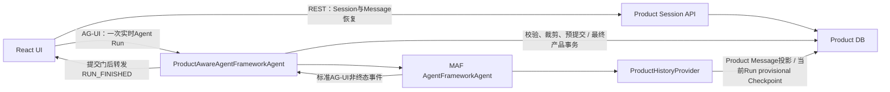

# Session持久化候选设计

> 状态：`Phase 1文本会话底座已实现；本文同时保留批准前设计与实现差异`
>
> 更新日期：2026-07-21
>
> 适用版本：`agent-framework-core 1.11.0`、`agent-framework-openai 1.10.1`、`agent-framework-ag-ui 1.0.0rc8`、`@ag-ui/client 0.0.57`

本文把[研究与方案推导](./session-persistence-research.md)收敛成首个文本会话底座设计。2026-07-21用户要求按既有规划开发，D1-D6随之获批；Phase 1实现已经建立迁移、Application Service、MAF/AG-UI提交门和前端恢复入口。完整Session目标仍由[能力全集](./session-capability-catalog.md)和[交付路线](./session-delivery-roadmap.md)拥有。

### 0.1 实现落点与设计适配

1. `backend/app/product_sessions/`保存Product Store模型、事务服务和MAF AG-UI薄包装器；SQLite耐久库启动时执行Alembic迁移。
2. 当前模型路径是审批Workflow，不是普通MAF Agent自动模型循环。历史唯一装配器因此落在`ProductSessionService.prepare_agui_run()`；确定性Executor接收装配后的Workflow消息并编译最终Provider请求。
3. `ProductHistoryProvider`保留为“普通MAF Agent直接调用模型”时的唯一方案；与当前Workflow装配器不能同时加载。同一Provider调用仍强制`store=False`、无Continuation、无自动Tool循环。
4. 已实现Product Session、Message、Interaction、Run、Attempt、协议ID映射和Trace；没有为尚不存在的第二次Provider调用创建provisional history checkpoint，也没有把内存Approval冒充为持久HITL。
5. 当前兑现R0/R1文本会话恢复，不兑现活动流、Worker、Tool和Workflow/HITL恢复。

## 1. 候选结论

作为路线Phase 1的持久化子设计，当前建议采用以下组合：

1. **一个Product DB是唯一产品事实源**：保存Product Session、Message、Interaction、Agent Run、运行Checkpoint和Trace；不启用持久化AG-UI Snapshot Store。
2. **页面恢复走REST**：先从Product DB加载Session和Message，再恢复前端投影；刷新页面不通过AG-UI发起“空运行”。
3. **`ProductHistoryProvider`是唯一模型历史加载器**：新Run加载已提交且可进入上下文的Product Message；同一活动Run的后续模型调用才额外加载该Run的Checkpoint。显式`store=False`并启用`require_per_service_call_history_persistence=True`；浏览器、Provider托管历史和AG-UI Snapshot不再加载同一份历史。
4. **薄包装器而非新协议**：`ProductAwareAgentFrameworkAgent`只做Scope、输入、幂等、并发、产品事务和终态门；Agent到AG-UI事件的转换继续交给MAF。
5. **先接纳、后调用模型**：用户Message、Interaction和Agent Run先在一个短事务中提交；模型失败也不会丢掉用户已经提交的输入。
6. **Checkpoint不等于成功**：每次模型服务调用后的历史Checkpoint、最终Assistant Message提交、Product Run成功和AG-UI `RUN_FINISHED`是4个不同事实。
7. **成功终态有提交门**：模型完成Checkpoint只提供候选结果；包装器观察并暂扣MAF `RUN_FINISHED`后还必须核验它属于当前Run、没有interrupt outcome或待处理Interrupt。外层产品事务写最终Assistant Message并把Product Run改为`succeeded`后，才转发该终态。
8. **一个Session最多一个活动Agent Run**：相同请求幂等，冲突请求拒绝；Phase 1不做队列、分支、断线续传或自动重跑。

这组选择的核心目的不是“多存一份聊天记录”，而是同时保证：历史不重复注入、刷新和重启可恢复、失败不产生假成功、身份与授权不混用、未来工具循环有正确的持久化位置。

## 2. 已验证事实与设计推导

### 2.1 MAF当前版本事实

以下结论已在当前安装版本的源码或运行Spike中验证：

1. MAF原生提供`HistoryProvider.before_run()`和`after_run()`扩展点；同一次模型调用只能有一个`load_messages=True`的历史Provider。
2. 启用`require_per_service_call_history_persistence=True`后，HistoryProvider围绕**每次模型服务调用**加载和保存历史，而不是只在整个工具循环结束时保存一次。
3. 同时显式`store=False`时，模型上下文由本地HistoryProvider恢复；MAF抑制本地续接路径上的Provider Response ID，避免它被误当成产品Thread身份。
4. 当前AG-UI适配器每个请求创建新的`AgentSession(session_id=thread_id)`；不额外持久化和恢复时，它不是跨进程产品Session。
5. 当前`@ag-ui/client`会把前端已有的完整消息数组再次发送。若后端同时让HistoryProvider加载相同历史，实测模型输入会从`q1,a1,q2`变成重复的`q1,a1,q1,a1,q2`。
6. 经过输入裁剪后，实测第二轮模型只收到数据库历史`q1,a1`和当前增量`q2`。
7. 正常文本运行的实测顺序是：HistoryProvider加载 -> `RUN_STARTED` -> 文本流 -> HistoryProvider提交本次模型调用的History/Checkpoint -> `TEXT_MESSAGE_END` -> `MESSAGES_SNAPSHOT` -> `RUN_FINISHED`。
8. HistoryProvider保存抛错时，实测只得到`RUN_STARTED`、文本事件和`RUN_ERROR`，不会出现`TEXT_MESSAGE_END`、`MESSAGES_SNAPSHOT`或`RUN_FINISHED`。
9. AG-UI Snapshot保存是fail-soft：其内部保存失败仍可能继续发送`RUN_FINISHED`。因此Snapshot不能承担产品提交门。
10. 当前rc8的`agent_framework_ag_ui/_run_common.py:431-449`显示：普通`RUN_FINISHED`通常没有`outcome`；`outcome.type == "interrupt"`时才携带interrupts。因此成功门检查“无interrupt outcome/无pending interrupt”，而不是等待一个不存在的`success`枚举。

当前事件序列中的文本事件和`MESSAGES_SNAPSHOT`都早于外层产品终态事务。即使Phase 1关闭持久Snapshot Store，这些客户端事件也只是本次连接上的provisional投影，不是Product Message提交证明。

第7、8项只证明当前锁定版本的顺序，不是永远不变的框架保证；升级MAF后必须重跑合同测试。

这些结果目前来自本轮一次性Spike，还没有全部固化为当前仓库的回归测试。它们只能支撑设计审核，不能支撑“实现已经完成”；首批实现必须先把双历史、事件顺序、保存异常、per-service工具循环和Response ID行为固化为repo合同测试。

### 2.2 pi、nanobot和LibreChat提供的边界

| 来源 | 采用 | 调整后采用 | 不采用 |
|---|---|---|---|
| pi | 完整Session记录与本轮模型Context分离；同Session活动运行时拒绝第二个普通Prompt | 把其追加式、版本化思想放入关系数据库和显式状态机 | JSONL权威库、Phase 1树分支/压缩/扩展条目 |
| nanobot | 用户输入先保存；同Session串行；历史存储与合法Replay分开；崩溃后不盲目重跑 | 用数据库事务、Checkpoint和中断状态替代整文件原子替换 | 文件存储、只靠进程锁、Phase 1复制完整工具恢复机制 |
| LibreChat | Product Conversation/Message与活动流投影分开；正常完成先保存产品消息再发终态；稳定身份必须和用户/租户Scope一起校验 | 用SQLite与持久Product Agent Run替代MongoDB、Redis和短命Generation Job | ID混用、Redis Chunk作为产品历史、无持久Run、用户保存失败后仍继续、Abort路径先发终态再保存 |

LibreChat不使用MAF或AG-UI，不能决定HistoryProvider、Snapshot Store或`RUN_FINISHED`的框架行为；它只补充Web Chat产品层的成功顺序、流式投影和故障经验。外部产品参考当前只有LibreChat，不增加第二个项目。

## 3. 对象与ID边界

| 对象 | 所有者 | Phase 1候选映射 | 不能承担的职责 |
|---|---|---|---|
| Product Session | Product DB | 服务端UUID；同值传给AG-UI作为`threadId` | 不能仅凭ID授权；不等于MAF Session或Checkpoint |
| AG-UI Thread | 协议层 | `threadId == Product Session.id`，只是降低Phase 1映射成本 | 不是数据库、用户身份或Provider会话 |
| MAF `AgentSession` | MAF运行时 | 每次请求创建，`session_id=threadId`；Phase 1不单独持久化 | 不是Product Session；`service_session_id`不保存授权关系 |
| MAF Workflow Checkpoint | MAF Workflow运行时 | Phase 1文本回合不启用；由后续对应交付阶段使用独立Store、版本和恢复规则 | 不等于Agent Run成功，也不等于Message历史 |
| Product Agent Run | Product DB | 服务端独立UUID；记录一次执行生命周期 | 不等于Interaction、AG-UI `runId`或Provider Response ID |
| AG-UI Run | 协议层 | 保留请求中的`runId`，映射到Product Agent Run | 不直接作为数据库主键或重试依据 |
| Product Message / AG-UI Message | Product DB / 协议层 | 服务端Message UUID与`agui_message_id`显式映射；最终Assistant复用流中的AG-UI Message ID作相关性 | 客户端Message ID不是Product主键或授权；即使Phase 1同值也不是长期不变量 |
| Provider Response ID | 模型Provider | `store=False`和per-service路径不依赖它；若可用只作脱敏诊断字段 | 不能替代Product Session、Thread或Run |

Phase 1允许Product Session ID与AG-UI `threadId`同值，但代码、类型、Repository和权限检查仍要分别命名。Product Agent Run ID、AG-UI `runId`和Provider ID始终分字段保存，不建立“三者必须同值”的不变量。

Interaction仍是独立产品对象：它表达一次用户提交，可产生0到多个Agent Run。Phase 1的交互路径通常是1:1，显式重试时新Run通过`retry_of`关联原Run，而不是改写旧Run。

## 4. 候选架构



Phase 1**不配置持久化`AGUIThreadSnapshotStore`**。MAF仍可产生本次实时运行需要的标准AG-UI事件，但服务端不把Thread Snapshot当恢复源。对应交付阶段启用Shared State、Interrupt/HITL或后台可续传运行时，新增独立、可重建的运行投影Store；届时需另行审核，不反向改变Product DB的权威地位。

### 4.1 组件职责

| 组件 | 只负责什么 | 明确不负责什么 |
|---|---|---|
| Product Session API | 创建、列表、详情、Message读取、归档和状态查询 | 不启动模型；不拼装AG-UI事件 |
| `ProductAwareAgentFrameworkAgent` | Scope校验、前端历史校验与delta裁剪、幂等、活动Run约束、预提交、事件终态门和错误映射 | 不重写MAF工具循环；不定义第二套流协议；不拥有模型历史算法 |
| 服务端`RunContext` | 在接纳后把可信`scope_id/product_session_id/product_run_id/current_user_message_id/history_cutoff_revision`绑定到当前异步请求作用域 | 不从客户端`runId`、`threadId`或MAF `session_id`反推Product Run；请求结束必须清理 |
| `ProductHistoryProvider` | 新Run从Product Message投影可信上下文；活动Run后续调用额外加载本Run Checkpoint；每次服务调用后持久化绑定当前Run的provisional Checkpoint | 不负责HTTP授权；不让历史Run Checkpoint进入新Run；不直接创建Product Assistant Message或把Run标成成功；不保存浏览器Snapshot |
| Product Application Service | 领域状态转换、事务、CAS、恢复对账和Repository合同 | 不把ORM对象泄漏给路由、MAF或前端 |
| Product DB | Product Session、Message、Interaction、Agent Run、Checkpoint和Trace权威事实 | 不保存密钥、隐藏推理、完整原始Provider响应 |
| 前端 | REST恢复产品历史；消费标准AG-UI流并展示运行投影 | 不拥有权威历史；不决定Run是否成功 |

## 5. MAF配置合同

候选配置必须同时满足5条：

1. Agent只注册一个`load_messages=True`的`ProductHistoryProvider`。
2. Agent显式设置`default_options={"store": False}`，不依赖OpenAI Client当前默认值。
3. Agent设置`require_per_service_call_history_persistence=True`，让工具循环中的每次模型服务调用都通过同一Provider加载和Checkpoint。
4. AG-UI端点不配置持久Snapshot Store；`ProductAwareAgentFrameworkAgent`以MAF公开包装/继承入口委托原`AgentFrameworkAgent`，不复制内部事件转换代码。
5. `ProductHistoryProvider`必须从服务端RunContext取得Product Run身份；缺失、已清理或映射不一致时立即失败，不能只凭客户端`runId`或MAF `session_id`猜测Checkpoint归属。

当前仓库的无密钥`BootstrapAgent`没有配置HistoryProvider，现有代码也只把它定位为MAF/AG-UI传输验证。它不能产生per-service Checkpoint或证明Session恢复、历史去重和严格终态。第一实施切片必须使用provider-backed正式Agent，或专门配置同一`ProductHistoryProvider`合同的测试Agent完成D3/D4纵向验证；除非另行适配，Bootstrap成功不能计入Session验收。

选择per-service模式有两个原因：

1. 当前纯文本回合中，它让最终候选的History/Checkpoint保存发生在`RUN_FINISHED`之前，保存异常能沿MAF错误路径变成`RUN_ERROR`；产品结果仍由外层终态事务提交。
2. 未来出现工具循环时，它不会等整个循环结束才记录历史；每次真实送到模型并得到的响应都有独立Checkpoint，避免本地历史记录了Provider并未见过的合成结果。

代价是每次模型服务调用都有数据库读写，Provider必须按`run_id + service_call_index + payload_hash`幂等，而且MAF升级后必须重新验证调用次数、顺序和错误传播。

### 5.1 RunContext传递合同

候选实现用显式请求作用域对象配合`ContextVar`传递可信Run身份：

1. 薄包装器完成接纳事务后，从数据库结果构造不可变RunContext，不接收前端伪造的Product Run ID。
2. 调用MAF前用ContextVar token绑定；Provider每次`before_run/after_run`都读取并交叉校验Session、Run和Scope。
3. `finally`中必须用token恢复/清理ContextVar，异常、取消和断线路径也不例外。
4. 并发的不同Session/Run不得看到彼此Context；同Run派生的异步任务是否继承Context必须由明确合同决定。
5. 这是本项目适配设计，不是MAF自动提供的产品Run绑定。正式实现前先做隔离Spike，再固化并发、嵌套调用、取消和清理测试。

## 6. 输入合同：浏览器历史只用于校验，不用于加载

当前`@ag-ui/client`会发送完整消息数组。后端不能直接把它交给MAF，也不能完全忽略其中的并发信息。候选入口流程如下：

1. 从服务端可信身份解析`scope_id`，用`scope_id + threadId`读取Product Session；请求体中的ID不构成授权。
2. 校验Session存在、未归档，并校验请求携带的`expected_session_revision`。
3. 读取该Session当前Product Message前缀，按服务端Message ID与`agui_message_id`映射、角色、顺序和内容Hash核对客户端重叠部分。
4. 已存在的User、Assistant和Tool消息一律以数据库版本为准；客户端不能修改、删除或插入历史Assistant/Tool消息。
5. Phase 1只允许一个新的User消息后缀；多条后缀、角色不合法、历史前缀不一致分别返回稳定错误，不调用模型。
6. 对`threadId + expected_revision + 新User消息规范化内容 + 有效执行参数`计算请求Hash；附件和工具配置进入Hash，但密钥不进入。
7. 通过接纳事务后，只把这个**新User delta**传给MAF；接纳事务把当前User占用的Session revision记为`history_cutoff_revision`，`ProductHistoryProvider.before_run()`只加载`revision < history_cutoff_revision`且`context_eligible=true`的Product Message，并再次按`current_user_message_id`排除当前User。

这同时解决两个风险：前端不能伪造权威历史，后端也不会把数据库历史和客户端全量历史重复送入模型。

## 7. 正常回合与事务边界

### 7.1 REST恢复

1. 前端打开Session时调用`GET /api/sessions/{session_id}`和Message读取接口。
2. 服务端按可信Scope返回Session revision、Message和非敏感Run摘要。
3. 前端用返回值恢复页面与AG-UI Client的本地投影。
4. 恢复过程不调用模型，不发送空AG-UI Run，也不依赖Snapshot Hydrate。

### 7.2 接纳事务A：先保存用户输入和Run

在任何模型调用和成功事件之前，Product Application Service执行一个短事务：

1. CAS校验Session revision、归档状态和“没有其他活动Agent Run”。
2. 校验`(scope_id, session_id, agui_run_id)`幂等键和请求Hash。
3. 追加状态为`committed`且`context_eligible=true`的User Product Message，让它占用`expected_session_revision + 1`这个明确的Message/Session revision。用户已经提交的输入不依赖Assistant成功；本Run通过`history_cutoff_revision + current_user_message_id`把它从Provider加载结果中排除，只以delta使用一次。
4. 创建Interaction。
5. 创建独立Product Agent Run，状态从`accepted`进入`running`，记录AG-UI `runId`、请求Hash、`current_user_message_id`，并把当前User的Message revision记录为`history_cutoff_revision`。
6. 把Session revision推进到同一个cutoff并提交；下一Run的cutoff会更大，因此可以正常包含本次User。

事务A失败时不调用模型。事务A成功后即使模型失败，User Message仍是产品事实；失败Run和它关联，不删除用户输入伪装成“没有发生”。

事务A返回的服务端Product Run身份随后进入请求作用域RunContext；只有这个Context可以授权`ProductHistoryProvider`为当前Run读写Checkpoint。AG-UI `runId`仍只是相关性输入。

### 7.3 MAF运行与每次服务调用Checkpoint

1. 薄包装器把裁剪后的User delta交给原MAF AG-UI适配流程。
2. 第一次模型调用时，`ProductHistoryProvider.before_run()`只加载`revision < history_cutoff_revision`且`context_eligible=true`的Product Message，并排除`current_user_message_id`；当前User由包装器delta传入。这样边界明确包含此前历史、排除当前User，没有off-by-one歧义。
3. 同一活动Run发生后续模型调用时，Provider在上述Product Message之外，只额外加载**本Run**此前的provisional Checkpoint，并按来源ID排除已由本次调用携带的内容。
4. MAF产生标准`RUN_STARTED`和文本/工具事件；包装器可立即转发非终态事件。终态事务提交前，前端看到的文本delta和`MESSAGES_SNAPSHOT`都是provisional投影。
5. 每次模型服务调用完成后，`ProductHistoryProvider.after_run()`在短事务中追加绑定当前Product Run的幂等provisional Checkpoint。
6. 若响应仍要求工具或后续服务调用，只记录Checkpoint，不把Product Agent Run标记为成功。
7. 若响应是本Run的最终候选答案，HistoryProvider只写完成Checkpoint和`completion_checkpoint_token`，并可把Run推进到`committing`；此时**没有**Product Assistant Message，Checkpoint仍只对本Run可见，其他Run不能读取。

Checkpoint表示“某次模型服务调用的输入/输出候选已经持久化”，不表示工具执行完成、工作流完成、Product Assistant Message存在、产品答案已接受或Agent Run成功。历史Run的Checkpoint默认永远不作为新Run历史；下一轮从可进入上下文的Product Message重新投影。失败Run的User Product Message仍保留且`context_eligible=true`，只有partial/provisional Assistant与失败Run Checkpoint默认不可进入下一轮。MAF Workflow Checkpoint未来也遵循同样边界。

### 7.4 终态门事务C

`ProductAwareAgentFrameworkAgent`真正观察到MAF准备发出的`RUN_FINISHED`时先暂扣该事件。事件类型只是必要条件，不是成功证明；仅有完成Checkpoint也不能证明MAF已经到达正常成功终态：

1. 读取当前Product Agent Run，核验`scope/threadId/runId`都映射到它，且它仍是Session的活动Run。
2. 核验本次事件序列没有`RUN_ERROR`、未完成Tool Call或待处理Interrupt。当前rc8的普通成功`RUN_FINISHED`通常没有`outcome`；若`outcome.type == "interrupt"`或仍有pending interrupt，就不能进入成功事务。不得虚构或依赖一个不存在的`success` outcome枚举。
3. 核验`completion_checkpoint_token`属于本Run、完成Checkpoint可规范化为最终Assistant候选且结果revision连续；不能只拼接已经发送的文本delta作为权威结果。
4. 用CAS短事务创建Product Assistant Message并映射流中的`agui_message_id`，把最终Assistant标成`context_eligible=true`，把Run从`committing/running`改为`succeeded`，更新Interaction终态、Session revision、活动Run指针和公开Trace。User在事务A中已经可进入上下文；Run Checkpoint可以封存供诊断，但不会变成下一Run的默认历史。
5. 事务C提交后，转发MAF原本的标准`RUN_FINISHED`；事件使用原请求AG-UI `runId`。
6. 回执缺失、指向旧Run、revision冲突、interrupt outcome、pending interrupt或事务C失败时，不转发成功终态。第一切片把不支持的暂停/待输入语义映射为明确非成功状态和稳定错误；未来Interrupt/HITL分别进入`suspended/awaiting_input`，绝不标记`succeeded`。

当前MAF实测已经保证HistoryProvider保存异常会中止成功事件；外层终态门仍然需要，因为它还负责核验Product Run身份、结果回执和最终CAS，而不是只判断Provider函数有没有返回。

## 8. 状态机、幂等和并发

### 8.1 Product Agent Run候选状态

```text
accepted -> running -> committing -> succeeded
                    \-> failed
                    \-> cancelled
                    \-> interrupted
```

1. `accepted`：接纳事务正在建立产品事实。
2. `running`：模型或工具循环仍在执行。
3. `committing`：最终完成Checkpoint已写入，但Product Assistant Message和成功终态尚未提交。
4. `succeeded`：产品结果与Run终态已提交，可以发送`RUN_FINISHED`。
5. `failed`：确定性错误或持久化失败；不会自动重跑。
6. `cancelled`：用户明确取消且取消已被服务端接受。
7. `interrupted`：断线、进程退出或归属丢失，无法证明正常完成。

`suspended/awaiting_input`留给未来Interrupt/HITL阶段。第一切片若遇到这类outcome，必须以稳定错误明确拒绝或记录非成功终态，不能用`succeeded`降级表达。

### 8.2 幂等规则

| 请求 | 候选行为 |
|---|---|
| 相同Scope、Session、AG-UI `runId`和请求Hash，原Run已成功 | 不调用模型；返回/重放已持久化的标准结果投影 |
| 相同幂等键和Hash，原Run仍活动 | 不创建第二条User Message或Run；返回“仍在运行”的稳定状态 |
| 相同幂等键但Hash不同 | 拒绝，`IDEMPOTENCY_CONFLICT` |
| 新`runId`，但Session已有活动Run | 拒绝，`SESSION_BUSY`；不预提交新User Message |
| 显式重试失败Run | 使用新Product Run和新AG-UI `runId`，记录`retry_of`；不改写旧Run |

幂等必须有数据库唯一约束和CAS，不只依赖进程内Lock。不同Session可以并发。

## 9. 故障矩阵

| 故障点 | 产品事实 | 对前端 | 恢复与重试 |
|---|---|---|---|
| Scope、revision或输入校验失败 | 无新Message、Interaction或Run | 稳定4xx或`RUN_ERROR` | 修正请求后重新提交 |
| 接纳事务A失败 | 无半写User/Run | 不启动模型；脱敏持久化错误 | 不自动重试模型 |
| HistoryProvider加载失败 | User与Run已存在；Run=`failed`或由启动对账收敛 | `RUN_ERROR`，无成功终态 | 用户显式重试 |
| 模型超时/Provider错误 | 保留且继续允许投影User；Run=`failed`；无完整Assistant Message | `RUN_ERROR` | 不自动重放外部调用 |
| 流式中途错误 | 可best-effort保存`partial` Assistant；它不进入默认模型上下文 | 显示部分输出和失败 | 显式新Run重试 |
| 每次服务调用Checkpoint写失败 | Provider异常向外传播；Run不能成功 | 实测路径为`RUN_ERROR`，无`RUN_FINISHED` | 修复存储后显式重试 |
| 最终完成Checkpoint写失败 | 无Product Assistant结果；Run=`failed`或待对账 | `RUN_ERROR`，无成功终态 | 不把已显示delta当产品事实 |
| MAF产生`RUN_FINISHED`但缺少本Run回执 | Run不能转为`succeeded` | 暂扣成功，改发`PERSISTENCE_COMMIT_FAILED` | 启动对账，不自动调用模型 |
| `RUN_FINISHED`携带`outcome.type=interrupt`或存在pending interrupt | 不创建成功Assistant或成功Run | 第一切片返回稳定的非成功错误/状态 | 未来映射`suspended/awaiting_input`并走专门resume，不得伪装成功 |
| 终态门事务C写入失败 | 不创建半写Assistant或成功Run；User仍保留 | 暂扣成功并发送`RUN_ERROR` | 状态收敛为`failed/interrupted`，用户显式重试 |
| 客户端已经看到文本/`MESSAGES_SNAPSHOT`，随后事务C失败 | 这些事件仍是provisional；Product DB没有完整Assistant或成功Run | 随后收到`RUN_ERROR` | 刷新后以REST Product Message为准，不把协议投影补写成成功 |
| 完成Checkpoint后、事务C提交前进程崩溃 | 即使包装器已在内存观察到终态，也只有provisional Checkpoint和完成token，没有Product Assistant，Run=`committing/running` | 客户端没收到成功终态 | 启动时收敛为`interrupted`；保留可审查候选但默认不进历史，不自动成功也不重跑 |
| 事务C后、客户端收到终态前断线 | Run与Assistant均已成功 | 本连接看不到终态 | REST刷新显示成功结果 |
| 模型运行中进程崩溃 | User存在，Run遗留`running` | 连接中断 | 启动reaper改为`interrupted`，不自动重跑 |
| 浏览器断线/取消 | 若成功已提交则保持成功；否则`cancelled/interrupted` | Phase 1不续传旧SSE | 通过REST查询后决定是否显式重试 |
| 同Session第二个请求 | 第一条Run不受影响；第二条不写入 | `SESSION_BUSY` | 前一Run终态后再提交 |
| 意外返回真实Provider Conversation ID | 不改变Product/Thread ID；Run失败 | 配置/Provider协议错误 | 合同测试与人工修复，不静默切换ID |

Phase 1不启用LibreChat式的后台Generation Job和Redis可续传流：浏览器断线不等于服务端可恢复生成。目标架构已经定义“持久Product Run + 活动Job + Event Journal”的位置；到对应交付阶段必须按该合同实现，不能用AG-UI Snapshot或Redis Chunk替代产品历史。

## 10. 候选逻辑记录

以下只是审核用逻辑模型，不是DDL、ORM类或已批准字段。

| 逻辑记录 | 候选关键字段 | 所有权与不变量 |
|---|---|---|
| `sessions` | `id`、`scope_id`、`status`、`title`、`revision`、`active_run_id`、创建/更新时间、归档时间 | 产品权威；Scope内ID唯一；归档后拒绝新Run；revision只单调增加 |
| `messages` | 服务端`id`、`agui_message_id`、`session_id`、`interaction_id`、`run_id`、`revision`、`ordinal`、`role`、版本化内容负载、`delivery_state`、`context_eligible`、时间 | 产品可见历史权威；每条正常Message占用递增revision并追加；Session内ordinal和AG-UI Message映射唯一；只有明确可进入上下文的Product Message供新Run加载 |
| `interactions` | `id`、`session_id`、`user_message_id`、状态、创建/完成时间 | 一次用户提交；可以关联多个Run；Phase 1交互路径通常1:1 |
| `agent_runs` | `id`、`session_id`、`interaction_id`、`agui_run_id`、`request_hash`、`current_user_message_id`、`history_cutoff_revision`、状态、`result_message_id`、`completion_checkpoint_token`、`retry_of`、稳定错误码、Provider/模型摘要、时间 | 一次执行的权威生命周期；cutoff等于当前User占用的revision，新Run只加载更小revision；幂等键唯一；同Session最多一个活动Run；Provider ID不作为主键 |
| `run_checkpoints` | `id`、`run_id`、`service_call_index`、`payload_hash`、版本化MAF历史负载、`checkpoint_kind`、`visibility`、提交时间 | Product Message之外的应用托管运行Checkpoint；provisional只对所属活动Run可见；历史Run默认不进入新Run上下文；同Run序号幂等；不等于Run成功或Workflow Checkpoint |
| `trace_events` | `run_id`、序号、公开事件类型、脱敏负载、时间 | 追加式公开Trace；不保存隐藏推理、密钥或完整原始Provider响应 |

需要通过数据库约束表达的候选不变量：

1. `(scope_id, session_id, agui_run_id)`幂等唯一。
2. 每个Session只有1个`accepted/running/committing` Run。
3. `(session_id, revision)`、`(session_id, ordinal)`与`(session_id, agui_message_id)`唯一且单调；客户端Message ID不构成授权。
4. `(run_id, service_call_index, payload_hash)`Checkpoint幂等；任何Run不能读取其他Run的provisional条目；新Run默认不读取任何历史Run Checkpoint。
5. `succeeded` Run必须同时满足“观察到当前Run无interrupt outcome且无pending interrupt的普通`RUN_FINISHED`”和“同一终态事务提交Assistant Message”；User从接纳起、最终Assistant从成功起分别`context_eligible=true`。
6. 所有跨表状态转换通过Application Service短事务完成，路由和MAF适配层不直接写表。

## 11. 存储与安全候选

1. Phase 1物理存储建议为一个SQLite Product DB；开启foreign keys、WAL和busy timeout，所有写入使用短事务。
2. 建议使用SQLAlchemy 2、Alembic和`aiosqlite`；Repository、领域对象和API模型分开。
3. 数据库默认放入Git忽略的`backend/.data/`，实际路径由环境变量注入；不迁移旧项目数据库或历史会话。
4. 本机无认证模式只允许监听loopback并使用固定开发Scope；允许远程访问前必须增加真实身份解析。
5. 请求Body中的`threadId`、`runId`、`forwardedProps`和Message ID都不是授权凭据。
6. 不保存API Key、Authorization Header、完整`.env`、隐藏推理或未经筛选的Provider原始响应。
7. 归档是Phase 1交付的可逆动作；永久删除、导出、保留期和静态加密由其对应模块与交付阶段审核。

## 12. Phase 1实施切片

审核通过后只实现：

1. Product Session创建、列表、详情、Message读取和归档REST接口。
2. 候选6类逻辑记录的Phase 1 Schema、Alembic迁移、Repository和短事务。
3. `ProductHistoryProvider`、`store=False`、per-service配置和模型上下文投影。
4. `ProductAwareAgentFrameworkAgent`的Scope、输入裁剪、预提交、幂等、同Session互斥和终态门。
5. 前端REST恢复Session历史，AG-UI只处理实时Run。
6. 文本回合、重启、并发、幂等、错误注入、崩溃窗口和真实MAF模型验证。

Phase 1切片明确不启用：持久AG-UI Snapshot、Shared State、Interrupt/HITL、Workflow Checkpoint、工具执行恢复、后台Generation Job、SSE断线续传、跨实例Worker、自动重跑、分支会话、Compaction、长期Memory、旧数据迁移和永久删除。这些能力仍在目标架构和后续交付阶段中有明确位置。

## 13. 验收矩阵

| 验收项 | 必须通过的证据 |
|---|---|
| REST Session恢复 | 创建、列表、详情、Message、归档合同测试；进程重启后结果一致；恢复不调用模型 |
| 唯一历史加载 | 新Run输入严格为可进入上下文的Product Message+当前delta；同Run后续调用才额外读取本Run Checkpoint；历史Run Checkpoint不进入下一Run；只有一个`load_messages=True` Provider |
| 前端输入防篡改 | 历史Assistant修改、删除、插入和revision过期均被拒绝且不调用模型 |
| MAF配置 | `store=False`、per-service模式和Response/Conversation ID不改写Product/Thread ID的合同测试 |
| 预提交 | 模型调用前User、Interaction和Run已经提交；接纳事务失败时模型调用次数为0 |
| Checkpoint边界 | 每次服务调用Checkpoint幂等且仅所属Run可见；Checkpoint存在不能单独让Run成功或进入下一Run历史 |
| 严格成功终态 | 核验`RUN_FINISHED`属于当前Run、无`outcome.type=interrupt`且无pending interrupt；Assistant Message和Run成功提交早于客户端收到终态；缺少回执或暂停语义绝不标记成功 |
| Provisional前端投影 | 文本事件和`MESSAGES_SNAPSHOT`可实时显示，但事务C失败后必须收到错误；刷新只采用REST Product Message，不能把投影当提交证明 |
| Provider保存故障 | 故障注入得到`RUN_ERROR`且无`RUN_FINISHED`；没有假成功或半写完整Assistant |
| MAF锁定版本合同 | 把当前一次性Spike固化为repo测试：双历史与delta裁剪、事件顺序、Provider保存异常、per-service工具循环、Response/Conversation ID抑制和终态门；升级依赖必须重跑 |
| RunContext隔离 | Provider缺少可信Context必须失败；并发Run、嵌套异步任务、异常、取消和断线后无身份串漏，ContextVar token始终清理 |
| 同Session并发 | 数据库级约束下第二个Run得到`SESSION_BUSY`且不追加User；不同Session可并发 |
| 幂等 | 相同ID+Hash不重复调用模型；相同ID不同Hash得到`IDEMPOTENCY_CONFLICT` |
| 崩溃恢复 | 终态事务前遗留的`running/committing`都收敛为`interrupted`，provisional候选默认不进历史；只有已完成终态事务的Run保持`succeeded`；均不自动重跑 |
| 断线 | 无后台续传承诺；REST能区分成功、失败和中断；部分输出不进入默认模型上下文 |
| 安全Scope | 仅凭另一个Session/Thread ID不能读写其Message或Run；敏感配置不进入DB、Trace或日志 |
| 纵向Agent边界 | D3/D4使用provider-backed正式Agent或配置同一HistoryProvider合同的测试Agent；无HistoryProvider的Bootstrap只计MAF/AG-UI传输，不计Session恢复或终态门验收 |
| 真实纵向回合 | 至少1次provider-backed真实模型双轮对话和浏览器刷新验证，确认无重复上下文与假成功 |

## 14. 审核入口

本设计仍有6项需要用户选择：

1. D1：Phase 1 Product DB only、Snapshot off和REST恢复。
2. D2：Product Session ID与AG-UI `threadId`同值，但Run、Message和Provider ID显式映射、不能混用。
3. D3：`ProductHistoryProvider`唯一加载，`store=False`+per-service，入口裁剪delta。
4. D4：User/Run预提交、Checkpoint与成功分离、暂扣`RUN_FINISHED`直到产品提交完成。
5. D5：同Session最多一个活动Agent Run，幂等冲突拒绝。
6. D6：SQLite使用SQLAlchemy 2、Alembic和`aiosqlite`。

逐项背景、替代方案、优缺点、参考覆盖和批准语句见[Session持久化审核包](./session-persistence-review.md)。六项获批前，不创建正式Schema或实现。
