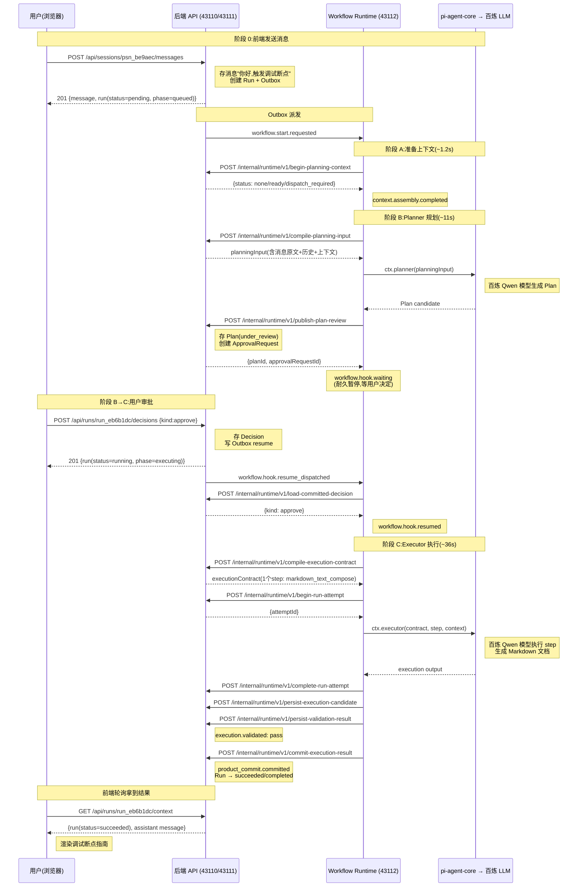

# 完整流程:以"你好,触发调试断点"走一遍

> 本文基于 2026-08-11 的一次真实运行,所有 ID、时间戳、数据均从 Trace 文件和 Product Store 中提取,可一比一还原观察。
>
> 运行环境:本地开发模式,前端 Vite (43110) + 后端 Hono API (43111) + Workflow Runtime (43112)。
>
> **端口说明**:43110 是前端 Vite dev server,它代理 `/api/*` 请求到 43111(后端 API)。浏览器只访问 43110;curl 调试时用 43110(经 Vite 代理)或 43111(直连后端)均可。

### 这是什么系统?

这是一个 AI 对话产品(Chat),用户在浏览器输入消息,系统调用大语言模型(LLM,百炼 Qwen)生成回复。与普通聊天机器人不同,它采用**规划-审批-执行**三阶段耐久工作流:

1. **Planner 模型**生成结构化 Plan(做什么)
2. **用户审批** Plan(approve/reject/修改)
3. **Executor 模型**按批准的 Plan 执行(生成文档/代码等)

整个流程是**耐久**的——每个步骤都持久化到磁盘,进程崩溃可恢复。这类似内核的 crash dump 恢复机制,但粒度更细(每个 step 一个 checkpoint)。

### 面向谁?

本文假设读者熟悉 C/C++ 和 Linux 内核开发,不假设熟悉 TypeScript / React / Web 开发。第 1.1-1.3 节提供概念映射和语法速查,帮助你跨越语言和生态的鸿沟。

---

## 1. 系统架构:三个进程

```
┌──────────────────────────────────────────────────────────────────┐
│ 浏览器 (apps/web, React PWA)                                      │
│   用户输入消息 → POST /api/sessions/:id/messages                  │
│   轮询 GET /api/runs/:id/context → 渲染 Plan / 执行结果            │
│   用户审批 → POST /api/runs/:id/decisions                         │
└────────────────────────┬─────────────────────────────────────────┘
                         ↓ HTTP (43110 Vite → 43111 API)
┌────────────────────────┴─────────────────────────────────────────┐
│ 后端 API (apps/api, Hono, port 43111)                             │
│   公开路由 (product-routes.ts): /api/sessions, /api/runs          │
│   内部路由 (internal-runtime-router.ts): /internal/runtime/v1/*   │
│   Application 层 (packages/application): 业务逻辑                  │
│   Product Store (.data/product/chat-product-store.v1.json): 权威  │
│     产品事实(JSON 文件,原子提交)                                   │
│   Outbox: 派发任务队列(工作流启动/恢复)                            │
└────────────────────────┬─────────────────────────────────────────┘
                         ↓ Outbox 派发 (port 43112)
┌────────────────────────┴─────────────────────────────────────────┐
│ Workflow Runtime (packages/workflows, Vercel Workflow)            │
│   加载 .workflow-bundle/workflows.mjs (SWC 转换后的 bundle)        │
│   执行 planningExecutionWorkflow                                  │
│   通过 api-client.ts 回调后端内部 API (port 43111)                 │
│   通过 ctx.planner / ctx.executor 调用 pi-agent-core → 百炼 LLM   │
│   Checkpoint 存 .data/workflow/ (耐久,崩溃可恢复)                  │
└──────────────────────────────────────────────────────────────────┘
```

### 职责分离(AGENTS.md §4 冻结架构)

| 组件 | 职责 | 不做的事 |
|------|------|---------|
| 浏览器 | 用户交互、渲染 | 不直接调用 Workflow/pi |
| 后端 API | 产品事实管理、Outbox 派发 | 不直接调用 Workflow Runtime |
| Workflow Runtime | 步骤编排、耐久 checkpoint、Hook 等待/恢复 | 不持有产品事实原文 |
| pi-agent-core | 调用 LLM 生成 Plan / 执行 step | 不拥有产品事实 |

> 参考:[AGENTS.md](file:///Users/xulater/Code/Chat/AGENTS.md) §4 冻结架构原则、[docs/architecture/configurable-workflow-design.md](file:///Users/xulater/Code/Chat/docs/architecture/configurable-workflow-design.md) 总体架构图。

### 1.1 面向内核开发者的概念映射

如果你熟悉 Linux 内核开发,以下映射帮助你快速理解本系统的架构概念:

| 本系统概念 | 内核类比 | 说明 |
|-----------|---------|------|
| **Product Store** (JSON 文件) | sysfs / procfs | 权威状态存储,只读视图给外部,写入走原子事务 |
| **原子事务提交** | journal / 事务性内存 | `product.transaction.started → committed`,要么全成功要么全回滚 |
| **Outbox** | workqueue | 延迟派发队列,后端写 Outbox 项,dispatcher 异步推给 Workflow Runtime |
| **Workflow Runtime** | kthread | 后台长驻进程,循环接收并执行工作流任务 |
| **Hook 等待** | `wait_event_interruptible` / `completion` | 工作流暂停在 Hook 上,等外部事件(用户决定)唤醒 |
| **Hook 恢复** | `wake_up` / `complete` | 用户决定写入后,Outbox 派发 resume,唤醒 Hook |
| **Checkpoint** | suspend-to-disk / crash dump | 每个 step 后保存执行状态到 `.data/workflow/`,崩溃后从最近 checkpoint 恢复 |
| **重放(Replay)** | BPF verifier replay / journal replay | 恢复时重放已完成的 step(返回缓存结果),跳到未完成的 step 继续 |
| **Trace JSONL** | ftrace `trace_pipe` | 追加写 JSON 文件,每行一个事件,按时间排序 |
| **CAS 乐观锁** | `atomic_cmpxchg` | Run 的 `revision` 字段,提交时带 `expectedRevision`,不匹配返回 409 |
| **SWC 打包** | `gcc -c` + `ld` | TypeScript 源码编译打包成 `.mjs` bundle(类似 `.ko`),运行时动态 `import()` 加载 |
| **tsx 直接执行** | eBPF 解释器 | 非 step 模块的 `.ts` 文件由 tsx 直接解释执行,保留源码映射(可调试) |
| **async/await** | 协程 / callback | `async function` 返回 Promise,`await` 阻塞等待完成(类似 `wait_for_completion`) |
| **Promise** | `struct completion` / future | 异步操作的句柄,完成后可 await 拿结果 |
| **Zod 校验** | `BUILD_BUG_ON` / `static_assert` | 运行时类型校验,HTTP 响应不符合 schema 直接报错(合同损坏) |
| **Vercel Workflow SDK** | eBPF verifier + JIT | `"use workflow"` 函数体被 SDK 编译转换(注入 step.run 包装),类似 BPF 的 verifier 验证后 JIT |

### 1.2 进程间通信方式

本系统是**多进程架构**,进程间不共享内存,通过以下方式通信:

| 通信路径 | 方式 | 内核类比 |
|---------|------|---------|
| 浏览器 → 后端 API | HTTP REST (POST/GET) | netlink socket |
| 后端 API → Workflow Runtime | Outbox 派发 (HTTP POST) | workqueue 调度 |
| Workflow Runtime → 后端 API | HTTP internal API (POST) | ioctl / 内部系统调用 |
| Workflow Runtime → 百炼 LLM | HTTPS (DashScope API) | 远程过程调用 |
| 前端 ← 后端(状态更新) | HTTP 轮询(1.5s) | 定时 poll(非 epoll) |

> **为什么用 HTTP 而不是函数调用?** 三个进程独立运行,各自有自己的内存空间和生命周期。HTTP 是进程间通信的通用方式,类似内核中不同子系统通过函数调用 + 共享数据结构通信,但跨进程时必须序列化(这里是 JSON)。

### 1.3 TypeScript 语法速查(给 C++ 开发者)

本文档源码片段用 TypeScript 写,以下语法对照帮助你阅读:

| TS 语法 | C++ 类比 | 说明 |
|---------|---------|------|
| `const x = 1` | `const int x = 1` | 不可变绑定 |
| `let x = 1` | `int x = 1` | 可变绑定 |
| `interface Foo { x: number }` | `struct Foo { int x; }` | 结构体声明(只有类型,无实现) |
| `type Foo = { x: number }` | `using Foo = struct { int x; }` | 类型别名 |
| `function f(x: number): string` | `std::string f(int x)` | 函数声明 |
| `async function f(): Promise<T>` | `std::future<T> f()` | 异步函数,返回 future |
| `await f()` | `co_await f()` / `f().get()` | 阻塞等待 future 完成 |
| `x => x + 1` | `[](auto x) { return x + 1; }` | lambda 表达式 |
| `...obj` | 结构体展开 | `{a:1, ...obj}` = 把 obj 的字段展开进新对象 |
| `obj?.field` | `if (obj) obj->field` | 可选链,空则返回 undefined 不 crash |
| `obj!.field` | `BUG_ON(!obj); obj->field` | 非空断言,告诉编译器"我保证不为空" |
| `x as Type` | `(Type)x` / `reinterpret_cast` | 类型断言(编译期,不生成运行时检查) |
| `Omit<T, "x">` | 编译期类型运算 | 从结构体 T 中删掉字段 x,生成新类型 |
| `Pick<T, "x" \| "y">` | 编译期类型运算 | 从 T 中只保留字段 x 和 y |
| `string \| number` | `std::variant<string, number>` | 联合类型(值是其中之一) |
| `x?: number` | `std::optional<int>` | 可选字段,可能不存在 |
| `Record<K, V>` | `std::map<K, V>` | 键值对映射类型 |

> **关键区别**:TS 的类型在编译后全部擦除(类似 C++ 的模板),运行时不存在类型信息。Zod 是运行时校验库,弥补这个缺陷——在 HTTP 边界用 Zod schema 校验 JSON 数据结构,不符合则报错。

---

## 2. 真实运行概要

### 2.1 关键 ID

| 实体 | ID | 说明 |
|------|-----|------|
| Session | `psn_be9aec994ebf4fe6ab7e9c11b7865df9` | 用户会话 |
| Message | `msg_39b214c70a6e43978285c3f6774d21e7` | 用户消息("你好,触发调试断点") |
| Product Run | `run_eb6b1dc2688d43f7b407a5c667480eeb` | 一次产品运行 |
| Workflow Attempt | `att_8edbbf8c417c4f4799565f088f11d8bd` | 工作流尝试 |
| Planning Attempt | `att_7818946e736e45a5b10b75c4f5740e91` | 规划尝试 (planRevision=1) |
| Execution Attempt | `att_7196a104e7d8428fa15cdca0e53ba636` | 执行尝试 |
| Context Request | `ctxr_244544a4ee174417d080ed4132f8ab58` | 上下文请求 |
| Plan | `pln_f6e470da33a94253ba9de26563ccce25` | Plan 实体 |
| Plan Revision | `plr_ccc3375007d84b05887155379d1016ea` | Plan 第 1 版 |
| Approval Request | `apr_cc2c35d032a94c37aa62b79900b10cee` | 审批请求 |
| Decision | `dec_06e3ade0f0fb4604a2ce441a1dfaa7ef` | 用户决定 (approve) |
| Execution Contract | `exc_21bc653519a44af09ad0863d6336b5a7` | 执行合同 |
| Execution Candidate | `xcd_8a36cad68d784cfd9076a798172fd6c5` | 执行候选 |
| Validation Result | `val_321774f078c9424a960b9d7a1c8f2131` | 验证结果 (pass) |

### 2.2 时间线(UTC,北京时间 = UTC+8)

| 阶段 | 起 | 止 | 耗时 | 关键事件 |
|------|-----|-----|------|---------|
| 阶段 A(上下文) | 00:36:16.912 | 00:36:18.063 | ~1.2s | beginPlanningContext → context assembly |
| 阶段 B(规划) | 00:36:18.204 | 00:36:29.257 | ~11s | Planner 模型调用 10.6s → Plan 发布 → Hook 等待 |
| 等待审批 | 00:36:29.256 | 00:38:16.707 | 107s | 用户操作时间 |
| 阶段 B→C(恢复) | 00:38:16.707 | 00:38:17.391 | 0.7s | decision → hook resume |
| 阶段 C(执行) | 00:38:17.544 | 00:38:53.366 | ~36s | Executor 模型调用 35.3s → 验证 → 提交 |
| **总计** | 00:36:16.912 | 00:38:53.366 | **2m37s** | 含 107s 等待审批 |

---

## 3. 完整流程图



---

## 4. 分阶段详细回放

### 4.0 阶段 0:前端发送消息

#### 用户操作

用户在浏览器输入"你好,触发调试断点",点击发送。

#### 前端源码

[apps/web/src/api/client.ts L125-143](file:///Users/xulater/Code/Chat/apps/web/src/api/client.ts#L125-L143):

```ts
export function apiSubmitMessage(
  sessionId: string,
  commandId: CommandId,
  payload: SubmitMessagePayload,
): Promise<{ message: MessageDto; run: RunDto }> {
  // 调试导航③：公开HTTP合同边界。CommandEnvelope把可重试的commandId与业务payload分开；
  // 返回的Message/Run是服务端已提交事实，但只表示"消息与Run已受理"，不表示Workflow已完成。
  return post(
    `/api/sessions/${encodeURIComponent(sessionId)}/messages`,
    commandEnvelopeSchema.parse({
      commandId,
      payload: submitMessagePayloadSchema.parse(payload),
    }),
    (json) => {
      const body = submitMessageResponseSchema.parse(json);
      return { message: body.message, run: body.run };
    },
  );
}
```

**语法说明**:
- `CommandEnvelope` 是请求信封,把可重试的 `commandId` 与业务 `payload` 分开。`commandId` 用于幂等:同一个 commandId 重发不会创建第二条消息。
- `SubmitMessagePayload` 只有一个字段 `{ text: string }`(1-4000 字)。

前端调用链:[apps/web/src/real/use-real-chain.ts L358-387](file:///Users/xulater/Code/Chat/apps/web/src/real/use-real-chain.ts#L358-L387) 的 `sendMessage` 函数。

#### HTTP 请求

```http
POST /api/sessions/psn_be9aec994ebf4fe6ab7e9c11b7865df9/messages
Content-Type: application/json

{
  "commandId": "cmd_...(前端生成)",
  "payload": {
    "text": "你好,触发调试断点"
  }
}
```

#### 后端处理

[apps/api/src/product-routes.ts L1603-1625](file:///Users/xulater/Code/Chat/apps/api/src/product-routes.ts#L1603-L1625):

```ts
router.post("/sessions/:sessionId/messages", async (c) => {
  const sessionId = productSessionIdSchema.parse(c.req.param("sessionId"));
  const envelope = commandEnvelopeSchema.parse(await parseJsonBody(c));
  const payload = submitMessagePayloadSchema.parse(envelope.payload);
  const result = await submitUserMessage(ctx.deps, {
    principalId: ctx.principalId,  // 本地调试模式: usr_debug
    sessionId,
    commandId: envelope.commandId,
    payload,
  });
  return c.json(result, 201);
});
```

核心逻辑在 [packages/application/src/session-message-use-cases.ts L118-236](file:///Users/xulater/Code/Chat/packages/application/src/session-message-use-cases.ts#L118-L236) 的 `submitUserMessage` 函数:

1. 分配 ID:`messageId`、`productRunId`、`outboxId`、`workflowAttemptId`
2. 校验 Session 存在且用户有权限
3. 计算 `sourceMessageSha256`(消息内容哈希,用于幂等)
4. 选择 Workflow 定义(planning 或 note)
5. 编译 `WorkflowRunSpec`
6. 原子提交到 Product Store:消息、Run、Attempt、ContextRequest、Outbox(workflow_start)
7. 返回 `{ message, run }`
```

> **Product Store 原子提交(给内核开发者)**
>
> Product Store 是一个 JSON 文件(`.data/product/chat-product-store.v1.json`),但写入不是直接覆盖。原子提交机制类似 ext4 的 journaling:
>
> 1. **事务开始**(`product.transaction.started`):后端在内存中准备好所有要写入的实体(消息、Run、Attempt、Outbox 项)。
> 2. **事务提交**(`product.transaction.committed`):所有实体一次性写入文件,要么全部成功,要么全部失败。这保证了不会出现"消息写了但 Run 没写"的半成品状态。
> 3. **幂等保护**:`commandId` 记录在 `commandReceipts` 中。同一个 `commandId` 重发不会创建第二条消息(类似 idempotent ioctl)。`sourceMessageSha256` 防止内容篡改。
>
> **Outbox 派发**(类似 `queue_work`):
>
> 步骤 6 写入的 Outbox 项包含 `workflow_start` 任务。后端有一个 dispatcher(类似 kworker 线程)循环扫描 Outbox,将未派发的任务 POST 给 Workflow Runtime (port 43112)。Workflow Runtime 接收后启动 `planningExecutionWorkflow`。
>
> **为什么不让 HTTP 请求直接调用 Workflow Runtime?** 因为 HTTP 请求必须在 Product Store 提交后才返回 201,而 Workflow 执行可能需要几十秒。Outbox 解耦了"提交事实"和"执行工作流",类似内核中 `queue_work` 把耗时操作推迟到工作线程执行。
#### HTTP 响应

```json
{
  "message": {
    "messageId": "msg_39b214c70a6e43978285c3f6774d21e7",
    "sessionId": "psn_be9aec994ebf4fe6ab7e9c11b7865df9",
    "sessionSequence": 3,
    "role": "user",
    "content": { "format": "markdown", "text": "你好,触发调试断点" }
  },
  "run": {
    "productRunId": "run_eb6b1dc2688d43f7b407a5c667480eeb",
    "status": "pending",
    "phase": "queued"
  }
}
```

> **关键**:HTTP 201 只表示"消息与 Run 已受理",不表示 Workflow 已完成。前端拿到 `productRunId` 后开始轮询。

#### Trace 事件

```
2026-08-10T14:39:06.307Z  product.transaction.started    (Run创建事务)
2026-08-10T14:39:06.307Z  product.transaction.committed  success (事务提交)
2026-08-10T14:39:06.307Z  product_run.created            success (Run创建)
2026-08-10T14:39:06.307Z  http.command.accepted          success /api/sessions/:sessionId/messages
2026-08-10T14:39:06.307Z  http.command.completed         success /api/sessions/:sessionId/messages
```

> 注:Run 创建于 2026-08-10T14:39:06(UTC),但因断点暂停,工作流直到 2026-08-11T00:36:16(UTC)才实际开始执行。中间间隔约 10 小时是调试暂停时间。

---

### 4.1 阶段 A:工作流准备上下文(~1.2s)

工作流从 Outbox 派发启动,执行 `planningExecutionWorkflow`。

#### 工作流入口

[packages/workflows/src/planning-execution-workflow.ts L95-140](file:///Users/xulater/Code/Chat/packages/workflows/src/planning-execution-workflow.ts#L95-L140):

```ts
"use workflow";
export async function planningExecutionWorkflow(input: PlanningExecutionWorkflowInput) {
  const { productRunId, attemptId } = input;
  // productRunId是Chat产品身份；attemptId是Chat的Workflow Attempt证据。
  // 二者都不是Vercel Workflow Run ID，Step只能借它们调用内部Application API。

  // 阶段A：准备不可变上下文包
  const begun = await beginPlanningContextStep({ productRunId, attemptId });
  if (begun.status === "dispatch_required") {
    const memoryResult = await queryMemoryContextStep(begun);
    const persisted = await persistPlanningContextResultStep({ productRunId, memoryResult });
    // 后续Plan v2+复用同一上下文包
  }
  // ...进入阶段B
}
```

> **注意**:`"use workflow"` 函数体被 SWC 转换打包进 `.workflow-bundle/workflows.mjs`,源码断点不命中。调试时在 `api-client.ts`(external 模块)打断点。

> **为什么 `"use workflow"` / `"use step"` 要打包?(给内核开发者)**
>
> 这类似 eBPF 的 verifier + JIT。`"use workflow"` 是编译器指令(类似 `SEC("bpf/program")`),告诉 SDK 这个函数不是普通函数,而是耐久工作流定义。SDK 必须转换它:
>
> 1. **注入 checkpoint 逻辑**:在每个 `await xxxStep()` 调用前后,SDK 注入状态保存/恢复代码(类似 BPF verifier 在 helper 调用处插入边界检查)。你的源码 `await beginPlanningContextStep(...)` 被转换成 `step.run("beginPlanningContextStep", async () => { ... })`,SDK 在 `step.run` 内部做 checkpoint。
>
> 2. **序列化加载**:转换后的函数体打包成纯 JS 字符串(bundle),Runtime 通过动态 `import()` 加载(类似 `bpf_prog_load` 加载 BPF 字节码)。这保证了生产环境和本地环境执行的是同一份 bundle。
>
> 3. **sourcemap 缺失**:SWC 转换改变了函数结构(注入了 `step.run` 包装),即使生成 sourcemap,行映射也不精确。类比:BPF JIT 后的机器码也无法精确映射回 BPF 字节码。
>
> **调试策略**:非 step 模块(如 `api-client.ts`)不参与打包,由 tsx 解释执行(类似 eBPF 解释器模式),保留源码映射,断点可命中。

#### Step 1: beginPlanningContextStep

[packages/workflows/src/workflow-planning-steps.ts L198-227](file:///Users/xulater/Code/Chat/packages/workflows/src/workflow-planning-steps.ts#L198-L227):

```ts
// 第一个耐久节点只让Application冻结查询意图。
// API Router不会越过外部Memory边界；Workflow重放只会拿到同一条pending Query或已提交终态。
"use step";
export async function beginPlanningContextStep(input) {
  return await beginPlanningContextWithinStep(input);
}

async function beginPlanningContextWithinStep(input) {
  const result = await ctx.api.beginPlanningContext({
    commandId: cmdId("begin-planning-context", input.productRunId),
    productRunId: input.productRunId,
    attemptId: input.attemptId,
    planRevision: 1,
  });
  return result;
}
```

#### API 调用(Workflow → 后端)

[packages/workflows/src/api-client.ts L360-367](file:///Users/xulater/Code/Chat/packages/workflows/src/api-client.ts#L360-L367):

```ts
/** 开始准备规划上下文：冻结查询意图，让Application决定是否需要查Memory。 */
beginPlanningContext(input: Omit<PreparePlanningContextRequest, "schemaVersion">) {
  return call(
    options,
    "/internal/runtime/v1/begin-planning-context",
    { schemaVersion: INTERNAL_RUNTIME_SCHEMA_VERSION, ...input },
    beginPlanningContextResponseSchema,
  );
},
```

**`call` 函数**([api-client.ts L112](file:///Users/xulater/Code/Chat/packages/workflows/src/api-client.ts#L112)):所有方法的共用 HTTP 客户端,做 POST 请求 + 凭据头 + 超时 + Zod 响应校验 + 错误分类。

**`Omit<T, K>`**:TypeScript 内置工具类型,从类型 T 中删除字段 K。这里 `Omit<PreparePlanningContextRequest, "schemaVersion">` 表示调用方不需要传 `schemaVersion`(方法内部自动填),只传 `commandId`/`productRunId`/`attemptId`/`planRevision`。

#### Trace 事件(阶段 A)

```
00:36:16.912  workflow.step.started           (beginPlanningContextStep)
00:36:16.939  product.transaction.started     
00:36:16.958  product.transaction.committed   success
00:36:16.958  context.assembly.started        
00:36:16.958  context.assembly.completed      success (上下文组装完成)
00:36:17.069  workflow.step.completed         success
00:36:17.234  product.transaction.started     (persistPlanningContextResult)
00:36:17.253  product.transaction.committed   success
00:36:17.508  workflow.step.started           
00:36:17.529  product.transaction.committed   success
00:36:17.637  workflow.step.completed         success
00:36:17.790  workflow.step.started           
00:36:17.911  workflow.step.completed         success
00:36:18.063  product.transaction.committed   success
```

#### Product Store 数据

ContextRequest:
```json
{
  "contextRequestId": "ctxr_244544a4ee174417d080ed4132f8ab58",
  "productRunId": "run_eb6b1dc2688d43f7b407a5c667480eeb",
  "sourceMessageId": "msg_39b214c70a6e43978285c3f6774d21e7",
  "sourceMessageSha256": "596b5d847a0b3b96a9147837be98a17efc800c0a12c4999d7ab685f90f630983",
  "sha256": "641be102f71787d80c4513ca6f188ce0fb5f5b23866ad920c256e4fbce1f0c2c"
}
```

> **设计要点**:`sourceMessageSha256` 是消息内容的哈希,不是消息原文。Workflow 只持有哈希引用,需要原文时回后端查。这就是 [docs/architecture/configurable-workflow-design.md](file:///Users/xulater/Code/Chat/docs/architecture/configurable-workflow-design.md) L186-204 说的"Node Value Manifest 只保存命名 slot 和产品引用,完整正文仍只存在于相应产品对象"。

---

### 4.2 阶段 B:Planner 规划 + 等待审批(~11s)

#### Step: compilePlanningInputStep

工作流调后端组装 Planner 模型输入:

```ts
const planningInput = await compilePlanningInputStep({
  productRunId,
  planRevision: 1,
  contextPackageRef: persisted?.contextPackageRef,
});
```

后端收到请求后,用 `productRunId` 查 Product Store:读"你好,触发调试断点"原文 + 历史消息 + 上下文包 + 用户规则,组装成完整的 Planner 输入。

#### Step: runPiPlannerStep(模型调用)

[packages/workflows/src/workflow-planning-steps.ts L534-638](file:///Users/xulater/Code/Chat/packages/workflows/src/workflow-planning-steps.ts#L534-L638):

```ts
"use step";
export async function runPiPlannerStep(input) {
  return runStep(input, "pi.plan", runPlannerWithinStep);
}

async function runPlannerWithinStep(input) {
  // 检查 Provider API Key (DASHSCOPE_API_KEY)
  // 发送 pi.node.started trace
  const result = await ctx.planner({
    config: input.providerConfig,
    planningInput: input.planningInput,
  });
  // result.candidate → 返回 Plan
  // result.invalid_candidate → 抛 PiStepFailure
}
```

`ctx.planner` 是 pi-agent-core 的 Planner 接口,底层调用百炼(DashScope)API。

#### Trace 事件(Planner 模型调用)

```
00:36:18.204  workflow.step.started           (compilePlanningInputStep)
00:36:18.225  product_run.transitioned        success (Run → running/planning)
00:36:18.225  http.command.completed          success /internal/runtime/v1/compile-planning-input
00:36:18.227  pi.node.started                 (Planner 模型调用开始)
00:36:18.229  provider.request.started        (百炼 API 请求开始)
00:36:28.866  provider.request.completed      success (百炼 API 返回,耗时 10.637s)
00:36:28.868  pi.node.completed               success
00:36:28.869  plan.candidate.received         (Plan 候选收到)
```

> Planner 模型调用耗时 **10.637 秒**。

#### Plan 内容(真实数据)

```json
{
  "planRevisionId": "plr_ccc3375007d84b05887155379d1016ea",
  "planId": "pln_f6e470da33a94253ba9de26563ccce25",
  "planRevision": 1,
  "status": "under_review",
  "sha256": "5fd1d6f06c16b2f94b392bc7cfb5a922a7a09bb57aa65baeedff8db7775aa3c1",
  "content": {
    "objective": "响应用户"触发调试断点"的请求，提供关于如何在常见开发环境中设置和触发调试断点的结构化指南",
    "summary": "由于用户未指定具体的编程语言、开发环境或IDE，本计划旨在生成一份通用的调试断点设置指南...",
    "assumptions": [
      { "statement": "用户希望了解如何触发调试断点，但未提供具体的技术栈上下文", "source": "user" },
      { "statement": "用户接受一份通用性的指南，而非针对特定项目的具体代码修改", "source": "planner" }
    ],
    "openQuestions": [
      "您具体使用的是哪种编程语言（如Python, JavaScript, C++等）？",
      "您使用的是哪个集成开发环境（IDE）或编辑器（如VS Code, IntelliJ IDEA, PyCharm等）？",
      "您是在本地环境还是远程/容器环境中进行调试？"
    ],
    "steps": [
      {
        "stepId": "step_1",
        "title": "生成调试断点通用指南",
        "purpose": "创建一份包含主流语言和IDE调试断点设置方法的Markdown文档",
        "dependsOn": [],
        "inputRefs": [],
        "expectedOutput": "一份名为debug_breakpoint_guide.md的Markdown文件...",
        "successCriteria": [
          "生成的Markdown文件包含至少三种主流编程语言的断点设置说明",
          "生成的Markdown文件包含至少两种常见IDE/浏览器的操作步骤",
          "文档结构清晰，包含标题、代码块和操作步骤列表"
        ],
        "requestedCapabilities": ["markdown_text_compose"],
        "risk": "low"
      }
    ],
    "completionCriteria": ["成功生成并交付一份包含多语言和多环境调试断点设置指南的Markdown文档"],
    "warnings": ["由于缺乏具体上下文，提供的指南为通用性质..."]
  }
}
```

#### Step: publishPlanReviewStep + Hook 等待

```ts
await publishPlanReviewStep({ productRunId, planRevision, candidate });
// 创建 approvalRequest,Plan 状态 → under_review
// Run 状态 → waiting_human / plan_review

// 创建耐久 Hook,暂停等待用户决定
const decision = await planDecisionHook({ productRunId, approvalRequestId });
// ↑ 工作流在这里暂停,直到用户 approve/reject/request_revision
```

#### Trace 事件(Plan 发布 + Hook 等待)

```
00:36:28.872  product.transaction.started     
00:36:28.888  product.transaction.committed   success
00:36:28.889  plan.candidate.published        success
00:36:28.890  approval.created                success
00:36:28.890  product_run.transitioned        success (Run → waiting_human/plan_review)
00:36:28.892  http.command.completed          success /internal/runtime/v1/publish-plan-review
00:36:28.892  workflow.step.completed         success
00:36:29.243  workflow.step.started           (planDecisionHook)
00:36:29.256  workflow.hook.waiting           (耐久暂停,等用户决定)
00:36:29.257  workflow.step.completed         success
```

> **Hook 机制的内核类比**
>
> Hook 类似内核的 `wait_event_interruptible` + `completion`。工作流执行到 `planDecisionHook()` 时:
>
> 1. **注册等待**:Runtime 在 `.data/workflow/` 写入一条 Hook 等待记录(类似 `wait_queue_head_t`),包含 `productRunId` 和 `approvalRequestId`。
> 2. **暂停执行**:工作流函数挂起,不消耗 CPU。Runtime 可以处理其他工作流任务(类似 `schedule()` 切换到其他进程)。
> 3. **外部唤醒**:用户提交 approve 后,后端写 Outbox resume 任务,dispatcher 推给 Runtime。Runtime 查到对应的 Hook 记录,恢复工作流执行(类似 `wake_up` / `complete`)。
> 4. **耐久性**:即使 Runtime 进程崩溃重启,Hook 等待记录仍在磁盘上。Runtime 重启后扫描 `.data/workflow/`,恢复所有未完成的 Hook 等待(类似 suspend-to-disk 后恢复进程状态)。
> 5. **超时保护**:Hook 有 `expiresAt`(24小时),超时后工作流自动恢复,走 `expireApproval` 路径(类似 `schedule_timeout_interruptible`)。

#### 前端渲染 Plan

前端通过轮询 `GET /api/runs/:productRunId/context` 拿到 Plan 数据,在 [apps/web/src/components/PlanPanel.tsx L105-153](file:///Users/xulater/Code/Chat/apps/web/src/components/PlanPanel.tsx#L105-L153) 的 `PlanCard` 组件中渲染:

- Plan 版本、状态
- 目标(objective)
- 摘要(summary)
- 步骤(steps)
- 假设(assumptions)
- 开放问题(openQuestions)
- 成功标准(successCriteria)
- 完成条件(completionCriteria)
- 警告(warnings)
- **Approve / Reject / Request Revision 按钮**

#### 前端轮询机制

[apps/web/src/workflow/use-workflow-run-view.ts L28-55](file:///Users/xulater/Code/Chat/apps/web/src/workflow/use-workflow-run-view.ts#L28-L55):

```ts
// SSE尚未成为当前产品事实，当前用定时轮询。
// 活动Run:每1.5s轮询;终态Run:停止轮询。
export function useWorkflowRunView(productRunId: string) {
  return useQuery({
    queryKey: ["workflow-run-view", productRunId],
    queryFn: () => apiGetWorkflowRunView(productRunId),
    refetchInterval: (query) => {
      const status = query.state.data?.run?.status;
      return status === "pending" || status === "running" ? 1500 : false;
    },
  });
}
```

> **设计说明**:当前前端用 1.5s 轮询,不是 SSE。代码注释明确说明"SSE 尚未成为当前产品事实,未来 SSE 只失效该查询入口"。

---

### 4.3 阶段 B→C:用户审批(107s 等待)

#### 用户操作

用户在浏览器看到 Plan 后,点击 **Approve** 按钮。

#### 前端提交决定

[apps/web/src/components/PlanPanel.tsx L205-240](file:///Users/xulater/Code/Chat/apps/web/src/components/PlanPanel.tsx#L205-L240):

```tsx
const basePayload = {
  approvalRequestId,
  planId,
  planRevision,
  planSha256,
};

// Approve 按钮:
chain.submitDecision({
  ...basePayload,
  kind: "approve",
});
```

[apps/web/src/api/client.ts L183-203](file:///Users/xulater/Code/Chat/apps/web/src/api/client.ts#L183-L203):

```ts
export function apiSubmitDecision(
  productRunId: string,
  commandId: CommandId,
  expectedRunRevision: number,
  payload: SubmitDecisionPayload,
) {
  return post(
    `/api/runs/${encodeURIComponent(productRunId)}/decisions`,
    commandEnvelopeSchema.parse({ commandId, expectedRevision: expectedRunRevision, payload }),
    (json) => {
      const body = submitDecisionResponseSchema.parse(json);
      return { decision: body.decision, run: body.run };
    },
  );
}
```

#### HTTP 请求(真实数据)

```http
POST /api/runs/run_eb6b1dc2688d43f7b407a5c667480eeb/decisions
Content-Type: application/json

{
  "commandId": "cmd_approve...",
  "expectedRevision": 3,
  "payload": {
    "approvalRequestId": "apr_cc2c35d032a94c37aa62b79900b10cee",
    "planId": "pln_f6e470da33a94253ba9de26563ccce25",
    "planRevision": 1,
    "planSha256": "5fd1d6f06c16b2f94b392bc7cfb5a922a7a09bb57aa65baeedff8db7775aa3c1",
    "kind": "approve"
  }
}
```

**`expectedRevision: 3`**:Product Run 的乐观锁。用户看到的 Run revision 是 3,提交时带上。如果 Run 已变化(比如被其他人改了),服务端返回 409,防止旧页面批准新状态。

**`planSha256`**:Plan 内容哈希,确保用户审批的是这个版本的 Plan,防止篡改。

#### 后端处理

[apps/api/src/product-routes.ts L1799-1829](file:///Users/xulater/Code/Chat/apps/api/src/product-routes.ts#L1799-L1829):

```ts
router.post("/runs/:productRunId/decisions", async (c) => {
  // expectedRevision是Product Run的乐观锁
  const result = await submitPlanDecision(ctx.deps, {
    principalId: ctx.principalId,
    productRunId,
    commandId: envelope.commandId,
    expectedRunRevision: envelope.expectedRevision,
    payload,
  });
  return c.json(result, 201);
});
```

核心逻辑在 [packages/application/src/plan-decision-use-cases.ts L406-524](file:///Users/xulater/Code/Chat/packages/application/src/plan-decision-use-cases.ts#L406-L524):

1. 创建 `decisionId`
2. CAS 校验 Run revision(乐观锁)
3. 校验 Session 所有权
4. 校验 ApprovalRequest 存在且 status=open
5. 校验 Plan 绑定 + sha256 匹配
6. 根据 `kind`:
   - `approve` → Plan 状态 → approved,Run 状态 → running/executing
   - `reject` → Plan 状态 → rejected,Run 状态 → cancelled
   - `request_revision` → Plan 状态 → revision_requested,回阶段 B 循环
7. 写 Outbox(workflow_resume)

#### HTTP 响应

```json
{
  "decision": {
    "decisionId": "dec_06e3ade0f0fb4604a2ce441a1dfaa7ef",
    "kind": "approve",
    "planRevision": 1
  },
  "run": {
    "productRunId": "run_eb6b1dc2688d43f7b407a5c667480eeb",
    "status": "running",
    "phase": "executing",
    "revision": 4
  }
}
```

#### Trace 事件(审批 + Hook 恢复)

```
00:38:16.707  http.command.received           (POST /decisions)
00:38:16.713  product.transaction.started     
00:38:16.762  product.transaction.committed   success
00:38:16.764  decision.committed              success
00:38:16.764  product_run.transitioned        success (Run → running/executing)
00:38:16.765  http.command.accepted           success /api/runs/:productRunId/decisions
00:38:16.765  http.command.completed          success /api/runs/:productRunId/decisions
00:38:17.229  workflow.step.started           (Hook恢复)
00:38:17.234  workflow.hook.resume_dispatched success
00:38:17.251  http.command.completed          success /internal/runtime/v1/load-committed-decision
00:38:17.390  workflow.hook.resumed           success (Hook恢复成功)
00:38:17.391  workflow.step.completed         success
```

---

### 4.4 阶段 C:Executor 执行 + 验证 + 提交(~36s)

#### Step: compileExecutionContractStep

从批准的 Plan 编译不可变执行合同:

```ts
const contract = await compileExecutionContractStep({
  productRunId,
  approvedPlanId,
  approvedPlanRevision: 1,
  approvalDecisionId,
});
```

#### Execution Contract(真实数据)

```json
{
  "executionContractId": "exc_21bc653519a44af09ad0863d6336b5a7",
  "approvedPlanId": "pln_f6e470da33a94253ba9de26563ccce25",
  "approvedPlanRevision": 1,
  "approvalDecisionId": "dec_06e3ade0f0fb4604a2ce441a1dfaa7ef",
  "steps": [
    {
      "stepId": "step_1",
      "title": "生成调试断点通用指南",
      "purpose": "创建一份包含主流语言和IDE调试断点设置方法的Markdown文档",
      "dependsOn": [],
      "expectedOutput": "一份名为debug_breakpoint_guide.md的Markdown文件...",
      "successCriteria": [
        "生成的Markdown文件包含至少三种主流编程语言的断点设置说明",
        "生成的Markdown文件包含至少两种常见IDE/浏览器的操作步骤",
        "文档结构清晰，包含标题、代码块和操作步骤列表"
      ],
      "capabilityRefs": ["markdown_text_compose"]
    }
  ],
  "limits": {
    "maxTurnsPerStep": 1,
    "timeoutMsPerStep": 120000,
    "tokenBudgetPerStep": 2048
  },
  "sha256": "21fbd42063723da6e41741a0b0280fe307740a72d086dfe01e4354e59e453237"
}
```

> **设计要点**:Execution Contract 是**不可变的**。一旦编译,执行步骤、依赖顺序、限制条件都冻结。Executor 必须按合同执行,不能自行改变步骤。

#### Step: runPiExecutorStep(模型调用)

[packages/workflows/src/workflow-execution-steps.ts L116-239](file:///Users/xulater/Code/Chat/packages/workflows/src/workflow-execution-steps.ts#L116-L239):

```ts
"use step";
export async function runPiExecutorStep(input) {
  return runStep(input, "pi.execute", runExecutorWithinStep);
}

async function runExecutorWithinStep(input) {
  // 校验执行上下文与Approved Plan的input refs
  // 计算并校验input manifest hash
  // 检查Provider API Key
  const result = await ctx.executor({
    config: input.providerConfig,
    executionContract: input.executionContract,
    step: input.step,
    contextItems: input.contextItems,
    dependencyResults: input.dependencyResults,
  });
  // result.candidate → 返回执行输出
}
```

#### Trace 事件(Executor 模型调用)

```
00:38:17.544  workflow.step.started           (compileExecutionContractStep)
00:38:17.570  http.command.completed          success /internal/runtime/v1/compile-execution-contract
00:38:17.600  http.command.completed          success /internal/runtime/v1/begin-run-attempt
00:38:17.602  pi.node.started                 (Executor 模型调用开始)
00:38:17.602  provider.request.started        (百炼 API 请求开始)
00:38:52.910  provider.request.completed      success (百炼 API 返回,耗时 35.308s)
00:38:52.911  pi.node.completed               success
```

> Executor 模型调用耗时 **35.308 秒**,比 Planner(10.6s)长,因为 Executor 要生成完整的 Markdown 文档。

#### Step: completeRunAttempt + persistExecutionCandidate

```
00:38:52.918  http.command.received           (complete-run-attempt)
00:38:52.954  http.command.completed          success /internal/runtime/v1/complete-run-attempt
00:38:52.958  http.command.received           (persist-execution-candidate)
00:38:52.980  http.command.completed          success /internal/runtime/v1/persist-execution-candidate
00:38:52.982  workflow.step.completed         success
```

#### Execution Candidate(真实数据,节选)

```json
{
  "executionCandidateId": "xcd_8a36cad68d784cfd9076a798172fd6c5",
  "executionContractId": "exc_21bc653519a44af09ad0863d6336b5a7",
  "stepResults": [
    {
      "stepId": "step_1",
      "executionAttemptId": "att_7196a104e7d8428fa15cdca0e53ba636",
      "inputManifestSha256": "1696a864b8d365c2c6f4ea07e5f5a399463b4b6c19fb75e69caa45ba3543f6ef",
      "output": "# 多语言与多环境调试断点设置指南\n\n本指南旨在帮助开发者在主流编程语言和常见开发环境中高效设置和使用调试断点...\n\n## Python 断点设置\n\n### 1. 使用 breakpoint() 函数（推荐）\n\n```python\ndef calculate_sum(a, b):\n    result = a + b\n    breakpoint()  # 程序执行到此将暂停\n    return result\n```\n\n## JavaScript 断点设置\n\n### 1. 浏览器环境（Chrome/Firefox）\n\n```javascript\nfunction greet(name) {\n    let message = \"Hello, \" + name;\n    debugger; // 程序执行到此将暂停\n    console.log(message);\n}\n```\n\n..."
    }
  ]
}
```

> Executor 生成的文档包含 Python、JavaScript、Java 断点设置 + VS Code、Chrome DevTools 操作指南,满足 Plan 中定义的成功标准。

#### Step: persistValidationResult

```
00:38:53.154  workflow.step.started           (validation)
00:38:53.185  product.transaction.committed   success
00:38:53.186  execution.validated             success (验证通过)
00:38:53.187  http.command.completed          success /internal/runtime/v1/persist-validation-result
00:38:53.188  workflow.step.completed         success
```

#### Validation Result(真实数据)

```json
{
  "validationResultId": "val_321774f078c9424a960b9d7a1c8f2131",
  "executionContractId": "exc_21bc653519a44af09ad0863d6336b5a7",
  "executionCandidateId": "xcd_8a36cad68d784cfd9076a798172fd6c5",
  "strictEvidence": true,
  "outcome": "pass",
  "failures": []
}
```

> `strictEvidence: true` 表示严格验证模式。`outcome: pass` + `failures: []` 表示验证通过。

#### Step: commitExecutionResult(产品提交)

```
00:38:53.336  workflow.step.started           (commit)
00:38:53.339  product_commit.started          
00:38:53.340  product.transaction.started     
00:38:53.362  product.transaction.committed   success
00:38:53.362  product_commit.committed        success (产品提交完成)
00:38:53.364  product_run.transitioned        success (Run → succeeded/completed)
00:38:53.364  http.command.completed          success /internal/runtime/v1/commit-execution-result
00:38:53.366  workflow.step.completed         success (工作流结束)
```

#### Run 最终状态

```json
{
  "productRunId": "run_eb6b1dc2688d43f7b407a5c667480eeb",
  "status": "succeeded",
  "phase": "completed",
  "revision": 5,
  "updatedAt": "2026-08-11T00:38:53.338Z"
}
```

#### 前端拿到结果

前端轮询 `GET /api/runs/run_eb6b1dc/context` 拿到 `status: succeeded` 和 assistant 消息(生成的调试断点指南),渲染给用户。

Session 消息列表最终状态:
```
seq 1  user      你好
seq 2  user      你好,触发调试断点
seq 3  user      你好,触发调试断点
seq 4  user      你好,这是一条用于文档记录的测试消息
seq 5  assistant ## 生成调试断点通用指南\n# 多语言与多环境调试断点设置指南\n...
```

---

## 5. Trace 机制说明

### 5.1 Trace 文件位置

[packages/realtime/src/trace-paths.ts](file:///Users/xulater/Code/Chat/packages/realtime/src/trace-paths.ts):

```
<repoRoot>/.data/traces/chat-trace-YYYY-MM-DD.jsonl
```

按 UTC 日期切分,每行一个 JSON 事件。

### 5.2 Trace 事件结构

[packages/realtime/src/trace-sink.ts](file:///Users/xulater/Code/Chat/packages/realtime/src/trace-sink.ts):

```ts
interface TraceEvent {
  schemaVersion: 1;
  eventId: string;         // evt_<uuid>
  timestamp: string;       // ISO 8601 UTC
  level: "info" | "warn" | "error";
  traceId: string;         // 请求级追踪ID
  spanId: string;          // Span级ID
  eventName: string;       // 事件名(见下表)
  outcome?: string;        // success | failure | unknown
  productRunId?: string;   // 关联的Product Run
  routeTemplate?: string;  // HTTP路由模板
  stepName?: string;       // 工作流Step名
  // ... 其他字段按事件类型不同
}
```

> **关键设计**(trace-sink.ts L17-18 注释):"合同不存在任意内容通道:未声明字段(含 body/prompt/payload 等)直接失败,不做'写入后脱敏';正文只存 Product Store,Trace 只持对象引用与 Hash。"

### 5.3 主要事件名

| 事件名 | 含义 |
|--------|------|
| `http.command.received` | HTTP 请求到达 |
| `http.command.accepted` | HTTP 命令受理 |
| `http.command.completed` | HTTP 请求完成 |
| `product.transaction.started` | Product Store 事务开始 |
| `product.transaction.committed` | Product Store 事务提交 |
| `product_run.created` | Product Run 创建 |
| `product_run.transitioned` | Product Run 状态转换 |
| `context.assembly.started/completed` | 上下文组装 |
| `workflow.start.requested` | 工作流启动请求(Outbox 派发) |
| `workflow.step.started/completed` | 工作流 Step 开始/完成 |
| `workflow.hook.waiting` | Hook 耐久等待 |
| `workflow.hook.resume_dispatched` | Hook 恢复派发 |
| `workflow.hook.resumed` | Hook 恢复成功 |
| `pi.node.started/completed` | pi 模型节点开始/完成 |
| `provider.request.started/completed` | Provider(百炼)请求开始/完成 |
| `plan.candidate.received` | Plan 候选收到 |
| `plan.candidate.published` | Plan 候选发布 |
| `approval.created` | 审批请求创建 |
| `decision.committed` | 用户决定提交 |
| `execution.validated` | 执行验证完成 |
| `product_commit.started/committed` | 产品提交 |

---

## 6. Product Store 数据结构

Product Store 是后端的权威产品事实存储,采用 JSON 文件原子提交。

文件位置:`.data/product/chat-product-store.v1.json`

### 6.1 顶层结构

```json
{
  "schemaVersion": "...",
  "storeRevision": 123,
  "committedAt": "2026-08-11T00:38:53.338Z",
  "entities": { /* 所有实体 */ },
  "commandReceipts": { /* 命令幂等记录 */ },
  "outbox": { /* 派发任务队列 */ }
}
```

### 6.2 本次运行涉及的实体

| 实体类型 | ID | 关键字段 |
|---------|-----|---------|
| `sessions` | `psn_be9aec...` | ownerPrincipalId, lastMessageSequence |
| `messages` | `msg_39b214...` | sessionId, sessionSequence, role, content.text |
| `runs` | `run_eb6b1dc...` | status, phase, currentPlanId, currentApprovalRequestId |
| `attempts` | `att_8edbbf...` (workflow) | kind=workflow, status=success |
| `attempts` | `att_781894...` (planning) | kind=planning, planRevision=1, status=success |
| `attempts` | `att_7196a1...` (execution) | kind=execution, status=success |
| `contextRequests` | `ctxr_244544...` | sourceMessageId, sourceMessageSha256 |
| `plans` | `plr_ccc337...` | planId, planRevision, status, content, sha256 |
| `approvalRequests` | `apr_cc2c35...` | planId, planRevision, planSha256, status, expiresAt |
| `decisions` | `dec_06e3ad...` | kind=approve, planRevision |
| `executionContracts` | `exc_21bc65...` | approvedPlanId, steps[], limits |
| `executionCandidates` | `xcd_8a36ca...` | executionContractId, stepResults[].output |
| `validationResults` | `val_321774...` | outcome=pass, failures=[] |

### 6.3 身份层级(七层不可合并)

参考 [docs/product/concept-space.md](file:///Users/xulater/Code/Chat/docs/product/concept-space.md) 和 [AGENTS.md](file:///Users/xulater/Code/Chat/AGENTS.md) §6.7:

```
Product Session  → 一次会话 (psn_xxx)
Product Run      → 一次运行 (run_xxx) — 用户可见的工作记录
Run Attempt      → 一次尝试 (att_xxx) — workflow/planning/execution 各有独立的 attempt
Workflow Run     → Vercel Workflow 的 Run (wrun_xxx) — 后台分步骤执行
Workflow Checkpoint → Workflow 的检查点 — 耐久恢复用
pi Runtime Session   → Agent 执行会话 — 模型调用上下文
Realtime Connection  → SSE/轮询连接 — 前端订阅
```

> **关键**:Product Run ≠ Workflow Run。Product Run 是用户可见的产品事实;Workflow Run 是后台执行机制。Workflow 不拥有会话、消息、审批和完成事实,这些都在 Product Store 里。

---

## 7. 背景知识与设计原因

### 7.1 为什么采用三阶段(规划/审批/执行)设计

参考 [docs/architecture/planning-execution-workflow.md](file:///Users/xulater/Code/Chat/docs/architecture/planning-execution-workflow.md) L11-28:

> 一次 `PlanningExecutionWorkflow` 覆盖"保存用户输入与 Product Run → pi 规划 → 保存 Plan Candidate → 等待人工决定 → 恢复执行 → Product Commit"的完整链路。

**设计原因**:
1. **规划与执行分离**:Planner 生成 Plan(做什么),Executor 执行 Plan(怎么做)。两个模型调用独立,可以分别调优、分别计费、分别重试。
2. **人工审批(HITL)**:Plan 生成后暂停,等用户确认。防止 AI 自主执行不靠谱的计划。参考 AGENTS.md §4:"HITL 决定先经产品层校验,再恢复 Workflow Hook。"
3. **不可变执行合同**:Plan 批准后编译成 Execution Contract,Executor 必须按合同执行,不能自行改变步骤。这保证了用户审批的就是执行的。

### 7.2 为什么用单个 Workflow Run

参考 [docs/architecture/planning-execution-workflow.md](file:///Users/xulater/Code/Chat/docs/architecture/planning-execution-workflow.md) L48-54:

> 保证规划、等待、恢复和执行是同一后台工作;Vercel Workflow 可在 Hook 处暂停并继续原控制流;修改循环用内部 `while` 表达。

**设计原因**:
1. **同一控制流**:规划 → 等待 → 执行是一个连贯的逻辑流,拆成多个 Workflow Run 会丢失上下文。
2. **Hook 耐久暂停**:Vercel Workflow 的 Hook 机制允许工作流在等待用户审批时暂停(不消耗计算资源),审批后恢复继续执行,不需要重新启动。
3. **修改循环**:用户 `request_revision` 时,工作流用 `for` 循环回到规划阶段,复用同一个 Workflow Run,不创建新的。

### 7.3 为什么工作流不直接持有数据原文

参考 [docs/architecture/configurable-workflow-design.md](file:///Users/xulater/Code/Chat/docs/architecture/configurable-workflow-design.md) L186-204:

> 节点输入输出使用 Node Value Manifest,只保存命名 slot 和产品引用;完整正文仍只存在于相应产品对象。

**设计原因**:
1. **耐久 checkpoint 效率**:Workflow 每个 step 后做 checkpoint。如果 checkpoint 包含消息原文、上下文包等大对象,checkpoint 会很大,影响恢复速度。只存引用(sha256、ID),checkpoint 轻量。
2. **权威事实单一来源**:产品事实只在 Product Store 里存一份。Workflow 只持引用,需要时回后端查。避免数据冗余和不一致。
3. **Trace 隐私**:Trace 文件只存对象引用与 Hash,不存正文。trace-sink.ts 注释:"合同不存在任意内容通道:未声明字段(含 body/prompt/payload 等)直接失败。"
4. **重放安全**:Workflow 崩溃恢复时重放已完成的 step。如果 step 持有原文,重放时原文可能已变(用户编辑了消息)。只持引用,重放时回后端查最新事实。

### 7.4 Product Store 的权威事实设计

参考 [docs/product/concept-space.md](file:///Users/xulater/Code/Chat/docs/product/concept-space.md) L51-62:

> Product Run 是用户可见的一次工作记录,不是 Vercel Workflow Run;Workflow 只是后台分步骤执行、等待和继续的机制,不拥有会话、消息、审批和完成事实。

**设计原因**:
1. **原子提交**:Product Store 的每次写入都是一个原子事务(`product.transaction.started → committed`),要么全部成功,要么全部失败。
2. **命令幂等**:`commandId` + `requestSha256` 保证同一个命令重发不会创建重复事实。
3. **乐观锁**:Run 的 `revision` 字段是乐观锁,前端提交决定时带 `expectedRevision`,防止并发冲突。

---

## 8. 调试指南

### 8.1 断点策略

| 代码位置 | 断点是否命中 | 原因 |
|---------|-------------|------|
| `planning-execution-workflow.ts`("use workflow" 函数体内) | 不命中 | 被 SWC 打包进 bundle,无 sourcemap |
| `workflow-planning-steps.ts`("use step" 函数体内) | 不命中 | 同上 |
| [api-client.ts](file:///Users/xulater/Code/Chat/packages/workflows/src/api-client.ts) L360(external 模块) | 命中 | 非 step 模块,tsx 直接执行 |
| `.workflow-bundle/workflows.mjs` | 命中 | 实际执行的代码,但无源码映射 |

**推荐**:在 `api-client.ts` 的方法里打断点,作为观察工作流执行的侧信道。每个 step 都会经过这里。

### 8.2 触发运行的命令

```bash
# 发消息触发工作流
curl -X POST http://127.0.0.1:43110/api/sessions/psn_be9aec994ebf4fe6ab7e9c11b7865df9/messages \
  -H "content-type: application/json" \
  -d '{"commandId":"cmd_test001","payload":{"text":"你好"}}'

# 发 approve 决定(需要替换 productRunId 和 revision)
curl -X POST http://127.0.0.1:43110/api/runs/<productRunId>/decisions \
  -H "content-type: application/json" \
  -d '{"commandId":"cmd_approve001","expectedRevision":3,"payload":{"approvalRequestId":"<apr_id>","planId":"<pln_id>","planRevision":1,"planSha256":"<sha256>","kind":"approve"}}'
```

### 8.3 查看 Trace

```bash
# 查看今天的 trace 事件
cat .data/traces/chat-trace-$(date -u +%F).jsonl | jq .

# 过滤某个 Run 的 trace
grep "run_eb6b1dc" .data/traces/chat-trace-2026-08-11.jsonl | jq .

# 查看 Product Store
node -e 'const s=require("./.data/product/chat-product-store.v1.json");console.log(JSON.stringify(s.entities.runs["run_eb6b1dc"],null,2))'
```

### 8.4 查看 Workflow Checkpoint

```bash
# 工作流 Run 文件
ls .data/workflow/runs/

# 工作流事件(每个 step 的 checkpoint)
ls .data/workflow/events/

# 查看 Hook 等待状态
ls .data/workflow/hooks/
ls .data/workflow/waits/
```

---

## 9. 完整 Trace 事件回放

以下是本次运行的完整 Trace 事件(按时间排序,共 56 条,从工作流启动到完成):

### 阶段 A:上下文准备(00:36:16 - 00:36:18)

| # | 时间(UTC) | 事件名 | 结果 | 备注 |
|---|-----------|--------|------|------|
| 1 | 00:36:16.912 | workflow.step.started | - | beginPlanningContextStep |
| 2 | 00:36:16.939 | product.transaction.started | - | |
| 3 | 00:36:16.958 | product.transaction.committed | success | |
| 4 | 00:36:16.958 | context.assembly.started | - | |
| 5 | 00:36:16.958 | context.assembly.completed | success | 上下文组装完成 |
| 6 | 00:36:17.069 | workflow.step.completed | success | |
| 7 | 00:36:17.234 | product.transaction.started | - | persistPlanningContextResult |
| 8 | 00:36:17.253 | product.transaction.committed | success | |
| 9 | 00:36:17.508 | workflow.step.started | - | |
| 10 | 00:36:17.529 | product.transaction.committed | success | |
| 11 | 00:36:17.637 | workflow.step.completed | success | |
| 12 | 00:36:17.790 | workflow.step.started | - | |
| 13 | 00:36:17.812 | product.transaction.committed | success | |
| 14 | 00:36:17.911 | workflow.step.completed | success | |
| 15 | 00:36:18.046 | product.transaction.started | - | |
| 16 | 00:36:18.063 | product.transaction.committed | success | |

### 阶段 B:Planner 规划 + Hook 等待(00:36:18 - 00:36:29)

| # | 时间(UTC) | 事件名 | 结果 | 备注 |
|---|-----------|--------|------|------|
| 17 | 00:36:18.204 | workflow.step.started | - | compilePlanningInputStep |
| 18 | 00:36:18.225 | product_run.transitioned | success | Run → running/planning |
| 19 | 00:36:18.225 | http.command.completed | success | /compile-planning-input |
| 20 | 00:36:18.227 | pi.node.started | - | Planner 模型调用开始 |
| 21 | 00:36:18.229 | provider.request.started | - | 百炼 API 请求开始 |
| 22 | 00:36:28.866 | provider.request.completed | success | 百炼返回(10.637s) |
| 23 | 00:36:28.868 | pi.node.completed | success | |
| 24 | 00:36:28.869 | plan.candidate.received | - | Plan 候选收到 |
| 25 | 00:36:28.872 | product.transaction.started | - | publishPlanReview |
| 26 | 00:36:28.888 | product.transaction.committed | success | |
| 27 | 00:36:28.889 | plan.candidate.published | success | Plan 发布 |
| 28 | 00:36:28.890 | approval.created | success | 审批请求创建 |
| 29 | 00:36:28.890 | product_run.transitioned | success | Run → waiting_human/plan_review |
| 30 | 00:36:28.890 | http.command.completed | success | /publish-plan-review |
| 31 | 00:36:28.892 | workflow.step.completed | success | |
| 32 | 00:36:29.243 | workflow.step.started | - | planDecisionHook |
| 33 | 00:36:29.256 | workflow.hook.waiting | - | 耐久暂停,等用户决定 |
| 34 | 00:36:29.257 | workflow.step.completed | success | |

### 等待审批(00:36:29 - 00:38:16,107 秒)

用户在浏览器看到 Plan,点击 Approve。

### 阶段 B→C:审批 + Hook 恢复(00:38:16 - 00:38:17)

| # | 时间(UTC) | 事件名 | 结果 | 备注 |
|---|-----------|--------|------|------|
| 35 | 00:38:16.707 | http.command.received | - | POST /decisions |
| 36 | 00:38:16.713 | product.transaction.started | - | |
| 37 | 00:38:16.762 | product.transaction.committed | success | |
| 38 | 00:38:16.764 | decision.committed | success | approve |
| 39 | 00:38:16.764 | product_run.transitioned | success | Run → running/executing |
| 40 | 00:38:16.765 | http.command.accepted | success | /decisions |
| 41 | 00:38:16.765 | http.command.completed | success | /decisions |
| 42 | 00:38:17.229 | workflow.step.started | - | Hook 恢复 |
| 43 | 00:38:17.234 | workflow.hook.resume_dispatched | success | |
| 44 | 00:38:17.251 | http.command.completed | success | /load-committed-decision |
| 45 | 00:38:17.390 | workflow.hook.resumed | success | Hook 恢复成功 |
| 46 | 00:38:17.391 | workflow.step.completed | success | |

### 阶段 C:Executor 执行 + 验证 + 提交(00:38:17 - 00:38:53)

| # | 时间(UTC) | 事件名 | 结果 | 备注 |
|---|-----------|--------|------|------|
| 47 | 00:38:17.544 | workflow.step.started | - | compileExecutionContract |
| 48 | 00:38:17.570 | http.command.completed | success | /compile-execution-contract |
| 49 | 00:38:17.598 | product.transaction.committed | success | begin-run-attempt |
| 50 | 00:38:17.600 | http.command.completed | success | /begin-run-attempt |
| 51 | 00:38:17.602 | pi.node.started | - | Executor 模型调用开始 |
| 52 | 00:38:17.602 | provider.request.started | - | 百炼 API 请求开始 |
| 53 | 00:38:52.910 | provider.request.completed | success | 百炼返回(35.308s) |
| 54 | 00:38:52.911 | pi.node.completed | success | |
| 55 | 00:38:52.954 | http.command.completed | success | /complete-run-attempt |
| 56 | 00:38:52.980 | http.command.completed | success | /persist-execution-candidate |
| 57 | 00:38:52.982 | workflow.step.completed | success | |
| 58 | 00:38:53.154 | workflow.step.started | - | validation |
| 59 | 00:38:53.185 | product.transaction.committed | success | |
| 60 | 00:38:53.186 | execution.validated | success | pass |
| 61 | 00:38:53.187 | http.command.completed | success | /persist-validation-result |
| 62 | 00:38:53.188 | workflow.step.completed | success | |
| 63 | 00:38:53.336 | workflow.step.started | - | commit |
| 64 | 00:38:53.339 | product_commit.started | - | |
| 65 | 00:38:53.340 | product.transaction.started | - | |
| 66 | 00:38:53.362 | product.transaction.committed | success | |
| 67 | 00:38:53.362 | product_commit.committed | success | 产品提交完成 |
| 68 | 00:38:53.364 | product_run.transitioned | success | Run → succeeded/completed |
| 69 | 00:38:53.364 | http.command.completed | success | /commit-execution-result |
| 70 | 00:38:53.366 | workflow.step.completed | success | 工作流结束 |

---

## 10. 关键源码索引

| 功能 | 文件 | 行号 | 函数/类 |
|------|------|------|---------|
| **前端** | | | |
| 发送消息 | apps/web/src/api/client.ts | L125 | `apiSubmitMessage` |
| 发送消息(调用链) | apps/web/src/real/use-real-chain.ts | L358 | `sendMessage` |
| Plan 渲染 | apps/web/src/components/PlanPanel.tsx | L105 | `PlanCard` |
| 提交决定 | apps/web/src/components/PlanPanel.tsx | L205 | `submitDecision` |
| 提交决定(API) | apps/web/src/api/client.ts | L183 | `apiSubmitDecision` |
| Run 状态轮询 | apps/web/src/workflow/use-workflow-run-view.ts | L28 | `useWorkflowRunView` |
| **后端 API** | | | |
| 消息路由 | apps/api/src/product-routes.ts | L1603 | `POST /sessions/:id/messages` |
| 决定路由 | apps/api/src/product-routes.ts | L1799 | `POST /runs/:id/decisions` |
| 内部路由 | apps/api/src/internal-runtime-router.ts | L405 | `/begin-planning-context` |
| **Application 层** | | | |
| 消息处理 | packages/application/src/session-message-use-cases.ts | L118 | `submitUserMessage` |
| 决定处理 | packages/application/src/plan-decision-use-cases.ts | L406 | `submitPlanDecision` |
| **Workflow Runtime** | | | |
| 工作流入口 | packages/workflows/src/planning-execution-workflow.ts | L95 | `planningExecutionWorkflow` |
| API 客户端 | packages/workflows/src/api-client.ts | L167 | `createRuntimeApiClient` |
| 通用 HTTP 调用 | packages/workflows/src/api-client.ts | L112 | `call` |
| Planner Step | packages/workflows/src/workflow-planning-steps.ts | L534 | `runPiPlannerStep` |
| Executor Step | packages/workflows/src/workflow-execution-steps.ts | L116 | `runPiExecutorStep` |
| Runtime 入口 | packages/workflows/src/runtime-main.ts | - | `main` |
| Runtime 上下文 | packages/workflows/src/runtime-context.ts | L23 | `getWorkflowRuntimeContext` |
| **Trace** | | | |
| Trace Sink | packages/realtime/src/trace-sink.ts | L34 | `createTraceSink` |
| Trace 路径 | packages/realtime/src/trace-paths.ts | L4 | `resolveTraceDir` |

---

## 附录 A:模型调用耗时分析

| 模型调用 | 开始 | 完成 | 耗时 | 用途 |
|---------|------|------|------|------|
| Planner | 00:36:18.229 | 00:36:28.866 | 10.637s | 生成 Plan(规划"做什么") |
| Executor | 00:38:17.602 | 00:38:52.910 | 35.308s | 执行 Step(生成 Markdown 文档) |

> Executor 比 Planner 慢,因为 Executor 要生成完整的 Markdown 文档(含代码块、多语言示例),而 Planner 只生成结构化的 Plan JSON。

## 附录 B:Run 状态转换历史

| 时间 | 状态 | 阶段 | revision | 触发事件 |
|------|------|------|---------|---------|
| 00:36:16.912 | pending → running | queued → planning | 1 | workflow.step.started |
| 00:36:28.890 | running → waiting_human | planning → plan_review | 2 | approval.created |
| 00:38:16.764 | waiting_human → running | plan_review → executing | 4 | decision.committed (approve) |
| 00:38:53.364 | running → succeeded | executing → completed | 5 | product_commit.committed |

## 附录 C:本次运行涉及的三次 Attempt

| Attempt ID | Kind | Status | 用途 |
|-----------|------|--------|------|
| `att_8edbbf8c417c4f4799565f088f11d8bd` | workflow | success | 工作流 Attempt(关联 Trace) |
| `att_7818946e736e45a5b10b75c4f5740e91` | planning | success | Planner 模型调用 Attempt(planRevision=1) |
| `att_7196a104e7d8428fa15cdca0e53ba636` | execution | success | Executor 模型调用 Attempt(step_1) |
