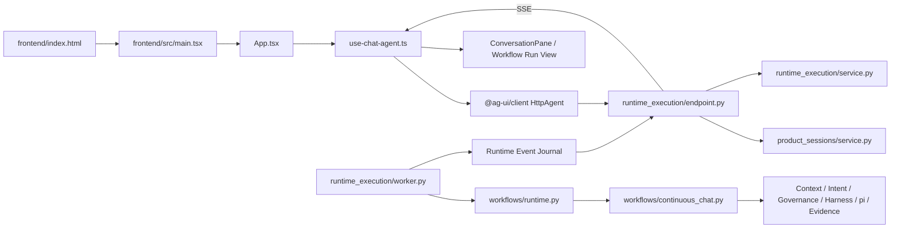

# Chat源码目录、文件职责与模块流程地图

**归档日期**：2026-07-30

**分类**：00-从这里开始

**定位**：把项目目录、OS进程、架构层、11产品模块、主要符号和运行流程连成一张可点击的源码地图

**关联源码**：`frontend/`、`backend/app/`、`backend/tests/`、`frontend/tests/`、`frontend/e2e/`、`scripts/`

## 问题

看到`backend/app/governance/service.py`、`frontend/src/use-chat-agent.ts`或`composition.py`时，怎样立即知道：

1. 它是什么类型的文件？
2. 由哪个进程加载？
3. 它属于架构哪一层、服务哪个产品模块？
4. 谁调用它，它又调用谁？
5. 它是否拥有产品事实或事务？
6. 文件过大时是否真的糅合，应怎样安全拆分？

## 回答：一个文件必须同时放进7个坐标中理解

```text
物理路径
+ 文件类型
+ 被哪个OS进程/浏览器加载
+ 架构层
+ 产品模块或运行责任
+ 主要输入/输出与上下游
+ 状态/事务所有权与测试证据
```

只看物理目录会得到错误结论。例如：

- `main.py`和`governance/service.py`都在`backend/app/`下，但前者是Web组装入口，后者是执行治理Application Coordinator。
- API、Execution Worker和Outbox Worker在开发模式可以同处一个Python进程，但它们的逻辑责任不合并。
- `App.tsx`是前端顶层组装容器，不因为它能看到Session/Workflow就拥有这些产品事实。

## 1. 先认文件类型

| 文件类型 | 人话职责 | Chat例子 | 不应该做什么 |
|---|---|---|---|
| 进程/部署入口 | 让Runtime知道从哪个符号开始 | `asgi.py`、`execution_worker.py` | 不实现产品状态机 |
| Application Factory | 创建Web App并注册协议表面 | `main.py` | 不变成所有业务的集合 |
| Composition Root | 创建对象并显式连依赖 | `composition.py` | 不拥有跨模块业务事务 |
| Lifecycle | 启动、对账、后台循环和关闭 | `lifecycle.py` | 不把导入模块偷偷变成运行进程 |
| HTTP/AG-UI Adapter | 解析DTO、调用应用合同、返回HTTP/SSE | `api/*_router.py`、`runtime_execution/endpoint.py` | 不直接编排数据库事务 |
| Application Coordinator | 拥有一个用例顺序、唯一事务和失败语义 | 多个`service.py`、`result_commit.py` | 不依赖React或FastAPI Request |
| Domain Contract/Rule | 状态机、Hash、类型和确定性规则 | `contracts.py`、`models.py`、`policy.py` | 不隐式读写数据库 |
| Query/Projection | 只读权威事实，生成稳定投影 | `queries.py`、`home/service.py`、`projections/service.py` | 不在查询中产生副作用 |
| Runtime/External Adapter | 把MAF、pi、Provider、Git、文件或子进程接入Chat合同 | `pi_runtime.py`、`git_inspector.py` | 外部返回不能直接写成产品完成事实 |
| React Page/Container | 组装Feature、布局和短期页面状态 | `App.tsx`、`home-view.tsx` | 不保存权威Product状态 |
| React Hook | 复用有生命周期的前端协调逻辑 | `use-chat-agent.ts` | 不把协议、恢复、表单与页面全部塞在一个Hook |
| Feature API | 把HTTP DTO映射成某个前端Feature的调用 | `features/session/session-api.ts` | 不写后端事务规则 |
| Test | 锁定合同、状态机、故障或真浏览器行为 | `backend/tests/`、`frontend/e2e/` | 不依赖其他测试的偶然导入顺序 |

## 2. 顶层目录：先判断什么是源码，什么不是

```text
Chat/
├─ frontend/                 # 浏览器代码与Node/Vite工具链
│  ├─ src/                    # 人写的TypeScript/TSX生产源码
│  ├─ tests/                  # Node环境的前端逻辑/合同测试
│  ├─ e2e/                    # Playwright真浏览器测试
│  ├─ node_modules/           # 生成：npm依赖，不手改
│  └─ dist/                   # 生成：生产构建资源，不手改
├─ backend/
│  ├─ app/                    # 人写的Python生产源码
│  ├─ tests/                  # pytest单元/合同/集成/故障测试
│  ├─ migrations/versions/    # Alembic数据库Schema演进源码
│  ├─ config.example.json     # 脱敏可提交模板
│  ├─ config.json             # 私有运行配置；不读入文档/输出/Git
│  └─ .data/                  # 受管Product Store、Artifact、Workspace等运行数据
├─ scripts/                  # 可重复启动、检查、验证、部署辅助
├─ deploy/                   # 部署配置与运行入口
├─ 概念空间/                 # 名称与边界治理，不是代码事实源
├─ 项目掌握/                 # 面向你的课程/调试实验，不是第二套架构状态
├─ pyproject.toml / uv.lock   # Python直接依赖声明 / 完整解析锁
└─ PROJECT_*.md / AGENTS.md   # 产品、状态、计划和开发治理
```

## 3. 一次点击发送的高频文件链



| # | 可点击文件/符号 | 文件类型 | 进程/运行位置 | 输入 → 输出 | 是否拥有产品事实 |
|---:|---|---|---|---|---|
| 1 | [`index.html`](../../frontend/index.html) | 前端HTML入口 | Vite提供，浏览器解析 | HTML → `root` + `main.tsx` module | 否 |
| 2 | [`main.tsx`](../../frontend/src/main.tsx) | 浏览器启动入口 | 浏览器JS Runtime | DOM root → React App | 否 |
| 3 | [`App`](../../frontend/src/App.tsx#L103) | React顶层组装容器 | 浏览器 | Feature投影/页面操作 → 布局/回调 | 否，只持有可重建投影 |
| 4 | [`App.submit`](../../frontend/src/App.tsx#L443) | React回调 | 浏览器 | 输入草稿/当前选择 → `send(...)` | 否 |
| 5 | [`useChatAgent.send`](../../frontend/src/use-chat-agent.ts#L247) | Agent生命周期Hook方法 | 浏览器 | text/control/workflow → AG-UI Request | 否 |
| 6 | [`runtime-config.ts`](../../frontend/src/runtime-config.ts) | 前端运行配置 | 浏览器/Vite构建 | env + origin → API/AG-UI URL | 否 |
| 7 | [`api-client.ts`](../../frontend/src/api-client.ts) | 统一HTTP错误/恢复边界 | 浏览器 | Fetch Response → typed result/ApiError | 否 |
| 8 | [`durable_agent_endpoint`](../../backend/app/runtime_execution/endpoint.py#L58) | AG-UI/SSE Adapter | FastAPI进程 | AGUIRequest → Job + StreamingResponse | 否，调用所有者Service |
| 9 | [`ProductSessionService.prepare_agui_run`](../../backend/app/product_sessions/service.py#L672) | Conversation应用协调方法 | API/Worker进程 | 经验证输入 → Message/Interaction/Run/Attempt | **是，当前用例事务** |
| 10 | [`RuntimeExecutionService.enqueue`](../../backend/app/runtime_execution/service.py#L100) | Run管理应用服务 | API进程 | AcceptedRun/endpoint/version → Job/Cursor/Event | **拥有Runtime运行事实** |
| 11 | [`ExecutionWorker.run_once`](../../backend/app/runtime_execution/worker.py#L141) | Worker运行协调器 | 内嵌Task或独立Worker进程 | 可领Job → Lease + Runner执行 | 拥有领取/租约运行事实，不拥有产品业务结论 |
| 12 | [`RuntimeRunnerRegistry.require`](../../backend/app/runtime_execution/worker.py#L61) | 进程内Runner目录 | Worker进程 | endpoint key → Runner | 否，不持久 |
| 13 | [`ProductAwareWorkflow.run`](../../backend/app/workflows/runtime.py#L120) | MAF/Product接合适配器 | Worker进程 | AG-UI投影 + Product IDs → MAF事件/产品终态候选 | 不单独成为事实源，通过Service提交 |
| 14 | [`continuous_chat.py`](../../backend/app/workflows/continuous_chat.py) | 39节点Executor行为集 | MAF Worker进程 | CollaborationState/节点输入 → 候选/Decision/结果 | 模型输出不是事实；确定性节点调所有者Service |
| 15 | [`RuntimeExecutionService.append_event`](../../backend/app/runtime_execution/service.py#L289) | Runtime Journal写入 | Worker进程 | AG-UI公开事件 → sequence/hash/cursor | **拥有Runtime Event事实** |
| 16 | [`event_stream`](../../backend/app/runtime_execution/endpoint.py#L85) | SSE异步生成器 | FastAPI进程 | Journal sequence → SSE bytes | 否，只读Journal |
| 17 | [`useChatAgent`订阅回调](../../frontend/src/use-chat-agent.ts#L178) | AG-UI前端投影 | 浏览器 | AG-UI事件 → messages/status/review | 否 |
| 18 | [`ConversationPane`](../../frontend/src/features/chat/conversation-pane.tsx#L78) | Chat视图 | 浏览器 | 前端投影 → DOM | 否 |

## 4. 后端Package地图：进程、层和产品模块

| 物理目录/文件 | 主要层/角色 | 服务的模块/保证 | 主要功能 | 常用测试证据 |
|---|---|---|---|---|
| [`asgi.py`](../../backend/app/asgi.py)、[`main.py`](../../backend/app/main.py)、[`composition.py`](../../backend/app/composition.py)、[`lifecycle.py`](../../backend/app/lifecycle.py) | Bootstrap/Web组装/进程生命周期 | 跨模块组装，不拥有产品状态 | 配置、依赖图、Router/Runner注册、启停 | `test_architecture_contract.py`、`test_app.py` |
| [`api/`](../../backend/app/api) | L2 HTTP Adapter | 所有Product REST模块的协议入口 | DTO、Problem Detail、request ID、Product Router | OpenAPI指纹、API合同测试 |
| [`product_sessions/`](../../backend/app/product_sessions) | Conversation Application/Store | Conversation、Product Run终态与Trace | Session/Message/Interaction/Run/Attempt、数据库、双Trace | Session合同、并发、重试/取消、终态门 |
| [`runtime_execution/`](../../backend/app/runtime_execution) | Run Management + Worker Runtime | 活动Run领取、断线续传和终态收敛 | Job/Lease/Epoch/Event/Cursor/Worker/Reconciler/SSE | 跨OS进程领取、断线、Cursor、Lease故障 |
| [`workflows/`](../../backend/app/workflows) | L5 MAF Adapter/Workflow | 受治理智能控制流 | Catalog、Factory、39节点、Checkpoint、ProductAwareWorkflow | Workflow版本/节点指纹、S1–S7、HITL恢复 |
| [`collaboration_contexts/`](../../backend/app/collaboration_contexts) | Context Application/Domain | 本轮采用什么信息 | ContextPackage/revision/来源采用 | Context revision、预算、失效 |
| [`collaboration_intents/`](../../backend/app/collaboration_intents) | Intent Application/Domain | 用户想完成什么 | Intent Set/revision/Clarification/组合Plan输入 | 多Intent、CAS、澄清 |
| [`collaboration_protocols/`](../../backend/app/collaboration_protocols) | Protocol Application/Domain | 本轮用什么协作方法 | Definition/Binding/Resolver/Projection | 作用域优先级、revision/hash |
| [`harness/`](../../backend/app/harness) | Collaboration Application/Domain | Project/Work/Plan/Action/Note/Memory权威事实 | 命令、查询、状态机、Context、Outbox | 长场景、CAS、幂等、事务回滚 |
| [`governance/`](../../backend/app/governance) | Execution Governance Application/Domain | 什么候可以执行/调模型/提交 | Policy/Evaluation/Request/Decision/Grant/Attempt/Outbox | Hash变异、一次性Grant、恢复/重投 |
| [`execution_dispatch/`](../../backend/app/execution_dispatch) | Execution Application/Workflow接合 | ExecutionDraft → RunSpec → 执行路由 | Draft/Spec、Repository Context、Validation Contract、Result Gate | revision/hash、路由、过期来源、规则编译 |
| [`project_resources/`](../../backend/app/project_resources) | Repository Resource Application/Adapter | Project关联的代码资源与新鲜度 | Root/Binding/Snapshot/Git Inspector/Context | 路径安全、只读Git指纹、Snapshot CAS |
| [`execution_workspaces/`](../../backend/app/execution_workspaces) | L6 Workspace Runtime | 隔离写入不污染活动仓库 | 受管worktree、生命周期、对账 | 路径、崩溃窗口、遗留对账 |
| [`readonly_tools/`](../../backend/app/readonly_tools)、[`tool_execution/`](../../backend/app/tool_execution) | L6 Tool Runtime/Ledger | 真实Tool能力、授权、副作用与对账 | read/grep/find/ls/edit、Operation/Attempt/Hash | 路径逃逸、参数篡改、幂等、结果未知 |
| [`pi_runtime.py`](../../backend/app/pi_runtime.py)、[`pi_gateway.py`](../../backend/app/pi_gateway.py)、[`pi_sessions.py`](../../backend/app/pi_sessions.py) | L6 External Runtime Adapter | 受治理pi子进程和Provider/Tool回调 | JSONL RPC、子进程、网关、运行Session归档 | RPC合同、权限、超时、进程丢失 |
| [`evidence/`](../../backend/app/evidence) | Evidence Application/Domain/Artifact Adapter | 结果为什么可信以及能否提交 | Artifact/Validation/Observation/Assessment/Claim/Result Commit | 篡改、来源失效、事务原子性、故障窗口 |
| [`step_inputs/`](../../backend/app/step_inputs) | Step Projection | 每个Agent/执行步骤只得到最小必要输入 | StepInputProjection | 范围、来源、能力、预算 |
| [`home/`](../../backend/app/home) | Read-only Product Projection | Home与时间导航的权威投影 | 今日继续、日历、资源搜索 | 空态、只读、不建第二事实源 |
| [`projections/`](../../backend/app/projections) | APP-PROJECTION Application/Adapter | 多角色、多前端共享同一Project事实 | Envelope、Workspace、Dossier、Obsidian Tree/ZIP | 来源revision、未知态、只读、可重建、路径与大小门 |
| [`observability/`](../../backend/app/observability) | Cross-cutting Diagnostics | 请求/运行可定位，且不泄密 | 日志、Metric、Trace、Readiness、Timeline | 脱敏、关联ID、诊断合同 |

## 5. 前端Feature地图：页面是投影和操作入口

第一次读下面这些文件前，先用[TypeScript、React与Chat前端基础](./TypeScript-React与Chat前端基础.md)补组件、
Props/State/Hook，再用[Vite、浏览器API与Chat网络调试基础](./Vite-浏览器API与Chat网络调试基础.md)补模块加载、
DOM/Event、Fetch/Storage、AG-UI流和DevTools；本节只负责文件责任地图，不重复两门基础课。

| 物理目录/文件 | 主要责任 | 对应后端/协议 | 它不拥有 |
|---|---|---|---|
| [`main.tsx`](../../frontend/src/main.tsx) | 把React App挂到`index.html#root` | Vite/浏览器 | 任何Product事实 |
| [`App.tsx`](../../frontend/src/App.tsx) | App Shell、Feature懒加载、当前导航/选择/发送组装 | 多个Feature API + `useChatAgent` | Session/Run/Work权威状态 |
| [`features/chat/`](../../frontend/src/features/chat) | 对话展示、输入和活动Run重连策略 | AG-UI + Runtime Event重放 | 最终Run终态 |
| [`features/session/`](../../frontend/src/features/session) | Session DTO/API、定位码、侧边栏 | Product Session REST | 服务端历史与授权 |
| [`features/workflow/`](../../frontend/src/features/workflow) | Workflow目录、思维导图、路由原因、节点详情、双Trace | Workflow Catalog/Trace/AG-UI Step | MAF Checkpoint或历史路径推断权 |
| [`features/harness/`](../../frontend/src/features/harness) | Project/Work/Knowledge/Context/Repository的可读投影和命令表单 | Harness/Context/Repository REST | Project/Work/Memory权威事实 |
| [`features/governance/`](../../frontend/src/features/governance) | ExecutionDraft/HITL API | Governance/Execution Dispatch REST | Grant/Approval权威记录 |
| [`features/model-call-review/`](../../frontend/src/features/model-call-review)与[`model-call-review.tsx`](../../frontend/src/model-call-review.tsx) | 完整Provider请求可读/高级编辑 | ModelCallDraft REST + AG-UI Resume | 真实Provider发送权 |
| [`features/agents/`](../../frontend/src/features/agents) | Agent Profile配置投影 | Agent Profile REST | 活动MAF Agent Session |
| [`features/tools/`](../../frontend/src/features/tools) | Tool Profile与运行概要投影 | Tool Configuration/Execution REST | Tool执行授权与副作用事实 |
| [`features/protocols/`](../../frontend/src/features/protocols) | 协作方法Definition/Binding投影 | Collaboration Protocol REST | 当前Run已生效的revision推断权 |
| [`features/home/`](../../frontend/src/features/home) | Home、Activity Rail、日历和资源入口 | Home只读投影 | 独立日历/项目事实 |
| [`features/projections/`](../../frontend/src/features/projections) | Projection类型化客户端合同 | APP-PROJECTION REST/ZIP | Product事实、服务器Vault写入 |
| [`features/workspace/`](../../frontend/src/features/workspace) | 生活/工作/学习/研究Personal Workspace | Workspace Envelope | Project/Work权威状态 |
| [`features/projects/`](../../frontend/src/features/projects) | Project Dossier、角色责任和Obsidian预览/下载 | Dossier/Tree/ZIP | 直接编辑Owner表或把Markdown当事实源 |
| [`features/mobile/`](../../frontend/src/features/mobile) | 移动导航、网络状态和Session草稿 | 同一REST/AG-UI合同 | 移动专用第二事实源 |
| [`features/settings/`](../../frontend/src/features/settings) | Session与System配置显示 | Settings/health/Product REST | 后端密钥和完整配置 |
| [`features/shared/`](../../frontend/src/features/shared) | 真正跨Feature的UI边界 | 例如Feature Error Boundary | 不变成万能`utils` |

## 6. 文件规模审查：当前事实，不美化

项目规范的审查线是：Python/TypeScript模块800行，React组件或Hook 500行，函数/方法 80行。
这些是**必须说清职责的信号**，不是自动切文件指令。

### 6.1 2026-07-30后端超线快照（13个）

| 文件 | 行数 | 当前职责审查 | 候选切缝（不是已批准重构） | 必须保护 |
|---|---:|---|---|---|
| [`workflows/continuous_chat.py`](../../backend/app/workflows/continuous_chat.py) | 3413 | 39节点的大部分Executor行为仍集中 | 按真实能力簇拆Context/Intent-Plan/Dispatch/Result Commit执行器；不仅为S1–S7教学编号拆 | 39节点ID/43边、Checkpoint合同、Reason Code、事件顺序 |
| [`governance/service.py`](../../backend/app/governance/service.py) | 2840 | Policy/Decision/Grant/Model Attempt等多用例协调 | 按事务与状态机分为Decision/Grant、ModelCall、Run终态协调器 | 一次性Grant、Binding Hash、Outbox/Trace原子性、恢复幂等 |
| [`harness/service.py`](../../backend/app/harness/service.py) | 2003 | Project/Work/Plan/Action/Note/Memory命令与跨对象事务 | 先判断哪些用例是独立聚合事务，再提取命令协调器；不Repository-per-table | CAS、长场景、Outbox/Trace同事务、Result Commit旁路封闭 |
| [`model_call_review.py`](../../backend/app/model_call_review.py) | 1749 | Draft规范化、Provider转换/验证/传输 | 按Canonical Draft/Protocol Compiler/Transport适配的真实变化原因拆 | 审批字节=Hash=实际发送Body、双协议指纹 |
| [`product_sessions/service.py`](../../backend/app/product_sessions/service.py) | 1689 | Session/Message/Run/Attempt/Trace多类Conversation用例 | 查询投影已可提取；命令拆分要保持输入接纳和终态原子性 | 服务端唯一历史、ordinal、Retry血缘、无假Assistant成功 |
| [`execution_dispatch/service.py`](../../backend/app/execution_dispatch/service.py) | 1581 | Draft/Spec/授权/路由/执行准备 | 按Draft生命周、RunSpec编译、Dispatch协调等独立用例审查 | revision/hash失效、不可变RunSpec、业务路由 |
| [`evidence/service.py`](../../backend/app/evidence/service.py) | 1513 | 15表Evidence记录层的跨聚合不变量 | **当前已有邻近Docstring记录不拆原因**；需先证明不变量能独立再拆 | Claim Hash、跨Scope引用、sequence并发、事务原子性 |
| [`pi_runtime.py`](../../backend/app/pi_runtime.py) | 1214 | 子进程/RPC/对话边界/运行终态 | 按Process Transport、活动Execution Registry、事件归约审查 | 进程所有权、超时/取消/结果未知、Checkpoint窄重挂接 |
| [`execution_dispatch/workflow.py`](../../backend/app/execution_dispatch/workflow.py) | 1146 | MAF执行草稿/授权/RunSpec节点 | 按Executor与纯转换规则拆，但保持节点合同 | MAF节点ID、Interrupt、Approval Hash、输入/输出类型 |
| [`evidence/result_commit.py`](../../backend/app/evidence/result_commit.py) | 967 | Result Commit单事务完整门 | 大但可能必须共同演进；只提取纯校验规则，不切开唯一提交事务 | 已批准§11步顺序、一次性Receipt、完成门fail closed |
| [`runtime_execution/service.py`](../../backend/app/runtime_execution/service.py) | 904 | Job/Event/Cursor/Lease/终态收敛 | 可按命令与只读投影拆；已有Worker边界 | sequence/hash、epoch fence、Product/Runtime终态两事务对账 |
| [`collaboration_intents/service.py`](../../backend/app/collaboration_intents/service.py) | 891 | Intent Set/Clarification/Plan输入用例 | 分开纯Intent规则、查询投影和命令协调候选 | revision/CAS、最多4目标、跨Run Clarification |
| [`config.py`](../../backend/app/config.py) | 815 | 多类运行配置解析与验证 | 可按Provider、Runtime/Storage和Frontend/Server配置分簇，但启动快照仍统一 | 私密脱敏、启动时不可变快照、Provider目录交叉校验 |

### 6.2 2026-07-30前端超线快照（6个）

| 文件 | 行数 | 当前风险/候选切缝 | 必须保护 |
|---|---:|---|---|
| [`features/harness/context-inspector.tsx`](../../frontend/src/features/harness/context-inspector.tsx) | 955 | 加载/编辑状态、来源投影和多种操作界面混在一文件；候选拆纯投影、来源列表和命令表单 | revision/hash、采用/排除语义、移动交互 |
| [`App.tsx`](../../frontend/src/App.tsx) | 799 | App Shell仍协调Session/发送/Workbench/多Feature；已回到架构测试`<800`指纹内但仍越过React组件500行审查线 | Feature懒加载、发送语义、焦点/窄屏、不回流Product事实 |
| [`model-call-review.tsx`](../../frontend/src/model-call-review.tsx) | 703 | 容器仍持有草稿编辑/保存/审批与视图组装；字段编辑器已拆出 | 可读视图=JSON=Hash=发送Body，未保存不得批准 |
| [`harness-workbench.tsx`](../../frontend/src/harness-workbench.tsx) | 594 | 多Harness资源面板与选择协调；候选将资源命令表单按Feature内边界拆 | 同一权威投影、导航不复制事实 |
| [`features/home/home-view.tsx`](../../frontend/src/features/home/home-view.tsx) | 544 | Home多投影组合；当前可先审计纯卡片与页面协调分界 | 真实空态、Activity Rail同步样式所有权、无假进度 |
| [`product-decision-review.tsx`](../../frontend/src/product-decision-review.tsx) | 519 | 多类Product Decision卡与提交状态；候选拆纯卡片/决策控件 | request hash/row version、决策与后果文案 |

**当前不在这一轮盲拆这些文件。** 工作树中`App.tsx`、`use-chat-agent.ts`、Runtime endpoint/Worker等存在其他未收口改动；
要重构必须先得到干净行为指纹、确认事务/状态所有者，然后跑合同、状态机、生产构建和相关E2E。

## 7. 什么才是合理的文件拆分

### 7.1 不按行数切

错误做法：

```text
2000行service.py
→ service_part1.py
→ service_part2.py
→ helpers.py
```

这只是把同一职责分散到更多文件，还可能新增循环依赖和跳转成本。

正确问法：

1. 这个文件中有几类状态所有者？
2. 有几个用例事务负责人？
3. 哪些规则是纯函数，可不带数据库独立测试？
4. 哪些查询只生成投影，不应该留在命令Service里？
5. 哪些外部适配会因为Provider/Git/MAF版本变化而单独变？
6. 拆出后是否仍只有一个协调器开启/提交该用例事务？

### 7.2 一个合格拆分候选必须先有这张卡

| 字段 | 必须写什么 |
|---|---|
| 用户场景 | 哪个真实功能/故障正在被文件规模妨碍 |
| 当前职责 | 文件内实际存在的命令、查询、规则、投影、适配器 |
| 候选新边界 | 独立所有权/事务/失败/变化原因，不是“大概各一半” |
| 唯一事务所有者 | 拆前/拆后谁开始并提交事务 |
| 不变量 | Schema、状态机、CAS、Hash、Workflow节点/边、事件、错误与用户语义 |
| 依赖方向 | 新模块允许依赖谁，谁绝对不能反向依赖 |
| 验证 | 依赖测试、合同指纹、状态机、数据库回滚、生产构建、受影响SC/E2E |

## 8. 新功能应该怎样找文件落点

假设未来要给Product Session增加“标签”，不要先打开`App.tsx`加一个数组。应该按这个顺序：

```text
1. 用户场景：创建/删除标签，用标签筛Session，刷新后仍存在
2. 事实所有者：Conversation / Product Session
3. 领域与存储：对象、revision/CAS、Schema与迁移
4. 应用用例：谁开事务，标签重复/并发/归档时如何处理
5. REST DTO/Router：命令与查询协议
6. 前端Feature API：网络DTO与错误处理
7. Session界面：投影与操作，不复制权威标签库
8. 测试：状态机/CAS/API/刷新/E2E，必要时Trace
```

再假设“把结果送到Telegram”，事实所有者就不是Conversation或`App.tsx`，而是目标Delivery模块 +
Telegram Channel Adapter。它还需要Channel Binding、Outbox、Attempt、Receipt和失败重试/结果未知语义。

## 9. 代码注释应该怎样帮你，又不污染源码

好注释在你点进文件时回答3个问题：

1. 我在整条链的哪里？
2. 这个函数/类拥有什么，明确不拥有什么？
3. 最容易被“简化”破坏的事务、Hash、恢复或安全不变量是什么？

不好的注释是“创建app”、“循环处理”、“返回result”这种语法翻译。完整的教材放在本知识库；
生产源码只放“恢复当地上下文”所需的精炼Docstring/JSDoc和不变量注释。

本轮已先在下列干净、高频入口补这类注释，不触碰正在有其他改动的`App.tsx`、Runtime endpoint/Worker等文件：

- [`backend/app/asgi.py`](../../backend/app/asgi.py)
- [`backend/app/main.py`](../../backend/app/main.py)
- [`backend/app/composition.py`](../../backend/app/composition.py)
- [`backend/app/lifecycle.py`](../../backend/app/lifecycle.py)
- [`frontend/src/main.tsx`](../../frontend/src/main.tsx)

## 10. 掌握验收

1. 为什么“目录”、“产品模块”、“架构层”、“OS进程”和“Python/TS模块”不是一套分类？
2. `main.py`、`composition.py`和`lifecycle.py`为什么分开？各自的变化原因是什么？
3. Router、Application Coordinator、Domain Rule、Query Service和Adapter分别应该放什么？
4. `App.tsx`能看到Session和Run投影，为什么仍不拥有Product Session/Run事实？
5. 为什么Execution Worker可以在同一FastAPI进程中作为Task，却仍是独立运行责任？
6. 从`App.submit`到`ConversationPane`，能否不搜索地沿本文18个落点复述一轮？
7. 看到一个1200行文件时，除了行数，还要收集哪些证据才能提出拆分？
8. 给你“Session标签”需求，能否按事实所有者说出后端到前端的文件类型和测试顺序？

## 关键文件

| 文件 | 职责 |
|---|---|
| [工程编码与模块设计规范](../../docs/engineering-standards.md) | 规模线、事务所有权、注释和重构验证的权威规则 |
| [应用组合根ADR](../../docs/adr/0001-application-composition-and-process-entrypoints.md) | `main/composition/lifecycle/asgi`分开的已接受决策 |
| [`coverage-manifest.json`](../coverage-manifest.json) | 全部后端/前端源码面与28学习单元的机器映射 |
| [`test_architecture_contract.py`](../../backend/tests/test_architecture_contract.py) | 依赖、事务边界、Schema/OpenAPI指纹与部分前端规模合同 |

## 补充记录

- 2026-07-30：使用当前工作树`wc -l`快照列出13个后端与6个前端超线文件；Project Dossier按“页面协调/纯展示”真实边界拆为367行与227行，Projection Composer再把Personal Workspace纯规则拆到84行模块并降至761行；行数只是审查信号，其他候选切缝仍待逐个设计与回归验证。
