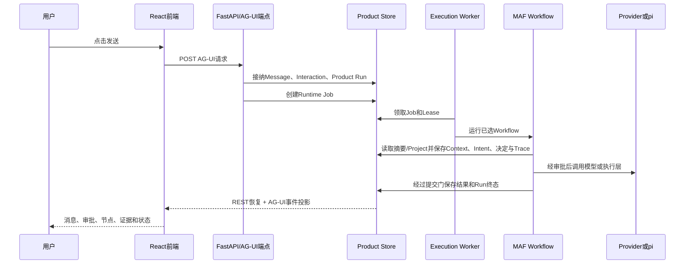

# Chat系统总地图与学习方法

**归档日期**：2026-07-29
**更新日期**：2026-07-30
**分类**：00-从这里开始
**关联源码**：

- [前端发送编排](../../frontend/src/App.tsx)
- [AG-UI客户端Hook](../../frontend/src/use-chat-agent.ts)
- [AG-UI耐久端点](../../backend/app/runtime_execution/endpoint.py)
- [Execution Worker](../../backend/app/runtime_execution/worker.py)
- [ProductAwareWorkflow](../../backend/app/workflows/runtime.py)
- [持续协作主Workflow图](../../backend/app/workflows/continuous_chat_factory.py)
- [持续协作节点行为](../../backend/app/workflows/continuous_chat.py)
- [Product Session服务](../../backend/app/product_sessions/service.py)

## 问题

怎样让第一次接触Agent系统的人，不靠背诵“阶段A、节点3、ContextPackage”等词，逐步掌握Chat的
产品设计、架构、运行链、数据库和代码，并能够亲手调试、修改和验证？

## 回答

结论：**以后不再从39个节点或项目阶段开始学，而是固定一条真实Product Run作为“标本”，从用户
点击发送开始，依次观察浏览器、HTTP、Product Store、Runtime Job、MAF Workflow、Provider/pi、
产品提交和页面恢复。** 每个专题都重复同一套6步：讲清问题、看具体对象、追代码、下断点、查存储、
自己复述。

本文从“系统地图”开始，但不再默认读者已经懂前后端。如果你还不能解释Node/Vite、Python/Uvicorn、进程/端口和
HTTP/JSON/SSE，先完成[从C++到Chat：前后端怎样跑起来](./从C++到Chat前后端怎样跑起来.md)的30分钟实验。

## 1. 先把5张容易混淆的图分开

它们回答的是5个不同问题，不能互相代替：

| 图 | 回答什么 | 例子 |
|---|---|---|
| 产品架构图 | 谁负责什么、事实归谁 | Conversation拥有消息；Context拥有本轮上下文；MAF不拥有Project |
| 对象生命周期图 | 一个对象谁创建、保存、修改和消费 | ExecutionDraft从候选revision变成已授权RunSpec |
| Workflow运行图 | 一次Run先做什么、后做什么、在哪里分支 | `input_acceptance -> context_candidates -> ...` |
| 代码地图 | 上述责任落在哪些目录、类和函数 | `product_sessions/`、`HarnessService`、`ProductAwareWorkflow` |
| 交付计划 | 哪些能力先开发、哪些以后开发 | `PROJECT_PLAN.md`阶段0-8 |

因此，“节点3会保存ContextPackage”只是在回答**一次Run走到第三个MAF节点时发生什么**，它没有单独
回答ContextPackage为何存在、属于哪个模块、保存在哪里，也没有说明整个系统架构。

## 2. 用一个具体输入认识整个系统

假设你昨天聊过“怎样掌握Chat的Context代码”，今天输入：

> 继续昨天的ContextPackage，先讲原理，不要修改项目。

当前实现的主链可以先压缩成下面9步：

这条链中最重要的判断是：**界面、MAF和模型都不是最终事实源。** 它们分别负责操作、运行和生成；
需要跨刷新、跨进程、跨天可信存在的产品事实由Product Store保存。

## 3. 一次当前主Workflow中必须先分清的5种“状态容器”

这里的5种是为了第一次跟踪当前主Workflow而选出的最小学习集，不是Chat全部状态位置的数量。它们分别回答：产品长期承认什么、当前图内传递什么、图暂停在哪里、Worker/前端如何续接，
以及页面当前投影什么。Tool Ledger、Artifact Store、Git Workspace、pi Session和Provider外部状态会在相应执行场景再加入。

若要看全部故障现场，使用[进程、协议与Store为什么必须分开](../架构与模块/进程协议与Store为什么必须分开.md)的10个状态位置清单；若要看核心持久化责任，使用[七层架构中的5类逻辑Store](../架构与模块/Chat总体架构与一次点击的七层链路.md#93-5类核心状态位置)。

### 3.1 Product Store：产品账本

保存用户以后还要找回、审核或追责的事实，例如Product Session、Message、Product Run、
ContextPackage、Decision、Work、Evidence。当前物理实现从SQLite起步。

### 3.2 CollaborationState：本次Workflow的工作台

它是39个MAF节点之间传递的Python对象。里面有本轮Prompt、已选摘要、ContextPackage ID、Intent、
RunSpec ID和候选结果。它不是数据库，也不是长期记忆；正式对象先写Product Store，再把ID或必要投影
放回这个工作台。

### 3.3 MAF Checkpoint：Workflow暂停位置

保存MAF图跑到哪里、哪个Executor暂停以及恢复所需运行时状态。它不能替代Product Session历史，
也不能单独证明用户批准过什么。

### 3.4 Runtime Job与Event Journal：谁在执行、前端错过了什么

Job、Lease和Epoch解决Worker领取与失联；事件Journal让浏览器断线后按Cursor补回公开AG-UI事件。
它们不拥有Project、Work或最终Assistant Message。

### 3.5 React状态：当前页面看到什么

前端保存导航、弹窗、输入草稿和服务端投影。刷新后必须从REST、Product Trace和Runtime事件重建，
不能因为页面上显示“完成”就把它当成后端事实。

## 4. 39个节点该怎样学

39个节点不是39个互不相关的概念。当前唯一学习分组来自代码
`CONTINUOUS_WORKFLOW_LEARNING_STAGES`：

1. **S1 输入接纳与目录级上下文（节点1–5）**：输入、摘要候选和directory Context。
2. **S2 意图、Project绑定与详情上下文（节点6–15）**：Intent Set、权威绑定、detail Context和协议。
3. **S3 场景路由与可选规划（节点16–20）**：目录查询、澄清、规划或直接形成执行合同。
4. **S4 执行草稿、授权与运行路由（节点21–24）**：Draft、Hash、Grant、RunSpec和三路执行。
5. **S5 pi执行、Workspace与Evidence（节点25–31）**：只读/隔离编辑、Artifact、Validation和Claim。
6. **S6 响应、摘要与提交决定（节点32–36）**：Response、Summary与Result/Work/Memory分别决定。
7. **S7 产品事实写入与本轮终态（节点37–39）**：幂等提交、TurnSummary和最终化。

它们不是`PROJECT_PLAN`的阶段0–8，不是Context的`directory/detail`两步，也不是单模型审批Workflow的
12个代码阶段。

学习时不要一次背39个节点。每次只追一条路径，并问5个固定问题：

1. 本节点收到的具体对象是什么？
2. 它读了哪个权威来源？
3. 它产生的是候选、运行时状态还是正式产品事实？
4. 失败或重启时靠什么恢复？
5. 下一个消费者是谁？

## 5. 统一学习法：一个主题必须交付6份证据

| 证据 | 你要看到什么 | 不合格示例 |
|---|---|---|
| 具体场景 | 一条真实输入和预期结果 | “节点3处理Context” |
| 对象样本 | 一份脱敏JSON或数据库行 | 只写字段名 |
| 因果解释 | 没有它会发生的真实错误 | “为了可扩展” |
| 代码链 | 按时间排序的类/函数/调用 | 只列目录 |
| 运行观察 | 断点变量、SQL、Trace与预期现象 | 只说“可以调试” |
| 掌握验收 | 复述题或小改动实验 | 读完即算掌握 |

掌握程度分3级：

- **L1 能讲懂**：能用自己的话解释对象、边界和设计原因。
- **L2 能定位**：给一个Product Run ID，能在前端、代码、数据库和Trace找到它。
- **L3 能安全修改**：能预测受影响的状态、Hash、恢复和测试，并用质量门证明没有破坏不变量。

## 6. 推荐学习顺序

| 顺序 | 主题 | 完成标志 | 当前入口 |
|---:|---|---|---|
| 1 | 前后端运行基础 | 能从源码说到进程、端口、请求与页面重绘 | [从C++到Chat](./从C++到Chat前后端怎样跑起来.md) |
| 2 | 系统总地图 | 能区分架构、Workflow、代码和计划 | 本文 |
| 3 | 七层架构与11模块 | 能说清各层/模块的状态所有权 | [总体架构链路](../架构与模块/Chat总体架构与一次点击的七层链路.md)、[11模块](../架构与模块/11个产品模块的职责与代码落点.md) |
| 4 | 核心对象 | 能回答谁创建、保存、修改、消费 | [核心对象词典](../架构与模块/核心对象词典-谁创建谁保存谁消费.md) |
| 5 | 一次消息的外层链路 | 能从React追到ProductAwareWorkflow | [从用户点击发送到pi执行](../执行层与pi运行时/从用户点击发送到pi执行的完整链路.md) |
| 6 | Product Session与数据库 | 能解释消息为何不是MAF保存 | [前端会话面板的数据来源](../Session与状态持久化/前端会话面板的数据来源与保存形式.md) |
| 7 | Context与回合沉淀 | 能区分Message、TurnSummary、ContextPackage、Memory | [Context专题](../Context与回合沉淀/recent_turn_summaries与ContextPackage为什么存在.md) |
| 8 | 主Workflow S1–S7 | 能画出8种路径并逐阶段定位代码 | [39节点设计](../Workflow架构与ProductAwareWorkflow/持续协作主Workflow的39节点设计.md) |
| 9 | pi、Tool与Evidence | 能追到子进程、Operation、Artifact、Claim和对账 | [S5教材](../Workflow架构与ProductAwareWorkflow/学习阶段S5-pi执行Workspace与Evidence.md) |
| 10 | Runtime恢复与Trace | 能区分Resume、重连、接管和最终化 | [Trace专题](../Trace与可观测性/每轮双Trace如何保存、分析与可视化.md) |
| 11 | 安全改一个功能 | 能写影响分析、测试并通过质量门 | 待补综合实验 |

## 7. 第一个实际练习

完成前后端运行基础和本文总地图后，直接做[第1课：从点击发送到ContextPackage](../调试实战/第1课-从点击发送到ContextPackage.md)：

1. 用VS Code启动`Chat Full Stack`。
2. 在8个符号上设置断点。
3. 发送一条与上一轮主题有关的消息。
4. 观察`recent_turn_summaries`从数据库行变成内存候选。
5. 观察ContextPackage怎样生成Header、Item、revision和hash。
6. 用只读SQL核对刚才看到的对象。

完成后再阅读39节点表，里面的“节点1-5”会从抽象名词变成你亲眼见过的一次状态变化。

## 8. 当前实现与目标系统要分开

本文描述的是当前主链已经存在的骨架，但不表示全部目标能力完成。当前仍未完整兑现的部分包括真实
Identity、多端并发完整矩阵、通用外部Tool副作用对账、任意Workflow/pi跨进程恢复、Evidence失效传播、
可靠Delivery和超级管理员运营看护。判断“代码是否已实现”始终回到`PROJECT_STATE.md`，不能从目标
架构图或概念定义反推。

## 关键文件

| 文件 | 职责 |
|---|---|
| [从C++到Chat：前后端怎样跑起来](./从C++到Chat前后端怎样跑起来.md) | 本文之前的运行时、进程、网络和启动前置课 |
| [PROJECT_CONTEXT.md](../../PROJECT_CONTEXT.md) | 稳定产品问题、目标、对象和边界 |
| [PROJECT_STATE.md](../../PROJECT_STATE.md) | 当前已经实现与尚未实现的事实 |
| [continuous_chat_factory.py](../../backend/app/workflows/continuous_chat_factory.py) | 39节点图如何接线 |
| [continuous_workflow_learning.py](../../backend/app/continuous_workflow_learning.py) | S1–S7唯一学习分组 |
| [continuous_chat.py](../../backend/app/workflows/continuous_chat.py) | 节点实际行为 |
| [continuous_chat_contracts.py](../../backend/app/workflows/continuous_chat_contracts.py) | 节点间传递的运行时状态合同 |
| [runtime.py](../../backend/app/workflows/runtime.py) | MAF运行与Product Run生命周期接合 |
| [service.py](../../backend/app/product_sessions/service.py) | Product Session、Message、Run和终态事务 |

## 补充记录

- 2026-07-30：明确“5种状态容器”是当前主Workflow的最小学习集，不是全系统状态位置总数；补充与5类核心逻辑Store及10个故障现场的导航。
