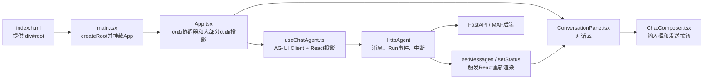

# TypeScript、React与Chat前端基础：从C++代码到会读页面

**归档日期**：2026-07-30

**适合读者**：会一点C++，但没写过JavaScript、TypeScript和React

**学完目标**：能从`index.html`走到`main.tsx`、`App.tsx`、`ConversationPane`、`ChatComposer`和`useChatAgent`，知道一处状态变化为什么会让页面重新显示

## 0. 先给你一张不会迷路的图



把它先类比成C++桌面程序：

- `index.html`像系统给你的一个空窗口句柄。
- `main.tsx`像`main()`，创建UI根对象。
- React组件像“根据输入和状态生成界面”的函数，不是长期运行的线程。
- `Props`像调用函数时传入的只读参数。
- `State`像React代管的成员变量；调用`setXxx`后，React重新调用组件函数计算界面。
- Hook像只能在React组件里按固定规则使用的状态/生命周期能力，不是C++的Hook函数或虚函数。

## 1. JavaScript、TypeScript、TSX、React分别是什么

| 名词 | 通俗解释 | 在本项目里 | 它不是什么 |
|---|---|---|---|
| JavaScript | 浏览器真正执行的语言 | 编译后的前端代码 | 不是Java |
| TypeScript | 在JavaScript上增加静态类型检查 | `frontend/src/*.ts` | 浏览器不会直接执行类型；类型在构建后被擦除 |
| TSX | TypeScript文件里允许写类似HTML的界面语法 | `*.tsx` | 不是后端模板，也不是浏览器原样执行的HTML |
| React | 用“组件 + 状态”描述界面的库 | `App`、`ConversationPane`等 | 不是Web服务器，不保存产品权威事实 |
| React DOM | 把React计算出的界面更新到浏览器DOM | `createRoot(...).render(...)` | 不是后端数据库 |

当前锁定版本来自[`frontend/package.json`](../../frontend/package.json)：React `19.2.7`、TypeScript
`6.0.3`。版本会升级，所以以后先看这个文件，别背版本号。

### 1.1 为什么不直接写JavaScript

后端返回的JSON在网络上传输时没有TypeScript类型。我们仍然在前端写：

```ts
interface Health {
  status: string;
  runtime_mode: "bootstrap" | "model";
  model: string | null;
}
```

它的作用像C++头文件：开发时检查“字段名和可选状态有没有写错”。但必须同时记住：

1. `interface`不会随HTTP请求发送。
2. 浏览器收到的JSON可能不符合它。
3. 重要外部数据仍要做运行时校验；例如[`api-client.ts`](../../frontend/src/api-client.ts)的
   `isApiProblem`会用`typeof`检查真实值。

## 2. 读懂本项目最少需要的TypeScript语法

### 2.1 `const`、对象和数组

```ts
const run = { id: "run-1", status: "running" };
const runs = [run];
const newerRun = { ...run, status: "succeeded" };
```

`const`表示变量绑定不能改指向，不代表对象内部绝对不可变。`...run`是把字段展开到新对象里。Chat前端常创建新数组、
新对象，因为React靠引用变化判断投影是否更新。不要在不清楚所有权时直接修改`agent.messages[0]`。

### 2.2 函数、箭头函数和闭包

```ts
const send = useCallback(async (content: string) => {
  await agent.runAgent({ runId: createClientId() });
}, [agent]);
```

- `(content: string)`是参数及类型。
- `async`函数总是返回`Promise`，类似“将来才有结果”的任务句柄。
- `await`暂停当前异步函数，不会阻塞整个浏览器UI线程等待网络。
- 函数会“记住”创建它时可见的变量，这叫闭包；因此Hook依赖数组不能随意漏写。

### 2.3 `interface`、`type`、联合类型、泛型

```ts
type RunStatus = "idle" | "running" | "awaiting_approval" | "error";

interface CheckedResponse<T> {
  data: T;
  requestId: string;
}
```

- 联合类型让状态只能是列出的值，像更灵活的`enum`。
- `T`是泛型占位符，类似C++模板参数。
- `null`、`undefined`和字段不存在是三件不同的事；项目启用了`strict: true`，不能假装它们都有值。

### 2.4 `import`和`export`

```ts
import { useState } from "react";
import { useChatAgent } from "./use-chat-agent";
export function ConversationPane() {}
```

它类似C++的声明与链接，但由ES Module和Vite处理。`import type`只导入类型，构建后不会产生运行时代码。
`package.json`中的`"type": "module"`说明本项目采用ES Module。

## 3. React组件到底怎样运行

组件本质是函数：输入Props，读取State，返回一棵React元素树。

```tsx
function RunBadge({ status }: { status: string }) {
  return <span>{status}</span>;
}
```

浏览器第一次显示和每次相关状态变化时，React都可能再次调用它。这里有3条新手必须守住的规则：

1. 渲染函数里不要直接写数据库、发送HTTP或启动定时器。
2. 不要因为函数又执行了一次，就认为后端Run又执行了一次。
3. React开发环境的`StrictMode`会帮助暴露不安全副作用，某些初始化/Effect可能被额外检查；代码必须可清理、可重复。

本项目入口就在[`main.tsx`](../../frontend/src/main.tsx)：浏览器找到`div#root`后执行
`createRoot(rootElement).render(<App />)`。

## 4. Props：父组件把数据和动作交给子组件

[`ConversationPane.tsx`](../../frontend/src/features/chat/conversation-pane.tsx)的Props同时包含：

- 数据：`messages`、`status`、`latestRun`、`networkStatus`。
- 动作：`onSubmit`、`onStop`、`onRetry`、`onChangeDraft`。

子组件能调用`onSubmit()`，但不知道一次提交怎样穿过AG-UI。这样拆的原因是：对话区负责展示和交互，`App`负责把
页面、Product Session和Agent Hook协调起来。若让每个按钮自己请求后端，状态和恢复语义会散落各处。

沿源码读一次：

```text
App中的submit
-> 作为onSubmit传给ConversationPane
-> 再传给ChatComposer
-> <form onSubmit={...}>
-> 回到App.submit
-> 调useChatAgent返回的send
```

这就是为什么断点停在`send`时，“上一跳”不一定写在同一个文件。

## 5. State：页面为什么自己变了

[`App.tsx`](../../frontend/src/App.tsx)里有：

```ts
const [draft, setDraft] = useState("");
const [activeRuns, setActiveRuns] = useState<ProductRun[]>([]);
```

`useState`返回当前值和更新函数。`setDraft("递归是什么")`不会像普通赋值那样只改局部变量，而是通知React：
“这棵组件树需要用新状态再算一次”。

当前前端状态必须分成4类看：

| 状态 | 例子 | 所有者 | 刷新后怎样恢复 |
|---|---|---|---|
| 临时输入/界面 | `draft`、侧栏开关 | React/浏览器 | 草稿可从`localStorage`恢复；开关通常重置 |
| AG-UI交互投影 | `messages`、`pendingReview`、`status` | `HttpAgent`投影到React | 从Runtime事件或后端历史重新水合 |
| 产品事实投影 | `ProductSession`、`ProductRun`列表 | 后端Product Store | REST重读 |
| 权威产品事实 | 已提交消息、Run终态、Decision | 后端数据库 | 前端不能直接拥有或伪造 |

[`ui-store.ts`](../../frontend/src/ui-store.ts)中的Zustand只保存页面Chrome的`systemDialogOpen`。源码注释明确规定：
Message、Run和共享Agent状态不能搬进第二套前端Store。

## 6. 5个常用Hook，在Chat里各做什么

| Hook | 通俗含义 | 当前实例 |
|---|---|---|
| `useState` | 保存一次渲染到下一次渲染之间的页面状态 | `draft`、`health`、`pendingReview` |
| `useEffect` | 渲染完成后连接外部世界，并在失效时清理 | 订阅AG-UI、监听键盘、读取健康状态 |
| `useCallback` | 在依赖不变时保留函数身份 | `send`、`approve`、`hydrateSession` |
| `useMemo` | 依赖不变时复用计算结果 | 筛选可选择Workflow |
| `useRef` | 保存可变值但不靠它触发重绘 | 当前AG-UI Run ID、DOM滚动锚点 |

### 6.1 `useEffect`为什么必须返回清理函数

[`use-chat-agent.ts`](../../frontend/src/use-chat-agent.ts)订阅`agent.subscribe(...)`，Effect结束时执行：

```ts
subscription.unsubscribe();
agent.abortRun();
```

否则组件卸载又重建后，旧订阅还在，同一个事件可能更新两次，甚至泄漏Run。它很像C++ RAII析构清理，但触发时机由
React生命周期管理。

### 6.2 `useRef`和`useState`的选择

`activeAguiRunId.current`变化不需要立刻重画页面，所以用Ref；`status`变化要把“发送”按钮变成“停止”，所以用State。
判断标准不是“值重不重要”，而是“值变化是否应该触发界面重算”。

## 7. TSX不是字符串模板

```tsx
{messages.map((message) => (
  <MessageBubble key={message.id} message={message} />
))}
```

- `{...}`进入JavaScript表达式。
- `map`把每条消息变成一个组件。
- `key`帮助React识别同一条消息；不能随意用数组下标替代稳定ID。
- `<MessageBubble />`最终会被React转成元素描述，再由React DOM更新真实DOM。

浏览器DevTools的Elements面板看到的是最终DOM，不是TSX源码本身。

## 8. 懒加载为什么存在

`App.tsx`用`lazy(() => import(...))`加载Workflow、Tool、审批等较重页面，再用`Suspense`显示加载占位。
Vite生产构建会据此切出真正的代码Chunk。这样初次打开Chat不用先下载所有工作台代码。

它不是“把组件拆成越多文件越好”。项目规则要求按Feature和运行责任拆分，并只在真实加载边界做代码分割。

## 9. 一次输入在前端的逐值变化

假设你输入`用一句话解释递归`：

```text
键盘输入
draft = "用一句话解释递归"
    ↓ submit()
lastSubmittedPrompt = "用一句话解释递归"
draft = ""
    ↓ send(text)
messageId = 浏览器生成的关联ID
runId = 浏览器生成的AG-UI Run ID
agent.messages += { id, role: "user", content: text }
status = "running"
    ↓ AG-UI中断返回
pendingReview = ModelCallReviewCard
status = "awaiting_approval"
    ↓ approve()
resume = [{ interruptId, status: "resolved", payload: { decision: "approve" } }]
    ↓ 最终事件
messages = HttpAgent投影出的最新消息
status = "idle"
```

注意：`messageId`和AG-UI `runId`是协议关联值；后端还会建立Product Message、Interaction、Product Run、
Run Attempt和Runtime Job。ID暂时能对应，不代表对象职责相同。

## 10. 亲手做3个实验

### 实验A：看React重新渲染，不改代码

1. 启动前后端，打开浏览器React DevTools的Components。
2. 选中`App`，观察`draft`。
3. 输入文字，确认`draft`逐键变化。
4. 发送后确认`draft`清空、`status`变为`running`。
5. 出现审批卡后确认`pendingReview`从`null`变成对象。

### 实验B：沿Props找到调用来路

1. 在[`ChatComposer`](../../frontend/src/features/chat/chat-composer.tsx)的表单提交回调打断点。
2. 单步进入`onSubmit`。
3. 看Call Stack回到`App.submit`，再进入`useChatAgent.send`。
4. 画下“组件文件 → Prop名称 → 父组件函数”三列，不只记录函数名。

### 实验C：做一个低风险改动

把`ChatComposer`下方提示文本加上当前字符数，要求：

1. 用Props传值，不在组件内重新查询DOM。
2. `npm run typecheck`通过。
3. `npm test`通过。
4. `npm run build`通过。

这个实验能证明你开始理解“数据向下传、动作向上传”，而不是只会改一行文案。

## 11. 你已经掌握的验收题

1. TypeScript类型为什么不能替代后端响应的运行时校验？
2. `setStatus("running")`以后，哪个机制让按钮变成“停止”？
3. 为什么`activeAguiRunId`用Ref，而`status`用State？
4. `ConversationPane`为什么只接收`onSubmit`，而不自己创建`HttpAgent`？
5. 为什么React里的`messages`不是Product Store的权威历史？

能结合本项目文件回答这5题，再进入[《Vite、浏览器API与Chat网络调试基础》](./Vite-浏览器API与Chat网络调试基础.md)。
