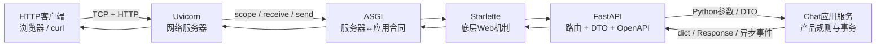
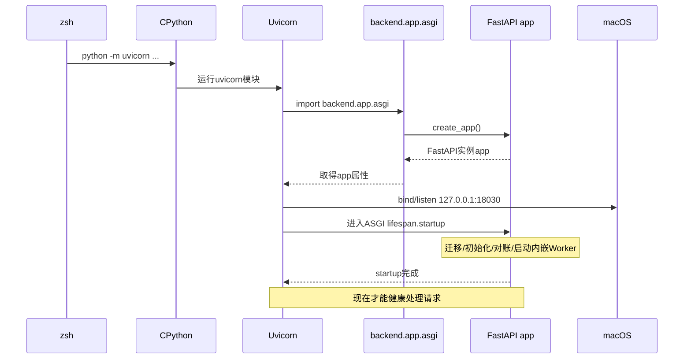

# Uvicorn、FastAPI与Chat后端基础

**归档日期**：2026-07-30

**分类**：00-从这里开始

**定位**：只会少量C++时，从Python模块导入学到Chat真实HTTP/AG-UI后端链路

**当前安装版本**：FastAPI `0.138.0`、Uvicorn `0.51.0`、Starlette `1.3.1`、Pydantic `2.14.0a1`

**关联源码**：`backend/app/asgi.py`、`backend/app/main.py`、`backend/app/composition.py`、
`backend/app/lifecycle.py`、`backend/app/api/`、`backend/app/observability/diagnostics.py`、
`backend/app/runtime_execution/endpoint.py`

## 问题

`python -m uvicorn backend.app.asgi:app` 中，Uvicorn、ASGI、FastAPI、Starlette、Pydantic、
Router、Middleware、Lifespan、`async/await`到底分别是什么？一次HTTP请求如何从18030端口
进入Python函数，又如何变成JSON或SSE回到浏览器？

## 回答：先把6个容易混的角色分开



| 名称 | 一句人话 | C++参照 | Chat里的位置 | 它不是 |
|---|---|---|---|---|
| Uvicorn | 打开18030端口、收HTTP、再把请求交给Python Web应用的服务器 | 像含`socket/bind/listen/accept`与事件循环的网络主程序 | `.venv/bin/python -m uvicorn ...` | 不拥有Session、Run或产品事务 |
| ASGI | Uvicorn调用Web应用的标准异步函数合同 | 像稳定回调接口/ABI | `app(scope, receive, send)` | 不是进程、HTTP路由或数据库 |
| Starlette | FastAPI下面的ASGI Web工具箱 | 像实现网络回调、中间件和Response的基础库 | FastAPI的底层依赖 | 不是Chat产品模块 |
| FastAPI | 把URL/HTTP方法、Python函数、DTO校验和OpenAPI连起来 | 像类型化路由表和请求调度器 | [`create_app`](../../backend/app/main.py#L39) | 不是真正的网络监听进程，也不自动等于业务架构 |
| Pydantic | 把JSON检查并转成带类型的Python对象 | 像“网络解码 + struct字段校验” | [`CreateSessionRequest`](../../backend/app/api/contracts.py#L25) | 不是数据库行或领域对象 |
| Chat Application Service | 真正决定产品状态怎样查询/变化的用例逻辑 | 像持有事务和状态机的业务服务 | `product_sessions/`、`harness/`、`governance/`等 | 不应被写在FastAPI Router里 |

最重要的结论是：**Uvicorn负责“收到网络请求”，FastAPI负责“找到哪个协议函数”，
Chat应用服务负责“产品事实发生什么”。**

## 1. 先补3个Python基础

### 1.1 Package、Module和Import

Python中：

- **Module（模块）**通常是一个`.py`文件，例如`backend/app/asgi.py`。
- **Package（包）**是可被分层导入的模块集，例如`backend.app`。
- `from .main import create_app`中的`.`表示从当前Package的`main.py`导入`create_app`符号。

用C++类比：`#include`主要在编译前把声明纳入编译单元；Python `import`是运行时加载模块。
模块第一次在该Python进程中被导入时，顶层语句会从上到下执行；之后通常从`sys.modules`缓存复用。

所以[`asgi.py`](../../backend/app/asgi.py)的：

```python
from .main import create_app
app = create_app()
```

不是两行“声明而已”：导入`backend.app.asgi`时会真正调用`create_app()`，产生一个FastAPI对象。

### 1.2 Class、Object、Function和Method

| Python名称 | 人话 | C++参照 | Chat例子 |
|---|---|---|---|
| class | 对象的类型/行为定义 | `class` | `FastAPI`、`ProductSessionService` |
| object/instance | 一个已创建的具体实例 | 栈/堆上某个类实例 | `app = FastAPI(...)` |
| function | 不必隶属某个对象的可调用代码 | 自由函数 | `create_app()` |
| method | 通过对象调用的函数 | 成员函数 | `product_sessions.list_sessions()` |

Python不需要`new`才能创建普通对象；`FastAPI(...)`会调用类的构造过程并返回实例。

### 1.3 `async def`和`await`

```python
@router.get("/api/ready")
async def ready():
    return await service.readiness()
```

- `async def`定义一个**coroutine function（协程函数）**。调用它先得到可等待对象，由事件循环驱动执行。
- `await`表示当前协程在等数据库/网络时暂时让出执行权，事件循环可以运行其他已就绪协程。
- 它不自动创建新OS线程，也不表示“函数同时把所有东西做了”。
- 如果在`async def`里直接执行很长的CPU计算或阻塞子进程等待，仍然可以卡住事件循环。

C++可以粗略类比为`co_await`和事件循环，但Python `asyncio`的调度和对象模型与C++协程并不相同。

## 2. Uvicorn命令逐字展开

```bash
.venv/bin/python -m uvicorn backend.app.asgi:app \
  --host 127.0.0.1 --port 18030 --reload
```

| 片段 | 精确含义 |
|---|---|
| `.venv/bin/python` | 启动Chat虚拟环境的CPython可执文件 |
| `-m uvicorn` | 按Python模块规则运行已安装的`uvicorn`package |
| `backend.app.asgi:app` | Uvicorn定义的`module:attribute`字符串；导入`backend.app.asgi`，取出名为`app`的对象 |
| `--host 127.0.0.1` | 只绑定这台电脑的回环网卡 |
| `--port 18030` | 在本机18030端口创建监听socket |
| `--reload` | 开发时用父进程观察文件，变化后重建服务子进程 |

冒号`:`不是Python对象成员语法；它是Uvicorn命令行规则。Python代码里同样的访问写作
`backend.app.asgi.app`（前提是已导入模块）。

### 2.1 Uvicorn启动后的时间线



这解释了为什么`lsof`看到18030还不够：进程可能停在Python断点，或Lifespan初始化尚未完成。

## 3. ASGI是什么：Uvicorn怎样“调用”FastAPI

ASGI应用在概念上是一个可以这样被调用的异步对象：

```python
await app(scope, receive, send)
```

3个参数用人话理解：

| 参数 | 作用 | HTTP例子 |
|---|---|---|
| `scope` | 这条连接/请求的元数据字典 | type、method、path、headers、client |
| `receive` | 异步收取客户端后续输入事件 | HTTP body分块、断开信号 |
| `send` | 异步向服务器发送响应事件 | response start、headers、body分块 |

Chat的[`CorrelationMiddleware.__call__`](../../backend/app/api/request_context.py#L80)就是一个可直接看到
ASGI参数的实现。它在`scope`中读method/path，包装`send`加入`X-Request-ID`，然后调用
`await self.app(scope, receive, send_with_request_id)`把请求继续向内传。

所以Middleware很像一圈又一圈的函数包装：

```text
Uvicorn
→ CorrelationMiddleware进入
→ CORS/Starlette/FastAPI路由
→ 真实endpoint函数
→ FastAPI/Starlette序列化响应
→ CorrelationMiddleware把request ID加入response header
→ Uvicorn写回socket
```

ASGI还承载`lifespan`和WebSocket等scope。Chat当前Agent主交互是HTTP POST + SSE，不是WebSocket。

## 4. FastAPI App是怎样被“组装”出来的

[`create_app`](../../backend/app/main.py#L39)是**Application Factory（应用工厂）**：每调用一次，
它返回一个隔离的FastAPI应用对象。

```text
create_app
├─ 解析Settings启动快照
├─ build_components：创建Service/Adapter/Worker对象图
├─ FastAPI(...)：创建Web应用对象
├─ install_error_handlers：注册统一错误映射
├─ expose_components：暴露进程内组件给运行边界
├─ add_middleware：注册CORS与request ID中间件
├─ include_router：注册Product REST路由
├─ register_runtime_surfaces：注册AG-UI端点与Runner
└─ return app
```

### 4.1 为什么不在一个`main.py`里全做完

| 文件 | 当前责任 | 分开的原因 |
|---|---|---|
| [`asgi.py`](../../backend/app/asgi.py) | 部署导入入口，在这里才加载私有启动配置 | 测试导入`main.py`不应该自动读私有文件/连数据库 |
| [`main.py`](../../backend/app/main.py) | 应用工厂：组装Web表面 | Router、业务规则和进程生命周期不会又混成一文件 |
| [`composition.py`](../../backend/app/composition.py) | 创建进程内对象图，将依赖交给服务 | 业务类不自己到处`new`基础设施，测试可替换边界 |
| [`lifecycle.py`](../../backend/app/lifecycle.py) | 迁移、初始化、对账、内嵌Worker与关闭顺序 | 构造对象不等于启动它；进程资源需确定的开/关顺序 |
| `api/*_router.py` | 解析协议DTO、调用应用服务、映射错误 | Router不应直接成为Product Store事务所有者 |

这个拆分不是为了“每个文件尽量小”，而是4种变化原因不同：部署入口、Web表面、依赖装配和进程生命周期。

### 4.2 `ApplicationComponents`是什么

[`ApplicationComponents`](../../backend/app/composition.py#L89)是一个进程内组件容器。
[`build_components`](../../backend/app/composition.py#L133)创建Product Session、Governance、Harness、Runtime、Worker、
pi、Evidence等实例，再把它们之间的依赖连起来。

C++中可以把它类比为`main()`附近的对象装配区：上层持有`Database`、`Service`、`Worker`，
然后通过构造参数把它们显式连接。

它不是一个“拥有全部业务的超级Service”：它只拥有装配责任，Product Session和Evidence等事实仍归各自模块。

## 5. Router、Decorator和DTO怎样把URL变成函数调用

### 5.1 Decorator是什么

```python
@router.get("/api/live")
async def live() -> dict[str, str]:
    return {"status": "live"}
```

`@router.get(...)`是Python **decorator（装饰器）**语法。可以粗略理解为：定义`live`函数后，
把它交给`router.get("/api/live")`返回的注册器，从而建立`GET + /api/live → live()`关系。

这段代码是在[`create_diagnostics_router`](../../backend/app/observability/diagnostics.py#L298)被调用时执行注册，
不是每次请求都重新定义函数。随后`main.py` 用`app.include_router(...)`把它加到总路由表。

### 5.2 3种真实路由，从易到难

#### A. `GET /api/live`：只证明Python请求链能跑

```text
GET /api/live
→ Uvicorn解析HTTP
→ ASGI Middleware加request ID/日志/耗时
→ FastAPI匹配diagnostics.py::live
→ return {"status": "live"}
→ FastAPI/Starlette序列化为JSON
→ HTTP 200 + application/json
```

请求无body、不读Product Store、不跑MAF、不调Provider。所以它是Liveness（进程请求处理能力），不是全系统健康。

#### B. `GET /api/ready`：还要证明Product Store可用

[`ready`](../../backend/app/observability/diagnostics.py#L306)调用
[`DiagnosticsService.readiness`](../../backend/app/observability/diagnostics.py#L61)，后者用SQL执行`SELECT 1`。

```json
{
  "status": "ready",
  "dependencies": {
    "product_store": "ready"
  }
}
```

数据库失败时，Router把`DiagnosticsUnavailable`映射成HTTP 503 Problem Detail。

#### C. `GET /api/sessions`：进入产品应用服务

[`list_sessions`](../../backend/app/api/product_router.py#L139)不直接写SQL：

```python
values = await product_sessions.list_sessions(include_archived=include_archived)
return {"sessions": values}
```

这里的`include_archived: bool = False`是Query Parameter：

```text
GET /api/sessions?include_archived=true
```

FastAPI会把字符串`true`解析为Python `bool`。Router调用`ProductSessionService`，然后将稳定公开投影包装为JSON。

### 5.3 POST JSON怎样变成Pydantic DTO

`POST /api/sessions`的网络body可以是：

```json
{
  "title": "学习FastAPI",
  "model_provider_id": null,
  "model": null
}
```

FastAPI看到[`create_session(command: CreateSessionRequest)`](../../backend/app/api/product_router.py#L130)，会用
[`CreateSessionRequest`](../../backend/app/api/contracts.py#L25)进行：

1. JSON语法解析。
2. 字段类型校验与默认值填充。
3. `extra="forbid"`拒绝未定义字段。
4. 成功后把`command`作为Python DTO对象交给路由函数。

如果body额外带`{"admin": true}`，当前DTO应拒绝，而不是静默忽略一个可能被误以为已生效的字段。

DTO不等于数据库行：`CreateSessionRequest`只是协议输入，Product Session ID、revision、时间和状态由
`ProductSessionService`在产品用例中创建和保存。

## 6. Middleware为什么不直接写到每个Router

Middleware处理对大量HTTP请求都相同的横切责任，例如：

- 生成/接纳request ID。
- 记录HTTP方法、路径、响应码和耗时。
- 创建观测Span与Metrics。
- 加入CORS响应Header。

Chat的[`CorrelationMiddleware`](../../backend/app/api/request_context.py#L69)使用一个request ID覆盖完整ASGI响应生命周期，
包括SSE流结束。如果只在创建`StreamingResponse`对象时记录“已完成”，实际后续流异常会被遗漏。

Middleware不应成为Product Session、Approval或Run的事实所有者：HTTP request ID是传输关联字段，
不是用户身份、Product Session ID或授权凭据。

## 7. Lifespan是什么：进程资源的开机和关机顺序

[`create_lifespan`](../../backend/app/lifecycle.py#L21)返回一个异步上下文管理器：

```text
进入yield之前（startup）
├─ Product Store迁移/初始化
├─ Governance/Harness/Repository/Profile/Tool配置初始化
├─ 播种Validation Capability
├─ 对账过期Lease、终态Run、Decision、Workspace、Operation和Artifact
└─ 按Profile启动内嵌Execution/Outbox异步循环

yield（对外服务期）
└─ Uvicorn把HTTP请求交给app

yield之后（shutdown）
├─ 取消Worker Task并等待收敛
├─ 关闭pi执行
└─ 关闭数据库连接
```

这里`asyncio.create_task()`创建的是**同一Python进程事件循环中的异步Task**，不是新OS进程。
`Chat Distributed Stack`才会用`backend.app.execution_worker`和`backend.app.outbox_worker`启动独立Python进程。

为什么不在模块导入时直接连数据库/启Worker？

1. 单元测试只想导入类时，不应该偷偷连真实数据库。
2. 启动失败必须让Readiness失败，不能留一个“端口在但状态没准备好”的假健康进程。
3. 关闭顺序要保证不在数据库先断开后还让Worker写终态。
4. 单进程与分布式部署需要复用同一组Service，但选择不同的启动所有权。

## 8. 错误是怎样变成稳定HTTP响应的

FastAPI并不会自动理解Chat领域错误。[`install_error_handlers`](../../backend/app/api/errors.py#L226)
为3类异常建立统一映射：

1. `HTTPException`：Router已经给出HTTP状态和稳定错误信息。
2. `RequestValidationError`：JSON/path/query没通过FastAPI/Pydantic校验。
3. 未处理`Exception`：对外固定为脱敏500，详细栈不直接穿过HTTP边界。

当前公开错误形状是[`ProblemDetail`](../../backend/app/api/errors.py#L63)：

```json
{
  "code": "RESOURCE_NOT_FOUND",
  "message": "请求的资源不存在。",
  "request_id": "<用于查运行日志的ID>",
  "retryable": false,
  "details": null
}
```

为什么不直接`return str(error)`？内部异常可能含绝对路径、SQL、Provider内容或不稳定文案；
前端也无法靠它稳定判断重试、刷新还是请用户处置。

## 9. CORS是浏览器边界，不是产品权限

[`create_app`](../../backend/app/main.py#L85)注册`CORSMiddleware`，允许配置中的前端Origin直接18030。

CORS主要防止某个其他网站的JavaScript随意读取Chat API响应。但：

- curl、后端进程和攻击者自己写的HTTP客户端不受浏览器CORS执行。
- 被CORS允许不等于用户已登录或有权读某个Product Session。
- 真实Principal/Role/Grant尚未实现，当前固定本地Scope不能冒充正式Identity。

所以CORS是L2协议/浏览器安全边界，Identity是产品授权模块，两者不能合并。

## 10. 普通JSON响应与SSE StreamingResponse有什么不同

### 10.1 普通REST

```text
请求进来
→ endpoint await应用服务
→ 获得完整dict/DTO
→ 一次序列化完整JSON
→ 响应结束
```

### 10.2 AG-UI + SSE

[`durable_agent_endpoint`](../../backend/app/runtime_execution/endpoint.py#L58)的核心不是立即在Router里跑完Workflow，而是：

1. Pydantic把AG-UI JSON解析成`AGUIRequest`。
2. Product Session Service先提交User Message、Interaction、Product Run和Attempt。
3. Runtime Service创建Job、Cursor和初始Journal事件。
4. Worker在同一或独立Python进程领取Job，再跑MAF Runner。
5. endpoint返回`StreamingResponse(event_stream(), media_type="text/event-stream")`。
6. `event_stream`是异步生成器：按sequence读Journal，每出现一个新事件就`yield`一帧字节。
7. Uvicorn把每帧继续写入同一HTTP响应，直到`RUN_FINISHED/RUN_ERROR`或客户端断开。

这里HTTP连接只是“当前订阅窗口”。Product Run和Runtime Job已经在Product Store中有独立生命周期，
所以浏览器断掉SSE不应该默认取消已领取的Job。

## 11. 一次真实HTTP请求穿过了哪些对象

以`GET /api/sessions?include_archived=false`为例：

| 时间 | 所在边界 | 当前形态 | 谁创建/解释 | 下一步 |
|---:|---|---|---|---|
| 1 | 网卡/socket | HTTP请求字节 | 浏览器创建，Uvicorn解码 | ASGI scope |
| 2 | ASGI | `scope={type,http; method,GET; path,/api/sessions; ...}` | Uvicorn | Middleware |
| 3 | 传输观测 | request ID、method、path、start time | CorrelationMiddleware | FastAPI Router |
| 4 | FastAPI | `include_archived=False` Python bool | FastAPI根据函数签名解析 | Router函数 |
| 5 | 应用查询 | `list_sessions(include_archived=False)` | ProductSessionService | Product Store |
| 6 | 产品投影 | Session列表，含稳定ID/revision/status | Product Store + Service | Router |
| 7 | FastAPI/Starlette | Python dict→JSON bytes、status/header | Framework | Uvicorn |
| 8 | socket | HTTP 200 response bytes | Uvicorn | 浏览器/React |

这些对象不能因为都含`session`/`status`字段就共用同一类。网络字节是外部输入，ASGI scope是运输对象，
Query Parameter是协议值，Product Session投影是产品读模型。

## 12. 亲手调试：按难度追3条请求

请使用VS Code `Chat Backend (MAF + FastAPI)`或`Chat Full Stack`。当前工作树可能有临时`breakpoint()`，
如果后端已暂停，先在调试器中Continue；不要为了试命令杀掉不明所有者的Python进程。

### 12.1 第1条：`GET /api/live`

1. 在[`CorrelationMiddleware.__call__`](../../backend/app/api/request_context.py#L80)下断点，观察`scope["method"]`和`scope["path"]`。
2. 在[`live`](../../backend/app/observability/diagnostics.py#L302)下断点。
3. 执行：

```bash
curl -i http://127.0.0.1:18030/api/live
```

4. 预期：第1个断点看到`GET`/`/api/live`；第2个断点无body/无Product Run；响应包含`X-Request-ID`和`{"status":"live"}`。

### 12.2 第2条：`GET /api/ready`

1. 在[`ready`](../../backend/app/observability/diagnostics.py#L306)和
   [`DiagnosticsService.readiness`](../../backend/app/observability/diagnostics.py#L61)下断点。
2. 执行：

```bash
curl -i http://127.0.0.1:18030/api/ready
```

3. 观察`await session.execute(text("SELECT 1"))`说明现在比`/api/live`多验证了Product Store。

### 12.3 第3条：`GET /api/sessions`

1. 在[`list_sessions`](../../backend/app/api/product_router.py#L139)下断点。
2. 执行：

```bash
curl -i 'http://127.0.0.1:18030/api/sessions?include_archived=false'
```

3. 观察`include_archived`已经是Python `False`，`values`是服务返回的稳定投影。
4. 这是只读查询，不会新建Session、Run或Provider Attempt。

### 12.4 进阶：在浏览器追AG-UI POST + SSE

1. 打开前端Network，发送一条SC01输入族消息。
2. 在[`durable_agent_endpoint`](../../backend/app/runtime_execution/endpoint.py#L58)观察`request_body`/脱敏`input_data`。
3. 观察`accepted`与`enqueued`：前者是Product输入事实结果，后者是Runtime Job/Cursor结果。
4. 在[`event_stream`](../../backend/app/runtime_execution/endpoint.py#L85)观察`sequence`和事件类型，不输出完整Prompt/Provider Payload。

## 13. 修改后端时怎样判断应该改哪里

| 需求 | 第一个应看的边界 | 不应该先改 |
|---|---|---|
| 增加一个只读诊断投影 | Diagnostics Query Service + Router + 响应合同 | 不在Uvicorn或MAF里加 |
| 增加Session标签 | Conversation/Product Session领域对象与事务，再加DTO/Router | 不只在React或Router dict中存 |
| 改HTTP公开错误形状 | `api/errors.py`、OpenAPI指纹和前端API Client | 不让每个Router自己返一套 |
| 修复Run断线续传 | Runtime Job/Event/Cursor + 前端重放Hook | 不把SSE socket本身当Product Run |
| 新增一个Workflow端点 | Workflow Catalog/Runner + Runtime Surface注册 | 不在Uvicorn命令里硬编路由 |
| 开启独立Execution Worker | `create_api_app`和Worker CLI/部署配置 | 不复制一份FastAPI业务逻辑 |

原则是：**先找谁拥有产品事实和事务，然后再把HTTP作为它的一个适配入口。**

## 14. 常见误区

| 误解 | 正确理解 |
|---|---|
| FastAPI就是后端的全部 | FastAPI是HTTP/ASGI适配层；Chat的产品模块、MAF和执行层都在它之外有独立责任 |
| Uvicorn会帮我保存Session | Uvicorn不理解Product Session；它只运行ASGI应用和管网络 |
| `async def`就是新线程 | coroutine通常在同一事件循环协作调度，不自动等于OS线程 |
| Router里能拿数据库就应该直接写 | 能做不表示责任正确；事务与状态机应归Application Coordinator |
| Pydantic Model就是Domain Model | DTO只负责协议字段；领域对象有自己的身份、状态机和生命周期 |
| `include_router`会启动新服务 | 它只把路由加到同一FastAPI App，不创建OS进程 |
| SSE断开就等于Run取消 | 当前合同下订阅与Product Run/Runtime Job生命周分开 |
| CORS允许了就是已授权 | CORS是浏览器Origin规则，不是Principal/Role/Grant |

## 15. 掌握验收

### 15.1 复述题

1. Uvicorn、ASGI、Starlette、FastAPI、Pydantic和Chat Application Service分别负责什么？
2. `backend.app.asgi:app`中的点和冒号分别由什么规则解释？
3. 为什么导入`asgi.py`会调用`create_app()`，而只导入`main.py`不应该自动读私有配置？
4. ASGI的`scope/receive/send`分别是什么？
5. `async def`与新OS线程有什么区别？
6. Decorator怎样把`GET /api/live`与`live()`关联起来？
7. Pydantic DTO为什么不是数据库行或Product Session领域对象？
8. `create_app`、`build_components`、`create_lifespan`和Router分别拥有什么责任？
9. `GET /api/live`、`GET /api/ready`和`GET /api/sessions`各自比前一个多验证了什么？
10. 为什么AG-UI endpoint要先建Product Run/Job，再用`StreamingResponse`读Journal，而不把Workflow生命周期绑在HTTP socket上？

### 15.2 定位与修改题

1. 要给`/api/ready`增加一个无敏感的依赖状态，哪个Query Service和Router要改？哪些不应改？
2. 要给Product Session增加一个持久字段，为什么不能只修改`CreateSessionRequest`？
3. 如果Router内开了数据库事务又调用会自己提交的Service，会产生什么边界问题？
4. 如果SSE已发`RUN_FINISHED`，但Product Store终态提交失败，为什么会造成“假成功”？当前Product Finalization Gate在保护什么？

能独立回答这些问题，并在断点中亲眼看到3条请求，才算完成后端框架基础L1/L2。

## 关键文件

| 文件 | 文件类型 | 主要责任 |
|---|---|---|
| [`backend/app/asgi.py`](../../backend/app/asgi.py) | 部署入口 | Uvicorn导入它并取`app` |
| [`backend/app/main.py`](../../backend/app/main.py) | Application Factory | 组装FastAPI Web表面 |
| [`backend/app/composition.py`](../../backend/app/composition.py) | Composition Root | 创建进程内Service/Adapter/Worker对象图 |
| [`backend/app/lifecycle.py`](../../backend/app/lifecycle.py) | Process Lifecycle | 初始化、对账、内嵌Worker与关闭 |
| [`backend/app/api/contracts.py`](../../backend/app/api/contracts.py) | HTTP DTO | 校验网络输入，不拥有产品事实 |
| [`backend/app/api/product_router.py`](../../backend/app/api/product_router.py) | REST Adapter | 产品资源URL与Application Service调用 |
| [`backend/app/api/request_context.py`](../../backend/app/api/request_context.py) | ASGI Middleware | request ID、日志、Metrics和Span |
| [`backend/app/api/errors.py`](../../backend/app/api/errors.py) | Error Adapter | 脱敏Problem Detail和统一异常映射 |
| [`backend/app/observability/diagnostics.py`](../../backend/app/observability/diagnostics.py) | Query + Router | Liveness、Readiness和脱敏运行诊断 |
| [`backend/app/runtime_execution/endpoint.py`](../../backend/app/runtime_execution/endpoint.py) | AG-UI/SSE Adapter | 接纳Run、入队Job、按Journal输出SSE |

## 补充记录

- 2026-07-30：按当前安装版本与Chat源码建立首版；不把通用FastAPI教程与当前项目行为混合。
