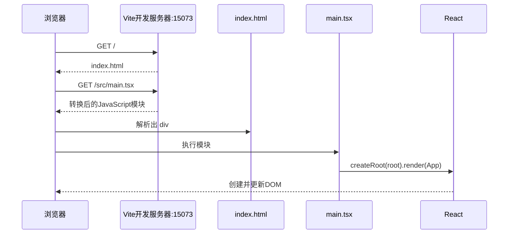
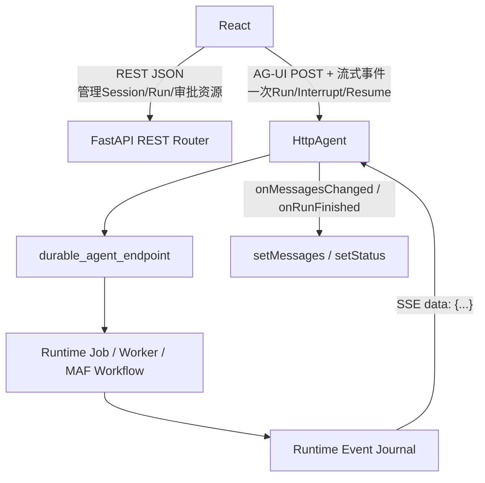

# Vite、浏览器API与Chat网络调试基础：代码怎样进浏览器并连到后端

**归档日期**：2026-07-30

**适合读者**：知道C++经编译器变成可执行文件，但不了解Node、Vite、DOM、Fetch和浏览器存储

**学完目标**：能解释前端怎样启动、浏览器实际执行什么、`/api`怎样到FastAPI、AG-UI流怎样回来，并会用DevTools确认真实请求和状态

## 0. C++程序与本项目前端最大的差别

```text
C++：.cpp --gcc/clang--> 本机机器码可执行文件 --操作系统--> 进程

Chat前端：.ts/.tsx --TypeScript检查 + Vite转换/打包--> JS/CSS/HTML
          --HTTP下载--> 浏览器 --JS引擎 + Web APIs--> 页面
```

开发时`npm run dev`启动的是Vite开发服务器，不是Chat前端业务本身变成了后端服务。真正运行React代码的是浏览器标签页。
生产构建`npm run build`会输出静态文件；它们仍需由Web服务器提供给浏览器。

## 1. Node、npm、Vite各负责什么

| 名词 | 职责 | 当前项目证据 |
|---|---|---|
| Node.js | 在开发机上运行Vite、TypeScript和测试工具 | `package.json`要求Node `^20.19.0 || >=22.12.0` |
| npm | 按`package-lock.json`安装依赖并执行脚本 | `npm run dev/build/test` |
| TypeScript编译器 | 检查类型；本项目应用配置`noEmit: true` | `tsconfig.app.json` |
| Vite | 开发服务器、模块转换、HMR、生产打包 | `vite.config.ts` |
| 浏览器 | 执行JS，提供DOM、Fetch、Storage等API | `window`、`document`、`fetch`等源码调用 |

`npm run build`实际是`tsc -b && vite build`：先做类型检查，再打包。它不是像GCC那样只产出一个本机可执行文件。

## 2. 从地址栏到React的启动顺序



对应文件：

1. [`frontend/index.html`](../../frontend/index.html)只有根节点和`type="module"`入口。
2. [`frontend/src/main.tsx`](../../frontend/src/main.tsx)找到`document.getElementById("root")`。
3. `App`加载页面和Product Session投影。

如果浏览器报“root element was not found”，先查HTML里有没有`id="root"`，不是先查FastAPI。

## 3. Vite配置怎样对应本项目

[`vite.config.ts`](../../frontend/vite.config.ts)有4个直接影响调试的事实：

| 配置 | 当前值 | 意义 |
|---|---|---|
| `server.host` | `127.0.0.1` | 默认只监听本机回环地址 |
| `server.port` | `15073` | 浏览器开发入口 |
| `strictPort` | `true` | 端口被占用就失败，不悄悄换端口 |
| `proxy["/api"]` | 默认到`http://127.0.0.1:18030` | 浏览器请求同源`/api/...`时由Vite转发到FastAPI |

因此开发时地址关系是：

```text
浏览器看到：http://127.0.0.1:15073/api/health
Vite代转发：http://127.0.0.1:18030/api/health
FastAPI响应：JSON
Vite转回：浏览器
```

代理主要解决开发环境的端口分离和同源访问，不是产品授权边界。后端仍必须认证、校验和授权。

## 4. HMR、Source Map和生产Build

- HMR（热模块替换）：改React/CSS后，Vite尽量只替换相关模块并保留部分页面状态。
- Source Map：让DevTools把转换后的JavaScript映射回`.ts/.tsx`，所以你能在TypeScript源码行上断住。
- Build：把模块依赖图转成适合部署的静态资源，并按`lazy(import(...))`形成Chunk。

HMR后保留下来的页面状态不等于后端保存了它。要验证恢复，必须真正刷新标签页或重启进程，再看状态来自
Product Store、Runtime Journal还是浏览器Storage。

## 5. “浏览器API”到底是什么

JavaScript语言本身没有页面、网络或本地存储。浏览器把一组对象注入运行环境：

| API | 能做什么 | Chat源码实例 |
|---|---|---|
| `window` | 当前页面全局、计时、位置、事件 | `window.location.origin`、`setInterval` |
| `document` | 查询和修改DOM | 找`#root`、恢复输入框焦点 |
| DOM Event | 接收点击、提交、键盘、在线状态变化 | `onSubmit`、`keydown`、`online/offline` |
| Fetch | 发HTTP请求并得到`Response` | Session REST、健康检查、审批修改 |
| AbortController | 取消仍在等待的Fetch | `App`加载健康/Provider列表时卸载取消 |
| Storage | 在浏览器本地保存字符串 | 草稿`localStorage`、主视图`sessionStorage` |
| Navigator | 网络提示、剪贴板、Service Worker | `navigator.onLine`、复制Session ID |
| URL/URLSearchParams | 安全拼接URL和查询参数 | Harness、Home、HITL API |
| Service Worker/PWA | 缓存App Shell、安装、更新 | `pwa-status.tsx`、`VitePWA` |

它们不是React的一部分。React只是调用这些浏览器能力，并把结果投影成界面。

## 6. DOM和事件：点击为什么能进函数

TSX里的：

```tsx
<form onSubmit={handleSubmit}>
  <button type="submit">发送</button>
</form>
```

最终会变成浏览器DOM节点和事件监听。按钮触发表单`submit`事件，React的事件系统调用`handleSubmit`；代码先
`preventDefault()`，避免浏览器按传统表单刷新整个页面，再调用父组件传入的`onSubmit`。

键盘事件、焦点和可访问性也属于真实功能：`App.tsx`监听`Cmd/Ctrl+K`，用`requestAnimationFrame`等下一次绘制前
恢复焦点。这不是“美化代码”，而是用户能否连续操作的行为合同。

## 7. Fetch：REST请求的真实数据形态

一个典型请求：

```ts
const response = await authenticatedFetch(apiUrl("/api/health"), {
  signal: controller.signal,
});
if (!response.ok) throw new Error("health check failed");
const health = await response.json();
```

逐步看：

```text
字符串路径 "/api/health"
-> apiUrl拼成当前Origin下的完整URL
-> Fetch创建HTTP请求
-> Promise等待响应Header
-> Response.ok根据状态码判断2xx
-> response.json()读取响应Body并解析成JS对象
-> setHealth(health)触发React更新
```

`Response`是浏览器对象；`response.json()`仍是异步的，因为Body可能还没收完。

[`api-client.ts`](../../frontend/src/api-client.ts)把后端Problem Detail解析成`ApiError`，再把`401/403/409/410/422`
映射为认证、刷新、过期或审查输入。这样组件不用各自猜状态码含义。

## 8. AbortController：取消等待，不等于撤销服务器事实

`App.tsx`创建`AbortController`并把`signal`交给Fetch，Effect清理时调用`controller.abort()`。这表示浏览器不再等待该请求。

必须区分：

- 取消还未完成的健康检查：通常没有产品副作用。
- `agent.abortRun()`：停止浏览器等待AG-UI流。
- 调Product Session取消端点：请求后端改变Run控制状态。
- Provider已收到请求后关闭连接：结果可能是`outcome_unknown`，不能当作“肯定没执行”。

这就是为什么前端“停止”不能只调用浏览器Abort后显示成功。

## 9. REST与AG-UI/SSE不是同一种请求



REST管理权威产品资源；AG-UI管理一次Agent Run的实时交互。SSE只是服务器持续向客户端发送文本事件的传输方式，
不是数据库，也不等于MAF Workflow。

当前[`use-chat-agent.ts`](../../frontend/src/use-chat-agent.ts)由`@ag-ui/client`的`HttpAgent`封装请求、事件解析、
消息投影和interrupt。框架做了协议机械工作；Chat自己增加了Product Session、Runtime Job、模型审批卡、Decision、
Grant、失败/恢复语义。

## 10. Browser Storage：本地有值不等于产品事实

| 存储 | 生命周期 | 当前用途 | 不能存什么 |
|---|---|---|---|
| React内存 | 标签页组件存活期间 | 当前状态和投影 | 权威历史 |
| `sessionStorage` | 当前标签页会话 | Home/Chat主视图、Runtime Cursor | 密钥、权威Run状态 |
| `localStorage` | 同源下可跨重开浏览器保留 | 每个Product Session的未发送草稿 | 已提交消息、Approval事实 |
| 后端SQLite | 由服务端事务管理 | Session、Message、Run、Decision等 | 浏览器不能直接修改 |

[`session-draft-storage.ts`](../../frontend/src/features/mobile/session-draft-storage.ts)明确写着：草稿只是设备本地交互状态，
后端接纳发送前不能算Product Message。Storage配额或隐私模式拒绝写入时，内存草稿仍可用。

## 11. `navigator.onLine`为什么不等于后端健康

浏览器的`online/offline`只说明它认为存在网络连接。Wi-Fi已连但FastAPI停了，`navigator.onLine`仍可能是`true`。
因此[`use-network-status.ts`](../../frontend/src/features/mobile/use-network-status.ts)刻意把：

```text
BrowserNetworkStatus（传输提示）
≠ /api/health（后端可达性）
≠ RuntimeConnectionStatus（AG-UI事件是否追平）
≠ Product Run.status（权威运行状态）
```

分开显示。把这4个值合成一个“在线”布尔值，会制造假成功和错误重试。

## 12. PWA和Service Worker在本项目里做什么

Vite的`VitePWA`生成Manifest和缓存规则，`pwa-status.tsx`负责注册、更新和安装提示。Service Worker可以在页面之外
拦截请求、提供缓存App Shell，但本项目明确排除`/api`、`/chat-api`等导航回退。

原因：静态页面可缓存，产品事实和认证请求不能被旧App Shell冒充为最新响应。Service Worker也不能让离线发送自动
成为已接纳Product Message。

## 13. DevTools里怎样看一条真实链

### 13.1 Network面板

1. 勾选Preserve log，清空旧请求。
2. 发送一句Prompt。
3. 找主Workflow的POST，例如`/api/workflows/continuous-collaboration/run`。
4. 查看Request Payload里的`threadId`、`runId`、`messages`和`forwardedProps.workflow`。
5. 查看Response/事件流中的`RUN_STARTED`、interrupt、文本增量、`RUN_FINISHED`。
6. 每次批准会产生新的Resume请求；不要误以为是4个Product Run。

### 13.2 Sources面板

1. 在`App.submit`、`useChatAgent.send`和`onRunFinishedEvent`打断点。
2. 看Call Stack中的当前函数、调用者、事件回调。
3. 看Scope中的`draft`、`sessionId`、`runId`、`pendingReview`。
4. 不展开认证Header、完整Provider Body或私密Context正文。

### 13.3 Application面板

1. 在Local Storage找`chat.session-draft.v1:<sessionId>`。
2. 在Session Storage找`chat.primary-view.v1`和Runtime Cursor。
3. 清理Storage后刷新，确认已提交消息仍能从后端恢复。
4. 若消息也消失，说明你看到的可能从未成为Product Message。

## 14. 亲手做4个实验

### 实验A：证明Vite代理

分别访问：

```bash
curl -i http://127.0.0.1:18030/api/health
curl -i http://127.0.0.1:15073/api/health
```

后端启动时两者应返回同一服务事实；第二条经过Vite代理。停止FastAPI后，页面静态资源仍可能打开，但`/api/health`失败。

### 实验B：证明草稿不是消息

输入但不要发送，刷新页面；草稿应从Local Storage回来。再查后端Session消息列表，不应出现这段草稿。

### 实验C：证明Abort不等于Run取消

出现模型审批后关闭Network请求或刷新页面，再打开同一Session。观察后端Run仍是`waiting_approval`，可以从持久中断恢复。

### 实验D：看三次审批是一个Product Run

执行SC02，保留Network记录。初始请求加3次Resume会出现多条HTTP请求，但后端治理视图应只有1个Product Run、
1个Run Attempt和3个ModelCall Attempt。

## 15. 掌握验收

1. 为什么Vite端口和FastAPI端口不同，浏览器仍能请求`/api`？
2. Source Map为什么能让你在`.tsx`上断住？
3. `response.json()`得到的对象为什么仍需运行时校验？
4. 浏览器断网、AG-UI未追平、后端不可达、Product Run失败为何必须分开？
5. 为什么Local Storage里的草稿不能在界面上显示成“已发送”？
6. 为什么一次SC02会有多次HTTP Resume，却仍是一个Product Run？

回答完后，用[《SC02：普通问答与三次模型调用治理》](../调试实战/场景/SC02-普通问答与三次模型调用治理.md)
把这些前端和浏览器知识接到后端39节点、MAF与真实数据库对象。
