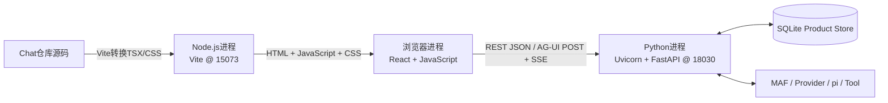
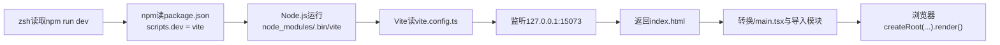
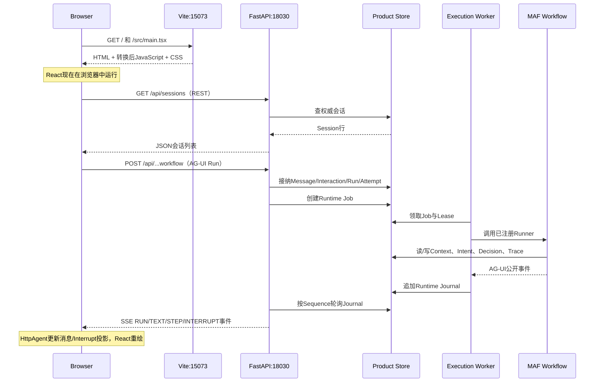

# 从C++到Chat：前后端怎样从源码跑起来

**归档日期**：2026-07-30

**分类**：00-从这里开始

**定位**：只会一点C++的新手在阅读总体架构和SC01之前的运行基础课
**关联源码**：`frontend/package.json`、`frontend/vite.config.ts`、`frontend/index.html`、`frontend/src/main.tsx`、`frontend/src/App.tsx`、`frontend/src/use-chat-agent.ts`、`backend/app/asgi.py`、`backend/app/main.py`、`backend/app/composition.py`、`backend/app/lifecycle.py`、`backend/app/runtime_execution/endpoint.py`

## 问题

C++代码可以用GCC/Clang编译、链接成可执行文件。Chat仓库里却是TypeScript、React、
Python、Vite、FastAPI、Uvicorn、REST、AG-UI和SSE：这些文件怎样变成正在运行的程序？
前端和后端为什么要分开启动？浏览器又是怎样跟后端交互的？

## 回答：先给结论

Chat本地开发时至少有3个真正的OS运行主体：

1. **浏览器进程**：执行由React/TypeScript转换出来的JavaScript，绘制页面。
2. **Vite的Node.js进程**：监听`127.0.0.1:15073`，把TypeScript/TSX转换成浏览器可执行的JavaScript，再连同HTML、CSS和图片交给浏览器。
3. **Uvicorn的Python进程**：监听`127.0.0.1:18030`，加载FastAPI应用、Product Store、MAF Workflow和本地内嵌Worker。

开发模式下，Uvicorn的`--reload`还会让你看到一个监视文件变化的父进程和一个真正服务请求的子进程。



这篇课的目标不是让你记住启动命令，而是让你能解释这些命令为什么能创建这些进程，以及出错时应该检查哪一层。

## 1. 先用C++对照三种运行方式

### 1.1 你熟悉的C++

一个简化的C++链路是：

```text
main.cpp / 其他.cpp
→ 预处理
→ 编译成目标文件 .o
→ 链接器把目标文件和库组合
→ Mach-O可执行文件（macOS）
→ OS创建进程并从main()开始执行
```

例如`clang++ main.cpp -o app && ./app`。`app`是CPU可以通过OS加载器运行的本地机器码文件。

### 1.2 Chat前端：TypeScript/TSX最后由浏览器执行

Chat前端不会生成一个独立的macOS可执行文件。它的链路是：

```text
.ts / .tsx / CSS / 图片
→ Vite + React插件理解模块导入和JSX
→ 转换成浏览器可执行的JavaScript和CSS
→ 浏览器下载资源
→ 浏览器JavaScript引擎执行
→ React把组件状态投影成DOM页面
```

人话定义：

| 名称 | 一句人话 | C++参照 | Chat中的位置 | 它不是 |
|---|---|---|---|---|
| TypeScript | 带静态类型检查的JavaScript开发语言 | 像编译期类型检查，但目标仍是JavaScript | `frontend/src/**/*.ts` | 不是浏览器直接支持的最终格式 |
| TSX | 在TypeScript中写类HTML的React组件结构 | 可理解为一种会被编译器展开的语法 | `main.tsx`、`App.tsx` | 不是服务器模板文件 |
| React | 根据状态计算页面结构的前端库 | 像一套持续根据对象状态刷新界面的框架 | `frontend/src/main.tsx`、`App.tsx` | 不是HTTP服务器，也不是Product Store |
| Vite | 开发时转换/提供模块，生产时打包前端资源的工具 | 同时承担一部分构建系统和开发资源服务器职责 | `frontend/vite.config.ts` | 不是Chat后端，不保存产品数据 |
| Node.js | 在浏览器之外执行JavaScript工具的本地Runtime | 类似一个本地可执行的语言运行环境 | 实际`node`Mach-O进程运行Vite | 不是浏览器里的React进程 |

开发模式下，Vite通常按浏览器需求实时转换模块，不需要先把整站生成到`dist/`。修改源码后，
Vite通过HMR（热模块更新）通知浏览器替换变化模块，这就是为什么很多前端修改不需要手工重启。

生产构建时，当前`package.json`执行：

```text
npm run build
→ tsc -b                  # 静态类型检查；当前tsconfig设置noEmit
→ vite build             # 输出真正可发布的资源
→ frontend/dist/index.html
   frontend/dist/assets/带内容Hash的.js/.css
   frontend/dist/icons/
   frontend/dist/sw.js等PWA资源
```

`dist/`是构建产物，不是日常手写源码。

### 1.3 Chat后端：Python解释器加载模块并运行

Chat后端也没有先生成一个名为`chat-server`的项目机器码文件。它的链路是：

```text
.venv/bin/python（本地Mach-O可执行文件）
→ 运行`-m uvicorn`模块
→ Uvicorn导入`backend.app.asgi`
→ 取出模块变量`app`
→ app是FastAPI/ASGI应用对象
→ Uvicorn监听18030端口，把HTTP请求交给app
```

Python解释器会把源码编译成中间字节码并由Python虚拟机执行；它可能创建`__pycache__`，但这不是
像C++那样需要你手工链接的项目可执行文件。真正的本地机器码运行时是`.venv/bin/python`，项目Python文件由它动态导入执行。

| 名称 | 一句人话 | C++参照 | Chat中的位置 | 它不是 |
|---|---|---|---|---|
| Python解释器 | 读取并执行Python模块的本地程序 | 像“编译器+运行时”合在一起，但不先产出项目exe | `.venv/bin/python` | 不是系统Python，不应被随意替换 |
| Uvicorn | 负责监听TCP端口、解析HTTP、调用ASGI应用的Python服务器 | 像拥有`accept()`循环和线程/事件循环的网络主程序 | `python -m uvicorn backend.app.asgi:app` | 不拥有Chat业务规则 |
| ASGI | Python Web服务器和应用之间的异步调用约定 | 像稳定的回调接口/ABI合同 | `backend.app.asgi:app` | 不是一个数据库或网络协议 |
| FastAPI | 把URL、HTTP方法、DTO验证和Python处理函数连起来的Web框架 | 像类型化的路由表+请求处理层 | `backend/app/main.py::create_app` | 不是MAF，不自动拥有产品状态 |
| MAF | 运行Agent、Executor、Workflow和Checkpoint的智能控制运行时 | 像一个可暂停、分支的任务图运行库 | `backend/app/workflows/` | 不是FastAPI，也不是完整Chat产品 |

### 1.4 “前端”和“后端”到底是什么

- **前端**是在用户设备的浏览器里运行、直接处理点击、输入和页面绘制的部分。当前就是`frontend/src/`中的React代码。
- **后端**是在Python服务进程中运行、接收网络请求、校验权限、编排用例并读写权威状态的部分。当前主要是`backend/app/`。
- 开发时两者可以在同一台Mac上，但仍是不同运行环境和网络端点；“前/后”首先是责任与信任边界，不是必须买两台电脑。
- Vite是开发时向浏览器发送前端资源的工具服务，不因为它“监听端口”就变成Chat产品后端。

## 2. 运行一个Web系统前必须理解的7组基础词

### 2.0 终端、Shell、命令和当前目录

- **终端**是显示文本输入输出的窗口。
- **Shell**是在终端中读取命令并启动程序的进程；当前交互Shell是`zsh`。
- **命令**如`npm run dev`会让Shell查找`npm`这个可执行文件，并把`run dev`作为参数交给它。
- **当前目录**（working directory）决定相对路径从哪里起算。本文除了明确写`cd frontend`的命令，其他命令都默认在`/Users/xulater/Code/Chat`项目根目录执行。

### 2.1 进程

**进程**是OS正在运行的一个程序实例，拥有PID、虚拟内存、打开文件和网络套接字。

- C++：`./app`每运行一次通常就创建一个新进程。
- Chat：`node .../vite`和`python -m uvicorn ...`是不同进程。
- 不是：一个源码文件、一个函数或一个架构模块都不自动等于一个OS进程。

### 2.2 IP地址、端口和套接字

`127.0.0.1`是回环地址，意思是“这台电脑自己”。端口是同一台电脑上用来区分网络服务的数字。

```text
http://127.0.0.1:15073/
^^^^   ^^^^^^^^^  ^^^^^ ^
协议      主机      端口 路径
```

- `15073`当前由Vite监听。
- `18030`当前由Uvicorn/FastAPI监听。
- `strictPort: true`表示15073被占用时Vite直接失败，不会悄悄换成15074。
- “端口正在监听”只证明OS有进程占用套接字，不保证应用能正常响应；调试器把Python暂停时，端口仍可能存在，HTTP却会超时。

### 2.3 客户端与服务端

客户端主动建立连接并发送请求；服务端监听地址，接收请求并返回响应。

- 浏览器是Vite的客户端：向15073要HTML/JS/CSS。
- 浏览器里的React代码也是FastAPI的客户端：向18030或Vite代理的`/api`要产品数据。
- FastAPI在调用Provider时又变成Provider HTTP服务的客户端。

所以“前端”和“后端”是站在当前产品边界上的职责名，不是程序永久只能做客户端或服务端。

### 2.4 API、HTTP、JSON和DTO

- **API**：Application Programming Interface，两部分程序约定好的可调用边界。Web API通常约定URL、HTTP方法、输入字段、响应字段和错误语义。
- **HTTP**：客户端和服务端交换请求/响应的协议。常见方法有`GET`、`POST`、`PUT`、`PATCH`。
- **JSON**：跨网络传输结构化数据的文本格式，例如`{"title":"新会话"}`。
- **DTO**：Data Transfer Object，跨边界传输的字段合同。它像C++中专门用于网络序列化的`struct`，不应直接等于数据库对象。

当前会话REST投影在[`session-api.ts`](../../frontend/src/features/session/session-api.ts)定义。例如：

```text
GET /api/sessions
→ FastAPI查Product Store
→ HTTP 200 + JSON {"sessions": [...]}
→ TypeScript把JSON投影为ProductSession[]
→ React渲染会话侧边栏
```

### 2.5 SSE

SSE是Server-Sent Events，是一种在HTTP响应身中持续发送多帧文本事件的格式。

```text
id: 17
data: {"type":"RUN_STARTED",...}

id: 18
data: {"type":"TEXT_MESSAGE_CONTENT",...}

```

空行表示一帧结束。当前后端[`_sse`](../../backend/app/runtime_execution/endpoint.py#L31)将Runtime Journal事件编码成这种字节。

它不是WebSocket；当前AG-UI是浏览器先`POST`一个Run请求，后端把该HTTP响应保持为SSE流。需要审批时，前端会另发一次Resume请求。

### 2.6 环境变量

环境变量是OS在启动进程时附带的Key/Value配置。例如VS Code前端命令会在Node进程启动前设置：

```bash
VITE_API_BASE_URL=http://127.0.0.1:18030
VITE_AG_UI_URL=http://127.0.0.1:18030/api/agent
```

Vite只会把`VITE_`前缀的前端变量替换到浏览器构建中，所以它们不能保存密钥。后端密钥只保留在被Git忽略的
`backend/config.json`，应用启动时由[`Settings.from_file`](../../backend/app/config.py#L751)读取；本文不读取、不复制其真实内容。

### 2.7 URL、Origin、Proxy和CORS

- **URL**是一个资源的完整网络地址，如`http://127.0.0.1:18030/api/sessions`。
- **Origin（源）**由“协议 + 主机 + 端口”组成。`http://127.0.0.1:15073`和`http://127.0.0.1:18030`端口不同，所以是两个Origin。
- **Proxy（代理）**是中间转发者。手工启动前端时，浏览器把`/api`发给Vite 15073，Vite再转发到FastAPI 18030。
- **CORS**是浏览器对跨Origin JavaScript请求的安全规则。VS Code模式让React直连18030时，FastAPI必须明确允许来自15073的页面Origin。

它们解决的是浏览器网络边界，不会自动完成用户身份认证、产品授权或数据校验。

## 3. Chat的基础环境到底包含什么

### 3.1 项目要求与本机实际环境

| 层次 | 项目合同 | 2026-07-30本机观测 | 怎样自己查 |
|---|---|---|---|
| OS/CPU | 当前本地项目在macOS上开发 | macOS arm64 | `uname -s -m` |
| Shell | 项目脚本使用Bash，交互终端可使用zsh | zsh | `echo $SHELL` |
| Python | `>=3.12,<3.13` | `3.12.11` | `.venv/bin/python --version` |
| Python包管理 | `uv.lock`是依赖锁 | `uv 0.7.21` | `uv --version` |
| Node.js | `^20.19.0 || >=22.12.0` | `v24.8.0` | `node --version` |
| npm | README要求`>=10` | `11.6.0` | `npm --version` |
| 浏览器 | 开发可用现代Chrome/Chromium | Playwright使用Chromium做自动E2E | 浏览器帮助页/Playwright命令 |

“项目合同”是允许范围；“本机观测”只是当前快照，升级后可能变。安装版Python依赖以`uv.lock`和`.venv`为准，前端依赖以`package-lock.json`和`node_modules`为准。

### 3.2 `uv`、`.venv`和`uv.lock`

- `uv`：安装Python、解析依赖并创建虚拟环境的工具。
- `.venv`：当前项目的Python解释器入口和已安装包的隔离目录。
- `pyproject.toml`：声明项目名、Python范围、直接依赖和开发工具。
- `uv.lock`：锁定依赖树的精确解析，让不同机器尽量安装同样版本。

本机`.venv/bin/python`是一个符号链接，指向`uv`管理的CPython 3.12.11 arm64 Mach-O可执行文件。运行命令仍然应使用
`.venv/bin/python`，因为这个入口同时保留项目虚拟环境语义。

### 3.3 `npm`、`package.json`、`package-lock.json`和`node_modules`

- `npm`：Node.js包管理器和项目脚本入口。
- `frontend/package.json`：声明`dev/build/test`命令及React、Vite、AG-UI Client等依赖。
- `frontend/package-lock.json`：锁定完整npm依赖树。
- `frontend/node_modules/`：`npm ci`下载后的第三方包和Vite命令实现；体积大，不是项目源码。

`npm run dev`不是npm自己知道Vite；npm先打开`package.json`，找到`"dev": "vite"`，再用Node.js运行本地
`node_modules/.bin/vite`。

### 3.4 第一次下载仓库时，环境怎样建起来

下面命令只在对应本地文件不存在时复制配置模板，不会覆盖已有私有配置：

```bash
[ -e backend/config.json ] || cp backend/config.example.json backend/config.json
[ -e frontend/.env ] || cp frontend/.env.example frontend/.env
uv python install 3.12
uv venv --python 3.12 .venv
UV_PROJECT_ENVIRONMENT=.venv uv sync --frozen --dev
(cd frontend && npm ci)
(cd frontend && npx playwright install chromium)
```

按顺序理解：

1. 前2行从可提交模板创建本地配置；`backend/config.json`可后续填私有Provider密钥，但不得提交或输出。
2. `uv python install 3.12`准备符合项目合同的CPython。
3. `uv venv ... .venv`为Chat建立隔离的Python环境。
4. `uv sync --frozen --dev`严格按`uv.lock`安装后端及开发/测试依赖。
5. `npm ci`严格按`package-lock.json`重建`frontend/node_modules/`；不用它随意升级依赖。
6. 最后一行安装当前前端E2E测试使用的Chromium；只启动页面时不依赖Playwright启动浏览器。

这些命令是“准备工具链和依赖”，还没有启动Chat；真正创建Vite/Uvicorn运行进程的是第5、6节。

## 4. 先看目录：哪些是源码，哪些不是

```text
Chat/
├── frontend/                       # 浏览器交互面与前端工具链
│   ├── package.json                  # npm命令和直接依赖
│   ├── package-lock.json             # 前端精确依赖锁
│   ├── vite.config.ts                # Vite插件、构建、端口和代理
│   ├── index.html                    # 浏览器第一份HTML，提供<div id="root">
│   ├── src/
│   │   ├── main.tsx                 # React启动入口
│   │   ├── App.tsx                  # 顶层页面组合与发送动作
│   │   ├── runtime-config.ts       # API/AG-UI URL统一解析
│   │   ├── use-chat-agent.ts       # AG-UI HttpAgent与React之间的Hook
│   │   └── features/               # Chat/Session/Workflow/Harness等前端Feature
│   ├── tests/ 和 e2e/              # 前端合同与真浏览器测试
│   ├── node_modules/                  # 生成：npm安装的依赖
│   └── dist/                          # 生成：生产构建资源
├── backend/                        # Python后端、测试和本地数据
│   ├── app/
│   │   ├── asgi.py                  # Uvicorn默认导入入口
│   │   ├── main.py                  # FastAPI应用工厂、中间件和Router注册
│   │   ├── composition.py           # 组合根：构造Service/Runtime对象图
│   │   ├── lifecycle.py             # 启动迁移、对账、内嵌Worker与关闭
│   │   ├── api/                     # HTTP DTO、Router、错误和RequestContext
│   │   ├── product_sessions/        # Product Session/Message/Run与Product Store
│   │   ├── runtime_execution/       # Job/Lease/Event/Cursor和Execution Worker
│   │   ├── workflows/               # MAF Workflow/Executor/Checkpoint适配
│   │   ├── harness/ governance/     # 产品事实与执行治理
│   │   ├── evidence/ tool_execution/ # Evidence/Artifact/Tool副作用边界
│   │   └── execution_worker.py       # 分布式部署的独立Worker入口
│   ├── tests/                          # pytest后端测试
│   ├── migrations/                     # Alembic Schema演进脚本
│   ├── config.example.json             # 可提交的脱敏配置模板
│   ├── config.json                     # 私有运行配置；Git忽略，不得输出
│   └── .data/                          # 生成：SQLite、日志、Artifact和Workspace数据
├── scripts/                         # 启动辅助、清理、检查、验证和部署脚本
├── .vscode/                         # VS Code启动、任务、端口和调试器配置
├── pyproject.toml                   # Python项目与工具声明
├── uv.lock                          # Python完整依赖锁
├── .venv/                           # 生成：项目Python虚拟环境
└── PROJECT_*.md / AGENTS.md         # 产品、状态、计划和协作治理
```

修改原则：

- 日常开发修改`frontend/src/`、`backend/app/`、测试、迁移和正式配置模板。
- 不手工修改`node_modules/`、`dist/`、`.venv/`和`__pycache__/`；它们由工具重建。
- 不在文档、Trace、截图或Git中展示`backend/config.json`的密钥。
- `backend/.data/`是受管运行数据，不能当临时目录用shell批量删除。

## 5. 前端究竟怎样启动

### 5.1 命令展开

```bash
cd frontend
npm run dev
```

实际发生：



对应当前代码：

1. [`package.json`](../../frontend/package.json)的`"dev": "vite"`定义npm脚本。
2. [`vite.config.ts`](../../frontend/vite.config.ts#L104)固定`127.0.0.1:15073`、`strictPort`和`/api`代理。
3. [`index.html`](../../frontend/index.html)创建`<div id="root"></div>`，并导入`/src/main.tsx`。
4. [`main.tsx`](../../frontend/src/main.tsx#L7)取得`root`元素，[`createRoot(...).render`](../../frontend/src/main.tsx#L12)挂载`<App />`。
5. [`App`](../../frontend/src/App.tsx#L103)组合Home、Chat、Session Sidebar、Workbench、配置和审批页。

### 5.2 浏览器第一次打开页面时发生什么

```text
浏览器 GET /
→ Vite返回index.html
→ 浏览器发现<script type="module" src="/src/main.tsx">
→ 再GET /src/main.tsx
→ Vite转换TSX和导入关系
→ 浏览器继续获取App.tsx、React、CSS和各个按需Feature
→ React创建页面
→ App/useEffect等代码开始请求会话、Workflow、Home和配置投影
```

因此“打开前端页面”至少包含两阶段：先把前端程序下载到浏览器，然后再由正在运行的React程序请求产品数据。

### 5.3 开发时的两种API路径

| 启动方式 | 前端计算出的API URL | 真实网络链 | 为什么能工作 |
|---|---|---|---|
| README手工`npm run dev`，不设覆盖变量 | 默认使用当前页面Origin，如`http://127.0.0.1:15073/api/...` | 浏览器→Vite 15073→Vite Proxy→FastAPI 18030 | `vite.config.ts`将`/api`代理到18030，浏览器视角是同源 |
| VS Code `Chat Frontend` | 启动命令注入`VITE_API_BASE_URL=http://127.0.0.1:18030` | 浏览器→FastAPI 18030 | FastAPI的CORS允许`localhost/127.0.0.1:15073` |

URL只在[`runtime-config.ts`](../../frontend/src/runtime-config.ts#L33)统一解析，Feature不应自己到处硬编码端口。

## 6. 后端究竟怎样启动

### 6.1 命令展开

```bash
.venv/bin/python -m uvicorn backend.app.asgi:app \
  --host 127.0.0.1 --port 18030 --reload
```

这条命令的每一段都有精确含义：

| 部分 | 含义 |
|---|---|
| `.venv/bin/python` | 用Chat项目的Python 3.12虚拟环境，不用系统Python |
| `-m uvicorn` | 让Python按模块执行已安装的Uvicorn包 |
| `backend.app.asgi:app` | 导入Python模块`backend.app.asgi`，然后取变量`app` |
| `--host 127.0.0.1` | 只监听本机回环，局域网/公网不能直接连 |
| `--port 18030` | 请求必须进入这个端口 |
| `--reload` | 启动文件监视父进程，Python文件变更后重启服务子进程 |

当前[`asgi.py`](../../backend/app/asgi.py#L9)只做一件事：

```python
from .main import create_app

app = create_app()
```

它之所以独立存在，是为了把“部署进程真正读取私有配置”与“测试只导入应用工厂”分开。

### 6.2 `create_app()`不是`main()`：它是应用工厂

[`create_app`](../../backend/app/main.py#L35)按下面顺序构造FastAPI应用：

1. `Settings.from_file()`读取启动时私有配置快照。
2. 配置日志、Metrics和Trace。
3. 调用[`build_components`](../../backend/app/composition.py#L128)构造数据库、Service、MAF Runner、Runtime Service、Worker、pi和Evidence对象图。
4. 创建`FastAPI(...)`对象，并把[`create_lifespan`](../../backend/app/lifecycle.py#L17)绑定为生命周期。
5. 注册Problem Detail错误处理、CORS和请求关联中间件。
6. 注册Session、Harness、Context、Intent、Evidence、Diagnostics等REST Router。
7. 注册Runtime管理端点。
8. 调用[`register_runtime_surfaces`](../../backend/app/composition.py#L361)注册`/api/agent`和各个Workflow AG-UI端点，并把endpoint key绑定到Runner。
9. 返回`app`对象，交给Uvicorn。

**组合根**是“在程序最外层新建对象并把依赖连起来”的位置。它像C++ `main()`里的对象装配，但不应自己实现业务规则。

### 6.3 Uvicorn开始接受请求前，Lifespan先做什么

Uvicorn启动ASGI应用时，[`lifespan`](../../backend/app/lifecycle.py#L30)会：

1. 初始化Product Store；耐久SQLite会通过Alembic升级到最新Schema。
2. 初始化Governance、Harness、Repository、Protocol、Agent Profile和Tool配置。
3. 播种确定性Validation Capability。
4. 对账过期Lease、已终结Product Run、遗留Decision、Workspace、Tool Operation和Artifact。
5. 正常单进程开发配置下，用`asyncio.create_task()`启动Governance Outbox和Execution Worker后台循环。
6. 所有初始化成功后`yield`，应用进入服务状态。
7. 关闭时取消后台任务、停止Worker、关闭pi执行并断开数据库。

[`ProductDatabase.initialize`](../../backend/app/product_sessions/database.py#L428)对耐久数据库调用Alembic `upgrade head`；所以“后端端口出现了”不代表生命周期已成功，真正Readiness还要确认Product Store可用。

### 6.4 单进程开发与分布式调试的区别

| 配置 | OS进程 | Worker在哪里 | 用途 |
|---|---|---|---|
| `Chat Full Stack` | Vite Node + Uvicorn reload父/子Python + 浏览器 | Execution/Outbox是FastAPI子进程内的`asyncio`Task | 日常调试，少开终端 |
| `Chat Distributed Stack` | Vite + API Python + Execution Worker Python + Outbox Worker Python + 浏览器 | 两类Worker为独立OS进程 | 验证进程所有权、共享Product Store和故障恢复 |

`create_api_app()`通过`start_execution_worker=False`和`start_outbox_worker=False`关闭内嵌循环；
`backend.app.execution_worker`和`backend.app.outbox_worker`分别创建自己的组合根与轮询循环。

这里必须区分：

- “Run管理模块”是一种产品/应用责任。
- “Execution Worker逻辑角色”是可领取Job的运行责任。
- “Worker独立OS进程”是一种部署选择。

三者不是同一维度。

## 7. 前后端是怎样交互的

### 7.1 交互不是只有一条“前端调后端”箭头



第一段`Browser ↔ Vite`是**获得前端程序**；后面`Browser ↔ FastAPI`是**使用Chat产品功能**。
即使后端停了，Vite仍可能返回页面外壳；但会话、Run和审批数据会加载失败。

### 7.2 一次点击“发送”的当前真实代码链

| # | 时间上发生什么 | 真实符号 | 输入 | 输出/状态 |
|---:|---|---|---|---|
| 1 | 用户在React页面点发送 | [`App.submit`](../../frontend/src/App.tsx#L443)（React回调） | `draft`、当前Product Session、已选Workflow | 调用`send(text, control, workflow)` |
| 2 | Hook创建协议ID与User Message | [`useChatAgent.send`](../../frontend/src/use-chat-agent.ts#L241)（Hook内方法） | 文本、Workflow ID/version/endpoint | AG-UI message ID、run ID、`HttpAgent.messages` |
| 3 | AG-UI Client串行化请求 | [`HttpAgent.runAgent()`调用点](../../frontend/src/use-chat-agent.ts#L259)（来自`@ag-ui/client`） | threadId、runId、messages、forwardedProps | HTTP POST和持续的SSE响应 |
| 4 | FastAPI/Pydantic解析AG-UI DTO | [`durable_agent_endpoint`](../../backend/app/runtime_execution/endpoint.py#L58)（FastAPI路由函数） | `AGUIRequest` | `input_data` Python字典 |
| 5 | 后端先提交产品输入事实 | [`ProductSessionService.prepare_agui_run`](../../backend/app/product_sessions/service.py#L672)（异步方法） | 经验证AG-UI字段 | Product User Message、Interaction、Product Run、Run Attempt |
| 6 | 端点创建可领取任务 | [`RuntimeExecutionService.enqueue`](../../backend/app/runtime_execution/service.py#L100)（异步方法） | Product Run/Attempt、endpoint key、Workflow version | Runtime Job、Cursor、初始Journal事件 |
| 7 | HTTP路由返回StreamingResponse | [`event_stream`](../../backend/app/runtime_execution/endpoint.py#L85)（内部异步生成器） | Job ID和起始Sequence | `text/event-stream`，连接保持打开 |
| 8 | 内嵌或独立Worker领取Job | [`ExecutionWorker.run_once`](../../backend/app/runtime_execution/worker.py#L141) | 数据库中可领Job | Lease owner/epoch和`ClaimedRuntime` |
| 9 | Worker根据endpoint key找到Runner | [`RuntimeRunnerRegistry.require`](../../backend/app/runtime_execution/worker.py#L61)（方法） | Job中endpoint key | `ProductAwareWorkflow`或其他Runner |
| 10 | Runner运行MAF Workflow | [`ProductAwareWorkflow.run`](../../backend/app/workflows/runtime.py#L120)（异步方法） | AG-UI请求投影和Product关联ID | MAF节点事件、审批Interrupt、文本候选 |
| 11 | Worker把公开事件写Journal | [`RuntimeExecutionService.append_event`](../../backend/app/runtime_execution/service.py#L289)（异步方法） | AG-UI公开事件 | 单调Sequence、Hash、Cursor |
| 12 | HTTP路由把Journal事件编成SSE | [`_sse`](../../backend/app/runtime_execution/endpoint.py#L31)（函数） | `payload + sequence` | `id: ...\ndata: {...}\n\n` |
| 13 | `HttpAgent`收到事件并调用订阅者 | [`onMessagesChanged/onRunStartedEvent/onRunFinishedEvent`](../../frontend/src/use-chat-agent.ts#L178)（回调） | AG-UI事件 | React `messages/status/pendingReview` |
| 14 | React状态改变触发重绘 | [`ConversationPane`](../../frontend/src/features/chat/conversation-pane.tsx#L78)、[`MessageBubble`](../../frontend/src/features/chat/message-bubble.tsx#L15)、Workbench | 前端投影 | 用户看到消息、节点、审批或错误 |

网络中的裁剪形态类似：

```json
{
  "threadId": "<Product Session ID的AG-UI映射>",
  "runId": "<AG-UI Run ID>",
  "messages": [
    {
      "id": "<AG-UI Message ID>",
      "role": "user",
      "content": "我有哪些项目"
    }
  ],
  "forwardedProps": {
    "workflow": {
      "id": "continuous-collaboration",
      "version": "1.8.0"
    }
  }
}
```

这只是真实AG-UI请求的教学裁剪投影，不是新的Schema事实源。网络字段、Pydantic `input_data`、Product数据库对象和
`CollaborationState`仍然是4种对象，不能因为字段相似就共用一个所有权。

### 7.3 REST和AG-UI为什么两者都要有

| 问题 | REST | AG-UI over HTTP/SSE |
|---|---|---|
| 最适合管理什么 | Session列表、历史、Project、Work、配置、Trace等产品资源 | 一次Agent/Workflow Run的实时消息、节点、Interrupt与Resume |
| 交互形状 | 一次请求→一次完整JSON响应 | 一次POST→持续到来的多帧SSE事件 |
| 刷新后用途 | 重新获取长期产品事实 | 恢复活动Run投影，必要时按Cursor读Journal |
| 不应负责 | 不用一个普通REST返回假装流式Agent状态机 | AG-UI Thread/Snapshot不替代Product Session/DB |

例如会话列表由`GET /api/sessions`恢复；一次运行中的文本增量和审批则由AG-UI事件投影。

## 8. VS Code的“Chat Full Stack”帮你做了什么

`Chat Full Stack`不是第三个神秘启动方式，只是`.vscode/launch.json`中的compound配置：

```text
点击F5 / Chat Full Stack
→ preLaunchTask: chat: prepare normal full stack
   → cleanup-dev.sh all 18030 15073
   → 关闭pi外部调试模式
→ 并行启动
   → Chat Backend: debugpy + .venv/bin/python -m uvicorn ... --reload
   → Chat Frontend: Node terminal + VITE_... + npm run dev
→ stopAll: 任一配置停止时组合调试停止
→ postDebugTask: cleanup-dev.sh all
```

`debugpy`是Python调试器；它让VS Code可以在Python函数中暂停、看变量和单步执行。前端JavaScript仍主要在浏览器DevTools中调试。

现有清理脚本只对指定端口和当前仓库进程发送`TERM`，宽限期后才对仍存活PID发`KILL`。它不是“杀掉系统中所有Python/Node”。

## 9. 开发模式、生产构建和部署不是一件事

| 模式 | 前端 | 后端 | 用途 | 不应外推 |
|---|---|---|---|---|
| 本地开发 | Vite Dev Server实时转换+HMR | Uvicorn `--reload` | 修改代码、下断点 | 不代表生产资源、多进程和安全已验证 |
| 前端生产构建 | `tsc -b && vite build`产出`frontend/dist/` | 不因此自动启动 | 生成可发布静态资源 | `npm run preview`只是预览，不是完整生产架构 |
| 当前手机中继部署 | Nginx发布不可变`dist/` | 本地后端+Relay | 真手机访问验证 | 当前HTTP+Basic Auth不是正式Identity/HTTPS |
| 分布式Worker模式 | 可与任一API部署组合 | API/Execution/Outbox分进程 | 故障与所有权验证 | 不等于已完成容器编排、SLO和灾备 |

## 10. 亲手验证：30分钟把“文件→进程→端口→请求”走一遍

实验不读取私有配置内容，不发起付费Provider调用。

### 10.1 查工具和运行时

```bash
node --version
npm --version
.venv/bin/python --version
uv --version
```

预期：Node符合`package.json#engines`，Python为3.12.x，所有Python命令使用`.venv/bin/python`。

### 10.2 用VS Code启动

1. 打开`/Users/xulater/Code/Chat`。
2. 在Run and Debug选`Chat Full Stack`，按F5。
3. 等待Vite显示15073、Uvicorn显示18030。
4. 打开`http://127.0.0.1:15073`。

若当前源码中有临时`breakpoint()`调试点，直接在终端运行Uvicorn可能进入`pdb`并阻塞。使用VS Code调试即可在编辑器暂停；
明确只做非调试运行时可设`PYTHONBREAKPOINT=0`，但不应用它冒充调试验证。

### 10.3 查进程和端口

```bash
lsof -nP -iTCP:15073 -sTCP:LISTEN
lsof -nP -iTCP:18030 -sTCP:LISTEN
ps -o pid,ppid,stat,command= -p <查到的PID>
```

预期：

- 15073的命令行包含`node .../frontend/node_modules/.bin/vite`。
- 18030的命令行包含`.venv/bin/python ... -m uvicorn backend.app.asgi:app ... --reload`。
- `--reload`可能产生父/子Python进程，不要看到两个PID就认为启动了两套Chat。

### 10.4 用HTTP探针区分“端口存在”和“服务健康”

```bash
curl --max-time 2 -i http://127.0.0.1:15073/
curl --max-time 2 -i http://127.0.0.1:18030/api/live
curl --max-time 2 -i http://127.0.0.1:18030/api/ready
```

预期：第一条返回HTML，`/api/live`表示Python进程能处理请求，`/api/ready`还检查Product Store可用性。
如果`lsof`能看到18030，但`curl`超时，优先检查Python是否正停在断点，而不是重装FastAPI。

### 10.5 在浏览器Network面板辨认4类请求

1. 按F12打开DevTools。
2. 选Network，刷新页面。
3. 找`/`、`main.tsx`或带Hash的入口JS：这是前端资源。
4. 找`/api/sessions`、`/api/workflows`等返回JSON的REST请求。
5. 输入SC01查询族中的一句，找所选Workflow endpoint的POST。
6. 在Response/Timing中看`text/event-stream`和逐帧AG-UI事件。

注意：不要复制密钥、完整Provider Payload或无关用户正文到文档中。

### 10.6 用停止实验判断边界

只停止你刚才通过VS Code启动的调试组，不杀其他项目进程。

| 停止什么 | 应观察到什么 | 说明什么 |
|---|---|---|
| 只停Vite | 15073页面无法新加载；后端18030健康探针仍可能成功 | 前端资源服务与后端API是不同进程 |
| 只停/暂停FastAPI | 已加载的页面外壳可能还在，但REST/AG-UI失败或超时 | 页面能显示不等于产品后端可用 |
| 分布式模式只停Execution Worker | REST仍可用，新Run可被接纳但Job不被领取 | API接纳和运行执行是两种所有权 |
| 浏览器中断SSE | 订阅停止，但已领取Job按当前保证继续；重连按Cursor补事件 | HTTP连接不是Product Run生命周期 |

## 11. 出错时怎样先判断层次

| 现象 | 优先检查 | 常用证据 | 不要立即做什么 |
|---|---|---|---|
| 浏览器连页面都打不开 | Vite进程、15073、URL | Vite终端、`lsof`、`curl /` | 不要先查MAF节点 |
| 页面打开，会话/配置加载失败 | FastAPI、18030、Proxy/CORS、REST错误 | Network、`/api/live`、Problem Detail | 不要删浏览器缓存冒充修后端 |
| AG-UI POST连不上 | AG-UI URL、CORS/代理、端点注册 | Request URL、HTTP状态、后端Router目录 | 不要先查Provider Key |
| POST已接纳，但长时间没有新事件 | Worker、Job status、Lease、Python断点 | Runtime Job、Worker日志、Journal sequence | 不要盲目再发一次Prompt |
| 得到Interrupt但不能继续 | 前端Resume、Decision/Grant、Checkpoint/Outbox | Network Resume POST、治理查询、Trace | 不要在数据库手改approved |
| Provider请求失败/超时 | Draft/Attempt、Provider协议、发送前后里程碑 | 脱敏Attempt、dispatch/receive/decode | 不要用同一副作用请求盲重试 |
| 页面显示成功，刷新后丢失 | Product提交门、Message/Run终态 | Product Store、Trace、REST刷新 | 不要把React state当成事实源 |

## 12. 你开始修代码时应从哪里进入

| 你想改什么 | 第一入口 | 同步检查 |
|---|---|---|
| 页面布局、按钮、消息卡片 | `frontend/src/features/**`和`App.tsx` | CSS、移动端、可访问性、前端测试 |
| 前端调用的URL或REST字段 | `runtime-config.ts`、对应`*-api.ts` | FastAPI DTO、OpenAPI、错误码、类型测试 |
| 一个HTTP资源端点 | `backend/app/**/api.py`或`api/product_router.py` | Application Service、权限、事务、Problem Detail |
| 一个产品对象或状态机 | 对应领域目录的`models.py/service.py` | Alembic迁移、CAS、事务、恢复、Trace |
| Workflow节点/路由 | `workflows/continuous_chat*.py`和Factory/Catalog | Definition版本、Checkpoint、S1-S7映射、场景测试 |
| Job/Worker/断线恢复 | `runtime_execution/` | Lease epoch、Cursor、取消、Reconciler、故障测试 |
| Provider/pi/Tool | `model_call_*`、`pi_*`、`tool_execution/`、`execution_dispatch/` | 审批Hash、幂等、副作用、结果未知、Evidence |

前端改一个TSX组件后，Vite HMR通常能直接替换模块；后端改Python后，Uvicorn `--reload`会重启服务子进程，所以内存中对象会丢失并重建，
而Product Store中已提交事实应保留。这正是“开发热更新”与“产品恢复保证”的交界。

## 13. 掌握验收

1. C++、Chat前端TypeScript/React、Chat后端Python分别由什么程序执行，产物有什么不同？
2. `npm run dev`怎样从`package.json`找到Vite，最后为什么会出现一个Node进程？
3. `.venv/bin/python -m uvicorn backend.app.asgi:app`中`-m`和`module:attribute`分别表示什么？
4. 为什么`index.html`只有一个空`root`，最后却能显示完整Chat页面？
5. 浏览器获取HTML/JS/CSS和React请求Product Session有什么不同？
6. 为什么手工`npm run dev`可以通过15073的Vite Proxy访问API，VS Code启动时又可以直接18030？
7. `create_app`、`build_components`、`create_lifespan`和Uvicorn各自拥有什么责任？
8. 普通`Chat Full Stack`为什么逻辑上有API/Execution/Outbox三种角色，OS上却可能只在同一个Python服务子进程？
9. REST JSON和AG-UI/SSE分别管哪类交互？为什么不应只保留其中一个？
10. 点击发送后，能否从`App.submit`说到`HttpAgent.runAgent`、FastAPI端点、Product事实、Runtime Job、Worker、MAF、Journal、SSE和React重绘？
11. 为什么`lsof`看到端口还不能证明服务正常？`/api/live`和`/api/ready`又分别增加了什么证据？
12. 给你一个“页面能打开，但点发送后一直没有事件”的故障，你会怎样按前端、网络、API接纳、Runtime Job、Worker和MAF顺序排查？

能用自己的话回答这12题，再进入七层架构、11模块和SC01。否则后续看到的函数、DTO、Store和节点仍只会是需要背诵的名词。

## 关键文件

| 文件 | 职责 |
|---|---|
| [`pyproject.toml`](../../pyproject.toml) | Python版本、直接依赖与开发工具 |
| [`frontend/package.json`](../../frontend/package.json) | npm命令、Node版本范围和前端依赖 |
| [`frontend/vite.config.ts`](../../frontend/vite.config.ts) | 前端转换/构建、15073与开发代理 |
| [`frontend/src/main.tsx`](../../frontend/src/main.tsx) | React在浏览器中的挂载入口 |
| [`frontend/src/runtime-config.ts`](../../frontend/src/runtime-config.ts) | 开发/部署下API与AG-UI URL的统一解析 |
| [`frontend/src/use-chat-agent.ts`](../../frontend/src/use-chat-agent.ts) | React和AG-UI HttpAgent的发送、审批、中断与投影边界 |
| [`backend/app/asgi.py`](../../backend/app/asgi.py) | Uvicorn默认部署导入入口 |
| [`backend/app/main.py`](../../backend/app/main.py) | FastAPI应用工厂、中间件、REST与AG-UI表面注册 |
| [`backend/app/composition.py`](../../backend/app/composition.py) | 进程内对象图和Runtime Runner注册 |
| [`backend/app/lifecycle.py`](../../backend/app/lifecycle.py) | 启动迁移/对账、内嵌Worker和关闭顺序 |
| [`backend/app/runtime_execution/endpoint.py`](../../backend/app/runtime_execution/endpoint.py) | AG-UI接纳、Runtime Job入队和SSE输出 |
| [`.vscode/launch.json`](../../.vscode/launch.json) | 将前端、后端、Worker启动组合成调试入口 |

## 补充记录

- 2026-07-30：根据当前源码、实际工具版本、进程、端口和构建产物建立首版。
