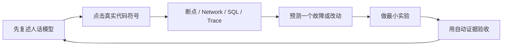

# 从Web小白到能设计开发Chat的学习路线

**归档日期**：2026-07-30

**分类**：00-从这里开始

**定位**：从只会少量C++到能审架构、加功能和掌握执行层的能力路线

**关联源码**：`frontend/src/`、`backend/app/`、`backend/tests/`、`frontend/tests/`、`frontend/e2e/`、`scripts/`

## 问题

目标不是会运行两条启动命令，而是掌握整个Chat：能说清前端、后端、Product Store、
MAF Workflow、Worker、pi、Tool、Evidence和恢复；能判断架构是否合理；新需求到来时知道
改哪个模块、为什么改在那里、需要什么测试。对一个几乎不懂Web前后端的读者，应该怎样
从零开始学到这个程度？

## 回答：我们不再按“文档数量”学，而是按6级能力过关

“高手”不表示背出全部类名，而是当出现一个新功能或故障时，你能独立完成这条推理：

```text
用户想得到什么
→ 如果没有它会出什么错
→ 哪个产品模块应该拥有事实和状态机
→ 哪个Application Coordinator拥有事务
→ 需要什么DTO / API / AG-UI事件
→ 前端怎样展示与提交操作
→ 失败、断线、重启和重复请求怎样收敛
→ 用什么合同、状态机、浏览器和Trace证明正确
```

为了走到这里，学习顺序不能跳过中间层。

## 1. 同一个概念固定用5个视图学

以FastAPI为例，每个核心概念都要经过下面5步：

| 视图 | FastAPI例子 | 为什么不能少 |
|---|---|---|
| 1. 人话与C++参照 | 它是“把URL和Python处理函数连起来的类型化路由表” | 先让你有可用的心智模型 |
| 2. Chat当前代码 | `main.py::create_app`创建`FastAPI`，各`create_*_router`注册路由 | 不学一个脱离项目的通用教程 |
| 3. 真实运行数据 | `GET /api/live`进来后的method、path、request ID和JSON响应 | 概念必须能在断点/Network中看到 |
| 4. 设计取舍 | Router只做协议转换，不直接写Product DB | 这才能审架构是否合理 |
| 5. 修改与验证 | 增加一个只读诊断字段，补DTO/路由/测试，确认不泄密 | 只有能安全改才算真正会 |

后续React、Product Session、MAF、Tool、Checkpoint和Evidence全部重复这套方法。

## 2. 6级学习路线

### B0：程序和Web系统怎样活起来

**前置**：会一点C++变量、函数和编译概念。

**学习内容**：

1. 源码、可执行文件、解释器、Runtime、进程和线程/任务。
2. 终端、Shell、当前目录、环境变量和依赖锁。
3. IP、端口、URL、HTTP、JSON、SSE、Origin、Proxy和CORS。
4. TypeScript/React/Vite与Python/Uvicorn/FastAPI的启动差异。

**当前入口**：[从C++到Chat：前后端怎样跑起来](./从C++到Chat前后端怎样跑起来.md)。

**过关**：能从两条启动命令说到Node/Python进程、15073/18030端口和浏览器Network；
能判断“页面打不开”、“页面在但API失败”和“端口在但断点暂停”是3类不同问题。

### B1：Python Web后端和React前端的框架机制

**前置**：B0过关。

**学习内容**：

1. Python package/module/import、class/object、decorator、type hint、`async/await`。
2. Uvicorn、ASGI、FastAPI App、Router、Pydantic DTO、Middleware、Lifespan和StreamingResponse。
3. JavaScript模块、React组件、Props、State、Hook、事件回调、渲染和副作用。
4. TypeScript类型与网络DTO为什么不是Product事实。

**当前入口**：

- [Uvicorn、FastAPI与Chat后端基础](./Uvicorn-FastAPI与Chat后端基础.md)。
- [配置怎样变成整个后端对象图](./配置怎样变成整个后端对象图.md)：Settings、组合根和Lifespan。
- [TypeScript、React与Chat前端基础](./TypeScript-React与Chat前端基础.md)：语言、组件、Props/State/Hook、组件树和重绘。
- [Vite、浏览器API与Chat网络调试基础](./Vite-浏览器API与Chat网络调试基础.md)：Vite、DOM/Event、Fetch/Abort、Storage、AG-UI流和DevTools。
- [Home、App Shell与Workbench怎样协作](../前端交互/Home-AppShell与Workbench怎样协作.md)：Feature和浏览器/后端状态边界。

**过关**：能把`GET /api/live`从原始HTTP请求追到FastAPI路由函数，再追到JSON返回；
能把React一次点击从表单事件追到`App.submit`、`useChatAgent.send`、HTTP/AG-UI事件、State更新和页面重绘。

### B2：一条Chat消息的纵向产品链

**前置**：B1过关，会看函数、方法、JSON和基本异步调用。

**学习内容**：

1. React View、网络DTO、内部Envelope、产品领域对象和MAF运行对象。
2. REST产品资源与AG-UI/SSE活动Run事件。
3. Product Session、Interaction、Message、Product Run、Run Attempt、Runtime Job和Cursor。
4. 浏览器 → FastAPI → Product Store → Worker → MAF → Journal → React的完整回程。

**当前入口**：

- [Chat系统总地图与学习方法](./Chat系统总地图与学习方法.md)。
- [Chat源码目录、文件职责与模块流程地图](./Chat源码目录文件职责与模块流程地图.md)。
- [第1课：从点击发送到ContextPackage](../调试实战/第1课-从点击发送到ContextPackage.md)。

**过关**：给出一个Product Run ID，能在Network、前端Hook、FastAPI端点、Product Store、
Runtime Job、Worker、MAF节点、Journal和页面找到同一轮的对应证据。

### B3：用产品保证审架构和模块边界

**前置**：B2过关，已经亲眼看过一条实际Run。

**学习内容**：

1. 6个产品问题、9类用户场景和它们要保护的不变量。
2. 7层是责任/信任/失败边界；14个状态所有者、3个应用组件和3类运行时职责是目标系统责任与所有权。
3. Product Store、Runtime Store、MAF Checkpoint、Artifact Store和浏览器投影。
4. Router、Application Coordinator、Domain Rule、Query Service、Adapter为什么分开。
5. 大文件的审查信号、合理拆分缝和不能破坏的事务/恢复不变量。

**当前入口**：

- [Chat总体架构与一次点击的七层链路](../架构与模块/Chat总体架构与一次点击的七层链路.md)。
- [14个状态所有者与3个应用组件的职责与代码落点](../架构与模块/14个状态所有者与3个应用组件的职责与代码落点.md)。
- [核心对象词典](../架构与模块/核心对象词典-谁创建谁保存谁消费.md)。
- [Project、Work、Plan、Action、Note与Memory为什么分开](../Product%20Harness与协作对象/Project-Work-Plan-Action-Note与Memory为什么分开.md)。
- [Intent到Plan](../协作理解与执行治理/Intent-澄清-协议-StepInput与Plan怎样连接.md)和
  [ExecutionDraft到RunSpec](../协作理解与执行治理/ExecutionDraft-RunSpec-HITL-Decision与Grant怎样连接.md)。

**过关**：面对“给Session加标签”或“把结果发到Telegram”，能先说出事实应归哪个模块、
不能放在哪里、会穿过哪些合同，而不是第一反应就在`App.tsx`或大Service中加代码。

### B4：掌握MAF Workflow与执行层

**前置**：B3过关，能区分产品事实与运行投影。

**学习内容**：

1. MAF Agent、Executor、Workflow Definition、节点/边、Checkpoint和Interrupt/Resume。
2. S1–S7是39节点的学习分组，不是整个Chat只有7阶段。
3. Runtime Job、Lease、Epoch、Worker、Event Journal、Cursor和Reconciler。
4. pi子进程、JSONL RPC、Provider Gateway、Tool Catalog/Call/Approval/Execution/Result。
5. Execution Workspace、Operation Ledger、Artifact、Validation、Evidence、Claim和Result Commit。
6. 断线、进程退出、超时、结果未知、幂等、对账和人工处置。

**当前入口**：

- 39节点总览和S1–S7七篇专题。
- [Agent、ModelCall、Workflow与Checkpoint](../Agent与MAF运行时/Agent-ModelCall-Workflow与Checkpoint怎样分工.md)。
- [Run、Worker、Cursor、Tool与Workspace](../运行执行与证据/Run-Worker-Cursor-Tool与Workspace怎样恢复.md)。
- [Artifact、Evidence、Validation、Claim与Result Commit](../运行执行与证据/Artifact-Evidence-Validation-Claim与ResultCommit怎样证明完成.md)。
- 执行层与pi运行时专题，以及SC08–SC15。

**过关**：能在运行前预测一个pi隔离编辑场景会创建哪些Run/Job/Tool/Operation/
Artifact/Evidence对象；能解释为什么“pi说完成”、“Tool返回0”和“Work已完成”是3个不同事实。

### B5：安全增加功能并审核架构

**前置**：B4过关，至少亲手跑过1条确定性查询、1条模型路径和1条执行路径。

**学习内容**：

1. 从场景、风险和产品保证选择模块与状态所有者。
2. 设计领域对象、状态机、revision/CAS、事务、Outbox、协议DTO和前端投影。
3. 写“改动影响矩阵”：Schema、Workflow Definition、Approval Hash、AG-UI事件、恢复、Trace、安全和UI。
4. 按风险选择单元、合同、状态机、数据库、故障、真模型和浏览器测试。
5. 用无行为重构规则治理大文件，不用机械分层和空接口制造假整洁。

**当前入口**：

- [SQLite、Alembic、事务、CAS、幂等与Outbox](../工程基础/SQLite-Alembic-事务-CAS幂等与Outbox怎样配合.md)。
- [测试金字塔、质量门与安全修改](../工程基础/测试金字塔-质量门与安全修改怎样配合.md)。

**过关**：

1. 独立完成1个低风险纵向功能，从用户场景到前端和测试。
2. 独立完成1个Worker/Checkpoint/Tool故障实验，说清恢复与不保证。
3. 对一个超线文件提出基于所有权的拆分候选，并列出不变量与回归证据；不要求当场必须拆。

## 3. 学习不是线性只读：每课使用同一个闭环



每课完成后至少留下4种答案：

1. **复述**：不看文档能说出它是什么、不是什么。
2. **定位**：能直接打开关键符号，不靠全仓盲搜。
3. **观察**：能指出一个运行时值和它的来源/下游。
4. **改动判断**：能预测改一个字段或失败语义会影响哪些合同和测试。

## 4. 你终于会怎样审架构

到B3–B5后，不再用“文件很大”或“类很多”单独判断架构。你会问：

1. 这个用户保证的唯一事实所有者是谁？
2. 网络DTO、领域对象、MAF状态和前端投影是否被错误复用？
3. 一个用例是否只有1个事务所有者？
4. Router是否只做协议转换，还是已经在拼业务事务？
5. Worker重试会不会重复Provider/Tool副作用？
6. 浏览器显示成功时，Product Store是否已经有权威终态和Evidence？
7. 这个拆分是真实的状态/事务/失败边界，还是只为了让文件变短？
8. 修改后哪些Schema、Hash、Workflow节点、协议事件和用户语义必须保持不变？

这些问题才是“能决策架构和新功能”的实际能力。

## 5. 当前教材状态：什么已有，什么仍缺

| 能力级 | 当前状态 | 不能冒充的完成 |
|---|---|---|
| B0 运行基础 | 已有L1/L2入口 | 不表示已懂React/FastAPI框架内部 |
| B1 框架基础 | Uvicorn/FastAPI、配置/组合根、React/TypeScript/Vite/浏览器API、App Shell已有L1/L2入口 | 不表示已能改产品状态 |
| B2 纵向产品链 | 总地图、对象词典、公共调用栈和15张SC均有可执行入口 | 不表示每张SC都是L2真实Run |
| B3 架构与模块 | 7层、14+3+3责任、Harness/Intent/执行治理专题已有L1/L2入口 | 不表示当前目录已经按目标物理重构 |
| B4 执行与恢复 | Agent/MAF、Run/Worker/Tool、Evidence专题和SC08–SC15已补 | 通用Tool对账、任意Workflow/活动pi跨进程恢复仍未实现 |
| B5 安全改动 | Store/事务/Outbox和测试质量专题已补L1/L2/L3训练入口 | 仍需你亲手完成纵向功能和故障实验才算个人过关 |

## 6. 建议的实际学习节奏

不按“一天读完几篇”排期，按过关证据排：

1. 先完成B0的12道验收题。
2. 再学Uvicorn/FastAPI，亲手追`/api/live`、`/api/sessions`和`/api/agent`3种请求。
3. 学完React/TypeScript和Vite/浏览器API两课，亲手追一次“点击→Hook→HTTP→State→重绘”。
4. 用SC01建立第一条完整Product Run数据链。
5. 回到7层、14+3+3责任和对象词典，此时它们应该是对真实经验的压缩，而不是待背的名词。
6. 依次读Harness、Intent/治理、Agent/MAF、Run/Worker和Evidence专题，再用SC02掌握三次模型治理。
7. 按SC03–SC15的`教材成熟度`复跑；L1+场景先按受控数据验证，不能自称看过真实Run。
8. 最后用1个低风险纵向功能与1个故障实验做B5验收。

## 关键文件

| 文件 | 职责 |
|---|---|
| [项目掌握索引](../INDEX.md) | 按当前前置关系给出真正阅读顺序 |
| [全盘掌握范围与覆盖审计](./全盘掌握范围与覆盖审计.md) | 防止课程只覆盖一条Workflow或一部分代码 |
| [工程编码与模块设计规范](../../docs/engineering-standards.md) | 模块、事务、注释、规模审查和测试硬门 |
| [`coverage-manifest.json`](../coverage-manifest.json) | 28个学习单元、源码面和缺口的机器总账 |

## 补充记录

- 2026-07-30：根据“不只启动系统，而要从Web零基础到掌握执行层并能审架构”的要求，建立B0–B5能力路线。
- 2026-07-30：补齐配置、App Shell、Harness、Intent、执行治理、Agent、执行Runtime、Evidence、Store和测试共10个横向专题，并将15张SC的真实、受控和缺口证据接入路线。
