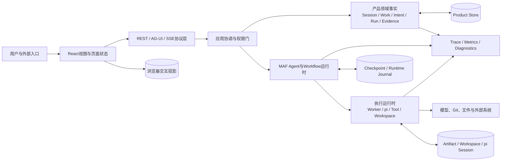

# Chat全盘掌握范围与覆盖审计

**归档日期**：2026-07-29
**分类**：00-从这里开始
**关联源码**：`backend/app/`、`frontend/src/`、`backend/tests/`、`frontend/tests/`、`frontend/e2e/`、`backend/migrations/versions/`、`scripts/`、`deploy/`

## 问题

“从一次点击讲到节点3”只能帮我理解一个局部。怎样证明后续学习真的覆盖整个Chat，而不是继续围绕阶段A、
`recent_turn_summaries`或39节点中的少数概念打转？

## 先说结论

从现在起，“全盘掌握Chat”不是一句口号，而是下面4本互相校验的账：

1. **目标能力账**：完整Chat最终要承担什么责任，共11个目标模块。
2. **当前实现账**：仓库今天真实存在什么，覆盖前端、后端、Workflow、进程、协议、存储和测试。
3. **学习单元账**：把前两本账拆成27个可验收单元，每个单元都要达到L1、L2或L3。
4. **缺口账**：目标已定义但尚未实现、代码已存在但尚未讲懂、以及尚待详细设计的内容都要明示。

机器清单在[`coverage-manifest.json`](../coverage-manifest.json)，校验程序是
[`scripts/check-project-mastery.py`](../../scripts/check-project-mastery.py)。新增源码面、Workflow或节点后没有归入任何
学习单元，校验会直接失败。

> **当前准确状态**：覆盖骨架和此前明确缺失的10个横向小白专题已经建立；15张SC也都有成熟度、具体数据、图、
> 断点导航和修改入口。这仍不等于个人已经掌握，更不表示未实现目标或缺真实Run的L1+场景已经完成。

## 1. 先建立一个不会混淆的总模型

Chat不是一条从输入到模型输出的直线。它至少同时运行在7个层面：



最重要的不变量是：**产品事实、运行时状态、协议投影和浏览器状态不是同一个东西**。例如：

- Product Session是用户可恢复的产品会话，不等于MAF AgentSession。
- Product Run是用户长期可见的一次执行事实，不等于AG-UI Thread，也不等于Runtime Job；它的一次实际执行才叫Run Attempt。
- ContextPackage是某个Run采用的上下文快照，不等于完整消息历史，也不等于长期Memory。
- 模型说“完成”只是候选声明，不等于Work已完成；还需要Evidence、Validation和Result Commit。

这张图只是骨架。下面3本账负责证明它没有漏掉代码和目标能力。

## 2. 目标能力账：完整产品的11个模块

这11项来自已经批准的目标总体架构。它们说明完整Chat最终必须负责什么；“架构已批准”不代表每个模块
已经实现，也不能把详细设计一并视为获批。

| # | 目标模块 | 它要回答的用户问题 | 学习单元 | 当前边界 |
|---:|---|---|---|---|
| 1 | Identity与Channel Binding | 我是谁，从哪个入口来，有什么权限，怎样绑定同一身份？ | M22 | 目标已定义，认证与外部Channel主链尚未实现 |
| 2 | Conversation | 会话、消息、Interaction如何创建、查询和恢复？ | M05 | 已有Product Session主链，完整分支/跨入口仍是后续能力 |
| 3 | Collaboration | 系统怎样形成Intent、Project/Work绑定、Plan和执行申请？ | M06、M08、M09、M10 | 核心纵向链已实现，仍需逐对象掌握 |
| 4 | Context | 本轮到底采用了哪些信息，来源、版本和新鲜度如何证明？ | M07、M14 | 已有ContextPackage与仓库资源链 |
| 5 | Memory | 哪些候选信息可以变成长期记忆，谁批准，怎样追溯？ | M06、M07 | 已有候选/提交边界，不等于完整长期记忆产品 |
| 6 | Interaction协调器 | 一次用户动作怎样跨领域对象和Workflow形成闭环？ | M11 | 主Workflow已有39节点 |
| 7 | Run管理 | 运行、失败、重试、重启、续接和恢复各是什么意思？ | M13、M18 | 已有Job/Worker/Lease/Cursor主干，能力等级需逐项核验 |
| 8 | Tool执行 | pi、只读Tool、可写Operation、Workspace怎样受治理？ | M15、M16 | 两条pi路径与Tool/Operation主干已存在 |
| 9 | Evidence | 为什么“模型说完成”不能直接把Work改为完成？ | M17 | Artifact/Evidence/Validation/Claim链已存在 |
| 10 | Delivery | 结果怎样可靠投递到Web、Telegram或外部集成入口？ | M23 | 目标已定义，独立Delivery主链未实现 |
| 11 | Super Admin Operations | 超级管理员怎样审计身份、使用、Work、Artifact和异常？ | M24 | 目标已定义，运营看护台未实现 |

此外还有3类横切责任，不能硬塞进某一个模块：

1. 前端App Shell、Home、移动端与PWA（M02、M25）。
2. 数据库、事务、Outbox、测试、CI和供应链（M19、M20）。
3. 部署、容量、SLO、备份、保留、灾难恢复和正式安全（M21、M26）。

## 3. 学习单元账：27个单元，一个都不能静默消失

状态含义：`L1`是能讲懂，`L2`是能在界面、代码、库和Trace中定位，`L3`是能安全修改并验证。

| 单元 | 完整主题 | 当前学习材料状态 |
|---|---|---|
| M00 | 产品问题、目标架构、当前实现和未实现边界 | 已有L1入口 |
| M01 | 配置、组合根、应用工厂和生命周期 | L1专题＋L2启动观察入口；不读取私有配置值 |
| M02 | React App Shell、Home、移动端、PWA和页面状态 | 基础与App Shell/Workbench已有L1/L2入口；未实现Home目标保留缺口 |
| M03 | REST、DTO、RequestContext、错误和安全边界 | FastAPI/REST基础已有L1/L2入口；完整安全与身份仍待补 |
| M04 | AG-UI请求、SSE、事件重放和端到端外层链 | 已有L2场景入口 |
| M05 | Product Session、Interaction、Message和历史恢复 | 已有L1 |
| M06 | Harness的Project、Work、Plan、Action、Note和Memory | L1专题＋L2自动合同入口 |
| M07 | TurnDigest、ContextPackage、来源采用和回合沉淀 | 已有L2场景入口 |
| M08 | Intent Set、Clarification、协作协议和StepInput | L1专题；SC03第一轮L2/跨回合L1+，SC04 L1+ |
| M09 | ExecutionDraft、RunSpec、HITL Policy、Decision、Grant和Approval | L1专题；SC08 L2，SC07/SC15 L1+ |
| M10 | Agent Profile、Provider、ModelCallDraft、Attempt和精确请求 | L1专题；SC02/SC08 L2，SC07 L1+ |
| M11 | Interaction协调和持续协作主Workflow的39节点闭环 | S1–S7 L1完整；15场景按真实/受控证据分别为L1+到L2+ |
| M12 | MAF适配、Workflow目录、Checkpoint和5个辅助Workflow | L1专题＋跨进程Checkpoint L1+；辅助Workflow逐个L2仍缺 |
| M13 | Product Run/Attempt、Runtime Job、Worker、Lease、Cursor和恢复 | L1专题＋SC12–SC15 L1+ |
| M14 | Repository Binding、Snapshot、Context新鲜度和Git事实边界 | L1通用专题＋SC06失败链/SC09只读L2 |
| M15 | pi子进程、JSONL RPC、Provider Gateway、只读Tool和pi Session | 已有L1，部分L2 |
| M16 | Execution Workspace、ToolExecution、Operation、精确edit和对账 | L1专题＋SC09 L2/SC10 L1+；通用外部对账仍是实现缺口 |
| M17 | Artifact、Evidence、Validation、Claim、Result Commit和Provenance | L1专题＋受控完整链；真实SC10仍暴露0 Artifact/Claim/Commit |
| M18 | Product Finalization、双Trace、日志、Metrics和Diagnostics | 已有L2场景入口 |
| M19 | SQLite/Alembic、事务、CAS、幂等、Outbox和物理Store | L1专题＋L2幂等/Outbox实验入口 |
| M20 | 测试金字塔、质量门、故障实验、CI、依赖和供应链 | L1/L2/L3训练入口已补；个人综合修改待验收 |
| M21 | 本地/分布式进程、VS Code调试、手机Relay和部署 | 本地启动与后端进程已有L1/L2；分布式与Relay为部分L2 |
| M22 | Identity、Authentication Session、Role/Grant、Channel Binding和Ingress | 目标已定义，当前未实现 |
| M23 | Delivery、Channel Adapter、OPC-OS Bridge和跨入口连续性 | 目标已定义，当前未实现 |
| M24 | Super Admin Operations、活动口径、运营投影和审计 | 目标已定义，当前未实现 |
| M25 | 连续对话流、Conversation Day、Home、协作日历和Idea Garden | Home/App Shell已有L1专题；其余目标仍未实现 |
| M26 | 容量、性能、SLO、备份、保留、灾难恢复和正式安全 | 目标待详细设计 |

这张表回答“要学什么”；具体材料、源码归属和状态由机器清单维护，避免Markdown表与代码漂移。

## 4. 当前实现账：不能只盘点Python类

2026-07-29的仓库快照至少包含：

| 观察面 | 已纳入覆盖清单的数量 | 为什么单独盘点 |
|---|---:|---|
| 后端Python源码文件 | 142 | 业务对象、适配器、Worker和入口都在这里，但文件数不等于能力数 |
| 后端顶层源码面 | 37 | 新增一个顶层能力目录/模块时必须归入M00-M26 |
| 前端源码文件 | 87 | 页面、Hook、投影和API Client都需要掌握 |
| 前端Feature目录 | 13 | 防止只讲后端、不讲用户实际看到和操作的界面 |
| 前端根源码面 | 38 | 防止散落在Feature目录外的入口、Store、Hook和Workbench漏掉 |
| 后端测试文件 | 48 | 合同、状态机、失败和恢复事实的证据来源 |
| 前端测试/E2E文件 | 26 | 投影、API合同、浏览器链和可访问性的证据来源 |
| Alembic迁移 | 22 | 数据对象的历史演进和持久化边界 |
| SQLAlchemy表 | 90 | 物理事实很多，必须按领域对象学习，不能逐表死背 |
| Workflow | 6 | 主Workflow不是系统里唯一的Workflow |
| 主Workflow节点 | 39 | 必须逐节点覆盖，但节点表仍不是产品总架构 |
| 当前/目标运行角色 | 10 | API、Worker、子进程、Relay与未来Channel/Delivery不能混作一个进程 |
| 当前/目标协议边界 | 9 | 每种合同拥有不同职责、失败语义和安全边界 |
| 当前/外部/目标状态位置 | 10 | 防止Product事实、Checkpoint、日志、浏览器和外部状态混用 |

### 4.1 后端37个顶层源码面

机器清单逐项映射了：应用入口与配置、API、Product Session、Harness、协作Context/Intent/Protocol、
Governance、Agent与Provider、Workflow、Runtime Execution、Execution Dispatch、Workspace、Tool、Evidence、
Readonly Tools、pi Gateway/Runtime/Session、Project Resources、Observability、Home、E2E和各类Worker。

这意味着后续不能只沿`continuous_chat.py`讲系统，也不能只沿数据库表讲系统。每个源码面必须回到它拥有的
产品责任、事务、协议和用户可见结果。

### 4.2 前端51个源码面

前端按13个Feature目录和38个根源码入口核对，覆盖Agents、Chat、Governance、Harness、Home、Mobile、
Model Call Review、Protocols、Session、Settings、Shared、Tools、Workflow，以及App Shell、API Client、
HITL页面、各类Workbench、事件重放、Zustand页面状态和PWA状态。

前端不是后端的“壳”。需要单独掌握3个问题：它展示哪种后端投影、哪些状态只属于页面、断线或刷新后从哪里恢复。

### 4.3 代码注释账

代码注释也必须诚实区分“已经覆盖”和“准备覆盖”：

1. **已建立硬门**：主Workflow的39个目录节点、27个Executor类和全部MAF `handler/response_handler`
   已有中文学习注释，并由`test_continuous_workflow_learning_comments.py`检查节点号、阶段和中文说明。
2. **已有样本级注释**：`CollaborationState`、TurnSummary、ContextPackage及建包服务附近已经说明状态所有权、
   内存/持久化边界和下游用途。
3. **本轮新增的入口锚点**：`asgi.py`、`main.py`、`composition.py`、`lifecycle.py`和前端`main.tsx`
   已补“所在链路、职责边界和状态所有权”注释，并有Uvicorn/FastAPI教程与源码地图承接。
4. **尚未宣称完成**：M01-M26的其余入口没有完成逐单元“学习锚点”审计。代码原有Docstring可能符合工程维护
   标准，但不自动等于小白能沿链路学习。

后续每补一个单元，应该在3到8个关键符号附近补充必要注释，说明“它位于哪条链、输入/输出对象、状态所有者、
失败/恢复语义和下游”；不能给每一行复述语法，也不能靠海量注释替代专题文档和调试实验。

## 5. Workflow账：39节点全部纳入，但不把节点当成全部Chat

### 5.1 主Workflow的39节点

| 节点 | 真实符号 | 主要职责 |
|---:|---|---|
| 1 | `input_acceptance` | 接受本轮输入并建立回合事实 |
| 2 | `context_candidates` | 生成可被采用的上下文候选 |
| 3 | `harness_directory_context` | 读取Harness目录级上下文 |
| 4 | `context_adoption` | 决定本轮实际采用哪些来源 |
| 5 | `directory_context_revision` | 固化目录上下文修订版本 |
| 6 | `intent_agent` | 生成Intent候选 |
| 7 | `intent_set_projection` | 投影结构化Intent Set |
| 8 | `intent_binding` | 把Intent绑定到协作对象 |
| 9 | `intent_set_acceptance` | 把审核后的Intent同步为接受revision |
| 10 | `harness_project_resolver` | 解析相关Project |
| 11 | `project_work_binding` | 绑定Project与Work |
| 12 | `harness_detail_context` | 读取Project/Work详细上下文 |
| 13 | `detail_context_adoption` | 采用详细上下文来源 |
| 14 | `detail_context_revision` | 固化详细上下文修订版本 |
| 15 | `collaboration_protocol_resolver` | 选择本轮协作协议 |
| 16 | `scenario_router` | 根据场景选择后续路径 |
| 17 | `project_catalog_query` | 查询项目目录场景 |
| 18 | `clarification` | 生成需要用户补充的问题 |
| 19 | `planning_agent` | 生成Plan候选 |
| 20 | `plan_acceptance` | 接受或修正Plan |
| 21 | `execution_draft_compiler` | 把计划编译成执行申请 |
| 22 | `execution_authorization` | 检查执行是否获授权 |
| 23 | `run_spec_compiler` | 固化可运行的RunSpec |
| 24 | `execution_route` | 选择回答、只读pi或Workspace执行路径 |
| 25 | `execution_workspace_prepare` | 准备隔离执行Workspace |
| 26 | `pi_workspace_dispatch` | 调用可写pi执行路径 |
| 27 | `pi_workspace_result_assembly` | 组装Workspace执行结果 |
| 28 | `result_claim_prepare` | 把结果声明转成待核验Claim |
| 29 | `result_claim_decision` | 审核结果声明和证据 |
| 30 | `pi_readonly_dispatch` | 调用只读pi路径 |
| 31 | `pi_readonly_result_assembly` | 组装只读结果 |
| 32 | `response_agent` | 形成面向用户的响应候选 |
| 33 | `turn_summary_agent` | 形成下一轮可用的回合摘要候选 |
| 34 | `result_commit` | 决定答复候选是否可提交 |
| 35 | `work_state_commit` | 决定Work状态候选 |
| 36 | `memory_commit` | 决定Memory候选 |
| 37 | `harness_candidate_commit` | 幂等提交全部已获准Harness候选 |
| 38 | `turn_summary_persist` | 持久化TurnSummary及事实引用 |
| 39 | `result_finalization` | 产生图内最终输出，交给图外Product终态门 |

不能按1到39理解为每轮必然串行执行：节点16和24会分流，授权/决策节点可能中断等待，失败路径会提前结束，
恢复时也可能从Checkpoint或产品事实接回。学习M11时必须分别跑“直接回答、澄清、只读pi、Workspace执行、
等待审批、失败”这些路径。

### 5.2 另外5个Workflow也必须掌握

除`continuous-collaboration`外，目录中还有：

1. `chat-model-call-approval`：单次模型调用审批。
2. `nested-quality-demo`：8节点嵌套质量示例。
3. `governed-agent-handoff`：3节点受治理Agent交接。
4. `governed-idiom-chain`：5节点受治理模型链。
5. `governed-pi-agent`：3节点受治理pi Agent执行。

它们统一归入M10、M12和M15，不能因为前端默认选择主Workflow就从架构说明里消失。

## 6. 进程、协议和存储账

### 6.1 进程/部署角色

当前需要掌握的运行角色包括React/Vite或静态前端、FastAPI应用、Execution Worker、Governance Outbox Worker、
pi子进程、Validation子进程，以及手机访问时的Nginx/反向SSH/LaunchAgent链。某些本地Profile会把职责嵌入同一
进程，但职责没有因此合并。

目标架构还定义了尚未完整实现的Channel Adapter Host、Delivery Worker和运营投影角色。学习时必须标记为
“目标”，不能伪装成当前代码。

### 6.2 协议边界

| 协议/合同 | 连接什么 | 不负责什么 |
|---|---|---|
| REST | 管理Session、Project、Work、Run、Artifact等产品资源 | 不承担实时Agent事件流 |
| AG-UI + SSE | 一次Agent Run的请求、事件、状态投影和中断/恢复交互 | 不是产品数据库 |
| Provider API | Chat向模型供应商发起精确模型调用 | 不能成为产品权限或记忆事实源 |
| pi JSONL RPC | Chat与pi子进程交换Session、Prompt、事件和结果 | 不自动提供产品审批与Evidence语义 |
| Tool/Provider Gateway HTTP | 执行层回调Chat受治理的能力 | 不允许绕过Grant和审计 |
| SQLAlchemy/Alembic | 产品事实的读写和Schema演进 | 不是跨模块公共内存 |
| Git与文件系统 | 代码快照、Workspace、Artifact和证据载体 | 文件存在不等于Work完成 |
| Nginx/反向SSH | 手机或远端访问本地服务 | 不改变身份、授权和权威状态边界 |

### 6.3 物理状态位置

至少要区分Product Store、MAF Checkpoint、Runtime Journal/事件、Artifact与Evidence存储、Execution Workspace、
Git仓库、pi Session JSONL、进程日志、浏览器草稿/页面状态和外部Provider状态。掌握M19时，要能回答每类状态的
创建者、权威所有者、提交时机、恢复用途和删除/保留规则。

## 7. 测试和安全修改账

“全盘掌握”最终要落到能修改代码，因此M20不是附录。需要会使用：

1. 领域/合同/状态机测试，证明对象和状态转换。
2. API、并发、失败、幂等和恢复测试，证明边界条件。
3. 前端单元测试、类型检查和生产构建，证明投影与交互。
4. 浏览器E2E，证明用户路径。
5. 真实MAF/真实模型/pi运行，证明Mock之外的链路。
6. Migration、架构合同、文档链接、Secret和供应链检查，证明工程可持续性。

L3验收不是“改完能启动”，而是能先说出会影响哪些DTO、表、Hash、Workflow节点、审批、恢复、Trace和测试，
再用对应证据证明没有制造假成功或双重事实源。

### 7.1 场景预言机账

2026-07-30新增[场景实验室](../调试实战/00-场景实验室使用方法.md)和
[`scenario-manifest.json`](../调试实战/scenario-manifest.json)，把“测试文件很多”转换成用户可以逐项执行的
15个场景合同：

1. SC01–SC04覆盖确定性查询、普通问答、澄清和多Intent规划。
2. SC05–SC08覆盖Context revision/来源失效、模型请求修改与放弃。
3. SC09–SC11覆盖pi只读、隔离精确编辑、Evidence和Validation失败/未知。
4. SC12–SC15覆盖断线回放、取消、Retry/Restart和跨进程HITL恢复。

每个场景单独成文并绑定pytest函数、输入族、预言机强度、关键对象/Store、必经/禁止节点和失败判定；现在还统一
包含`maturity/evidence_kind/current_run_id`、具体对象数据、Mermaid图、断点来路/下一跳和修改影响。
`scripts/check-project-mastery.py`会检查这些机器/人读成熟度存在。机器校验只能证明映射与口径存在；用户仍需用自己的
Prompt完成手动断点与Trace对账，才能把个人掌握状态记为L2。

## 8. 推荐学习顺序：这是学习波次，不是产品阶段

| 波次 | 单元 | 学完后的能力 |
|---|---|---|
| 1. 看见系统骨架 | M00-M05 | 能从一次点击跟到REST/AG-UI、Product Session和页面回放 |
| 2. 看懂协作决策 | M06-M12 | 能解释Context、Intent、Plan、Approval、ModelCall和全部Workflow |
| 3. 看懂真实执行与完成 | M13-M18 | 能跟踪Worker、pi、Tool、Workspace、Evidence、Commit和Trace |
| 4. 能维护并补全产品 | M19-M26 | 能处理事务/测试/部署，并明确Identity、Delivery、运营和非功能缺口 |

每个单元仍按同一个闭环学习：具体场景 → 对象样本 → 生命周期 → 设计取舍 → 实际代码 → 断点/查询/Trace →
掌握验收。不能读完波次名称就算完成。

## 9. 如何证明今后没有继续漏

运行：

```bash
.venv/bin/python scripts/check-project-mastery.py
```

它会核对：

1. 根README能到唯一课程入口，01–60课号连续，全部60篇学习者文档恰好排课1次。
2. 27个学习单元ID唯一且引用文档存在。
3. 总体架构的11个目标模块全部有学习单元。
4. `backend/app`的全部37个顶层源码面都有归属。
5. `frontend/src/features`的13个目录和根目录38个源码文件都有归属。
6. Workflow目录的6个Workflow、S1–S7和主Workflow39个节点逐项一致。
7. 10个运行/部署角色、9个协议边界和10个状态位置都有学习单元。
8. 测试、迁移、脚本、CI、部署和VS Code调试面存在且有归属。

它不能替代人的架构判断，所以还要做两个人工检查：

- 新能力即使塞进旧目录，也要判断是否产生了新的对象、状态所有权、协议或进程角色。
- 每个单元的`mastery`必须诚实更新；只有目录映射、没有小白文档和调试实验，仍然是“待补”。

## 关键文件

| 文件 | 职责 |
|---|---|
| [`项目掌握/coverage-manifest.json`](../coverage-manifest.json) | 27单元与目标模块、源码面、Workflow和质量面的机器映射 |
| [`项目掌握/调试实战/scenario-manifest.json`](../调试实战/scenario-manifest.json) | 15个端到端场景、预言机、节点与pytest证据映射 |
| [`scripts/check-project-mastery.py`](../../scripts/check-project-mastery.py) | 检查新增或删除内容有没有造成覆盖漂移 |
| [`docs/overall-architecture-proposal.md`](../../docs/overall-architecture-proposal.md) | 已批准目标架构和11个目标模块 |
| [`backend/app/workflows/continuous_chat_factory.py`](../../backend/app/workflows/continuous_chat_factory.py) | 主Workflow的节点与边定义 |
| [`backend/app/workflows/catalog.py`](../../backend/app/workflows/catalog.py) | 6个Workflow的注册目录 |
| [`PROJECT_STATE.md`](../../PROJECT_STATE.md) | 当前已经实现、阻塞和待审核事实 |

## 掌握验收

1. 为什么“39个节点一个不漏”仍然不等于掌握整个Chat？
2. 说出4类不能合并的状态位置，并说明各自的权威所有者。
3. Identity、Delivery和Super Admin为什么必须纳入学习总账，即使当前尚未实现？
4. 新增`backend/app/delivery/`后，需要更新哪些清单和验证？
5. 一个单元标记为L1、L2、L3分别需要什么证据？

## 补充记录

- 2026-07-29：因用户指出原覆盖表仍偏向阶段A和少数概念，首次建立27单元、11目标模块、全部当前源码面与
  Workflow节点的机器可检验总账。
- 2026-07-30：补齐M01/M02/M06/M08-M10/M12-M20的10个横向小白专题，升级SC03-SC15的数据、图、断点和修改入口；
  机器账开始区分真实Run、受控组件和真实缺口，SC10未被误标为成功L2。
- 2026-07-30：建立README到INDEX的唯一课程入口和01–60逐篇顺序；检查器反向枚举全部学习者Markdown，
  防止场景卡、调试配置或未来新增专题只存在于目录中却没有进入学习路线。
