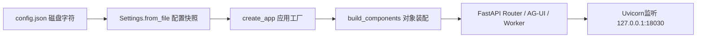

# 配置怎样变成整个后端对象图

**归档日期**：2026-07-30  
**分类**：00-从这里开始  
**关联源码**：`backend/app/config.py`、`backend/app/asgi.py`、`backend/app/main.py`、`backend/app/composition.py`、`backend/app/lifecycle.py`

## 问题

`backend/config.json`里的一项配置，怎样从磁盘上的字符变成正在运行的FastAPI、数据库服务、模型Provider、
Worker和pi进程管理器？为什么不让每个Router自己读配置、自己创建依赖？

## 1. 先固定一个具体场景

你执行：

```bash
cd /Users/xulater/Code/Chat/backend
../.venv/bin/uvicorn app.asgi:app --host 127.0.0.1 --port 18030
```

预期不是“Python文件运行了”这么简单，而是下面这条对象链成立：



私有配置只在本机读取，不能复制到文档、日志、Trace或浏览器。学习时只看
`backend/config.example.json`的字段形状。

## 2. 要解决的真实问题

如果Router收到请求时才临时读配置、创建数据库和Provider，会出现3种错误：

1. 同一进程内不同请求可能看到不同配置，行为无法复现。
2. 测试难以注入假的Transport或临时数据库。
3. 数据库、后台Worker和子进程无法统一启动与关闭，容易泄漏资源。

因此当前实现使用“启动时快照＋唯一组合根＋生命周期钩子”。

## 3. 一句人话定义

- **配置快照（Settings）**：启动时把JSON校验成的一组Python对象；它不是每次请求都重新读取的全局字典。
- **应用工厂（Application Factory）**：`create_app()`根据Settings造出一个FastAPI应用；类似C++里返回已配置服务器对象的工厂函数。
- **组合根（Composition Root）**：`build_components()`唯一负责把服务和适配器接线；它不处理产品业务。
- **Lifespan（应用生命周期）**：FastAPI启动/关闭时执行的资源初始化和清理；不是Product Session生命周期。

## 4. 一个具体对象样本

以下是脱敏形态，不是本机私有配置原文：

```json
{
  "Settings": {
    "host": "127.0.0.1",
    "port": 18030,
    "database_url": "sqlite+aiosqlite:///backend/.data/chat.db",
    "runtime_mode": "model | bootstrap",
    "workspace_root_count": 2,
    "artifact_store_available": true
  }
}
```

字段来源要分清：`host/port`来自配置；`runtime_mode`由是否存在有效模型目录推导；
`ApplicationComponents`里的服务对象由Chat后端创建，不来自JSON。

## 5. 对象生命周期

| 对象 | 谁创建 | 存在哪里 | 谁消费 | 何时结束 |
|---|---|---|---|---|
| `Settings` | `Settings.from_file()` | FastAPI进程内存 | 应用工厂、组合根 | 进程退出 |
| `ApplicationComponents` | `build_components()` | FastAPI进程内存 | Router、AG-UI、Worker | Lifespan关闭 |
| `ProductDatabase` | 组合根 | 进程内服务对象；事实落SQLite | 所有产品服务 | Engine关闭 |
| `ExecutionWorker` | 组合根 | API进程或独立Worker进程 | Runtime Job | 进程/任务停止 |
| `PiRuntimeManager` | 有模型目录时由组合根创建 | 进程内管理对象 | 执行派发 | 关闭子进程 |

配置本身不是Product Store，也不能成为每轮可修改的业务对象。

## 6. 为什么这样设计

看似更简单的方案是各Router直接`Settings.from_file()`并`Service(...)`。它少写一个组合文件，却会把
配置读取、对象所有权和业务流程散落到请求路径。当前方案让依赖在一个地方可见，允许测试把
`model_call_transport`、`product_session_service`或`pi_runtime_manager`显式替换；代价是
`composition.py`字段较多，但这是“装配复杂度集中”，不是业务全部糅合。

## 7. 按时间顺序的代码链

| 顺序 | 点击源码入口 | 输入 | 输出/下一跳 |
|---:|---|---|---|
| 1 | [`backend/app/asgi.py`](../../backend/app/asgi.py) | Uvicorn导入`app.asgi:app` | 调用应用工厂 |
| 2 | [`Settings.from_file`](../../backend/app/config.py) | JSON文件 | 不可变配置快照；非法字段立即失败 |
| 3 | [`create_app`](../../backend/app/main.py) | `Settings`和可选测试替身 | FastAPI实例 |
| 4 | [`build_components`](../../backend/app/composition.py) | Settings | `ApplicationComponents`对象图 |
| 5 | [`expose_components`](../../backend/app/composition.py) | App＋对象图 | 测试/生命周期可定位依赖 |
| 6 | [`register_runtime_surfaces`](../../backend/app/composition.py) | 服务和Workflow | REST、AG-UI与运行入口 |
| 7 | [`create_lifespan`](../../backend/app/lifecycle.py) | 数据库、Worker、对账器 | 启动初始化；关闭时释放 |
| 8 | Uvicorn | ASGI应用 | 监听TCP端口，等待HTTP请求 |

这里的`../../backend`链接从当前文档目录指向仓库源码；查找时优先搜表中的符号名，不依赖易变行号。

## 8. 亲手验证

1. 在`Settings.from_file`、`create_app`、`build_components`、`create_lifespan`下断点。
2. 启动后端；前三个断点只应在应用启动阶段命中，不应每次`GET /health`都命中。
3. 观察`settings.runtime_mode`、`len(settings.workspace_roots)`，不要展开Key。
4. 在`build_components`看`product_sessions.database is runtime_execution.database`关联的同一物理Store。
5. 终端验证监听与健康：

```bash
lsof -nP -iTCP:18030 -sTCP:LISTEN
curl -sS http://127.0.0.1:18030/health
```

失败预期同样重要：把`config.example.json`复制到临时位置并制造非法`server.port`，
`Settings.from_file()`应在监听端口前失败，而不是带病启动。

## 9. 掌握验收

1. 为什么Settings是“进程配置快照”而不是产品事实？
2. `create_app`与`build_components`分别负责什么？
3. 新增一个外部存储适配器时，在哪装配、在哪启动关闭、在哪写业务规则？
4. 为什么测试可以换Transport，却不应让生产Router按请求换Provider？

## 关键文件

| 文件 | 职责 |
|---|---|
| `backend/app/config.py` | 解析、校验并形成Settings；不输出私有值 |
| `backend/app/composition.py` | 唯一依赖装配中心 |
| `backend/app/main.py` | 创建FastAPI、挂载Middleware和路由 |
| `backend/app/lifecycle.py` | 初始化、后台任务和资源清理 |
| `backend/app/asgi.py` | Uvicorn稳定导入入口 |

## 补充记录

- 2026-07-30：补齐M01“配置全集→组合根→生命周期”的小白入口。

