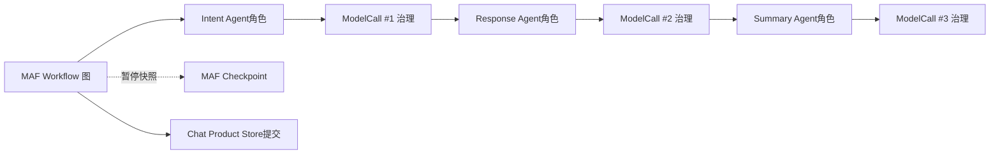

# Agent、ModelCall、Workflow与Checkpoint怎样分工

**归档日期**：2026-07-30  
**分类**：Agent与MAF运行时  
**关联源码**：`backend/app/agents.py`、`backend/app/agent_profiles.py`、`backend/app/model_call_workflow.py`、`backend/app/workflows/runtime.py`、`backend/app/workflows/checkpoints.py`、`backend/app/product_sessions/agui.py`

## 问题

系统里都在说Agent、模型调用、Workflow、MAF Session和Checkpoint，它们到底是什么关系？哪些是Microsoft Agent
Framework（MAF）原生运行机制，哪些是Chat为了产品治理增加的？

## 1. 一个具体场景

输入：`用一句话解释什么是递归。`

当前持续协作主Workflow会让3个语义Agent角色参与：Intent Agent、Response Agent、Turn Summary Agent；每一次
调用都先变成可审核的ModelCallDraft，再由MAF Workflow把结果送到下一节点：



## 2. 要解决的问题

若把“Agent”等同于“一次HTTP模型请求”，就解释不了一个Agent的Profile、工具和多次模型循环；若把MAF Session
等同Product Session，Checkpoint清理就可能误删聊天历史。若认为MAF自动提供审批、产品事实和精确发送合同，
又会高估框架能力。

## 3. 一句人话定义

- **Chat Agent角色**：带职责、Profile、模型与允许工具的语义执行者；不是Product用户，也不是OS进程。
- **ModelCall**：Agent对Provider的一次模型边界调用；一个Agent Run可能有多次。
- **MAF Workflow**：由Executor、边和Switch组成的运行图；不是Product Work，也不是项目交付路线。
- **MAF AgentSession**：框架运行对话/状态容器；不是Product Session。
- **MAF Checkpoint**：Workflow暂停/恢复快照；不是产品数据库备份。
- **AG-UI Thread/Run**：前后端实时交互协议身份；不能作为授权依据。

## 4. 一个具体对象样本

```json
{
  "product_run_id": "run-...",
  "maf_workflow": {"id": "continuous-collaboration", "version": "1.8.0"},
  "agent_profile": {"key": "intent_router", "model": "selected-model", "tool_profile": null},
  "model_call": {
    "call_ordinal": 1,
    "draft_revision": 1,
    "policy_action": "require_human",
    "attempt_count": 1,
    "output_disposition": "accepted_as_intent"
  },
  "checkpoint": {"status": "pending | restored | consumed", "product_run_id": "run-..."}
}
```

Provider ID、耗时和Token属于observe级实际值，不应在场景预言机里承诺固定数字。

## 5. 生命周期与边界

| 对象 | 创建/所有者 | 存储 | 何时结束 |
|---|---|---|---|
| Agent Profile | Chat配置/服务 | Product Store/启动投影 | 版本替换 |
| MAF Agent对象 | `create_agent`/Workflow工厂 | 进程内 | 进程/运行结束 |
| ModelCallDraft/Attempt | Chat治理 | Product Store | 调用终态；记录保留 |
| MAF Workflow实例 | Workflow工厂 | 进程内＋Checkpoint | Run终态 |
| MAF Checkpoint | MAF经Chat Storage Adapter | Product Store专表 | 恢复/取消/不兼容 |
| Product Run | Chat Product Session服务 | Product Store | succeeded/failed等终态 |

Checkpoint保存恢复所需的运行时状态，但Product Message、Decision、Artifact等仍由各产品模块拥有。

## 6. 为什么这样设计

替代方案是自己手写`while model -> tool -> model`并把所有状态塞进一个JSON。它短，但需要自行实现图路由、
暂停恢复和框架兼容。使用MAF承接Agent/Workflow运行语义，同时由Chat增加产品对象、授权、精确Provider请求、
Trace和Store。代价是边界对象更多，所以必须用明确ID关联而不能合并。

## 7. 代码链与能力来源

| 顺序 | 源码 | 能力来源 | 作用 |
|---:|---|---|---|
| 1 | [`create_agent`](../../backend/app/agents.py) | Chat适配MAF | 创建Bootstrap或真实模型Agent |
| 2 | [`AgentProfileService`](../../backend/app/agent_profiles.py) | Chat产品 | 选择职责/模型/工具Profile |
| 3 | `create_continuous_collaboration_workflow` | MAF＋Chat接线 | 构建Executor图 |
| 4 | [`ProductAwareWorkflow`](../../backend/app/workflows/runtime.py) | Chat包裹MAF | 关联Product Run、Trace和中断 |
| 5 | `GovernedSemanticAgentExecutor` | Chat产品治理 | Draft→Policy→Decision→Attempt |
| 6 | [`ProductWorkflowCheckpointStorage`](../../backend/app/workflows/checkpoints.py) | Chat适配MAF Storage接口 | Checkpoint版本/冲突/恢复 |
| 7 | [`ProductAwareAgentFrameworkAgent`](../../backend/app/product_sessions/agui.py) | AG-UI/MAF＋Chat | 前端Run协议映射到Product Run |

MAF安装版事实必须以当前`.venv`、匹配版本源码/测试和实测为准；本地参考仓库主分支不能冒充当前安装版保证。

## 8. 亲手验证

1. 跑SC02，记录同一Product Run下3个`agent_profile_key`、3个ModelCall和各自Attempt。
2. 在`ProductAwareWorkflow.run`、`GovernedSemanticAgentExecutor`、`ProductWorkflowCheckpointStorage.save`断下。
3. 人工审批暂停时确认：Product Run为`waiting_approval`，Checkpoint存在，Provider Attempt在批准前为0。
4. Resume后确认是恢复同一Product Run，而不是新建Product Session。

```bash
.venv/bin/python -m pytest -q \
  backend/tests/test_workflows.py \
  backend/tests/test_continuous_chat.py::test_continuous_workflow_restores_each_hitl_checkpoint_in_a_new_process
```

## 9. 掌握验收

1. 一个Agent为什么可能有多次ModelCall？
2. Product Session、MAF AgentSession、AG-UI Thread、Product Run各自是谁的对象？
3. Checkpoint丢失会影响什么，不应影响什么？
4. MAF原生暂停与Chat Decision/Grant分别解决哪一半问题？
5. 新增Agent角色时应同时检查哪些Profile、Prompt、治理和测试边界？

## 关键文件

| 文件 | 职责 |
|---|---|
| `backend/app/agents.py` | MAF Agent创建与Bootstrap边界 |
| `backend/app/agent_profiles.py` | Agent角色配置快照 |
| `backend/app/model_call_workflow.py` | 单模型审批Workflow |
| `backend/app/workflows/runtime.py` | Product Run与MAF Workflow适配 |
| `backend/app/workflows/checkpoints.py` | Checkpoint持久化适配 |
| `backend/app/product_sessions/agui.py` | AG-UI到Product-aware MAF边界 |

## 补充记录

- 2026-07-30：补齐M10/M12的Agent、ModelCall、MAF Workflow和Checkpoint专题。

