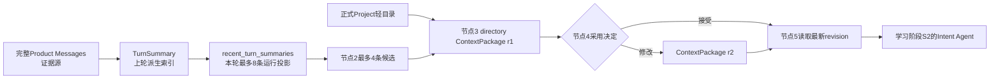

# recent_turn_summaries与ContextPackage为什么存在

**归档日期**：2026-07-29
**分类**：Context与回合沉淀
**关联源码**：

- [TurnSummary数据库模型](../../backend/app/governance/models.py)
- [最近摘要查询](../../backend/app/governance/queries.py)
- [Workflow运行状态合同](../../backend/app/workflows/continuous_chat_contracts.py)
- [主Workflow节点1-5](../../backend/app/workflows/continuous_chat.py)
- [ContextPackage数据库模型](../../backend/app/harness/models.py)
- [ContextPackage创建服务](../../backend/app/harness/service.py)
- [Context修改服务](../../backend/app/collaboration_contexts/service.py)

## 问题

`recent_turn_summaries`到底是什么？`ContextPackage`又是什么？为什么节点3要把前者变成后者并保存到
数据库，不能直接把摘要交给下一个节点或模型吗？

## 回答

先给结论：

- `recent_turn_summaries`是**当前Workflow内存里的一小叠“旧回合索引卡候选”**，不是表名，也不是长期记忆。
- `ContextPackage`是**这一次Product Run最终准备采用或排除哪些Context来源的版本化清单**。
- 节点3不是给同一批数据“换包装”。它在把**临时候选**升级成一份可审核、可修改、可恢复、可绑定Hash的
  产品对象，因此必须先写Product Store。

## 1. 先用一个具体例子

昨天你发过：

> 我想彻底掌握Chat，先从Context开始。

昨天那一轮结束时，系统仍完整保存原始User/Assistant Message；同时额外形成一张可检索的摘要卡：

```json
{
  "id": "summary-上一轮的ID",
  "topic": "掌握Chat的Context设计",
  "summary": {
    "confirmed_facts": ["先从Context开始"],
    "open_questions": ["ContextPackage为什么需要持久化"]
  },
  "status": "candidate",
  "summary_hash": "..."
}
```

今天你发：

> 继续讲它为什么要持久化。

系统不能只看“它”，也不能把全部历史重新塞给模型。于是：

1. 节点1从`turn_summaries`表读取最近最多8张摘要卡，放入运行时字段`recent_turn_summaries`。
2. 节点2用确定性关键词和未回答澄清规则，收窄到最多4张候选卡。
3. 节点3再读取正式Project轻量目录和其他Context Contributor，把所有候选来源统一成Context Item。
4. 节点3创建`ContextPackage revision 1`，记录哪些采用、哪些排除、各自来源、原因、Token估算和Hash。
5. 节点4让HITL策略决定自动记录还是请你审核；如果你排除一项，会创建revision 2。
6. 节点5从数据库重新读取最新revision，再把**确实被采用**的内容投影给意图节点。



图中每个箭头都表示“派生或投影”，不是把前一个对象改名后原地覆盖。

## 2. 5个相邻对象逐一拆开

| 对象 | 一句话 | 存在哪里 | 不是什么 |
|---|---|---|---|
| Product Message | 用户或系统当时真正说过的话 | `product_messages` | 不是摘要 |
| TurnSummaryRecord / TurnDigest | 一轮对话的可检索索引卡 | `turn_summaries` | 不是Accepted Memory，不会改Work |
| `recent_turn_summaries` | 本轮暂时拿到的最多8/4张摘要投影 | `CollaborationState`内存/Checkpoint | 不是数据库表，不是最终采用结果 |
| ContextPackageRecord | 本轮某阶段的Context清单Header | `context_packages` | 不是完整历史，不是Prompt本身 |
| ContextAdoptionRecord | 清单里每一项来源、正文、采用与原因 | `context_adoption_records` | 不是另一个Message副本的事实源 |

`Memory`还在这5个对象之外：只有经过候选和接受门、允许跨会话稳定复用的信息，才是Accepted Memory。
一张TurnSummary卡或本轮Context被采用，都不会自动升级成Memory。

## 3. recent_turn_summaries从哪里来

### 3.1 上一轮怎样产生摘要

当前主Workflow的`turn_summary_agent`生成摘要候选；`TurnSummaryPersistExecutor.persist()`调用
`ExecutionGovernanceService.save_turn_summary()`，规范化成TurnDigest v1并写入`turn_summaries`。
如果本轮没有形成模型摘要，代码会保存一份确定性的最小主题候选，而不是丢失本轮索引。

原始Message不会被删除。TurnSummary只是为了让下一轮不必扫描和发送全部历史。

### 3.2 下一轮怎样读取

`IntakeExecutor.accept()`调用：

```python
summaries = await self._governance.recent_turn_summaries(self._thread_id, limit=8)
```

查询按`created_at`倒序读取同一Product Session最近最多8行，然后转成普通`dict`放进：

```python
CollaborationState(
    origin_prompt=prompt,
    recent_turn_summaries=tuple(summaries),
)
```

这就是字段名的全部含义：

- `recent`：最近的；
- `turn`：之前一次Interaction/回合；
- `summaries`：派生摘要；
- 复数：它是一个有界集合，不是一段合并文本。

它只在这次Workflow运行期间充当候选工作集。正式来源仍是数据库里的TurnSummary行，完整证据仍是
Product Message。

## 4. ContextPackage比“摘要数组”多了什么

节点3调用`directory_context_items()`后，输入已经不只有摘要，还可能包括：

- 正式Project轻量目录；
- TurnSummary；
- Repository Snapshot或治理文档Manifest等Contributor来源；
- 每项来源revision、title、content、采用原因和Token估算。

`create_context_package()`把它们保存成一个Header和多条Item：

```text
context_packages
└── id, run_id, stage=directory, revision=1,
    token_budget=1800, estimated_tokens, package_hash, status=candidate

context_adoption_records
├── ordinal=0, source_kind=project_directory, adopted=true, reason=...
├── ordinal=1, source_kind=turn_summary, adopted=true, reason=...
└── ordinal=2, source_kind=repository_manifest, adopted=false, reason=超出预算
```

这时它已不只是“给模型的几段文字”，而是一份回答下列问题的产品清单：

1. 这次考虑过哪些来源？
2. 实际采用了哪些？
3. 哪些被排除，为什么？
4. 来源是哪一版？
5. 预计占多少Token？
6. 用户是否修改过？
7. 后续Approval绑定的是哪一个内容Hash？

## 5. 为什么必须持久化

### 原因1：用户审核必须有稳定对象

节点4暂停后，用户可能过5分钟甚至后端换进程才点击“排除这条摘要”。如果Context只在原Python变量里，
系统无法证明用户改的是哪一版内容。

### 原因2：修改必须产生revision和新Hash

用户排除/新增来源时不能原地覆盖历史。`CollaborationContextService.revise_package()`创建新行，旧行标为
`superseded`；新`package_hash`会使绑定旧Context的Draft、Grant或恢复链接失效。

### 原因3：Checkpoint恢复不能依赖旧进程内存

MAF Checkpoint告诉系统Workflow暂停在哪里，但最新Context产品事实由Product Store拥有。节点5按
`run_id + stage`重新读取最新revision，避免恢复后继续使用过期候选。

### 原因4：事后必须解释模型为何得到这个结果

只保存最终回答无法回答“当时采用了哪个Project、哪张摘要、排除了什么”。持久ContextPackage让Trace、
审批和故障排查引用同一对象。

### 原因5：Token预算要在发送前成为确定事实

是否因预算排除某项在建包时就确定，并连同原因保存。不能等Provider请求已经组装后临时截断，否则用户
看到的Context、Approval Hash和真正发送内容可能不一致。

## 6. 3个看似更简单但不成立的方案

### 方案A：每次直接发送全部历史

问题是Token持续增长、旧话题污染当前任务，用户也无法明确排除某段历史。

### 方案B：只把recent_turn_summaries留在内存

普通直通调用也许能工作，但遇到HITL暂停、进程重启、用户修改或审计时就失去稳定版本和来源。

### 方案C：把它全交给MAF Checkpoint保存

Checkpoint属于MAF运行时恢复，不是用户可管理的产品事实。用它承载Context会把运行引擎变成第二个
产品数据库，REST查询、权限、版本和跨Run追溯都会混乱。

## 7. 从代码按时间顺序追

| 顺序 | 符号 | 看到什么 |
|---:|---|---|
| 1 | `TurnSummaryPersistExecutor.persist` | 上一轮摘要候选落库 |
| 2 | `RunGovernanceQueryService.recent_turn_summaries` | 从`turn_summaries`取最近行 |
| 3 | `IntakeExecutor.accept` | 放入`CollaborationState.recent_turn_summaries` |
| 4 | `CandidateContextExecutor.select_candidates` | 最多8条收窄为4条 |
| 5 | `HarnessContextQueryService.directory_context_items` | 摘要与Project/Contributor统一成Item |
| 6 | `HarnessDirectoryContextExecutor.assemble` | 调用建包并保存package ID |
| 7 | `HarnessService.create_context_package` | 同事务写Header、Items、Command、Trace/Outbox |
| 8 | `ProductDecisionExecutor`的`context_adoption`规格 | 审核、修改、跳过或取消 |
| 9 | `CollaborationContextService.revise_package` | 修改时创建新revision并失效依赖 |
| 10 | `HarnessContextRevisionExecutor.project` | 从Product Store投影最新采用集合 |

最后一个方法的实际handler名可能随重构变化；稳定定位方式是搜索类名
`HarnessContextRevisionExecutor`和调用`context_package_for_run`的位置，不只依赖行号。

## 8. 亲手验证

完整断点和只读SQL见[第1课：从点击发送到ContextPackage](../调试实战/第1课-从点击发送到ContextPackage.md)。
最关键的3个观察是：

1. `recent_turn_summaries`只在`CollaborationState`里变化，数据库`turn_summaries`旧行不被改写。
2. 节点3结束后，`context_packages`新增Header，`context_adoption_records`新增全部采用/排除Item。
3. 用户修改后不是更新原Header，而是新增revision；节点5读回的ID/Hash和运行态采用集合随之变化。

## 9. 掌握验收

不看本文，尝试回答：

1. 为什么原始Message、TurnSummary和Accepted Memory不能合并成一张表或一个概念？
2. `recent_turn_summaries`是数据库事实还是运行时投影？其权威来源在哪里？
3. 如果节点3不持久化ContextPackage，节点4等待用户两分钟期间后端重启，会丢失哪4类保证？
4. 用户排除一条摘要后，为什么必须创建新revision而不是改一个布尔值？
5. 给你一个`context_package_id`，你能否查出它考虑过、采用和排除了什么，并定位来源版本？

能独立回答并完成调试实验，才算达到本专题L2掌握。

## 关键文件

| 文件 | 职责 |
|---|---|
| [governance/models.py](../../backend/app/governance/models.py) | `TurnSummaryRecord`表模型 |
| [governance/queries.py](../../backend/app/governance/queries.py) | 最近摘要只读查询 |
| [continuous_chat_contracts.py](../../backend/app/workflows/continuous_chat_contracts.py) | `CollaborationState`运行时合同 |
| [continuous_chat.py](../../backend/app/workflows/continuous_chat.py) | 节点1-5的读取、筛选、建包、审核与投影 |
| [harness/models.py](../../backend/app/harness/models.py) | ContextPackage Header与Item表模型 |
| [harness/service.py](../../backend/app/harness/service.py) | 初次ContextPackage事务 |
| [collaboration_contexts/service.py](../../backend/app/collaboration_contexts/service.py) | 用户修改时的新revision与依赖失效 |

## 补充记录

（暂无）
